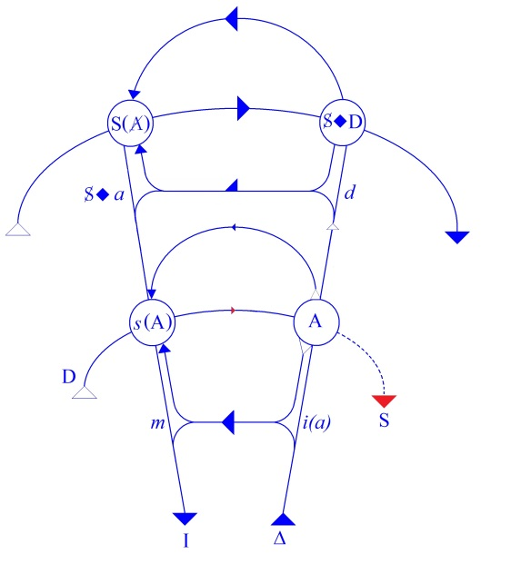

# Leçon 27 | 6 Juillet 1960

<!-- source-url: http://staferla.free.fr/S7/S7 L'ETHIQUE.docx -->
<!-- seminar: s7 -->
<!-- lesson: 27 -->

<!-- id: s7-27-0001 -->

Nous voici à notre dernier entretien sur ce que j’ai cru pouvoir avancer devant vous concernant *l’Éthique de la psychanalyse*. Pour les conclure, ces entretiens, je vais vous proposer aujourd’hui un certain nombre de remarques, les unes conclusives, les autres d’expérience suggestive, et je pense aussi laisser ouverte l’indication que nous n’avons pas clos - je pense que vous ne vous en étonnerez pas - notre discours. Bref, il n’est pas facile de trouver un médium quand il s’agit de terminer sur un sujet par essence excentrique. Disons que ce que je vous apporte aujourd’hui, c’est un *mixed grill*.

<!-- id: s7-27-0002 -->

Donc, l’éthique, en somme - il faut toujours repartir des définitions - consiste essentiellement, comme éthique, en un jugement sur notre action, à ceci près qu’elle n’a de portée que pour autant que cette action, impliquée en elle, comporte jugement. Elle est en tous cas toujours censée comporter ce jugement implicite, dès lors qu’on se mêle de porter des jugements sur l’action, c’est-à-dire de faire de l’éthique. La présence du jugement des deux côtés de cet objet est essentielle à la structure.

<!-- id: s7-27-0003 -->

S’il y a *une éthique de la psychanalyse* - la question se pose - c’est précisément pour autant qu’en quelque façon, si peu que ce soit, l’analyse peut nous apporter quelque chose, ou simplement le prétend, qui se pose comme mesure de notre action. Bien sûr, et c’est un moment déjà depuis longtemps périmé, l’idée peut venir à première inspection que cette mesure de notre action, elle va nous proposer comme *un retour à nos instincts*. Il y en a peut-être encore quelques uns, par ci par-là, à qui *cela peut faire peur*.

<!-- id: s7-27-0004 -->

À la vérité j’ai même entendu, dans une société philosophique, quelqu’un qui m’a apporté des objections de cette espèce qui me paraissaient évanouies depuis une quarantaine d’années. À la vérité tout le monde est assez rassuré sur ce sujet. Je veux dire que personne ne songe à craindre un ravalement moral de cette espèce dans la suite de l’analyse.

<!-- id: s7-27-0005 -->

Mais ce qui s’est passé, vous montrai-je souvent, le soulignant, c’est que ce qu’elle semble avoir fait dans le fait, en bâtissant, si je puis dire, ces instincts, en en faisant la loi naturelle de la réalisation de l’harmonie morale, prend la tournure d’un *alibi* assez inquiétant, d’*esbrouffe* moralisante, d’un *bluff* dont je crois qu’on ne saurait trop montrer les dangers. C’est ici un lieu commun, je ne m’y arrête donc pas plus.

<!-- id: s7-27-0006 -->

Pour nous tenir à ce qui peut se dire au premier pas, c’est que tout de même depuis longtemps chacun sait que ce qu’il y a de plus modeste dans l’analyse, c’est qu’elle procède par un retour au sens de cette action. Et voilà qui, à soi seul, justifie que nous soyons dans la dimension morale : c’est que l’homme - sain ou malade - l’hypothèse freudienne de l’inconscient, suppose que ce qui fait son action, quelle qu’elle soit, normale ou morbide, a un sens caché auquel on peut aller.

<!-- id: s7-27-0007 -->

Et dans cette dimension se conçoit d’emblée la notion d’une κάθαρσις \[catharsis\] qui ne veut dire, dans cet ordre, que *purification*, ce qui veut dire *décantation*, *isolement de plans*. Il y a, à ce qui se passe à un niveau de vécu, un sens plus profond qui le guide, auquel on peut accéder. Les choses ne doivent pas être les mêmes quand les deux couches sont séparées. Voilà ce qui n’est pas une découverte il me semble. Et il y a la position minimale, celle qui, heureusement, ne me paraît pas trop obscurcie dans la notion commune qu’on peut avoir de l’analyse. Cela ne va pas tellement loin. Je dirai presque que ça rejoint une forme excessivement générale de toute espèce de *progrès* qu’on peut appeler « *intérieur* ». C’est vraiment la forme embryonnaire d’un très vieux « γνῶθι σεαυτόν » et évidemment avec un accent tout de même particulier.

<!-- id: s7-27-0008 -->

Simplement déjà là, se met à sa place ce qui justifie ce sur quoi j’ai insisté tellement cette année, à savoir une abrupte différence apportée par l’expérience analytique, en tout cas par la pensée freudienne, et qui consiste en ceci : c’est qu’une fois opéré ce retour au sens, une fois le sens profond libéré, c’est-à-dire simplement séparé, κάθαρσις \[catharsis\] au sens de *décantation*, c’est aussi la question que les gens du commun se posent et à laquelle nous répondons d’une façon plus ou moins directe, une fois cette affaire faite, tout va-t-il tout seul ?

<!-- id: s7-27-0009 -->

Et pour *mettre les points sur les « i »*, n’y a-t-il plus que bienveillance ? Cela nous met sur la plus vieille question. Un nommé MENCIUS, comme l’ont appelé les jésuites, nous dit que la question de la bienveillance de l’homme se juge de la façon suivante : sa bienveillance est naturelle à l’origine, elle est comme une montagne couverte d’arbres. Seulement, il y a des habitants dans les environs qui ont commencé par couper les arbres, le bienfait de la nuit est de rapporter un nouveau foisonnement de surgeons, mais au matin les troupes viennent qui les dévorent, et finalement la montagne est une surface chauve sur laquelle rien ne pousse.Vous voyez que le problème ne date pas d’hier. Ce n’est pas pour rien que je vous parle de MENCIUS. Nous aurons à y revenir.

<!-- id: s7-27-0010 -->

Quoi qu’il en soit, cette bienveillance pour nous, par l’expérience, est si peu assurée, que c’est précisément autour de ce qu’on appelle pudiquement *la réaction thérapeutique négative*, c’est de ce que, d’une façon plus relevée par sa généralité littéraire, je vous ai appelé la dernière fois *la malédiction assumée* que nous partons, de la malédiction consentie du μὴ ϕῦναι \[mé phunai\] d’ŒDIPE \[Sophocle : *Œdipe à Colone*\].

<!-- id: s7-27-0011 -->

Non que le problème ne reste entier et que tout ce qui se décide se décide au-delà du retour au sens. Ce dans quoi je vous ai incité à entrer comme en une expérience mentale, « *experimentum mentis »* comme dit GALILÉE...

<!-- id: s7-27-0012 -->

> contrairement à ce que vous croyez, il avait beaucoup plus d’expérience mentale que de laboratoire,
>
> en tout cas il n’aurait certainement pas fait le pas décisif qu’il a fait sans l’expérience mentale

<!-- id: s7-27-0013 -->

...cet *experimentum mentis* que je vous propose ici, parce que je crois que c’est celui qui est dans la droite ligne de ce à quoi nous incite l’analyse, je veux dire notre expérience, quand nous essayons non pas de la ramener à un commun dénominateur, à une commune mesure, la faire rentrer dans les tiroirs déjà établis, mais de l’articuler dans sa topologie propre, dans sa structure propre, je vous assure que cela suppose ce dont je vous ai déjà désigné la place, le [ru](http://www.cnrtl.fr/definition/ru) où se situe le désir.

<!-- id: s7-27-0014 -->

Ce que je vous ai proposé, donc, le long de mon discours de cette année comme un *experimentum mentis*, c’est ceci, *c’est de prendre* comme ce que j’ai appelé « *la perspective du jugement dernier* », de prendre comme étant l’étalon, cette révision de l’éthique à quoi nous incite l’analyse, proprement le rapport de l’action au désir qui l’habite. Et, pour vous le faire entendre, j’ai pris l’exemple, le support de la tragédie. En quoi j’avais une suffisante garantie dans le fait que cette référence n’est pas évitable, et pour la simple preuve qui peut en être donnée que précisément, dès ses premiers pas, FREUD a dû la prendre.

<!-- id: s7-27-0015 -->

La question éthique de l’analyse se pose, non dans une spéculation d’ordonnance, d’arrangement, de ce que j’appelle « *service des biens* », mais à proprement parler implique cette dimension qui s’exprime dans ce qu’on appelle « *l’expérience tragique de la vie* ». C’est dans la dimension tragique que s’inscrivent les actions et que nous sommes sollicités de nous repérer quant aux valeurs. C’est aussi bien d’ailleurs dans *la dimension comique*, et aussi bien quand j’ai commencé de vous parler des *formations de l’inconscient*, vous le savez, c’est *le comique* que j’avais à l’horizon.

<!-- id: s7-27-0016 -->

Disons que ce rapport de l’*action,* au *désir* qui l’habite dans la dimension tragique se situe, s’exerce dans le sens, disons en première approximation, d’un triomphe de la mort. C’est le caractère fondamental de toute action tragique. Je vous ai appris à rectifier, à corriger : triomphe de « *l’Être pour la mort* ». Qu’importe le μὴ ϕῦναι \[mé phunai\] tragique : ce μὴ, cette négation est identique à l’entrée du sujet comme tel sur le support du signifiant.

<!-- id: s7-27-0017 -->

Pour le comique, en première approximation, c’est, sinon le triomphe, du moins le jeu futile, dérisoire de la vision. Là aussi, et si nous y regardons de plus près, si dans ce comique, si peu que j’ai pu jusqu’à présent l’aborder devant vous, vous voyez bien que ce dont il s’agit, c’est aussi le rapport de l’action au désir et de son échec fondamental à le rejoindre.

<!-- id: s7-27-0018 -->

Ce qui crée *la dimension comique*, c’est quelque chose qui est marqué par la présence, au centre, d’un signifiant caché. Mais, je vous l’ai dit, dans l’ancienne comédie, il est là en personne *le phallus*. Mais peu importe qu’on nous l’escamote par la suite, simplement il faut que nous nous souvenions que dans la comédie, ce qui nous satisfait, qui nous fait rire, qui nous la fait apprécier dans sa pleine dimension humaine, à savoir l’inconscient non excepté, c’est non pas le triomphe de la vie, mais *que la vie* \[ϕ\]*s’y glisse, si l’on peut dire, se dérobe, fuit, échappe à tout ce qui lui est opposé de barrière,* *et précisément des plus essentielles, celles qui sont constituées par l’instance du signifiant.*

<!-- id: s7-27-0019 -->

Ce que *le phallus* signifie lui aussi, c’est qu’il n’est rien d’autre qu’un signifiant, c’est le signifiant de cette échappée, de ce triomphe du fait que la vie passe tout de même, quoi qu’il arrive : quand le héros comique même a trébuché, est tombé dans la mélasse, eh bien, quand même petit bonhomme vit encore.

<!-- id: s7-27-0020 -->

Voilà dans quelle dimension...

<!-- id: s7-27-0021 -->

> dont le pathétique, vous le voyez, est exactement l’opposé, le pendant du tragique,
>
> et après tout pas incompatible, le tragi-comique existe

<!-- id: s7-27-0022 -->

…gît l’expérience de l’action humaine.

<!-- id: s7-27-0023 -->

Et c’est parce que nous savons mieux que ceux qui nous ont précédé, reconnaître la nature du désir qui est au cœur de cette expérience, qu’une révision éthique est possible, qu’un jugement éthique est possible, qui répercute cette valeur de « *jugement dernier* » : « *Avez-vous agi conformément au désir qui vous habite ?* » Ceci n’est pas une question facile à soutenir. C’est une question - je le prétends - qui n’a jamais été posée dans cette pureté ailleurs qu’elle ne peut l’être, c’est-à-dire dans le contexte analytique.

<!-- id: s7-27-0024 -->

À ce pôle du désir s’oppose la tradition, non pas dans son entier bien sûr - rien n’est nouveau et tout l’est, dans l’articulation humaine - mais ce que j’ai voulu, à l’opposé, vous faire sentir, et justement en prenant dans une tragédie l’exemple de *l’antithèse du héros tragique* qui, comme antithèse, ne participe pas moins dans la tragédie d’un certain caractère héroïque, et c’est CRÉON, sur ce support, autour de ce support, je vous l’ai rappelé aussi, préparé par un rappel : je vous ai parlé de ce qu’on appelle la position du « *service des biens* ».

<!-- id: s7-27-0025 -->

Cette position du « *service des biens* » est la position de *l’éthique traditionnelle*. Tout ce qui est *ravalement du désir*, toute *cette modestie*, *ce tempérament, cette voie médiane* que nous voyons si éminemment remarquablement articulée dans ARISTOTE, il s’agit de savoir de quoi elle prend mesure, si sa mesure peut être quelque part fondée.

<!-- id: s7-27-0026 -->

Il suffit d’un examen articulé et attentif pour voir que sa mesure est toujours profondément marquée d’ambiguïté. En fin de compte, *l’ordre des choses* sur lequel elle entend, elle prétend se fonder, *c’est l’ordre du pouvoir*, d’un pouvoir trop humain, et non pas parce que nous disons qu’il est *humain* et *trop humain* \[Nietzsche\], mais parce qu’il ne peut pas même faire trois pas pour s’articuler, sans dessiner la [*circonvallation*](http://littre.reverso.net/dictionnaire-francais/definition/circonvallation) qui la serve du lieu où règne, disons-nous, le déchaînement des signifiants et où pour ARISTOTE il s’agit du caprice des dieux, pour autant qu’à ce niveau dieux et bêtes se réunissent pour signifier le monde de l’impensable. Certainement, ce dieu n’est pas le premier moteur. Il s’agit des dieux de la mythologie. Nous savons depuis, quant à nous, réduire ce déchaînement du signifiant. Mais ce n’est pas parce que nous l’avons mis presque tout entier, notre jeu, sur le *Nom du Père*, que la question en est simplifiée.

<!-- id: s7-27-0027 -->

Donc voyons-le bien, la morale d’ARISTOTE, c’est tout à fait clair - cela vaut la peine d’aller y voir de près - se fonde toute entière sur *un ordre* d’ailleurs arrangé, idéal, mais qui tout de même est celui qui répond à la politique de son temps, je veux dire au point où les choses étaient structurées dans la cité. *Sa morale est une morale du maître*, faite pour les vertus du maître, elle est essentiellement liée à un ordre des pouvoirs. L’ordre des pouvoirs n’est point à mépriser. Ce ne sont point ici à vous tenir propos d’*anarchisme*, simplement il faut en savoir la limite concernant le champ offert à notre *investigation*, à notre *réflexion*.

<!-- id: s7-27-0028 -->

Concernant ce dont il s’agit, à savoir ce qui se rapporte au désir, à son arroi et à son désarroi, la position du pouvoir...

<!-- id: s7-27-0029 -->

quel qu’il soit, en toute circonstance, dans toute incidence historique, ou pas

<!-- id: s7-27-0030 -->

...a toujours été la même, c’est celle d’ALEXANDRE arrivant à Persépolis, ou d’HITLER arrivant à Paris. C’est la proclamation suivante - le préambule, peu importe - : « *Je suis venu vous libérer.* » *de ceci* ou *de cela*, peu importe. L’essentiel est ceci :

<!-- id: s7-27-0031 -->

« *Continuez à travailler, que le travail ne s’arrête pas* ».

<!-- id: s7-27-0032 -->

Ce qui veut dire :

<!-- id: s7-27-0033 -->

« *Qu’il soit bien entendu que ce ne soit pas là en aucun cas une occasion de manifester le moindre désir* ».

<!-- id: s7-27-0034 -->

La morale du pouvoir, du « *service des biens* », est comme telle :

<!-- id: s7-27-0035 -->

« *Pour les désirs, vous repasserez, qu’ils attendent* ».

<!-- id: s7-27-0036 -->

Cela vaut la peine qu’on trace la ligne de démarcation par rapport à laquelle les questions peuvent se poser dans un esprit qui marque un terme essentiel, qui a une fonction linéaire dans l’articulation de la philosophie, celui de KANT. Il nous rend le plus grand service, simplement de poser cette borne topologique qui distingue le phénomène moral, je veux dire le champ qui intéresse le jugement moral comme tel, en le purifiant, c’est la κάθαρσις \[catharsis\].

<!-- id: s7-27-0037 -->

Opposition catégorielle limite, purement idéale, mais il est essentiel que quelqu’un un jour l’ait articulé en le purifiant de tout intérêt qu’il appelle pathologique, *pathologisches*, ce qui ne veut pas dire que ce soient des intérêts liés à la pathologie mentale, mais qu’il s’agit simplement d’un intérêt humain, sensible, vital quelconque. Pour qu’il s’agisse du champ qui peut être valorisé comme proprement *éthique*, il faut que nous n’y soyons, par aucun biais, intéressé en rien.

<!-- id: s7-27-0038 -->

Un pas est franchi quand même. La morale traditionnelle s’installait dans ce qu’on devait faire dans la mesure du possible, comme on dit encore, et comme on est bien forcé de le dire. Ce qu’il y a à démasquer, *c’est que le point pivot par où elle se situe ainsi, c’est l’impossible* où nous reconnaissons la topologie de notre désir. Le franchissement nous est donné par KANT. Il nous dit :

<!-- id: s7-27-0039 -->

« *L’impératif moral ne se préoccupe pas de ce qui se peut ou ne se peut pas.* »

<!-- id: s7-27-0040 -->

Le témoignage de l’obligation, en tant qu’elle nous impose la nécessité d’une raison pratique, c’est un « *Tu dois* » inconditionnel. C’est fort intéressant pour nous, parce que ce que je vous ai montré, c’est que ce champ prend sa portée, précisément, du vide où le laisse, à l’appliquer en toute rigueur, la définition kantienne, et que cette place où nous, analystes, nous pouvons dire que c’est la place occupée par *le désir*. Le cœur, le centre du *désir éthique*, c’est le problème de cette mesure incommensurable, de *ce renversement qui met en place*, au centre, le départ de quelque chose qui se pose comme *une mesure infinie et qui s’appelle le désir.*

<!-- id: s7-27-0041 -->

Je vous ai montré combien, aisément, au « *Tu dois* » de KANT se substitue le fantasme sadien de *la jouissance* érigée en impératif, pur fantasme bien sûr, et presque dérisoire, mais qui n’exclut nullement la possibilité de l’érection ici d’une *loi universelle*. C’est bien la portée du commentaire sadien. Ici tout de même, arrêtons-nous, et pour voir ce qui reste toujours à l’horizon. Car aussi bien, si KANT n’avait fait que nous désigner ce point crucial, tout serait bien. Mais on voit aussi sur quoi se termine l’horizon de la *raison pratique* : sur le respect et l’admiration que lui inspire *ce ciel étoilé au-dessus* de nous et *cette loi morale au-dedans*.

<!-- id: s7-27-0042 -->

On peut se demander pourquoi *le respect* et *l’admiration* suggèrent un rapport personnel et c’est bien là que tout est à la fois subsistant et démystifié, subsistant quoique démystifié. C’est ici je crois que les remarques qui sont celles que je vous propose concernant le fondement qui nous est donné par l’expérience analytique de *la dimension du sujet dans le signifiant* sont essentielles. Permettez-moi de vous l’illustrer rapidement pour dire ici ce que je veux dire.

<!-- id: s7-27-0043 -->

KANT prétend trouver la preuve singulière, renouvelée de l’immortalité de l’âme en ceci, c’est que ces exigences de l’action morale, rien ici bas ne saurait les satisfaire, et que donc, c’est pour autant qu’elle sera restée sur sa faim qu’il lui faut une vie au-delà pour que cet accord inachevé puisse trouver quelque part, on ne sait où, sa résolution.

<!-- id: s7-27-0044 -->

Qu’est-ce que tout ceci veut dire ? *Ce respect et cette admiration pour les cieux étoilés* peut être encore un instant de l’histoire fragile. A-t-il pu encore subsister à l’époque de KANT quelque chose qui, pour nous, ne nous semble-t-il pas, à considérer ce vaste univers que nous sommes plutôt en présence d’un vaste chantier en construction, de nébuleuses diverses, avec un coin bizarre, celui que nous habitons, qui ressemble un peu, comme on l’a toujours montré, à une montre ici abandonnée dans un coin ?

<!-- id: s7-27-0045 -->

Mais à part cela il est clair, évident, simple, que nous regardions s’il n’y a personne, si tant est, bien sûr, que nous donnions son sens à ce qui peut y constituer une présence, et il n’y a pas d’autre sens articulable à cette présence divine, sinon celle qui nous sert pour critère du sujet, à savoir la dimension du signifiant.

<!-- id: s7-27-0046 -->

Les philosophes peuvent spéculer sur cet *Être* dont l’acte et la connaissance se confondent, la tradition religieuse, elle, ne s’y trompe pas. Elle n’a, à proprement parler, droit à *la reconnaissance* d’une ou plusieurs personnes divines que de ce qui peut s’articuler dans une révélation.

<!-- id: s7-27-0047 -->

Une seule chose peut faire que pour nous les espaces soient habités par une personne transcendante, c’est que ce soit dans les cieux que nous apparaisse le signal...

<!-- id: s7-27-0048 -->

> et non pas le signal au sens de la théorie de la communication qui passe son temps à nous raconter
>
> qu’on peut interpréter en termes de signes ce qui se véhicule à travers l’espace de rayons avertisseurs

<!-- id: s7-27-0049 -->

...que nous commencerions à nous apercevoir que quelque chose habite les espaces, et si nous prenons ces espaces, vous allez le voir, au nom de quels mirages créés par la distance, car justement, si c’était près, ça serait évident, parce que cela nous vient de très loin on croit que c’est un message que nous recevons des astres à des trois cents années lumières.

<!-- id: s7-27-0050 -->

D’où qu’ils viennent, ce n’est pas plus un message que quand nous regardons cette bouteille. Ce qui en serait un, c’est, si à quelque explosion d’étoile se passant à ces myriades distancielles, correspondait quelque part quelque chose qui s’inscrirait sur le Grand Livre, en d’autres termes, qui ferait de ce qui se passe une réalité.

<!-- id: s7-27-0051 -->

Un certain nombre d’entre vous, récemment, ont vu un film dont je n’ai pas été complètement enchanté...

<!-- id: s7-27-0052 -->

mais avec le temps, je reviens sur mon impression. Il y a de bons détails

<!-- id: s7-27-0053 -->

...c’est le film de DASSIN[^77].

<!-- id: s7-27-0054 -->

Dans le film de DASSIN, de temps en temps le personnage qui nous est présenté comme merveilleusement lié à l’immédiateté de ses sentiments, prétendus primitifs, dans un petit bar du Pirée, se met à casser la gueule à ceux qui l’entourent pour ne pas avoir parlé convenablement, c’est-à-dire selon les normes morales du personnage, à d’autres moments, il prend un verre pour marquer l’excès de son enthousiasme et de sa satisfaction et le fracasse sur le sol.

<!-- id: s7-27-0055 -->

Chaque fois qu’un de ces fracas se produit, nous voyons - je trouve cela très beau et même génial - s’agiter frénétiquement ce qu’on appelle *le comptabilisateur*, *la caisse enregistreuse*. Et c’est cette caisse qui définit la structure à laquelle nous avons affaire.

<!-- id: s7-27-0056 -->

Et ce qui fait qu’il peut y avoir désir humain et que ce champ existe, c’est cette supposition que pour nous, pour compter, tout ce qui se passe de réel est *comptabilisé quelque part*.

<!-- id: s7-27-0057 -->

KANT a pu réduire à sa pureté toute l’essence du champ moral en son point central, il reste - et ce n’est rien d’autre que signifie l’horizon de son immortalité de l’âme - qu’il faut qu’il y ait quelque part place pour la comptabilisation.

<!-- id: s7-27-0058 -->

Nous n’avons pas été assez emmerdés sur cette terre avec le désir, il faut qu’une partie de l’éternité s’emploie à faire de tout cela les comptes. Bien entendu, dans ces fantasmes, ne se projette rien d’autre que précisément ce rapport structural, celui que j’ai essayé d’inscrire à vos yeux sur *le graphe* avec la ligne du signifiant.

<!-- id: s7-27-0059 -->

<!-- id: s7-27-0060 -->

C’est en tant que le sujet se situe, et se constitue par rapport au signifiant, que se produit en lui cette rupture, cette division, cette ambivalence au niveau de laquelle se place la tension du désir, à ceci près, nous pouvons voir que le film auquel j’ai fait allusion à l’instant et qui - je ne l’ai appris qu’après, est joué par le metteur en scène : c’est DASSIN qui joue le rôle de l’Américain - nous présente un bien joli, curieux modèle de quelque chose qui, du point de vue structural, peut s’exprimer ainsi : c’est à savoir que celui qui joue en position de satire - je veux dire en position satirique - le personnage qui est à proposer à la dérision, DASSIN nommément, en tant qu’il joue l’américain, se trouve, en tant que *producer*, personnage qui a conçu le film, dans une position plus américaine que ce qu’il livre à la dérision, à savoir que les américains eux-mêmes.

<!-- id: s7-27-0061 -->

Entendez-moi bien. Il est là entreprenant *la rééducation*, voire le salut d’une aimable fille publique et *l’ironie* du scénariste nous le montre dans la position de se trouver, dans cette œuvre pie, à la solde de celui qu’on peut appeler le grand-maître du bordel. Comme il convient, ce n’est pas quelque sens profond de sa figure...

<!-- id: s7-27-0062 -->

> nous le savons, et il nous le signale assez pour ne pas le savoir
>
> en nous mettant sous les yeux une énorme paire de lunettes noires

<!-- id: s7-27-0063 -->

...que c’est celui, et pour cause, dont personne ne voit jamais la figure.

<!-- id: s7-27-0064 -->

Bien sûr, au moment où la fille apprend que c’est ce personnage, lequel est son ennemi juré, qui paie les frais de la fête, elle nous vide la belle âme de l’américain en question qui se retrouve quinaud après avoir conçu les plus grands espoirs. Ce qui est amusant est évidemment ceci : c’est que s’il y a quelque dimension, dans *ce symbolisme,* de critique sociale, à savoir que ce n’est rien d’autre que les forces de l’ordre, si je puis dire, qui se dissimulent derrière le bordel.

<!-- id: s7-27-0065 -->

Il y a sans doute quelque naïveté à montrer - en queue du scénario et de l’histoire - que ce qu’on espère dans la question, c’est qu’il suffirait de la suppression du bordel pour résoudre la question des rapports entre la vertu et le désir. Je veux dire que, perpétuellement, dans ce film court cette ambiguïté véritablement fin du dernier siècle, qui consiste à confondre l’antiquité avec le champ du désir libre, si l’on peut dire, d’en être encore à Pierre LOUŸS[^78] et de croire que c’est ailleurs que dans sa position que l’aimable putain athénienne peut concentrer sur elle tout le feu des mirages au centre desquels elle se trouve.

<!-- id: s7-27-0066 -->

Reprenons donc notre thème. Pour tout dire, DASSIN n’a pas à confondre ce qu’il y a d’*effusif* à la vue de cette aimable silhouette avec un retour à la morale aristotélicienne, dont *heureusement*, on ne nous donne pas là la leçon détaillée. Revenons à notre voie, et à ceci qui nous montre qu’à l’horizon de la culpabilité, pour autant qu’elle occupe le champ du désir, il y a ces chaînes, ces limites de la comptabilité permanente. Ceci est tout à fait *indépendant* d’aucune articulation qui puisse lui en être donnée. Une part du monde s’est orientée d’une façon résolue dans *le service des biens*, rejetant tout ce qui concerne le rapport de l’homme au désir, dans ce qu’on appelle *la perspective post-révolutionnaire*.

<!-- id: s7-27-0067 -->

Assurément, la seule chose qu’on puisse dire, c’est qu’on n’a pas l’air de se rendre compte qu’en formulant les choses ainsi, on ne fait que perpétuer ce que je vous ai appelé tout à l’heure la tradition éternelle du pouvoir, à savoir : « *Continuons à travailler, pour le désir, vous repasserez*... ». Mais qu’importe.

<!-- id: s7-27-0068 -->

Dans cette tradition, laquelle, je vous le dis, pose une question, je veux dire que l’horizon communiste ne se distingue, ne peut se distinguer de celui de CRÉON, de celui de la cité, de celui qui distingue amis ou ennemis en fonction du bien de la cité, il ne s’en distingue qu’à supposer - ce qui n’est pas rien en effet - que le champ des biens, au service desquels nous avons à nous mettre, n’englobe à un certain moment tout l’univers. En d’autres termes, cette opération ne se justifie que pour autant qu’à l’horizon nous avons *l’État universel*.

<!-- id: s7-27-0069 -->

Rien pourtant ne nous dit qu’à cette limite, le problème qui subsiste, qui subsiste même dans la conscience de ceux qui vivent dans cette perspective, puisque, ou bien ils laissent entendre que les valeurs proprement étatiques de l’État, à savoir *l’organisation et la police* s’évanouiront, ou bien ils introduisent un terme comme celui *d’État universel concret*, ce qui ne veut rien dire d’autre qu’à ce moment les choses changeront au *niveau moléculaire,* je veux dire que quelque chose sera profondément changé au rapport qui constitue la position de l’homme en face des biens, pour autant que jusqu’à maintenant, là n’est pas son désir.

<!-- id: s7-27-0070 -->

Eh bien, quoi qu’il en soit de cette perspective, *le signe* même qui montre qu’en tout cas dans *le chemin* qu’elle nous propose, rien structuralement n’est changé, est assurément ceci, c’est que, quoique de façon orthodoxe, la présence divine en soit absente, la comptabilité ne l’est assurément pas. Et ceci se voit à ce thème tout à fait précis, qu’à cet inexhaustible qui nécessite pour KANT encore l’immortalité de l’âme s’est substitué dans cette perspective la notion de culpabilité objective, notion bel et bien articulée comme telle et qui nous montre qu’en tout cas, du point de vue structural, rien dans ce champ n’est résolu.

<!-- id: s7-27-0071 -->

Je pense avoir assez fait le tour de cette opposition du centre désirant avec *le service des biens* sur lequel procède, s’avance, mon discours. Prenons donc au vif du sujet ces propositions que j’avance devant vous au titre expérimental, formulons-les en manière de paradoxe, voyons ce que ça donne, au moins pour des oreilles d’analystes.

<!-- id: s7-27-0072 -->

Je propose que la seule chose dont on puisse être coupable, au moins dans la perspective analytique, c’est d’*avoir cédé sur son désir*. Cette proposition, recevable ou non dans telle ou telle éthique, a tout de même cette importance d’exprimer assez bien ce que nous constatons dans *notre expérience*, c’est qu’au dernier terme, ce dont - de façon recevable ou non pour *le directeur de conscience -* le sujet se sent effectivement coupable, et quand il fait de la *culpabilité*, c’est toujours, à l’origine, à la racine, pour autant qu’*il a cédé sur son désir*.

<!-- id: s7-27-0073 -->

Allons plus loin. Souvent *il a cédé sur son désir pour le bon motif et même pour le meilleur*. Ceci non plus n’est pas pour nous étonner. Depuis que *la culpabilité* existe, on a pu s’apercevoir déjà depuis longtemps que cette question du *bon motif*, de *la bonne intention*, pour constituer certaines zones de l’expérience historique, pour avoir été promue au premier plan des discussions de théologie morale, disons au temps d’ABÉLARD, n’en ont pourtant pas laissé les gens plus avancés, c’est à savoir que la question, à l’horizon, se reproduit toujours la même, et c’est bien pour cela que les chrétiens de la plus commune observance ne sont jamais bien tranquilles.

<!-- id: s7-27-0074 -->

Car s’il faut faire les choses « *pour le bien* », et c’est ce qui se passe en pratique, c’est bel et bien qu’on a toujours à se demander pour le bien *de qui*, et qu’à partir de là les choses ne vont pas toutes seules. Faire les choses au nom du bien, et plus encore au nom du bien de l’autre, voilà qui est bien loin de nous mettre à l’abri non seulement de la culpabilité, mais de toutes sortes de catastrophes intérieures, en particulier certainement pas à l’abri de *la névrose* et de ses conséquences.

<!-- id: s7-27-0075 -->

Si *l’analyse* a un sens et si le désir est ce qui supporte le thème inconscient, l’articulation propre de ce qui nous fait nous enraciner dans une destinée particulière - laquelle exige avec insistance que sa dette soit payée - revient, retourne pour nous ramener dans un certain sillage, dans quelque chose qui est proprement notre affaire.

<!-- id: s7-27-0076 -->

Si pour chacun de nous...

<!-- id: s7-27-0077 -->

> quelqu’un s’est offensé la dernière fois que j’ai opposé le héros
>
> à l’homme du commun, je ne les distingue pas comme deux espèces humaines

<!-- id: s7-27-0078 -->

...en chacun de nous il y a la voie tracée pour un héros, et c’est justement comme homme du commun qu’il l’accomplit.

<!-- id: s7-27-0079 -->

*Les deux champs que je vous ai tracés la dernière fois*...

<!-- id: s7-27-0080 -->

en appelant le cercle interne « *l’Être pour la mort* », et les désirs dans le milieu, et le renoncement à l’entrée dans le cercle externe

<!-- id: s7-27-0081 -->

…*ne s’opposent pas au triple champ de la haine, de la culpabilité et de la crainte comme à ce qui serait ici l’homme du commun, et ici le héros.*

<!-- id: s7-27-0082 -->

C’est pas ça du tout. C’est que cette forme générale, elle est bel et bien tracée par la structure dans et pour *l’homme du commun*, et que c’est précisément pour autant que *le héros* s’y guide correctement, qu’il va passer par toutes les passions où s’embrouille *l’homme du commun*, à ceci près que chez lui elles sont pures et qu’il s’y soutient entièrement.

<!-- id: s7-27-0083 -->

Je pense que vos vacances vous permettront de dire effectivement si la rigueur de la topologie que je vous ai dessinée cette année et que quelqu’un ici a baptisée, non sans bonheur d’expression, encore que non sans une note humoristique, *la zone de l’entre-deux-morts*, vous paraît quelque chose d’efficace.

<!-- id: s7-27-0084 -->

Je vous prie d’y revenir. Eh bien, vous reverrez dans SOPHOCLE ce dont il s’agit. Vous verrez mieux la danse dont il s’agit entre CRÉON et ANTIGONE, et qu’il est clair que *le héros*, pour autant qu’il indique par sa présence dans cette zone, que quelque chose est défini et libéré, y entraîne déjà, dans ANTIGONE, son partenaire.

<!-- id: s7-27-0085 -->

À la fin, bel et bien, CRÉON parle de lui-même comme étant quelqu’un qui, désormais, est *un mort parmi les vivants*, pour autant que, dans cette *affaire*, il a littéralement perdu tous ses biens. À l’intérieur de l’acte tragique, le héros libère son adversaire lui-même. Il ne faut pas que vous limitiez l’exploration de ce champ à la seule ANTIGONE.

<!-- id: s7-27-0086 -->

Prenez PHILOCTÈTE, vous y apprendrez bien d’autres dimensions, à savoir qu’un héros n’a pas besoin d’être héroïque pour être *un héros*. Le pauvre PHILOCTÈTE, c’est un pauvre type. Il était parti tout chaud, plein d’ardeur, mourir pour la patrie sur les rives de Troie. On n’a même pas voulu de lui pour cela. On l’a vidé dans une île parce qu’il sentait trop mauvais.

<!-- id: s7-27-0087 -->

Il y a passé dix ans à se consumer de haine. Le premier type qui vient le retrouver, qui est un gentil jeune homme, NÉOPTOLÈME, il se laisse couillonner par lui comme un bébé et, en fin de compte, vous le savez, il ira quand même aux rives de Troie, parce que le *deus ex machina*, HERCULE, apparaît pour lui proposer la solution de tous ses maux.

<!-- id: s7-27-0088 -->

Le *deus ex machina*, qui n’est pas rien, chacun pourtant depuis longtemps conçoit qu’il constitue une sorte de limite, de cadre de la tragédie, dont nous n’avons pas plus à tenir compte que des portants qui s’y cernent, de ce qui soutient l’endroit de la scène. Qu’est-ce qui fait que PHILOCTÈTE est un héros ? Rien d’autre qu’il adhère, qu’il tient avec acharnement, jusqu’à la fin, jusqu’à la limite du *deus ex machina*, qui est là comme le rideau à sa haine. Disons même quelque chose que ceci nous découvre, *il est trahi*, mais il est aussi détrompé. Je veux dire qu’*il n’est pas seulement détrompé sur le fait qu’il est trahi, il est trahi impunément*.

<!-- id: s7-27-0089 -->

Ceci, dans la pièce, nous est souligné par le fait que NÉOPTOLÈME, plein de remords d’avoir trahi le héros - en quoi il se montre une âme noble - vient faire amende honorable et lui rend cet arc qui joue un rôle si essentiel dans la dimension tragique, pour autant qu’il est là, à proprement parler, comme un sujet duquel et auquel *on parle*, auquel *on s’adresse*. C’est une dimension du héros, et pour cause.

<!-- id: s7-27-0090 -->

La *trahison*, ce qui caractérise en effet essentiellement ce que j’appelle « *céder sur son désir »*, est toujours quelque chose, vous l’observerez, notez-en la dimension dans chaque cas, qui *s’accompagne toujours dans la destinée du sujet de quelque trahison*. Je veux dire : ou que le sujet trahit sa voie, et c’est sensible pour le sujet lui-même, ou beaucoup plus simplement - il n’y a pas du tout besoin de se trahir soi-même pour qu’une trahison exerce ses effets - que quelqu’un avec qui il s’est plus ou moins voué à quelque chose, ait trahi son attente, n’ait pas fait à son moment ce que comportait le pacte. Pacte quel qu’il soit, qui peut être un pacte faste ou néfaste, précaire, à courtes vues, voire de révolte, voire de fuite, qu’importe. Autour de la trahison quelque chose se joue, quand on la tolère.

<!-- id: s7-27-0091 -->

Celui qui, poussé même par l’idée du bien - j’entends *du bien de celui qui l’a trahi* à ce moment - cède au point de rabattre ses propres prétentions, au point de se dire, eh bien puisque c’est comme ça, renonçons à notre perspective, ni l’un ni l’autre, mais sans doute pas moi, nous ne valons mieux, rentrons dans la voie ordinaire, c’est là que vous pouvez être sûr que se retrouve la structure qui s’appelle *céder sur son désir*.

<!-- id: s7-27-0092 -->

Et pour *ce franchissement, cette limite* où je vous ai lié en un même terme le mépris de l’autre et de soi-même, il n’y a pas de retour. Il peut s’agir de réparer, mais non pas de défaire. Ne voilà-t-il pas un fait de l’expérience qui peut bien nous montrer que l’analyse est capable de nous fournir une boussole efficace dans le champ de la direction éthique ?

<!-- id: s7-27-0093 -->

Je vous ai articulé ce que je viens de vous dire, donc, en trois termes :

<!-- id: s7-27-0094 -->

- la seule chose dont on puisse être coupable, c’est d’avoir *céder sur son désir*.

<!-- id: s7-27-0095 -->

- Deuxièmement que la définition du héros c’est celui qui peut impunément être trahi. Ceci n’est point à la portée de tout le monde. C’est là la différence entre l’homme du commun et le héros. Elle est donc plus mystérieuse qu’on ne le croit. Pour l’homme du commun, la trahison, qui se produit presque toujours a pour effet de le rejeter de façon décisive au *service des biens*, mais à cette condition qu’il n’en retrouvera jamais ce qui vraiment dans ce service, l’oriente.

<!-- id: s7-27-0096 -->

- La troisième proposition est celle-ci : c’est qu’en fin de compte, les biens, naturellement ça existe, leur champ et leur domaine, il ne s’agit pas de les nier, mais que renversant la perspective, je vous propose ceci : il n’y a pas d’autre bien que ce qui peut servir à payer le prix pour l’accès au désir, en tant précisément que ce désir, nous l’avons défini ailleurs comme *la métonymie de notre être*. Non pas seulement la modulation de *la chaîne signifiante*, *ce qui court sous cette chaîne*, qui est à proprement parler *ce que nous sommes et aussi ce que nous ne sommes pas, notre être et notre non-être,* ce qui dans l’acte est signifié, passe d’un signifiant à l’autre de la chaîne sous toutes les significations et que je vous ai expliqué la dernière fois dans *la* *métonymie* du « *manger le livre* » que j’ai prise, sans doute avec un peu d’inspiration, comme cela.

<!-- id: s7-27-0097 -->

Mais à la regarder de près, vous verrez que c’est *la métonymie* la plus extrême qu’on puisse pousser, ce qui ne nous étonne pas de la part de Saint JEAN, de celui qui a mis *le Verbe* au commencement.

<!-- id: s7-27-0098 -->

C’est tout de même une idée d’écrivain - il l’était comme pas un - mais enfin, « *manger le livre* » c’est quand même ce quelque chose qui confronte ce qu’imprudemment FREUD nous a dit qui n’était pas susceptible de substitution et de déplacement, à savoir *la faim*, avec quelque chose qui n’est pas tout à fait fait, qui est plutôt pas fait pour qu’on le mange, c’est-à-dire un livre. « *Manger le livre* », c’est bien en effet où nous touchons du doigt ce que veut dire FREUD quand il parle de *la sublimation* *non pas comme d’un changement d’objet, mais d’un changement de but*. Mais cela ne se voit pas tout de suite.

<!-- id: s7-27-0099 -->

La faim dont il s’agit, la faim sublimée, tombe là dans l’intervalle entre les deux, parce qu’il est bien évident que ce n’est pas le livre qui nous remplit l’estomac. Quand j’ai mangé le livre je ne suis pas pour autant devenu livre, ni non plus le livre devenu chair. Le livre *me* devient, si je puis dire, mais pour que cette opération puisse se produire, et elle se produit tous les jours, il faut bien que *je paye* quelque chose, très exactement la différence que pèse FREUD dans un coin du *Malaise dans la civilisation*, sublimez tout ce que vous voudrez, mais il faut *le payer* avec quelque chose.

<!-- id: s7-27-0100 -->

Ce quelque chose s’appelle *la jouissance* et cette opération mystique, je la paie avec une « *livre de chair* ». Ça, c’est l’objet, le bien qu’on paie pour la satisfaction du désir. Et c’est là que je voulais vous mener pour vous donner une petite lumière sur quelque chose qui est essentiel et qu’on ne voit pas assez, c’est que c’est là que gît à proprement parler l’opération religieuse toujours si intéressante pour nous à repérer.

<!-- id: s7-27-0101 -->

C’est que ce qui est sacrifié de *bien* pour le *désir* - et vous observerez que ça veut dire la même chose que ce qui est perdu de *désir* pour le *bien -* c’est justement cette « *livre de chair* » que la religion se fait office et emploi de récupérer. C’est le seul trait commun à toutes les religions, et qui s’étende à toute la religion, à tout le secteur religieux.

<!-- id: s7-27-0102 -->

Je ne peux pas, bien entendu, m’étendre plus, mais je vais vous en donner deux applications expressives autant que sommaires. Ce qui est, dans l’office religieux, offert au Dieu, de chair sur l’autel, le sacrifice animal ou autre, peu importe, ce sont des gens de la communauté religieuse, en général tout simplement le prêtre, qui se l’envoie, je veux dire qui le bâfre : forme exemplaire.

<!-- id: s7-27-0103 -->

Mais c’est tout aussi vrai au niveau du saint, car ce qui est payé pour l’accès au désir sublime, qui est effectivement la visée du saint, ce n’est pas du tout forcément de son désir qu’il s’agit. Car le saint vit et paie pour les autres, il est certain que l’essentiel de sa sainteté tient en ceci qu’il consomme le prix payé sous la forme de la souffrance aux deux points les plus extrêmes, sur le point classique des pires ironies faites sur la mystification religieuse, à savoir le gueuleton des prêtres derrière l’autel et aussi bien, à l’extrême, sur la dernière frontière de l’héroïsme religieux, nous y trouvons le même processus de récupération.

<!-- id: s7-27-0104 -->

C’est en ceci que le grand œuvre religieux se distingue de ce dont il s’agit dans une κάθαρσις \[catharsis\] qui soit à proprement parler de nature éthique, et pour autant qu’elle réunit des choses en apparence aussi étrangères que le spectacle tragique des Grecs et la psychanalyse. Si nous y avons trouvé notre module, ce n’est pas sans raison.

<!-- id: s7-27-0105 -->

Κάθαρσις, je vous l’ai dit tout à l’heure, a le sens de purification du désir. Cette purification, comme il est clair à lire simplement la phrase d’ARISTOTE, ne peut se produire, s’accomplir que pour autant qu’à quelque titre, à tout le moins, on a situé le franchissement de *ses limites* qui s’appellent *la crainte et la pitié*. C’est pour autant que le spectateur éprouve, voit se dérouler, se déployer dans l’histoire, dans l’έπος \[épos\] tragique, qu’il voit devant lui le déroulement temporel, pour autant qu’il ne peut pas ignorer désormais où est le pôle du désir et qu’il nécessite de franchir non seulement toute crainte mais toute pitié, que la voix du héros ne tremble devant rien et tout spécialement pas devant le bien de l’autre. C’est pour autant que ceci est montré que le sujet en sait sur le plus profond de lui-même un petit peu plus qu’avant. Ça dure ce que ça dure, pour celui qui va au Théâtre-Français ou au Théâtre d’Athènes.

<!-- id: s7-27-0106 -->

Mais enfin, si les formules d’ARISTOTE signifient quelque chose, ça veut dire cela. On sait ce qu’il en coûte de s’avancer dans une certaine direction, et - mon Dieu - si on n’y va pas, on sait pourquoi. On peut même pressentir que, si on n’est pas tout à fait au clair de ses comptes avec son désir, c’est parce qu’on n’a pas pu faire mieux.

<!-- id: s7-27-0107 -->

Je veux dire que ça n’est pas une voie où l’on puisse s’avancer sans rien payer. Ainsi je vous en donne là, de la tragédie et de son effet, une interprétation presque prosaïque. Le spectateur est détrompé - *peut-être penserez-vous* - sur ceci que, même pour celui qui s’avance à l’extrême de son désir, tout n’est pas rose, mais il est également détrompé sur ceci, et c’est essentiel : sur la valeur aussi de la prudence qui s’y oppose et sur la valeur toute relative des raisons bénéfiques, des attachements, des intérêts *pathologiques*, comme dit quelque part KANT, qui peuvent le retenir sur cette voie risquée.

<!-- id: s7-27-0108 -->

Je ne suis pas enchanté de réduire - quelle qu’en soit la vivacité des arêtes - cette interprétation à un niveau qui pourrait vous faire croire que ce qui me parait essentiel dans la κάθαρσις \[catharsis\] est pacifiant. Ceci peut n’être pas pacifiant pour tout le monde. Je vous signale simplement que c’est après tout la façon la plus directe de concilier ce que certains ont vu comme « *face moralisatrice de la tragédie* », et le fait que la leçon de la tragédie, dans son essence, n’est pas, au sens commun du mot, morale du tout. Il est bien clair que toute κάθαρσις ne se réduit pas à quelque chose d’ordre d’une démonstration *topologique*, je dirai - aussi extérieure.

<!-- id: s7-27-0109 -->

La valeur de la κάθαρσις, quand il s’agit des pratiques que les grecs appellent μαινόμενοι \[mainomenoï\], ceux qui se rendent *fous* de la transe, de l’expérience religieuse, de la passion, de tout ce que vous voudrez, il est bien clair que c’est pour autant que le sujet entre d’une façon plus ou moins dirigée, ou plus ou moins sauvage dans cette même zone ici décrite et que le retour de la zone comporte des acquis qu’on appellera comme on voudra, possession ou autre... vous savez que PLATON n’hésite pas à faire état de la possession dans les procédés cathartiques

<!-- id: s7-27-0110 -->

...ce sera là toute une gamme, tout un éventail de possibilités sur lequel, bien entendu, il faudrait toute une longue année pour que nous puissions seulement en faire le catalogue.

<!-- id: s7-27-0111 -->

L’important est de savoir dans quel champ cela se place, et c’est celui-là même dont je vous ai marqué la dernière fois les limites. Seulement un mot de conclusion sur ceci. Ce champ qui est le nôtre, et pour autant que nous pouvons l’explorer, se trouve donc faire de quelque façon, allez-vous me dire, l’objet d’une science. Est-ce que la science du désir va rentrer dans le cadre qu’on nous prépare et qui, je vous assure, va être « *soigné »*, le cadre des « *Sciences humaines* » ? Je désirerais bien une bonne fois, et pour vous quitter cette année, prendre position là-dessus.

<!-- id: s7-27-0112 -->

Je ne conçois pas qu’au train dont il se prépare, ce cadre, il puisse représenter autre chose qu’une méconnaissance systématique et principielle de tout ce dont il s’agit dans l’affaire, à savoir de ce dont je vous parle ici. Je ne vois pas d’autre fonction dans les programmes qui se dessinent comme devant être ceux des *Sciences humaines*, que d’être une branche sans doute avantageuse, quoique accessoire, du « *service des biens* ». Autrement dit du service de pouvoirs plus ou moins branlants dans le manche, et en tous les cas dans une méconnaissance non moins systématique de tous les phénomènes de violence qui peuvent montrer dans le monde justement que la voie de cet avènement des biens n’est pas tracée comme sur des roulettes.

<!-- id: s7-27-0113 -->

Autrement dit, je veux simplement rappeler ici, selon la formule d’un des rares hommes politiques qui ait fonctionné à la tête de la France, j’ai nommé MAZARIN : « *La politique est la politique, mais l’amour reste l’amour.* » Et quant à ce qui peut se situer à cette place que je désigne comme celle du *désir*, comme *science* quoi ça peut-il être ? Eh bien, vous n’avez pas à chercher très loin. Je crois que ce qui occupe actuellement la place qui est celle que je vous désigne comme celle du *désir*, en fait de *science*, c’est tout simplement ce qu’on appelle couramment *la science*, celle que vous voyez pour l’instant cavaler si allégrement dans le champ de toutes sortes de conquêtes dites physiques. Je crois qu’au long de cette période historique, *le désir de l’homme*...

<!-- id: s7-27-0114 -->

longuement tâté, anesthésié, endormi par les moralistes, domestiqué par des éducateurs, trahi par les académies

<!-- id: s7-27-0115 -->

...s’est tout simplement réfugié et refoulé dans la passion la plus subtile et la plus aveugle aussi - comme nous le montre l’histoire d’ŒDIPE - celle du savoir, et que celle-là est en train de mener un train qui n’a pas dit son dernier mot.

<!-- id: s7-27-0116 -->

L’un des traits les plus amusants de *l’histoire des sciences* est *la propagande*, qu’au temps où ils commençaient à battre un petit peu de l’aile, les savants, les alchimistes, ont fait *auprès des pouvoirs* pour leur dire : « *Donnez nous de l’argent, vous ne vous rendez pas compte que, si vous nous donniez un peu d’argent, qu’est-ce qu’on mettrait comme machines, comme trucs et machins à votre service !* » C’est vraiment un problème d’effondrement de *la sagesse* de savoir comment les pouvoirs ont pu laisser faire. Il est un fait qu’ils se sont laissés faire et que la science a obtenu des crédits. Moyennant quoi, actuellement, nous avons cette vengeance sur le dos, c’est une chose fascinante, mais on ne peut pas dire que, pour ceux qui sont au point le plus avancé de la science, la chose n’aille pas sans une vive conscience qu’ils sont *au pied du mur de la haine* et qu’ils ne soient eux-mêmes chavirés par l’écoulement le plus vacillant d’une lourde culpabilité.

<!-- id: s7-27-0117 -->

Mais cela n’a aucune importance parce que, à la vérité, ça n’est pas non plus une aventure qui, pour la simple raison des remords de Monsieur OPPENHEIMER, puisse s’arrêter du jour au lendemain. C’est tout de même là que pour l’avenir, gît le secret du problème du désir. L’organisation universelle a affaire avec le problème de savoir ce qu’elle va faire de cette science où, manifestement, se poursuit quelque chose dont la nature lui échappe, comme de bien entendu. Si cette science, qui occupe la place du désir, ne peut guère être une science du désir que sous la forme d’un formidable point d’interrogation, c’est pas sans doute sans un motif structural.

<!-- id: s7-27-0118 -->

Autrement dit que la science, en tant que poussée, qu’animée par quelque mystérieux désir, ne sait bien entendu - pas plus que *<u>rien</u>* dans l’inconscient - ce que veut dire ce *désir*, et l’avenir nous le révélera, et peut-être du côté de ceux qui par la grâce de Dieu, ont *mangé* le plus récemment *le livre*. Je veux dire ceux qui n’ont pas hésité, ce livre de la science occidentale, de l’écrire avec leurs efforts, voire avec leur sang. Il n’en est pas moins un livre comestible.

<!-- id: s7-27-0119 -->

Je vous ai parlé tout à l’heure de MENCIUS. MENCIUS explique très bien, après avoir tenu ces propos que vous auriez tort de croire optimistes sur la bonté de l’homme, comment il se fait que ce sur quoi on est le plus ignorant, c’est sur les lois en tant qu’elles viennent du ciel, les mêmes lois qu’ANTIGONE. Il en donne une démonstration absolument rigoureuse. Il est trop tard pour que je vous la dise ici. Les lois du ciel en question, ce sont bien les lois du désir. Celui qui a *mangé le livre* et ce qu’il soutient de mystère, on peut en effet se poser la question : est-il bon, est-il méchant ?

<!-- id: s7-27-0120 -->

C’est une question qui apparaît maintenant sans aucune importance. L’important, ce n’est pas de savoir si l’homme est bon ou mauvais d’une façon originelle, l’important est de savoir ce que donnera le livre quand il aura été tout à fait mangé.

<!-- id: s7-27-0121 -->

\[Fin du séminaire *L’éthique*\]## Notes

[^77]: « *Jamais le dimanche* », film de jules Dassin, présenté au Festival de Cannes en Mai 1960. Prix d'interprétation féminine pour Melina Mercouri.

    Oscar de la meilleure musique de film 1961 : Mános Hadjidákis, chanson « *Les Enfants du Pirée* ».

    # 

[^78]: Cf. Pierre Louÿs : Les chansons de Bilitis, 1894.
