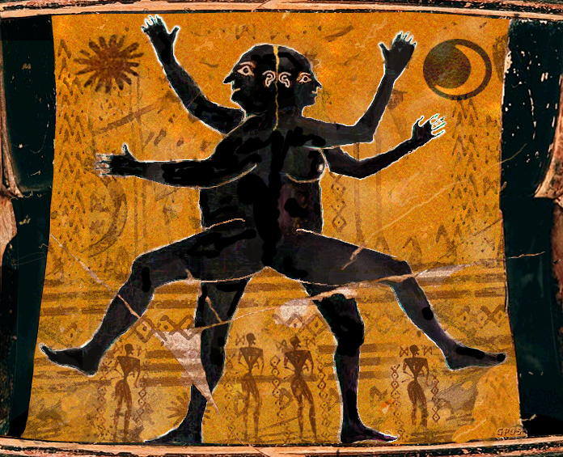
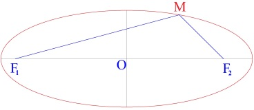

# Leçon 06 | 21 Décembre 1960

<!-- source-url: http://staferla.free.fr/S8/S8 LE TRANSFERT.docx -->
<!-- seminar: s8 -->
<!-- lesson: 06 -->

<!-- id: s8-06-0001 -->

Notre propos, je l’espère, va aujourd’hui, devant la conjoncture céleste, passer par son solstice d’hiver. Je veux dire qu’entraînés par l’orbe qu’il comporte, il a pu vous sembler que nous nous éloignions toujours plus de notre sujet du transfert.

<!-- id: s8-06-0002 -->

Soyez donc rassurés ! Nous atteignons aujourd’hui le point le plus bas de cette ellipse et je crois qu’à partir du moment où nous avions entrevu - si cela doit s’avérer valable - quelque chose à apprendre du *Banquet*, il était nécessaire de pousser jusqu’au point où nous allons la pousser aujourd’hui, l’analyse des parties importantes du texte qui peuvent sembler n’avoir pas de rapport direct avec ce que nous avons à dire.

<!-- id: s8-06-0003 -->

De toute façon qu’importe ! Nous voici maintenant dans l’entreprise, et quand on a commencé dans une certaine voie du discours, c’est justement *une sorte de nécessité* non physique qui se fait sentir, quand nous voulons la mener jusqu’à son terme. Ici nous suivons le guide d’un discours, le discours de PLATON dans le *Banquet,* le discours qui a, autour de lui, toute la charge des *significations* \- à la façon d’un *instrument de musique* ou même d’une « *boite à musique* », toutes *les significations* qu’à travers les siècles il a fait résonner. Un certain côté de notre effort est de *revenir au plus près du sens de ce discours*. Je crois que pour comprendre ce texte de PLATON, pour le juger, on ne peut pas ne pas évoquer dans quel « *contexte du discours* » il est, au sens du discours universel concret.

<!-- id: s8-06-0004 -->

Et là encore, que je me fasse bien entendre : il ne s’agit pas à proprement parler de le replacer dans *l’histoire* ! Vous savez bien que ce n’est point là notre méthode de commentaire, et que c’est toujours pour ce qu’il nous fait entendre à nous, qu’un discours \- même prononcé à une époque très lointaine où les choses que nous avons à entendre n’étaient point en vue - nous l’interrogeons.

<!-- id: s8-06-0005 -->

Mais il n’est pas possible, concernant *le Banquet,* de ne pas nous référer à quelque chose qui est *le rapport du discours et de l’histoire*, à savoir : non pas comment le discours se situe dans l’histoire, mais comment l’histoire elle-même surgit d’un certain mode d’entrée du discours dans le réel. Et aussi bien il faut que je vous rappelle ici, au moment du *Banquet* où nous sommes, au IIème siècle de la naissance du discours concret sur l’univers, je veux dire qu’il faut que nous n’oubliions pas cette *efflorescence philosophique* du viéme siècle, si étrange, si singulière d’ailleurs pour les échos ou les autres modes d’une sorte de chœur terrestre qui se font entendre à la même époque en d’autres civilisations, sans relation apparente. Mais laissons cela de côté.

<!-- id: s8-06-0006 -->

Ce n’est pas *l’histoire des philosophes* du viéme siècle, de THALÈS à PYTHAGORE ou à HÉRACLITE, et tant d’autres que je ne peux même esquisser. Ce que je veux vous faire sentir, c’est que c’est la première fois que dans cette *tradition occidentale*, celle à laquelle se rapporte le livre de RUSSELL dont je vous ai recommandé la lecture, ce discours s’y forme comme *visant* expressément *l’univers*, pour la première fois comme visant à rendre l’univers *discursif*. C’est-à-dire qu’au départ de ce premier pas de *la science* comme étant *la sagesse*, l’univers apparaît comme *univers de discours*.

<!-- id: s8-06-0007 -->

Et en un sens, *il n’y aura jamais d’univers que de discours*. Tout ce que nous trouvons à cette époque, jusqu’à la définition des *éléments* \[terre, eau, air, feu\] qu’ils soient *quatre* ou plus \[cf. *La lettre volée* : α, β, γ, δ\], a quelque chose qui porte la marque, la frappe, l’estampille, de cette requête, de ce postulat, que l’univers doit se livrer à l’ordre du *signifiant*. Sans doute, bien sûr, il ne s’agit point de trouver dans l’univers des éléments de discours mais *des éléments s’agençant à la manière du discours*. Et tous les pas qui s’articulent à cette époque entre les tenants, les inventeurs de ce vaste mouvement interrogatoire, montrent bien que si, sur l’un de ces univers qui se forgent, on ne peut discourir de façon cohérente aux lois du discours, *l’objection est radicale*.

<!-- id: s8-06-0008 -->

Souvenez-vous du mode d’opérer de ZÉNON *le dialecticien,* quand pour défendre son maître PARMÉNIDE, il propose les arguments sophistiques qui doivent jeter l’adversaire dans un embarras sans issue. Donc à l’arrière-plan de ce *Banquet,* de *ce discours de* PLATON, et dans le reste de son œuvre nous avons cette tentative, *grandiose* dans son *innocence*, cet espoir qui habite les premiers philosophes dits « *physiciens* » de trouver, sous la garantie du discours - qui est en somme toute leur instrumentation d’expérience - la prise dernière sur le réel.

<!-- id: s8-06-0009 -->

Je vous demande pardon si je l’évite. Ce n’est pas ici un discours sur la philosophie grecque que je puisse devant vous soutenir. Je vous propose, pour interpréter un texte spécial, la thématique minimale qu’il est nécessaire que vous ayez dans l’esprit pour bien juger ce texte. Et c’est ainsi que je dois vous rappeler que *ce réel*, *cette prise sur le réel* n’a pas à être conçue à cette époque comme le corrélatif d’un sujet, fût-il universel, mais comme le terme que je vais emprunter à la [*Lettre* VII *de* PLATON](http://remacle.org/bloodwolf/philosophes/platon/cousin/lettres.htm) \[324a-352a\] où dans une courte digression, il est dit ce qui est cherché par toute l’opération de la dialectique : c’est tout simplement la même chose dont j’ai dû faire état l’année dernière dans notre propos sur *L’Éthique* et que j’ai appelé *la Chose* [^63], ici [το πρᾶγμα](http://fr.wiktionary.org/wiki/%CF%80%CF%81%E1%BE%B6%CE%B3%CE%BC%CE%B1) \[to pragma\], entendez justement dans le sens que ça n’est pas *die* *Sache* [^64]* : une affaire,* entendez si vous voulez *la grande affaire,* la réalité dernière, celle d’où dépend la pensée même qui s’y affronte, qui la discute et qui n’en est, si je puis dire, qu’une des façons de la pratiquer. C’est το πρᾶγμα \[to pragma\]*, la Chose,* la πρᾶξις \[praxis\] *essentielle* [^65].

<!-- id: s8-06-0010 -->

Dites-vous bien que *la* θεωρια \[theôria\] dont le terme naît à la même époque - si *contemplative* qu’elle puisse s’affirmer et elle n’est pas seulement *contemplative,* la πρᾶξις \[praxis\] d’où elle sort, la *pratique orphique,* le montre assez[^66] - *n’est pas*, comme notre emploi du mot « *théorie* » l’implique, *l’abstraction de cette* πρᾶξις \[praxis\], ni sa référence générale, *ni le modèle*, de quelque façon qu’on puisse l’imaginer de ce qui serait son application, *elle est,* à son apparition, *cette* πρᾶξις *même *: *la* θεωρια \[theôria\] *est elle-même l’exercice du pouvoir* *de* το πρᾶγμα \[to pragma\]*, la grande affaire.*

<!-- id: s8-06-0011 -->

L’un des *maîtres* de cette époque que je choisis, le seul, pour le citer : EMPÉDOCLE, parce qu’il est *grâce à* FREUD l’un des patrons de la spéculation, EMPÉDOCLE dans sa figure sans doute légendaire, puisque, aussi bien c’est là ce qui importe : que ce soit cette figure qui nous a été léguée, EMPÉDOCLE est un tout puissant. Il s’avance comme « *maître des éléments* », capable de ressusciter les morts, *magicien*, « *seigneur du royal secret* », sur les mêmes terres où les charlatans, plus tard, devaient se présenter avec l’allure *parallèle*. On lui demande des miracles et il les produit. Comme ŒDIPE, il ne meurt pas : il rentre au cœur du monde dans le feu du volcan et la béance.

<!-- id: s8-06-0012 -->

Tout ceci, vous allez le voir, reste très proche de PLATON, aussi bien ce n’est pas par hasard que ce soit, prise à lui, à une époque beaucoup plus rationaliste, que tout naturellement nous empruntions la référence du το πρᾶγμα \[to pragma\]. Mais SOCRATE ? Il serait bien singulier que toute la tradition historique se soit trompée en disant qu’il apporte sur ce fond quelque chose d’*original*, une *rupture*, une *opposition*. SOCRATE s’en explique - pour autant que nous puissions faire foi à PLATON là où il nous le présente, plus manifestement dans le contexte d’un *témoignage historique* le visant - c’est un mouvement de recul, de lassitude, de dégoût, par rapport aux contradictions manifestées par ces premières tentatives telles que je viens de vous les caractériser.

<!-- id: s8-06-0013 -->

C’est de SOCRATE que procède cette idée nouvelle, essentielle : il faut d’abord *garantir le savoir*, et la voie de leur montrer à tous *qu’ils ne savent rien,* est par elle-même une voie révélatrice, révélatrice d’une vertu, qui *dans ses succès* privilégiés, ne réussit pas *toujours*. Et ce que SOCRATE appelle, lui, ἐπιστήμη \[épistèmè\], *la science,* ce *qu’il découvre* en somme, ce *qu’il dégage*, ce *qu’il détache*, c’est que *le discours engendre la dimension de la vérité*. Le *discours* qui s’assure d’une « *certitude interne* *à son action même* », assure là où il le peut, *la vérité* comme telle. Il n’est rien d’autre que cette pratique du discours.

<!-- id: s8-06-0014 -->

Quand SOCRATE dit que *c’est la vérité, et non pas lui-même, qui réfute son interlocuteur* [^67], il montre quelque chose dont le plus solide est sa référence à une *combinatoire* primitive qui est toujours la même à la base de notre discours. D’où il résulte, par exemple, que *le père* n’est pas *la mère* et que c’est au même titre, et à ce seul titre, qu’on peut déclarer que le mortel doit être distingué de l’immortel. SOCRATE renvoie en somme au domaine du pur discours toute l’ambition du discours.

<!-- id: s8-06-0015 -->

*Il n’est pas* - comme on le croit, comme on le dit - plus spécialement *celui qui ramène l’homme à l’homme, ni même à l’homme toutes choses,* c’est PROTAGORAS qui a donné ce mot d’ordre : « *l’homme mesure de toute chose* », SOCRATE *ramène la vérité au discours*. Il est en somme, si l’on peut dire, le « *supersophiste* », et c’est en quoi gît son mystère, car s’il n’était que le *supersophiste,* il n’aurait rien engendré de plus que les *sophistes*, à savoir ce qu’il en reste, c’est-à-dire une réputation douteuse. C’est justement quelque chose d’autre qu’un sujet temporel qui avait inspiré son action.

<!-- id: s8-06-0016 -->

Et là nous en venons à l’ἀτοπία \[atopia\], à *ce côté insituable* de SOCRATE qui est justement la question qui nous intéresse quand nous y flairons quelque chose qui peut nous éclairer sur l’ἀτοπία \[atopia\] qui est exigible de nous \[analystes\]. C’est de cette ἀτοπία \[atopia\], de ce « *nulle part* » de son être qu’il a provoqué certainement - car l’histoire nous l’atteste - cette lignée de recherches dont le sort est lié, de façon très ambiguë, à toute une histoire qu’on peut fragmenter : l’histoire de la conscience, et comme on dit en termes modernes : l’histoire de la religion, morale, politique, à la limite certes, et moindrement l’art.

<!-- id: s8-06-0017 -->

Toute cette ligne *ambiguë*, dis-je, diffusée et vivante, pour la désigner je n’aurais qu’à vous l’indiquer par *la question* la plus récemment renouvelée par le plus récent imbécile : « *Pourquoi des philosophes »* [^68] ,si nous ne la sentions, cette lignée, solidaire d’une flamme transmise en fait, elle, *étrangère à tout ce qu’elle éclaire*, fût-ce « *le bien* », « *le beau* », « *le vrai* », « *le même* », dont elle se targue de s’occuper.

<!-- id: s8-06-0018 -->

Si on essaye de lire, à travers les témoignages proches comme à travers les effets éloignés - « proches », je veux dire : dans l’histoire - comme à travers ses effets encore là : *la descendance socratique*, il peut nous venir en effet la formule d’« *une sorte de perversion sans objet* ». Et, à la vérité, quand on s’efforce d’accommoder, d’approcher, d’imaginer, de se fixer sur ce que pouvait être effectivement ce personnage, croyez-moi c’est fatigant et l’effet de cette fatigue, je crois que je ne pourrais mieux le formuler que sous les mots qui me sont venus un de ces dimanches soir : « *ce Socrate me tue !* ».

<!-- id: s8-06-0019 -->

Chose curieuse, je me suis réveillé le lendemain matin infiniment plus gaillard.

<!-- id: s8-06-0020 -->

Il semble tout de même - pour essayer là-dessus de dire des choses - impossible de ne pas partir en prenant *au pied de la lettre* ce qui nous est attesté de la part de l’entourage de SOCRATE, et ceci encore à la veille de sa mort, qu’il est celui qui a dit que somme toute : nous ne saurions rien craindre d’une mort dont nous ne savons rien.

<!-- id: s8-06-0021 -->

Et nommément nous ne savons pas, ajoute-t-il, si ce n’est pas une bonne chose[^69]. Évidemment, quand on lit ça... On est tellement habitué à ne lire dans les textes classiques que « *bonnes paroles* » qu’on n’y fait plus attention. Mais c’est frappant quand nous faisons résonner cela dans le contexte des derniers jours de SOCRATE, entouré de ses derniers fidèles, qu’il leur jette ce dernier « *regard un peu en dessous* » que PLATON photographie sur document - *il n’y était pas ! -* et qu’il appelle « ce *regard de taureau* »[^70]. Et toute son attitude à son procès... Si l’*Apologie de* SOCRATE nous reproduit exactement ce qu’il a dit devant ses juges il est difficile de penser, à entendre sa défense, qu’il ne voulait pas expressément mourir. En tout cas il répudia expressément, et comme tel, tout pathétique de la situation, provoquant ainsi ses juges habitués aux supplications des accusés, rituelles, classiques.

<!-- id: s8-06-0022 -->

Donc ce que je vise là en première approche de la nature énigmatique *d’un désir de mort* qui sans doute peut être retenu pour *ambigu*, c’est un homme qui aura mis, somme toute, *soixante-dix ans* à obtenir la satisfaction de ce désir, il est bien sûr qu’il ne saurait être pris au sens de la tendance au suicide, ni à l’échec, ni à aucun masochisme moral ou autre. Mais il est difficile de ne pas formuler ce minimum tragique lié au maintien d’un homme dans une zone de *no man’s land,* d’une *entre-deux-morts* en quelque sorte *gratuite*.

<!-- id: s8-06-0023 -->

SOCRATE, vous le savez, quand NIETZSCHE en a fait la découverte, ça lui a monté à la tête: « *La Naissance de la tragédie »,* et *toute œuvre* de NIETZSCHE à la suite, est sortie de là. Le ton dont je vous en parle doit bien marquer quelque personnelle *impatience*. On ne peut pas tout de même ne pas voir *qu’incontestablement* - NIETZSCHE là a mis le doigt dessus, il suffisait d’ouvrir à peu près *un dialogue de* PLATON au hasard - *la profonde incompétence de* SOCRATE chaque fois qu’il touche à ce sujet de la tragédie est quelque chose qui est tangible. Lisez dans le *Gorgias*. La tragédie passe là, exécutée en trois lignes, parmi *les arts de la flatterie,* une *rhétorique* comme une autre, rien de plus à en dire[^71].

<!-- id: s8-06-0024 -->

Nul *tragique*, nul « *sentiment tragique* » - comme on s’exprime de nos jours - ne soutient cette ἀτοπία \[atopia\] de SOCRATE. Seulement un « *démon* », le δαίμων \[daimôn\] - ne l’oublions pas, car il nous en parle sans cesse - qui l’hallucine, semble-t-il pour lui permettre de survivre dans cet espace, il l’avertit des trous où il pourrait tomber : « *Ne fais pas cela*... ».

<!-- id: s8-06-0025 -->

Et puis, en plus, un message d’un dieu - dont lui-même nous témoigne de la fonction qu’il a eue dans ce qu’on peut appeler une vocation - le dieu de Delphes : APOLLON, qu’un disciple à lui a eu l’idée, saugrenue il faut bien le dire, d’aller consulter. Et le dieu a répondu :

<!-- id: s8-06-0026 -->

« *Il y a quelque sages. Il y en a un qui n’est pas mal : c’est* EURIPIDE*, mais le sage des sages, le fin du fin, le sacré, c’est* SOCRATE ».

<!-- id: s8-06-0027 -->

Et depuis ce jour-là, SOCRATE a dit :

<!-- id: s8-06-0028 -->

« *Il faut que je réalise l’oracle du dieu, je ne savais pas que j’étais le plus sage, mais puisqu’il l’a dit, il faut que je le sois* ».

<!-- id: s8-06-0029 -->

C’est exactement dans ces termes que SOCRATE nous présente le virage de ce qu’on peut appeler son « *passage à la vie publique* ».

<!-- id: s8-06-0030 -->

C’est en somme un fou qui se croit au service commandé d’un dieu, un messie, et dans une société de bavards par-dessus le marché. Nul autre *garant* de la parole de l’Autre (*avec le grand A*) que cette parole même, il n’y a pas d’autre source de *tragique* que ce destin qui peut bien nous apparaître par un certain côté, être du néant. Avec tout ça, il est amené à rendre le terrain dont je vous parlais l’autre jour, *le terrain de la reconquête du réel*, de la *conquête philosophique*, c’est-à-dire *scientifique, à rendre une bonne part du terrain aux dieux*.

<!-- id: s8-06-0031 -->

Ce n’est pas pour faire du paradoxe, comme certains me l’ont confié :

<!-- id: s8-06-0032 -->

« *Vous vous êtes bien amusé à nous surprendre quand vous avez interrogé : qu’est-ce que sont les dieux ?* ».

<!-- id: s8-06-0033 -->

Eh bien, vous ai-je dit, les dieux c’est du *réel* ! Tout le monde s’attendait à ce que je dise : *du symbolique*. Pas du tout !

<!-- id: s8-06-0034 -->

« *Vous avez fait une bonne farce, vous avez dit : c’est du réel* ».

<!-- id: s8-06-0035 -->

Eh bien, pas du tout !

<!-- id: s8-06-0036 -->

Croyez-moi, ce n’est pas moi qui l’ai inventé. Ils ne sont manifestement, pour SOCRATE, que du *réel*.

<!-- id: s8-06-0037 -->

Et ce *réel*, sa part faite, n’est rien du tout quant au principe de sa conduite à lui, SOCRATE, qui ne vise qu’à *la vérité*. Il en est quitte avec les dieux d’obéir à l’occasion, pourvu que, lui, définisse cette obéissance. Est-ce que c’est bien là leur obéir ou plutôt s’acquitter ironiquement vis-à-vis d’êtres qui ont eux aussi leur nécessité ? Et en fait nous ne sentons aucune nécessité qui ne reconnaisse la suprématie de la nécessité interne au déploiement du *vrai*, c’est-à-dire à la science. *Un discours aussi sévère* peut nous surprendre par la séduction qu’il exerce. Quoi qu’il en soit cette séduction nous est attestée au détour de l’un ou de l’autre des *dialogues*.

<!-- id: s8-06-0038 -->

Nous savons que *le discours de* SOCRATE, même répété par des enfants, par des femmes, exerce un charme si l’on peut dire, *sidérant*. C’est bien le cas de le dire : « *Ainsi parlait Socrate* ». Une force s’en transmet « *qui soulève ceux qui l’approchent* » disent toujours les textes platoniciens, bref, au seul bruissement de sa parole, certains disent « *à son contact* ».

<!-- id: s8-06-0039 -->

Remarquez-le encore, il n’a pas de disciples, mais plutôt *des familiers, des curieux* aussi, et puis *des ravis*, frappés de je ne sais quel secret, *des santons* comme on dit dans les contes provençaux et puis, les disciples des autres aussi viennent, qui frappent à la porte. PLATON n’est d’aucun de ceux-là, c’est un tard-venu, beaucoup trop jeune pour n’avoir pu voir que la fin du phénomène. Il n’est pas parmi les proches qui étaient là au dernier instant, et c’est bien là *la raison dernière* - il faut le dire en passant très vite - de cette cascade obsessionnelle de témoignages où il s’accroche chaque fois qu’il veut parler de son étrange héros :

<!-- id: s8-06-0040 -->

> « *Un tel l’a recueilli d’un tel qui était là, à partir de telle ou telle visite où ils ont mené tel ou tel débat.* »
>
> « *L’enregistrement sur cervelle, là je l’ai en première, là en seconde édition* ».

<!-- id: s8-06-0041 -->

PLATON est un témoin très particulier. On peut dire « *qu’il ment* » et d’autre part « *qu’il est véridique même s’il ment* » car, à interroger SOCRATE, c’est sa question à lui, PLATON, qui se fraye son chemin. PLATON est tout autre chose. Il n’est pas un « *va nu pieds »*, ce n’est pas un *errant*. Nul dieu ne lui parle ni ne l’a appelé, et à la vérité, je crois qu’à lui, les dieux ne sont pas grand-chose.

<!-- id: s8-06-0042 -->

PLATON est un *maître*, un vrai, un *maître* témoin du temps où la cité se décompose, emportée par *la rafale démocratique*, prélude au temps des grandes confluences impériales. C’est une sorte de SADE en plus drôle. On ne peut même pas - naturellement, comme personne - on ne peut jamais imaginer la nature des pouvoirs que l’avenir réserve : les grands bateleurs de la tribu mondiale, ALEXANDRE, SELEUCIDE, PTOLÉMÉE, tout cela est encore à proprement parler impensable. Les *militaires mystiques*, on n’imagine encore pas ça !

<!-- id: s8-06-0043 -->

Ce que PLATON voit à l’horizon, c’est *une cité communautaire* tout à fait révoltante à ses yeux comme aux nôtres. Le haras en ordre, voilà ce qu’il nous promet dans un *pamphlet* qui a toujours été le mauvais rêve de tous ceux qui ne peuvent pas se remettre du discord toujours plus accentué, de « *l’ordre de la cité* » avec « *leur*  *sentiment du bien* ». Autrement dit, ça s’appelle *La République* et tout le monde a pris cela au sérieux : on croit que c’est vraiment ce que voulait PLATON !

<!-- id: s8-06-0044 -->

Passons sur quelques autres malentendus et sur quelques autres élucubrations mythiques. Si je vous disais que *le mythe de l’*Atlantide me semble bien plutôt être l’écho de *l’échec des rêves politiques de* PLATON - il n’est pas sans rapports avec l’aventure de l’*Académie -* peut-être trouveriez-vous que mon paradoxe aurait besoin d’être plus nourri, c’est pourquoi je passe.

<!-- id: s8-06-0045 -->

Ce qu’il veut en tout cas, lui, c’est tout de même *la chose,* το πρᾶγμα \[to pragma\]. Il a pris le relais des mages du siècle précédent à un niveau littéraire. L’*Académie* c’est une sorte de « *cité réservée* », de « *refuge des meilleurs* ». Et c’est dans le contexte de cette entreprise, dont certainement l’horizon allait très loin, que nous savons que ce qu’il a rêvé dans son voyage de Sicile - curieusement *sur les mêmes lieux* où son aventure fait en quelque sorte écho au rêve d’ALCIBIADE qui, lui, a nettement rêvé d’un « *empire méditerranéen à centre sicilien* » - portait un signe de sublimation plus élevé : c’est comme une sorte d’*utopie* dont il a pensé pouvoir être le directeur.

<!-- id: s8-06-0046 -->

De la hauteur d’ALCIBIADE, évidemment tout ceci se réduit à un niveau certainement moins élevé. Peut-être ça n’irait-il pas plus haut qu’un sommet d’élégance masculine. Mais ce serait tout de même déprécier ce « *dandysme métaphysique* » que de ne pas voir de quelle portée il était en quelque sorte capable. Je crois qu’on a raison de lire le texte de PLATON sous l’angle de ce que j’appelle le *dandysme* : ce sont des écrits pour l’extérieur, j’irai jusqu’à dire qu’il jette aux chiens que nous sommes, les menus « *bons ou mauvais morceaux* », débris *d’un humour* souvent assez *infernal*, mais il est un fait : c’est *qu’il a été entendu autrement*.

<!-- id: s8-06-0047 -->

C’est que *le désir chrétien*, qui a si peu à faire avec toutes ces aventures, ce désir chrétien dont l’os, dont l’essence est dans la résurrection des corps (il faut lire saint AUGUSTIN pour s’apercevoir de la place que ça tient), que *ce désir chrétien* se soit reconnu dans PLATON, pour qui le corps doit se dissoudre dans une beauté supraterrestre et réduite à une forme - dont nous allons parler tout à l’heure - extraordinairement décorporalisée, c’est le signe évidemment qu’on est en plein malentendu.

<!-- id: s8-06-0048 -->

Mais c’est justement cela qui nous ramène à la question du *transfert* et à ce caractère délirant d’une telle reprise du discours dans un autre contexte, qui lui est à proprement parler contradictoire. Qu’est-ce qu’il y a là dedans, si ce n’est que *le fantasme platonicien* - dont nous allons nous approcher d’aussi près que possible : ne croyez pas que ce soit là des considérations simplement générales - *s’affirme déjà comme un phénomène de transfert*.

<!-- id: s8-06-0049 -->

Comment les chrétiens, à qui un Dieu réduit au symbole du Fils avait donné sa vie en signe d’amour, se sont-ils laissé fasciner par l’inanité - vous vous rappelez mon terme de tout à l’heure - spéculative, offerte en pâture par le plus désintéressé des hommes : SOCRATE ? Est-ce qu’il ne faut pas là reconnaître l’effet de la seule convergence touchable entre *les deux thématiques,* qui est « *le Verbe* » présenté comme objet d’adoration ?

<!-- id: s8-06-0050 -->

C’est pourquoi il est si important - face à la mystique chrétienne, où l’on ne peut nier que *l’amour* n’ait produit d’assez extraordinaires fruits et folies, selon la tradition chrétienne elle–même - de *délinéer* quelle est la portée de *l’amour* dans *le transfert* qui se produit autour de cet autre : SOCRATE, qui lui n’est qu’un homme qui prétend *s'y connaître en amour,* mais qui n’en laisse que la preuve la plus simplement naturelle, à savoir que ses disciples le taquinaient de perdre la tête de temps en temps devant un beau jeune homme, et comme nous en témoigne XÉNOPHON, d’avoir un jour - *ça ne va pas loin !* - *touché de son épaule l’épaule nue du jeune* CRITOBULE. XÉNOPHON, lui, nous en dit le résultat : ça lui laisse une courbature, rien de plus. Rien de moins non plus[^72] : ça n’est pas rien, chez un cynique aussi éprouvé !

<!-- id: s8-06-0051 -->

Car déjà dans SOCRATE il y a *toutes les figures du cynique*. Cela prouve en tout cas une certaine *violence du désir*, mais cela laisse, il faut bien le dire, *l’amour* en position un peu instantanée. *Ceci nous explique, nous fait comprendre, nous permet de situer*, qu’en tous les cas pour PLATON *ces histoires d’amour* c’est simplement *bouffon*, que le mode d’union dernière avec το πρᾶγμα \[to pragma\], *la chose,* n’est certainement pas à chercher dans le sens de l’effusion d’amour au sens chrétien du terme.

<!-- id: s8-06-0052 -->

Et ce n’est pas ailleurs qu’il faut chercher *la raison* de ceci que dans *Le Banquet,* le seul qui parle comme il convient de l’amour, c’est « *un pitre* » - vous allez voir ce que j’entends par ce terme - car ARISTOPHANE pour PLATON n’est pas autre chose : un *poète comique* pour lui c’est « *un pitre* ». Et on voit très bien comment ce monsieur très distant, croyez-moi, de la foule, cet homme, cet obscène ARISTOPHANE, dont je n’ai pas à vous rappeler ce que vous pouvez trouver, à ouvrir la moindre de ses comédies. La moindre des choses que vous puissiez voir surgir sur la scène, c’est celle par exemple où le parent d’EURIPIDE qui va se déguiser en femme pour s’exposer au sort d’ORPHÉE, c’est-à-dire être déchiqueté par l’assemblée des femmes à la place d’EURIPIDE dans ce déguisement... on nous fait assister sur la scène au brûlage des poils du cul parce que les femmes, comme encore aujourd’hui en Orient, s’épilent. Et je vous passe tous les autres détails[^73].

<!-- id: s8-06-0053 -->

Tout ce que je peux vous dire c’est que ceci passe tout ce qu’on ne peut voir de nos jours que *sur la scène d’un music-hall de* Londres, ce n’est pas peu dire ! Les mots simplement sont meilleurs, mais ils ne sont pas plus distingués pour ça. Le terme de « *cul béant* » est celui qui est répété dix répliques de suite pour désigner ceux parmi lesquels il convient de choisir ceux que nous appellerions aujourd’hui dans nos langages les candidats les plus aptes à tous les rôles progressistes, car c’est à ceux-là qu’ARISTOPHANE en veut tout particulièrement. Alors, que ce soit un personnage de cette espèce - et qui plus est, ai-je déjà dit, qui a eu le rôle que vous savez dans la diffamation de SOCRATE - que PLATON choisisse pour lui faire dire les choses les meilleures sur *l’amour*, ça doit quand même nous éveiller un peu la comprenoire !

<!-- id: s8-06-0054 -->

Pour bien faire comprendre ce que je veux dire en disant que c’est à lui qu’il fait dire les choses les meilleures sur *l’amour*, je vais tout de suite vous l’illustrer. D’ailleurs même quelqu’un d’aussi *compassé, mesuré* dans ses jugements, *prudent*, que peut l’être le savant universitaire qui a fait l’édition que j’ai là sous les yeux, M. Léon ROBIN, même lui ne peut pas ne pas en être frappé : ça lui tire les larmes[^74]. C’est le premier qui parle de *l’amour*, mon Dieu, comme nous en parlons, c’est-à-dire qu’il dit des choses qui vous prennent à la gorge et qui sont les suivantes. D’abord cette remarque assez fine - on peut dire que ce n’est pas ce qu’on attend d’un bouffon, mais c’est justement pour ça que c’est dans la bouche du bouffon - c’est lui qui fait la remarque :

<!-- id: s8-06-0055 -->

« *Personne* - dit-il - *ne peut croire que c’est* ἡ τῶν ἀϕροδισίων συνουσία » \[hè tôn aphrodisiôn sunousia\] \[[192c](http://remacle.org/bloodwolf/philosophes/platon/cousin/banquet.htm)\]. On traduit  « *la communauté de la jouissance amoureuse »...* Je dois dire que cette traduction me paraît *détestable*, je crois d’ailleurs que M. Léon ROBIN en a fait une autre pour *La Pléiade* qui est bien meilleure.

<!-- id: s8-06-0056 -->

\[Ὅταν μὲν οὖν καὶ αὐτῷ ἐκείνῳ ἐντύχῃ τῷ αὑτοῦ ἡμίσει καὶ ὁ παιδεραστὴς καὶ ἄλλος πᾶς, τότε καὶ θαυμαστὰ ἐκπλήττονται φιλίᾳ τε καὶ \[192c\] οἰκειότητι καὶ ἔρωτι, οὐκ ἐθέλοντες ὡς ἔπος εἰπεῖν χωρίζεσθαι ἀλλήλων οὐδὲ σμικρὸν χρόνον. Καὶ οἱ διατελοῦντες μετ᾽ ἀλλήλων διὰ βίου οὗτοί εἰσιν, οἳ οὐδ᾽ ἂν ἔχοιεν εἰπεῖν ὅτι βούλονται σφίσι παρ᾽ ἀλλήλων γίγνεσθαι. Οὐδενὶ γὰρ ἂν δόξειεν τοῦτ᾽ εἶναι ἡ τῶν ἀφροδισίων συνουσία, ὡς ἄρα τούτου ἕνεκα ἕτερος ἑτέρῳ χαίρει συνὼν οὕτως ἐπὶ μεγάλης σπουδῆς· ἀλλ᾽ ἄλλο τι βουλομένη ἑκατέρου ἡ ψυχὴ \[192d\] δήλη ἐστίν, ὃ οὐ δύναται εἰπεῖν, ἀλλὰ μαντεύεται ὃ βούλεται, καὶ αἰνίττεται.\]

<!-- id: s8-06-0057 -->

Car vraiment ça veut dire : *Ce n’est pas le plaisir d’être ensemble au lit* [^75] *qui est en définitive l’objet en vue duquel chacun d’eux se complaît à vivre* *en commun avec l’autre et dans une pensée à ce point débordante de sollicitude...* \[192c\]

<!-- id: s8-06-0058 -->

En grec οὕτως ἐπὶ μεγάλης σπουδῆς \[outôs epi megalès spoudès\], c’est ce même σπουδῆς \[spoudès\] que vous trouviez *l’année dernière* dans la définition aristotélicienne de la tragédie. Bien sûr σπουδῆς \[spoudès\] veut dire *sollicitude, soin, empressement,* cela veut dire aussi *sérieux *: « *ils ont, pour tout dire, ces gens qui s’aiment, un drôle d’air sérieux*. ». Et passons cette note *psychologique* pour montrer tout de même, désigner, où est le mystère. Voilà ce que nous dit ARISTOPHANE \[[192d](http://remacle.org/bloodwolf/philosophes/platon/cousin/banquet.htm)\] :

<!-- id: s8-06-0059 -->

« *c’est bien plutôt une tout autre chose que manifestement souhaite leur âme, une chose qu’elle est incapable d’exprimer. Elle la devine cependant* *et elle la propose sur le mode de l’énigme*. *Supposez même que, tandis qu’ils reposent sur la même couche, Héphaïstos* (c’est-à-dire Vulcain, le personnage avec l’enclume et le marteau) *se dresse devant eux muni de ses outils, et qu’il poursuive ainsi... « N’est-ce pas ceci* (l’objet de vos vœux) *dont vous avez envie : vous identifier le plus possible l’un avec l’autre, de façon que, ni nuit, ni jour, vous ne vous délaissiez l’un l’autre ?* *Si c’est vraiment de cela que vous avez envie, je peux bien* \[[192e](http://remacle.org/bloodwolf/philosophes/platon/cousin/banquet.htm)\] *vous fondre ensemble, vous réunir au souffle de ma forge, de telle sorte que,* *de deux comme vous êtes, vous deveniez un, et que, tant que durera votre vie, vous viviez l’un et l’autre en communauté comme ne faisant qu’un ;* *et qu’après votre mort, là-bas, chez Hadès, au lieu d’être deux, vous soyez un, pris tous deux d’une commune mort...* *Eh bien ! voyez si c’est à cela que vous aspirez... » En entendant ces paroles, il n’y en aurait pas un seul, nous le savons bien, pour dire non,* *ni évidemment pour souhaiter autre chose ; mais chacun d’eux penserait au contraire qu’il vient, tout bonnement, d’entendre formuler ce que depuis longtemps en somme il convoitait : que, par sa réunion, par sa fusion avec l’aimé, leur deux êtres n’en fissent enfin qu’un seul !* »

<!-- id: s8-06-0060 -->

Voilà ce que PLATON fait dire par ARISTOPHANE. ARISTOPHANE ne dit pas que cela. ARISTOPHANE raconte des choses qui font rire, des choses d’ailleurs que lui-même a annoncées comme devant jouer justement entre le risible et le ridicule, si tant est qu’entre ces deux termes se répartisse le fait que le rire retombe sur ce que le comique vise, ou sur le comédien lui-même.

<!-- id: s8-06-0061 -->

Mais de quoi ARISTOPHANE fait-il rire ? Car il est clair qu’il fait rire et qu’il passe la barre du ridicule. Est-ce que PLATON va le faire nous faire rire de *l’amour* ? Il est bien évident que déjà ceci vous témoigne du contraire. Nous dirons même que nulle part, à aucun moment de ces discours, on ne prend autant *l’amour* au sérieux, ni aussi au tragique. Nous sommes exactement au niveau que nous lui imputons à cet *amour* – nous, modernes – après *la sublimation courtoise* et après ce que je pourrais appeler *le contresens romantique* sur cette sublimation, à savoir la surestimation narcissique du sujet, je veux dire *du sujet supposé dans l’objet aimé*. Car *c’est cela le contresens romantique par rapport à* ce que je vous ai enseigné l’année dernière sur *la sublimation courtoise*.

<!-- id: s8-06-0062 -->

Dieu merci, au temps de PLATON, nous n’en sommes pas encore là, à cet étrange ARISTOPHANE près, mais c’est un bouffon, nous en sommes bien plutôt à une observation en quelque sorte zoologique d’êtres imaginaires, qui prend sa valeur de ce qu’ils évoquent de ce qui peut être pris assurément au sens dérisoire dans les êtres réels. Car c’est bien  de cela qu’il s’agit dans ces êtres coupés en deux tels un œuf dur \[[190e](http://remacle.org/bloodwolf/philosophes/platon/cousin/banquet.htm)\], un de ces êtres bizarres comme nous en trouvons sur les fonds de sable \[[191d](http://remacle.org/bloodwolf/philosophes/platon/cousin/banquet.htm)\], *une plie, une sole,* *un carrelet* là évoqués, qui ont l’air d’avoir tout ce qu’il faut : deux yeux, tous les organes pairs, mais qui sont aplatis d’une telle manière qu’ils semblent être la moitié d’un être complet.

<!-- id: s8-06-0063 -->

Il est clair que dans le premier comportement qui suit la naissance de ces êtres qui sont nés d’une telle bipartition, ce qu’ARISTOPHANE nous montre d’abord, et ce qui est le soubassement de ce qui tout d’un coup vient là dans une lumière pour nous si « *romantique* », c’est cette espèce de fatalité panique, qui va faire à chacun de ces êtres chercher d’abord et avant tout sa moitié, et là, s’accolant à elle avec une *ténacité*, si l’on peut dire sans issue, les faire effectivement dépérir l’un à côté de l’autre par *impuissance de se rejoindre*. Voilà *ce qu’il nous dépeint* dans ses longs développements qui est donné avec tous les détails, qui est extrêmement imagé, qui naturellement est projeté sur le plan *du mythe*, mais qui est la voie dans laquelle, par le sculpteur qu’est ici le poète, est forgée son image du rapport amoureux.

<!-- id: s8-06-0064 -->

Mais est-ce *là où gît* ce que nous devons supposer, ce que nous touchons du doigt, qu’il y a ici de *risible* ? Bien évidemment pas ! Ceci est inséré dans *quelque chose* qui irrésistiblement nous évoque ce que nous pourrions voir encore de nos jours sur le tapis d’un *cirque* si les *clowns* entraient, comme il se fait quelquefois, embrassés ou accrochés de façon quelconque deux à deux, couplés ventre à ventre et, dans un grand tournoiement de quatre bras, de quatre jambes et de leurs deux têtes, faisaient un ou plusieurs tours de piste en culbutant.

<!-- id: s8-06-0065 -->

<!-- id: s8-06-0066 -->

En soi, c’est quelque chose que nous voyons aller très bien avec le mode de fabrication de ce type de chœur qui donnait, dans un autre genre, *les Guêpes, les Oiseaux,* ou encore *les Nuées,* dont nous ne saurons jamais sous quel écran ces pièces paraissaient sur la scène antique.

<!-- id: s8-06-0067 -->

Mais ici de quelle espèce de ridicule s’agit-il ? Est-ce simplement le caractère à soi tout seul assez réjouissant de l’image ? C’est là que je vais engager un petit développement dont je vous demande pardon s’il doit nous faire faire un assez long détour, car il est essentiel. Si vous lisez ce texte, *vous verrez à quel point* - au point que ça frappe aussi M. Léon ROBIN. C’est toujours la même chose, je ne suis pas seul à savoir lire un texte - *extraordinairement, il insiste sur le caractère sphérique* de ce personnage. Il est difficile de ne pas le voir, parce que *ce sphérique, ce circulaire, ce* σϕαῖρα \[sphaira*\] est répété avec une telle insistance*[^76], on nous dit que :

<!-- id: s8-06-0068 -->

« *les flancs, le dos,* πλευρὰς κύκλῳ ἔχον \[pleuras kuklô echon\]*, tout ça se continue d’une façon bien ronde*. » \[[189e](http://remacle.org/bloodwolf/philosophes/platon/cousin/banquet.htm)\]

<!-- id: s8-06-0069 -->

\[ἔπειτα ὅλον ἦν ἑκάστου τοῦ ἀνθρώπου τὸ εἶδος στρογγύλον, νῶτον καὶ <u>πλευρὰς **κύκλῳ** ἔχον</u>, χεῖρας δὲ τέτταρας εἶχε, καὶ σκέλη τὰ ἴσα ταῖς χερσίν, καὶ πρόσωπα \[190a\] δύ᾽ ἐπ᾽ αὐχένι <u>**κυκλο**τερεῖ</u>, ὅμοια πάντῃ· κεφαλὴν δ᾽ ἐπ᾽ ἀμϕοτέροις τοῖς προσώποις ἐναντίοις κειμένοις μίαν, καὶ ὦτα τέτταρα, καὶ αἰδοῖα δύο, καὶ τἆλλα πάντα ὡς ἀπὸ τούτων ἄν τις εἰκάσειεν. Ἐπορεύετο δὲ καὶ ὀρθὸν ὥσπερ νῦν, ὁποτέρωσε βουληθείη· καὶ ὁπότε ταχὺ ὁρμήσειεν θεῖν, ὥσπερ οἱ κυβιστῶντες καὶ εἰς ὀρθὸν τὰ σκέλη περιφερόμενοι κυβιστῶσι **<u>κύκλῳ</u>**, ὀκτὼ τότε οὖσι τοῖς μέλεσιν ἀπερειδόμενοι ταχὺ ἐφέροντο **<u>κύκλῳ</u>**.\]

<!-- id: s8-06-0070 -->

Et il faut que nous voyions cela, comme je vous l’ai dit tout à l’heure, comme les deux roues branchées l’une sur l’autre et tout de même plates, alors qu’ici c’est rond. Et cela embête M. Léon ROBIN qui change une virgule que personne n’a jamais changée en disant : « *Je le fais comme cela parce que je ne veux pas qu’on insiste tellement sur la sphère, c’est sur la coupure que c’est plus important* »[^77] Et ce n’est pas *moi* qui vais vous diminuer l’*importance* *de cette coupure*, nous allons y revenir tout à l’heure.

<!-- id: s8-06-0071 -->

Mais il est quand même difficile de ne pas voir que nous sommes devant quelque chose de très *singulier* et dont je vais tout de suite vous dire le terme, le fin mot, c’est que la dérision dont il s’agit, ce qui est mis sous cette forme ridicule, c’est justement la sphère. Naturellement cela ne vous fait pas rire, parce que « *la sphère* », ça ne vous fait ni chaud ni froid à vous ! Seulement dites-vous bien que, pendant des siècles, il n’en a pas été ainsi.

<!-- id: s8-06-0072 -->

Vous, vous ne la connaissez que sous la forme de ce fait d’« *inertie psychologique* » qu’on appelle la « *bonne forme* ». Un certain nombre de gens - M. EHRENFELS *et d’autres* - se sont aperçus qu’il y avait une certaine tendance des formes à la perfection, tendance à rejoindre dans l’état douteux la sphère, qu’en somme c’était cela qui faisait plaisir au nerf optique.

<!-- id: s8-06-0073 -->

Cela bien sûr, naturellement est fort intéressant et ne fait qu’amorcer le problème, car je vous signale en passant que ces notions de *Gestalt* sur lesquelles on marche aussi allègrement ne font que relancer le problème de la perception. Car s’il y a de si *bonnes formes*, c’est que *la perception* doit consister, si l’on peut dire, à les rectifier dans le sens des *mauvaises* que sont les vraies. Mais laissons *la dialectique* de cette « *bonne forme* » en cette occasion. Cette « *forme* » a un tout autre sens que cette objectivation, d’intérêt limité, proprement psychologique.

<!-- id: s8-06-0074 -->

Au temps et au niveau de PLATON, et non seulement au niveau de PLATON mais bien avant lui, cette forme, σϕαῖρος \[sphairos\] comme dit encore EMPÉDOCLE, dont le temps m’empêche de vous lire les vers :

<!-- id: s8-06-0075 -->

« ἀλλ᾽ ὄ γε πάντοθεν ίσος έὼν καὶ πάμπαν ἀπεἰρων Σϕαῖρος κυκλοτερὴς μονιη περιηγἒὶ χαίρων » «  *Mais lui, partout égal à lui-même et sans limite aucune, Sphairos à l’orbe pur, joyeux de la solitude qui l’entoure.* »

<!-- id: s8-06-0076 -->

**Σ**ϕαῖρος \[sphairos\] au masculin, c’est : *un être qui, de tous les côtés semblable à lui-même, est de tous côtés sans limites*.

<!-- id: s8-06-0077 -->

« *Sphairos qui a la forme d’un boulet, ce Sphairos règne dans sa solitude royale rempli par son propre contentement, sa propre suffisance* » [^78].

<!-- id: s8-06-0078 -->

Ce σϕαῖρος \[sphairos\] hante la pensée antique. Il est la forme que prend, au centre du monde d’EMPÉDOCLE, la phase de *rassemblement* de ce qu’il appelle, lui, dans sa métaphysique, ϕιλίη \[Philiè\] ou ϕιλότης \[philotès\], *l’Amour*. Cette ϕιλότης \[philotès\] qu’il appelle ailleurs : Σχεδύνη \[schedunè \]*, l’Amour* *qui rassemble, qui agglomère, qui assimile, qui agglutine -* exactement : *agglutiné* – c’est la κρῆσις \[*krèsis*\], c’est de la κρῆσις \[*krèsis*\] d’amour[^79].

<!-- id: s8-06-0079 -->

Il est *très singulier* que nous ayons vu réémerger sous la plume de FREUD cette idée de *l’amour comme puissance unifiante* pure et simple, et si l’on peut dire, *à l’attraction sans limites,* pour l’opposer à THANATOS, alors que nous avons corrélativement - et vous le sentez bien : d’une *façon discordante* - une notion tellement différente et tellement plus féconde dans « *l’ambivalence amour-haine* ». Cette sphère nous la retrouvons partout. Je vous parlais l’autre jour de PHILOLAOS : il admet la même sphère au centre d’un monde où la terre a une position excentrique. Déjà au temps de PYTHAGORE on le soupçonnait depuis très longtemps que la terre était excentrique, mais ce n’est pas le soleil qui occupe le centre, c’est un feu central sphérique à quoi, nous, la face de la terre habitée, nous tournons toujours le dos. Nous sommes par rapport à ce feu comme la lune est par rapport à notre terre et c’est pour cela que nous ne le sentons pas. Et il semble que ce soit pour que nous ne soyons pas, malgré tout, brûlés par *le rayonnement central*, que le dénommé PHILOLAOS a inventé - cette *élucubration* qui a fait casser la tête déjà aux gens de l’Antiquité, à ARISTOTE lui-même - ἀντίχθων \[anti-chtôn\] l’*anti-terre*.

<!-- id: s8-06-0080 -->

Quelle pouvait bien être, à part ça, la nécessité de cette invention de ce corps strictement invisible, qui était censé receler tous les pouvoirs contraires à ceux de la terre, qui jouait en même temps ce rôle, semblait-il, de pare-feu, c’est là quelque chose, comme on dit, « *qu’il faudrait analyser* ». Mais ceci n’est fait que pour vous introduire à cette dimension, dont vous savez que je lui accorde une très grande importance, de ce qu’on peut appeler « *la révolution astronomique* », et « *copernicienne* » encore. Et pour mettre là-dessus définitivement « *le point sur les i* », à savoir - ce que je vous ai indiqué - que ce n’est pas le géocentrisme soi-disant *démantelé* par le nommé « Chanoine KOPPERNIGK » \[Copernic\][^80] qui est le plus important, et c’est même en ça que c’est assez faux, assez vain, de l’appeler une « *révolution copernicienne* ».

<!-- id: s8-06-0081 -->

Parce que, si dans son livre *Sur les révolutions des orbes célestes* [^81] il nous montre une figure du système solaire qui ressemble à la nôtre, à celle qu’il y a sur les manuels aussi dans la classe de sixième, où l’on voit le soleil au milieu, et tous les astres qui tournent autour dans l’orbe, il faut dire que ce n’était pas du tout un schéma nouveau, en ceci que *tout le monde savait* au temps de COPERNIC \- ce n’est pas nous qui l’avons découvert - que, dans l’Antiquité, il y avait un homme HÉRACLIDE, puis ARISTARQUE de Samos, lui assurément d’une façon tout à fait attestée, qui avaient fait le même schéma.

<!-- id: s8-06-0082 -->

La seule chose qui aurait pu faire de COPERNIC autre chose qu’un fantasme historique - car ce n’était pas autre chose - c’est si son système avait été, non pas *plus près,* de l’image que nous avons du système solaire réel, mais plus vrai. Et plus vrai, ça voudrait dire plus désencombré d’éléments imaginaires qui n’ont rien à faire avec la symbolisation moderne des astres, plus désencombré que le système de PTOLÉMÉE. Or il n’en est rien. Son système est aussi bourré d’*épicycles*. Et des *épicycles*, qu’est-ce que c’est ? C’est quelque chose d’inventé, et d’ailleurs personne ne pouvait croire à la réalité des *épicycles* !

<!-- id: s8-06-0083 -->

Ne vous imaginez pas qu’ils étaient assez bêtes pour penser qu’ils verraient, comme ce que vous voyez quand vous ouvrez votre montre : *une série de petites roues*. Mais il y avait cette idée que le seul mouvement parfait qu’on pouvait imaginer concevable était le mouvement circulaire. Tout ce qu’on voyait dans le ciel était vachement dur à interpréter, car comme vous le savez, ces petites planètes errantes se livraient à toutes sortes *d’entourloupettes irrégulières* entre elles, dont il s’agissait d’expliquer les *zigzags*. On n’était satisfait que quand chacun des éléments de leur circuit, pouvait être ramené à *un mouvement circulaire*.

<!-- id: s8-06-0084 -->

La chose singulière est qu’on n’y soit pas mieux parvenu, car à force de combiner *des mouvements* *tournants sur des mouvements tournants* on pourrait en principe penser qu’on pourrait arriver à rendre compte de tout. En réalité c’était bel et bien impossible pour la raison qu’à mesure qu’on les observait mieux on s’apercevait qu’il y avait *plus de choses* à expliquer, ne serait-ce que, *lorsque le télescope apparut*, leur variation de grandeur \[orbites elliptiques\]. Mais qu’importe ! Le système de COPERNIC était tout aussi chargé de cette espèce de *superfétation imaginaire* qui *l’encombrait*, *l’alourdissait*, que le système de PTOLÉMÉE.

<!-- id: s8-06-0085 -->

Ce qu’il faudrait que vous lisiez pendant ces vacances, et vous allez voir que c’est possible, pour votre plaisir, c’est à savoir comment KÉPLER arrive à donner la première saisie qu’ont ait eue de quelque chose qui est ce en quoi consiste véritablement la date de naissance de *la physique moderne*. Il y arrive en partant des éléments dans PLATON du même *Timée* dont je vais vous parler, c’est à savoir d’une conception purement *imaginaire*, avec l’accent qu’a ce terme dans le vocabulaire dont je me sers avec vous, de l’univers entièrement réglé sur les propriétés de *la sphère* articulée comme telle : comme étant la forme qui porte en soi les vertus de suffisance qui font qu’elle peut essentiellement combiner en elle l’éternité de la même place avec le mouvement éternel.

<!-- id: s8-06-0086 -->

C’est autour de spéculations, d’ailleurs raffinées, de cette espèce qu’il y arrive, puisqu’il y fait entrer à notre stupeur, les cinq solides \- comme vous savez il n’y en a que cinq - parfaits [*inscriptibles dans la sphère*](http://fr.wikipedia.org/wiki/Solide_de_Platon). En partant de cette vieille *spéculation platonicienne*, déjà trente fois déplacée, mais qui déjà revenait au jour, à ce tournant de la Renaissance, et de la réintégration dans la tradition occidentale des manuscrits platoniciens, qui littéralement monte à la tête de ce personnage, dont la vie personnelle, croyez-moi, dans ce contexte de la révolution des paysans, puis de *la guerre de Trente Ans*, est quelque chose de gratiné et auquel, vous allez voir, je vais vous donner le moyen de vous reporter : ledit KEPLER, à la recherche de ces harmonies célestes, et par un *prodige de ténacité* \- on voit vraiment le jeu de cache-cache de la *formation inconsciente -* arrive à donner la première saisie qu’on ait eue de quelque chose qui est ce en quoi consiste véritablement *la date de naissance de la science physique moderne*.

<!-- id: s8-06-0087 -->

En cherchant « *un rapport harmonique* », il arrive à ce rapport de la vitesse de la planète sur son orbe à l’aire de la surface couverte par la ligne qui relie la planète au soleil. C’est-à-dire qu’il s’aperçoit du même coup que les orbites planétaires sont des ellipses.

<!-- id: s8-06-0088 -->

<!-- id: s8-06-0089 -->

Et croyez-moi - parce qu’on en parle partout - il y a KOESTLER qui a écrit un livre très beau qui s’appelle *Les Somnambules,* paru sous le titre *The Sleepwalkers* chez *John’s Hopkins University Press*, qui a été traduit récemment. Et je me suis demandé ce qu’a bien pu en faire Arthur KOESTLER qui n’est pas ce qu’on considère toujours comme un auteur de l’inspiration *la plus sûre*. Je vous assure que c’est son meilleur livre ! C’est phénoménal, merveilleux !

<!-- id: s8-06-0090 -->

Vous n’avez même pas besoin de savoir les *mathématiques élémentaires*, vous comprendrez tout à travers la biographie de COPERNIC \[1473-1543\] , de KEPLER \[1571-1630\] et de GALILÉE \[1564-1642\], avec un peu de partialité du côté de GALILÉE, il faut dire que GALILÉE est *communiste*, il l’avoue lui-même. Tout ceci pour vous dire que, *communiste* ou pas, il est absolument vrai que GALILÉE n’a jamais fait la moindre attention à ce qu’avait découvert KEPLER.

<!-- id: s8-06-0091 -->

Si génial que fût GALILÉE, dans son invention de ce qu’on peut vraiment appeler *la dynamique moderne*, à savoir d’avoir trouvé la loi exacte de la chute des corps, ce qui était un pas essentiel, et bien entendu, malgré que ce soit sur cette affaire de *géocentrisme* qu’il ait eu tous ses *embêtements*, il n’en reste pas moins que GALILÉE était là, *aussi retardataire, aussi réactionnaire, aussi collant à l’idée du mouvement circulaire parfait* - donc seul possible pour *les corps célestes* - que les autres. Pour tout dire, GALILÉE n’avait même pas franchi ce que nous appelons la révolution copernicienne dont nous savons qu’elle n’est pas de COPERNIC. Vous voyez donc le temps que mettent les vérités à se frayer le chemin en présence d’un préjugé aussi solide que la perfection du mouvement circulaire.

<!-- id: s8-06-0092 -->

J’aurais à vous en dire là-dessus pendant des heures, parce que c’est quand même très amusant de considérer effectivement pourquoi il en est ainsi, à savoir : quelles sont vraiment les propriétés du *mouvement circulaire,* et pourquoi les Grecs en avaient fait *le symbole de la limite*, πεῖραρ \[peirar\] en tant qu’opposé à l’άπείρων \[apeirôn\][^82]. Chose curieuse, c’est justement parce que c’est une des choses les plus faites pour verser dans l’άπείρων \[apeirôn\], c’est pour ça qu’il faudrait que je fasse un petit peu devant vous, *grossir*, *décroître*, *réduire à un point*, *s’infinitiser* cette *sphère*. Vous savez d’ailleurs qu’elle a servi de symbole courant à cette fameuse infinitude. Il y a beaucoup à dire. Pourquoi cette forme a-t-elle des *vertus* *privilégiées* ? Bien sûr, ceci nous plongerait au cœur des problèmes concernant la valeur et la fonction de l’intuition dans la construction mathématique.

<!-- id: s8-06-0093 -->

Je veux simplement vous dire qu’avant tous ces *exercices* qui nous ont fait désexorciser la sphère, pour que son charme ait continué à s’exercer sur des dupes, c’est que c’était quelque chose quand même à quoi, si je puis dire, la ϕιλία \[philia\] de l’esprit elle aussi collait \- et salement ! - comme un drôle d’adhésif. Et en tout cas pour PLATON, c’est là que je voudrais vous renvoyer au *Timée,* et au long développement sur la sphère, cette sphère qu’il nous dépeint *dans tous les détails*, curieusement répond comme une strophe alternée, avec tout ce qu’ARISTOPHANE dit de *ces êtres sphériques* dans *Le Banquet*.

<!-- id: s8-06-0094 -->

ARISTOPHANE nous dit qu’ils ont des pattes, des petits membres qui pointent, qui tournoient. Mais il y a un rapport tel, que d’un autre côté dans le *Timée,* ce que PLATON, avec une espèce d’accentuation qui est très frappante quant au développement géométrique, éprouve le besoin de nous faire remarquer *au passage*, c’est que *cette sphère* a tout ce qu’il lui faut *à l’intérieur* : elle est ronde, elle est pleine, elle est contente, elle s’aime elle-même, et puis surtout elle n’a pas besoin d’œil ni d’oreille puisque par définition c’est l’enveloppe de tout ce qui peut être vivant.

<!-- id: s8-06-0095 -->

Mais de ce fait c’est « *le vivant* » par excellence. Et ce qui est « *le vivant* », tout cela est absolument essentiel à connaître pour nous donner la dimension mentale dans laquelle pouvait se développer *la biologie*. La notion de *la forme sphérique* comme étant essentiellement ce qui constituait « *le vivant* » était quelque chose que nous devons prendre dans un épellement imaginaire extrêmement strict. Alors elle n’a ni yeux, ni oreilles, elle n’a pas de pieds, pas de bras et on ne lui a conservé *qu’un seul mouvement*, le mouvement parfait, *celui sur elle-même*. Il y en a six : vers le haut, vers le bas, vers la gauche, vers la droite, en avant et en arrière[^83].

<!-- id: s8-06-0096 -->

Ce que je veux dire, c’est que de la comparaison de ces textes, il résulte que - par cette espèce de mécanisme à double détente, faire *bouffonner* un personnage qui, pour lui, est le seul digne de parler de quelque chosecomme *l’amour -* ce à quoi nous arrivons c’est que PLATON a l’air de s’amuser dans *le discours d’*ARISTOPHANE à faire une *bouffonnerie*, un exercice comique sur sa propre conception du monde et de l’âme du monde. *Le discours d'*ARISTOPHANE, c’est la dérision du Σϕαῖρος \[sphairos\] *platonicien*, du Σϕαῖρος propre articulé dans le *Timée*.

<!-- id: s8-06-0097 -->

Le temps me limite et, bien entendu, il y aurait bien d’autres choses à en dire. Que la référence astronomique soit sûre et certaine, je vais vous en donner tout de même - car il peut vous sembler que je m’amuse \[sic\] - la preuve. ARISTOPHANE dit que ces trois types de sphères qu’il a imaginées \[[190a](http://remacle.org/bloodwolf/philosophes/platon/cousin/banquet.htm)\]  : celle tout mâle, celle tout femelle, celle mâle et femelle \- ils ont quand même chacun une *paire de génitoires -* les androgynes comme il les appelle \[[190b](http://remacle.org/bloodwolf/philosophes/platon/cousin/banquet.htm)\], ont des *origines*, et que ces origines sont *stellaires *: les unes - *les mâles* - viennent du *soleil*, les autres - *les tout femme* - viennent de *la terre*, et de *la lune les androgynes*. Ainsi se confirme l’origine lunaire de ceux, nous dit ARISTOPHANE - *car ce n’est pas autre chose que d’avoir une origine composite* [^84] - qui ont la tendance à l’adultère.

<!-- id: s8-06-0098 -->

Est-ce que quelque chose ici ne pointe pas, et d’une façon je crois suffisamment claire, dans ce rapport : cette fascination illustrée par ce contraste de *cette forme sphérique* comme étant la forme *à laquelle il ne s’agit même pas de toucher, il ne s’agit même pas de la contester*. Elle a laissé l’esprit humain pendant des siècles dans cette erreur : qu’on s’est refusé à penser qu’en dehors *de toute action*, de toute *impulsion* étrangère, le corps est soit *au repos*, soit en *mouvement rectiligne uniforme*. Le corps au repos était supposé ne pouvoir avoir, en dehors du repos, qu’un mouvement circulaire. Toute la « *dynamique* » a été barrée par cela.

<!-- id: s8-06-0099 -->

Est-ce que nous ne voyons pas - dans cette espèce d’illustration incidente qui nous est donnée sous la plume de ce quelqu’un qu’on peut aussi appeler un poète : PLATON - ce dont il s’agit dans ces formes : où rien ne dépasse, où rien ne se laisse accrocher, rien d’autre que sans aucun doute quelque chose qui a ses fondements dans la structure imaginaire - et je vous ai dit tout à l’heure qu’on pourrait la commenter - mais à laquelle l’adhésion en ce qu’elle est affective tient - à quoi ? – à rien d’autre sinon qu’à la *Verwerfung* de la castration.

<!-- id: s8-06-0100 -->

Et c’est si vrai que nous l’avons aussi à l’intérieur du discours d’ARISTOPHANE. Car ces êtres séparés en deux comme des *hémipoires* \[[191ab](http://remacle.org/bloodwolf/philosophes/platon/cousin/banquet.htm)\], qui vont, *pendant un temps* - qu’on ne nous précise pas, aussi bien, puisque c’est un temps mythique - mourir dans une *vaine étreinte* à se rejoindre et voués à de *vains efforts* \[[191c](http://remacle.org/bloodwolf/philosophes/platon/cousin/banquet.htm)\] de procréation *dans la terre*. Je vous passe aussi toute cette *mythique* de *la procréation* de la terre, des êtres nés de la terre, qui nous entraînerait trop loin.

<!-- id: s8-06-0101 -->

Comment est-ce que la question va se résoudre ? ARISTOPHANE nous parle là exactement comme *le petit Hans* : *on va leur dévisser* *les génitoires* qu’ils ont à la mauvaise place - parce que, évidemment c’était à la place où c’était *quand ils étaient ronds, à l’extérieur* - et on va leur revisser sur le ventre, exactement comme pour le robinet du rêve que vous connaissez, de l’observation à laquelle je fais allusion.

<!-- id: s8-06-0102 -->

La possibilité de *l’apaisement amoureux* \[[191cd](http://remacle.org/bloodwolf/philosophes/platon/cousin/banquet.htm)\] se trouve référée - *ce qui est unique et stupéfiant sous la plume de* PLATON - à quelque chose qui a rapport avec, incontestablement, pour être au minimum une opération sur le sujet des génitoires. Mettons ça ou non sous la rubrique du *complexe de castration*, il est clair que ce sur quoi ici le détour du texte insiste, c’est sur le passage des génitoires à la face antérieure. Ce qui ne veut pas simplement dire qu’ils viennent là comme possibilité de copule, comme jonction avec l’objet aimé, mais que littéralement ils viennent *avec lui* : le passage des génitoires sur le devant[^85] vient *avec* l’objet aimé dans cette espèce de rapport en surimpression, de surimposition presque.

<!-- id: s8-06-0103 -->

C’est le seul point où se trahit, où se traduit... comment ne pas être frappé, chez un personnage comme PLATON, *dont manifestement, concernant la tragédie, il nous en donne mille preuves, les appréhensions n’allaient pas beaucoup plus loin que celles de* SOCRATE, comment ne pas être frappé du fait que là, pour la première fois, pour la fois unique, il fait entrer en jeu dans un discours \- et un discours concernant une affaire qui est une affaire grave, celle de l’amour - l’organe génital comme tel.

<!-- id: s8-06-0104 -->

Et ceci confirme ce que je vous ai dit être l’essentiel du ressort du *comique*, qui est toujours dans son fond de *cette référence au phallus *: ce n’est pas *par hasard* si c’est ARISTOPHANE qui le dit : seul ARISTOPHANE peut parler de ça. Et PLATON ne s’aperçoit pas qu’en le faisant parler de ça, il le fait parler de ce qui se trouve nous apporter ici la bascule, la cheville, le quelque chose qui va faire passer toute la suite du discours d’un autre côté.

<!-- id: s8-06-0105 -->

C’est à ce point que nous reprendrons les choses la prochaine fois.

<!-- id: s8-06-0106 -->

&nbsp;

## Notes

[^63]: Cf. *Écrits*, p. 656, note 1, et aussi p. 408 : *La Chose parle d’elle-même*...

[^64]: Cf. séance du 9-12-1959 où Lacan oppose « *die Sache »* à *« das Ding ».*

[^65]: De *prassô (parcourir, faire), to pragma* (neutre) *l’affaire,* et *praxis* (féminin) *l’action de la pratiquer*.

[^66]: Entre les invocations des mystères, les techniques cathartiques du culte d’Orphée et la contemplation philosophique, il n’y a à l’origine, aucune opposition.

    Koestler cite une définition de *theôria : « état de fervente contemplation religieuse dans lequel le spectateur s’identifie au dieu souffrant, meurt de sa mort et ressuscite de sa*

    *nouvelle naissance* ». Arthur Koestler, *Les Somnambules,* Calmann-Lévy, 1960, p. 31.

[^67]: Cf. *La chose freudienne* : « *Moi la vérité, je parle* », in *Écrits*, p. 409.

[^68]: Jean-François Revel : *Pourquoi* *des philosophes,* Paris, Julliard, 1957.

[^69]: *Apologie de Socrate*, 29a : « *Craindre la mort, ce n’est rien d’autre… que de passer en effet pour savoir ce que l’on ne sait pas. Car de la mort, nul n’a de savoir, pas même si ce n’est pas*

    *précisément pour l’homme le plus grand des biens* ».

[^70]: *Phédon* : 117b.

[^71]: *Gorgias* : 502bcd.

[^72]: Xénophon, *Le Banquet,* trad. F. Ollier, Paris, Les belles lettres, 2002. [Xénophon : *Le Banquet,* trad. Pierre Chambry](http://hodoi.fltr.ucl.ac.be/concordances/Xenophon_banquet/lecture/4.htm)

[^73]: Il s’agit des *Thesmophories* où le parent d’Euripide s’offre à remplir la mission périlleuse de plaider la cause d’Euripide à l’assemblée des femmes à la place

    d’Agathon qui s’y est refusé.

[^74]: Notice LIX et sq. « *Platon sent en lui ce don prodigieux, qu’il possède lui-même, d’unir le badinage de l’expression au sérieux de la pensée, de marier la poésie la plus délicate ou la plus*

    *émouvante, non sans doute comme lui à la verve bouffonne, mais aux plus profonde spéculations* », etc.

[^75]: *Hè tôn aphrodisiôn sunousia* est traduit dans La Pléiade par : *le partage de la jouissance sensuelle.* Platon, Œuvres complètes, vol. 1, trad. nouvelle et notes par

    Léon Robin, Paris, NRF, 1950, p. 720.

[^76]: Ce n’est pas ici le terme σϕαῖρα *sphaira*, balle, sphère, corps céleste, qui est répété avec insistance mais κύκλῳ *kuklo*, cercle, objet circulaire, sphère, globe de

    l’œil, roue, etc., 189e, 190a

[^77]: L. Robin justifie sa ponctuation note 2, p. 30-31, en restituant la ponctuation traditionnelle. Dans sa nouvelle traduction pour « La Pléiade » il adopte à nouveau

    la ponctuation traditionnelle qui rapporte l’arrondi à la forme d’une seule pièce, mais marque son hésitation en note : « …il y a en effet deux idées, qui dominent

    le morceau : l’une est que ces hommes doivent être *sphériques,* comme le sont les astres, leurs parents ; l’autre est qu’ils doivent être *d’une seule pièce,* puiqu’ils

    devront être plus tard *sectionnés*. On hésite à dire laquelle de ces deux idées prévaut dans la pensée d’Aristophane à ce moment de son exposé ».

[^78]: Traduit par Jean Bollack, 95 (B 28)

[^79]: Empédocle : *Les Origines,* Paris, Gallimard, Tel, 1992. *Philiè* qui sera *Philia* chez Aristote 401(B 19), 402(B 19) ; *schedunèn Philotèta* 403(B 18) *(schedunè* est un terme

    empédocléen) traduit par Jean Bollack *Amour liant ; krèsis* (63. 23 1. 130(A 43) ou *krasis* signifie *mélange,* mélange de choses qui se combinent en un tout comme

    de l’eau et du vin, par opposition à *mixis, mélange* de choses qui peuvent rester distinctes comme des graines. Jean Bollack traduit *peri mixeos kai kraseôs.,* 130(A 43)

    *du mélange et de la fusion.*

[^80]: Cette orthographe est adoptée par Koestler (*Les somnambules*) chaque fois qu’il donne à Nicolas Koppernigk son titre de Chanoine.

[^81]: Nicolas Copernic de Toruń : *De revolutionibus orbium coelestium* (1543), *Sur les révolutions des orbes célestes*, Blanchart 1987.

[^82]: Peirar : terme, fin, extrémité, (au pluriel) les limites ; apeirôn : sans fin, infini, immense.

[^83]: *Timée* 33b, c, d ; 34 a, b.

[^84]: Vu que la lune participe, elle aussi, des deux autres astres, 190b.

[^85]: On trouve au 191bc : « *eis to prosthen* », sur le devant.
