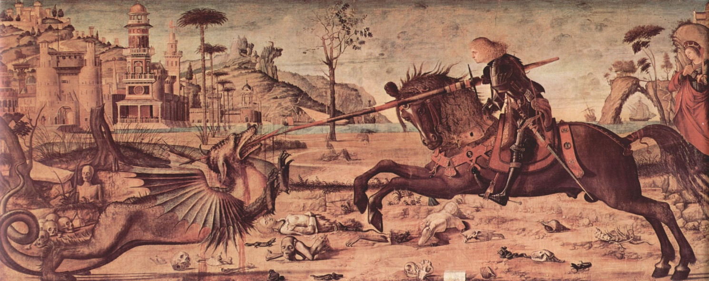

# Leçon 15 | 22 Mars 1961

<!-- source-url: http://staferla.free.fr/S8/S8 LE TRANSFERT.docx -->
<!-- seminar: s8 -->
<!-- lesson: 15 -->

<!-- id: s8-15-0001 -->

*Nous allons encore errer* - ai-je envie de dire - *à travers le labyrinthe de la position du désir*. Un certain *retour*, une certaine *fatigue du sujet,* une certaine *Durcharbeitung,* comme on dit, me parait nécessaire - je l’ai déjà indiqué la dernière fois, et indiqué pourquoi – à une position exacte de la fonction du transfert. C’est pourquoi je reviendrai aujourd’hui à souligner le sens de ce que je vous ai dit la dernière fois en vous ramenant à l’examen des phases dites de « *la migration de la libido sur les zones érogènes* ».

<!-- id: s8-15-0002 -->

Il est très important de voir dans quelle mesure la vue *naturaliste* impliquée dans cette définition se *résout*, s’articule dans notre façon de l’énoncer en tant qu’elle est centrée sur le rapport de *la demande et du désir*. Dès le départ de ce cheminement j’ai pointé :

<!-- id: s8-15-0003 -->

- que le désir conserve, maintient, sa place dans *la marge de la demande* comme telle,

<!-- id: s8-15-0004 -->

- que c’est *cette marge de la demande qui constitue son lieu*, ...que, pour pointer ce qu’ici je veux dire - c’est dans un *au-delà* et un *en deçà* - dans ce double creux qui s’esquisse déjà dès que *le cri de la faim* passe à s’articuler - qu’à l’autre extrême nous voyons que l’objet qu’on appelle le *nipple* en anglais, le « *bout de sein* », le mamelon prend à terme, dans l’érotisme humain, sa valeur d’ἄγαλμα \[agalma\], de *merveille*, d’*objet précieux,* devenant le support de cette volupté, de *ce plaisir* d’un mordillement où se perpétue ce que nous pouvons bien appeler une « *voracité sublimée* » en tant qu’elle prend ce *Lust,* ce *plaisir* et aussi bien ces *Lüste,* ces *désirs* - vous savez l’équivoque que conserve en lui le terme allemand qui s’exprime dans ce *glissement de signification* produit du passage *du singulier au pluriel* [^191] - donc son plaisir et ses désirs, sa convoitise, cet objet oral les prend d’ailleurs.

<!-- id: s8-15-0005 -->

C’est en ça que, par une inversion de l’usage du terme de « *sublimation* », j’ai le droit de dire qu’ici nous voyons cette déviation quant au but en sens inverse de l’objet d’un besoin. En effet, ce n’est pas de la faim primitive que la valeur érotique de cet objet privilégié prend ici sa substance, l’ÉROS qui l’habite vient *nachträglich,* par rétroaction, seulement après-coup, et *c’est dans la demande orale que s’est creusée la place de ce désir*. S’il n’y avait pas *la demande*, avec *l’au-delà d’amour* qu’elle projette, il n’y aurait pas *cette place en deçà *: *du désir,* qui se constitue autour d’un objet privilégié. La phase *orale* de *la libido sexuelle* exige cette place creusée par *la demande*.

<!-- id: s8-15-0006 -->

Il est important de voir si le fait de présenter les choses ainsi ne comporte pas quelque *spécification* qu’on pourrait marquer d’être trop partiale. Ne devons-nous pas prendre à la lettre ce que FREUD nous présente dans tel de ses énoncés comme la *migration* pure et simple d’une *érogénéité organique*, muqueuse dirai-je. Et aussi bien ne peut-on pas dire que je néglige des faits naturels, à savoir par exemple ces motions instinctuelles, dévoratrices que nous trouvons dans la nature liées au cycle sexuel : *les chattes mangeant leurs petits*. Et aussi bien la grande figure fantasmatique de « *la mante religieuse* » qui hante l’amphithéâtre analytique, est là présente comme une image mère, comme une matrice de la fonction attribuée à ce qu’on appelle si hardiment, peut-être après tout si improprement, la « *mère-castratrice* ».

<!-- id: s8-15-0007 -->

Oui bien sûr, moi-même j’ai pris dans mon initiation analytique volontiers support de cette image si riche à nous faire écho du domaine naturel, qui se présente pour nous dans le phénomène inconscient. À rencontrer cette objection vous pouvez me suggérer nécessité de quelque correction dans *la ligne théorique* dont je crois pouvoir vous satisfaire avec moi.

<!-- id: s8-15-0008 -->

Je me suis un instant arrêté à *ce que représente cette image* et demandé d’une certaine façon ce qu’en effet un simple coup d’œil jeté sur *la diversité de l’éthologie animale* nous montre, à savoir une richesse luxuriante de perversions. Quelqu’un de connu \- notre ami Henri EY - a retenu son regard sur ce sujet des perversions animales, qui vont plus loin après tout que tout ce que l’imagination humaine a pu inventer. Je crois qu’il en a fait même dans l’*Évolution psychiatrique* un numéro[^192].

<!-- id: s8-15-0009 -->

Pris sous ce registre, ne nous voilà-t-il pas ramenés à la vue aristotélicienne d’une sorte de *champ externe* au champ humain du fondement du désir pervers ? C’est là que je vous arrêterai un instant en vous priant de considérer ce que nous faisons quand nous nous arrêtons à ce fantasme de « *la perversion naturelle* ». Je ne méconnais pas, en vous priant de me suivre sur ce terrain, ce que peut paraître avoir de *pointilleux*, de *spéculatif* une telle réflexion, mais je crois qu’elle est nécessaire pour décanter ce qu’il y a à la fois de fondé et d’infondé dans cette référence.

<!-- id: s8-15-0010 -->

Et aussi bien, par là allons-nous - vous allez le voir tout de suite - nous trouver rejoindre ce que je désigne comme fondamental dans la subjectivation, comme moment essentiel de toute instauration de la dialectique du désir.

<!-- id: s8-15-0011 -->

Subjectiver la mante religieuse en cette occasion, c’est lui supposer - ce qui n’a rien d’excessif - une jouissance sexuelle.

<!-- id: s8-15-0012 -->

Et après tout nous n’en savons rien, *la mante religieuse* est peut-être, comme DESCARTES n’hésiterait pas à dire, une pure et simple *machine* - « *machine* » : dans son langage à lui - qui suppose justement *l’élimination de toute subjectivité*. Nous n’avons nul besoin, quant à nous, de nous tenir à ces positions minimales : nous lui accordons cette jouissance. Mais cette jouissance - c’est là le pas suivant - est-elle jouissance de quelque chose en tant qu’elle le détruit ? Car c’est seulement à partir de là qu’elle peut nous indiquer les intentions de la nature.

<!-- id: s8-15-0013 -->

Pour tout de suite pointer ce qui est essentiel pour qu’elle soit pour nous un modèle quelconque de ce dont il s’agit, à savoir notre « *cannibalisme oral* », notre « *érotisme primordial* » - je le désigne tout de suite - il faut à proprement parler que nous imaginions ici cette jouissance corrélative de la décapitation du partenaire, qu’elle est supposée à quelque degré connaître comme tel. Je n’y répugne pas, car à la vérité c’est l’éthologie animale qui pour nous est la référence majeure pour que se maintienne cette dimension du « *connaître* » - *que tous les progrès de notre connaissance rendent pourtant pour nous, dans le monde humain, si vacillante –* de s’identifier à proprement parler à la dimension du « *méconnaître* », de la *Verkennung* comme dit FREUD.

<!-- id: s8-15-0014 -->

Seule remarque : l’observation, ailleurs dans le champ du vivant, de cette *Erkennung*[^193] imaginaire, de ce privilège du semblable qui va dans certaines espèces jusqu’à se révéler pour nous dans des effets organogènes. Je ne reviendrai pas sur l’ancien exemple[^194] autour duquel je vous faisais tourner mon exploration de l’imaginaire au temps où je commençais d’articuler quelque chose de ce qui vient, avec les années, à maturité - à maturité devant vous : ma doctrine de l’analyse - la pigeonne en tant qu’elle ne s’achève comme pigeonne qu’à avoir vu son « *image pigeonnière* », à quoi peut suffire une petite glace dans la cage, et aussi le criquet pèlerin qui ne franchit ses stades qu’à avoir rencontré un autre criquet.

<!-- id: s8-15-0015 -->

Il n’est pas douteux que, pas seulement dans ce qui nous fascine nous, mais dans ce qui fascine le mâle de la mante religieuse, il y a cette érection d’une forme fascinante, ce déploiement, cette attitude d’où pour nous elle tire son nom : « *la mante religieuse* », c’est singulièrement de cette position - non sans doute sans prêter pour nous à je ne sais quel retour vacillant - qui se présente à nos yeux comme celle de la prière. Nous constatons que c’est devant ce fantasme, ce fantasme incarné, que le mâle cède, qu’il est pris, appelé, aspiré, captivé dans l’étreinte qui sera pour lui mortelle. Il est clair que l’image de « *l’autre imaginaire* » comme tel est là présente dans le phénomène, qu’il n’est pas excessif de supposer que quelque chose se révèle là de cette image de l’autre.

<!-- id: s8-15-0016 -->

Mais est-ce pour autant dire qu’il y a là déjà quelque préfigure, une sorte de calque inversé de ce qui se présenterait donc chez l’homme comme une sorte de reste, de séquelle, d’une définie possibilité des variations du jeu des tendances naturelles ? Et si nous devons accorder quelque *valeur* à cet exemple, monstrueux à proprement parler, nous ne pouvons tout de même pas faire autrement que remarquer que la différence avec ce qui se présente dans la fantasmatique humaine - celle où nous pouvons partir avec certitude du sujet, là où seulement nous en sommes assurés, à savoir en tant qu’il est le support de la chaîne signifiante - nous n’y pouvons donc pas ne pas remarquer que dans ce que nous présente la nature il y a, de l’acte à son excès, à ce qui le déborde et l’accompagne, à *ce surplus dévorateur* qui le signale pour nous comme *exemple d’une autre structure instinctuelle*, qu’il y a là *synchronie* : c’est que c’est au moment de l’acte que s’exerce ce complément pour nous exemplifiant la forme paradoxale de l’instinct.

<!-- id: s8-15-0017 -->

Dès lors, est-ce qu’ici ne se dessine pas une limite qui nous permet de définir strictement en quoi ce qui est exemplifié nous sert, mais ne nous sert qu’à nous donner la forme de ce que nous voulons dire quand nous parlons d’un désir. Si nous parlons de la jouissance de cet autre qu’est la mante religieuse, si elle nous intéresse en cette occasion, c’est que, ou bien elle jouit là où est l’organe du mâle, et aussi elle jouit ailleurs, mais où qu’elle jouisse - ce dont nous ne saurons jamais rien, peu importe - qu’elle *jouisse* ailleurs ne prend son sens que du fait qu’elle *jouisse* - ou ne *jouisse pas*, peu importe - *<u>là</u>*. Qu’elle jouisse où ça lui chante, ceci n’a de sens, dans la valeur que prend cette image, que du rapport à un « *là* » d’un jouir virtuel.

<!-- id: s8-15-0018 -->

Mais en fin de compte dans la synchronie - de quoi que ce soit qu’il s’agisse - ce ne sera jamais après tout, même détournée, qu’une jouissance copulatoire. Je veux dire que, dans l’infinie diversité des mécanismes instinctuels dans la nature, nous pouvons facilement découvrir toutes les formes possibles, y compris celle où l’organe de la copulation est perdu *in* *loco* dans la consommation elle-même. Nous pouvons aussi bien considérer que le fait de la dévoration est là une des nombreuses formes de la prime qui est donnée au partenaire individuel de la copulation, en tant qu’ordonnée à sa fin spécifique, *pour le retenir* dans l’acte qu’il s’agit de permettre. Le caractère, exemplificateur donc, de l’image qui nous est proposée ne commence qu’au point précis où nous n’avons pas le droit d’aller :

<!-- id: s8-15-0019 -->

- à savoir que cette dévoration de l’extrémité céphalique du partenaire par la mante religieuse est quelque chose qui est marqué du fait que ceci s’accomplit avec les mandibules du partenaire femelle qui participent comme telles des propriétés que constitue, dans la nature vivante, *l’extrémité céphalique,*

<!-- id: s8-15-0020 -->

- à savoir un certain rassemblement de la tendance individuelle comme telle,

<!-- id: s8-15-0021 -->

- à savoir la possibilité dans quelque registre qu’elle s’exerce d’un discernement, d’un choix. Autrement dit, que la mante religieuse aime mieux ça, la tête de son partenaire, que *quoi que ce soit d’autre*, qu’il y a là une préférence, *malle*, *mavult* [^195], c’est ça qu’elle aime.

<!-- id: s8-15-0022 -->

Et c’est en tant qu’elle aime ça, que pour nous, dans l’image, elle se montre comme jouissance aux dépens de l’autre, et pour tout dire, que nous commençons à mettre dans *les fonctions naturelles* ce dont il s’agit, à savoir du sens moral, autrement dit que nous entrons dans la dialectique sadienne comme telle.

<!-- id: s8-15-0023 -->

*Cette préférence de la jouissance à toute référence à l’autre se découvre comme la dimension de polarité essentielle de la nature.* Il n’est que trop visible que ce *sens moral*, c’est nous qui l’apportons, mais que nous l’apportons dans la mesure où nous découvrons le sens du désir comme ce rapport à quelque chose qui, dans *l’autre*, choisit cet *objet partiel*.

<!-- id: s8-15-0024 -->

Faisons ici encore un peu plus attention. Cet exemple est-il pleinement valable pour nous illustrer *cette préférence de la partie par rapport* *au tout*, jugement illustrable dans la valeur érotique de cette *extrémité mamelonnaire* dont je parlais tout à l’heure ? Je n’en suis pas si sûr, pour autant que c’est moins, dans cette image de la mante religieuse, *la partie qui serait préférée au tout* - de la façon la plus horrible, nous permettant déjà de court-circuiter la fonction de la métonymie - que plutôt *le tout qui est préféré à la partie*.

<!-- id: s8-15-0025 -->

N’omettons pas en effet que, même dans une structure animale aussi éloignée de nous en apparence que l’est celle de l’insecte, la valeur de *concentration*, de *réflexion*, de *totalité,* représentée quelque part dans l’extrémité céphalique, assurément fonctionne, et qu’en tout cas, dans le fantasme, dans l’image qui nous attache, joue avec son accentuation particulière, cette acéphalisation du partenaire telle qu’elle nous est présentée ici.

<!-- id: s8-15-0026 -->

Et que, pour tout dire, la valeur *fabulatoire* de la mante religieuse, celle qui est sous-jacente à ce qu’elle représente effectivement dans une certaine *mythologie* ou plus simplement un folklore, dans tout ce sur quoi CAILLOIS a mis l’accent sous le registre *du mythe* *et le sacré*, ce qui est son premier ouvrage[^196], il ne semble pas qu’il ait suffisamment pointé que nous sommes là dans la poésie, dans quelque chose qui ne tient pas seulement son accent d’une référence au rapport à l’objet oral tel qu’il se dessine dans la κοινῇ \[koinè\] *de l’inconscient*, la *langue commune,* mais dans quelque chose de plus accentué, dans quelque chose qui nous désigne un certain lien de l’acéphalie avec la transmission de la vie comme telle, dans la désignation de ceci : qu’il y a, dans ce passage de la flamme d’un individu à l’autre, dans une éternité signifiée de l’espèce, que le τέλος \[telos\] ne passe pas par la tête.

<!-- id: s8-15-0027 -->

C’est ceci qui donne à *l’image de la mante* son sens tragique qui, comme vous le voyez, n’a rien à faire avec la préférence pour un objet dit objet oral qui, en aucune occasion - dans le fantasme humain en tout cas - ne se rapporte à la tête. C’est de bien autre chose qu’il s’agit dans la liaison à la phase orale du désir humain.

<!-- id: s8-15-0028 -->

*Ce qui se profile d’une identification réciproque du sujet à l’objet du désir oral*, c’est quelque chose qui va - l’expérience nous le montre tout de suite - à un morcellement constitutif, à ces images morcelantes qu’on a évoquées récemment lors de nos « *Journées provinciales* » comme liées à je ne sais quelle terreur primitive qui semblait, je ne sais pourquoi, pour les auteurs, prendre je ne sais quelle valeur de *désignation inquiétante*, alors que c’est bien le fantasme le plus fondamental, le plus répandu, le plus commun, aux origines de toutes les relations de l’homme à sa somatique.

<!-- id: s8-15-0029 -->

<!-- id: s8-15-0030 -->

Les morceaux du pavillon d’anatomie qui peuplent l’image célèbre du « *Saint Georges* » de CARPACCIO dans la petite église de Sainte-Marie-des-Anges à Venise[^197] sont bien ce qui, je crois, avec ou sans analyse, n’est pas sans s’être présenté - *au niveau du rêve* - à toute expérience individuelle, et aussi bien dans ce registre, la tête qui se promène toute seule continue très bien, comme dans CAZOTTE[^198], à raconter ses petites histoires.

<!-- id: s8-15-0031 -->

L’important n’est pas là. Et la découverte de l’analyse, c’est que le sujet, dans le champ de l’Autre, rencontre non pas seulement les images de son propre morcellement mais d’ores et déjà, dès l’origine, *les objets du désir de l’Autre*, à savoir de la mère, non pas seulement dans leur état de morcellement mais avec les privilèges que leur accorde *le désir de la mère*.

<!-- id: s8-15-0032 -->

Autrement dit, qu’il y a un de ces *objets* qu’il rencontre, et qui est le *phallus paternel* - d’ores et déjà rencontré dès les premiers fantasmes du sujet, nous dit Mélanie KLEIN - à l’origine du « *fàndum »*[^199] du « *il doit parler, il va parler* ». Déjà dans l’empire intérieur, dans cet intérieur du corps de la mère où se projettent les premières formations imaginaires, quelque chose est aperçu qui se distingue comme plus spécialement accentué, voire nocif : le *phallus paternel*.

<!-- id: s8-15-0033 -->

Sur le champ du *désir de l’Autre*, *l’objet subjectif* rencontre déjà des occupants identifiables *à l’aune desquels*, si je puis dire, *au taux desquels* il a déjà à se faire valoir et à se peser, et poser ces petits poids diversement modelés qui sont en usage dans les tribus primitives de l’Afrique où vous voyez un petit animal en manière de tortillon, voire quelque objet phalloforme comme tel. Donc à ce niveau fantasmatique, le privilège de l’image de *la mante* est uniquement ceci - qui n’est pas après tout tellement assuré - que *la mante* est supposée - ses mâles - les manger en série, et que ce passage au pluriel est la dimension essentielle par où elle prend pour nous valeur fantasmatique.

<!-- id: s8-15-0034 -->

Voici donc définie cette phase orale. Ce n’est qu’à l’intérieur de la demande que l’Autre se constitue comme reflet de la faim du sujet. L’Autre donc n’est point seulement faim, mais faim articulée, faim qui demande. Et le sujet par là y est ouvert à devenir objet, mais si je puis dire, d’une faim qu’il choisit. La transition est faite de la faim à l’érotisme par la voie de ce que j’appelais tout à l’heure une préférence : elle aime quelque chose, ça spécialement d’une gourmandise si l’on peut dire. Nous voilà réintroduits dans *le registre* *des péchés originels*. Le sujet vient se placer sur le menu à la carte du cannibalisme dont chacun sait qu’il n’est jamais absent d’aucun *fantasme communionnel*. Lisez cet auteur dont je vous parle au cours des années avec une sorte de retour périodique, Baltasar GRACIAN[^200]. Évidemment seuls ceux d’entre vous qui entravent l’espagnol peuvent y trouver - à moins de se le faire traduire - leur pleine satisfaction.

<!-- id: s8-15-0035 -->

Traduit très tôt, comme on traduisait à l’époque, presque instantanément dans toute l’Europe - tout de même des choses sont restées non traduites. C’est un traité de la communion, « *El* *Comulgatorio »*, qui est un bon texte en ce sens que là se révèle quelque chose qui est rarement avoué, les délices de la consommation du *Corpus* *Christi*, du corps du Christ, y sont détaillés. Et on nous prie de nous arrêter à cette joue exquise, à ce bras délicieux, je vous passe la suite, où *la concupiscence spirituelle* se satisfait, s’attarde, nous révélant ainsi ce qui reste toujours impliqué dans les formes, même les plus élaborées, de l’identification orale.

<!-- id: s8-15-0036 -->

En opposition à cette thématique où *vous voyez par la vertu du signifiant se déployer dans tout un champ* d’ores et déjà créé pour être secondairement habité, la tendance la plus *originelle*, c’est vraiment en opposition à celle-ci que la dernière fois j’ai voulu vous montrer un sens ordinairement peu ou mal articulé de *la demande anale*, en vous montrant qu’elle se caractérise par un renversement complet au bénéfice de l’autre, de l’initiative.

<!-- id: s8-15-0037 -->

Et que c’est proprement là que gît - c’est-à-dire à un stade pas si évidemment avancé ni sûr dans notre idéologie normative - la source de la discipline, je n’ai pas dit le devoir, la discipline comme on dit, de *la propreté* où la langue française marque si joliment l’oscillation avec *la propriété*, avec ce qui appartient en propre, l’éducation, les bonnes manières si je puis dire.

<!-- id: s8-15-0038 -->

*Ici la demande est extérieure*, et au niveau de l’autre, et se pose articulée comme telle. L’étrange est qu’il nous faut voir là et reconnaître, dans ce qui a toujours été dit, et dont il semble que personne n’ait vraiment traité la portée, *que là naît à proprement parler l’objet de don comme tel*, et que ce que le sujet peut donner dans cette *métaphore* est exactement lié à ce qu’il peut retenir, à savoir son propre déchet, son excrément. Il est impossible de ne pas voir *quelque chose* d’*exemplaire*, *quelque chose* qui est à proprement parler indispensable à désigner comme le point radical où se décide la projection du désir du sujet dans l’autre.

<!-- id: s8-15-0039 -->

Il est un point de la phase, où le désir s’articule et se constitue, où l’autre en est à proprement parler le dépotoir. Et l’on n’est pas étonné de voir que les idéalistes de la thématique d’une « *hominisation* » du cosmos, ou comme ils sont forcés de s’exprimer de nos jours : de la planète, une des phases manifeste depuis toujours de *l’hominisation* [^201] de la planète, c’est que l’animal–homme en fait à proprement parler un *dépotoir*, un *dépôt d’ordures*. Le témoignage le plus ancien que nous ayons d’agglomérations humaines comme telles, ce sont d’*énormes pyramides de débris de coquillages*, ça a *un nom scandinave* [^202].

<!-- id: s8-15-0040 -->

Ce n’est pas pour rien que les choses sont ainsi. Bien plus il semble que s’il faut quelque jour échafauder le mode par où l’homme s’est introduit au champ du signifiant, c’est dans ces premiers amas qu’il conviendra de le désigner. Ici le *sujet* se désigne dans *l’objet évacué* comme tel. Ici est, si je puis dire, le point zéro du désir. *Il repose tout entier sur l’effet de la demande de l’Autre*. L’Autre en décide, et c’est bien où nous trouvons la racine de cette dépendance du névrosé. Là est le point sensible, la note sensible par quoi le désir du névrosé se caractérise comme prégénital.

<!-- id: s8-15-0041 -->

C’est pour autant qu’il dépend tellement de *la demande* de l’Autre, que ce que le névrosé demande à l’Autre, dans sa demande d’amour de névrosé, c’est qu’on lui laisse faire quelque chose de *cette place du désir*, que c’est *cette place du désir* qui reste manifestement, jusqu’à un certain degré dans la dépendance de la demande de l’Autre. Car le seul sens que nous puissions donner au stade génital *pour autant qu’à cette place du désir reparaîtrait quelque chose qui aurait droit à s’appeler un désir naturel* - encore que, vu ses nobles antécédents, il ne puisse jamais l’être - c’est que *le désir devrait bien un jour apparaître comme ce qui ne se demande pas, comme viser ce qu’on ne demande pas*.

<!-- id: s8-15-0042 -->

Et puis ne vous précipitez pas pour *dire* que c’est ce qu’on prend, par exemple, parce que tout ce que vous *dites* ne fera jamais que vous faire retomber dans la petite mécanique de la demande. *Le désir naturel a* - à proprement parler - *cette dimension de ne pouvoir* *se dire d’aucune façon*, et c’est bien pour ça que vous n’aurez jamais aucun désir naturel, parce que l’Autre est déjà installé dans la place, l’Autre avec un grand A, comme celui où repose *le signe*. Et *le signe* suffit à instaurer la question : « *Che vuoi ?* », « *Que veux-tu ?* » à laquelle d’abord le sujet ne peut rien répondre, toujours retardé par la question dans la réponse qu’elle postule.

<!-- id: s8-15-0043 -->

*Un signe représente quelque chose pour quelqu’un* et faute de savoir *ce que représente le signe*, le sujet devant *cette question* \[Che vuoi ?\], quand apparaît le désir sexuel, perd le *quelqu’un* auquel *la question* s’adresse c’est-à-dire lui-même… et naît l’angoisse du petit Hans. Ici se dessine ce quelque chose qui, préparé par le sillon de la fracture du sujet de par la demande, s’instaure dans la relation \- que pour un instant nous allons tenir comme elle se tient souvent : isolée - de l’enfant et de la mère.

<!-- id: s8-15-0044 -->

La mère du petit Hans, et aussi bien *toutes les mères* - « *j’en appelle à toutes les mères », comme disait l’autre*[^203] - distingue sa position en ceci qu’elle marque, pour ce qui commence d’apparaître de petit *frétillement*, de petit *frémissement* non douteux dans le premier éveil d’une sexualité génitale comme telle chez Hans : « *c’est tout à fait cochon ça* », *c’est dégoûtant le désir*, ce désir dont il ne peut dire ce que c’est.

<!-- id: s8-15-0045 -->

Mais ceci est strictement corrélatif d’*un intérêt* non moins douteux *pour quelque chose qui est ici l’objet*, celui auquel nous avons appris à donner toute son importance, à savoir *le phallus*. D’une façon sans doute allusive mais non ambiguë, combien de mères - toutes les mères - devant le petit robinet du petit Hans, ou de quelque autre, devant le « *Wiwimacher* », le « *fait-pipi* », de quelque façon qu’on l’appelle, feront des réflexions comme : « *il est fort bien doué mon petit* », ou bien : « *tu auras beaucoup d’enfants* ». Bref, l’appréciation en tant que portée sur l’objet, lui, bel et bien *partiel* encore ici, est quelque chose qui contraste avec le refus du désir.

<!-- id: s8-15-0046 -->

Ici, au moment même de la rencontre avec ce qui sollicite le sujet dans le mystère du désir, la division s’instaure entre cet objet qui devient la marque d’un intérêt privilégié, cet objet qui devient l’ἄγαλμα \[agalma\]*, la perle* au sein de l’individu qui ici tremble autour du point pivot de son avènement à la plénitude vivante, et en même temps d’un ravalement du sujet.

<!-- id: s8-15-0047 -->

Il est apprécié comme *objet*, il est déprécié comme *désir*. Et c’est là autour, que va tourner cette instauration du registre de « l’*avoir* », que vont jouer les comptes. La chose vaut la peine que nous nous y arrêtions, je vais entrer dans plus de détails. La thématique de « l’*avoir* », je vous l’annonce depuis longtemps par des formules telles que celle-ci : « *l’amour, c’est donner ce qu’on n’a pas* », bien sûr, car vous voyez bien que, quand l’enfant donne ce qu’il a, c’est au stade précédent. Qu’est-ce qu’il n’a pas, et en quel sens ?

<!-- id: s8-15-0048 -->

Ce n’est pas du côté du *phallus* - encore qu’on puisse faire tourner autour de lui la dialectique de « *l’être* » et de « l’*avoir* » - que vous devez porter le regard pour bien comprendre quelle est la dimension nouvelle qu’introduit *l’entrée dans le drame phallique.* Ce qu’il n’a pas, ce dont il n’a pas la disposition, à ce point de naissance, de révélation du *désir génital*, *ce n’est rien d’autre que son acte.* Il n’a rien qu’une traite sur l’avenir. Il institue l’acte dans le champ du *projet*.

<!-- id: s8-15-0049 -->

Et je vous prierai ici de remarquer la force des déterminations linguistiques par quoi, de même que le désir a pris dans *la conjonction* des langues romanes cette connotation de *desiderium,* de *deuil* et de *regret*, ça n’est pas rien que les formes primitives du futur soient abandonnées pour une référence à « l’*avoir* ». « *Je chanterai* », c’est exactement ce que vous voyez écrit : « *Je chanter-ai* », effectivement ceci vient de *cantare habeo*. La langue romaine décadente a trouvé la voie la plus sûre de retrouver le vrai sens du futur : je baiserai plus tard, j’ai le baiser à l’état de traite sur l’avenir : je « *désirer-ai* ».

<!-- id: s8-15-0050 -->

Et aussi bien cet *habeo* introduit au *debeo* de la dette symbolique, à un *habeo* destitué. Et c’est au futur que se conjugue cette dette quand elle prend la forme de commandement : « *Tes père et mère honoreras* », etc. *Mais*...

<!-- id: s8-15-0051 -->

> et c’est ici que je veux aujourd’hui seulement vous retenir au bord de ce qui résulte de cette articulation,
>
> lente sans doute, mais faite justement pour que vous n’y précipitiez pas à l’excès votre marche …*l’objet dont il s’agit*, disjoint du désir, *l’objet phallus*, *n’est pas la simple spécification, l’homologue*, l’homonyme du *petit(a) imaginaire* où déchoit la plénitude de l’Autre, du grand A. Ce n’est pas une spécification enfin venue au jour de ce qui aurait été auparavant l’objet oral, puis l’objet anal.

<!-- id: s8-15-0052 -->

*C’est quelque chose...* comme je vous l’ai indiqué dès l’abord, au début de ce discours aujourd’hui, quand je vous ai marqué du sujet la première rencontre avec le phallus …*c’est un objet privilégié* dans le champ de l’Autre. C’est un objet *qui vient en déduction du statut de l’Autre*, du grand Autre comme tel.

<!-- id: s8-15-0053 -->

En d’autres termes, *le petit(a)*...

<!-- id: s8-15-0054 -->

> au niveau du désir génital et de la phase de la castration,
>
> dont tout ceci - vous le percevez bien - est fait pour vous introduire l’articulation précise

<!-- id: s8-15-0055 -->

...*le petit(a), c’est le* A *moins phi : (a)* = A – ϕ.

<!-- id: s8-15-0056 -->

En d’autres termes, c’est par ce biais que le ϕ *(phi) vient à symboliser ce qui manque à l’A pour être l’A [noétique](http://www.cnrtl.fr/lexicographie/noetique?),* l’A de plein exercice, l’Autre en tant qu’on peut faire foi à sa réponse à la demande. De cet Autre noétique, le désir est une *énigme*, et cette *énigme* est nouée avec le fondement structural de sa castration. C’est ici que va s’inaugurer toute la dialectique de la castration.

<!-- id: s8-15-0057 -->

Faites attention maintenant de ne pas confondre non plus cet *objet phallique* avec ce même *signe* qui serait le *signe* au niveau de l’Autre de son manque de réponse, *le manque* dont il s’agit ici, est *le manque* du *désir de l’Autre*. La fonction que va prendre ce *phallus* en tant qu’il est rencontré dans le champ de l’*imaginaire*, c’est non pas d’être identique à l’Autre comme désigné par le manque d’un signifiant, mais d’être *la racine de ce manque*.

<!-- id: s8-15-0058 -->

C’est l’Autre qui se constitue dans une relation, privilégiée certes à cet objet ϕ, mais dans une relation complexe.

<!-- id: s8-15-0059 -->

C’est ici que nous allons trouver la pointe de ce qui constitue l’impasse et le problème de l’amour, c’est que le sujet ne peut satisfaire la demande de l’Autre qu’à *le rabaisser*, qu’à le faire lui, cet autre, *l’objet de son désir*.

## Notes

[^191]: *Die Lust* (fém. sing.), *der Lust* (masc. sing.) : employés par Freud dans le sens de *plaisir.* Die Lüste (pluriel) : désirs, appétits. On trouve à ce sujet une note

    de Freud lui-même (1905) « *Il est très instructif que la langue allemande prenne en compte dans l’utilisation du mot « Lust » le rôle, mentionné dans le texte, des excitations*

    *sexuelles préliminaires qui fournissent simultanément une part de satisfaction et un apport à la tension sexuelle. « Lust » est à double sens et désigne aussi bien la sensation de la*

    *tension sexuelle (j’ai envie = je voudrais, j’éprouve l’impulsion) que celle de la satisfaction.* » (S. Freud, *Trois essais sur la théorie du sexuel,* n°3, *La Transa,* n° spécial, p. 23*.)*

[^192]: Ce n’est pas un numéro de *l’Évolution psychiatrique* que Henri Ey a consacré aux perversions animales mais, sous sa direction avec Brion, est paru :

    H. Ey, A. Brion : *Psychiatrie animale,* Desclée de Brouwer, Paris, 1964.

[^193]: De l’allemand *Verkennung :* méconnaissance : *Erkennung ;* reconnaissance.

[^194]: *Écrits,* p. 95-96, 189, 190.

[^195]: Du latin *malle* : aimer mieux, préférer ; *mavult* : elle aime mieux, elle préfère.

[^196]: Roger Caillois : *Le mythe et l’homme,* Paris, Gallimard, 1938, chap. 11, déjà cité par Lacan *Écrits*, p. 96.

[^197]: Ce tableau de Carpaccio, « *Saint Georges combattant le Dragon* », se trouve à la Scuola de San Giorgio degli Schiavoni à Venise.

[^198]: Cazotte : *Le* *Diahle amoureux*., Garnier-Flammarion, Paris, 1979, p. 59.

[^199]: fàndum* :* il doit parler. Du latin *fari :* parler

[^200]: Baltasar Gracian : Le Criticon, Paris, Allia, I et II (1998 et 2002).

[^201]: Cf. Teilhard de Chardin, cité dans les *Écrits*, notamment p. 88, 684.

[^202]: Cf. séminaire 1965-66 : *L’objet*, 08-12-65 : « *ça porte un joli nom en danois mais je suis incapable de le prononcer – c’est un amas de détritus, alors, là nous avons l’objet(a) !* »

    Kjökkenmödding : Amas coquiller résultant généralement de la consommation de mollusques sur une longue période (à quoi sont associés divers objets et

    parfois du charbon de bois) par des populations mésolithiques et néolithiques, de la Baltique, de l'Écosse, de France, du Portugal, d'Amérique du Sud, etc.

[^203]: Marie-Antoinette accusée d’inceste envers son fils, à son procès le 14 Oct. 1793.
