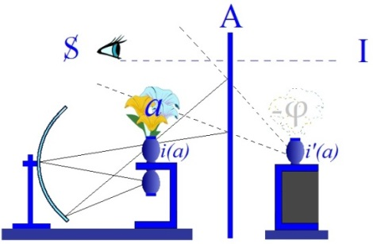
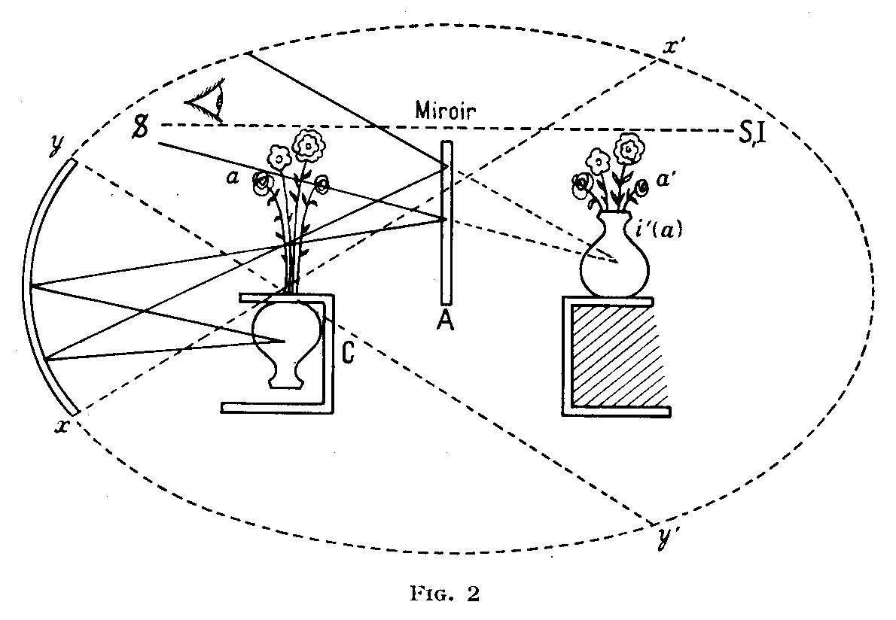
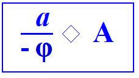

# Leçon 26 | 21 Juin 1961

<!-- source-url: http://staferla.free.fr/S8/S8 LE TRANSFERT.docx -->
<!-- seminar: s8 -->
<!-- lesson: 26 -->

<!-- id: s8-26-0001 -->

Nous allons essayer aujourd’hui de tenir quelques propos sur le sujet de *l’identification* pour autant que - vous avez saisi, j’espère - que nous y sommes amenés comme au dernier terme de la question précise autour de laquelle nous avons fait tourner cette année toute notre tentative d’élucidation du transfert. Je vous ai annoncé, la dernière fois, que *je reprendrai*, sous le signe de la jaculation célèbre de PINDARE, dans la huitième Pythique faite pour ARISTOMÈNE, lutteur d’Égine, vainqueur des jeux :

<!-- id: s8-26-0002 -->

Έπάμεροί ! τί δέ τις ? τί δ'οῠ τις ? Σκιᾶς ὄναρ ἄνθρωπος. \[Epameroi ! Ti dé tis ? Ti d’ou tis ? Skias onar anthrôpos \] *Êtres éphémères ! Qu’est chacun de nous, que n’est-il pas ? L’homme est le rêve d’une ombre.* \[trad. Aimé Puech\] \[*Ô homme d'un jour : qu'est-ce que l'être, qu'est-ce que le néant ? Tu n'es que le rêve d'une ombre.* (trad. Faustin Colin)\]

<!-- id: s8-26-0003 -->

Nous reprendrons ici notre référence à ce rapport qui est celui que j’ai essayé, pour vous, de faire supporter par un modèle entre *deux niveaux concrets de l’identification* : ce n’est pas par hasard que je mets l’accent sur la nécessité de leur distinction, distinction évidente, phénoménologiquement à la portée de n’importe qui. Le *moi idéal* ne se confond pas avec l’*idéal du moi*, c’est ce que *le psychologue* peut découvrir à lui tout seul, et qu’il ne manque pas de faire d’ailleurs.

<!-- id: s8-26-0004 -->

Que la chose soit aussi importante dans l’*articulation* de la dialectique freudienne, c’est bien ce que nous confirmera, par exemple, le travail auquel je faisais allusion la dernière fois, celui de M. Conrad STEIN sur l’identification primaire. Ce travail se termine sur la reconnaissance de ce qui reste encore obscur, c’est la différence entre les deux séries que FREUD distingue, souligne et accentue comme étant : *les identifications du moi,* et *les identifications de l’idéal du moi*.

<!-- id: s8-26-0005 -->

Prenons donc le petit *schéma* avec lequel vous commencez à vous familiariser et que vous retrouverez quand vous travaillerez à tête reposée sur le numéro de la revue *La Psychanalyse* qui va paraître.

<!-- id: s8-26-0006 -->

<!-- id: s8-26-0007 -->

*L’illusion* ici représentée, dite « *du vase renversé* », ne peut se produire que pour l’œil qui se situe quelque part à l’intérieur du cône ainsi produit par le point de jonction de la limite du miroir sphérique avec le point foyer où doit se produire *l’illusion dite du vase renversé*. Vous savez que cette illusion - image réelle - est ce qui nous sert à métaphoriser quelque chose que j’appelle *i(a)* et dont vous savez que ce dont il s’agit est ce qui est support de *la fonction de l’image spéculaire*. Autrement dit, c’est l’image spéculaire en tant que telle et chargée de son ton, de son accent spécial, de son pouvoir de fascination, de l’investissement propre qui est le sien dans le registre de cet investissement libidinal bien distingué par FREUD sous le terme d’investissement narcissique. La fonction *i(a)* est la fonction centrale de l’investissement narcissique.

<!-- id: s8-26-0008 -->

Ces mots ne suffisent pas à définir toutes les relations, toutes *les incidences* sous lesquelles nous verrons apparaître la fonction de *i(a)*. Ce que nous dirons aujourd’hui vous permettra de préciser de quoi il s’agit, c’est ce que j’appelle aussi la fonction du *moi idéal* en tant qu’opposée et distincte de celle de l’*idéal du moi*.

<!-- id: s8-26-0009 -->

Je trace *la mise en fonction de l’Autre*, grand A, l’Autre en tant qu’il est l’Autre du sujet parlant, l’Autre en tant que par lui, *lieu de la parole*, l’incidence du signifiant, vient à jouer pour tout sujet, pour tout sujet à qui nous, nous avons affaire comme psychanalystes. Nous pouvons ici fixer la place de ce qui va fonctionner comme *idéal du moi*. Dans le petit schéma, tel que vous le verrez publié dans la revue à paraître :

<!-- id: s8-26-0010 -->

<!-- id: s8-26-0011 -->

Vous verrez que cet S *purement virtuel* n’est là qu’en tant que *figuration d’une fonction du sujet* qui est, si je puis dire, *une nécessité de la pensée*. Cette nécessité même qui est au principe de *la théorie de la connaissance* : nous ne pourrions rien concevoir comme *objet* que le sujet supporte, qui n’ait précisément cette fonction, dont, comme analystes, nous mettons en question l’existence réelle puisque ce que, comme *analystes*, nous mettons au jour, c’est que par le fait que le sujet auquel nous avons affaire est essentiellement *un sujet qui parle*, ce sujet ne saurait se confondre avec « *le sujet de la connaissance* ».

<!-- id: s8-26-0012 -->

C’est vraiment vérité de LA PALICE que d’avoir *rappelé* aux analystes que le sujet pour nous n’est pas *le sujet de la connaissance* mais *le sujet de l’inconscient*. Spéculer de lui comme de « *la pure transparence à soi-même de la pensée* », c’est justement contre cela que nous nous élevons : c’est une pure illusion que la pensée soit transparente. Je sais l’insurrection que je peux provoquer à tel tournant dans l’esprit d’un philosophe. Croyez-le bien, j’ai déjà eu avec des souteneurs \[sic\] de la position cartésienne des discussions assez poussées pour dire qu’il y a tout à fait moyen de s’entendre. Je laisse donc de côté la discussion elle-même qui n’est pas ce qui nous intéresse aujourd’hui.

<!-- id: s8-26-0013 -->

Ce sujet, donc ce S qui est là dans notre schéma, est en position d’user d’un artifice, de ne pouvoir qu’user d’un artifice, de n’accéder que par artifice, à la saisie de cette *image* - *image réelle* - qui se produit en *i(a)*, ceci *parce qu’il n’est pas là* ! Ce n’est que par l’intermédiaire du miroir de l’Autre qu’il vient à s’y placer : *comme il n’est rien, il ne peut s’y voir*.

<!-- id: s8-26-0014 -->

Aussi bien n’est-ce pas lui en tant que sujet qu’il cherche dans ce miroir. Il y a très longtemps, dans le discours sur la causalité psychique, discours de Bonneval peu après la guerre, j’ai parlé de : ce « *miroir sans surface où ne se reflète rien* »[^318].

<!-- id: s8-26-0015 -->

Ce propos énigmatique pouvait alors prêter à confusion avec je ne sais quel exercice d’ascèse plus ou moins mystique. Reconnaissez aujourd’hui ce que j’ai voulu dire, ou plus exactement, commencez d’y pressentir le point sur lequel peut se centrer la question de la fonction de l’analyste comme miroir - *ce n’est pas du miroir de l’assomption spéculaire qu’il s’agit -* je veux dire pour la place qu’il a à tenir, lui analyste, même si c’est dans ce miroir que doit se produire l’image spéculaire *virtuelle*.

<!-- id: s8-26-0016 -->

Cette image virtuelle qui est ici en *i’(a)* la voici :

<!-- id: s8-26-0017 -->

<!-- id: s8-26-0018 -->

Et c’est bien en effet ce que le sujet voit dans l’Autre, mais il ne la voit dans l’Autre que pour autant qu’il est dans une place qui ne se confond pas avec la place de ce qui est reflété. Nulle condition ne le lie à être à *la place de* *i(a)* pour se voir en *i’(a)* mais certaines conditions le lient à être tout de même dans un certain champ : c’est celui que dessinent les lignes limitant un certain volume conique.

<!-- id: s8-26-0019 -->

Pourquoi donc - dans ce schéma originaire – ai-je mis S au point où je l’ai mis, où vous le trouverez dans la figure que j’ai publiée ? Rien n’implique qu’il soit là plutôt qu’ailleurs. En principe il est là parce que, par rapport à l’orientation de la figure, vous le voyez apparaître en quelque sorte derrière *i(a)* et que cette position : derrière, n’est pas sans avoir un répondant phénoménologique qu’exprime assez bien l’expression qui n’est pas là par hasard : « *une idée derrière la tête* ». Pourquoi donc *les idées*, qui sont généralement les idées qui nous soutiennent, seraient qualifiées d’« *idée de derrière la tête* » ? Il faut bien savoir aussi que ce n’est pas pour rien que *l’analyste se tient derrière le patient.* Aussi bien *cette thématique de ce qui est devant et de ce qui est derrière*, nous allons la retrouver tout à l’heure.

<!-- id: s8-26-0020 -->

Quoi qu’il en soit, il convient de repérer dans quelle mesure le fait que la position de S n’est repérable que quelque part dans le champ de l’Autre - dans le champ virtuel que développe l’Autre par sa présence comme champ de réflexion - qu’en tant que cette position de S s’y trouve en un point grand I et en tant qu’il est distinct de la place où *i’(a)* se projette.

<!-- id: s8-26-0021 -->

C’est seulement en tant que cette distinction non seulement est possible mais qu’elle est ordinaire que le sujet peut appréhender ce qu’a de foncièrement *illusoire* son *identification* en tant qu’elle est *narcissique*. Il y a σκιᾶς \[skias\] *l’ombre*, *der Schatten* dit quelque part FREUD et précisément à propos de quoi : *das* *verlorene Objekt,* de l’objet perdu dans le travail du deuil[^319]. *Der Schatten,* l’ombre.

<!-- id: s8-26-0022 -->

Cette opacité, cette ombre essentielle apporte dans le rapport à l’objet la structure *narcissique* du monde. Si elle est surmontable, c’est pour autant que le sujet par l’Autre peut s’identifier ailleurs. En effet, si c’est là que je suis dans mon rapport à l’Autre, en tant que nous l’avons ici imagé sous la forme où il est légitime que nous l’*imagions* : *sous la forme d’un miroir*, sous la forme où la philosophie existentialiste le saisit - et le saisit à l’exclusion de tout autre chose et c’est ce qui fait sa limitation – en disant que l’autre c’est celui qui renvoie notre image.

<!-- id: s8-26-0023 -->

En effet, si l’Autre n’est pas autre chose que *celui qui me renvoie mon image*, *je ne suis bien*, en effet, *rien d’autre que ce que je me vois être*. Littéralement, je suis grand Autre comme autre, en tant que lui même, s’il existe, il voit la même chose que moi, lui aussi se voit à ma place. Comment savoir si ce que je me vois être là-bas n’est pas tout ce dont il s’agit ?

<!-- id: s8-26-0024 -->

Puisque en somme, si l’Autre, ce miroir, il nous suffit - ce qui est bien la plus simple des hypothèses puisque c’est *l’Autre –* de le supposer, lui, miroir vivant, pour concevoir que *lui, il en voit tout autant que moi et, pour tout dire, quand je le regarde, c’est lui en moi* *qui se regarde et qui se voit à ma place, à la place que j’occupe en lui : c’est lui qui fonde le vrai de ce regard s’il n’est rien d’autre que son propre regard.*

<!-- id: s8-26-0025 -->

Il suffit - il faut, il se fait tous les jours - pour dissiper *ce mirage*, quelque chose que je vous ai représenté l’autre jour comme ce geste de la tête du petit enfant qui se retourne vers celui qui le porte. Il n’en faut *pas tant* : *un rien, un éclair,* c’est trop dire... car *un éclair* a toujours passé pour être *quelque chose*, le signe même du « *Père des dieux* », rien de moins, et c’est aussi bien d’ailleurs pourquoi je le mets en avant …mais une mouche qui vole suffit - si elle passe dans ce champ et fait « *bzzz...* » - pour me faire me repérer ailleurs, pour m’entraîner hors du champ conique de visibilité du *i(a)*.

<!-- id: s8-26-0026 -->

Ne croyez pas que je m’amuse, si j’amène là la mouche ou la guêpe qui fait « *bzzz...* », ou n’importe quoi qui fait du bruit, qui nous surprend. Vous savez bien que c’est là l’objet électif suffisant dans son caractère minimal pour constituer ce que j’appelle « *le signifiant d’une phobie* ». C’est justement en ceci que cette sorte d’objet peut avoir la fonction *opératoire*, *instrumentale*, tout à fait suffisante à mettre en question la réalité et la consistance de *l’illusion du moi* comme tels.

<!-- id: s8-26-0027 -->

Il suffit que quoi que ce soit bouge dans le champ de l’Autre, tienne le rôle de point de support du sujet pour que puisse, à l’occasion d’un de ces écarts, être dissipée, vaciller, être mise en cause la consistance de l’Autre[^320], de ce qui est là en tant que champ de *l’investissement narcissique*. Car, si nous suivons en toute rigueur l’enseignement de FREUD, *ce champ est central*, essentiel, ce champ est *ce autour de quoi tout le sort du désir humain* se joue. Mais il n’y a pas que ce champ, la preuve c’est que déjà dans FREUD, au départ de l’introduction de ce champ, dans *Zur Einführung des Narzissmus* il est distingué d’un autre \[champ\] : du rapport à *l’objet archaïque*, du rapport au champ nourricier de *l’objet maternel*, il prend dans la dialectique freudienne sa valeur d’être d’abord distingué comme étant *d’un autre ordre*.

<!-- id: s8-26-0028 -->

Ce que j’introduis de nouveau en vous disant que cet autre champ qui, si je comprends bien ce que M. STEIN a identifié dans son travail sous le terme de « *l’identification primaire* », est structuré pour nous de façon originelle, radicale par la présence du signifiant comme tel. Ce n’est pas seulement par plaisir d’apporter une articulation nouvelle dans ce qui est bien toujours le même champ, c’est que de pointer cette fonction du signifiant comme décisive, comme ce par quoi ce qui vient de ce champ est seulement *ce qui nous ouvre la possibilité de sortir de la pure et simple capture dans le champ narcissique.*

<!-- id: s8-26-0029 -->

C’est seulement à le pointer ainsi, à pointer comme essentielle la fonction de l’élément signifiant, que nous pouvons introduire des éclaircissements, des possibilités de distinctions qui sont celles nécessitées - vous le verrez, je vais vous le montrer, j’espère - *impérieusemen*t nécessitées par des questions cliniques aussi concrètes que possibles. *Hors de quoi* - cette introduction dont je parle, l’articulation du signifiant comme tel dans la structuration de ce champ de l’Autre, du grand Autre - *pas de salut*.

<!-- id: s8-26-0030 -->

C’est uniquement par là que peuvent se résoudre des questions cliniques jusqu’ici demeurées irrésolues et qui, parce qu’elles sont demeurées irrésolues, prêtent également à des confusions irréductibles. En d’autres termes... ce σκιᾶς ὄναρ ἄνθρωπος \[skias onar anthrôpos\] - *rêve d’une ombre : l’homme,* …c’est de *mon rêve*, c’est de *me déplacer dans le champ du rêve*, en tant qu’il est le *champ d’errance du signifiant,* que je peux entrevoir :

<!-- id: s8-26-0031 -->

- que je puisse dissiper les effets de l’*ombre*,

<!-- id: s8-26-0032 -->

- que je puisse savoir que ce n’est qu’une *ombre*.

<!-- id: s8-26-0033 -->

Bien sûr, il y a quelque chose que je peux longtemps encore ne pas savoir, c’est que je rêve. Mais c’est déjà au niveau et dans le champ du rêve - si je sais bien l’interroger, si je sais bien l’articuler - que non seulement je triomphe de l’ombre, mais que j’ai mon premier accès à l’idée qu’il y a plus réel que l’*ombre*, qu’il y a tout d’abord et au moins, le *réel* du désir dont cette *ombre* me sépare. Vous me direz que justement le monde du *réel* n’est pas le monde de mes désirs. Mais c’est aussi la dialectique freudienne qui nous apprend que je ne procède dans le monde des objets que par la voie des *obstacles* mis à mon désir : l’*objet* est *ob*, l’*objet* se trouve à travers les *objections*.

<!-- id: s8-26-0034 -->

*Le premier pas vers la réalité est fait* au niveau et *dans le rêve*, et bien sûr, que j’y atteigne à cette réalité, suppose que je me réveille. Le réveil, *il ne suffit pas de le définir topologiquement* en disant que dans mon rêve il y a un peu trop de réalité, que c’est ça qui me réveille. *Le réveil se produit en fait quand vient dans le rêve* quelque chose qui est *la satisfaction de la demande*, cela n’est pas courant mais cela arrive.

<!-- id: s8-26-0035 -->

Sur un plan qui est celui du cheminement analytique de la vérité sur l’homme apportée par l’analyse, nous savons ce qu’est le réveil, nous entrevoyons où va la demande. L’analyste articule ce que l’homme demande. L’homme avec l’analyse se réveille. Il s’aperçoit que depuis un million d’années qu’est là l’espèce, il n’a pas cessé d’être *nécrophage*.

<!-- id: s8-26-0036 -->

Tel est le dernier mot de ce que, sous le nom d’*identification primaire* - de la première espèce d’identification - FREUD articule. L’homme n’a point cessé de « *manger ses morts* », même s’il a rêvé pendant un court espace de temps qu’il répudiait irréductiblement le *cannibalisme*, c’est ce que va nous montrer la suite.

<!-- id: s8-26-0037 -->

Il importait à ce moment de pointer que c’est précisément par ce chemin, où il nous est montré

<!-- id: s8-26-0038 -->

- que *le désir* est *« un désir de rêve »*,

<!-- id: s8-26-0039 -->

- que *le désir a la même structure que le rêve,*

<!-- id: s8-26-0040 -->

- que le premier pas correct est fait de ce qui est le cheminement vers la réalité,

<!-- id: s8-26-0041 -->

- que c’est *à cause* du rêve et *dans* le champ du rêve, que d’abord nous nous avérons plus forts que l’*ombre*.

<!-- id: s8-26-0042 -->

Maintenant que j’ai ainsi pointé, articulé, d’une façon dont je m’excuse encore que vous ne puissiez en voir dès maintenant les attenants cliniques, les rapports de *i(a)* avec le grand I, nous allons montrer - et c’est déjà *impliqué* dans mon discours précédent - tout ce qui suffit à *nous guider* dans *les rapports à i(a),* car ce qui nous importe c’est *les rapports de ce jeu couplé avec petit(a), l’objet du désir*. Je reviendrai dans la suite sur ce qui, en dehors de cette expérience massive du *rêve,* justifie l’accent que j’ai mis sur la fonction du *signifiant* dans le champ de l’Autre.

<!-- id: s8-26-0043 -->

Les *identifications* à l’*idéal du moi* comme tel, chaque fois qu’elles sont invoquées, et nommément par exemple dans l’*introjection* qui est celle du deuil autour de quoi FREUD a fait tourner un pan essentiel de sa conception de l’*identification,* vous verrez toujours qu’à regarder de près le cas, l’articulation clinique dont il s’agit, il ne s’agit jamais d’une *identification* , si je puis dire *massive*, d’une *identification* qui serait, par rapport à l’*identification narcissique* qu’elle vient contre-battre, comme enveloppante, d’être à être.

<!-- id: s8-26-0044 -->

Et pour illustrer ce que je viens de dire - puisque l’image m’en vient sur le champ - dans le rapport où, dans les icônes chrétiennes, est la mère par rapport à l’enfant qu’elle tient devant elle sur les genoux - figuration qui n’est point de hasard, croyez-le bien - elle l’enveloppe, elle est plus grande que lui. Les deux rapports de *l’identification narcissique* et de *l’identification anaclitique* [^321], si c’était de *cette opposition* qu’il s’agit entre les *identifications*, elle \[l’identification anaclitique\] devrait être comme d’un vaste *contenant,* par rapport à un monde *à l’intérieur*, plus limité, qui réduit le premier par son ampleur.

<!-- id: s8-26-0045 -->

Je vous dis tout de suite que *des lectures les plus démonstratives à cet égard, c’est celle du* [*Versuch einer Entwicklungsgeschichte der Libido*](http://www.archive.org/details/VersuchEinerEntwicklungsgeschichteDerLibidoAufGrundDerPsychoanalyse) [^322] qu’il faut lire, c’est l’histoire du développement de la libido (Karl ABRAHAM, 1924) où il ne s’agit que de cela : des *conséquences* à tirer de ce que FREUD vient d’apporter concernant le mécanisme du deuil, et l’*identification* que foncièrement il représente. Il n’y a pas un seul exemple, parmi les très nombreuses illustrations cliniques que donne ABRAHAM de la réalité de ce mécanisme, où vous ne touchiez sans ambiguïté qu’il s’agit toujours de *l’introjection*, non pas de la réalité d’un *autre* - dans ce qu’elle a d’enveloppement, d’ample, voire de confus à l’occasion, de massif - mais toujours d’*ein einziger Zug,* d’un seul trait.

<!-- id: s8-26-0046 -->

Les illustrations qu’il en donne vont très loin puisque en réalité, sous le titre de *Versuch...* de l’*essai sur le développement de la libido,* \[*Versuch einer Entwicklungsgeschichte der Libido auf Grund der Psychoanalyse seelischer Störungen*\], il ne s’agit que de cela, de la fonction du « *partiel* » dans l’*identification*, et concurremment, on pourrait dire : *à l’abri* de cette recherche, à moins que cette recherche n’en soit l’excuse ou une subdivision, c’est dans ce travail que Karl ABRAHAM a introduit la notion qui depuis a circulé dans toute l’analyse et a été la pierre d’une édification considérable concernant *les névroses* et *les perversions* et qu’on appelle à tort la conception de « *l’objet partiel »*.

<!-- id: s8-26-0047 -->

Vous allez voir ce qu’il en est avant même de pouvoir revenir sur les illustrations éclatantes qui en sont données. Il suffit que je vous indique la place et que vous alliez chercher les choses là où elles sont pour vous apercevoir qu’il n’y a rien à rétorquer à ce qu’ici je formule. À savoir que cet article n’a de sens et de portée que pour autant qu’il est *l’illustration* à chaque page de *ce trait de l’identification* dont il s’agit comme *identification* de *l’idéal du moi*, que c’est une *identification* :

<!-- id: s8-26-0048 -->

- par traits isolés,

<!-- id: s8-26-0049 -->

- par traits, chacun unique,

<!-- id: s8-26-0050 -->

- par traits ayant la structure du signifiant.

<!-- id: s8-26-0051 -->

C’est cela qui nous oblige aussi à regarder d’un peu plus près un rapport et ce qu’il faut en distinguer si l’on veut voir clair.

<!-- id: s8-26-0052 -->

Dans le même contexte et non pas sans raison, ABRAHAM se trouve introduire, ce que je disais tout à l’heure et désigner comme fonction de *l’objet partiel*, car c’est précisément ce dont il va s’agir concernant les rapports de *i(a)* avec *petit(a)*. Si vous lisez ABRAHAM, vous lirez ceci : d’abord qu’il n’a jamais écrit d’aucune façon qu’il s’agit de « *l’objet partiel* », il écrit *Die Objekt-Partialliebe,* ce qui veut dire « *l’amour partiel de l’objet* », vous verrez que ce qu’il accentue, quand il parle de ce qui en est l’objet plus qu’exemplaire, le seul véritable objet, encore que d’autres puissent s’inscrire dans la même tructure, c’est *le phallus*. Comment conçoit-il - et j’entends vous le rapporter dans son texte - cette rupture, cette disjonction, qui donne sa valeur d’objet privilégié au *phallus* ? Dans toutes les pages, il vient à nous produire ce dont il s’agit de la façon suivante : « *l’amour partiel de l’objet* » cela veut dire quoi pour lui ?

<!-- id: s8-26-0053 -->

Cela veut dire - non pas l’amour de ce quelque chose qui vient à tomber de l’opération sous le nom de *phallus -* cela veut dire l’amour près d’accéder à cet objet normal de la relation génitale, celui de l’autre sexe en tant qu’il y a justement un stade \- qui est ce stade capital, structurant, structural, que nous appelons *le stade phallique -* dans lequel il y a effectivement amour de l’autre, aussi complet que possible, *moins les génitoires*. C’est cela que veut dire « *l’amour partiel de l’objet* ».

<!-- id: s8-26-0054 -->

Mais l’important est dans une note - je donne tout de suite *la référence* : *page* 89 de l’édition originale, et dans les *[Selected Papers](https://archive.org/details/selectedpapersof032367mbp) page* 495 - tout ce qui est donné comme *exemples cliniques* y conduit, à savoir : l’exemple des deux femmes *hystériques* pour autant qu’elles ont eu certaines relations avec le père entièrement fondées sur des variations de rapport qui se *manifestent* d’abord, par exemple, en tant que le père n’est appréhendé par la patiente, à la suite d’une relation traumatique, que pour sa valeur *phallique*. Par la suite, dans les rêves, le père apparaît dans son image complète mais censurée au niveau des génitoires sous la forme de la *disparition des pilosités pubiennes*. Tous les exemples jouent en ce sens : « *l’amour partiel de l’objet* » étant : *l’amour de l’objet moins les génitoires*.

<!-- id: s8-26-0055 -->

Et qu’y trouver le fondement de la séparation imaginaire du *phallus* - en tant que désormais intervenant comme fonction centrale exemplaire, fonction pivot dirais-je - peut nous permettre de situer ce qui est différent, à savoir : *(a),* en tant que *petit(a)* désigne la fonction générale comme telle de *l’objet du désir*. *Au cœur de la fonction petit(a), permettant de grouper, de situer les différents modes d’objets possibles, en tant qu’ils interviennent dans le fantasme, il y a le phallus.*

<!-- id: s8-26-0056 -->

Entendez bien que j’ai dit que *c’est l’objet* qui permet d’en situer la série, c’est si vous voulez, pour nous, un point d’origine *en arrière* et *en avant* d’une certaine idée. Je lis ce qu’ABRAHAM écrit dans la petite note [^323] ci-dessous :

<!-- id: s8-26-0057 -->

« *L’amour de l’objet avec exclusion des génitoires nous paraît comme le stade de développement psychosexuel dont le temps coïncide avec* *ce que FREUD appelle le stade phallique de développement. Il est lié à lui, non seulement par cette coïncidence dans le temps,* *mais il est lié par des liens internes beaucoup plus étroits -* il ajoute* - les symptômes hystériques se laissent comprendre comme le négatif* *de cette organisation définie, structurée comme l’exclusion du génital* ».

<!-- id: s8-26-0058 -->

\[Die Objekliebe mit Genitalausschluß scheint als psychosexuelles Entwicklungsstadium zeitlich mit Freud’s « phallischer Entwicklungsstufe » zusammenzufallen, mit hir aber auch durch innere Verbindungen eng verknüpft zu sein. Die hysterischen Symptome hätten wir als das Negativ der libidinösen Regungen aufzufassen, die der Objektliebe mit Genitalausschluß und der phallischen Organisation entsprechen (p. 89)\]

<!-- id: s8-26-0059 -->

Je dois dire qu’il y avait longtemps que je n’avais pas relu ce texte, en ayant laissé le soin à deux d’entre vous. Il n’est peut-être pas mauvais que vous sachiez que la formule algébrique que je donne du fantasme hystérique s’y trouve manifeste :

<!-- id: s8-26-0060 -->

<!-- id: s8-26-0061 -->

Mais le pas suivant que je veux vous faire faire, c’est autre chose qui se trouve aussi dans le texte, mais je crois que personne ne s’y est encore arrêté. Je cite :

<!-- id: s8-26-0062 -->

« *Wir müssen außerdem in Betracht ziehen, daß bei jedem Menschen das eigene Genitale stärker als irgendein anderer Körperteil mit narzißtischer Liebe besetzt ist.* ». ([p. 89 de l’édition originale](https://archive.org/details/VersuchEinerEntwicklungsgeschichteDerLibidoAufGrundDerPsychoanalyse))

<!-- id: s8-26-0063 -->

« *C’est que nous devons -* dit-il *- prendre en considération ceci...*

<!-- id: s8-26-0064 -->

Et à quel moment, au moment où il vient de se demander dans les lignes qui précèdent : pourquoi est-ce comme cela ?

<!-- id: s8-26-0065 -->

- Pourquoi cette réluctance ? pourquoi cette *rage* pour tout dire, qui sourd déjà au niveau imaginaire de châtrer l’autre au point vif ? C’est à cela qu’il répond *Grauen, horreur*. Les lignes précédentes doivent justifier le terme de « *rage * » que j’ai introduit

<!-- id: s8-26-0066 -->

...*nous devons donc prendre en considération ceci que chez tout homme ce qui est proprement les génitoires est investi plus fort* *que tout autre partie du corps dans le champ narcissique* ».

<!-- id: s8-26-0067 -->

Pour qu’il n’y ait aucune ambiguïté sur sa pensée, il précise [^324] :

<!-- id: s8-26-0068 -->

« *C’est justement en correspondance avec cela qu’au niveau de l’objet, tout autre chose, n’importe quoi, doit être investi plutôt que les génitoires* ».

<!-- id: s8-26-0069 -->

Je ne sais pas si vous vous rendez bien compte de ce qu’une pareille notification - qui n’est pas là isolée comme si c’était un *lapsus* de la plume, mais que tout démontre être la sous-jacence même de sa pensée - implique. Je ne me sens pas le pouvoir de franchir cela d’un pas allègre comme si c’était vérité courante, à savoir, malgré l’évidence et la nécessité d’une pareille articulation, je ne sache pas qu’elle ait été pointée jusqu’à présent par personne.

<!-- id: s8-26-0070 -->

Essayons de nous représenter un peu plus les choses. Il est bien entendu que le seul intérêt d’avoir amené le *narcissisme*, c’est de nous montrer que c’est des *avatars du narcissisme* que dépend le procès du progrès de l’investissement. Essayons de comprendre. Voici le champ du corps propre, le champ narcissique. Essayons de représenter, par exemple, quelque chose qui réponde à ce qu’on nous dit : que nulle part l’investissement n’est plus fort qu’au niveau des génitoires. Cela suppose que si nous prenons le corps d’un côté ou d’un autre nous aboutirons à un graphique de la nature suivante :

<!-- id: s8-26-0071 -->

<!-- id: s8-26-0072 -->

Ce que la phrase d’ABRAHAM implique - si nous devons lui donner sa valeur de raison - de conséquence, c’est que si ceci nous représente le profil de l’investissement narcissique \[1\] contrairement à ce qu’on pourrait d’abord penser : ce ne sont pas à partir d’en haut que *les énergies* vont être *soustraites* pour être transférées à *l’objet*, ce ne sont pas les régions les plus investies qui vont se décharger pour commencer à donner *un petit investissement* à *l’objet* - je dis : si nous parlons de la pensée d’ABRAHAM en tant qu’elle est nécessitée par tout son bouquin, autrement ce bouquin n’a plus aucun sens, c’est au contraire au niveau des investissements les plus bas que va se faire *la prise d’énergie* : en face - dans le monde de l’objet - un certain investissement, investissement objectal \[**2**\], l’objet existant comme objet.

<!-- id: s8-26-0073 -->

C’est-à-dire que c’est pour autant que chez le sujet - on nous l’explique de la façon la plus claire - les génitoires restent investis, que chez l’objet ils ne le sont pas, il n’y a absolument pas moyen de comprendre cela autrement.

<!-- id: s8-26-0074 -->

Réfléchissez un peu si tout ceci ne nous mène pas à quelque chose de beaucoup plus vaste et important qu’on ne le croit, car il y a une chose dont il ne semble pas qu’on s’aperçoive concernant la fonction qui est dans *le stade du miroir* celle de *l’image spéculaire,* c’est que si c’est dans ce rapport en miroir que se fait le quelque chose d’essentiel qui règle la communication, le reversement, ou le déversement, ou l’inter-versement, de ce qui se passe entre l’objet narcissique et l’autre objet, est-ce que nous ne devons pas faire preuve d’un peu d’imagination et donner de l’importance à ceci qui en résulte : c’est que si effectivement le rapport à l’autre comme *sexuel* ou comme *pas sexuel*, chez l’homme est gouverné, organisé, le centre organisateur de ce rapport dans l’imaginaire se fait au moment et dans le stade spéculaire.

<!-- id: s8-26-0075 -->

Est-ce que cela ne vaut pas la peine qu’on s’arrête à ceci : c’est que cela a un rapport beaucoup plus intime, on ne le remarque jamais, avec ce que nous appelons *la face*, le « *rapport face à face* ». Nous nous servons souvent de ce terme en y mettant un certain accent mais il ne semble pas qu’on ait mis tout à fait le point sur ce que ça a d’original.

<!-- id: s8-26-0076 -->

On appelle le rapport sexuel génital *a tergo* : rapport *more ferarum.* Cela ne devrait pas être pour les chats, si j’ose m’exprimer ainsi, c’est bien le cas de le dire. Il suffira que vous pensiez à ces « *femmes-chats* » pour vous dire que peut-être il y a quelque chose de décisif dans la structuration imaginaire qui fait que *le rapport avec l’objet du désir est structuré* essentiellement, pour la grande majorité des espèces, *comme devant venir par derrière, comme un rapport au monde qui consiste à couvrir ou à être couvert*.

<!-- id: s8-26-0077 -->

Ou bien, dans les rares espèces pour qui cette chose-là doit arriver par devant, une espèce pour qui un moment sensible de l’appréhension de l’objet est un moment décisif, si vous en croyez à la fois l’expérience du stade du miroir et ce que j’ai essayé d’y trouver, d’y définir comme un fait capital, comme cet objet qui est défini par le fait que chez l’animal érigé quelque chose d’essentiel est lié à l’apparition de sa face ventrale.

<!-- id: s8-26-0078 -->

Il me semble qu’on n’a pas mis encore très bien en valeur toutes les conséquences de cette remarque dans ce que j’appellerai les diverses positions fondamentales, les versants de l’érotisme. Cela n’est pas que - par ci, par là - nous n’en voyions des traits et que les auteurs depuis longtemps n’aient fait la remarque que presque toutes « *les scènes primitives* » évoquent, reproduisent, s’accrochent autour de la perception d’un « *coït a tergo* ».

<!-- id: s8-26-0079 -->

Pourquoi ? Il y a un certain nombre de remarques qui pourraient s’ordonner dans ce sens mais ce que je veux vous faire remarquer, c’est que dans cette référence, il est assez remarquable que les objets qui se trouvent avoir, dans la composition imaginaire du psychisme humain, une valeur isolée et très spécialement comme objets partiels, soient, si je puis dire, non seulement placés en avant, mais émergeant en quelque sorte, si nous prenons comme mesure une surface verticale, réglant en quelque sorte la profondeur de ce dont il s’agit dans *l’image spéculaire*, à savoir une surface parallèle à la surface du miroir, relevant par rapport à cette profondeur ce qui vient en avant, comme émergeant de l’immersion libidinale : je ne parle pas seulement du *phallus*, mais aussi bien de cet objet essentiellement fantasmatique qu’on appelle *les seins*.

<!-- id: s8-26-0080 -->

Le souvenir m’est venu à ce propos, dans un livre de cette excellente Mme GYP, qui s’appelle le *[Petit Bob](http://gallica.bnf.fr/ark:/12148/bpt6k641729.r=GYP.langFR)* [^325], le pitre inénarrable, du repérage par *Petit Bob*, au bord de la mer, sur une dame qui fait la planche, des deux petits « *pains d’sucre* », s’exprime-t-il, dont il découvre l’apparence avec émerveillement, et l’on n’est pas sans remarquer quelque complaisance chez l’auteur. Je ne crois pas que ce soit jamais sans profit qu’on lise les auteurs qui s’occupent de recueillir des propos d’enfant - celui-là est sûrement recueilli sur le vif - et après tout le fait que cette dame, dont on savait qu’elle était la mère d’un regretté neurochirurgien qui fut sans doute lui-même le prototype du *Petit Bob,* était - il faut bien le dire - un peu conne, n’empêche pas que ce qu’il en résulte pour nous soit d’un moindre profit, au contraire.

<!-- id: s8-26-0081 -->

Aussi bien, verrons-nous mieux peut-être, dans le rapport objectal, la véritable fonction à donner à ce que nous appelons *nipple,* *le bout de sein*, si nous le voyons aussi dans ce rapport *gestaltique* d’isolement sur un fond et de ce fait d’exclusion à ce rapport profond avec la mère qui est celui du nourrissage. S’il n’en était pas ainsi on n’aurait peut-être pas souvent *tellement de mal à le lui faire attraper*, au nourrisson, le bout dont il s’agit, et peut–être aussi que les phénomènes des anorexies mentales auraient une autre tournure. Ce qu’il faut dire, ce que je veux dire à l’occasion,c’est donc un petit schéma qu’il convient que vous gardiez présent concernant le ressort de ce qui se passe de réciproque entre *l’investissement narcissique* et *l’investissement de l’objet* en raison de la liaison qui en justifie la dénomination et l’isolement du mécanisme. Tout objet n’est pas comme tel à définir comme étant purement et simplement objet déterminé - au départ, au fondement - comme un objet partiel, loin de là.

<!-- id: s8-26-0082 -->

\*Mais la caractéristique centrale de *cette relation du corps propre au phallus* doit être tenue pour *essentielle* pour voir ce qu’il conditionne après-coup, *nachträglich,* dans le rapport à tous les objets. Le caractère de : « *séparable* », « *possible à perdre* », serait différent s’il n’y avait au centre le destin de cette possibilité *essentielle* de *l’objet phallique* d’émerger comme un « *blanc* » sur l’image du corps, comme une île, comme ces îles de cartes marines où l’intérieur n’est pas représenté mais le pourtour. À savoir qu’il en va de même pour ce qui concerne tous les *objets de désir*, le caractère d’isolement comme *Gestalt* de départ est essentiel car on ne dessinera jamais ce qui est à l’intérieur de l’île. On n’entrera jamais à pleines voiles dans l’objet génital, le fait de caractériser l’objet comme *génital* ne définit pas le « *postambivalent* »[^326] de l’entrée dans ce stade génital ou alors, personne n’y est jamais entré\*[^327].

<!-- id: s8-26-0083 -->

Ce que j’ai dit aujourd’hui *m’a fait venir* *l’idée du hérisson*. J’ai lu *Le Hérisson*. Je vous dirais qu’au moment où je m’arrêtais sur ce rapport entre l’homme et les animaux il m’est venu à l’idée de lire cela. Comment font-ils l’amour ? Il est clair qu’*a tergo* cela doit présenter *quelque inconvénient*. Je téléphonerai à Jean ROSTAND. Je ne m’arrêterai pas à cet épisode. La référence au hérisson est une référence *littéraire*. ARCHILOQUE s’exprime quelque part de cette façon :

<!-- id: s8-26-0084 -->

« *Le renard en sait long, il sait beaucoup de tours. Le hérisson n’en a qu’un, mais fameux* ».[^328]

<!-- id: s8-26-0085 -->

Or, ce dont il s’agit concerne précisément le renard. Se souvenant - ou ne se souvenant pas - d’ARCHILOQUE, GIRAUDOUX, dans *Bella,*[^329] révèle le style en éclair d’un monsieur qui à un truc lui aussi fameux qu’il attribue au renard et - peut-être que l’association d’idées a joué – peut-être que le hérisson connaît aussi ce tour-là. Il serait, en tout cas, urgent pour lui de le connaître car il s’agit de se débarrasser de sa vermine, opération qui est plus que problématique chez le hérisson. Pour le renard de GIRAUDOUX, voici *comment* il procède : il entre tout doucement dans l’eau en commençant par la queue.

<!-- id: s8-26-0086 -->

- Il s’y glisse lentement, se laisse envahir jusqu’à ce qu’il ne reste plus au dehors que le bout du nez, sur quoi les dernières puces

<!-- id: s8-26-0087 -->

- dansent leur dernier ballet. Ensuite il le plonge dans l’eau pour qu’il soit radicalement lavé de tout ce qui l’embarrasse. Que cette image vous illustre que la relation de tout ce qui est narcissique est conçue comme racine de la castration.

## Notes

[^318]: J. Lacan : *Écrits*, « *Propos sur la causalité psychique »*, Paris, Seuil, 1966 : « *Quand l'homme cherchant le vide de la pensée s'avance dans la lueur sans ombre de l'espace imaginaire*

    *en s'abstenant même d'attendre ce qui va en surgir, un miroir sans éclat lui montre une surface où ne se reflète rien.* »

[^319]: Dans *Trauer und Melancholie* Freud parle de « *das verlassene Objekt »* : « *Der Schatten des Objekts fiel so auf das Ich, welches nun von einer besonderen Instanz wie ein Objekt, wie*

    *das verlassene Objekt, beurteilt werden konnte.* ». *L’ombre de l’objet tomba ainsi sur le moi qui put alors être jugé par une instance particulière comme un objet, comme l’objet abandonné*.

    Mais dans le même texte le terme *verlorene(n)* est également utilisé à plusieurs reprises.

[^320]: Dans deux versions de notes on trouve : la *consistance de l’ombre.*

[^321]: Qui résulte de la privation des soins maternels pendant la première année.

[^322]: Karl Abraham : *Psychoanalytische Studien zur Charakterbildung und andere Schriften,* Frankfurt ain Main, S. Fischer Verlag, 1969.

    Karl Abraham : « *Esquisse d’une histoire du développement de la libido fondée sur la psychanalyse des troubles mentaux* » in*Œuvres complètes II,* Paris, Payot 2000, p. 170.

[^323]: Voici cette note d’Abraham : *« L’amour objectal excluant les organes génitaux, stade du développement psychosexuel, semble coïncider chronologiquement avec « l’étape phallique*

    *du développement » de Freud. Des relations plus intimes semblent bien exister. Les symptômes hystériques pourraient être considérés comme le négatif des mouvements libidinaux*

    *correspondant à un amour objectal excluant les organes génitaux et à la phase phallique de l’organisation.* » (Abraham, Œuvres complètes II, Payot 2000, p. 221)

[^324]: Cette citation est ici traduite par Lacan plus littéralement que ne le fait Ilse Barande dans l’édition Payot 2000 (p. 221) :

    « *Nous* *savons que chacun investit son sexe d’un amour narcissique privilégié*. *C’est pourquoi tout peut être aimé chez l’objet avant son sexe. »*

[^325]: Gyp\* : *Petit* *Bob,* Paris, Calmann-Lévy, 1920, p. 177. (\*Sibylle Gabrielle Marie-Antoinette de Riquetti de Mirabeau, comtesse de Martel de Janville.).

[^326]: Karl Abraham construit un tableau (p. 90 de l’édition originale, p. 222 de l’édition Payot 2000) dans lequel il met en parallèle les étapes de l’organisation de

    la libido avec les étapes du développement de l’amour objectal. Il y situe une étape génitale proprement dite allant de pair avec la dernière étape de l’amour

    objectal, c’est ce qu’il appelle *amour objectal post ambivalent,* mais on ne trouve à aucun moment dans son texte l’expression *objet génital.*

[^327]: Une page manque dans la sténotypie. Nous avons reconstruit d’après les notes d’auditeurs depuis : *Mais la caractéristique centrale…* jusqu’à… *jamais entré.*

[^328]: Archiloque : *Fragments,* texte établi par François Lassere, traduit et commenté par André Bonnard, « Les *Belles Lettres »,*Paris, 1958, 1968. Fragment 177,

    *Il* *sait bien des tours, Le renard*. *Le hérisson n’en connaît* *qu’un, mais il est fameux*. Dans cette épode, le poète se compare au hérisson, capable d’en remontrer

    à son adversaire par son pouvoir satirique.

[^329]: Cette référence à une œuvre de Giraudoux reste à préciser : il ne s’agit pas de *Bella.*
