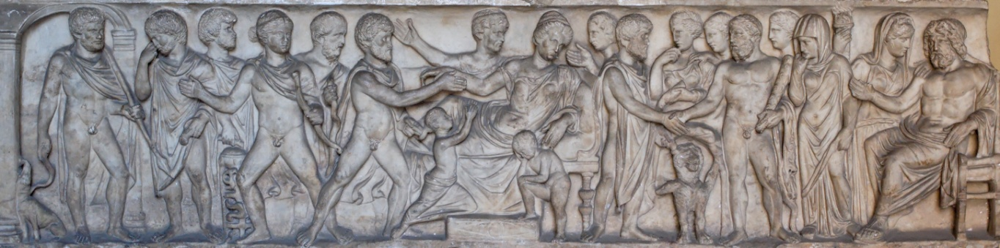

# Leçon 03 | 30 Novembre 1960

<!-- source-url: http://staferla.free.fr/S8/S8 LE TRANSFERT.docx -->
<!-- seminar: s8 -->
<!-- lesson: 03 -->

<!-- id: s8-03-0001 -->

Nous en sommes restés la dernière fois à la position de l’ἐραστής \[erastès : l’amant\] et de l’ἐρώμενος \[erômenos : l’aimé\], de l’*amant* et de l’*aimé*, telle que *la dialectique* du *Banquet* nous permettra de l’introduire comme ce que j’ai appelé « *la base* », « *le point tournant* », « *l’articulation* » essentielle du problème de *l’amour*. Le problème de *l’amour* nous intéresse en tant qu’il va nous permettre de *comprendre* ce qui se passe *dans le transfert* et je dirai jusqu’à un certain point : *à* *cause du transfert*.

<!-- id: s8-03-0002 -->

Pour motiver un aussi long détour que celui qui peut paraître à ceux d’entre vous qui viennent neufs cette année à ce séminaire et qui pourraient après tout vous paraître comme un détour superflu, j’essaierai de justifier, de vous présentifier le sens, semble-t-il que vous devez appréhender tout de suite, de la portée de notre recherche.

<!-- id: s8-03-0003 -->

Il me semble *qu’à quelque niveau qu’il soit* de sa formation, quelque chose doit être présent au psychanalyste comme tel, quelque chose qui peut le *saisir*, l’*accrocher* par le bord de son manteau à plus d’un tournant. Et le plus simple n’est-il pas celui-ci, me semble-t-il difficile à éviter à partir d’un certain âge, et qui pour vous - il me semble - doit comporter déjà de façon très présente à lui tout seul ce qu’est le problème de *l’amour*.

<!-- id: s8-03-0004 -->

Est-ce qu’il ne vous a jamais *saisi* à ce tournant, que dans ce que vous avez donné - à ceux qui vous sont les plus proches, j’entends - il n’y a pas quelque chose qui a manqué, et non pas seulement qui a manqué, mais qui les laisse - les susdits, les plus proches - eux, par vous irrémédiablement manqués ? En quoi ? Justement par ceci qui, à vous analystes, permet de comprendre que justement ces proches, *avec eux*, on ne fait que tourner autour du fantasme, dont vous avez cherché plus ou moins *en eux* la satisfaction,

<!-- id: s8-03-0005 -->

- qui, *à eux*, a plus ou moins substitué ses images ou ses couleurs.

<!-- id: s8-03-0006 -->

*Cet être* auquel soudain vous pouvez être rappelé par quelque accident, dont la mort est bien celui qui nous fait entendre le plus loin sa résonance, *cet être véritable* - pour autant que vous l’évoquez - déjà s’éloigne et est déjà éternellement perdu. Or *cet être* c’est tout de même bien lui que vous tentez de joindre par les chemins de votre *désir*. Seulement *cet être là c’est le vôtre*. Et ceci *comme analyste* vous savez bien que c’est de quelque façon, faute de l’avoir voulu que vous l’avez manqué aussi plus ou moins. Mais au moins ici êtes-vous au niveau de votre faute, et votre échec la mesure exactement.

<!-- id: s8-03-0007 -->

Et ces autres dont vous vous êtes occupé si mal, est-ce pour en avoir fait, comme on dit, seulement vos *objets* ? Plût au ciel que vous les eussiez traités comme *des objets* dont on apprécie le poids, le goût et la substance, vous seriez aujourd’hui moins troublé par *leur mémoire*, vous leur auriez rendu justice, hommage, amour, vous les auriez aimés au moins comme vous-même, à ceci près que vous aimez mal, mais ce n’est même pas le sort des mal aimés que nous avons eu en partage. Vous en auriez fait sans doute - *comme on dit* - des *sujets* comme si c’était là la fin du *respect* qu’ils méritaient : respect, comme on dit, de leur dignité, respect dû à *nos semblables*.

<!-- id: s8-03-0008 -->

Je crains que cet *emploi neutralisé* du terme « *nos semblables »*, soit bien autre chose que ce dont il s’agit dans la question de *l’amour,* et - de ces *semblables* - que le respect, que vous leur donniez aille trop vite : au respect du *ressemblant*, au renvoi à leurs lubies de résistance, à leurs idées butées, à leur bêtise de naissance, à leurs oignons quoi ! Qu’ils se débrouillent !

<!-- id: s8-03-0009 -->

C’est bien là, je crois, le fond de cet arrêt devant leur liberté, qui souvent dirige votre conduite, *liberté d'indifférence* dit-on, mais non pas de la leur, de la vôtre plutôt. Et c’est bien en cela que la question se pose pour un analyste, c’est à savoir quel est notre rapport à cet *être* de notre patient ? On sait bien tout de même pourtant que *c’est de cela* dans l'analyse qu’il s’agit :

<!-- id: s8-03-0010 -->

- notre accès à cet *être* est-il ou non *celui de l'amour ?* A-t-il quelque rapport, notre accès, avec ce que nous saurons

<!-- id: s8-03-0011 -->

- de ce qu'est le point où nous nous posons quant à la nature de *l'amour* ?

<!-- id: s8-03-0012 -->

Ceci, vous le verrez, nous mènera assez loin, précisément à savoir ce qui, si je puis m'exprimer ainsi me servant d’*une métaphore,* est dans *Le Banquet* quand ALCIBIADE compare SOCRATE à quelques uns de ces menus objets, dont il semble qu’ils aient réellement existé à l’époque, semblables aux « *poupées russes* » par exemple, ces *choses* qui s'emboîtaient les unes dans les autres. Paraît-il qu’il y avait des images dont *l'extérieur* représentait un *satyre* ou un *silène* [^28], et *à l’intérieur* nous ne savons trop quoi, mais assurément *des choses précieuses*.

<!-- id: s8-03-0013 -->

Ce qu’il doit y avoir, ce qu’il peut y avoir, ce qui est supposé y être, de ce quelque chose, *dans l'analyste*, c’est bien ce à quoi tendra notre question, mais tout à la fin. En abordant le problème de ce rapport qui est celui de l’analysé à l’analyste, qui se manifeste par ce si curieux phénomène de *transfert*, que j’essaie d’aborder de la façon qui le serre de plus près, qui en élude le moins possible les formes, à la fois se connaissant pour tous, et dont on cherche plus ou moins à abstraire, à éviter, le poids propre, je crois que nous ne pouvons mieux faire que de partir d’une interrogation de ce que ce *phénomène* est censé *imiter au maximum*, voire *se confondre* avec lui : *l'amour*.

<!-- id: s8-03-0014 -->

Il y a vous savez un texte de FREUD[^29], célèbre dans ce sens, qui se range dans ce qu’on appelle d’habitude les *Écrits Techniques*, avec ce à quoi il est étroitement en rapport, à savoir : disons que *quelque chose* à *quelque chose* est depuis toujours suspendu dans le problème de *l'amour*, une *discorde interne*, *on ne sait quelle* *duplicité* qui est justement ce qu’il y a lieu pour nous de serrer de plus près, à savoir peut-être éclairer par cette ambiguïté ce quelque chose d’autre, cette substitution en route dont, après quelque temps de séminaire ici, vous devez savoir que c’est tout de même ce qui se passe dans l’action analytique, et que je peux résumer ainsi.

<!-- id: s8-03-0015 -->

Celui qui vient nous trouver, par principe de cette supposition qu’il ne sait pas ce qu’il a, déjà là est toute l’implication de *l’inconscient*, du « *il ne sait pas* » fondamental et c’est par là que s’établit le pont qui peut relier notre nouvelle science à toute la tradition du « *connais-toi toi-même* »[^30] bien sûr il y a une différence fondamentale, l’accent est complètement *déplacé* de cet « *il ne sait pas* », et je pense que déjà là-dessus je vous en ai dit assez pour que je n’aie pas à faire autre chose que pointer au passage la différence.

<!-- id: s8-03-0016 -->

« *Il ne sait pas ce qu’il a* », mais quoi ? Ce qu’il a vraiment en lui-même ? Ce qu’il demande à « *être* », pas seulement *formé, éduqué, sorti, cultivé* selon la méthode de toutes les *pédagogies* traditionnelles… il se met à l’ombre du pouvoir fondamentalement révélateur de quelques dialectiques qui sont les rejets, les surgeons de la démarche inaugurale de SOCRATE en tant qu’elle est philosophique, est-ce que c’est là ce à quoi nous allons, dans l’analyse, mener celui qui vient nous trouver comme analystes ?

<!-- id: s8-03-0017 -->

Simplement comme lecteurs de FREUD, vous devez tout de même déjà savoir quelque chose de ce qui au premier aspect tout au moins peut se présenter comme le paradoxe de ce qui se présente à nous comme terme, τέλος \[telos\], comme *aboutissement*, *terminaison*, de l’analyse. Qu’est-ce que nous dit FREUD sinon *qu’en fin de compte* ce que trouvera au terme celui qui suit ce chemin, ce n’est pas autre chose essentiellement qu’un *manque*. Que vous appeliez ce *manque* « *castration* » ou que vous l’appeliez « *Pénisneid* » ceci est signe, métaphore. Mais si c’est vraiment là ce devant quoi vient, au terme, buter l’analyse, est-ce qu’il n’y a pas là déjà quelque duplicité ?

<!-- id: s8-03-0018 -->

Bref en vous rappelant cette ambiguïté, cette sorte de double registre, entre ce début et départ *de principe,* et ce terme - son premier aspect peut apparaître si nécessairement décevant - tout un développement s’inscrit. Ce développement, c’est à proprement parler *cette révélation* de ce quelque chose tout entier dans son texte, qui s’appelle l’Autre inconscient. Bien. Et surtout ceci, pour quiconque en entend parler pour *la première fois* - je pense qu’il n’y en a *nul ici qui soit dans ce cas -* ne peut être entendu que comme *une énigme*.

<!-- id: s8-03-0019 -->

Ce n’est point à ce titre que je vous le présente, mais au titre du rassemblement des termes où s’inscrit comme telle notre action. C’est aussi bien pour tout de suite éclairer ce que je pourrai appeler, si vous voulez, le plan général dans lequel va se dérouler notre cheminement, quand il ne s’agit après tout de rien d’autre que de tout de suite appréhender, y voir - mon Dieu - ce qu’a d’analogue ce développement et ces termes avec la situation de départ fondamentale de *l’amour*.

<!-- id: s8-03-0020 -->

Cette situation, pour être après tout évidente, n’a jamais été - que je sache aussi - en quelque terme, située, placée au départ en ces termes que je vous propose d’articuler tout de suite, ces deux termes d’où nous partons :

<!-- id: s8-03-0021 -->

- ἐραστής \[erastès\] l’*amant*, ou encore ἔρόν \[erôn\] l’*aimant*,

<!-- id: s8-03-0022 -->

- ἐρώμενος \[erômenos\] *celui qui est aimé*.

<!-- id: s8-03-0023 -->

Est-ce que tout déjà ne se situe pas mieux *au départ* ? Il n’y a pas lieu de jouer au jeu de cache-cache, est-ce que nous ne pouvons pas voir tout de suite dans une telle assemblée \[*le banquet*\], *que ce qui caractérise* l’ἐραστής \[erastès\], *l’amant*, pour tous ceux qui l’ont interrogé, pour tous ceux qui l’approchent, *est-ce que ce n’est pas essentiellement ce qui lui manque* ? Et nous pouvons tout de suite, nous, ajouter qu’*il ne sait pas ce qui lui manque*, avec cet accent particulier de « *l’in-science* », qui est celui de l’inconscient.

<!-- id: s8-03-0024 -->

Et d’autre part l’ἐρώμενος \[erômenos\], l’*objet aimé*, est-ce qu’il ne s’est pas toujours situé comme celui *qui ne sait pas ce qu’il a*, ce qu’il *a de caché*, ce qui fait *son attrait* ? Parce que ce « *ce qu’il a* » n’est-il pas ce qui est, dans la relation de l’amour, appelé pas seulement à se révéler : à *devenir*, à *être*, à *présentifier*, ce qui n’est jusque là que « *possible* » ? Bref avec l’accent analytique, ou sans cet accent : lui aussi « *il ne sait pas* ». Et c’est d’autre chose qu’il s’agit : *il ne sait pas ce qu’il a*.

<!-- id: s8-03-0025 -->

Entre ces deux termes qui constituent, si je puis dire : dans leur essence, *l’amant* et *l’aimé*, observez qu’il n’y a *aucune coïncidence*. Ce qui *manque* à l’un n’est pas ce « *ce qu’il a* », caché dans l’autre. Et c’est là tout le problème de l’amour. *Qu’on le sache* ou *qu’on ne le sache pas* n’a aucune importance. On en rencontre à tous les pas dans le phénomène, le déchirement, la discordance, et *quiconque n’a pas besoin* pour autant de *dialoguer*, de « *dialectiquer* » διαλεκτικεύεσθαι sur l’amour : il lui suffit « *d’être dans le coup* », d’*aimer*, pour être pris à cette béance, à ce discord.

<!-- id: s8-03-0026 -->

Est-ce là même tout dire ? Est-ce suffisant ? Je ne puis ici faire plus. Je fais beaucoup en le faisant, je m’offre au risque de certaine *incompréhension immédiate*, mais je vous le dis : je n’ai pas l’intention ici de vous en conter, j’éclaire donc ma lanterne tout de suite. Les choses vont plus loin. Nous pouvons donner, dans les termes dont nous nous servons, ce que l’analyse de la création du sens dans le rapport *signifiant-signifié* indiquait déjà[^31]. Nous en verrons - quitte à en voir le maniement - la vérité dans la suite.

<!-- id: s8-03-0027 -->

Cette analyse indiquait déjà ce dont il s’agit, à savoir que justement *l’amour comme signifiant* - *car pour nous c’en est un et ce n’est que cela* - *est une métaphore*, si tant est que la métaphore nous avons appris à l’articuler comme *substitution*, et que c’est là que nous entrons dans l’obscur et que je vous prie à l’instant simplement de l’admettre, et de garder dans la main, ce qu’ici je promeus comme ce que c’est : une formule algébrique.

<!-- id: s8-03-0028 -->

C’est pour autant que - dans la fonction où ceci se produit - que l’ἐραστής \[erastès\] -l’*aimant* qui est le sujet *du manque -* vient à la place, se substitue, à la fonction de l’ἐρώμενος \[erômenos\] - qui est objet, *objet aimé -* que se produit la signification de l’amour. Nous mettrons peut-être *un certain temps* à éclairer cette formule, nous avons le temps de le faire dans l’année qui est devant nous. Du moins n’aurai-je pas manqué de vous donner dès le départ ce point de repère qui peut servir, non pas de devinette, tout au moins de point de référence propre à éviter certaines ambiguïtés, lorsque je développerai.

<!-- id: s8-03-0029 -->

Et maintenant entrons dans ce *Banquet* dont je vous ai en quelque sorte, la dernière fois *planté le décor*, présenté les personnages, les personnages qui n’ont rien de primitif sous un rapport à la simplification du problème qu’ils nous présentent. Ce sont des personnages fort sophistiqués, c’est bien le cas de le dire ! Et là, pour retracer ce qui est *une des portées* de ce à quoi j’ai passé mon temps avec vous la dernière fois, je le résumerai en quelques termes, car je considère important que *le caractère provocant*, en soit émis, articulé.

<!-- id: s8-03-0030 -->

Il y a tout de même quelque chose d’assez *humoristique* qu’après vingt-quatre siècles de *méditation religieuse*, il n’y a pas une seule réflexion sur *l’amour* pendant ces vingt-quatre siècles - qu’elle se soit passée chez les libertins ou chez les curés - il n’y a pas une seule méditation sur l’amour, qui ne se soit référée à ce texte inaugural.

<!-- id: s8-03-0031 -->

Ce texte après tout, pris dans son côté extérieur, pour quelqu’un qui entre là-dedans sans être prévenu, représente tout de même *une sorte de* *tonus* [^32]*, comme on dit,* entre des gens dont il faut tout de même bien nous dire, que pour le paysan qui sort là de son petit jardin autour d’Athènes, c’est une réunion de vieilles lopes : SOCRATE a 53 ans, ALCIBIADE - toujours beau parait-il - en a 36,

<!-- id: s8-03-0032 -->

- et AGATHON lui-même chez qui ils sont réunis, en a 30 trente. Il vient de remporter le *prix du concours de tragédie*

<!-- id: s8-03-0033 -->

- (*c’est ça qui nous permet de* *dater exactement* *Le Banquet*).

<!-- id: s8-03-0034 -->

Évidemment il ne faut pas s’arrêter à ces apparences. C’est toujours dans des salons, c’est à dire dans un lieu où les personnes n’ont dans leur aspect rien de particulièrement attrayant, c’est chez les duchesses que se disent les choses les plus fines. Elles sont à jamais perdues bien entendu, mais *pas pour tout le monde*, pas pour ceux qui les disent en tout cas. Là nous avons la chance de savoir ce que tous ces personnages, à leur tour, ont échangé ce soir-là.

<!-- id: s8-03-0035 -->

On en a beaucoup parlé de ce *Banquet*, et inutile de vous dire que ceux dont c’est le métier d’être *philosophes, philologues, hellénistes,* l’ont regardé à la loupe et que je n’ai pas épuisé la somme de leurs remarques. Mais ce n’est pas non plus inépuisable, car ça tourne toujours autour d’un point. Aussi peu inépuisable que ce soit, il est quand même exclu que je vous restitue la somme de ces *menus débats* qui se font autour de telle ou telle ligne : d’abord il n’est pas dit qu’elle soit de nature à ne pas nous laisser échapper quelque chose d’important, et ce n’est pas commode pour moi, qui ne suis *ni philosophe, ni philologue, ni helléniste,* de me mettre dans ce rôle, dans cette peau, et de vous faire une leçon sur *Le Banquet*.

<!-- id: s8-03-0036 -->

Ce que je peux espérer simplement, c’est vous donner d’abord une première appréhension de ce quelque chose que je vous demande de croire : que ce n’est pas comme ça, à la première lecture, que je m’y fie, faites-moi confiance. Faites-moi quand même ce crédit de penser que ça n’est pas pour la première fois, et à l’usage de ce séminaire, que je suis entré dans ce texte. Et faites-moi aussi ce crédit de penser que je me suis quand même donné quelque mal pour rafraîchir ce que j’avais comme souvenirs concernant les travaux qui s’y sont consacrés, voire m’informer de ceux que j’avais pu négliger jusqu’ici.

<!-- id: s8-03-0037 -->

Ceci pour m’excuser d’avoir - et quand même parce que je crois *que c’est le mieux* - abordé les choses *par la fin*, c’est-à-dire par ce qui, du seul fait de la méthode que je vous apprends, doit être objet pour vous d’une sorte de réserve, à savoir ce que j’y comprends. C’est justement là que je cours *les plus grands risques*. Soyez-moi reconnaissants de les courir à votre place. Que ceci serve seulement pour vous d’introduction à des critiques qui ne sont pas tant à porter sur ce que je vais vous dire que j’y ai compris, que sur ce qui est dans le texte, à savoir ce qui en tout cas va, à la suite de ça, vous apparaître comme étant ce qui a accroché ma compréhension. Je veux dire ce qui, cette compréhension - vraie ou fausse - l’explique, la rend nécessaire, et comme texte alors, comme *signifiant,* *impossible* - même pour vous, même si vous le comprenez autrement - impossible à contourner.

<!-- id: s8-03-0038 -->

Je vous passe donc les premières pages, qui sont ces pages qui existent toujours dans les dialogues de PLATON. Et celui-ci n’est pas un dialogue comme les autres, mais néanmoins cette espèce de situation faite pour créer ce que j’ai appelé *l’illusion d’authenticité*, ces reculs, ces pointages de la transmission, de celui qui a répété ce que l’autre lui avait dit. C’est toujours la façondont PLATON entend, *au départ*, créer une certaine profondeur, qui sert sans doute pour lui au retentissement de ce qu’il va dire.

<!-- id: s8-03-0039 -->

Je vais passer aussi le règlement auquel j’ai fait allusion la dernière fois, des lois du *Banquet*. Je vous ai indiqué que ces lois n’étaient pas seulement *locales*, improvisées, qu’elles se rapportaient à un prototype : le Συμόσιον \[symposion\] était quelque chose qui avait ses lois. Sans doute elles n’étaient pas tout à fait les mêmes ici et là, à Athènes et en Crête. Je passe sur toutes ces références.

<!-- id: s8-03-0040 -->

Nous en arrivons à l’accomplissement de la cérémonie qui comportera quelque chose qui en somme doit s’appeler d’un nom, et un nom qui prête - je vous l’indique au passage - à discussion :  « *éloge de l’Amour* ». Est-ce ἐνκώμιον \[enkômion : éloge\] \[[177ac](http://remacle.org/bloodwolf/philosophes/platon/cousin/banquet.htm)\], est-ce ἐπαίνεσις \[épaïnesis\][^33] ? Je vous passe tout ceci, qui a son intérêt mais qui est secondaire. Et je voudrais simplement aujourd’hui situer ce que je peux appeler le progrès de ce qui va se dérouler autour de cette succession de discours qui sont d’abord celui de PHÈDRE, puis celui de PAUSANIAS, etc.

<!-- id: s8-03-0041 -->

PHÈDRE est un autre bien curieux personnage, il faudrait tracer son caractère. Ça n’a pas tellement d’importance. Pour aujourd’hui sachez seulement qu’il est curieux que ce soit lui qui ait mis \[[177d](http://remacle.org/bloodwolf/philosophes/platon/cousin/banquet.htm)\] le sujet au jour, qui soit le πατὴρ τοῦ λόγου \[patèr tou logou\] : le père du sujet. C’est curieux parce que nous le connaissons un petit peu par ailleurs, par le début du *Phèdre* : c’est un curieux hypocondriaque. Je vous le dis tout de suite, cela vous servira peut-être par la suite. Je vous fais tout de suite, pendant que j’y pense, mes excuses. Je ne sais pas pourquoi je vous ai parlé de *la nuit* la dernière fois. Bien sûr je me suis souvenu que ce n’est pas dans le *Phèdre* que cela commence *la nuit*, mais dans le *Protagoras*. Ceci corrigé, continuons.

<!-- id: s8-03-0042 -->

PHÈDRE, PAUSANIAS, ÉRYXIMAQUE et avant ÉRYXIMAQUE *ça aurait dû être* ARISTOPHANE *mais il a le hoquet*, il laisse passer l’autre avant lui et il parle après. C’est l’éternel problème dans toute cette histoire de savoir comment ARISTOPHANE, le poète comique, se trouvait là avec SOCRATE, dont chacun sait qu’il faisait plus que le critiquer, que le ridiculiser, le diffamer dans ses comédies et que, généralement parlant, les historiens le tiennent pour en partie responsable de la fin tragique de SOCRATE, à savoir de sa condamnation. Je vous ai dit que ceci implique sans doute *une raison profonde*, dont je ne donne pas plus que d’autres la dernière solution mais où peut-être nous *essaierons* d’abord de mettre un petit commencement de lumière.

<!-- id: s8-03-0043 -->

Ensuite vient AGATHON et après AGATHON, SOCRATE. Ceci constituant ce qui est à proprement parler *Le Banquet*, c’est-à-dire tout ce qui se passe jusqu’à ce point crucial, dont la dernière fois je vous ai pointé qu’il devait être considéré comme essentiel, à savoir l’entrée d’ALCIBIADE, à quoi correspond la subversion de toutes les règles du *Banquet*, ne serait-ce que par ceci : il se présente *ivre*, il se profère comme étant essentiellement *ivre* et parle comme tel dans l’*ivresse*.

<!-- id: s8-03-0044 -->

Supposons que vous vous disiez que l’intérêt de ce dialogue, de ce *Banquet*, c’est de manifester *quelque chose* qui est à proprement parler *la difficulté de dire quelque chose qui se tienne debout sur l’amour*. *S’il ne s’agissait que de cela nous serions purement et simplement dans une cacophonie*. Mais ce que PLATON - du moins c’est ce que je prétends, ce n’est pas une audace spéciale de le prétendre - ce que PLATON nous montre, d’une façon qui ne sera jamais dévoilée, qui ne sera jamais mise au jour, c’est que *le contour que dessine* *cette difficulté est quelque chose qui nous indique le point où est la topologie foncière qui empêche de dire de l’amour quelque chose qui se tienne debout*.

<!-- id: s8-03-0045 -->

Ce que je vous dis là n’est pas très nouveau. Personne ne songe à le contester. Je veux dire que tous ceux qui se sont occupés de ce « *dialogue* » - entre guillemets - car c’est à peine quelque chose qui mérite ce titre, puisque c’est une suite d’*éloges*, une suite en somme de *chansonnettes*, de *chansons à boire* en l’honneur de l’amour, qui se trouvent, parce que ces gens sont un peu plus malins que les autres - et d’ailleurs on nous dit que c’est un sujet qui n’est pas souvent choisi, ce qui pourrait étonner au premier abord - prendre toute leur portée.

<!-- id: s8-03-0046 -->

Alors on nous dit que chacun traduit l’affaire dans sa corde, dans sa note. On ne sait d’ailleurs pas bien pourquoi par exemple PHÈDRE sera chargé de l’introduire, nous dit-on, sous l’angle de la religion, du mythe ou même de l’ethnographie. Et en effet dans tout cela il y a du vrai. Je veux dire que notre PHÈDRE nous introduit l’amour \[[178a](http://remacle.org/bloodwolf/philosophes/platon/cousin/banquet.htm)\] en nous disant qu’il est μέγας θεός \[megas theos\], c’est un grand dieu. Il ne dit pas que cela, mais enfin il se réfère à deux théologiens, HÉSIODE et PARMÉNIDE, qui à des titres divers ont parlé de la généalogie des dieux, ce qui est quand même quelque chose d’important. Nous n’allons pas nous croire obligés de nous *reporter* à la *Théogonie* d’HÉSIODE et au *poème* de PARMÉNIDE sous prétexte qu’on en cite *un vers dans le discours de* PHÈDRE. Je dirai tout de même qu’il y a eu il y a deux ou trois ans, quatre peut-être, quelque chose de très important qui est paru sur ce point, *d’un contemporain* : Jean BEAUFRET[^34], sur *le Poème* de PARMÉNIDE. C’est très intéressant à lire.

<!-- id: s8-03-0047 -->

Ceci dit, laissons ça de côté et tâchons de nous rendre compte de ce qu’il y a dans ce *discours de* PHÈDRE. Il y a donc la référence aux dieux. Pourquoi aux dieux au pluriel ? Je veux simplement tout de même indiquer *quelque chose*. Je ne sais pas pour vous quel sens ça a « *les dieux* », spécialement les dieux antiques, mais après tout on en parle assez dans ce dialogue pour qu’il soit tout de même assez utile, voire nécessaire, que je réponde à cette question comme si elle était posée de vous à moi.

<!-- id: s8-03-0048 -->

Qu’est-ce que vous en pensez après tout, des dieux ? Où est–ce que ça se situe par rapport au *Symbolique*, à l’*Imaginaire* et au *Réel* ? Ce n’est pas une question vaine, pas du tout. Jusqu’au bout, la question dont il va s’agir, c’est de savoir si oui ou non l’Amour est un dieu, et on aura fait au moins ce progrès, à la fin, de savoir avec certitude que cela n’en est pas un. Évidemment je ne vais pas vous faire une leçon sur le sacré à ce propos. Tout simplement, comme cela, épingler quelques formules sur ce sujet.

<!-- id: s8-03-0049 -->

Les dieux, pour autant qu’ils existent pour nous dans notre registre, dans celui qui nous sert à avancer dans notre expérience, pour autant que ces trois catégories nous sont d’un usage quelconque, les dieux c’est bien certain appartiennent évidemment au *Réel* : les dieux c’est un mode de révélation du *Réel*.

<!-- id: s8-03-0050 -->

- C’est en cela que tout progrès philosophique tend, en quelque sorte de par sa nécessité propre, à les éliminer.

<!-- id: s8-03-0051 -->

- C’est en cela que la révélation chrétienne se trouve - comme l’a fort bien remarqué HEGEL - sur la voie de leur élimination, à savoir que sous ce registre, la révélation chrétienne se trouve un tout petit peu plus loin, un petit peu plus profondément sur cette voie qui va *du polythéisme à l’athéisme*.

<!-- id: s8-03-0052 -->

- C’est en cela que - par rapport à une certaine notion de la divinité, du dieu comme summum de révélation, de *numen*, comme rayonnement, apparition (c’est une chose fondamentale, réelle) - le christianisme se trouve incontestablement sur le chemin qui va à réduire, qui va, au dernier terme, à abolir le dieu de cette même révélation, *pour autant qu’il tend à le déplacer, comme le dogme, vers le verbe, vers le* λόγος \[logos\] comme tel, autrement dit se trouve sur un chemin parallèle à celui que suit le philosophe, pour autant que je vous ai dit tout à l’heure, que sa fatalité est de nier les dieux.

<!-- id: s8-03-0053 -->

Donc *ces mêmes révélations* qui se trouvent *rencontrées* jusque là par l’homme dans le *Réel*, dans le *Réel* où ce qui *se révèle* est d’ailleurs *Réel,* *mais cette même révélation ce n’est pas dans le Réel qu’il la place, cette révélation il va la chercher dans le logos, il va la chercher au niveau d’une articulation signifiante*.

<!-- id: s8-03-0054 -->

Toute interrogation qui tend à s’articuler comme science au départ de *la démarche philosophique* de PLATON, nous apprend \- à tort ou à raison, je veux dire *au vrai ou au pas* *vrai -* que c’était là ce que faisait SOCRATE. SOCRATE exigeait que ce à quoi nous avons ce rapport innocent qui s’appelle δοχα \[doxa\], et qui est - mon Dieu pourquoi pas ? - quelquefois dans le vrai, nous ne nous en contentions pas, mais que nous nous demandions pourquoi, que nous ne nous satisfassions que de *ce vrai assuré* qu’il appelle ἐπιστήμη \[épistèmè\], *science*, à savoir qui rend compte de ses raisons.

<!-- id: s8-03-0055 -->

C’est cela, nous dit PLATON, qui était l’affaire du ϕιλοσόϕειν \[philosophein\] de SOCRATE. Je vous ai parlé de ce que j’ai appelé la *Schwärmerei* de PLATON. Il faut bien croire que quelque chose dans cette entreprise reste à la fin en échec, pour que, malgré la rigueur, le talent, déployés dans la démonstration d’une telle méthode...

<!-- id: s8-03-0056 -->

> tellement de choses dans PLATON qui ont servi, profité, ensuite à toutes les mystagogies :
>
> je parle avant tout de la *gnose*, et disons de ce qui dans le christianisme lui-même est toujours resté *gnostique*

<!-- id: s8-03-0057 -->

...il n’en reste pas moins clair que ce qui lui plaît c’est la science. Comment saurions-nous lui en vouloir d’avoir mené, dès le premier pas, ce chemin jusqu’au bout ?

<!-- id: s8-03-0058 -->

Quoiqu’il en soit donc, le discours de PHÈDRE se réfère, pour introduire le problème de l’*Amour*, à cette notion qu’il est un grand dieu, presque le plus ancien des dieux, né tout de suite après le Chaos, dit HÉSIODE, le premier auquel ait pensé la Déesse mystérieuse, la Déesse primordiale du discours parménidien.

<!-- id: s8-03-0059 -->

Il n’est pas possible ici que nous n’évoquions, à ce niveau, au temps de PLATON, que nous n’essayions - cette entreprise peut d’ailleurs être impossible à mener - de déterminer tout ce que ces termes pouvaient vouloir dire au temps de PLATON, parce qu’enfin, tâchez quand même de partir de l’idée que les premières fois qu’on disait ces choses, et nous en étions là au temps de PLATON, il est tout à fait exclu que tout ceci ait eu cet air de *bergerie bêtifiante* que cela a par exemple au XVIIème siècle où lorsqu’on parle d’ÉROS chacun joue à cela : tout ceci s’inscrit dans un contexte tout autre, dans un contexte de *culture courtoise*, *d’échos de* *<u>L’</u>[Astrée](http://gallica.bnf.fr/ark:/12148/bpt6k2148922.capture)* et tout ce qui s’ensuit, à savoir des mots sans importance, ici les mots ont leur pleine importance, la discussion est *vraiment théologique*.

<!-- id: s8-03-0060 -->

Et c’est aussi bien pour vous faire comprendre cette importance que je n’ai pas trouvé mieux que de vous dire : pour vraiment le saisir, attrapez la [*2ème Ennéade de PLOTIN*](http://remacle.org/bloodwolf/philosophes/plotin/table.htm), et voyez comment il parle de quelque chose qui se place à peu près au même niveau. Il s’agit aussi d’ÉROS, il ne s’agit même que de ça.

<!-- id: s8-03-0061 -->

Vous ne pourrez pas - pour peu que vous ayez un tout petit peu lu un texte théologique sur la Trinité - ne pas vous apercevoir que ce discours de PLOTIN - à simplement... je crois qu’il y aurait trois mots à changer - est un discours - nous sommes à la fin du troisième siècle - sur la Trinité. Je veux dire que ce ZEUS, cette APHRODITE, et cet ÉROS, c’est « *le Père, le Fils et le Saint-Esprit* ». Ceci simplement pour vous permettre d’imaginer ce dont il s’agit quand PHÈDRE parle en ces termes d’ÉROS : *parler de l’amour*, en somme, *pour PHÈDRE c’est parler de théologie*. Et après tout c’est très important de s’apercevoir que ce discours commence par une telle introduction, puisque pour beaucoup de monde encore - et justement dans la tradition chrétienne par exemple *–* *parler de l’amour c’est parler de théologie*.

<!-- id: s8-03-0062 -->

Il n’en est que plus intéressant de voir que ce discours ne se limite pas là, mais passe à une illustration de ses propos. Et le mode d’illustration dont il s’agit est aussi bien intéressant, car on va nous parler de cet amour divin, on va nous parler de ses effets. Ces effets, je le souligne, sont éminents à leur niveau par la dignité qu’ils révèlent avec le thème qui s’est un petit peu usé depuis dans *les développements de la rhétorique*, à savoir de ce que l’amour est un lien contre quoi tout effort humain viendrait se briser.

<!-- id: s8-03-0063 -->

Une armée faite d’aimés et d’amants \[[179a](http://remacle.org/bloodwolf/philosophes/platon/cousin/banquet.htm)\] - et ici l’illustration sous-jacente classique par la fameuse légion thébaine - serait une armée invincible, et l’aimé pour l’amant, comme l’amant pour l’aimé, seraient éminemment susceptibles de représenter la plus haute autorité morale, celle devant quoi on ne cède pas, celle devant quoi on ne peut se déshonorer. Ceci aboutit au plus extrême, c’est à savoir à l’amour comme principe du dernier sacrifice. Et il n’est pas sans intérêt de voir sortir ici l’image d’ALCESTE, à savoir dans *la référence euripidienne*, ce qui illustre une fois de plus ce que je vous ai apporté l’année dernière comme délimitant la zone de tragédie \[[179b](http://remacle.org/bloodwolf/philosophes/platon/cousin/banquet.htm)\], à savoir à proprement parler cette zone de *l’entre-deux-morts*.

<!-- id: s8-03-0064 -->

<!-- id: s8-03-0065 -->

[ALCESTE](http://fr.wikisource.org/wiki/Alk%C3%A8stis), seule de tout le parentage du roi ADMÈTE - homme heureux mais auquel la mort vient tout d’un coup faire signe - ALCESTE incarnation de l’amour est la seule - et non pas les vieux parents du dit ADMÈTE si peu de temps qu’il leur reste à vivre selon toute probabilité, et non pas les amis, et non pas les enfants, ni personne - ALCESTE est la seule qui se substitue à lui pour satisfaire à la demande de la mort. Dans un discours où il s’agit essentiellement de l’amour masculin, voilà qui peut nous paraître remarquable, et qui vaut bien que nous le retenions. ALCESTE donc nous y est proposée comme exemple. Ceci a l’intérêt de donner sa portée à ce qui va suivre, c’est à savoir que *deux exemples* succèdent à celui d’ALCESTE, deux qui au dire de l’orateur se sont avancés aussi dans ce champ de *l’entre-deux-morts* \[[179d](http://remacle.org/bloodwolf/philosophes/platon/cousin/banquet.htm)\] :

<!-- id: s8-03-0066 -->

- ORPHÉE, qui lui a réussi à descendre aux enfers pour aller chercher sa femme EURYDICE, et qui comme vous le savez en est remonté bredouille pour une faute qu’il a faite, celle de se retourner avant le moment permis, thème mythique reproduit dans maintes légendes d’autres civilisations que la Grèce. Une légende japonaise est célèbre \[Izanagi et Izanami\]. Ce qui nous intéresse ici est *le commentaire* que PHÈDRE y a mis.

<!-- id: s8-03-0067 -->

- Et le troisième exemple est celui d’ACHILLE.

<!-- id: s8-03-0068 -->

Je ne pourrai guère aujourd’hui pousser les choses plus loin que vous montrer ce qui ressort du rapprochement de ces trois héros, c’est déjà un premier pas qui vous met sur la voie. Les remarques d’abord qu’il fait sur ORPHÉE. Ce qui nous intéresse c’est ce que dit PHÈDRE, ce n’est pas s’il va au fond des choses, ni si c’est justifié, nous ne pouvons pas aller jusque là, ce qui nous importe c’est ce qu’il dit, c’est justement l’étrangeté de ce que dit PHÈDRE qui doit nous retenir.

<!-- id: s8-03-0069 -->

D’abord il nous dit d’ORPHÉE fils d’ÆGRE, que les dieux n’ont pas du tout aimé ce qu’il a fait \[[179d](http://remacle.org/bloodwolf/philosophes/platon/cousin/banquet.htm)\]. Et la raison qu’il en donne est en quelque sorte donnée dans l’interprétation qu’il donne de ce que les dieux ont fait pour lui[^35]. On nous dit que les dieux, pour un type comme ORPHÉE qui était en somme quelqu’un de pas si bien que cela, un amolli - on ne sait pas pourquoi PHÈDRE lui en veut, ni non plus PLATON - ne lui ont pas montré une vraie femme mais un ϕάσμα \[phasma : ombre, fantôme\]. Ce qui, je pense, fait suffisamment *écho* à ce par quoi j’ai introduit tout à l’heure mon discours concernant le rapport à l’autre, et ce qu’il y a de différent entre *l’objet* de notre amour en tant que le recouvrent nos *fantasmes*, et ce que l’amour interroge - cet être de l’autre - pour savoir s’il peut l’atteindre.

<!-- id: s8-03-0070 -->

En quoi semble-t-il, au dire de PHÈDRE, nous voyons ici qu’ALCESTE s’est vraiment substituée à lui dans la mort. Vous trouverez dans le texte ce terme, dont on ne pourra pas dire que c’est moi qui l’ai mis : ὑπὲρ ἀποθανεῖν \[huper apothanein\], ici *la substitution-métaphore* dont je vous parlais tout à l’heure est réalisée *au sens littéral*, c’est à la place d’ADMÈTE que se met authentiquement ALCESTE[^36]. \[...<u>ὑπὲρ</u> τοῦ αὑτῆς ἀνδρὸς <u>ἀποθανεῖν</u>...\] Cet ὐπερ αποθανεῖν \[huperapothanein\], je pense que M. RICOEUR qui a le texte sous les yeux peut le trouver. C’est *exactement* au [180a](http://remacle.org/bloodwolf/philosophes/platon/cousin/banquet.htm)[^37], où cet ὑπὲρ ἀποθανεῖν \[huper apothanein\] est énoncé pour marquer la différence qu’il y a : ORPHÉE donc étant en quelque sorte éliminé de cette course des mérites dans l’amour, entre ALCESTE et ACHILLE. ACHILLE lui, c’est *autre chose *! Il est ἑπαποθανεῖν\[epapothanein\] : celui qui me suivra[^38]. Il suit PATROCLE dans la mort.

<!-- id: s8-03-0071 -->

Comprendre ce que veut dire pour un ancien cette interprétation de ce qu’on peut appeler le geste d’ACHILLE, c’est aussi quelque chose qui mériterait beaucoup de commentaires, car enfin c’est tout de même beaucoup moins clair que pour ALCESTE. Nous sommes forcés de recourir à des textes homériques d’où il résulte qu’en somme ACHILLE *aurait eu le choix*. Sa mère THÉTHIS lui a dit : « *si tu ne tues pas Hector* - il s’agit de tuer HECTOR uniquement pour venger la mort de PATROCLE *- tu rentreras chez toi bien tranquille* *et tu auras une vieillesse heureuse et peinarde, mais si tu tues Hector ton sort est scellé, c’est la mort qui t’attend* ».

<!-- id: s8-03-0072 -->

Et ACHILLE en a si peu douté que nous avons un autre passage où il se fait cette réflexion à lui-même en aparté : « *je pourrais rentrer tranquille* ». Et puis ceci est quand même impensable, et il dit, pour telle ou telle raison. Ce choix est à lui seul considéré comme étant aussi décisif que le sacrifice d’ALCESTE : le choix de la μοίρα \[moïra\], le choix du *destin* a la même valeur que cette substitution *d’être à être*. Il n’y a vraiment pas besoin d’ajouter à ça - ce que fait – je ne sais pourquoi - M. Mario MEUNIER en note, mais après tout c’était un bon érudit, à la page dont nous parlons - que dans la suite ACHILLE se tue, paraît-il, sur le tombeau de PATROCLE.

<!-- id: s8-03-0073 -->

Je me suis beaucoup occupé ces jours-ci de la mort d’ACHILLE parce que cela me tracassait. Je ne trouve nulle part une référence qui permette dans la légende d’ACHILLE d’articuler une chose pareille. J’ai vu beaucoup de modes de mort de la part d’ACHILLE qui, du point de vue du patriotisme grec lui donnent de curieuses activités, puisqu’il est supposé avoir trahi la cause grecque pour l’amour de POLYXÈNE qui est une troyenne, ce qui ôterait quelque peu de la portée à ce discours de PHÈDRE.

<!-- id: s8-03-0074 -->

Mais pour rester, pour nous tenir au discours de PHÈDRE, l’important est ceci : PHÈDRE se livre à une considération longuement développée concernant la fonction réciproque dans leur lien érotique de PATROCLE et d’ACHILLE. Il nous détrompe sur un point qui est celui-ci : ne vous *imaginez* point que PATROCLE - comme on le croyait généralement - fût l’*aimé*.

<!-- id: s8-03-0075 -->

Il ressort d’un examen attentif des caractéristiques des personnages, nous dit PHÈDRE en ces termes, que l’*aimé* ne pouvait être qu’ACHILLE *beaucoup plus jeune et imberbe*. Je l’écris parce que cette histoire revient *sans cesse*, de savoir à quel moment il faut les aimer : si c’est avant la barbe ou après la barbe. On ne parle que de cela, cette histoire de barbe on la rencontre partout. On peut remercier les romains de nous avoir débarrassés de cette histoire. Cela doit avoir sa raison. Enfin ACHILLE n’avait pas de barbe. Donc en tout cas *c’est lui l’aimé*. Mais PATROCLE, semble-t-il, avait quelque *dix ans de plus*. Par un examen des textes *c’est lui l’amant*. Ce qui nous intéresse ce n’est pas cela.

<!-- id: s8-03-0076 -->

C’est simplement ce premier pointage, ce premier mode où apparaît quelque chose qui a un rapport avec ce que je vous ai donné comme étant le point de visée dans lequel nous allons nous avancer, c’est que - quoi qu’il en soit - ce que *les dieux trouvent de sublime*, de plus merveilleux que tout, c’est quand *l’aimé* se comporte en somme comme on attendait que se comportât *l’amant*. *Et il oppose strictement sur ce point l’exemple d’*ALCESTE *à l’exemple d’*ACHILLE. Qu’est-ce que cela veut dire ? Parce que c’est le texte ! On ne voit pas pourquoi PHÈDRE ferait toute cette histoire *qui dure deux pages* si cela n’avait pas son *importance*. Vous pensez que j’explore la « *carte du Tendre* », mais ce n’est pas moi, c’est PLATON et c’est *très bien articulé*.

<!-- id: s8-03-0077 -->

Il faut quand même en déduire ce qui s’impose, à savoir donc - puisqu’il l’oppose expressément à ALCESTE, et qu’il fait pencher la balance du prix à donner à l’amour par les dieux dans le sens d’ACHILLE - ce que cela veut dire. Cela veut donc dire qu’ALCESTE était, elle, dans la position de l’ἐραστής \[erastès\]. ALCESTE, la femme, était dans la position de l’ἐραστής \[erastès\], c’est-à-dire de *l’amant, et que c’est pour autant qu’*ACHILLE *était dans la position de l’aimé que son sacrifice* - ceci est expressément dit - *est beaucoup plus admirable*.

<!-- id: s8-03-0078 -->

En d’autres termes tout ce discours théologique de l’hypocondriaque PHÈDRE aboutit à nous montrer, à pointer, que c’est là ce vers quoi débouche ce que j’ai appelé tout à l’heure *la signification de l’amour*.

<!-- id: s8-03-0079 -->

C’est que son apparition la plus sensationnelle, la plus remarquable, sanctionnée, couronnée, par les dieux, donne une place toute spéciale dans « *le domaine des Bienheureux* « à ACHILLE - comme chacun sait c’est une île qui existe encore dans les bouches du Danube, où on a foutu maintenant un *asile* ou un truc pour les délinquants - cette récompense va à ACHILLE, et très précisément en ceci qu’un *aimé* se comporte comme un *amant*.

<!-- id: s8-03-0080 -->

Je ne vais pas pouvoir pousser plus loin aujourd’hui mon discours. Je veux terminer sur quelque chose de suggestif qui va peut-être quand même nous permettre d’introduire là, quelque question pratique. C’est ceci : c’est qu’en somme c’est du côté de *l’amant* dans le couple érotique, que se trouve, si l’on peut dire dans la position naturelle, l’activité.

<!-- id: s8-03-0081 -->

Et ceci pour nous sera plein de conséquences si, à considérer le couple ALCESTE-ADMÈTE, vous voulez bien *entrevoir* ceci, qui est particulièrement mis à votre portée par ce que nous découvrons à l’analyse de ce que la femme peut - comme telle - expérimenter de son propre *manque,* on ne voit pas du tout pourquoi, à un certain étage, nous ne concevons pas que dans le couple, alors hétérosexuel, c’est à la fois du côté de la femme qu’est le manque disons-nous, sans doute, mais aussi du même coup l’activité.

<!-- id: s8-03-0082 -->

En tout cas lui, PHÈDRE, n’en doute pas. Et que de l’autre côté c’est du côté de l’*aimé*, de l’ἐρώμενος \[erômenos\]  ou - *mettez le neutre* - de l’ἐρώμενον \[erômenon\] car aussi bien *qu’on érômène, ce qu’on ère , ce qu’on aime dans toute cette histoire du Banquet, c’est quoi* ?

<!-- id: s8-03-0083 -->

C’est quelque chose qui se dit toujours – et très fréquemment au neutre – c’est : τα παιδικά \[ta paidika\]. On l’appelle au neutre « *les choses de l’enfant, l’enfant comme objet* ». C’est bien là ce que cela désigne comme tel, là que nous voyons associée à cette fonction de l’ἐρώμενος \[erômenos\] ou de l’ἐρώμενον \[erômenon\], de ce qui est aimé, de *l’objet aimé,* une fonction neutre : c’est que c’est de son côté qu’est le terme fort.

<!-- id: s8-03-0084 -->

Ceci vous le verrez dans la suite quand nous aurons à articuler ce qui fait, si l’on peut dire, que le problème est à un *étage supérieur*, plus *complexe*, quand il s’agit de l’amour hétérosexuel, ceci - qui se voit si clairement à ce niveau-là - cette dissociation de *l’actif* et du *fort* nous servira.

<!-- id: s8-03-0085 -->

C’était en tout cas important à pointer au moment où ceci se rencontre si manifestement illustré par l’exemple justement d’ACHILLE et de PATROCLE. *C’est le mirage que le fort se confondrait avec l’actif*. ACHILLE parce qu’il est manifestement plus fort que PATROCLE ne serait pas *l’aimé*. C’est bien ça - qui est ici, à ce coin de texte, dénoncé -*l’enseignement* que nous avons là à retenir au passage.

<!-- id: s8-03-0086 -->

Arrivé à ce point de son discours, PHÈDRE passe la main à PAUSANIAS.

<!-- id: s8-03-0087 -->

**  **

## Notes

[^28]: Compagnon du demi-dieu Silène ou de Bacchus, ayant l'aspect d'un être fabuleux aux oreilles velues et pourvu de pieds et d'une queue de cheval.

[^29]: Freud : « *Observations sur l’amour de transfert* », in *La technique psychanalytique*, Paris, P.U.F., 1953 ; Cf. séminaire 1.

[^30]: Précepte inscrit à Delphes dont Socrate développe le commentaire à l’adresse d’Alcibiade (Platon, in *Alcibiade*, Paris, éd. Belles Lettres, tome 1, 1959, 124b) : 

    « *Ainsi, mon cher Alcibiade, suis mes conseils, et obéis au précepte écrit sur la porte du temple de Delphes :* γνῶθι σαυτόν*, connais-toi toi-même*\[[([124b](http://remacle.org/bloodwolf/philosophes/platon/cousin/alcibiade1.htm#124b))](http://remacle.org/bloodwolf/philosophes/platon/cousin/alcibiade1grec.htm#124b)\]*. Car les ennemis que tu*

    *auras à combattre, sont tels que je te les représente, et non tels que tu te les es figurés. Il faut pour les vaincre, du soin et de l'habileté : si tu y renonces, il te faut renoncer aussi à la gloire,*

    *et chez les Grecs et chez les autres peuples, la gloire que tu parais aimer avec plus d'ardeur que jamais personne n'a rien aimé.* »

[^31]: Cf. notamment « *Instance de la Lettre* », in *Écrits*, Paris, Seuil, 1966, P. 515.

[^32]: Fête, réunion bruyante d'internes des hôpitaux.

[^33]: Epainesis, ἐπαίνεσις, sera corrigé par Lacan dans la séance suivante de son séminaire où il dira avoir forgé un néologisme. Le terme existe en fait, mais est peu

    usité. C’est epainos qui est commenté au cours du *Banquet*. Dans le *Banquet* les deux termes epainos, ἐνκώμιον enkômion, sont parfois employés

    indifféremment, mais le second semble avoir été réservé par l’usage à ce dont il s’agit en l’espèce, à l’acte d’honorer une divinité (177c-fin) et de fait il prédomine

    ici. La discussion en est proposée par Pausanias.

[^34]: Jean Baufret : *Parménide, Le Poème*, PUF 1955 (réédition 2006).

[^35]: « *Que la mort lui vînt par des femmes* » : Orphée meurt déchiré par les Bacchantes.

[^36]: Cf. pour Alceste (juste avant 179c) : « ...ὑπὲρ τοῦ αὑτῆς ἀνδρὸς ἀποθανεῖν... ». ὑπὲρ… ἀποθανεῖν en deux mots séparés par : τοῦ αὑτῆς ἀνδρὸς.

[^37]: τιμωρήσας οὐ μόνον ὑπεραποθανεῖν ἀλλὰ καὶ ἐπαποθανεῖν… 

[^38]: ἐπαποθανεῖν, epapothanein c’est mourir tout de suite après, où le préfixe, epi marque la succession, l’accumulation. Cf. aussi le commentaire qu’a fait

    Lacan de « *tu es celui qui me suivras* », dans la séance du 13 juin 1956.
