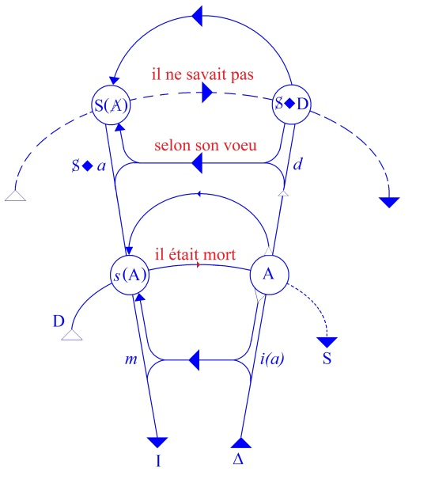

# Leçon 07 | 11 Janvier 1961

<!-- source-url: http://staferla.free.fr/S8/S8 LE TRANSFERT.docx -->
<!-- seminar: s8 -->
<!-- lesson: 07 -->

<!-- id: s8-07-0001 -->

Un petit temps d’arrêt avant de vous faire entrer dans la grande énigme de *l’amour de transfert*. Un temps d’arrêt - j’ai mes raisons de marquer quelquefois un temps d’arrêt - il s’agit en effet de nous entendre, de ne pas perdre notre orientation.

<!-- id: s8-07-0002 -->

Depuis le début de cette année donc, j’éprouve le besoin de vous rappeler que je pense, en tout ce que je vous enseigne, n’avoir fait que vous faire remarquer que *la doctrine* de FREUD implique le *désir* dans *une dialectique*, et là déjà il faut que je m’arrête pour vous faire noter que l’embranchement est déjà pris, et déjà par là, j’ai dit que *le désir n’est pas une fonction vitale*, au sens où le positivisme a donné son statut à la vie, donc il est pris dans *une dialectique* - *le désir* - parce qu’il est suspendu... ouvrez la parenthèse, j’ai dit sous quelle forme : suspendu sous forme de *métonymie* ...*suspendu à une chaîne signifiante*, laquelle est comme telle constituante du sujet, ce par quoi le sujet est distinct de l’individualité prise simplement *hic et nunc,* car n’oubliez pas que ce *hic et nunc* est ce qui *la définit*.

<!-- id: s8-07-0003 -->

Faisons l’effort pour pénétrer ce que ce serait que l’individuation, l’instinct de l’individualité donc, en tant que l’individuation aurait pour chacune des individualités à reconquérir, comme on nous l’explique en psychologie, par l’expérience ou par l’enseignement, *toute la structure réelle*, ce qui n’est quand même pas une mince affaire. Et aussi bien, ce qu’on n’arrive pas à concevoir *sans la supposition* qu’elle y serait au moins déjà préparée par une adaptation, une *cumulation adaptative*. Déjà l’individu humain, en tant que *connaissance*, serait fleur de conscience au bout d’une évolution, comme vous savez, de la pensée. Ce que je mets profondément en doute.

<!-- id: s8-07-0004 -->

Non pas après tout que je considère que ce soit là une direction sans fécondité, ni non plus sans issue, mais seulement pour autant que l’idée d’évolution nous habitue mentalement à toutes sortes d’*élisions* qui sont en tout cas très *dégradantes* pour notre réflexion, et je dirai - spécialement pour nous analystes - pour notre éthique. De toute façon, revenir sur ces *élisions*, montrer les béances que laisse ouvertes toute la théorie de l’évolution, en tant qu’elle tend toujours à recouvrir, à faciliter la concevabilité de notre expérience, les rouvrir - ces béances - est quelque chose qui me paraît essentiel. Si l’évolution est vraie, en tout cas une chose est certaine, c’est qu’elle n’est pas - comme disait VOLTAIRE en parlant d’autre chose - si naturelle que ça.

<!-- id: s8-07-0005 -->

Pour ce qui est du *désir*, en tout cas, il est essentiel de nous reporter à ses conditions, qui sont celles qui nous sont données par notre expérience. Notre expérience bouleverse tout le problème des données qui consistent en ceci que *le sujet conserve une chaîne articulée* *hors de la conscience*, inaccessible à la conscience, *une demande* et non pas une poussée, un malaise, une empreinte ou quoi que ce soit que vous essayiez de caractériser dans cet ordre de primitivité tendanciellement définissable. Mais au contraire s’y trace une *trace*, si je puis dire, cernée d’un trait, isolée comme telle, portée à une puissance qu’on dirait « *idéographique* », à condition que ce terme d’« *idéographique* » soit bien souligné comme n’étant d’aucune façon un indice portable sur quoi que ce soit d’isolé, mais toujours lié à la concaténation de l’*idéogramme* sur une ligne avec d’autres *idéogrammes* eux-mêmes cernés de cette fonction qui les fait signifiants

<!-- id: s8-07-0006 -->

*Cette demande constitue une revendication éternisée dans le sujet*, quoique latente et à lui inaccessible, un statut, un cahier des charges, non pas la modulation qui résulterait de quelque inscription phonétique du négatif inscrit sur un film, une bande, une *trace*, *mais qui prend date à jamais* : un enregistrement, oui, mais si vous mettez l’accent sur le terme *registre*, avec *classement* *au dossier*, une mémoire, oui, mais au sens qu’a ce terme dans une machine électronique.

<!-- id: s8-07-0007 -->

Eh bien, c’est le génie de FREUD d’en avoir désigné le support de cette chaîne, je crois vous l’avoir suffisamment montré et je le montrerai encore, spécialement dans un article qui est celui que j’ai cru devoir refaire autour du congrès de Royaumont[^86] et qui va paraître, FREUD en a désigné le support quand il parle du *Ça* dans la « *pulsion de mort* » elle–même, en tant qu’il a désigné le caractère mortiforme de *l’automatisme de répétition*.

<!-- id: s8-07-0008 -->

La mort, ce qui est là articulé par FREUD comme *tendance vers la mort*, comme *désir* où un impensable sujet se présente dans le vivant chez qui *ça parle,* est responsable précisément de ce dont il s’agit, à savoir de cette position excentrique du désir chez l’homme qui depuis toujours est le paradoxe de l’éthique, paradoxe, me semble-t-il, tout à fait insoluble dans la perspective de l’évolutionnisme. Dans ce qu’on peut appeler leur « *permanence transcendantale* », à savoir le caractère *transgressif* qui leur est *fondamental*, pourquoi et comment les désirs ne seraient-ils pas l’effet ni la source de ce qu’ils constituent : c’est-à-dire après tout, un désordre permanent dans un corps supposé soumis au statut de l’adaptation, sous quelque incidence qu’on admette les effets de cette adaptation ?

<!-- id: s8-07-0009 -->

Là, comme dans l’histoire de la physique, on n’a fait jusqu’ici qu’essayer de « *sauver les apparences* », et je crois vous avoir fait sentir, vous avoir donné l’occasion *de compléter l’accent de ce que veut dire « sauver les apparences » quand il s’agit des épicycles du système ptolémaïque* [^87].

<!-- id: s8-07-0010 -->

*N’allez pas vous imaginer que les gens qui ont enseigné pendant des siècles ce système*, avec la prolifération d’*épicycles* qu’il nécessitait, de *la trentaine* à la *soixante-quinzaine* selon les exigences d’exactitude qu’on y mettait, *y croyaient véritablement à ces épicycles* ! Ils ne croyaient pas que le ciel était fait comme les petites sphères armillaires. Vous les voyez d’ailleurs, ils les ont fabriquées avec leurs *épicycles*. J’ai vu dans un couloir du Vatican, dernièrement, *une jolie collection de ces épicycles* *réglant les mouvements* de Mars, de Vénus, de Mercure. Ça en fait un certain nombre qu’il faut mettre autour de la petite boule pour que ça réponde au mouvement ! Jamais personne n’y a cru sérieusement à ces *épicycles*.

<!-- id: s8-07-0011 -->

Et « *sauver les apparences* », ça voulait dire simplement : rendre compte de ce qu’on voyait en fonction d’une exigence de principe, du préjugé de la perfection de cette forme circulaire. Eh bien, c’est à peu près pareil quand on explique les désirs par le système des besoins, qu’ils soient individuels ou collectifs - et je soutiens que personne n’y croit plus dans la psychologie, j’entends une psychologie qui remonte dans toute la tradition moraliste - on n’a jamais cru, même au temps où on s’en occupait, aux *épicycles*. « *Sauver les apparences* », dans un cas comme dans l’autre, ne signifie rien d’autre que de vouloir réduire aux formes supposées *parfaites,* supposées exigibles au fondement de la déduction, ce qu’on ne peut d’aucune manière, en tout bon sens, y faire entrer.

<!-- id: s8-07-0012 -->

C’est donc de ce désir, de son interprétation, et pour tout dire, d’une éthique rationnelle, que j’essaie de fonder avec vous *la topologie*, la topologie de base. Dans cette topologie, vous avez vu se dégager au cours de l’année dernière ce rapport dit *de l’entre-deux-morts* qui n’est, si je puis dire, tout de même pas en soi la mer à boire, parce qu’il ne veut rien dire d’autre que ceci : qu’il n’y a pas pour l’homme *coïncidence* des *deux frontières* se rapportant à cette mort.

<!-- id: s8-07-0013 -->

Je veux dire la première frontière, qu’elle soit liée à une échéance foncière qu’on appelle vieillesse, vieillissement, dégradation, ou à un accident qui rompt le fil de la vie, la première frontière, celle en effet où la vie s’achève et se dénoue, eh bien, la situation de l’homme s’inscrit en ceci que cette frontière - c’est évident et cela depuis toujours, c’est pour cela que je dis que ce n’est pas la mer à boire - ne se confond pas avec celle qu’on peut définir sous sa formule la plus générale en disant que : *l’homme aspire à s’y anéantir pour s’y inscrire dans les termes de l’être*. Si l’homme aspire - c’est là évidemment la contradiction cachée, la petite goutte à boire - si l’homme aspire à se détruire, c’est en ceci même qu’il s’éternise. Ceci, vous le retrouverez partout inscrit dans ce discours aussi bien que dans les autres. Dans *Le Banquet* vous en trouverez des traces. En fin de compte, cet espace j’ai pris soin de vous l’illustrer l’année dernière en vous montrant *les quatre coins où s’inscrit l’espace* où se joue la tragédie.

<!-- id: s8-07-0014 -->

Je pense qu’il n’y a pas une tragédie qui n’en sorte éclaircie. Quelque chose de « *l’espace tragique* », pour dire le mot, avait été dérobé historiquement aux poètes dans la tragédie du XVIIème siècle, par exemple la tragédie de RACINE, et prenez n’importe laquelle de ses tragédies, vous le verrez, il faut pour qu’il y ait semblant de tragédie, que par quelque côté s’inscrive *cet espace de l’entre-deux-morts*.

<!-- id: s8-07-0015 -->

*Andromaque, Iphigénie, Bajazet -* ai-je besoin de vous en rappeler l’intrigue - si vous montrez que *quelque chose* y subsiste qui ressemble à une tragédie, c’est bien parce que, de quelque façon qu’elles soient symbolisées, ces deux morts y sont là toujours. *Andromaque* se situe entre la mort d’HECTOR et celle suspendue sur le front d’ASTYANAX, ça n’est bien entendu que le signe d’une *autre duplicité*. Pour tout dire, que toujours la mort du héros soit entre cette menace imminente portée à sa vie et le fait qu’il l’affronte pour « *passer à la postérité* », ce n’est là qu’une forme dérisoire du problème. Voilà ce que signifient les deux termes toujours retrouvés de cette *duplicité* de la pulsion mortifère.

<!-- id: s8-07-0016 -->

Oui, mais il est clair - encore que ceci soit nécessaire pour maintenir le cadre de l’espace tragique - qu’il s’agit de savoir *comment* *cet espace* est habité. Et je ne veux faire au passage, que cette opération de déchirer des toiles d’araignée qui nous séparent d’une vision directe pour vous inciter, si riches de résonances poétiques qu’ils restent pour vous par toutes leurs vibrations lyriques, à vous référer aux sommets de *la tragédie chrétienne*, à la tragédie de RACINE, pour vous apercevoir - prenez *Iphigénie* par exemple - de tout ce qui se passe : tout ce qui s’y passe est irrésistiblement *comique*. Faites-en l’épreuve :

<!-- id: s8-07-0017 -->

- AGAMEMNON y est en somme fondamentalement caractérisé par sa terreur de la scène conjugale : « *Voilà, voilà les cris que je craignais d’entendre* »[^88]

<!-- id: s8-07-0018 -->

- ACHILLE y apparaît dans une position incroyablement superficielle concernant tout ce qui s’y passe. Et pourquoi ?

<!-- id: s8-07-0019 -->

J’essayerai de vous le pointer tout à l’heure : justement en fonction de son rapport avec la mort, ce rapport *traditionnel* pour lequel toujours il est ramené, cité au premier plan, par un des moralistes du cercle le plus intime autour de SOCRATE. Cette histoire d’ACHILLE - *qui délibérément préfère la mort qui le rendra immortel, au refus de combattre qui lui laissera la vie* - est là réévoquée partout.

<!-- id: s8-07-0020 -->

Dans l’*Apologie de Socrate* elle-même, SOCRATE en fait état pour définir ce qui va être *sa propre conduite devant ses juges* [^89]. Et nous en trouvons l’écho jusque dans le texte de la tragédie racinienne - je vous le citerai tout à l’heure - sous un autre éclairage beaucoup plus important. Mais cela fait partie des lieux communs, qui au cours des siècles, ne cessent de retentir, de rebondir toujours croissants dans cette résonance toujours plus creuse et boursouflée.

<!-- id: s8-07-0021 -->

Qu’est-ce qu’il manque donc à la tragédie, quand elle se poursuit au-delà du champ de ses limites, limites qui lui donnaient sa place dans la respiration de la communauté antique ? Toute la différence repose sur quelques *ombres*, obscurités, occultations qui portent sur les commandements de « *la seconde mort* ». Dans RACINE, ces commandements n’ont plus aucune ombre pour la raison que nous ne sommes plus dans le texte où *l’oracle delphique* peut même se faire entendre. Ce n’est que cruauté, contradiction vaine, absurdité. Les personnages épiloguent, dialoguent, monologuent pour dire qu’il y a sûrement *maldonne* en fin de compte.

<!-- id: s8-07-0022 -->

Il n’en est point ainsi dans la tragédie antique. Le commandement de « *la seconde mort* », pour y être sous cette forme voilée, peut s’y formuler et y être reçu comme relevant de cette dette qui s’accumule sans coupable, et se décharge sur une victime, sans que cette victime ait mérité la punition.

<!-- id: s8-07-0023 -->

<!-- id: s8-07-0024 -->

Ce « *il ne savait pas* », pour tout dire, que je vous ai inscrit au haut du graphe sur *la ligne dite de « l’énonciation fondamentale* » de *la topologie de l’inconscient*, voilà ce qui est déjà atteint, préfiguré dirais-je, si ce n’était pas un mot anachronique dans la tragédie antique, préfiguré par rapport à FREUD qui le reconnaît d’emblée comme se rapportant à la raison d’être u’il vient de découvrir dans l’inconscient. Il reconnaît sa découverte et son domaine dans la tragédie d’ŒDIPE, non pas parce qu’ŒDIPE a « *tué son père* », pas plus qu’il n’a envie de « *coucher avec sa mère* ».

<!-- id: s8-07-0025 -->

Un mythologue très amusant, je veux dire qui a fait une vaste collection, *un vaste rassemblement des mythes* qui est bien utile, c’est un ouvrage qui n’a aucune renommée, mais d’un bon usage pratique qui a réuni dans deux petits volumes parus aux *Penguin Books* toute la mythologie antique, croit pouvoir faire le malin en ce qui concerne le mythe de l’Œdipe dans FREUD[^90]**.**

<!-- id: s8-07-0026 -->

Il dit : pourquoi FREUD ne va-t-il pas chercher son mythe dans la mythologie égyptienne où l’hippopotame est réputé pour « *coucher avec sa mère* » et « *écraser* *son père* » ? Et il dit : « *Pourquoi ne l’a-t-il pas appelé le complexe de l’hippopotame* ? » Et là, il croit avoir porté une fort bonne botte dans la bedouille \[bedaine\] de la mythologie freudienne. Mais ce n’est pas pour cela qu’il l’a choisi ! Il y a bien d’autres héros qu’ŒDIPE qui sont le lieu de cette conjonction fondamentale. L’important, et ce pourquoi FREUD retrouve sa figure fondamentale dans la tragédie d’Œdipe, c’est le « *il ne le savait pas*... » qu’il avait tué son père et qu’il couchait avec sa mère.

<!-- id: s8-07-0027 -->

Voici donc rappelés ces termes fondamentaux de notre topologie parce que c’est nécessaire pour que nous continuions l’analyse du *Banquet,* à savoir pour que vous perceviez l’intérêt qu’il y a, à ce que ce soit maintenant AGATHON, le poète tragique, qui vienne à faire son *discours sur l’amour*.

<!-- id: s8-07-0028 -->

Il faut encore que je prolonge ce petit *temps d’arrêt* pour éclairer mon propos, au sujet de ce que, peu à peu, je promeus devant vous, à travers ce *Banquet, sur le mystère de* SOCRATE, *mystère* dont je vous disais l’autre jour que, pendant un moment, j’ai eu ce sentiment de m’y tuer. Il ne me paraît pas insituable. Non seulement il ne me paraît pas insituable, mais c’est parce que je crois que nous pouvons parfaitement le situer qu’il est justifié que nous partions de lui pour notre recherche de cette année.

<!-- id: s8-07-0029 -->

Je rappelle donc ceci, dans les mêmes termes annotés qui sont ceux que je viens de réarticuler devant vous, je le rappelle pour que vous alliez le confronter avec les textes de PLATON dont - pour autant qu’ils sont notre document de première main depuis quelque temps - je remarque que ce n’est plus en vain que je vous renvoie à des lectures. Je n’hésiterai pas à vous dire que vous devez redoubler la lecture du *Banquet,* que vous avez presque tous faite, de celle du *Phédon* qui vous donnera un bon exemple de ce qu’est *la méthode socratique* et de ce pourquoi elle nous intéresse.

<!-- id: s8-07-0030 -->

Nous dirons donc que le mystère de SOCRATE - et il faut aller à ce document de première main pour le faire rebriller dans son originalité - c’est l’installation de ce qu’il appelle lui, *la science,* ἐπιστήμη \[épistèmè\]*,* et dont vous pourrez contrôler sur texte ce que ça veut dire. Il est bien évident que ça n’a pas *le même son*, *le même accent* que pour nous. Il est bien évident qu’il n’y avait pas le plus petit commencement de ce qui s’est articulé pour nous sous la rubrique de *science*.

<!-- id: s8-07-0031 -->

La meilleure formule que vous puissiez en donner de *cette installation de la science* - dans quoi ?- *dans la conscience*, dans une position, dans une dignité d’*absolu,* ou plus exactement dans une position d’*absolue dignité,* c’est qu’il ne s’agit de rien d’autre que de ce que nous pouvons, dans notre vocabulaire, exprimer comme *la promotion*, à cette *position d’absolue dignité*, *du signifiant* comme tel. Ce que SOCRATE appelle *science*, c’est ce qui s’impose nécessairement à toute interlocution en fonction d’une certaine manipulation, d’une certaine cohérence interne liée - ou qu’il croit liée - à la seule pure et simple *référence au signifiant*.

<!-- id: s8-07-0032 -->

Dans le *Phédon* vous le verrez poussé à son dernier terme par l’incrédulité de ses interlocuteurs qui, si contraignants que soient ses arguments, n’arrivent pas - *non plus que personne* - à tout à fait céder à l’affirmation par SOCRATE de *l’immortalité de l’âme*. Ce à quoi au dernier terme SOCRATE va se référer - et bien entendu d’une façon pour tout le monde, du moins pour nous, de moins en moins *convaincante -* c’est à des propriétés comme celle *du pair et de l’impair*. C’est du fait que le nombre « *trois* » ne saurait d’aucune façon recevoir la qualification de l’imparité, c’est sur des pointes comme celle-là que repose la démonstration que *l’âme* ne saurait recevoir, de par ce qu’elle est au principe même de la vie, la qualification du *destructible* [^91]. Vous pouvez voir à quel point, ce que j’appelle cette référence privilégiée, promue comme une sorte de *culte*, de rite essentiel, la *référence au signifiant*, est tout ce dont il s’agit quant à ce qu’apporte de nouveau, d’original, de tranchant, de fascinant, de séduisant : nous en avons le témoignage historique, le surgissement de SOCRATE au milieu des sophistes.

<!-- id: s8-07-0033 -->

2ème terme à dégager de ce que nous avons de ce *témoignage*, c’est le suivant : c’est que *de par SOCRATE*, et *de par la présence* cette fois totale de SOCRATE, *de par sa destinée*, *de par sa mort* et ce qu’il affirme avant de mourir, il apparaît que cette promotion est cohérente de cet effet que je vous ai montré dans un homme, d’abolir en lui - semble-t-il de façon totale - ce que j’appellerai d’un terme kierkegaardien : *la crainte et le tremblement* [^92] - devant quoi ? - précisément non pas devant la première, mais devant *la seconde mort*. Il n’y a pas pour SOCRATE là-dessus d’hésitation. Il nous affirme que cette seconde mort incarnée dans sa dialectique, dans le fait qu’il porte à la puissance absolue, à la puissance de « *seul fondement de la certitude* », cette *cohérence du signifiant*, c’est là que lui, SOCRATE, trouvera - sans aucune espèce de doute - sa *vie éternelle*. Je me permettrai, presque en marge, de dessiner comme une sorte de parodie, à condition bien entendu que vous ne lui donniez pas plus de portée que ce que je vais dire, la figure du « *syndrome de Cotard* [^93] » : *cet infatigable questionneur me semble méconnaître que sa bouche est de chair*. Et c’est en cela qu’est cohérente cette affirmation, on ne peut pas dire cette *certitude*.

<!-- id: s8-07-0034 -->

Nous sommes là presque devant une sorte d’apparition qui nous est étrangère, quand SOCRATE - n’en doutez pas, d’une façon très exceptionnelle, d’une façon que, pour employer notre langage, et pour me faire comprendre, et pour aller vite, j’appellerai une façon qui est *de l’ordre du noyau psychotique -* déroule implacablement ses *arguments* qui n’en sont pas, mais aussi cette affirmation, plus *affirmante* que peut-être on n’en a entendue aucune*,* à ses disciples le jour même de sa mort, concernant le fait que lui SOCRATE, sereinement quitte cette vie pour une vie plus vraie, pour une vie immortelle. Il ne doute pas de rejoindre ceux qui, ne l’oublions pas, existent pour lui encore : les *Immortels*. Car la notion des *Immortels* n’est pas, pour sa pensée, éliminable, réductible : c’est *en fonction de l’antinomie* - *les Immortels et les mortels -* absolument fondamentale dans la pensée antique, et non moins, croyez-moi, pour la nôtre, que son témoignage vivant, vécu, prend sa valeur.

<!-- id: s8-07-0035 -->

Je résume donc. *Cet infatigable questionneur*, qui n’est pas un « *parleur* », qui repousse *la rhétorique, la métrique, la poétique*, qui réduit la métaphore, qui vit tout entier dans le jeu, non pas de la carte forcée, mais de la question forcée et qui y voit toute sa subsistance, ..engendre devant vous, développe pendant *tout le temps de sa vie* ce que j’appellerai une formidable métonymie, dont le résultat, également attesté - nous partons de l’attestation historique - est ce désir qui s’incarne dans cette affirmation d’*immortalité*, dirais-je, figée, triste, « *immortalité noire et laurée* » écrit quelque part VALÉRY[^94], ce désir de discours infinis.

<!-- id: s8-07-0036 -->

Car dans l’au-delà, s’il est sûr de rejoindre les *Immortels*, il est aussi - dit-il - à peu près sûr de pouvoir continuer pendant l’éternité avec des interlocuteurs dignes de lui - ceux qui l’ont précédé et tous les autres qui viendront le rejoindre *-* ses petits exercices[^95]. Ce qui, avouez-le, est une conception qui, pour satisfaisante qu’elle soit pour les gens qui aiment l’allégorie ou le tableau allégorique, est tout de même une imagination qui sent quand même singulièrement le délire.

<!-- id: s8-07-0037 -->

Discuter du « *pair et de l’impair* », du « *juste et de l’injuste* », du « *mortel et de l’Immortel* », du « *chaud et du froid* », et du fait que « *le chaud* *ne saurait admettre en lui le froid sans l’affaiblir, sans se retirer dans son essence de chaud à l’écart* » comme il nous est longuement expliqué dans le *Phédon,* comme principe des raisons de « *l’immortalité de l’âme* »[^96] discuter de ceci pendant *l’éternité* est véritablement une très singulière conception du bonheur !

<!-- id: s8-07-0038 -->

Il faut mettre ces choses dans leur relief : un homme *a vécu* comme cela la question de *l’immortalité de l’âme.* Je dirai plus : « *l’âme* » telle qu’encore nous la manipulons, et je dirai : telle qu’encore *nous en sommes encombrés,* la *notion de* « *l’âme* », la *figure de* « *l’âme* » que nous avons, qui n’est pas celle qui s’est fomentée au cours de toutes les vagues de *l’héritage traditionnel,* j’ai dit « *l’âme* » à laquelle nous avons affaire dans la tradition chrétienne, « *l’âme* » a comme appareil, comme *armature*, comme tige métallique dans son intérieur, le sous-produit de ce délire d’immortalité de SOCRATE. Nous en vivons encore.

<!-- id: s8-07-0039 -->

Et ce que je veux simplement produire ici devant vous, c’est le relief, l’*énergie* de cette affirmation socratique concernant *l’âme* *comme immortelle*. Pourquoi ? Ça n’est évidemment pas pour la portée que nous pouvons lui donner couramment. Car si nous nous référons à cette portée, il est bien évident qu’après quelques siècles d’exercices - et même d’exercices spirituels ! - le taux - si je puis dire - de ce qu’on appelle « *le niveau de la croyance à l’immortalité de l’âme* », chez tous ceux que j’ai devant moi, j’ose le dire : croyants ou incroyants, est des plus *tempérés*, comme on dit que *la gamme est tempérée*.

<!-- id: s8-07-0040 -->

Ce n’est pas cela dont il s’agit, ce n’est pas cela l’intéressant : de vous reporter à l’énergie, à l’affirmation, au relief, à la promotion de cette affirmation de « *l’immortalité de l’âme*  », à une date et sur certaines bases, par un homme, qui dans son sillage, *stupéfie* en somme ses contemporains *par son discours.* C’est pour que vous vous interrogiez, que vous vous référiez à ceci qui a toute son importance : *pour que ce phénomène ait pu se produire*, pour qu’un homme ait pu, comme on dit : « *Ainsi parla*... » (*ce personnage a sur* ZARATHOUSTRA *l’avantage d’avoir existé*) *qu’est-ce qu’il fallait que fût, à* SOCRATE*, son désir ?*

<!-- id: s8-07-0041 -->

Voilà ce point crucial que je crois pouvoir pointer devant vous, et d’autant plus aisément, en précisant d’autant mieux son sens, que j’ai longuement décrit devant vous la topologie qui donne son sens à cette question. Si SOCRATE introduit cette position, à propos de laquelle je vous prie d’ouvrir après tout n’importe quel passage, n’importe lequel des dialogues de PLATON qui se rapporte directement à la personne de SOCRATE, pour en vérifier le bien-fondé.

<!-- id: s8-07-0042 -->

À savoir, la position tranchante, paradoxale, de son *affirmation* de *l’immortalité*, et ce sur quoi est fondée cette idée - qui est la sienne - de *la science*, en tant que je la déduis comme cette pure et simple *promotion à la valeur absolue de la fonction du signifiant dans la conscience,* à quoi ceci répond-il, *à quelle atopie* dirai-je - le mot, vous le savez, n’est pas de moi concernant SOCRATE - à quelle ἀτοπία \[atopia\] du *désir* ? Le terme d’ἀτοπία, d’*ἄ*τοπος \[atopos\], pour le désigner, *ἄ*τοπος : *un cas inclassable, insituable,* ἀτοπία : *on ne peut le foutre nulle part, le gars *!

<!-- id: s8-07-0043 -->

Voilà ce dont il s’agit, voilà ce dont le discours de ses contemporains bruissait, concernant SOCRATE. Pour moi, pour nous, cette « *atopie du désir * », sur lequel je porte le point d’interrogation, est-ce que d’une certaine façon elle ne coïncide pas avec ce que je pourrais appeler une certaine *pureté topique,* justement en ce qu’elle désigne le point central, où dans notre *topologie*, cet espace de « *l’entre-deux-morts* » est comme tel, à l’état pur et vide, *la place du désir*, le *désir* n’y étant plus que « *sa place* », en tant qu’il n’est plus pour SOCRATE que « *désir de discours* », de discours *révélé*, *révélant*, à jamais ? D’où résulte bien sûr l’ἀτοπία du sujet socratique lui-même, si tant est que jamais avant lui n’a été occupée par aucun homme, aussi purifiée, cette « *place du désir* ».

<!-- id: s8-07-0044 -->

Je n’y réponds pas, à cette question, je la pose parce qu’elle est vraisemblable, qu’à tout le moins elle nous donne un premier repère pour situer ce qui est notre question, qui est une question que nous ne pouvons pas éliminer à partir du moment où nous l’avons une première fois introduite. Et ce n’est pas moi après tout qui l’ai introduite. Elle est, d’ores et déjà, introduite à partir du moment où nous nous sommes aperçus que *la complexité de la question du transfert* n’était aucunement limitable à ce qui se passe chez le sujet dit « *patient »*, à savoir *l’analysé*.

<!-- id: s8-07-0045 -->

Et par conséquent la question se pose, d’articuler, d’une façon un petit peu plus poussée qu’il n’avait été fait jusqu’à présent, ce que doit être le « *désir de l’analyste* ». Il ne suffit pas maintenant de parler de la καθαρσις \[catharsis\], de la *purification didactique*, si je puis dire, du plus gros de l’inconscient chez *l’analyste*, tout ceci reste très vague. Il faut rendre cette justice aux analystes, que depuis quelque temps ils ne s’en contentent pas, il faut aussi s’apercevoir - non pas pour les critiquer, mais pour comprendre à quel obstacle nous avons affaire - que nous ne sommes même pas au plus petit commencement de ce que l’on pourrait articuler tellement facilement*,* sous forme de questions concernant ce qui doit être obtenu chez quelqu’un, pour qu’il puisse être un analyste : il en saurait maintenant un tout petit peu plus de *la dialectique de son inconscient* ? Qu’est-ce qu’il en sait, *en fin de compte*, exactement ? Et surtout, jusqu’où ce qu’il sait a-t-il dû *aller* concernant les effets du savoir ?

<!-- id: s8-07-0046 -->

- Et simplement je vous pose cette question : que doit-il rester de ses fantasmes ? Vous savez que je suis capable d’aller plus loin,

<!-- id: s8-07-0047 -->

- de dire « son fantasme », si tant est qu’il y ait un fantasme fondamental. Si la castration est ce qui doit être accepté au dernier terme

<!-- id: s8-07-0048 -->

- de l’analyse, quel doit être le rôle de sa cicatrice à la castration dans l’ÉROS de l’analyste ?

<!-- id: s8-07-0049 -->

Ce sont des questions dont je dirai qu’il est plus facile de les poser que de les résoudre. C’est bien pour cela qu’on ne les pose pas ! Et croyez-moi, je ne les poserais pas non plus dans le vide, comme cela, histoire simplement de vous chatouiller l’imagination, si je ne pensais pas qu’il doit y avoir *une méthode, une méthode de biais*, voire oblique, voire de détour, pour apporter quelque lumière dans ces questions auxquelles il nous est évidemment impossible pour l’instant de répondre de plein fouet. Tout ce que je peux vous dire, *c’est qu’il ne me semble pas que ce qu’on appelle « la relation médecin-malade* », avec ce qu’elle comporte de *présupposés*, de préjugés, de mélasse fourmillante, d’aspect de vers de fromage, soit quelque chose qui nous permette dans ce sens d’avancer beaucoup.

<!-- id: s8-07-0050 -->

Il s’agit donc d’essayer d’articuler, selon des *repères* qui sont, qui peuvent être désignés pour nous à partir d’une *topologie* déjà esquissée, comme les coordonnées du désir, ce que doit être, ce qu’est fondamentalement *le désir de l’analyste*. Et s’il s’agit de le situer, je crois que ce n’est, ni en se référant aux articulations de la situation pour le thérapeute ou observateur, ni à aucune des notions de situation telles qu’une phénoménologie les élabore autour de nous, que nous pouvons trouver nos repères idoines.

<!-- id: s8-07-0051 -->

*Le désir de l’analyste* n’est pas tel, qu’il peut se contenter, se suffire, d’une référence *dyadique*. Ce n’est pas la relation avec son patient par une série *d’éliminations*, *d’exclusives*, qui peut nous en donner la clé. Il s’agit de quelque chose de plus intrapersonnel. Et bien sûr, ce n’est pas non plus pour vous dire que « *l’analyste doit être un* SOCRATE », ni « *un pur*  », ni « *un saint*  ». Sans doute ces explorateurs, que sont SOCRATE ou *les purs* ou *les saints*, peuvent nous donner quelques indications concernant *le champ dont il s’agit*. Et non seulement quelques indications, mais justement c’est pour cela qu’à la réflexion nous y référons, nous, toute notre science, j’entends expérimentale, sur *le champ dont il s’agit*.

<!-- id: s8-07-0052 -->

Mais, c’est justement à partir de ceci que c’est par eux qu’est faite l’exploration, que nous pouvons peut-être articuler, définir en termes *de longitude et de latitude les coordonnées que l’analyste doit être capable d’atteindre simplement pour occuper la place qui est la sienne*, laquelle se définit comme : *la place qu’il doit offrir vacante au désir du patient pour qu’il se réalise comme désir de l’Autre*. C’est en ceci que *Le Banquet* nous intéresse, en ceci que par cette place tout à fait privilégiée qu’il occupe concernant les témoignages sur SOCRATE, pour autant qu’il est censé mettre aux prises devant nous SOCRATE avec le problème de l’amour, *Le Banquet* est pour nous un texte utile à explorer.

<!-- id: s8-07-0053 -->

Je crois en avoir dit assez pour justifier que nous abordions le problème du transfert, à commencer par le commentaire du *Banquet*. Je crois aussi qu’il a été nécessaire que je rappelle ces coordonnées au moment où nous allons entrer dans ce qui occupe la place centrale ou quasi-centrale de ces célèbres dialogues, à savoir le discours d’AGATHON.

<!-- id: s8-07-0054 -->

Est-ce ARISTOPHANE, est-ce AGATHON qui occupe la place centrale ? Peu importe de trancher. À eux deux, en tout cas, sûrement ils occupent la place centrale, puisque tout ce qui est avant, selon toute apparence, démontré, est par eux tenu comme d’ores et déjà reculé, dévalorisé, puisque ce qui va suivre ne va être rien d’autre que le discours de SOCRATE. Sur ce discours d’AGATHON, c’est-à-dire du *poète tragique*, il y aurait à dire un monde de choses non seulement érudites, mais qui nous entraîneraient dans un *détail*, voire dans une histoire de la tragédie dont vous avez vu que je vous ai d’ailleurs donné tout à l’heure certain relief. L’important n’est pas cela. L’important est de vous faire percevoir la place du discours d’AGATHON dans l’économie du *Banquet*. Vous l’avez lu, il y a cinq ou six pages dans la traduction française de Guillaume BUDÉ par ROBIN. Je vais le prendre vers son acmé, vous verrez pourquoi : je suis moins ici pour vous faire un commentaire plus ou moins élégant du *Banquet* que pour vous amener à ce à quoi il peut ou doit nous servir.

<!-- id: s8-07-0055 -->

Après avoir fait un discours dont *le moins qu’on puisse dire* est qu’il a frappé tous les lecteurs depuis toujours par son extraordinaire « *sophistique* », *au sens le plus moderne*, le plus commun, péjoratif du mot. Le type par exemple de ce qu’on peut appeler cette sophistique, c’est de dire \[[196b](http://remacle.org/bloodwolf/philosophes/platon/cousin/banquet.htm)\] que :

<!-- id: s8-07-0056 -->

- « *l’Amour, ni ne commet d’injustice ni n’en subit,*

<!-- id: s8-07-0057 -->

- *ni de la part d’un dieu ni à l’égard d’un dieu,*

<!-- id: s8-07-0058 -->

- *ni de la part d’un homme ni à l’égard d’un homme*... ». 

<!-- id: s8-07-0059 -->

Pourquoi ?

<!-- id: s8-07-0060 -->

« *Parce qu’il n’y a ni violence dont il pâtisse, s’il pâtit en quelque chose, car *- chacun sait que - *la* *violence ne met pas la main sur l’amour* * *- donc - *aucune* *violence non plus en ce qu’il fait et qui soit de son fait, car c’est de bon gré *- nous dit-on - *que* *tous en tout se mettent* *aux ordres de l’amour*... » \[[196c](http://remacle.org/bloodwolf/philosophes/platon/cousin/banquet.htm)\].

<!-- id: s8-07-0061 -->

Or :

<!-- id: s8-07-0062 -->

« *les choses sur lesquelles le bon gré s’accorde au bon gré, ce sont celles-là que proclament justes les Lois, reines de la Cité *»

<!-- id: s8-07-0063 -->

Moralité : L’amour est donc ce qui est au principe des lois de la cité, et ainsi de suite, comme l’amour est le plus fort de tous les désirs, l’irrésistible volupté, il sera confondu avec la tempérance, puisque la tempérance étant ce qui règle les désirs et les voluptés en droit, l’amour doit donc se confondre avec cette position de tempérance \[196c\].

<!-- id: s8-07-0064 -->

Manifestement on s’amuse. Qui s’amuse ? Est-ce seulement nous, les lecteurs ? Je crois que nous aurions tout à fait tort de croire que nous soyons les seuls. AGATHON est ici en une posture qui n’est certes pas secondaire ne serait-ce que, parce que - au moins dans le principe, dans les termes, dans la position de la situation - il est *l’aimé* de SOCRATE**.**

<!-- id: s8-07-0065 -->

Je crois que PLATON, nous lui faisons ce crédit, s’amuse aussi de ce que j’appellerai d’ores et déjà - et vous verrez que je vais le justifier *encore plus -* le « *discours macaronique* [^97]*du tragédien sur l’amour *». Mais je crois - je suis sûr - et vous en serez sûrs dès que vous l’aurez lu, vous aussi que nous aurions tout à fait tort de ne pas *comprendre* que ça n’est pas nous, ni PLATON seulement, qui nous amusons ici de ce discours. Il est tout à fait clair, contrairement à ce que les commentateurs ont dit, il est tout à fait *hors de question* que celui qui parle, à savoir AGATHON, ne sache pas lui-même très bien ce qu’il fait. Les choses vont si loin, les choses vont si fort, que vous allez simplement voir qu’au sommet de *ce discours* AGATHON va nous dire \[[197c](http://remacle.org/bloodwolf/philosophes/platon/cousin/banquet.htm)\] : « *Et d’ailleurs je vais vous improviser là-dessus deux petits vers de ma façon* », et il s’exprime :

<!-- id: s8-07-0066 -->

> « εἰρήνην μὲν ἐν ἀνθρώποις, πελάγει δὲ γαλήνην  
> νηνεμίαν, ἀνέμων κοίτην ὕπνον τ᾽ ἐνὶ κήδει. »

<!-- id: s8-07-0067 -->

« εἰρήνην μὲν ἐν ἀνθρώποις » \[eirènèn men en anthrôpois\] : « *Paix parmi les humains* » dit M. Léon ROBIN, ce qui veut dire : *l’amour c’est la fin du rififi.* Singulière conception, il faut bien le dire, car jusqu’à cette modulation idyllique, on ne s’en était guère douté. Mais pour mettre *les points sur les i*, il en remet : « πελάγει δὲ γαλήνην » \[pelagei de galènèn\]*,* cela veut absolument dire : *tout est en panne, calme plat sur la mer*. Autrement dit, il faut se souvenir de ce que ça veut dire « *calme plat sur la mer* », pour *les anciens* cela veut dire : « *plus rien ne marche, les vaisseaux restent bloqués à Aulis* » et quand ça vous arrive en pleine mer, on est excessivement embêté, tout aussi embêté que quand ça vous arrive au lit.

<!-- id: s8-07-0068 -->

De sorte qu’à propos de l’amour évoquer : « πελάγει δὲ γαλήνην » \[pelagei de galènèn\], il est bien clair qu’on est en train de rigoler un peu : l’amour c’est ce qui vous met « *en panne* », c’est ce qui vous fait faire « *fiasco* ». Et puis ce n’est pas tout. Après il dit : « *Il n’y a plus de vent chez les vents* »... On en remet, l’amour : il n’y a plus d’amour :

<!-- id: s8-07-0069 -->

« νηνεμίαν ἀνέμων » \[nènemian anemôn\]

<!-- id: s8-07-0070 -->

Cela sonne d’ailleurs comme les vers à jamais *comiques* d’une certaine tradition. Cela ressemble à deux vers de Paul-Jean TOULET :

<!-- id: s8-07-0071 -->

« *Sous le double ornement d’un nom mol ou sonore, Non, il n’est rien que Nanine et Nonore* ».

<!-- id: s8-07-0072 -->

Nous sommes dans ce registre-là. Et « κοίτην » \[koitèn\] en plus, ce qui veut dire : *à la couche, coucouche panier, rien au lit, plus de vent* *dans les vents, tous les vents sont couchés.* Et puis « ὕπνον τ᾽ ἐνὶ κήδει » \[hupnon t’eni kèdei\]*.* Chose *singulière* : l’amour nous apporte « *le sommeil au sein des soucis* » Pourrait-on traduire au premier abord.

<!-- id: s8-07-0073 -->

Mais si vous regardez, le sens des occurrences de ce κήδος \[kèdos\], le terme grec toujours bien *riche de dessous* qui nous permettraient de revaloriser singulièrement ce qu’un jour avec sans doute de grandes *bienveillances* pour nous, mais peut-être manquant malgré tout à ne pas suivre FREUD dans *quelque chose d’essentiel*, M. BENVENISTE, pour notre premier numéro, a articulé sur les ambivalences des signifiants[^98], vous vous apercevrez que le κήδος \[kèdos\] n’est pas simplement *le* *souci*, c’est aussi *la parenté*. L’ὕπνον τ᾽ ἐνὶ κήδει \[hupnon t’eni kèdei\] nous l’ébauche, le κήδος \[kèdos\] comme « *parent par alliance d’une cuisse d’éléphant* » quelque part chez LÉVI-STRAUSS[^99], et cet ὕπνος \[hypnos\] *le sommeil tranquille,* τ᾽ ἐνὶ κήδει \[t’eni kèdei\] *dans les rapports avec la belle-famille* me paraît quelque chose de digne de couronner *des vers* qui sont incontestablement faits pour nous secouer, si nous n’avons pas encore compris qu’AGATHON *raille* [^100].

<!-- id: s8-07-0074 -->

D’ailleurs à partir de ce moment-là, *littéralement il se déchaîne* et nous dit que *l’amour*, c’est ce qui littéralement*nous libère, nous débarrasse* *de la croyance que nous sommes les uns pour les autres des étrangers* \[[197d](http://remacle.org/bloodwolf/philosophes/platon/cousin/banquet.htm)\]. « *Naturellement quand on est possédé par l’amour, on se rend compte qu’on fait tous partie d’une grande famille, c’est véritablement à partir de ce moment-là qu’on est au chaud et à la maison* ». Et ainsi de suite, ça continue pendant des lignes. Je laisse au plaisir de vos soirées le soin de vous en pourlécher les babines.

<!-- id: s8-07-0075 -->

Quoi qu’il en soit, si vous êtes d’accord que *l’amour* est bien « *l’artisan de l’humeur facile »,* qu’« *il bannit toute mauvaise humeur »,* qu’« *il est libéral »,* qu’« *il est incapable d’être mal intentionné », *il y a là une énumération sur laquelle j’aimerais avec vous longuement m’attarder : c’est qu’il est dit être *le père* \[πατήρ\] *-* de quoi ? - *le père* de Τρυϕῆς \[Truphès\], d’ Ἁβρότητος \[Habrotos\], de Χλιδῆς \[Chlidès\], de Χαρίτων \[Chariton\], d’ Ἱμέρου \[Himeron\] et de Πόθου \[Pothon\].

<!-- id: s8-07-0076 -->

Il nous faudrait plus de temps que nous n’en disposons ici pour faire le parallèle de ces termes qu’on peut traduire au premier abord comme *Bien-être, Délicatesse, Langueur, Gracieusetés, Ardeurs, Passion,* et pour faire le double travail qui consisterait à les confronter avec le registre des *bienfaits*, de *l’honnêteté* dans *l’amour courtois* tel que je l’avais rappelé devant vous l’année dernière. Il vous serait facile alors de voir la distance, et qu’il est tout à fait impossible de se contenter du rapprochement que fait en note M. Léon ROBIN avec *la Carte du Tendre,* ou avec les vertus du chevalier dans *La Minne* [^101] - il ne l’évoque d’ailleurs pas*,* il ne parle que de la *Carte du Tendre.*

<!-- id: s8-07-0077 -->

Car ce que je vous montrerais, texte en main, c’est qu’il n’y a pas un de ces termes, Τρυϕῆς \[Truphès\] par exemple, qu’on se contente de connoter comme étant le « *Bien-être* » qui n’ait été chez la plupart des auteurs, pas simplement des auteurs comiques, utilisé avec les connotations les plus désagréables.

<!-- id: s8-07-0078 -->

Τρυϕῆς \[Truphès\] par exemple dans ARISTOPHANE, désigne ce qui chez une femme, chez une épouse, est introduit tout d’un coup dans la vie, dans la paix d’un homme, de ses insupportables prétentions. La femme qui est dite τρυϕερός \[Truphéros\], ou τρυϕερα \[Truphéra\] au féminin, est une insupportable *snobinette* : c’est celle qui ne cesse un seul instant de faire valoir devant son mari les supériorités de son rang et la qualité de sa famille et ainsi de suite. Il n’y a pas un seul de ces termes qui ne soit habituellement et en grande majorité, par les *auteurs* - qu’il s’agisse cette fois des tragiques, voire même de poètes comme HÉSIODE - conjoint, juxtaposé*,* Χλιδῆς \[Chlidès\]*, langueur* par exemple - avec l’emploi de αὐθαδία \[authadia\]*,* signifiant cette fois *une des formes les plus insupportables de* l’ὕβρις \[hubris\] et de *l’infatuation*[^102].

<!-- id: s8-07-0079 -->

Je ne veux que vous *indiquer* ces choses en passant. On continue \[[197d](http://remacle.org/bloodwolf/philosophes/platon/cousin/banquet.htm)\] :

<!-- id: s8-07-0080 -->

*l’amour* *est aux petits soins pour les bons, par contre jamais il ne lui arrive de s’occuper des vilains* [^103],*dans la lassitude et dans l’inquiétude,* *dans le feu de la passion* ἐν πόθῳ \[en pothô\][^104] et *dans le jeu de l’expression...* »

<!-- id: s8-07-0081 -->

*Ce sont de ces traductions qui ne signifient absolument rien*, car en grec vous avez : ἐν πόνῳ \[en ponô\], ἐν ϕόβῳ \[en phobô\], ἐν όγῳ \[en logô\] :

<!-- id: s8-07-0082 -->

- ἐν πόνῳ \[en ponô\]*,* ça veut dire « *dans le pétrin* »*,* ἐν ϕόβῳ \[en phobô\]*,* «* dans la crainte* »*,* ἐν λόγῳ \[en logô\]*,* « *dans le discours* »*.*

<!-- id: s8-07-0083 -->

«...κυβερνήτης, ἐπιβάτης... » \[kubernètès, epibatès\] \[[197e](http://remacle.org/bloodwolf/philosophes/platon/cousin/banquet.htm)\]

<!-- id: s8-07-0084 -->

C’est « *celui qui tient le gouvernail* »*.* C’est aussi «* celui qui est toujours prêt à diriger* »*.* Autrement dit, on s’amuse beaucoup. πόνῳ \[ponô\]*,* ϕόβῳ \[phobô\]*,* λόγῳ \[logô\] sont dans *le plus grand désordre*. Ce dont il s’agit, c’est toujours de produire le même effet d’ironie, voire de désorientation, qui chez *un poète tragique*, n’a vraiment pas d’autre sens que de souligner que *l’amour* est vraiment : ce qui est inclassable, ce qui vient se mettre en travers de toutes les situations significatives, ce qui n’est jamais à sa place, ce qui est toujours hors de saison.

<!-- id: s8-07-0085 -->

Que cette position soit quelque chose qui soit défendable ou pas, en toute rigueur, ce n’est bien entendu pas là le sommet du discours, concernant *l’amour* dans ce dialogue. Ce n’est pas cela dont il s’agit. L’important est que ce soit dans la perspective du *poète tragique* que nous soit fait sur *l’amour* justement, *le seul discours* qui soit ouvertement, complètement *dérisoire*. Et d’ailleurs, pour souligner ce que je vous dis, pour cacheter le bien fondé de cette interprétation il n’y a qu’à lire quand AGATHON conclut :

<!-- id: s8-07-0086 -->

«* Que* *ce discours, mon œuvre, soit -* dit-il *- Ô* PHÈDRE*, mon offrande au dieu  : mélange aussi parfaitement mesuré que j’en suis capable* – plus simplement il dit : *composant pour autant que j’en suis capable le jeu et le sérieux* [^105]* *» \[[197e](http://remacle.org/bloodwolf/philosophes/platon/cousin/banquet.htm)\].

<!-- id: s8-07-0087 -->

Le discours lui-même s’affecte, si l’on peut dire, de sa connotation : *discours amusant, discours d’amuseur*. Et ce n’est rien d’autre qu’AGATHON comme tel - c’est-à-dire comme celui dont on est en train de fêter, ne l’oublions pas, le triomphe au *concours tragique* : nous sommes au lendemain de son succès - qui a droit de parler de l’amour.

<!-- id: s8-07-0088 -->

Il est bien certain qu’il n’y a rien là qui doive de toute façon désorienter. Dans toute tragédie située dans son contexte plein, dans le contexte antique, *l’amour* fait toujours figure d’incident en marge, et si l’on peut dire, à la traîne. L’amour, bien loin d’être celui qui dirige et qui court en avant, ne fait là que se traîner, pour reprendre les termes mêmes que vous trouverez dans le discours d’AGATHON, à la traîne de celui auquel assez curieusement en un passage \[[195d](http://remacle.org/bloodwolf/philosophes/platon/cousin/banquet.htm)\] il le compare, c’est-à-dire le terme que je vous ai promu l’année dernière sous la fonction d’ Ἄτη \[Atè\], dans la tragédie.

<!-- id: s8-07-0089 -->

Ἄτη \[Atè\]*, le malheur,* la chose qui s’est mise en croix et qui jamais ne peut s’épuiser, « *la calamité* » qui est derrière toute l’aventure tragique, et qui - comme nous dit le poète, car c’est à HOMÈRE qu’à l’occasion on se réfère -

<!-- id: s8-07-0090 -->

« *ne* *se déplace qu’en courant, de ses pieds trop tendres pour reposer sur le sol, sur la tête des hommes. *»[^106]

<!-- id: s8-07-0091 -->

Ainsi passe Ἄτη*,* rapide, indifférente, et frappant et dominant à jamais et courbant les têtes, les rendant fous : telle est Ἄτη. Chose singulière que dans ce discours ce soit sous la référence de nous dire que, comme Ἄτη*, l’Amour* doit avoir la plante des pieds bien fragile pour ne pouvoir, *lui aussi,* que se déplacer sur la tête des hommes ! Et là-dessus, une fois de plus, pour confirmer \[[195e](http://remacle.org/bloodwolf/philosophes/platon/cousin/banquet.htm)\] le caractère *fantaisiste* du discours, on fait quelques plaisanteries sur le fait qu’après tout, les crânes, c’est peut-être pas *si tendre que ça !*

<!-- id: s8-07-0092 -->

Revenons une fois de plus à la confirmation du style de ce discours. Toute notre expérience de la tragédie, et vous le verrez, plus spécialement à mesure que, du fait du contexte chrétien, le vide qui se produit dans la fatalité foncière antique, dans le fermé, l’incompréhensible de l’oracle fatal, l’inexprimable du commandement au niveau de la seconde mort, ne peut plus être soutenu puisque nous nous trouvons devant un dieu qui ne saurait donner des ordres insensés ni cruels. Vous verrez que *l’amour* vient remplir ce vide.

<!-- id: s8-07-0093 -->

*Iphigénie* de RACINE en est la plus belle illustration, en quelque sorte incarnée. Il fallait que nous fussions arrivés au *contexte chrétien* pour qu’IPHIGÉNIE ne suffît pas comme tragique : il faut la doubler d’ÉRIPHILE, et à juste titre, non pas simplement pour qu’ÉRIPHILE puisse être sacrifiée à sa place, mais parce qu’ÉRIPHILE est la seule véritable amoureuse.

<!-- id: s8-07-0094 -->

Amoureuse, d’un *amour* qu’on nous fait terrible, horrible, mauvais, *tragique*, pour restituer une certaine profondeur à l’espace tragique et dont nous voyons bien aussi que c’est parce que *l’amour*, qui par ailleurs occupe assez la pièce, avec ACHILLE principalement, *chaque fois qu’il se manifeste comme amour pur et simple* - et non pas comme amour noir, amour de jalousie - *est irrésistiblement comique*.

<!-- id: s8-07-0095 -->

Bref, nous voici au carrefour où - comme il sera rappelé à la fin dans les dernières conclusions du *Banquet -* il ne suffit pas pour parler de *l’amour* d’être *poète tragique*, il faut être aussi un *poète comique*. C’est en ce point précis que SOCRATE reçoit le discours d’AGATHON, et pour apprécier comment il l’accueille, il était nécessaire, je crois - vous le verrez par la suite - de l’articuler avec autant d’accent que j’ai cru aujourd’hui devoir le faire.

<!-- id: s8-07-0096 -->

**  **

## Notes

[^86]: *Remarque sur le rapport*..., *Écrits*, p.647.

[^87]: Si, aussi bien, Lacan donne sa propre définition de ce « sauver les apparences » un peu plus loin dans ce séminaire, il convient de rappeler que cette expression

    est liée, dès l’origine, à ce que Koyré a appelé l’*itinerarium mentis in veritatem* dans le débat sur l’héliocentrisme ; « *sauver les apparences* » était, par exemple,

    déjà le but de l’astronomie chez Ptolémée qui affirmait : « Le but de l’astronomie est de démontrer que tous les phénomènes du ciel sont produits

    par des mouvements circulaires et uniformes » (*Almageste* III, ch. 2, cité par Duhem, p. 487, in Koestler : *Les somnambules*, Calmann-Lévy, 1960, p. 70).

[^88]: *Iphigénie*, Acte IV*,* scène VI, v. 1318.

[^89]: *Apologie de Socrate*, 28cd.

[^90]: Robert Graves : *Les mythes grecs,* Fayard, tome 2, note 3 , pages 11-12.

[^91]: *Phédon*, 103d - 106d.

[^92]: S. Kierkegaard : *Crainte et tremblement,* Paris, Aubier et Montaigne, 1992.

[^93]: Le *syndrome de Cotard* est un état délirant dont la thèmatique hypocondriaque associe des idées  d'immortalité, de damnation, de négation d'organe (le sujet pense

    par ex. qu’il n'a plus de bouche), de négation du corps (le sujet pense ne plus avoir de corps ou bien être déjà mort).

[^94]: Paul Valéry : *[Le cimetière marin](http://fr.wikisource.org/wiki/Le_Cimeti%C3%A8re_marin),* « Poésie » Gallimard.

    *<u>Maigre immortalité noire et</u> dorée,  
    Consolatrice affreusement <u>laurée</u>,  
    Qui de la mort fais un sein maternel,  
    Le beau mensonge et la pieuse ruse !  
    Qui ne connaît, et qui ne les refuse,  
    Ce crâne vide et ce rire éternel !*

[^95]: *Apologie de Socrate*, 41ad.

[^96]: *Phédon*, 103c, 106d

[^97]: Discours macaronique : genre parodique, composé de mots latinisés de façon à produire un effet divertissant ou comique.

[^98]: Émile Benveniste : *Remarques sur la fonction du langage dans la découverte freudienne*, La Psychanalyse, n° 1, Paris,PUF, 1956. Repris dans E. Benveniste :

    *Problèmes de linguistique générale*, Gallimard, 1971, chap. VII.

[^99]: « *Un parent par alliance est une cuisse d’éléphant* », *in* Claude Lévi-Strauss, *Les structures élémentaires de la parenté,* Menton, 1967, p.1 ; Ce proverbe Sironga semble

    désigner les sentiments de respect, voire de crainte qu’inspire un parent par alliance, tenu ici pour l’équivalent du morceau le plus important. – En d’autres

    termes, la parenté par alliance est plus importante que celle qui passe par la filiation, thèse soutenue par Lévi-Strauss dans *Les structures élémentaires de la parenté.*

[^100]: Le discours « macaronique » du tragédien sur l’amour est ici particulièrement mis en évidence comme étant la poésie burlesque par la traduction que Lacan

    propose des deux vers d’Agathon. Il vaut de se reporter à la traduction qu’en donne L. Robin traduit pour « La Pléiade » : *La paix chez les humains, le calme sur*

    *la mer ; Nul souffle, vents couchés, un sommeil sans souci !* Lacan : *C’est la fin du rififi, calme plat sur la mer, Plus de vent chez les vents, coucouche panier, (dodo) dans la belle-famille*.

[^101]: Minnesang était la tradition du lyrique en Allemagne qui s'est épanouie au XIIème siècle et qui a continué dans le XIVème siècle. Les chanteurs de *minne* ont

    beaucoup en commun avec la tradition des troubadours en France. Comme eux, ils chantaient principalement l'amour courtois.

[^102]: Authadia \[αὐθαδία\] : *confiance présomptueuse, infatuation, arrogance*. Chlidès \[Χλιδῆς\] : *mollesse, délicatesse* - joint à Authadia devient *orgueil, fierté, arrogance*.

[^103]: Léon Robin : « *soucieux des bons, insoucieux des méchants*. »

[^104]: Lacan va omettre trois fois ce *en pothô* \[ἐν πόθῳ\] : *dans la passion*, à sa place dans la série : ponô, phobô, pothô, logô.

[^105]: Léon Robin : « *aussi parfaitement mesuré que j’en suis capable, de fantaisie par endroits et, par endroits de gravité*. »

[^106]: *Iliade*, XIX, 91 : « *Atè, qui égare tous les hommes, la pernicieuse ! Elle a des pieds délicats, car elle ne touche pas le sol ; elle marche sur les têtes des hommes, nuisible aux humains* ».
