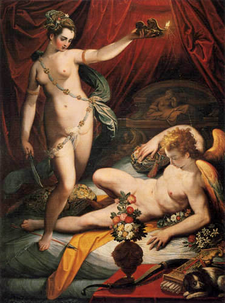
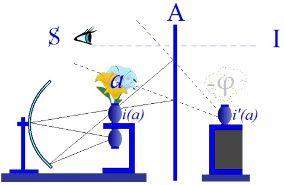

# Leçon 16 | 12 Avril 1961

<!-- source-url: http://staferla.free.fr/S8/S8 LE TRANSFERT.docx -->
<!-- seminar: s8 -->
<!-- lesson: 16 -->

<!-- id: s8-16-0001 -->

Ce n’est pas parce qu’on se divertit, en apparence, de ce qui est votre centre de soucis, *qu’on ne le retrouve pas à l’extrême périphérie* [^204]. C’est ce qui, je crois, m’est arrivé presque sans m’en apercevoir à la *Galerie* BORGHÈSE, dans l’endroit le plus inattendu.

<!-- id: s8-16-0002 -->

Mon expérience m’a toujours appris à regarder ce qui est près de l’ascenseur, qui est souvent significatif et *que l’on ne regarde jamais*. L’expérience transférée au musée de la *Galerie* BORGHÈSE - ce qui est tout à fait applicable à un musée - m’a fait tourner la tête au moment où on débouche de l’ascenseur grâce à quoi j’ai vu quelque chose à quoi on ne s’arrête vraiment jamais, je n’en avais jamais entendu parler par personne : un tableau d’un nommé ZUCCHI.

<!-- id: s8-16-0003 -->

<!-- id: s8-16-0004 -->

Ce n’est pas un peintre très connu, encore qu’il ne soit pas tout à fait passé hors des mailles du filet de la critique. C’est ce qu’on appelle un *maniériste* de la première période du maniérisme, au xvième siècle. Ses dates sont à peu près 1547-1590, et il s’agit d’un tableau qui s’appelle « PSICHE *sorprende* AMORE », c’est-à-dire ÉROS. C’est la scène classique de PSYCHÉ élevant sa petite lampe sur ÉROS qui est depuis un moment son amant nocturne et jamais aperçu. Vous avez sans doute, je pense, une petite idée de ce drame classique.

<!-- id: s8-16-0005 -->

PSYCHÉ favorisée par cet extraordinaire amour, celui d’ÉROS lui-même, jouit d’un bonheur qui pourrait être parfait si ne lui venait pas la curiosité de voir de qui il s’agit. Ce n’est pas qu’elle ne soit pas avertie par son amant lui-même de ne chercher jamais, en aucun cas, à projeter sur lui la lumière, sans qu’il puisse lui dire quelle sanction en résulterait, mais l’insistance est extrême. Néanmoins PSYCHÉ ne peut faire autrement que d’y venir et, à ce moment-là, *les malheurs de* PSYCHÉ commencent. Je ne peux pas tous vous les raconter. Je veux d’abord vous montrer ce dont il s’agit, puisque aussi bien c’est là ce qui est important de ma *découverte*.

<!-- id: s8-16-0006 -->

Je m’en suis procuré deux exemplaires et je vais les faire circuler. J’ai doublé ces deux reproductions par une esquisse due à un peintre dont même ceux qui ne connaissent pas mes relations familiales reconnaîtront - j’espère - le trait, et qui a bien voulu ce matin, *vu le désir qu’il avait de me complaire*, faire pour vous cette esquisse qui me permettra dans la démonstration de pointer ce dont il s’agit[^205].

<!-- id: s8-16-0007 -->

Vous voyez que l’esquisse correspond dans ses lignes significatives tout au moins à ce que je suis en train de faire circuler. Je ne sais pas si vous avez déjà vu traiter ce sujet d’ÉROS et PSYCHÉ de cette façon. Pour moi ce qui m’a frappé - cela a été traité d’une façon innombrable, aussi bien en sculpture qu’en peinture - c’est que je n’ai jamais vu PSYCHÉ apparaître, dans l’œuvre d’art, armée comme elle l’est dans ce tableau, de ce qui est représenté là très vivement comme un petit *tranchoir* et qui est précisément un *cimeterre* sur ce tableau. D’autre part, vous remarquerez que ce qui est ici significativement projeté sous la forme de la fleur, et du bouquet dont elle fait partie, et du vase aussi où elle s’insère, vous verrez dans le tableau d’une façon très intense, très marquée, que cette fleur est à proprement parler le *centre* mental visuel du tableau.

<!-- id: s8-16-0008 -->

Elle l’est de la façon suivante, ce bouquet et cette fleur viennent au premier plan et sont vus, comme on dit, à « *contre-jour* », c’est-à-dire que cela fait ici une masse noire : c’est elle qui est traitée d’une façon telle qu’elle donne à ce tableau son caractère qu’on peut appeler maniériste. C’est dessiné d’une façon extrêmement raffinée. Il y aurait certainement des choses à dire sur les fleurs qui sont choisies dans ce bouquet. Mais autour du bouquet, venant derrière le bouquet, rayonne une lumière intense qui porte sur les cuisses allongées et le ventre du personnage qui *symbolise* ÉROS. Et il est véritablement impossible de ne pas *voir* ici, désigné de la façon la plus précise et comme par l’index le plus appuyé, l’organe qui doit *anatomiquement* se dissimuler derrière cette masse de fleurs, à savoir très précisément *le phallus* de l’ÉROS.

<!-- id: s8-16-0009 -->

Ceci est vu dans la manière même du tableau, accentué d’une façon telle qu’il ne peut s’agir là d’une interprétation analytique, qu’il ne peut pas ne pas se présenter à la représentation le fil qui unit cette menace du tranchoir, à ce qui nous est ici à proprement parler désigné. Pour tout dire, la chose vaut la peine d’être *désignée* justement en ceci qu’elle n’est pas fréquente dans l’art.

<!-- id: s8-16-0010 -->

<!-- id: s8-16-0011 -->

On nous a beaucoup représenté JUDITH et HOLOPHERNE, mais quand même HOLOPHERNE ça n’est pas ce dont il s’agit ici, c’est « *couper cabèche* » \[couper la tête\]. De sorte que le geste même, tendu, de l’autre bras qui porte la lampe est quelque chose qui est également fait pour nous évoquer toutes les résonances justement de ce type d’autre tableau auquel je fais allusion. La lampe est là suspendue au-dessus de la tête de l’ÉROS. Vous savez que dans l’histoire c’est une goutte d’huile renversée dans un mouvement un peu brusque de PSYCHÉ, fort émue, qui vient réveiller l’ÉROS lui causant d’ailleurs, l’histoire nous le précise, une blessure dont il souffre longtemps.

<!-- id: s8-16-0012 -->

Observons, pour être *minutieux*, que dans la reproduction que vous avez sous les yeux, vous pouvez voir qu’il y a quelque chose en effet comme un trait lumineux qui part de la lampe pour aller vers l’épaule de l’ÉROS. Néanmoins l’obliquité de ce trait ne laisse pas penser qu’il s’agisse de cette larme d’huile, mais d’un trait de lumière. Certains penseront qu’il y a là quelque chose qui est en effet bien remarquable et qui représente de la part de l’artiste une innovation, et donc une intention que nous pourrions lui attribuer *sans ambiguïté*, je veux dire celle de représenter la menace de *la castration* appliquée dans la conjoncture amoureuse.

<!-- id: s8-16-0013 -->

Je crois qu’il faudrait vite en revenir si nous avancions dans ce sens. Il faudrait vite en revenir par ceci que je vous ai pointé \- point pointé encore, mais qui je l’espère est déjà venu à l’esprit de quelques-uns - c’est que cette histoire ne nous est connue, malgré le rayonnement qu’elle a eu dans l’histoire de l’art que par un seul texte : le texte d’APULÉE dans [*L’âne d’or*](http://fr.wikisource.org/wiki/L%E2%80%99%C3%82ne_d%E2%80%99or_ou_les_M%C3%A9tamorphoses). J’espère, *pour votre plaisir*, que vous avez lu *[L’âne d’or](http://remacle.org/bloodwolf/apulee/table.htm),* c’est un texte, je dois dire, très exaltant \[Psyché : cf. *L'Ane d'Or* (IV, 28,1 - VI, 24,4)\].

<!-- id: s8-16-0014 -->

Si, comme on l’a toujours dit, certaines vérités sont incluses dans ce livre, je peux vous dire que sous une forme mythique et imagée ce sont de véritables secrets ésotériques et initiatiques, c’est une vérité empaquetée sous les aspects les plus chatoyants, pour ne pas dire les plus *chatouillants*, les plus *titillants*. Car dans cette apparence première, c’est à vrai dire quelque chose qui n’a pas encore été dépassé, fût-ce par les plus récentes productions qui ont fait ces dernières années en France notre régal dans le genre érotique le plus caractérisé, avec toute la nuance du sado-masochisme qui fait du roman érotique, le relief le plus commun.

<!-- id: s8-16-0015 -->

C’est en effet au milieu d’une horrible histoire d’enlèvement de jeune fille, accompagné des menaces les plus terrifiantes auxquelles elle se trouve exposée en compagnie de l’âne - celui qui parle à la première personne dans ce roman, c’est dans un intermède, une inclusion à l’intérieur de cette aventure d’un goût fort relevé, *qu’une vieille*, pour distraire un instant la fille en question, la kidnappée, la victime, lui raconte longuement l’histoire d’ÉROS et de PSYCHÉ.

<!-- id: s8-16-0016 -->

Or ce que je vous ai pointé tout à l’heure, c’est que c’est à la suite de l’insistance perfide de ses sœurs qui n’ont de cesse que de l’amener à tomber dans le piège, à violer les promesses qu’elle a faites à son amant divin, que PSYCHÉ succombe. Et le dernier moyen de ses sœurs est de suggérer qu’il s’agit d’un monstre épouvantable, d’un serpent de l’aspect le plus hideux, qu’assurément elle n’est pas sans courir avec lui quelque danger. À la suite de quoi le court-circuit mental se produit à savoir que, remarquant les recommandations, les interdits extrêmement insistants auxquels son interlocuteur nocturne recourt, lui impose en lui recommandant en aucun cas de violer son interdiction très sévère, de ne pas chercher à le voir, elle ne voit que trop bien coïncider cette recommandation avec ce que lui suggèrent ses sœurs. Et c’est là qu’elle franchit le pas fatal.

<!-- id: s8-16-0017 -->

Pour le franchir, étant donné ce qui lui est suggéré, ce qu’elle croit devoir trouver, elle s’arme. Et en ce sens nous pouvons dire...

<!-- id: s8-16-0018 -->

> malgré que l’histoire de l’art ne nous donne aucun autre témoignage à ma connaissance,
>
> je serais reconnaissant que quelqu’un maintenant, incité par mes remarques, m’apporte la preuve contraire 

<!-- id: s8-16-0019 -->

...que si PSYCHÉ a été représentée dans ce moment significatif comme armée, c’est bien du texte d’APULÉE que le maniériste en question, ZUCCHI, a donc emprunté ce qui fait l’*originalité* de la scène. Qu’est–ce à dire ?

<!-- id: s8-16-0020 -->

ZUCCHI nous représente cette scène dont l’histoire est fort répandue, à l’époque déjà. Elle est fort répandue pour toutes sortes de raisons. Si nous n’avons qu’*un seul témoignage littéraire*, nous en avons beaucoup dans l’ordre *des représentations plastiques et figuratives*. On dit par exemple que le groupe qui est au *Musée des Offices* de Florence représente un ÉROS avec une PSYCHÉ, cette fois tous deux ailés - vous pouvez remarquer que si ici l’ÉROS les a, PSYCHÉ : non - PSYCHÉ, elle, ailée d’ailes du papillon.

<!-- id: s8-16-0021 -->

Je possède par exemple des objets alexandrins où la PSYCHÉ est représentée sous divers aspects et fréquemment munie des ailes du papillon : les ailes du papillon dans cette occasion sont *le signe de l’immortalité de l’âme*. Le papillon étant depuis fort longtemps, étant donné les phases de la métamorphose qu’il subit, à savoir né d’abord à l’état de *chenille*, de larve, il s’enveloppe dans cette sorte de tombeau, de sarcophage, enveloppé d’une façon même qui va à rappeler la momie, où il séjourne jusqu’à reparaître au jour sous une *forme glorifiée,* la thématique du papillon, significative de l’immortalité de l’âme était apparue dès l’Antiquité, et pas seulement dans des religions diversement périphériques, mais aussi bien même, a été utilisée et l’est encore dans la religion chrétienne comme symbolique de l’immortalité de l’âme. Il est à vrai dire très difficile de dénier qu’il s’agisse de ce qu’on peut appeler *les malheurs ou les mésaventures de l’âme* dans cette histoire dont nous n’avons, je vous le dis, qu’*un texte mythologique* comme base, fondement de sa transmission dans l’Antiquité, le texte d’APULÉE.

<!-- id: s8-16-0022 -->

Dans ce texte d’APULÉE, quoi qu’en pensent des auteurs accentuant diversement les significations religieuses et spirituelles de la chose et qui, volontiers, trouveraient que dans APULÉE nous n’en trouvons qu’une forme ravalée, romanesque à proprement parler qui ne nous permet pas d’atteindre la portée originelle du mythe, malgré ces allégations, je crois au contraire que le texte d’APULÉE - si vous vous y reportez, vous vous en apercevrez - est au contraire extrêmement riche.

<!-- id: s8-16-0023 -->

Il l’est au sens que ce point dont il s’agit, celui qui est représenté ici dans ce moment par la peinture, n’est que le début de l’histoire, malgré que déjà nous ayons dans ce texte la phase antérieure de ce qu’on peut appeler non seulement le bonheur de PSYCHÉ, mais auparavant une première épreuve à savoir que PSYCHÉ est au départ considérée comme aussi belle que VÉNUS, et que c’est déjà par l’effet d’une première persécution des dieux qu’elle se trouve exposée au faîte d’un rocher - autre forme du mythe d’Andromède - à quelque chose qui doit la saisir, qui doit être un monstre, et qui se trouve dans le fait être ÉROS, auquel VÉNUS a donné la charge de la livrer à celui dont elle doit être victime[^206]. Mais lui, en somme, séduit par celle auprès de qui il se trouve être délégué des ordres cruels de sa *mère*, l’enlève et l’installe dans ce lieu de profond recel où elle jouit en somme du bonheur des dieux.

<!-- id: s8-16-0024 -->

L’histoire se terminerait là si la pauvre PSYCHÉ ne participait d’une autre nature que de la nature divine et ne montrait, entre autres faiblesses, les plus déplorables sentiments familiaux, c’est-à-dire qu’elle n’a de peine ni de cesse avant d’avoir obtenu de l’ÉROS, son époux inconnu, la permission de revoir ses sœurs - et vous voyez qu’ici l’histoire s’enchaîne. Donc, avant ce moment il y a une courte période, un court moment antérieur de l’histoire, mais toute l’histoire s’étend après. Je ne vais pas vous la raconter tout au long car cela sort de notre sujet.

<!-- id: s8-16-0025 -->

Ce que je veux simplement vous dire, c’est que quand Jacopo ZUCCHI nous produit ce petit chef-d’œuvre, elle n’était pas sans être connue, ni plus ni moins que du pinceau de RAPHAËL lui-même car, par exemple, vous savez ça, elle s’étale au plafond et aux murailles de ce charmant palais FARNÈSE. Ce sont des scènes aimables, presque trop aimables. Nous ne sommes plus, semble-t-il, en état de supporter une sorte de *joliesse* en quoi pour nous semble s’être dégradé ce qui a dû apparaître, la première fois que le type en surgissait du pinceau génial de RAPHAËL, comme d’une beauté surprenante. À la vérité, il faut toujours faire la part de ceci : c’est que, quand un certain prototype, une certaine forme apparaît, elle doit faire une impression complètement différente de ce que c’est quand elle a été non seulement des milliers de fois reproduite mais des milliers de fois imitée. Bref, ces peintures de RAPHAËL à la Farnésine, nous donnent un développement, scrupuleusement calqué sur le texte d’APULÉE, des mésaventures de PSYCHÉ.

<!-- id: s8-16-0026 -->

Pour que vous ne doutiez pas que *la* PSYCHÉ *n’est pas une femme, mais bien l’âme*, qu’il me suffise de vous dire que, par exemple, elle va recourir à DÉMÉTER qui est là présentifiée avec tous les instruments, toutes les armes de ses mystères - et c’est bien là, en effet, de l’initiation aux mystères d’[ELEUSIS](http://www.mediterranees.net/civilisation/religions/mysteres/eleusinia.html) qu’il s’agit - et qu’elle en est repoussée.

<!-- id: s8-16-0027 -->

La nommée DÉMÉTER désire avant tout ne pas se mettre mal avec sa belle-sœur VÉNUS. Et il ne s’agit que de ceci, c’est qu’en somme, la malheureuse âme, pour avoir chu et fait à l’origine un faux pas dont elle n’est même pas coupable \- car à l’origine *cette jalousie de* VÉNUS ne provient de rien d’autre que de ce qu’elle est considérée par VÉNUS comme une rivale - se trouve ballottée, repoussée de tous les secours, fût-ce des secours religieux eux-mêmes.

<!-- id: s8-16-0028 -->

Et on pourrait faire toute une menue phénoménologie de *l’âme malheureuse* comparée à celle de *la conscience* qualifiée du même nom. À propos de cette très jolie histoire de PSYCHÉ, il ne faut donc pas que nous nous y trompions, la thématique dont il s’agit ici n’est pas celle du couple. Il ne s’agit pas des rapports de l’homme et de la femme, il s’agit de quelque chose qui...

<!-- id: s8-16-0029 -->

> il n’y a à proprement parler qu’à savoir lire pour voir que ça n’est vraiment caché
>
> que d’être au premier plan et trop évident, comme dans *La lettre volée*

<!-- id: s8-16-0030 -->

...n’est rien d’autre que *les rapports de l’âme et du désir*. C’est en ceci que la composition - je ne crois pas forcer la chose en disant « *extrêmement saisissante* » - de ce tableau, peut être dite, pour nous, isoler d’une façon exemplaire *ce caractère sensible*, imagé par l’intensité de l’image qui est produite ici, isoler ce que pourrait être *une analyse structurale du mythe* d’APULÉE qui serait à faire.

<!-- id: s8-16-0031 -->

Vous en savez assez, je vous en ai assez dit concernant ce qu’est *une analyse structurale d’un mythe* pour que vous sachiez au moins que ça existe. Chez Claude LÉVI-STRAUSS on fait *l’analyse structurale* d’un certain nombre de mythes américains du Nord, je ne vois pas pourquoi on ne se livrerait pas à cette même analyse concernant la fable d’APULÉE. Bien sûr nous sommes \- chose curieuse - moins bien servis pour ces choses plus proches de nous que pour d’autres qui nous apparaissent plus éloignées quant aux sources, c’est à savoir que nous n’avons qu’une version de ce *mythe* en fin de compte : celle d’APULÉE.

<!-- id: s8-16-0032 -->

Mais il ne semble pas impossible, *à l’intérieur du mythe*, d’opérer dans un sens qui permette d’en mettre en évidence *un certain nombre* *de couples d’oppositions significatives*. À travers une telle analyse, je dirais, sans le secours du peintre, nous risquerions peut-être de laisser passer inaperçu le caractère vraiment primordial et original du temps, du temps le plus connu pourtant : aussi bien chacun sait que ce qui reste dans la mémoire collective du sens du mythe c’est bien ceci, c’est qu’ÉROS fuit et disparaît parce que la petite PSYCHÉ a été en somme trop *curieuse* et en plus *désobéissante*.

<!-- id: s8-16-0033 -->

Ce dont il s’agit, ce qui est *recelé*, ce qui est *caché* derrière ce temps connu du mythe et de l’histoire, ne serait - à en croire ce que nous révèle ici l’intuition du peintre - rien d’autre donc que ce moment décisif. Certes, ce n’est pas la première fois que nous le voyons apparaître dans *un mythe antique*, mais dont la valeur d’accent, le caractère crucial, le caractère pivot, a dû attendre en somme d’assez longs siècles pour - par FREUD - être mis au centre de *la thématique psychique.*

<!-- id: s8-16-0034 -->

Et c’est pour cela qu’il n’est pas inutile, ayant fait cette trouvaille, de vous en faire part, car en somme elle se trouve désigner... dans la menue image qui restera - du fait même du temps que je lui consacre ce matin - imprimée dans vos esprits ...elle se trouve illustrer ce que je ne peux aujourd’hui guère que désigner comme le point de concours de deux registres :

<!-- id: s8-16-0035 -->

- celui de *la dynamique instinctuelle* en tant que je vous ai appris à le considérer comme *marqué des effets du signifiant*, et permettre donc d’accentuer aussi à ce niveau comment le complexe de castration doit s’articuler, ne peut même s’articuler pleinement, qu’à considérer cette *dynamique instinctuelle* comme structurée par cette marque du signifiant,

<!-- id: s8-16-0036 -->

- et en même temps, c’est là la valeur de l’image, de nous montrer qu’il y a donc *une superposition ou une surimpression*, un centre commun, un sens vertical en ce point de production du *complexe de castration* dans lequel nous allons entrer maintenant.

<!-- id: s8-16-0037 -->

Car vous voyez que c’est là que je vous ai laissés la dernière fois, ayant pris la thématique du *désir* et de *la demande* dans l’ordre chronologique, mais en vous répétant à tout instant que cette *divergence*, ce *splitting,* cette différence entre *le désir* et *la demande* qui marque de son trait toutes les premières étapes de l’évolution libidinale, est déterminée par l’action *nachträglich,* par *quelque chose* de *rétroactif* venant d’un certain point où le paradoxe *du désir* et *de la demande* apparaît avec son minimum d’éclat, et qui est vraiment celui du stade génital, pour autant que là-même, *désir* et *demande*, semble-t-il, devraient pouvoir du moins s’y distinguer.

<!-- id: s8-16-0038 -->

Ils sont marqués de *ce trait de division, d’éclatement* qui, pour des analystes - considérez-le bien - doit être encore, si vous lisez les auteurs, un problème, je veux dire une question, *une énigme*, plus encore évitée que résolue et qui s’appelle « *le complexe de castration* ». Grâce à cette image, il faut que vous voyiez que *le complexe de castration*, dans sa structure, dans sa dynamique instinctuelle est centré d’une façon telle qu’il recoupe exactement celui que nous pouvons appeler le point de la naissance de l’âme.

<!-- id: s8-16-0039 -->

Car en fin de compte si le mythe de PSYCHÉ a un sens, c’est ceci : que PSYCHÉ ne commence à vivre comme PSYCHÉ...

<!-- id: s8-16-0040 -->

> non pas simplement comme pourvue d’un don initial extraordinaire, celui d’être égale à VÉNUS, ni non plus
>
> d’une faveur masquée et inconnue, celle en somme d’un bonheur infini et insondable, ...mais en tant que PSYCHÉ, *en tant que sujet d’un pathos qui est à proprement parler celui de l’âme*, à ce même moment où justement le désir qui l’a comblée va la fuir, va se dérober, c’est à partir de ce moment que commencent les aventures de PSYCHÉ.

<!-- id: s8-16-0041 -->

Je vous l’ai dit un jour : « *c’est tous les jours la naissance de* VÉNUS », et comme nous le dit le mythe, lui platonicien, c’est donc de ce fait aussi *tous les jours la conception d’*ÉROS. Mais *la naissance de l’âme c’est*, dans l’universel et dans le particulier, pour tous et pour chacun, *un moment historique*. Et c’est à partir de ce moment que se développe dans l’histoire la dramatique qui est celle à laquelle nous avons affaire dans toutes ses conséquences.

<!-- id: s8-16-0042 -->

En fin de compte, on peut dire que si l’analyse avec FREUD, a été droit à ce point, je dirai que si le message freudien s’est *terminé* sur cette *articulation* - voyez *Analyse finie et infinie -* c’est qu’il y a un dernier terme - la chose est proprement articulée dans ce texte - où l’on arrive, quand on arrive à réduire chez le sujet toutes les avenues de sa *résurgence*, de sa *reviviscence*, des *répétitions inconscientes*, quand nous sommes arrivés à les faire converger vers *ce roc* - le terme est dans le texte - du *complexe de castration* : *le complexe de castration chez l’homme comme chez la femme*, le terme *penisneid* n’est entre autres dans ce texte que l’épinglage du *complexe de castration* comme tel. C’est autour de ce *complexe de castration* et comme - si je puis dire - repartant de ce point, que nous devons remettre à l’épreuve tout ce qui a pu d’une certaine façon être découvert à partir de ce point de butée.

<!-- id: s8-16-0043 -->

Car, qu’il s’agisse de la mise en valeur de l’effet tout à fait décisif et primordial de ce qui ressortit aux instances du savoir par exemple, ou encore de la mise en fonction de ce qu’on appelle « *l’agressivité du sadisme primordial* », ou encore de ce qu’on a articulé dans les différents développements qui sont possibles autour de la notion de « *l’objet* », de sa décomposition et de son approfondissement, de cette relation, jusqu’à mettre en valeur la notion des bons et des mauvais objets primordiaux, tout ceci ne peut se resituer dans une juste perspective que si nous ressaisissons, d’une façon divergente, à partir de quoi ceci a effectivement divergé, repartant de ce point jusqu’à un certain degré insoutenable par son paradoxe, qui est celui du *complexe de castration*. Une image comme celle que je prends soin aujourd’hui, de produire devant vous est en quelque sorte d’*incarner* ce que je veux dire en parlant du paradoxe du *complexe de castration*.

<!-- id: s8-16-0044 -->

En effet, si toute la divergence qui a pu nous sembler jusqu’à présent - dans les différentes phases que nous avons étudiées - motivée par la discordance, la distinction de ce qui fait l’objet de la demande - que ce soit dans le stade oral : la demande du sujet, comme au stade anal : la demande de l’autre - avec ce qui dans l’Autre est à la place du désir, qui serait dans le cas de PSYCHÉ jusqu’à un certain point *masqué, voilé* encore que secrètement aperçu par le sujet archaïque, infantile, est-ce qu’il ne semblerait pas que ce qu’on peut massivement appeler la troisième phase, qu’on appelle couramment sous le nom de « la phase génitale », c’est cette conjonction du désir en tant qu’il peut être intéressé dans quelque demande que ce soit du sujet, n’est-ce pas à proprement parler ce qui doit trouver son répondant, son identique dans le désir de l’Autre ?

<!-- id: s8-16-0045 -->

S’il y a un point où le désir se présente comme désir, c’est bien là où justement la première accentuation de FREUD a été faite pour nous le situer, c’est-à-dire au niveau du désir sexuel révélé dans sa consistance réelle et non plus d’une façon contaminée, déplacée, condensée, métaphorique.

<!-- id: s8-16-0046 -->

Il ne s’agit plus de la sexualisation de quelque autre fonction, c’est de la fonction sexuelle elle-même qu’il s’agit. Pour vous faire mesurer le paradoxe qu’il s’agit d’épingler, je cherchais ce matin un exemple pour incarner l’embarras où sont les psychanalystes en ce qui concerne la phénoménologie de ce stade génital, je suis tombé sur un article de MONCHY sur le « *castration complex »* dans l’*International Journal* [^207].

<!-- id: s8-16-0047 -->

À quoi un analyste, qui en somme se réintéresse de nos jours - car il n’y en a pas beaucoup - au *complexe de castration,* est-il amené pour l’expliquer ? Eh bien, à quelque chose que je vous donne en mille. Je vais vous le résumer très brièvement. Le paradoxe bien sûr ne peut manquer de vous frapper que sans la révélation de la pulsion génitale, il soit obligatoirement marqué de ce *splitting* qui consiste dans le *complexe de castration* comme tel, le *Trieb* est pour lui quelque chose d’instinctuel.

<!-- id: s8-16-0048 -->

Il s’agit de quelqu’un qui part avec un certain bagage - VON UEXKÜLL et LORENZ - il nous parle au début de son article de ce qu’on appelle les *releaser mecanisms (congenital reaction schemes),* ce qui nous évoque le fait que chez les petits oiseaux qui n’ont jamais été soumis à aucune expérience il suffit de faire se projeter *l’ombre* identique à celle *d’un hawk, d’un faucon*, pour provoquer tous les réflexes de la terreur. Bref, l’imagerie du leurre, comme s’exprime en français l’auteur de cet article qui écrit en anglais : « *l’attrape* ». Les choses sont toutes simples, « *l’attrape* » primitive doit être cherchée dans la phase orale. Le réflexe de la morsure, c’est à savoir que puisque l’enfant peut avoir *les fameux fantasmes sadiques* qui aboutissent à la section de l’objet, entre tous précieux, du mamelon de la mère, c’est là qu’est à chercher l’origine de ce qui dans la phase ultérieure génitale ira se manifester par le transfert des *fantasmes* *de fellatio,* comme cette possibilité de priver, de blesser, de mutiler le partenaire du désir sexuel sous la forme de son organe.

<!-- id: s8-16-0049 -->

Et voici pourquoi - non pas votre fille est muette - mais pourquoi la phase génitale est marquée du signe possible de la castration. Le caractère d’une telle *référence*, d’une telle *explication* est évidemment significatif de cette sorte de renversement qui s’est opéré et qui a fait progressivement mettre, sous le registre des pulsions primaires, des pulsions qui deviennent, il faut le dire, de plus en plus hypothétiques à mesure qu’on les fait se reculer dans le fond originel, qui en fin de compte, aboutissent à une accentuation de la thématique constitutionnelle, je ne sais quoi d’inné dans l’agressivité primordiale. C’est assurément assez significatif de l’orientation présente de la pensée analytique.

<!-- id: s8-16-0050 -->

Est-ce que nous n’épelons pas correctement les choses en nous arrêtant à ceci que l’expérience, je veux dire les problèmes que soulève pour nous l’expérience, en quelque sorte nous propose vraiment communément.

<!-- id: s8-16-0051 -->

Déjà, j’ai fait état devant vous de ce qui sous la plume de JONES s’est articulé, dans un certain besoin d’expliquer *le complexe de castration*, dans la notion de l’ἀϕάνι*σ*ις \[aphanisis\]*,* terme grec commun mis à l’ordre du jour dans l’articulation du discours analytique de FREUD, et qui veut dire *disparition*. Il s’agit de la disparition du désir et de ceci que ce dont il s’agirait dans *le complexe de castration* serait, chez le sujet, la crainte soulevée par la disparition du désir.

<!-- id: s8-16-0052 -->

Ceux qui suivent mon enseignement depuis assez longtemps ne peuvent pas - j’espère - ne pas se souvenir... en tout cas ceux qui ne s’en souviennent pas peuvent se reporter aux excellents résumés qu’en a faits LEFEBVRE PONTALIS[^208] ...que je l’ai déjà poussé en avant en disant que s’il y a là une perspective, il y a tout de même un singulier renversement dans l’articulation du problème, un renversement que les faits cliniques nous permettent de pointer.

<!-- id: s8-16-0053 -->

C’est pour cela que j’ai longtemps analysé devant vous, fait la critique du fameux rêve d’Ella SHARPE[^209] qui est précisément ce que mon séminaire a analysé en sa dernière séance. Ce rêve d’Ella SHARPE tourne tout entier autour de la thématique du *phallus*. Je vous prie de vous reporter à ce résumé parce qu’on ne peut pas se répéter et que les choses qui sont là sont absolument essentielles.

<!-- id: s8-16-0054 -->

Le sens de ce dont il s’agit dans l’occasion est ceci que j’ai pointé c’est que, loin que la crainte de l’*aphanisis* se projette si l’on peut dire dans l’image du *complexe de castration*, c’est au contraire la nécessité, *la détermination du mécanisme signifiant* qui, dans *le complexe de castration*, dans la plupart des cas pousse le sujet, non pas du tout à craindre l’*aphanisis* mais au contraire à se réfugier dans l’*aphanisis,* à mettre son désir dans sa poche. Parce que ce que nous révèle l’expérience analytique, c’est que *quelque chose est plus précieux que le désir lui-même : d’en garder le symbole qui est le phallus*. C’est cela le problème qui nous est proposé.

<!-- id: s8-16-0055 -->

J’espère que vous avez bien remarqué ce tableau. Ces fleurs qui sont là devant le sexe de l’ÉROS, elles ne sont justement point si marquées d’une telle abondance pour qu’on ne puisse voir que justement derrière il n’y a rien. Il n’y a littéralement pas la place au moindre sexe, de sorte que ce que PSYCHÉ est là sur le point de trancher littéralement est déjà disparu du réel.

<!-- id: s8-16-0056 -->

Et d’ailleurs si quelque chose frappe, comme opposé à *la bonne forme*, à la belle forme humaine de cette femme effectivement divine là dans cette image, c’est le caractère extraordinairement composite de l’image de l’ÉROS. Cette figure est d’enfant, mais le corps a quelque chose de *michelangelesque* : musclé et déjà presque *qui commence à* se marquer, pour ne pas dire *s’avachir*, sans parler des ailes.

<!-- id: s8-16-0057 -->

Chacun sait *qu’on a discuté longtemps du sexe des anges*. Si l’on a discuté aussi longtemps, c’est probablement qu’on ne savait pas très bien où s’arrêter. Quoi qu’il en soit l’apôtre nous dit que, quelles que soient *les joies de la résurrection des corps*, une fois venu le festin céleste, il ne sera plus rien fait au ciel dans l’ordre sexuel, ni actif, ni passif [^210].

<!-- id: s8-16-0058 -->

De sorte que ce dont il s’agit, ce qui est concentré dans cette image, c’est bien ce quelque chose qui est le centre du *parado* *du complexe de castration*. C’est que, loin que *le désir de l’Autre*, en tant qu’il est abordé au niveau de la phase génitale, puisse être \- soit en fait - jamais accepté dans ce que j’appellerai *son rythme* qui est en même temps sa fuyance pour ce qui est de l’enfant, à savoir que c’est un désir encore fragile, que c’est un désir incertain, prématuré, anticipé, ceci nous masque en fin de compte ce dont il s’agit, que c’est tout simplement la réalité à quelque niveau que ce soit du désir sexuel à quoi, si l’on peut dire, n’est pas adaptée l’organisation psychique en tant qu’elle est psychique.

<!-- id: s8-16-0059 -->

C’est que *l’organe n’est pris, apporté, abordé, que transformé en signifiant,* et *que pour être transformé en signifiant*, c’est en cela qu’il est tranché. Et relisez tout ce que je vous ai appris à lire au niveau du petit Hans. Vous verrez qu’il ne s’agit que de ça :

<!-- id: s8-16-0060 -->

- Est-il enraciné ?

<!-- id: s8-16-0061 -->

- Est-il amovible ?

<!-- id: s8-16-0062 -->

- À la fin il s’arrange : il est dévissable, on le dévisse et on peut en remettre d’autres.

<!-- id: s8-16-0063 -->

C’est donc de cela qu’il s’agit. Ce qu’il y a de *saisissant*, c’est que ce qui nous est montré, c’est le rapport de cette *élision* grâce à quoi il n’est plus ici que le signe même que je dis : *le signe de l’absence*. Car ce que je vous ai appris est ceci : c’est que si Φ, *le phallus* comme signifiant a une place, c’est celle très précisément de suppléer au point, à ce niveau précis où dans l’Autre disparaît la signifiance, où l’Autre est constitué par ceci qu’il y a quelque part un *signifiant manquant*.

<!-- id: s8-16-0064 -->

D’où la valeur privilégiée de ce signifiant qu’on peut écrire sans doute, mais qu’on ne peut écrire qu’entre parenthèses, en disant bien justement ceci : c’est qu’il est *le signifiant du point où le signifiant manque* S(A). Et c’est pour ça qu’il peut devenir identique au sujet lui-même, au point où nous pouvons l’écrire comme sujet barré : S, au seul point où, *nous analystes*, nous pouvons placer un sujet comme tel - *pour nous analystes*- c’est-à-dire pour autant que nous sommes liés aux effets qui résultent de la cohérence du signifiant comme tel quand un être vivant s’en fait l’agent et le support. Nous voyons ceci, c’est que dès lors le sujet n’a plus d’autre efficace possible - si nous admettons cette détermination, cette surdétermination, comme nous l’appelons - que du signifiant qui l’escamote. Et c’est pourquoi le sujet est inconscient.

<!-- id: s8-16-0065 -->

Si l’on peut même parler - et même là où l’on n’est pas analyste - de *double symbolisation*, c’est en ce sens que la nature du *symbole* est telle, que deux registres en découlent nécessairement : celui qui est lié à la chaîne symbolique, et celui qui est lié au trouble, à la pagaille que le sujet a été capable d’y apporter, car c’est là qu’en fin de compte le sujet se situe de la façon la plus certaine. En d’autres termes, *le sujet n’affirme la dimension de la vérité comme originale qu’au moment où il se sert du signifiant pour mentir*.

<!-- id: s8-16-0066 -->

Ce rapport donc du *phallus* avec l’effet du *signifiant*, le fait *que le phallus comme signifiant* - et ceci veut dire *donc transposé à une toute* *autre fonction que sa fonction organique -* soit justement ce qu’il s’agit de considérer comme *centre* de toute appréhension cohérente de ce dont il s’agit *dans le complexe de castration*, c’est cela sur quoi je voulais ce matin attirer votre attention. Mais encore je voulais ouvrir, non pas d’une façon encore articulée et rationnelle, mais d’une façon imagée, ce que nous apporterons la prochaine fois et qui est, si je puis dire, génialement *représenté* grâce au *maniérisme* même de l’artiste qui a fait ce tableau.

<!-- id: s8-16-0067 -->

C’est ceci : est-ce qu’il vous est venu à l’esprit qu’à mettre devant *ce phallus comme manquant* - et comme tel, *porté à la majeure signifiance* - ce vase de fleurs, ZUCCHI se trouve avoir anticipé de trois siècles et demi - et je vous assure jusqu’à ces derniers jours : *à mon insu* - l’image même dont je me suis servi sous la forme de ce que j’ai appelé « *l’illusion du vase renversé* » pour articuler toute la dialectique des rapports du *moi idéal* et de l’*idéal du moi*. J’ai dit ceci *il y a fort longtemps*, mais j’ai repris *entièrement* la chose dans un article qui doit bientôt paraître[^211]. Ce rapport de l’objet, comme objet du désir, comme objet partiel avec toute l’accommodation nécessaire, c’est ceci dont j’ai essayé d’*articuler* les différentes pièces dans ce système que j’ai appelé « *l’illusion du vase renversé* » dans une expérience de physique amusante.

<!-- id: s8-16-0068 -->

<!-- id: s8-16-0069 -->

L’important c’est de projeter dans votre esprit cette idée que le problème de la castration comme marque, en tant qu’elle marque, en tant que c’est elle qui est le centre de toute l’économie du désir telle que l’analyse l’a développée, est étroitement lié à cet autre problème qui est celui de *comment l’Autre*...

<!-- id: s8-16-0070 -->

- en tant qu’il est le lieu de la parole,

<!-- id: s8-16-0071 -->

- en tant qu’il est le sujet de plein droit,

<!-- id: s8-16-0072 -->

- en tant qu’il est celui avec qui nous avons à la limite *les relations de la bonne et de la mauvaise foi* ...peut et *doit devenir quelque chose* d’exactement analogue à ce qui peut se rencontrer dans *l’objet le plus inerte, à savoir l’objet du désir : (a)*. C’est de cette tension, c’est de *cette dénivellation*, de *cette chute*, chute de niveau fondamentale qui devient la régulation essentielle de tout ce qui chez l’homme est problématique du désir, c’est de ceci qu’il s’agit dans l’analyse.

<!-- id: s8-16-0073 -->

Je pense la prochaine fois pouvoir vous l’articuler de la façon la plus exemplaire. J’ai terminé ce que je vous ai enseigné à propos du rêve d’Ella SHARPE par ces mots : « *Ce phallus* »...

<!-- id: s8-16-0074 -->

> disais-je, parlant d’un sujet pris dans la situation névrotique la plus exemplaire
>
> pour nous en tant qu’elle était celle de l’*aphanisis* déterminée par le *complexe de castration*

<!-- id: s8-16-0075 -->

…« *Ce phallus, il l’est et il ne l’est pas* ». Cet intervalle : être et ne pas l’être,  la langue permet de l’apercevoir dans une formule où glisse le verbe être : « *il n’est pas sans l’avoir* ».

<!-- id: s8-16-0076 -->

*C’est autour de cette assomption subjective entre l’être et l’avoir que joue la réalité de la castration.*  *En effet le phallus -* écrivais-je alors - *a une fonction d’équivalence dans le rapport à l’objet : c’est en proportion d’un certain renoncement au phallus que le sujet* *entre en possession de la pluralité des objets qui caractérise le monde humain* . ».

<!-- id: s8-16-0077 -->

Dans une formule analogue, on pourrait dire que la femme est sans l’avoir, ce qui peut être vécu fort péniblement sous la forme du *penisneid* [^212], *mais ce qui* - j’ajoute ceci au texte - *est aussi une grande force*. C’est ce dont le patient d’Ella SHARPE ne consent pas à s’apercevoir : il « *met à l’abri* » le signifiant *phallus*. Et je concluais :

<!-- id: s8-16-0078 -->

« *Sans doute y a-t-il plus névrosant que la peur de perdre le phallus, c’est de ne pas vouloir que l’Autre soit châtré.* ».

<!-- id: s8-16-0079 -->

Mais aujourd’hui, après que nous ayons parcouru la dialectique du transfert dans *Le Banquet,* je vais vous proposer une autre formule, qui est celle-ci : si ce désir de l’Autre est essentiellement séparé de nous par cette marque du signifiant, est-ce que vous ne comprenez pas maintenant pourquoi ALCIBIADE, ayant perçu qu’il y a dans SOCRATE *le secret du désir*, demande… d’une façon presque impulsive, d’une impulsion qui est à l’origine de toutes les fausses voies de la névrose ou de la perversion, ce désir de SOCRATE, dont il sait par ailleurs qu’il existe puisque c’est là-dessus qu’il se fonde …à le voir comme *signe*.

<!-- id: s8-16-0080 -->

C’est aussi bien pourquoi SOCRATE refuse. Car ce n’est là bien entendu qu’un court-circuit : *voir le désir produit comme signe, n’est pas* *pour autant pouvoir accéder au cheminement par où le désir est pris dans une certaine dépendance*, qui est ce qu’il s’agit de savoir. De sorte que vous voyez ici s’amorcer ce que je tente de vous montrer et de tracer comme chemin vers ce qui doit être *le désir de l’analyste*.

<!-- id: s8-16-0081 -->

Pour que l’analyste puisse avoir ce dont l’autre manque il faut qu’il ait la « *nescience* », *en tant que « nescience » il faut qu’il soit sous le mode* *de l’avoir*, qu’il ne soit pas lui aussi *sans l’avoir*, qu’il s’en faille que de rien qu’il ne soit aussi « *nescient* » que son sujet. En fait, il n’est pas sans avoir *un inconscient* lui aussi. Sans doute il est toujours au-delà de tout ce que le sujet sait, sans pouvoir le lui dire. Il ne peut que lui faire *signe* : « *être ce qui représente quelque chose pour quelqu’un* », c’est la définition du *signe*.

<!-- id: s8-16-0082 -->

N’y ayant en somme rien d’autre qui l’empêche de l’être ce désir du sujet, que justement de l’avoir, l’analyste est condamné à « *la fausse surprise* ». Mais dites-vous bien qu’il n’est efficace qu’à s’offrir à la « *vraie* » qui est intransmissible, dont il ne peut donner qu’un *signe*. « *Représenter quelque chose pour quelqu’un* »*, c’est justement là ce qui est à rompre*, car le *signe* qui est à donner est *le signe du manque* *de signifiant*. C’est, comme vous le savez, le seul *signe* qui n’est pas supporté parce que *c’est celui qui provoque la plus indicible angoisse*.

<!-- id: s8-16-0083 -->

C’est pourtant le seul qui puisse faire accéder l’autre à ce qui est de la nature de l’inconscient, à la « *science sans conscience* » dont vous comprendrez peut-être aujourd’hui, devant cette image, en quel sens, non pas négatif mais positif, RABELAIS dit qu’elle est la « *ruine de l’âme* »[^213].

<!-- id: s8-16-0084 -->

**  **

## Notes

[^204]: C’est le retour des vacances de Pâques, des notes témoignent en préambule : « Ces quelques jours passés à Rome, j’ai eu le sentiment de l’urbis,

    la capitale (en parlant de Rome), Paris n’est qu’une ville périphérique.

[^205]: Il s’agit d’André Masson, mais il semblerait que cette esquisse n’ait pas été publiée.

[^206]: Vénus le fait dans les termes suivants : « ...*venge celle qui t’a donné le jour, que cette vierge s’éprenne d’un ardent amour pour le dernier des hommes, un homme que,*

    *dans son rang, son patrimoine et sa personne même, la fortune ait maudit, si abject en un mot que, dans le monde entier, il ne trouve pas son pareil en misère*... »

[^207]: R. de Monchy : *Oral Comporients of the Castration-Complex*, 17ème congrès de l’I.P.A., Amsterdam, 1952, paru dans *Bulletin de l’I.P.A.* n° 103, vol. XXXIII, p. 450.

[^208]: Cf. « Le désir et son interprétation », *Bulletin de Psychologie,* n° 172, t. XIII (6), du 20 janvier 1960.

[^209]: Cf. « *Analyse d’un rêve unique* », in Ella Sharpe : *Dream Analysis,* The Hogarth Press ; rêve commenté par Lacan à son séminaire *Le désir et son interprétation* au cours

    des séances des 14, 21, 28 janvier et 4 et 11 février 1959. Cf. la traduction de M.L. Lauth in « *Ella Sharpe lue par Lacan* », éd. Hermann, 2007.

[^210]: Cette phrase peut renvoyer à plusieurs passages du Nouveau Testament, notamment : saint Paul, Épître aux Galates 323-29 ; Évangile selon saint Matthieu,

    La résurrection des morts 22-23-33.

[^211]: C’est le 24 février 1954 que Lacan a introduit à son séminaire « *l’expérience du bouquet renversé* », reprise au Colloque de Royaumont (7-1958), rédigée (4-1960)

    et publiée dans *La Psychanalyse,* « Remarque... *»,* PUF, 1961, vol. 6, pp. 111-147.

[^212]: Dans le texte de Lefebvre-Pontalis : « ce *qui se traduit psychologiquement par le* Pénisneid. »

[^213]: Rabelais, Pantagruel, VIII
