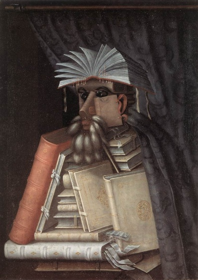
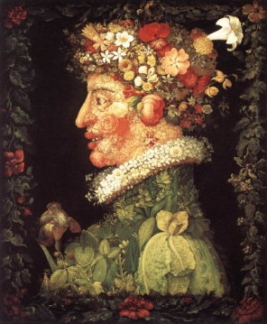
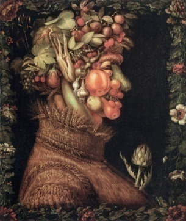
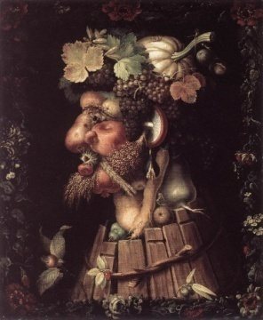
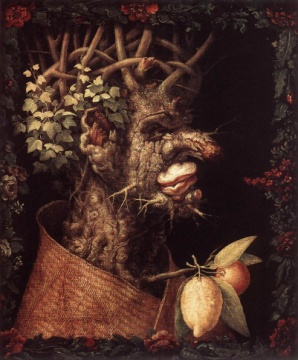
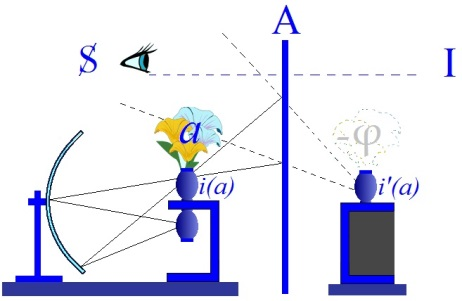
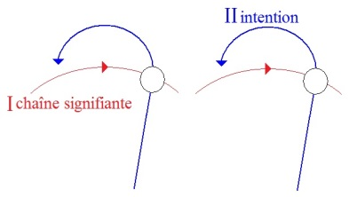
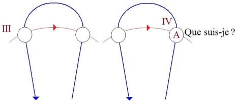
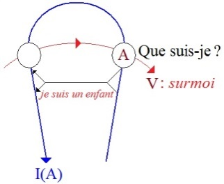

# Leçon 17 | 19 Avril 1961

<!-- source-url: http://staferla.free.fr/S8/S8 LE TRANSFERT.docx -->
<!-- seminar: s8 -->
<!-- lesson: 17 -->

<!-- id: s8-17-0001 -->

Je reprends devant vous mon discours *difficile*, de plus en plus *difficile* de par la visée de ce discours.

<!-- id: s8-17-0002 -->

Dire par exemple que je vous amène aujourd’hui en terrain inconnu serait inapproprié, car si je commence aujourd’hui à vous mener sur un terrain, c’est forcément que depuis le début j’ai déjà commencé. Parler d’autre part de « *terrain inconnu* » quand il s’agit du nôtre, de celui qui s’appelle l’inconscient, est encore plus inapproprié car ce dont il s’agit, et ce qui fait la difficulté de ce discours, c’est que *je ne peux rien vous en dire qui ne doive prendre tout son poids justement de ce que je n’en dis pas*.

<!-- id: s8-17-0003 -->

Ce n’est pas qu’il ne faille pas tout dire, c’est que pour dire avec justesse nous ne pouvons pas tout dire, même de ce que nous pourrions formuler, car il y a déjà quelque chose dans la formule qui - vous le verrez, nous le saisissons à tout instant - précipite dans l’*imaginaire* ce dont il s’agit, qui est essentiellement ce qui se passe du fait que le sujet humain est en proie comme tel *au symbole*.

<!-- id: s8-17-0004 -->

Au point où nous en sommes parvenus, cet «  *au symbole*  », attention, faut-il le mettre *au singulier* ou *au pluriel* ? Au singulier assurément, pour autant que celui que j’ai introduit la dernière fois est à proprement parler, comme tel, *un symbole innommable* - nous allons voir pourquoi et en quoi - symbole Φ \[grand phi\], justement ce point où je dois reprendre aujourd’hui mon discours pour vous montrer en quoi il nous est indispensable pour comprendre l’incidence du *complexe de castration* dans le ressort du transfert.

<!-- id: s8-17-0005 -->

Il y a une ambiguïté fondamentale entre : *phallus symbole* Φ, et *phallus imaginaire* ϕ, intéressé concrètement dans l’économie psychique, là où nous le rencontrons, où nous l’avons d’abord rencontré éminemment, là où le névrosé le vit d’une façon qui représente son mode particulier de manœuvrer, d’opérer avec cette difficulté radicale, fondamentale que j’essaye d’articuler devant vous par l’usage que je donne à ce symbole Φ. *Ce symbole* Φ, la dernière fois et déjà bien des fois avant, *je l’ai désigné* brièvement, je veux dire d’une façon rapide, abrégée, *comme symbole qui répond à la place où se produit le manque de signifiant.*

<!-- id: s8-17-0006 -->

Si de nouveau j’ai dévoilé dès le début de cette séance cette image qui nous a servi la dernière fois de support pour introduire les paradoxes, les antinomies, liés à ces glissements divers, si subtils, si difficiles à retenir dans leurs divers temps et pourtant indispensables à soutenir si nous voulons comprendre ce dont il s’agit dans *le complexe de castration* et qui sont les déplacements et les absences, et les niveaux et les substitutions où intervient ce que l’expérience analytique nous montre de plus en plus.

<!-- id: s8-17-0007 -->

*Ce phallus dans ses formules multiples, quasi ubiquistes*, vous le voyez dans l’expérience, sinon ressurgir, du moins - vous ne pouvez pas le nier - dans les écrits théoriques, à tout instant être réinvoqué sous les formes les plus diverses, et jusqu’au terme dernier des investigations les plus primitives, sur ce qui se passe dans les premières pulsations de l’âme. Le *phallus* que vous voyez au dernier terme identifié avec, par exemple, la force d’agressivité primitive en tant qu’il est le plus mauvais objet rencontré au terme dans le sein de la mère et qu’il est aussi bien l’objet le plus nocif. Pourquoi cette *ubiquité* ? Ce n’est pas moi qui ici l’introduis, qui la suggère, elle est partout manifeste dans les écrits de toute tentative poursuivie à formuler sur un plan tant ancien que nouveau, renouvelé, de *la technique analytique*.

<!-- id: s8-17-0008 -->

Eh bien, essayons d’y mettre de l’ordre et de voir pourquoi il est nécessaire que j’insiste sur cette ambiguïté, ou sur cette polarité si vous voulez, polarité à deux termes extrêmes : *le symbolique* et *l’imaginaire*, concernant la fonction du *signifiant phallus*. Je dis « *signifiant* » pour autant qu’il est utilisé comme tel mais quand j’en parle, quand je l’ai introduit tout à l’heure, j’ai dit le *symbole* *phallus* et, vous verrez, c’est peut-être en effet le seul *signifiant* qui mérite, dans notre registre et d’une *façon absolue*, le titre de *symbole*.

<!-- id: s8-17-0009 -->

J’ai donc redévoilé cette image - qui assurément n’est pas simple reproduction de celle, originale, de l’artiste - du tableau d’où je suis parti comme l’image à proprement parler exemplaire, qui m’a paru chargée dans sa composition de toutes ces sortes de richesses qu’un certain art de la peinture peut produire et dont j’ai examiné le ressort maniériste. Je vais le faire repasser rapidement, ne serait-ce que pour ceux qui n’ont pas pu le voir. Je veux simplement, et à titre - je dirai de complément, bien marquer, pour ceux qui peut-être ne l’ont pu entendre d’une façon précise, ce que j’entends souligner de l’importance ici de ce que j’appellerai l’application maniériste. Vous allez voir que l’application doit s’employer aussi bien dans le *sens propre* que dans le *sens figuré*.

<!-- id: s8-17-0010 -->

Ce n’est pas moi, mais des études déjà existantes, qui ont fait le rapprochement dans ce tableau de l’usage qui est donné de la présence du *bouquet de fleurs* là au premier plan : il recouvre ce qui est à recouvrir, dont je vous ai dit que c’était moins encore *le phallus* menacé de l’ÉROS - ici surpris et découvert par une initiative de la question de la PSYCHÉ : « *de lui qu’en est*-*il ?* » - que *<u>ce</u>* qu’ici le bouquet recouvre : le point précis d’une *présence absente*, d’une *absence présentifiée*.

<!-- id: s8-17-0011 -->

L’histoire technique de la peinture de l’époque nous sollicite, non par ma voie mais par la voie de *critiques* qui sont partis de prémisses tout à fait différentes de celles qui à l’occasion pourraient ici me guider. Ils ont souligné la parenté qu’il y a, du fait même du *collaborateur* probable qui est celui qui a fait spécialement les fleurs. Certaines choses nous indiquent *que ce n’est pas, probablement,* *le même artiste* qui a opéré dans les deux parties du tableau et que, frère ou cousin de l’artiste, c’est un autre, *Francesco au lieu de Jacopo,* qui en raison de son habileté technique, a été sollicité d’être celui qui est venu faire ce morceau de bravoure des fleurs dans leur vase à la place où il convenait.

<!-- id: s8-17-0012 -->

Ceci est rapproché par les critiques de quelque chose que j’espère qu’un certain nombre d’entre vous connaissent, à savoir la technique d’ARCIMBOLDO qui a été portée, il y a quelques mois, à la connaissance de ceux qui s’informent un peu des divers retours à l’actualité, de faces quelque fois élidées, voilées ou oubliées de l’histoire de l’art. Cet ARCIMBOLDO se distingue par cette technique singulière qui a porté son dernier surgeon dans l’œuvre par exemple de mon vieil ami Salvador DALI, qui consiste en ce que DALI a appelé « *le dessin paranoïaque* ».

<!-- id: s8-17-0013 -->

Dans le cas d’ARCIMBOLDO, c’est de représenter la figure par exemple du bibliothécaire - il opérait en grande partie à la cour de ce fameux RODOLPHE II de Bohême qui a laissé aussi bien d’autres traces dans la tradition de *l’objet rare -* de RODOLPHE II par un échafaudage savant des ustensiles premiers de la fonction du bibliothécaire, à savoir une certaine façon de disposer des livres de façon que l’image d’une face, d’un visage, soit ici beaucoup plus que suggérée, vraiment imposée.

<!-- id: s8-17-0014 -->

Aussi bien le thème symbolique d’une saison incarnée sous la forme d’un visage humain sera matérialisé par tous les fruits de cette saison dont l’assemblage lui-même sera réalisé de telle sorte que *la suggestion d’un visage* s’imposera également dans la forme réalisée.

<!-- id: s8-17-0015 -->

    

<!-- id: s8-17-0016 -->

Bref cette réalisation de ce qui dans sa *figure essentielle* se présente comme l’image humaine, *l’image d’un autre*, sera par le procédé maniériste réalisée par la coalescence, la combinaison, *l’accumulation d’un amas d’objets* dont le total sera chargé de représenter ce qui dès lors se manifeste à la fois *comme substance et comme illusion*, puisque *en même temps que l’apparence de l’image humaine* *est soutenue, quelque chose* est suggéré qui *s’imagine dans le désassemblement des objets* qui, de présenter en quelque sorte *la fonction du masque*, montrent en même temps la problématique de ce *masque*.

<!-- id: s8-17-0017 -->

<!-- id: s8-17-0018 -->

Ce à quoi nous avons en somme toujours affaire chaque fois que nous voyons entrer en jeu cette fonction si essentielle de *la personne*, pour autant que nous la voyons tout le temps au premier plan dans l’économie de la présence humaine, c’est ceci : s’il y a besoin de « *persona *», c’est que derrière, peut-être, toute forme se dérobe et s’évanouit[^214].

<!-- id: s8-17-0019 -->

Et assurément, si *c’est d’un rassemblement complexe que la persona résulte*, c’est bien en effet là que gît à la fois *le leurre et la fragilité* de sa subsistance et que, derrière, nous ne savons rien de ce qui peut se soutenir, car une *apparence redoublée* s’impose à nous ou se suggère essentiellement comme *redoublement d’apparence*, c’est-à-dire quelque chose qui laisse à son interrogation un vide : la question de savoir ce qu’il y a derrière au dernier terme.

<!-- id: s8-17-0020 -->

C’est donc bien dans ce registre que s’affirme, dans la composition du tableau, le mode sous lequel se maintient la question, car c’est ça que nous devons maintenir, soutenir devant notre esprit essentiellement à savoir : *de quoi il s’agit dans l’acte de* PSYCHÉ ?

<!-- id: s8-17-0021 -->

PSYCHÉ, comblée, s’interroge sur ce à quoi elle a affaire et c’est ce moment, cet instant précis, privilégié, qu’a retenu ZUCCHI...

<!-- id: s8-17-0022 -->

> peut être bien au-delà de ce que lui-même pouvait, ou eût pu en articuler dans un discours : il y a un discours
>
> sur les dieux antiques de ce personnage, j’ai pris soin de m’y reporter, sans grande illusion,
>
> il n’y a pas grand-chose à tirer de ce discours, mais l’œuvre parle suffisamment elle-même ...que l’artiste a dans cette image saisi ce quelque chose d’instantané que j’ai appelé la dernière fois ce moment d’apparition, de naissance de la PSYCHÉ, cette sorte d’échange des pouvoirs qui fait qu’elle prend corps, et avec tout ce cortège de *malheurs* qui seront les siens pour qu’elle boucle une boucle, *pour qu’elle retrouve dans cet instant ce quelque chose*, qui pour elle, va disparaître l’instant après, précisément ce qu’elle a voulu saisir, ce qu’elle a voulu dévoiler : *la figure du désir*.

<!-- id: s8-17-0023 -->

L’introduction du symbole Φ \[grand phi\] comme tel, qu’est-ce qui la justifie, puisque je le donne comme ce qui vient à la place du signifiant manquant ? Que veut dire qu’un signifiant manque ? Combien de fois vous ai-je dit qu’une fois donnée la batterie des signifiants, au-delà d’un certain minimum qui reste à déterminer, dont je vous ai dit qu’à la limite 4 *doivent pouvoir suffire* *à toutes les significations* comme nous l’apprend JAKOBSON \[Cf. α,β,γ,δ, in « le séminaire sur *La lettre volée* » : *Écrits, p.* 11\], il n’y a pas de langue, si primitive qu’elle soit, où tout finalement ne puisse s’exprimer, à ceci près bien sûr que, comme on dit dans le proverbe vaudois : « *Tout est possible à l’homme, ce qu’il ne peut pas faire, il le laisse* », que ce qui ne pourra pas s’exprimer dans ladite langue, eh bien tout simplement, ceci *ne sera pas senti*. Ceci ne sera pas *senti, subjectivé*[^215], si *subjectiver c’est prendre place dans un sujet, valable pour un autre sujet* c’est-à-dire dépasser ce point le plus radical où l’idée même de communication n’est pas possible.

<!-- id: s8-17-0024 -->

Toute batterie signifiante peut toujours « *tout dire* » puisque ce qu’elle ne peut pas dire ne signifiera rien au lieu de l’Autre, et que tout ce qui *signifie* pour nous, se passe toujours au lieu de l’Autre. Pour que quelque chose *signifie*, il faut qu’il soit traductible au lieu de l’Autre. Supposez une langue - je vous l’ai déjà fait remarquer - qui n’a pas une *telle figure*, eh bien voilà : elle ne l’exprimera pas, mais elle le signifiera tout de même, par exemple par le processus du « *doit* » ou de « *l’avoir* ». Et c’est d’ailleurs ce qui se passe en fait car - je n’ai pas besoin de revenir là-dessus, je vous l’ai fait remarquer - c’est comme ça qu’en français et en anglais on exprime le futur :

<!-- id: s8-17-0025 -->

- *cantare habeo,* je *chanter-ai*, tu *chanter-as*, *c’est le verbe avoir qui se décline*, j’entends originellement, de la façon la plus attestée.

<!-- id: s8-17-0026 -->

- *I shall sing,* c’est aussi, d’une façon détournée, exprimer ce que l’anglais n’a pas, c’est-à-dire le futur.

<!-- id: s8-17-0027 -->

Il n’y a pas de signifiant qui manque. *À quel moment commence à apparaître possiblement le manque de signifiant ?* À cette dimension propre qui est subjective et qui s’appelle la question. Je vous rappelle que j’ai fait, en son temps, suffisamment état du *caractère fondamental, essentiel, de l’apparition chez l’enfant* - bien connue déjà, relevée bien sûr par l’observation la plus coutumière - *de la question comme telle.* *Ce moment si particulièrement embarrassant*, à cause du caractère de ces questions qui n’est pas n’importe lequel. Celui où l’enfant qui sait s’*affairer*, se *débrouiller*, avec le signifiant s’introduit à cette dimension qui lui fait poser à ses parents les questions les plus importunes, celles dont chacun sait qu’elles provoquent le plus grand désarroi et, à la vérité, des réponses presque nécessairement impotentes :

<!-- id: s8-17-0028 -->

- Qu’est-ce que c’est courir ?

<!-- id: s8-17-0029 -->

- Qu’est-ce que c’est taper du pied ?

<!-- id: s8-17-0030 -->

- Qu’est-ce que c’est un imbécile ?

<!-- id: s8-17-0031 -->

Ce qui nous rend si impropres à satisfaire à ces questions, qui nous force à y répondre d’une façon si spécialement inepte, comme si nous ne savions pas nous-mêmes :

<!-- id: s8-17-0032 -->

- que « *courir, c’est marcher très vite* » c’est vraiment gâcher le travail,

<!-- id: s8-17-0033 -->

- que « *taper du pied, c’est être en colère* » c’est vraiment dire une absurdité.

<!-- id: s8-17-0034 -->

- Je n’insiste pas sur la définition que nous pouvons donner de l’imbécile.

<!-- id: s8-17-0035 -->

Il est bien clair que ce dont il s’agit à ce moment c’est du recul du sujet par rapport à l’usage du signifiant lui-même. Et que la passion des mots, de ce que veut dire qu’il y ait des mots : qu’on parle et qu’on désigne une chose si proche de celle dont il s’agit par ce quelque chose d’énigmatique qui s’appelle un *mot*, un *terme*, un *phonème*, c’est bien de cela qu’il s’agit.

<!-- id: s8-17-0036 -->

L’incapacité sentie à ce moment par l’enfant est - formulée dans la question - d’attaquer le signifiant comme tel au moment où son action est déjà marquée sur tout, indélébile. Tout ce qui y sera comme question, dans la suite historique de sa méditation pseudo-philosophique, n’ira en fin de compte qu’à déchoir, car quand il en sera au « *que suis-je ?* » il en sera beaucoup moins loin, sauf bien sûr à être analyste. Mais s’il ne l’est pas - *il n’est pas en son pouvoir de l’être depuis si longtemps -* quand il en sera à se poser la question « *que suis-je ?* », il ne peut pas voir qu’en se mettant justement en question sous cette forme, il se voile, il ne s’aperçoit pas que c’est franchir l’étape du doute sur l’être que de se demander ce qu’on est, car, à simplement formuler ainsi sa question, il donne en plein - à ceci près qu’il ne s’en aperçoit pas - dans *la métaphore*.

<!-- id: s8-17-0037 -->

Et c’est bien tout de même la moindre des choses dont nous devons - nous analystes - nous souvenir pour lui éviter de renouveler cette *antique erreur*, toujours menaçante à son innocence sous toutes ses formes, et l’empêcher de se répondre, *même avec notre autorité :* « *je suis un enfant* », par exemple. Car bien sûr c’est là la nouvelle réponse que lui donnera l’endoctrination de forme, renouvelée de la répression[^216] psychologisante, et avec ça - dans le même paquet, et sans qu’il s’en aperçoive - le mythe de l’adulte qui, lui, ne serait plus un enfant, soi-disant. Ainsi faisant de nouveau refoisonner cette sorte de morale d’une prétendue réalité où en fait il se laisse mener par le bout du nez par toutes sortes d’*escroqueries sociales*.

<!-- id: s8-17-0038 -->

Aussi bien, le « *je suis un enfant* », n’avons-nous pas attendu l’analyse, ni le freudisme, pour que la formule s’en introduise comme corset destiné à faire se tenir droit ce qui, à quelque titre, se trouve dans une position un peu biscornue. Dès que sous l’artiste il y a un enfant, et que ce sont les droits de l’enfant qu’il représente auprès des gens, bien entendu considérés comme sérieux, qui ne sont pas enfants : je vous l’ai dit l’année dernière dans les leçons sur *L’éthique de la psychanalyse,* cette tradition date du début de la *période romantique*, elle commence à peu près au moment de COLERIDGE en Angleterre - pour le situer dans une tradition - et je ne vois pas pourquoi nous nous chargerions d’en prendre le relais[^217].

<!-- id: s8-17-0039 -->

Ce que je veux ici vous faire saisir, c’est ce qui se passe au niveau inférieur du *graphe*. Ce à quoi, lors des « *journées provinciales* », j’ai fait allusion quand j’ai voulu attirer votre attention sur ceci : que tel qu’est construit le double recoupement de ces deux faisceaux, de ces deux flèches, il est fait pour attirer notre attention sur ceci : que *simultanéité*, ai-je dit, *n’est point synchronie*. C’est-à-dire que, à supposer se développer corrélativement, simultanément, les deux tenseurs, les deux vecteurs, dont il s’agit : celui de *l’intention* \[II\], et celui de *la chaîne signifiante* \[I\].

<!-- id: s8-17-0040 -->

<!-- id: s8-17-0041 -->

Vous voyez que ce qui se produit ici \[II\] comme *inchoation* [^218] *de ce recoupement, de cette succession* qui consistera dans la succession des différents éléments phonématiques par exemple du signifiant, ceci se développe fort loin avant de rencontrer la ligne sur laquelle ce qui est appelé à l’être - à savoir l’intention de signification ou le besoin même, si vous voulez, qui s’y recèle - prend sa place. Ce qui veut dire ceci : c’est que, quand ce double croisement se refera en fin de compte simultanément, car si le *nachträglich* signifie quelque chose, c’est que c’est *au même instant* - quand la phrase est finie - que le sens se dégage.

<!-- id: s8-17-0042 -->

<!-- id: s8-17-0043 -->

Au passage sans doute le choix s’est déjà fait, mais le sens ne se saisit que quand, *dans l’empilement successif,* les signifiants sont venus prendre place chacun à leur tour \[III\], et qu’ils se déroulent, ici si vous voulez, sous la forme inversée, « je suis un enfant » apparaissant sur la ligne signifiante dans l’ordre où se sont articulés ces éléments \[IV\]. Qu’est-ce qui se passe ? Il se passe que, quand le sens s’achève, quand ce qu’il y a de toujours *métaphorique* dans toute attribution : « *je ne suis rien d’autre que moi qui parle* », et actuellement « *je suis un enfant* ». De le dire, de l’affirmer réalise cette prise, cette qualification du sens grâce à quoi je me conçois dans un certain rapport avec des objets qui sont les objets infantiles. *Je me fais autre que je n’ai pu d’aucune façon me saisir d’abord* : je m’incarne, je me cristallise, je m’idéalise, je me fais *moi idéal*. Et cela en fin de compte, très directement : dans la suite, dans le procès de la simple *inchoation signifiante* comme telle, dans le fait d’avoir produit des signes capables de s’être référés à l’actualité de ma parole. Le départ est dans le « *je* » et le terme est dans l’*enfant*. Ce qui reste ici \[V\][^219] comme *séquelle* c’est quelque chose que je peux voir ou ne pas voir : *c’est l’énigme de la question elle-même*, c’est le « *que ?* » qui demande ici à être repris au niveau du grand A, à la suite.

<!-- id: s8-17-0044 -->

<!-- id: s8-17-0045 -->

De voir que la suite, *la séquelle* « *ce que je suis* » apparaît sous la forme où elle reste *comme question* : où elle est pour moi le point de visée, le point corrélatif où je me fonde comme *idéal du moi*, c’est-à-dire comme point

<!-- id: s8-17-0046 -->

- où la question a *pour moi* de l’importance,

<!-- id: s8-17-0047 -->

- où la question me *somme* dans la dimension *éthique*,

<!-- id: s8-17-0048 -->

- où elle donne cette forme qui est celle même que FREUD conjugue avec le *surmoi,*

<!-- id: s8-17-0049 -->

- et d’où le nom qui le qualifie d’une façon diversement légitime comme étant ce *quelque chose* qui s’embranche directement, *autant que je sache*, sur mon inchoation signifiante à savoir : un enfant.

<!-- id: s8-17-0050 -->

Mais qu’est-ce-à dire que cette réponse précipitée, prématurée, ce quelque chose qui fait qu’en somme j’élide toute l’opération qui s’est faite, centrale. Ce quelque chose qui fait précipiter le mot enfant, c’est l’évitement de la véritable réponse, qui doit commencer bien plus tôt qu’aucun terme de la phrase. La réponse au « *que suis-je ?* » n’est rien d’autre d’articulable, sous la même forme où je vous ai dit qu’aucune demande n’est supportée.

<!-- id: s8-17-0051 -->

Au « *que suis-je ?* » il n’y a pas d’autre réponse au niveau de l’Autre que « *laisse-toi être* ». Et toute précipitation donnée à cette réponse, quelle qu’elle soit dans l’ordre de la dignité : enfant ou adulte, n’est que le quelque chose où je fuis le sens de ce « *laisse-toi être* ». Il est donc clair que *c’est au niveau de l’Autre* et de ce que veut dire cette aventure au point dégradé où nous la saisissons, *c’est au niveau* de ce « *que ?* », qui n’est pas « *que suis-je ?* » mais que l’expérience analytique nous permet de dévoiler *au niveau de l’Autre*,

<!-- id: s8-17-0052 -->

- sous la forme de l’Autre,

<!-- id: s8-17-0053 -->

- sous la forme du « *que veux-tu ? *»,

<!-- id: s8-17-0054 -->

- sous la forme de ce qui seulement peut nous arrêter au point précis de ce dont il s’agit dans toute question formulée, à savoir ce que nous désirons en posant la question ...c’est là qu’elle doit être comprise et c’est là qu’intervient le manque de signifiant dont il s’agit dans le Φ du *phallus*.

<!-- id: s8-17-0055 -->

Nous le savons, ce que l’analyse nous a montré, a trouvé, c’est que ce à quoi le sujet a affaire, c’est à l’*objet du fantasme* en tant qu’il se présente comme seul capable de fixer un point privilégié : ce qu’il faut appeler avec *le principe du plaisir,* *une économie réglée par le niveau de la jouissance*. Ce que l’analyse nous apprend, c’est qu’à reporter la question au niveau du « *que veut-il, qu’est-ce que ça veut là-dedans ?* », ce que nous rencontrons est un monde de *signes hallucinés,* que l’épreuve de la réalité nous est présentée comme cette espèce de façon de goûter à la réalité de ces *signes* surgis en nous selon une suite nécessaire en quoi consiste précisément la dominance sur l’inconscient du *principe du plaisir*. Ce dont il s’agit donc, observons-le bien, c’est assurément dans *l’épreuve de réalité* de contrôler une présence réelle, mais une présence de *signes*.

<!-- id: s8-17-0056 -->

FREUD le souligne avec la plus extrême énergie. Il ne s’agit point dans l’épreuve de réalité de contrôler si nos représentations correspondent bien à un réel - nous savons depuis longtemps que nous n’y réussissons pas mieux que les philosophes - mais de contrôler que nos représentations sont bel et bien représentées, *Vorstellungsrepräsentanz*. Il s’agit de savoir si les *signes* sont bien là, mais en tant que *signes* - puisque ce sont des *signes -* de ce rapport à *autre chose*.

<!-- id: s8-17-0057 -->

Et c’est tout ce que veut dire ce que nous apporte l’articulation freudienne, *que la gravitation de notre inconscient se rapporte à un objet perdu* *qui n’est jamais que retrouvé, c’est-à-dire jamais re-trouvé. Il n’est jamais que signifié et ceci en raison même de la chaîne du principe du plaisir.* L’objet véritable, authentique dont il s’agit quand nous parlons d’objet, n’est aucunement saisi, transmissible, échangeable. Il est à l’horizon de ce autour de quoi gravitent nos fantasmes et c’est pourtant avec cela que nous devons faire des objets qui, eux, soient échangeables.

<!-- id: s8-17-0058 -->

Mais l’affaire est très loin d’être en voie de s’arranger. Je veux dire que je vous ai assez souligné l’année dernière ce dont il s’agit dans ce qu’on appelle la morale utilitaire[^220]. Il s’agit assurément de quelque chose de tout à fait fondamental dans la reconnaissance des objets qu’on peut appeler constitués par « *le marché des objets* ». Ce sont des objets qui peuvent servir à tous, et en ce sens, la morale dite utilitaire est plus que fondée : il n’y en a pas d’autre. Et c’est bien justement parce qu’il n’y en a pas d’autre, que les difficultés qu’elle présenterait - soi-disant - sont en fait parfaitement résolues.

<!-- id: s8-17-0059 -->

Il est bien clair que les « *utilitaristes* » ont tout à fait raison en disant que, chaque fois que nous avons affaire à *quelque chose qui peut s’échanger avec nos semblables,* *la règle en est l’utilité*, non pas la nôtre mais *la possibilité d’usage, l’utilité pour tous et pour le plus grand nombre*. C’est bien cela qui fait *la béance* de ce dont il s’agit, dans la constitution de cet objet privilégié qui surgit dans le fantasme, avec toute espèce d’objet dit du *monde socialisé*, du *monde de la conformité*.

<!-- id: s8-17-0060 -->

Le *monde de la conformité* est déjà cohérent d’une organisation universelle du discours. Il n’y a pas d’ *utilitarisme* sans une « *théorie des fictions* ». Prétendre d’aucune façon qu’un recours est possible à un objet naturel, prétendre réduire même les distances où se soutiennent les objets de l’accord commun, c’est introduire une confusion, un *mythe* de plus dans la problématique de la réalité.

<!-- id: s8-17-0061 -->

L’*objet* dont il s’agit dans *la relation d’objet analytique* est un objet que nous devons repérer, faire surgir, situer, au point le plus radical où se pose la question du sujet quant à son rapport au signifiant. Le rapport au signifiant est en effet tel que si nous n’avons affaire, au niveau de la chaîne inconsciente, qu’à des signes, et si c’est d’une chaîne de signes qu’il s’agit, la conséquence est qu’il n’y a aucun arrêt dans le renvoi de chacun de ces signes à celui qui lui succède. Car le propre de la communication par signes est de faire de cet autre même à qui je m’adresse - pour l’inciter à viser de la même façon que moi l’objet auquel se rapporte ce signe - *un signe*.

<!-- id: s8-17-0062 -->

L’imposition du signifiant au sujet le fige dans la position propre du signifiant. Ce dont il s’agit, c’est bien de trouver *le garant* de cette chaîne, qui de transfert de sens *de signe en signe*, doit s’arrêter quelque part, ce qui nous donne le signe que nous sommes en droit d’opérer avec des signes. C’est là que surgit le privilège de Φ dans tous les signifiants. Et peut-être vous paraîtra-t-il trop simple, presque enfantin de souligner ce dont il s’agit à l’occasion de ce signifiant-là.

<!-- id: s8-17-0063 -->

Ce signifiant toujours caché, toujours voilé, au point - mon Dieu - qu’on s’étonne, qu’on relève comme une particularité, presque une exorbitante entreprise d’en avoir, dans tel ou tel coin de la représentation, ou de l’art, représenté la forme. Il est plus que rare \- quoique bien sûr ceci existe - de le voir mis en jeu dans une chaîne hiéroglyphique, ou dans une peinture rupestre préhistorique.

<!-- id: s8-17-0064 -->

Ce phallus, dont nous ne pouvons pas dire qu’il ne joue pas même avant toute exploration analytique quelque rôle dans l’imagination humaine, il est donc de nos représentations fabriquées, faites signifiantes, le plus souvent élidé. Qu’est-ce à dire ? C’est qu’après tout, de tous les signes possibles, est-ce que ce n’est pas celui qui réunit en lui-même *le signe*, à savoir à la fois *le signe* et le moyen d’action et la présence même, du désir comme tel. C’est-à-dire qu’à le laisser venir au jour dans cette présence réelle, est-ce que ce n’est pas justement ce qui est de nature, non seulement à arrêter tout ce renvoi dans la chaîne des signes, mais même à les faire entrer dans je ne sais quelle *ombre de néant*.

<!-- id: s8-17-0065 -->

Du désir, il n’y a sans doute pas de signe plus sûr, à condition qu’il n’y ait plus rien que le désir. Entre ce signifiant du désir et toute la chaîne signifiante s’établit un rapport d’« *ou bien... ou bien* ». La PSYCHÉ était bienheureuse dans ce certain rapport avec ce qui n’était point un signifiant, ce qui était la réalité de son amour avec ÉROS. Mais voilà ! C’est PSYCHÉ et elle veut *savoir*.

<!-- id: s8-17-0066 -->

Elle se pose la question parce que le langage existe déjà et qu’on ne passe pas seulement sa vie à faire l’amour mais aussi à papoter avec ses sœurs. À papoter avec ses sœurs elle veut *posséder son bonheur*. Ce n’est pas une chose si simple. Une fois qu’on est entré dans l’ordre du langage, *posséder son bonheur* c’est pouvoir le montrer, c’est pouvoir en rendre compte, c’est arranger ses fleurs, c’est s’égaler à ses sœurs en montrant qu’elle a mieux qu’elles et pas seulement autre chose.

<!-- id: s8-17-0067 -->

Et c’est pour ça que PSYCHÉ surgit dans la nuit, avec sa lumière et aussi son petit tranchoir. Elle n’aura absolument rien à trancher \- je vous l’ai dit, parce que c’est déjà fait. Elle n’aura rien à couper, si je puis dire, *si ce n’est* - ce qu’elle ferait bien de faire au plus tôt - *le courant*, à savoir qu’elle ne voit rien d’autre qu’un *grand éblouissement de lumière* et que ce qui va se produire c’est, bien contre son gré, un retour prompt aux ténèbres dont elle ferait mieux de reprendre l’initiative avant que son objet se perde définitivement, qu’ÉROS en reste malade et pour longtemps, et ne doive se retrouver qu’à la suite d’une longue chaîne d’épreuves. L’important dans ce tableau, ce qui l’est pour nous :

<!-- id: s8-17-0068 -->

<!-- id: s8-17-0069 -->

c’est que c’est PSYCHÉ qui est éclairée et, comme je vous l’enseigne depuis longtemps concernant la forme gracile de la féminité à la limite du pubère et de l’impubère, *c’est elle qui*, pour nous dans la représentation, *apparaît comme l’image phallique*. Et du même coup est incarné que ça n’est pas la femme ni l’homme qui, au dernier terme, sont le support de l’action *castratrice*, c’est cette *image* \[phallique\] elle-même, en tant qu’elle est reflétée, qu’elle est reflétée sur la forme narcissique du corps.

<!-- id: s8-17-0070 -->

C’est en tant que *le rapport* - *innomé* parce que *innommable*, parce que *indicible - du sujet avec le signifiant pur du désir va se projeter sur l’organe*, localisable, précis, situable quelque part dans l’ensemble de l’édifice corporel, va entrer dans le conflit proprement *imaginaire* *de se voir soi-même comme privé ou non privé de cet appendice*, c’est dans ce deuxième temps imaginaire que va résider tout ce autour de quoi vont s’élaborer les effets symptomatiques du complexe de castration.Je ne puis ici que l’amorcer et que l’indiquer, je veux dire : rappeler, résumer ce que déjà j’ai touché pour vous de façon bien plus développée quand je vous ai parlé - maintes fois bien sûr – de ce qui fait notre objet c’est-à-dire des *névroses*.

<!-- id: s8-17-0071 -->

Qu’est-ce que *l’hystérique* fait ? Qu’est-ce que DORA fait au dernier terme ? Je vous ai appris à en suivre les cheminements et les détours dans les identifications complexes, dans le labyrinthe où elle se trouve confrontée - avec quoi ? - avec ce dans quoi FREUD lui-même trébuche et se perd. *Car ce qu’il appelle l’objet de son désir*, vous savez qu’il s’y trompe justement parce qu’il cherche la référence de DORA en tant qu’hystérique d’abord et avant tout dans le choix de son objet, d’un *objet* sans doute *petit(a)*. Et il est bien vrai que d’une certaine façon M. K. est *l’objet petit(a),* et après lui : FREUD lui-même, et qu’à la vérité c’est bien là le fantasme, pour autant que le fantasme est le support du désir. Mais DORA ne serait pas une *hystérique* si ce fantasme, elle s’en contentait. Elle vise *autre chose*, elle vise à *mieux*, elle vise *grand A*. Elle vise l’Autre absolu : Mme K. Je vous ai expliqué depuis longtemps que Mme K. est pour elle l’incarnation de cette question : « *Qu’est-ce qu’une femme ?* ».

<!-- id: s8-17-0072 -->

Et à cause de ceci, au niveau du fantasme, ce n’est pas S**◊***a*, *le rapport de fading, de vacillation*, qui caractérise le rapport du *sujet* à ce *(a)* qui se produit mais autre chose, parce qu’elle est hystérique, c’est un grand A comme tel, Grand A auquel elle *croit,* contrairement à une *paranoïaque*. « *Que suis-je ?* » a pour elle un sens qui n’est pas celui de tout à l’heure, des égarements *moraux* ni *philosophiques*, ça a un sens plein et absolu.

<!-- id: s8-17-0073 -->

Et elle ne peut pas faire qu’elle n’y rencontre, sans le savoir, *le signe* Φ parfaitement clos, toujours voilé *qui y répond*. Et c’est pour cela qu’elle recourt à toutes les formes qu’elle peut donner du substitut le plus proche, remarquez-le bien, à ce signe Φ. C’est à savoir que, si vous suivez les opérations de DORA ou de n’importe quelle autre *hystérique*, vous verrez *qu’il ne s’agit jamais pour elle que d’une sorte de jeu compliqué* par où elle peut, si je puis dire, subtiliser la situation en glissant là où il faut le ϕ \[petit phi\] du *phallus imaginaire*.

<!-- id: s8-17-0074 -->

C’est à savoir que : son père est *impuissant* avec Mme K. : eh bien qu’importe ! C’est elle qui fera la copule, elle paiera de sa personne, c’est elle qui soutiendra cette relation. Et puisque ça ne suffit pas encore, elle fera intervenir l’image substituée à elle - comme je vous l’ai dès longtemps montré et démontré - de M. K. qu’elle précipitera aux abîmes, qu’elle rejettera dans les ténèbres extérieures, au moment où cet animal lui dira juste la seule chose qu’il ne fallait pas lui dire : « *Ma femme n’est rien pour moi* », à savoir elle ne me fait pas bander. Si elle ne te fait pas bander, alors donc à quoi est-ce que tu sers ?

<!-- id: s8-17-0075 -->

Car tout ce dont il s’agit pour DORA, comme pour toute hystérique, c’est d’être la procureuse de ce signe sous la forme *imaginaire.* *Le dévouement de l’hystérique, sa passion de s’identifier avec tous les drames sentimentaux, d’être là, de soutenir en coulisse tout ce qui peut se passer de passionnant et qui n’est pourtant pas son affaire, c’est là qu’est le ressort, qu’est la ressource autour de quoi végète, prolifère tout son comportement.* Si elle échange son désir toujours contre ce signe - ne voyez pas ailleurs la raison de ce qu’on appelle sa « *mythomanie* » - c’est qu’il y a autre chose qu’elle préfère à son désir : *elle préfère que son désir soit insatisfait afin que l’Autre garde la clé de son mystère.*

<!-- id: s8-17-0076 -->

C’est la seule chose qui lui importe, et c’est pour cela que, s’identifiant au drame de l’amour, elle s’efforce, cet Autre, de le réanimer, de le réassurer, de le recompléter, de le réparer. En fin de compte c’est bien de cela qu’il nous faut nous défier : de toute idéologie réparatrice, de notre initiative de thérapeutes, de notre vocation analytique. Ce n’est certes pas la voie de l’*hystérique* qui nous est le plus facilement offerte, de sorte que ce n’est pas là non plus que la mise en garde peut prendre le plus d’importance.

<!-- id: s8-17-0077 -->

Il y en a une autre, c’est celle de *l’obsessionnel*, lequel, comme chacun sait, est beaucoup plus intelligent dans sa façon d’opérer. Si *la formule du fantasme hystérique* peut s’écrire ainsi : *a*/-ϕ **◊ A.** Soit : *(a)*, l’objet substitutif ou métaphorique, sur quelque chose qui est caché, à savoir -ϕ, sa propre *castration imaginaire* dans son rapport avec l’Autre.

<!-- id: s8-17-0078 -->

Je ne ferai aujourd’hui qu’introduire et vous amorcer *la formule différente du fantasme de l’obsessionnel*. Mais avant de l’écrire il faut que je vous fasse un certain nombre *de touches, de pointes, d’indications* qui vous mettent sur la voie. Nous savons quelle est la difficulté du maniement du symbole Φ dans sa forme dévoilée, c’est - je vous l’ai dit tout à l’heure - ce qu’il a d’*insupportable*, qui n’est autre que ceci : *c’est qu’il n’est pas simplement signe et signifiant, mais présence du désir, c’est la présence réelle du désir*.

<!-- id: s8-17-0079 -->

Je vous prie de saisir ce fil, cette indication que je vous donne, et que - vu l’heure - je ne pourrai laisser ici qu’à titre d’indication pour la reprendre la prochaine fois. C’est qu’au fond des *fantasmes*, des *symptômes*, de ces points d’émergence où nous voyions le labyrinthe hystérique en quelque sorte laisser glisser son masque, nous rencontrons quelque chose que j’appellerai « *l’insulte à la présence réelle* ». *L’obsessionnel*, lui aussi a affaire au *mystère du signifiant phallus* et pour lui aussi il s’agît de le rendre maniable.

<!-- id: s8-17-0080 -->

Quelque part un auteur[^221] - dont je devrai parler la prochaine fois, qui a approché d’une façon certainement pour nous instructive et fructueuse, si nous savons la critiquer, la fonction du *phallus* dans la *névrose obsessionnelle -* quelque part un auteur est entré pour la première fois dans ce rapport à propos d’une *névrose obsessionnelle féminine*. Il souligne certains fantasmes sacrilèges : la figure du Christ, voire son *phallus* lui-même, piétinés, d’où surgit pour elle une aura érotique perçue et avouée.

<!-- id: s8-17-0081 -->

Cet auteur se précipite aussitôt dans la thématique de l’agressivité, de l’envie du pénis et ceci malgré les protestations de la patiente. Est-ce que mille autres faits que je pourrais pour vous ici faire foisonner ne nous montrent pas qu’il convient de nous arrêter beaucoup plus à *la phénoménologie*, qui n’est pas n’importe laquelle, *de cette fantasmatisation que nous appelons*, trop brièvement, « *sacrilège* ». Nous nous rappellerons le fantasme de « *L’homme aux rats* », imaginant qu’au milieu de la nuit son père mort ressuscité vient frapper à la porte, et qu’il se montre à lui en train de se masturber : « *insulte* » ici aussi à *la présence réelle*.

<!-- id: s8-17-0082 -->

Ce que nous appelons dans *l’obsession* « *agressivité* » est présent toujours comme une agression précisément à cette forme d’apparition de l’Autre que j’ai appelée en d’autres temps « *phallophanie* »* *: l’Autre en tant justement qu’il peut se présenter comme *phallus*. *Frapper le phallus* dans l’Autre pour guérir la *castration symbolique*, *le frapper sur le plan imaginaire*, c’est la voie que choisit *l’obsessionnel* *pour tenter d’abolir la difficulté* que je désigne sous le nom de « *parasitisme du signifiant dans le sujet* », *de restituer - pour lui - au désir sa primauté*, mais *au prix d’une dégradation de l’Autre* qui le fait essentiellement fonction de quelque chose *qui est l’élision imaginaire du phallus*.

<!-- id: s8-17-0083 -->

C’est en tant que *l’obsessionnel* est en ce point précis de l’Autre où il est en état de doute, de suspension, de perte, d’ambivalence, d’ambiguïté fondamentale, que sa corrélation à l’objet, à un objet toujours métonymique - car pour lui, l’autre - c’est vrai – est essentiellement interchangeable - que sa relation à l’autre objet est essentiellement gouvernée par quelque chose qui a rapport à *la castration* et qui ici prend forme directement agressive : absence, dépréciation, rejet, refus du signe du désir de l’Autre comme tel, non pas *abolition* ni *destruction* du désir de l’Autre, mais rejet de ses *signes*.

<!-- id: s8-17-0084 -->

Et c’est de là que sort et se détermine cette *impossibilité* si particulière qui frappe la *manifestation* de son propre désir. Assurément lui montrer - comme l’analyste auquel je faisais allusion tout à l’heure le faisait et avec insistance - ce rapport avec *le phallus imaginaire* pour, si je puis dire, le familiariser avec son impasse, est quelque chose dont nous ne pouvons pas dire qu’il ne soit pas sur la voie de la solution des difficultés de *l’obsessionnel*.

<!-- id: s8-17-0085 -->

Mais comment ne pas retenir non plus au passage cette remarque qu’après tel moment, telle étape du *working through* de la castration imaginaire, le sujet - nous dit cet auteur - n’était nullement débarrassé de ses obsessions mais seulement de la culpabilité qui y était attenante.

<!-- id: s8-17-0086 -->

Bien sûr, nous pouvons nous dire que pour autant la question de cette voie thérapeutique est là jugée. À quoi ceci nous introduit-il ? À la fonction Φ du signifiant *phallus* comme signifiant dans le transfert lui même.

<!-- id: s8-17-0087 -->

Si la question de ce : « *comment l’analyste lui-même se situe par rapport à ce signifiant ?* » est ici essentielle c’est, d’ores et déjà, qu’elle nous est illustrée par les formes et par les impasses qu’une certaine thérapeutique orientée dans ce sens nous démontre.

<!-- id: s8-17-0088 -->

C’est ce que j’essayerai d’aborder pour vous la prochaine fois.

<!-- id: s8-17-0089 -->

**  **

## Notes

[^214]: Cf. Hegel, La Phénoménologie de l’Esprit, trad. Hyppolite, Aubier-Montaigne, 1941 (réimpression 1975) t..1, p.140-141 :

    « *Il est clair alors que derrière le rideau, comme on dit, qui doit recouvrir l'Intérieur, il n'y a rien à voir, à moins que nous ne pénétrions nous-mêmes derrière lui, tant pour qu’il y ait*

    *quelqu’un pour voir, que pour qu'il y ait quelque chose à voir.* » Et la note (55) qui est ajoutée : « *Le dedans des choses est une construction de l’esprit. Si nous essayons de soulever*

    *le voile qui recouvre le réel, nous n’y trouverons que nous-même, l’activité universalisatrice de l’esprit que nous appelons entendement.* »

[^215]: Cf. séminaire 1956-57 : *La relation d’objet*..., séance du 22-05 : *Des enfants au maillot* :

    « *O cités de la mer, je vois chez vous vos citoyens, hommes et femmes, les bras et les jambes étroitement ligotés dans de solides liens par des gens qui n'entendront point votre langage,*

    *et vous ne pourrez exhaler qu'entre vous, par des plaintes larmoyantes, des lamentations et des soupirs, vos douleurs et vos regrets de la liberté perdue. Car ceux-là qui vous ligotent*

    *ne comprendront pas votre langue, non plus que vous ne les comprendrez.* » (*Carnets de Léonard De Vinci, Codice Atlantico* 145. r. a. , Gallimard t. II, p. 400.)

[^216]: Toutes les notes à notre disposition donnent, comme la sténotypie : *dépression.*

[^217]: Cf. séance du 25-11-1959 où Lacan cite la formule : « *l’enfant est le père de l’homme* » de Wordsworth, reprise par Freud.

[^218]: Inchoation, substantif féminin : commencement.

[^219]: Les schémas sont établis par nous en fonction de notes et des *Écrits*, p. 808.

[^220]: Cf. séminaire 1959-60 : « *L’éthique de la psychanalyse* » séances des 18-11-59 et 23-03-60 à propos de Jeremy Bentham.

[^221]: M. Bouvet : « *Incidences thérapeutiques de la prise de conscience de l’envie du pénis dans la névrose obsessionnelle féminine* » [*Revue française de psychanalyse*., XIV, 1950.](http://gallica.bnf.fr/ark:/12148/bpt6k5444467v.image.langEN) p. 215.
