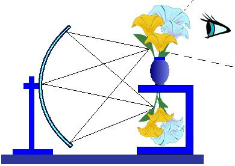
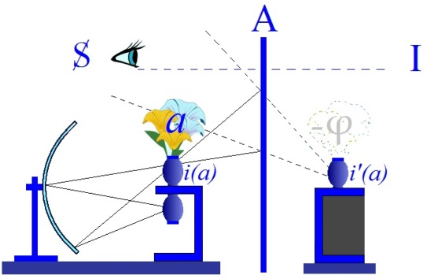

# Leçon 24 | 07 Juin 1961

<!-- source-url: http://staferla.free.fr/S8/S8 LE TRANSFERT.docx -->
<!-- seminar: s8 -->
<!-- lesson: 24 -->

<!-- id: s8-24-0001 -->

Nous allons poursuivre notre propos afin d’arriver à formuler notre but, peut-être *osé,* de cette année : formuler ce que l’analyste doit être vraiment pour répondre au transfert, ce qui implique aussi dans son avenir, la question de savoir *ce qu’il doit être*, *ce qu’il peut être*, et c’est pour ça que j’ai qualifié cette question d’*osée*.

<!-- id: s8-24-0002 -->

Vous avez vu se dessiner la dernière fois, à propos de la référence que je vous ai donnée de l’article de JEKELS et BERGLER, dans *Imago* année 1934, c’est-à-dire un an après qu’ils aient fait cette communication à la Société de Vienne, que nous étions amenés à poser la question dans les termes de la fonction du *narcissisme* concernant tout investissement libidinal possible.

<!-- id: s8-24-0003 -->

Vous savez, sur ce sujet du *narcissisme,* ce qui nous autorise à considérer ce domaine comme déjà ouvert, largement épousseté et d’une façon à rappeler les spécificités de la position qui est la nôtre, j’entends celle que je vous ai enseignée ici pour autant qu’ici elle est directement intéressée et que nous allons voir ce en quoi elle agrandit, elle généralise, celle qui est donnée habituellement ou reçue dans les écrits analytiques. Je veux dire qu’aussi bien en la généralisant elle permet de s’apercevoir de certains pièges inclus dans *la particularité* de la position ordinairement promue, articulée par les analystes.

<!-- id: s8-24-0004 -->

Je vous ai indiqué la dernière fois, à propos de l’*übertragung und Liebe* [^304], qu’on pouvait y trouver quelles étaient sinon toutes mais au moins certaines des impasses que la théorie du narcissisme risque d’amener pour ceux qui les articulent. On peut dire que toute l’œuvre d’un BALINT tourne tout entière autour de la question du prétendu « *auto-érotisme primordial* » et de la façon dont il est compatible à la fois avec les faits observés et avec le développement nécessaire appliqué au champ de l’expérience analytique.

<!-- id: s8-24-0005 -->

C’est pourquoi comme support je viens de vous faire au tableau ce petit schéma qui n’est pas nouveau, que vous trouverez en tout cas - *beaucoup plus soigné, parfait* - dans le prochain numéro de *La Psychanalyse*. Je n’ai pas ici voulu le faire dans tous les détails, je veux dire les détails qui en rappellent *la pertinence* dans le domaine optique, aussi bien parce que je ne suis pas spécialement porté à me fatiguer que parce que je crois que ça aurait rendu au total ce schéma plus confus.

<!-- id: s8-24-0006 -->

Simplement je vous rappelle cette vieille histoire dite de *l’illusion -* dans les expériences classiques de physique de niveau amusant *-* *du bouquet renversé* par quoi on fait apparaître, grâce à l’opération du miroir sphérique placé derrière un certain appareil, *l’image* - je le souligne - *réelle*, je veux dire que *ce n’est pas une image vue à travers l’espace, virtuelle, déployée à travers un miroir,* qui se dresse \- à condition de respecter certaines conditions d’éclairage tout autour, avec une précision suffisante *-* au-dessus d’un support, d’un bouquet qui se trouve en réalité dissimulé dans les dessous de ce support.

<!-- id: s8-24-0007 -->

<!-- id: s8-24-0008 -->

Ce sont des artifices qui sont employés aussi bien dans toutes sortes de tours que les illusionnistes présentent à l’occasion. On peut présenter de la même façon toute autre chose qu’un bouquet[^305]. Ici, c’est du vase lui-même que, pour des raisons qui sont de présentation et d’utilisation métaphorique, nous nous servons. Un vase qui est ici, sous ce support, en chair et en os, dans son authentique poterie :

<!-- id: s8-24-0009 -->

<!-- id: s8-24-0010 -->

Ce vase apparaîtra sous la forme d’une *image réelle* à condition que l’œil de l’observateur soit suffisamment éloigné, et d’autre part dans le champ bien sûr d’un cône qui représente un champ déterminé par l’opposition des lignes qui joignent les limites du miroir sphérique au foyer de ce miroir, point où peut se produire cette illusion. Si l’œil est suffisamment éloigné il s’ensuivra à la fois que ces minimes déplacements ne feront pas vaciller sensiblement l’image elle-même et permettront à ces minimes déplacements de les apprécier comme *quelque chose* dont en somme les contours se soutiennent seuls, avec la possibilité de la projection visuelle dans l’espace.

<!-- id: s8-24-0011 -->

Ce ne sera pas une image qui sera plate, mais qui donnera l’impression d’un certain volume. Ceci donc est utilisé pour quoi ? Pour construire un appareil qui, lui, a valeur métaphorique et qui est fondé sur ceci que : si nous supposons que l’œil de l’observateur, lié par des conditions topologiques, spatiales, à être en quelque sorte inclus dans le champ spatial qui est autour du point où la production de cette illusion est possible, s’il remplit ces conditions, il percevra néanmoins cette illusion tout en étant en un point qui lui rend impossible de l’apercevoir.

<!-- id: s8-24-0012 -->

Un artifice est possible pour cela, c’est de placer quelque part un miroir plan que nous appelons grand A en raison de l’utilisation métaphorique que nous lui donnerons par la suite, dans lequel il peut voir d’une façon réfléchie se produire la même illusion sous les espèces d’*une image virtuelle de cette image réelle*.

<!-- id: s8-24-0013 -->

<!-- id: s8-24-0014 -->

Autrement dit, il voit là se produire quelque chose qui est en somme - *sous la forme (réfléchie) d’une image virtuelle* - la même illusion qui se produirait pour lui s’il se plaçait dans l’espace réel, c’est-à-dire dans *un point symétrique, par rapport au miroir, de celui qu’il occupe*, et regardait ce qui se passe au foyer du miroir sphérique, c’est-à-dire le point où se produit l’illusion formée par *l’image réelle du vase* :

<!-- id: s8-24-0015 -->

<!-- id: s8-24-0016 -->

Et de même que dans l’expérience classique :

<!-- id: s8-24-0017 -->

<!-- id: s8-24-0018 -->

- pour autant que c’est de *l’illusion du bouquet* qu’il s’agit, le vase \[réel\] a son utilité en ce sens que c’est lui qui permet à l’œil de fixer, de s’accommoder d’une façon telle que *l’image réelle* \[du bouquet\] lui apparaisse dans l’espace, inversement nous supposions l’existence d’un bouquet réel que *l’image réelle* du vase viendra entourer à sa base.

<!-- id: s8-24-0019 -->

- Nous appelons A ce miroir.

<!-- id: s8-24-0020 -->

- Nous appelons *i(a)* *l’image réelle du vase*.

<!-- id: s8-24-0021 -->

- Nous appelons *(a)* les fleurs.

<!-- id: s8-24-0022 -->

Et vous allez voir ce à quoi ça va nous servir pour les explications que nous avons à donner concernant les implications de *la fonction* *du narcissisme* pour autant que l’*idéal du moi* y joue un rôle de ressort que le texte original de FREUD sur l’*Introduction au narcissisme* a introduit, et qui est celui dont on a tant fait état quand on nous dit que le ressort de l’*idéal du moi* est aussi bien le point pivot, le point majeur de cette *sorte d’identification* qui interviendrait comme fondamentale dans *la production* du phénomène du transfert.

<!-- id: s8-24-0023 -->

Cet *idéal du moi*, par exemple dans l’article dont il s’agit, qui n’est vraiment pas choisi au hasard, je vous l’ai dit l’autre jour, qui est choisi au contraire comme tout à fait exemplaire, significatif, bien articulé et représentant, à la date où il a été écrit, la notion de l’*idéal du moi* telle qu’elle a été créée et généralisée dans le milieu analytique - donc, quelle idée se font les auteurs au moment où ils commencent d’élaborer cette fonction de l’*idéal du moi* qui est d’une grande nouveauté par sa fonction topique dans la conception de l’analyse ?

<!-- id: s8-24-0024 -->

Consulter d’une façon un peu courante *les travaux cliniques, les comptes rendus thérapeutiques ou les discussions de cas*, cela suffit pour s’apercevoir quelle *idée* s’en font les auteurs d’alors. On rencontre à la fois des difficultés d’application, et voici, en partie du moins, ce qu’ils élaborent.

<!-- id: s8-24-0025 -->

Si on les lit avec une attention suffisante il découle que, pour voir quel est l’efficace de l’*idéal du moi,* pour autant qu’il intervient *dans la fonction du transfert*, ils vont le considérer - cet *idéal du moi* - comme un champ organisé d’une certaine façon, *à l’intérieur* du sujet. La notion d’« *intérieur* » étant une fonction topologique tout à fait capitale dans la pensée analytique - même l’introjection s’y réfère - c’est donc *un champ organisé* qui est considéré en quelque sorte assez naïvement, dans la mesure où les distinctions ne sont nullement faites à cette époque entre *le symbolique, l’imaginaire et le réel*.

<!-- id: s8-24-0026 -->

Cet état d’imprécision, d’indistinction que présentent les notions topologiques, nous sommes bien forcés de dire qu’en gros il faut nous le représenter d’une façon spatiale ou quasi spatiale disons - la chose n’est pas pointée mais elle est impliquée dans la façon dont on nous en parle - comme *une surface* ou comme *un volume*. Dans l’un comme dans l’autre cas, comme une forme de quelque chose qui - du fait qu’il est organisé à l’image de quelque chose d’autre - se présente comme donnant le support, le fondement à l’idée d’*identification*.

<!-- id: s8-24-0027 -->

Bref, à l’intérieur d’un certain champ topique, c’est une différenciation produite par l’opération particulière qui s’appelle *identification*. C’est autour de fonctions, de formes identifiées, que les auteurs vont se poser des questions. Qu’en faire pour qu’elles puissent en somme remplir leur fonction économique ? Nous n’avons pas - parce que ce n’est pas notre propos ni notre objet aujourd’hui, ça nous entraînerait trop loin - à faire état de ce qui nécessite pour les auteurs la solution qu’ils vont adopter qui, au moment où elle surgit là, est assez nouvelle.

<!-- id: s8-24-0028 -->

Elle n’a pas encore été, vous le verrez, tout à fait vulgarisée, elle est là, peut être, promue pour la première fois. De toute façon, il ne s’agit naturellement que de la promouvoir de façon accentuée, car en effet dans certains propos du texte de FREUD auquel ils se réfèrent - propos latéraux dans les contextes auxquels ils sont empruntés - il y a l’amorce d’une solution.

<!-- id: s8-24-0029 -->

Pour dire de quoi il s’agit, c’est de la supposition que la propriété de ce champ est d’être investie d’une *énergie neutre*, ce qui veut dire l’introduction dans la dynamique analytique d’une *énergie neutre*, c’est-à-dire, au point d’évolution de la théorie où nous en sommes, *d’une énergie qui se distingue* - ça ne peut pas dire autre chose : *comme étant ni l’un ni l’autre* \[ni éros ni thanatos\], ce que veut dire *le neutre* [^306] *-* *de l’énergie proprement libidinale,* en tant que la deuxième topique de FREUD l’a obligé à introduire la notion d’une énergie distincte de la libido dans le *Todestrieb,* l’instinct de mort, et dans la fonction dès lors, par les analystes épinglée sous le terme de THANATOS \- ce qui ne contribue certes pas à éclaircir la notion - et dans un maniement opposé, coupler les termes d’ÉROS et THANATOS.

<!-- id: s8-24-0030 -->

C’est en tout cas sous ces termes que la dialectique nouvelle de l’investissement libidinal est maniée par les auteurs en question : ÉROS et THANATOS sont là agités comme deux fatalités tout à fait primordiales derrière toute la mécanique et la dialectique analytiques. Et le *sort,* le propos, l’enjeu, de ce champ *neutralisé*, voilà ce dont il va nous être développé dans cet article, le *sort,* *das Schicksal* \[le destin\], pour rappeler le terme dont FREUD se sert concernant la pulsion, et nous expliquer comment nous pouvons l’imaginer, le concevoir.

<!-- id: s8-24-0031 -->

Pour concevoir ce champ, avec la fonction économique que nous serons amenés à lui conserver pour le rendre utilisable, autant dans sa fonction propre d’*idéal du moi* que dans le fait que c’est *à la place* de cet *idéal du moi* que l’analyste sera appelé à fonctionner, voici ce que les auteurs sont amenés à imaginer - ici nous sommes dans la plus haute, la plus élaborée métapsychologie - ils sont amenés à concevoir ceci : que les origines concrètes de l’*idéal du moi*... et ceci pour autant surtout qu’ils ne peuvent les séparer, comme il est légitime, de celles du *surmoi*, distinctes et pourtant, dans toute la théorie, couplées ...ils ne peuvent - et après tout nous n’avons rien à leur envier, si l’on peut dire, avec ce que *les développements de la théorie kleinienne* nous ont apporté depuis - ils ne peuvent en concevoir les origines que sous la forme d’une création de THANATOS.

<!-- id: s8-24-0032 -->

En effet, il est tout à fait certain que : si on part de la notion d’un narcissisme originel parfait quant à l’investissement libidinal,

<!-- id: s8-24-0033 -->

- si on conçoit que tout ce qui est de l’ordre de l’objet primordial est primordialement inclus par le sujet dans cette sphère narcissique, dans cette monade primitive de la jouissance à laquelle est identifié, d’une façon d’ailleurs hasardée, le nourrisson, on voit mal ce qui pourrait entraîner une sortie subjective de ce monadisme primitif. Les auteurs, en tout cas, n’hésitent pas eux-mêmes à considérer cette déduction comme impossible.

<!-- id: s8-24-0034 -->

Or, si dans cette monade il y a aussi incluse la puissance ravageuse de THANATOS, c’est peut-être là que nous pouvons considérer qu’est la source de quelque chose qui oblige le sujet - si on peut s’exprimer ainsi brièvement - à sortir de son auto-enveloppement.

<!-- id: s8-24-0035 -->

Bref les auteurs n’hésitent pas - je n’en prends pas la responsabilité, je les commente et je vous prie de vous reporter au texte pour voir qu’il est bien tel que je le présente - à attribuer à THANATOS comme tel, *la création de l’objet*.

<!-- id: s8-24-0036 -->

Ils en sont d’ailleurs eux-mêmes assez frappés pour, à la fin de leurs explications, dans les dernières pages de l’article, introduire je ne sais quelle petite interrogation humoristique :

<!-- id: s8-24-0037 -->

« *Aurions-nous été jusqu’à dire qu’en somme ce n’est que par l’instinct de destruction que nous venons vraiment au contact de quelque objet que ce soit ?* ».

<!-- id: s8-24-0038 -->

À la vérité, s’ils s’interrogent ainsi pour permettre en quelque sorte un tempèrement, mettre une touche d’humour sur leur propre développement. Rien après tout ne vient corriger en effet ce cadre tout à fait nécessaire, ce trait, si l’on est amené à devoir suivre le chemin de ces auteurs, je vous le signale en passant. Pour l’instant d’ailleurs, *ce n’est pas tellement ce trait qui pour nous, fait problème.* Ceci est concevable du moins *localement*, *dynamiquement* comme notation d’un moment significatif *des premières expériences infantiles* : c’est en effet que c’est peut-être bien dans un accès, un moment d’*agression* que se place la *différenciation* sinon de tout objet, en tout cas d’un objet hautement significatif. Puis *cet objet*, dès que le conflit aura éclaté, c’est le fait qu’il puisse à un degré tel être ensuite *introjecté* qui lui donnera *son prix et sa valeur*.

<!-- id: s8-24-0039 -->

Aussi bien nous retrouvons là le schéma classique et originel de FREUD : c’est de cette introjection d’un *objet impératif*, *interdictif*, essentiellement *conflictuel* - FREUD nous le dit toujours - c’est dans la mesure en effet où *cet objet*, le père par exemple, en l’occasion, dans une première schématisation sommaire et grossière du *complexe d’Œdipe,* c’est en tant que *cet objet* aura été intériorisé qu’il constituera ce *surmoi*, qui constitue au total un progrès, une action bénéficiaire du point de vue libidinal puisque, de ce fait qu’il soit réintrojecté, il rentre - c’est une première thématique freudienne - dans la sphère qui en somme, ne serait-ce que d’être intérieure, de ce seul fait est suffisamment narcissisée pour pouvoir être, pour le sujet, *objet d’investissement libidinal *: il est plus facile de se faire aimer de l’*idéal du moi* que de ce qui a été un moment son original, l’objet.

<!-- id: s8-24-0040 -->

Il n’en reste pas moins que tout *introjecté* qu’il soit, il continue de constituer une instance incommode. Et c’est bien ce caractère d’ambiguïté qui amène les auteurs à introduire cette thématique d’un champ d’investissement neutre, d’un champ d’enjeu qui sera tour à tour occupé puis évacué, pour être réoccupé par l’un des deux termes - dont le manichéisme nous gêne un peu, il faut bien le dire - ceux d’ÉROS et de THANATOS.

<!-- id: s8-24-0041 -->

Et ce sera en particulier dans un 2ème temps, ou plus exactement c’est en éprouvant le besoin de le scander comme un 2ème temps, que les auteurs réaliseront ce que FREUD avait introduit dès l’abord, à savoir *la fonction possible de l’idéal du moi* dans la *Verliebtheit,* comme aussi bien dans l’hypnose. Vous le savez, *Hypnose und Verliebtheit* [^307]*,* c’est là le titre d’un des articles que FREUD a écrits, dans lequel il analyse une *Massenpsychologie*.

<!-- id: s8-24-0042 -->

C’est pour autant que cet *ego idéal*, cet *idéal du moi* d’ores et déjà constitué, introjecté, peut être reprojeté sur un objet… « *reprojeté* »… soulignons ici encore une fois de plus combien le fait de ne pas distinguer dans la théorie classique les registres différents du *symbolique, de l’imaginaire, et du réel* fait que ces phases de l’*introjection* et de la *projection*, qui sont après tout non pas obscures mais arbitraires, suspendues, gratuites, livrées à une nécessité qui ne s’explique que de la contingence la plus absolue …c’est pour autant que cet *idéal du moi* peut être reprojeté sur un objet que… si cet objet vient à vous être favorable, à vous regarder d’un bon œil …il sera pour vous cet objet de l’investissement amoureux au premier chef, pour autant qu’ici la description de la phénoménologie de la *Verliebtheit* est introduite par FREUD à un niveau tel *qu’il rend possible son ambiguïté presque totale avec les effets de l’hypnose*.

<!-- id: s8-24-0043 -->

Les auteurs entendent bien qu’à la suite de cette *seconde projection*, rien ne nous arrête - en tout cas rien ne les arrête - d’impliquer une *seconde réintrojection* qui fait que dans certains états, plus ou moins extrêmes, dans lesquels ils n’hésitent pas à mettre à la limite les états de manie, l’*idéal du moi* lui-même – fût-il emporté par l’enthousiasme de l’effusion d’amour impliqué dans le second temps, dans la seconde projection - l’*idéal du moi* peut devenir pour le sujet complètement identique, jouant la même fonction, que ce qui s’établit dans la relation de totale dépendance de la *Verliebtheit.*

<!-- id: s8-24-0044 -->

Par rapport à un objet, l’*idéal du moi* peut devenir lui-même quelque chose d’*équivalent* à *ce* qui est appelé dans l’amour, qui peut donner la pleine satisfaction du *vouloir être aimé*, du *geliebt werden wollen.*

<!-- id: s8-24-0045 -->

Je pense que ce n’est point faire preuve d’une exigence en matière conceptuelle d’aucune façon exagérée, de sentir que si ces descriptions, surtout quand elles sont illustrées, *traînent après elles certains lambeaux de perspectives* où même si nous en retrouvons dans la clinique les *flashes*, nous ne saurions complètement, à bien des titres, nous en satisfaire.

<!-- id: s8-24-0046 -->

Pour tout de suite *ponctuer* ce que je crois pouvoir dire et qu’articule d’une façon plus élaborée un schéma comme celui de ce petit montage qui n’a - comme toute autre description de cette espèce, comme ceux d’ordre topique qu’a faits FREUD lui-même - bien entendu aucune espèce, non seulement de prétention, mais même de possibilité, à représenter quoi que ce soit qui soit de l’ordre de l’organique. Qu’il soit bien entendu que nous ne sommes pas de ceux qui - comme pourtant on le voit écrit - s’imaginent, avec l’opération chirurgicale convenable : une lobotomie, qu’on enlève quelque part le *surmoi* à la petite cuillère. Il y a des gens qui le croient, qui l’ont écrit, que c’était un des effets de la lobotomie, qu’on enlevait le *surmoi*, qu’on le mettait à côté sur un plateau, il ne s’agit pas de ça.

<!-- id: s8-24-0047 -->

Observons ce qu’articule le fonctionnement impliqué par ce petit appareil. Ce n’est pas pour rien qu’il réintroduit une métaphore de nature optique, il y a certainement à ça une raison qui n’est pas seulement de commodité : *elle est structurale*. C’est bien pour autant que ce qui est de l’ordre du miroir va beaucoup plus loin que le modèle - concernant le ressort proprement imaginaire - qu’ici le miroir intervient. Mais méfiez-vous, c’est évidemment *un schéma* un petit peu plus élaboré que celui de l’expérience concrète qui se produit *devant le miroir*. Il est effectif qu’il se passe quelque chose pour l’enfant devant une surface réelle qui joue effectivement le rôle de miroir. Ce miroir, habituellement un miroir plan, une surface polie, n’est pas à confondre avec ce qui est ici représenté comme miroir plan. Le miroir plan qui est ici, a une autre fonction.

<!-- id: s8-24-0048 -->

Ce schéma a l’intérêt d’introduire *la fonction du grand Autre* - dont le chiffre, sous la forme du A, est ici mis au niveau de l’appareil du miroir plan - d’introduire *la fonction du grand Autre* pour autant qu’elle doit être impliquée dans ces élaborations du narcissisme respectivement connotées - qui doivent être connotées d’une façon différente - comme *idéal du moi* et comme *moi idéal*. Pour ne pas vous faire de cela une description qui soit en quelque sorte sèche, qui du même coup risquerait de paraître ce qu’elle n’est pas, à savoir arbitraire, je vais donc être amené à le faire sous la forme d’abord du commentaire qu’impliquent les auteurs auxquels nous nous référons, pour autant qu’ils étaient conduits, nécessités par le besoin de faire face à un problème de pensée, de repérage. Ce n’est certes pas pour - dans cette connotation - accentuer les effets négatifs, mais bien plutôt \- c’est toujours plus intéressant - ce qu’il y a de positif.

<!-- id: s8-24-0049 -->

Observons donc qu’à les entendre, l’objet est supposé comme créé par quoi ? Comme créé à proprement parler par « *l’instinct de destruction »*, *Destruktionstriebe,* THANATOS comme ils l’appellent, disons, pourquoi pas : la haine. Suivons-les. Si c’est vrai qu’il en soit ainsi, comment pouvons-nous le concevoir ? Si c’est le besoin de destruction qui crée l’objet, Faut-il encore qu’il reste quelque chose de l’objet après l’effet destructif ? C’est pas du tout impensable. Non seulement ce n’est pas impensable, mais nous y retrouvons bien ce que nous–mêmes élaborons d’une autre manière au niveau de ce que nous appelons le champ de *l’imaginaire* et les effets de *l’imaginaire*.

<!-- id: s8-24-0050 -->

Car, si l’on peut dire, ce qui reste, *ce qui survit de l’objet après cet effet libidinal, ce Trieb de destruction*, après *l’effet* proprement *thanatogène* qui est ainsi impliqué, c’est justement ce qui éternise l’objet sous l’aspect d’une forme, c’est ce qui le fixe à jamais comme type dans l’*imaginaire*. Dans l’*image* il y a quelque chose qui transcende justement le mouvement, le muable de la vie, *en ce sens qu’elle lui survit.* C’est en effet même un des premiers pas de l’art pour le νοῦς \[nouss\] antique, en tant que dans *la statuaire* est éternisé le mortel.

<!-- id: s8-24-0051 -->

C’est aussi bien - nous le savons d’une certaine façon - dans notre élaboration du miroir, *la fonction* qui est remplie par *l’image du sujet* en tant que *quelque chose* lui est soudain proposé où il ne fait pas simplement que recevoir le champ de *quelque chose* où il se reconnaît, mais de quelque chose qui déjà se présente :

<!-- id: s8-24-0052 -->

- comme un *Urbildideal*,

<!-- id: s8-24-0053 -->

- comme quelque chose d’à la fois *en avant* et *en arrière*,

<!-- id: s8-24-0054 -->

- comme quelque chose de toujours,

<!-- id: s8-24-0055 -->

- comme quelque chose qui subsiste par soi,

<!-- id: s8-24-0056 -->

- comme quelque chose devant quoi il ressent *essentiellement* ses propres fissures d’être prématuré, d’être qui lui-même s’éprouve comme même pas encore - au moment où l’image vient à sa perception - suffisamment coordonné pour répondre à cette image dans sa totalité.

<!-- id: s8-24-0057 -->

Il est très frappant de voir le petit enfant, parfois encore enclos dans *ces petits appareils* avec lesquels il commence d’essayer de faire les premières tentatives de la marche, et où encore même *le geste* de la prise du bras ou de la main *est marqué du style de la dissymétrie*, de l’inappropriation, de voir cet être encore insuffisamment stabilisé, même au niveau cérébelleux, néanmoins s’agiter, s’incliner, se pencher, se tortiller avec tout un gazouillis expressif devant sa propre image pour peu qu’on ait mis à sa portée un miroir mis assez bas, et montrant en quelque sorte d’une façon vivante le contraste entre cette chose dessinable *d’un qui est devant lui projeté*, qui l’attire, avec quoi il s’obstine à jouer, et ce quelque chose d’incomplet qui se manifeste dans ses propres gestes.

<!-- id: s8-24-0058 -->

Et là, ma vieille thématique du *stade du miroir*, pour autant que j’y suppose, que j’y vois un point exemplaire, un point hautement significatif qui nous permet de présentifier, d’imaginer, pour nous les points clés, les points carrefours où peut se faire jour, se concevoir le renouvellement de cette sorte de possibilité toujours ouverte au sujet, d’un *autobrisement*, d’un *autodéchirement*, d’une *automorsure*, devant ce quelque chose qui est à la fois lui et un autre. J’y vois une certaine dimension du conflit où il n’y a d’autre solution que celle d’un « *ou bien ou bien* ».

<!-- id: s8-24-0059 -->

Il lui faut ou le tolérer comme une *image insupportable* qui le ravit à lui–même, ou il lui faut *le briser tout de suite*, c’est-à-dire renverser la position, considérer comme annulé, annulable, brisable celui qu’il a en face de lui-même, et de lui-même conserver ce qui est à ce moment le centre de son être, la pulsion de cet être par l’image, cette image de l’autre - qu’elle soit spéculaire ou incarnée - qui peut être en lui évoquée. Le rapport, le lien de l’image avec l’agressivité est ici tout à fait articulable.

<!-- id: s8-24-0060 -->

Est-ce qu’il est concevable qu’un développement, une telle thématique puisse aboutir à une suffisante consistance de l’objet, à un objet qui nous permette de concevoir la diversité de la phase objectale telle qu’elle se développe dans la suite de la vie de l’individu, est-ce qu’un tel développement est *possible* ? D’une certaine façon, on peut dire qu’il a été tenté. D’une certaine façon, on peut dire que la dialectique hégélienne du conflit des consciences n’est après tout pas autre chose que *cet essai d’élaboration* *de tout le monde du savoir humain à partir d’un pur conflit radicalement imaginaire*, et radicalement destructif dans son origine. Vous savez que j’en ai déjà pointé les points critiques, les points de béance à diverses reprises, et ce n’est pas cela que je vais renouveler aujourd’hui.

<!-- id: s8-24-0061 -->

Pour nous, je pense qu’il n’y a nulle possibilité à partir de ce départ radicalement imaginaire de déduire tout ce que la dialectique hégélienne croit pouvoir en déduire. Il y a des implications, à elle-même inconnues, qui lui permettent de fonctionner, qui ne peuvent d’aucune façon se contenter de ce support.

<!-- id: s8-24-0062 -->

Je dirai que même si la main qui se tend - et c’est une main qui peut être une main d’un sujet d’un très jeune âge, croyez-moi, dans l’observation la plus directe, la plus commune - que si la main qui se tend vers la figure de son semblable armée d’une pierre... l’enfant n’a pas besoin d’être très âgé pour avoir, sinon *la vocation*, du moins *le geste* de CAÏN ...si cette main est arrêtée, même par une autre main, à savoir celle de celui qui est menacé, et que si dès lors *cette pierre*, ils la posent ensemble, elle constituera d’une certaine façon un objet, peut-être un objet d’accord, de dispute, que ce sera à cet égard la première pierre, si vous voulez, d’un monde objectal mais que rien n’ira au-delà, rien ne se construira dessus.

<!-- id: s8-24-0063 -->

C’est bien le cas évoqué en écho, dans une *harmonique* que l’on appelle : « *celui qui doit jeter la première pierre* », et même pour que quelque chose se constitue et s’arrête là, il faut bien en effet d’abord qu’on ne l’ait pas jetée, et ne l’ayant pas jetée une fois, on ne la jettera pour rien d’autre. Il est clair qu’il faut au-delà, que le registre de l’Autre, du grand A, intervienne pour que quelque chose se fonde qui s’ouvre à une dialectique.

<!-- id: s8-24-0064 -->

C’est ce qu’exprime le schéma : il veut dire que c’est pour autant que le tiers, le grand Autre, intervient dans ce rapport du *moi* au petit autre, que quelque chose peut fonctionner qui entraîne *la fécondité du rapport narcissique* lui-même. Je dis, pour l’exemplifier encore dans un geste de l’enfant devant le miroir, ce geste qui est bien connu, bien possible à rencontrer, à trouver, de l’enfant qui est dans les bras de l’adulte et confronté exprès à son image : l’adulte, qu’il comprenne ou pas, il est clair que ça l’amuse.

<!-- id: s8-24-0065 -->

Il faut donner toute son importance à ce geste de la tête de l’enfant qui, même après avoir été captivé, intéressé par ces premières ébauches du jeu qu’il fait devant sa propre image, se retourne vers l’adulte qui le porte, sans qu’on puisse dire sans doute ce qu’il en attend, si c’est de l’ordre d’un accord, d’un témoignage.

<!-- id: s8-24-0066 -->

Mais ce que nous voulons dire ici, c’est que cette référence à l’Autre vient y jouer *une fonction essentielle*, et ce n’est pas forcer cette fonction que de la concevoir, de l’articuler, telle qu’elle mette en place ce qui va respectivement s’attacher au *moi idéal* et à l’*idéal du moi* dans la suite du développement du sujet. De cet Autre, pour autant que l’enfant devant le miroir se retourne vers lui, que peut-il venir ? Nous nous avançons. Nous disons : il ne peut venir que le signe, image de (*a*) : *i(a)*.

<!-- id: s8-24-0067 -->

Cette *image spéculaire*, désirable et destructrice à la fois est ou non effectivement désirée par celui vers lequel il se retourne, à la place même où *le sujet* à ce moment s’identifie, *soutient cette identification à cette image*. Dès ce moment originel nous trouvons sensible le caractère que j’appellerai « *antagoniste* » du *moi idéal*, à savoir que *déjà dans cette situation spéculaire se dédoublent* - et cette fois au niveau de l’Autre, pour l’Autre et par l’Autre, le grand Autre - *le moi désiré*, j’entends désiré par lui, et *le moi authentique*, *das echte Ich,* si vous me permettez d’introduire ce terme, qui n’a rien de tellement nouveau dans le contexte dont il s’agit.

<!-- id: s8-24-0068 -->

À ceci près qu’il convient que vous remarquiez que, dans cette situation originelle, *c’est l’idéal qui est là* - je parle du *moi idéal* pas de *l’idéal du moi -* et c’est *l’authentique moi* qui, lui, est à venir. Et ce sera à travers l’*évolution* - avec toutes les ambiguïtés de ce mot - que *l’authentique* viendra au jour, qu’il sera cette fois aimé malgré tout, ὀυκ ἔχων \[ouk echôn\] [^308], bien qu’il ne soit pas la perfection. C’est aussi bien comment fonctionne dans tout le progrès la fonction du *moi idéal*, avec ce caractère de progrès, c’est contre le vent, dans le risque et le défi qui fait toute la suite de son développement. Qu’est la fonction ici de l’*idéal du moi *?

<!-- id: s8-24-0069 -->

Vous me direz que c’est l’Autre, le grand A, mais vous sentez bien ici qu’il est originellement, structuralement, essentiellement impliqué, intéressé uniquement comme *lieu* d’où peut se constituer - *dans son oscillation pathétique* - cette perpétuelle référence au *moi,* du *moi* à cette image qui s’offre, et à quoi il s’identifie, mais qui ne se présente et ne se soutient comme problématique, uniquement, *qu’à partir du regard du grand Autre*. Que *ce regard du grand Autre* soit intériorisé à son tour, ça ne veut pas dire qu’il va se confondre avec la place et le support qui ici déjà sont constitués comme *moi idéal*, ça veut dire autre chose.

<!-- id: s8-24-0070 -->

On nous dit : c’est l’introjection de cet Autre. Ce qui va loin, car c’est supposer un rapport d’*Einfühlung* \[empathie\] qui va très loin, à être admis comme devant être nécessairement aussi global que ce que comporte la référence à un être, *lui pleinement organisé*, l’être réel qui supporte l’enfant devant son miroir.Vous sentez bien que c’est là qu’est *toute la question*, et que d’ores et déjà je pointe en quoi, disons, ma solution diffère de la solution classique.

<!-- id: s8-24-0071 -->

C’est simplement en ceci que je vais tout de suite dire, bien que ce soit notre but et la fin en cette occasion. C’est dès le premier pas que fait FREUD dans l’articulation de ce que c’est que l’*Identifizierung,* l’*identification*, sous les deux formes[^309] où il l’introduit.

<!-- id: s8-24-0072 -->

**1** ) Une identification primitive qu’il est *extraordinairement* important de retenir dans les premiers pas de son article - sur lesquels je reviendrai tout à l’heure - car ils constituent tout de même quelque chose qu’on ne peut pas escamoter, à savoir que FREUD implique, antérieurement à l’ébauche même de la situation de l’Œdipe, une première identification possible au père comme tel.

<!-- id: s8-24-0073 -->

Le père lui trottait dans la tête. Alors on lui laisse faire une première étape d’identification au père autour duquel il développe tout un raffinement de termes. Il appelle cette identification exquisément virile, *exquisit männlich*. Ceci se passe dans *le développement*, je n’en doute pas. Ce n’est pas une étape logique, c’est une étape de *développement* avant l’engagement du conflit de l’œdipe, au point qu’en somme il va jusqu’à écrire que c’est à partir de cette identification primordiale que pointerait le désir vers la mère et, à partir de là alors, par un retour, le père serait considéré comme un rival.

<!-- id: s8-24-0074 -->

Je ne suis pas en train de dire que cette étape soit cliniquement fondée. Je dis que le fait qu’elle ait bien paru nécessaire à la pensée de FREUD ne doit pas pour nous - au moment où FREUD a écrit ce chapitre - être considéré comme une sorte d’*extravagance*, de *radotage*. Il doit y avoir une raison qui nécessite pour lui cette étape antérieure, et c’est ce que la suite de mon discours essayera de vous montrer. Je passe…

<!-- id: s8-24-0075 -->

**2** ) Il parle ensuite de *l’identification régressive*, celle qui résulte *du rapport d’amour*, pour autant que l’objet se refuse à l’amour. Le sujet, par un processus régressif, et vous voyez là, ça n’est pas la seule raison pointée pour laquelle effectivement il fallait bien, pour FREUD, qu’il y eût ce stade d’identification primordiale, le sujet par un processus régressif est capable de s’identifier à l’objet qui dans l’appel d’amour le déçoit.

<!-- id: s8-24-0076 -->

**3** ) Tout de suite après nous avoir donné ces deux modes d’identification dans le chapitre *Die Identifizierung,* c’est *le bon vieux mode* qu’on connaît depuis toujours, depuis l’observation de DORA, à savoir l’*identification* qui provient de ce que le sujet reconnaît dans l’autre la situation totale, globale où il vit : *l’identification hystérique* par excellence. C’est parce que *la petite camarade* vient de recevoir, dans la salle où sont groupés les sujets un petit peu névrosés et *zinzins* ce soir-là, une lettre de son amant que notre hystérique fait une crise. Il est clair que c’est *l’identification* - dans notre vocabulaire - *au niveau du désir*. Laissons de côté… FREUD s’arrête expressément dans son texte, pour nous dire que dans ces deux modes d’identification - les deux premiers fondamentaux - l’identification se fait toujours par *ein einziger Zug.* Voilà ce qui à la fois nous allège de beaucoup de difficultés à plus d’un titre. Au titre d’abord de la concevabilité - qui n’est pas quelque chose qu’il y ait lieu de dédaigner - d’un *trait unique*.

<!-- id: s8-24-0077 -->

Deuxième point, ceci qui pour nous converge vers une notion que nous connaissons bien, celle du *signifiant*. Cela ne veut pas dire q ue cet *einziger Zug,* ce *trait unique*, soit par cela même donné comme tel, comme *signifiant*. Pas du tout ! Il est assez probable, si nous partons de la dialectique que j’essaie d’ébaucher devant vous, que c’est possiblement *un signe*. Pour dire que c’est un *signifiant*, il en faut plus. Il faut son utilisation ultérieure, dans une batterie signifiante ou, comme quelque chose qui a rapport à la batterie signifiante. Mais le caractère ponctuel de ce point de référence à l’Autre, à l’origine, dans le rapport narcissique, c’est cela qui est défini par cet *ein einziger Zug.* Je veux dire que c’est cela qui donne la réponse à la question :* * *«  comment intériorise-t-il ce regard de l’Autre »,* qui, entre les deux frères jumeaux ennemis, du *moi* ou *de l’image du petit autre, spéculaire,* peut faire à tout instant basculer la préférence ?

<!-- id: s8-24-0078 -->

Ce regard de l’Autre, nous devons le concevoir comme s’intériorisant par un signe - ça suffit - *ein einziger Zug*. Il n’y a pas besoin de tout un champ d’organisation, d’une introjection massive. Ce point \[I\] du trait unique, signe de l’assentiment de l’Autre, du choix d’amour sur lequel le sujet justement peut opérer, se règler dans la suite du jeu du miroir, il est là quelque part, il suffit que le sujet aille y coïncider dans son rapport avec l’Autre pour que ce petit signe, cet *einziger Zug,* soit à sa disposition.

<!-- id: s8-24-0079 -->

<!-- id: s8-24-0080 -->

*La distinction radicale de l’idéal du moi* - en tant qu’il n’y a pas tellement à supposer d’autre *introjection* possible - *et du moi idéal*, c’est que :

<!-- id: s8-24-0081 -->

- l’un est *une introjection symbolique,* comme toute introjection : *l’idéal du moi* \[« de l’autre coté du miroir »\],

<!-- id: s8-24-0082 -->

- alors que *le moi idéal est la source d’une projection imaginaire* \[*i(a)*\]

<!-- id: s8-24-0083 -->

Que ce qui se passe au niveau de l’un : que la satisfaction narcissique se développe dans le rapport au *moi idéal,* dépend de la possibilité de référence à *ce terme symbolique primordial* qui peut être *monoformel, monosémantique* : *ein einziger Zug.* Ceci est capital pour tout le développement de ce que nous avons à dire. Et si on me fait encore crédit d’un peu de temps, je commencerai alors à rappeler simplement ce que je peux appeler, ce que je dois considérer comme ici reçu de *notre théorie de l’amour*.

<!-- id: s8-24-0084 -->

*L’amour*, nous l’avons dit, ne se conçoit que dans la perspective de *la demande* : il n’y a d’*amour* que pour un être qui peut parler. La dimension, la perspective, le registre de *l’amour* se développe, se profile, s’inscrit dans ce qu’on peut appeler l’inconditionnel de *la demande* : c’est ce qui sort du fait même de demander, quoi qu’on demande, simplement pour autant non pas, qu’on demande quelque chose, ceci ou cela, mais dans le registre et l’ordre de *la demande* en tant que pure, qu’elle n’est que *demande d’être entendue*.

<!-- id: s8-24-0085 -->

Je dirai plus : d’être entendue pour quoi ? Eh bien d’être entendue pour quelque chose qui pourrait bien s’appeler « *pour rien* ». Ce n’est pas dire que ça ne nous entraîne pas fort loin pour autant car, impliquée dans ce *pour rien*, il y a déjà, la place du *désir*.

<!-- id: s8-24-0086 -->

C’est justement *parce que la demande est inconditionnelle* que ce dont il s’agit *ce n’est pas le désir de ceci ou de cela, mais c’est le désir tout court*. Et c’est pour cela que dès le départ est impliquée la métaphore du *désirant* \[ἐραστής (erastès)\] comme tel. Et c’est pour cela qu’à notre départ de cette année, je vous l’ai fait aborder par tous les bouts.

<!-- id: s8-24-0087 -->

La métaphore du *désirant* \[ἐραστής (erastès)\] dans l’amour implique ce à quoi elle est substituée comme *métaphore*, c’est-à-dire le *désiré* \[ἐρώμενος (erômenos)\] : ce qui est *désiré*, c’est le *désirant* dans l’autre, ce qui ne peut se faire qu’à ce que le sujet soit colloqué comme désirable, c’est cela qu’il demande dans la demande d’amour.

<!-- id: s8-24-0088 -->

Mais ce que nous devons voir à ce niveau, *ce point* que je ne peux pas manquer aujourd’hui parce qu’il sera essentiel à ce que nous le trouvions dans la suite de notre propos, c’est ce que nous ne devons pas *oublier*, *c’est que l’amour comme tel* - je vous l’ai toujours dit et nous le retrouverons nécessité par tous les bouts - *c’est donner ce qu’on n’a pas*. Et on ne peut *aimer* qu’à se faire comme « *n’ayant pas* », même si l’on a. *L’amour comme réponse implique le domaine du « non-avoir* ». Ce n’est pas moi, c’est PLATON qui l’a inventé, qui a inventé que seule la misère : Πενία \[Penia\]*,* peut concevoir l’Amour \[Ἔρως\] et l’idée de se faire engrosser un soir de fête. *Et en effet, donner ce qu’on a, c’est la fête, ce n’est pas l’amour.*

<!-- id: s8-24-0089 -->

D’où - je vous emmène un petit peu vite mais vous verrez que nous retomberons sur nos pieds - d’où, pour le riche, ça existe et même on y pense, aimer ça nécessite toujours de refuser. C’est même ce qui agace. Il n’y a pas que ceux *à qui on refuse* qui sont agacés, ceux *qui refusent*, les riches, ne sont pas plus à l’aise. Cette *Versagung* du riche, elle est partout, elle n’est pas simplement le trait de l’avarice, elle est beaucoup plus constitutive de la position du riche, quoi qu’on en pense.

<!-- id: s8-24-0090 -->

Et la thématique du folklore, de [GRISÉLIDIS](http://www.anthologie.free.fr/anthologie/perrault/conte01.htm)[^310], avec tout ce qu’elle a de séduisant - alors qu’elle est quand même assez révoltante, je pense que vous savez l’histoire - est là pour nous le rappeler. Je dirai même plus pendant que j’y suis, les riches n’ont pas bonne presse. Autrement dit, nous autres progressistes, nous ne les aimons pas beaucoup.

<!-- id: s8-24-0091 -->

Méfions-nous, peut-être que cette haine du riche, participe par une voie secrète à une révolte contre l’amour tout simplement, autrement dit à une négation, à *une Verneinung des vertus de la pauvreté* qui pourrait bien être à l’origine d’une certaine méconnaissance de ce que c’est que *l’amour*. Le résultat sociologique est d’ailleurs assez *curieux*.

<!-- id: s8-24-0092 -->

C’est qu’évidemment on facilite comme ça, beaucoup de leur fonction aux riches, on leur facilite tout à fait leur rôle, on tempère comme ça chez eux ou plus exactement on leur donne mille excuses à se dérober à leur fonction de fête. Ça ne veut pas dire qu’ils en soient plus heureux pour ça. Bref, il est tout à fait certain, pour un analyste, qu’il y a une grande difficulté d’*aimer* pour un riche - ce dont un certain prêcheur de GALILÉE avait déjà fait une petite note en passant - il vaut peut-être mieux plutôt le plaindre sur ce point que le *haïr*, à moins qu’après tout ce « *haïr* » - ce qui est bien possible encore - ne soit un mode de l’«  *aimer* ».

<!-- id: s8-24-0093 -->

Ce qu’il y a de certain c’est que la richesse a une tendance à rendre impuissant. Une vieille expérience d’analyste me permet de vous dire qu’en gros je tiens ce fait pour acquis. Et c’est ce qui explique tout de même les choses, la nécessité par exemple de détours. Le riche est forcé d’acheter puisqu’il est riche. Et pour se rattraper, pour essayer de retrouver la puissance, il s’efforce en achetant au rabais de dévaloriser, c’est de lui que ça vient, c’est pour sa commodité, pour ça le moyen le plus simple par exemple, c’est de ne pas payer. Ainsi quelquefois il espère provoquer ce qu’il ne peut jamais acquérir directement, à savoir le désir de l’Autre.

<!-- id: s8-24-0094 -->

Mais en voilà assez pour les riches. Léon BLOY a fait un jour *La* *femme pauvre* [^311]. Je suis très embêté, depuis quelque temps je parle tout le temps d’auteurs catholiques, mais ce n’est pas de ma faute s’il y a longtemps que j’ai repéré des choses fort intéressantes. J’aimerais que quelqu’un, un jour, s’aperçoive des énormités, des choses faramineuses comme bienfaits analytiques, qui sont cachées dans *La* *femme pauvre* qui est un livre à la limite du supportable, que seul un analyste peut comprendre - je n’ai encore jamais vu aucun analyste s’y intéresser *-* mais il aurait bien fait aussi d’écrire *La femme riche* . Il est certain que seule la femme peut incarner dignement la férocité de la richesse, mais enfin ça ne suffit pas, et ça pose pour elle et tout à fait spécialement pour celui qui postule son amour, des problèmes tout à fait particuliers. Cela nécessiterait un retour à la sexualité féminine. Je m’excuse, je serai simplement forcé de vous indiquer ceci comme une sorte de pierre d’amorce.

<!-- id: s8-24-0095 -->

Je voudrais quand même, puisqu’en somme nous ne pourrons pas aller plus loin aujourd’hui, pointer dès maintenant...

<!-- id: s8-24-0096 -->

> puisque ce dont il s’agit quand nous parlons de l’amour c’est très spécifiquement de décrire le champ
>
> où nous aurons à dire quelle doit être notre place dans le transfert ...pointer avant de vous quitter quelque chose qui n’est pas du tout sans rapport avec *ce propos sur la richesse* : *un petit mot du « saint »*.

<!-- id: s8-24-0097 -->

Il ne vient pas là complètement *comme des cheveux sur la soupe*, car nous n’avons pas fini avec notre CLAUDEL. Comme vous le savez, tout à fait à la fin, dans la solution donnée au problème du *désir*, nous avons *un saint*, le nommé ORIAN, dont il est expressément dit que s’il ne veut rien donner à la petite PENSÉE - qui heureusement est assez armée pour le lui prendre de force *-* c’est parce qu’il a beaucoup trop *la Joie*, rien que ça, *la joie tout entière*, et qu’il ne s’agit pas de ravaler *une telle richesse* à une petite aventure - *c’est dit dans le texte* - une de ces choses qui se passent comme ça, une affaire de trois nuits à l’hôtel. Drôle d’histoire.

<!-- id: s8-24-0098 -->

C’est tout de même aller un peu vite que de faire - *à propos de création* - de la psychologie, et *de penser seulement que c’est* *un grand refoulé*, peut-être que CLAUDEL l’était aussi, *un grand refoulé,* mais ce que signifie la création poétique, c’est-à-dire la fonction qu’a ORIAN dans cette *tragédie*, à savoir que ça nous intéresse, est tout à fait autre chose, et c’est cela que je désire pointer en vous faisant remarquer que le saint est un riche.

<!-- id: s8-24-0099 -->

*Il fait bien tout ce qu’il peut pour avoir l’air pauvre*, c’est vrai, tout au moins sous plus d’un climat, mais c’est justement en ceci qu’il est un riche, et particulièrement crasseux parmi les autres, car ce n’est pas une richesse, la sienne, dont on se débarrasse facilement. *Le saint se déplace tout entier dans le domaine de l’avoir*. Le saint renonce peut-être à quelques petites choses, mais c’est *pour posséder tout.* Et si vous regardez de bien près la vie des saints, vous verrez qu’il ne peut aimer Dieu que comme un nom de sa jouissance, et sa jouissance, au dernier terme, est toujours assez monstrueuse.

<!-- id: s8-24-0100 -->

Nous avons parlé au cours de nos propos ici, *analytiques*, de quelques termes humains au rang desquels « *le héros* ». Cette difficile question du « *saint* » je ne l’introduis ici que d’une façon anecdotique, et plutôt comme un support, un de ceux que je crois tout à fait nécessaires pour repérer notre position. Car bien entendu, vous l’imaginez : je ne nous place pas parmi les saints.

<!-- id: s8-24-0101 -->

Encore faut-il le dire car, à ne pas le dire, il resterait encore pour beaucoup que ça serait là l’idéal comme on dit. Il y a beaucoup de choses dont on est tenté à notre propos de dire que ça serait l’idéal. Et cette question de l’idéal est au cœur des problèmes de la position de l’analyste. C’est ce que vous verrez se développer dans la suite, et justement tout ce qu’il nous convient d’abandonner dans cette catégorie de l’idéal.

<!-- id: s8-24-0102 -->

**  **

## Notes

[^304]: Transfert et amour : texte de L. Jekels et E. Bergler

[^305]: Jacques Lacan : « Remarque... », *La Psychanalyse* n° 6, Paris, PUF, 1961.

[^306]: Cf. L. Jekels et E. Bergler :  Transfert et amour  : « *Nous concevons, en effet, l’idéal du moi un peu comme une « zone neutre » située entre deux pays voisins* ».

[^307]: S. Freud : *[Massenpsychologie und Ich-Analyse](http://www.textlog.de/sigmund-freud-massenpsychologie-ich-analyse.html),* chap. 8, « [*Verliebtheit und Hypnose* ](http://www.textlog.de/freud-psychoanalyse-verliebtheit-hypnose.html)». *Essais* *de psychanalyse,* chap. 8 : « *État amoureux et hypnose* », Payot, Paris, 1981, p. 175.

[^308]: *Ho echôn :* celui qui possède, le riche. Par opposition, *ouk* *echôn :* celui qui ne possède pas, le pauvre.

[^309]: Lacan va présenter trois modes d’identification, mais il rassemble les deux premiers décrits par Freud comme se faisant toujours par *ein einziger Zug*.

[^310]: *Grisélidis* appartient au répertoire des histoires médiévales reprises avec succès par l’édition de colportage du XVIIe au XXe siècle. On trouve l’une de ces

    versions « populaires » du texte dans le recueil d’Arlette Farge, *Le miroir des femmes,* coll. « Bibliothèque bleue* »*. Paris*,* Montalba, 1982. La version choisie

    pour cette réédition est celle conservée à la BM de Troyes : *La* *patience de Grisélidis, femme du marquis de Saluces,* à Troyes, chez Pierre Garnier, (1736).

[^311]: Léon Bloy : La femme pauvre, « 10/18 », 1983.
