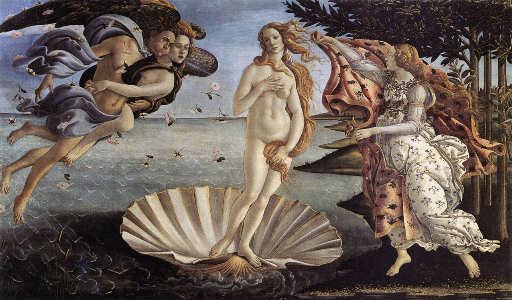
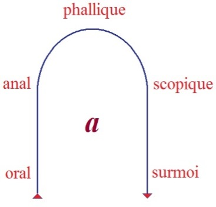
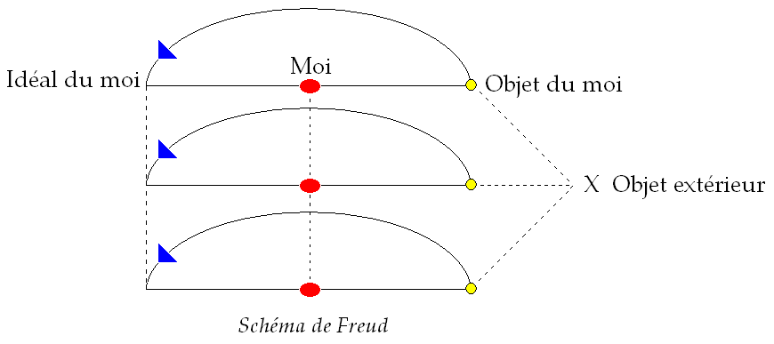

# Leçon 27 | 28 Juin 1961

<!-- source-url: http://staferla.free.fr/S8/S8 LE TRANSFERT.docx -->
<!-- seminar: s8 -->
<!-- lesson: 27 -->

<!-- id: s8-27-0001 -->

Au moment de tenir devant vous notre dernier propos de cette année, il m’est revenu à l’esprit l’invocation de PLATON au début du *Critias*. C’est bien en effet là qu’elle se trouve, pour autant qu’il parle du ton comme d’un élément essentiel dans la mesure de ce qui est à dire. Puissé-je, en effet, savoir ce ton garder [^330]. Pour ce faire, PLATON invoque ce qui est l’objet même dont il va parler dans ce texte inachevé : rien moins que celui de la naissance des dieux.

<!-- id: s8-27-0002 -->

Un recoupement qui n’a pas été sans me plaire, puisque aussi bien - latéralement sans doute - nous avons été très proches de ce thème au point d’entendre quelqu’un - dont vous pouvez considérer par certains côtés qu’il fait profession d’athéisme - nous parler des dieux comme de *ce qui se trouve dans le Réel*. Ce que je vous dis ici, il se trouve que beaucoup le reçoivent à chaque fois comme étant quelque chose qui lui est adressé à lui comme particulier.

<!-- id: s8-27-0003 -->

Je dis « *particulier* » :

<!-- id: s8-27-0004 -->

- non pas individuel,

<!-- id: s8-27-0005 -->

- non certes à qui me plaît, puisque beaucoup sinon tous le reçoivent,

<!-- id: s8-27-0006 -->

- ni collectif non plus du même coup, car je constate que de ce qu’il reçoit, chacun laisse place - entre vous

<!-- id: s8-27-0007 -->

> à contestation sinon à discordance.

<!-- id: s8-27-0008 -->

C’est donc une large place qui est laissée de l’un à l’autre. C’est peut–être cela qu’on appelle - au sens propre - « *parler dans le désert* ».

<!-- id: s8-27-0009 -->

Cela n’est certes pas que j’aie à me plaindre cette année d’aucune *désertion*, comme chacun sait dans le désert il peut y avoir presque foule, c’est que le désert n’est pas constitué par le vide. L’important, c’est justement ceci que j’ose espérer, c’est que ce soit un peu au désert que vous soyez venus me trouver. Ne soyons pas trop optimistes ni trop fiers de nous, tout de même disons que vous avez eu, tous tant que vous êtes, un petit souci de la limite du désert. C’est bien pourquoi je m’assure que ce que je vous dis n’est, en fait, jamais encombrant pour le rôle que je me trouve - et que je dois - tenir auprès de certains d’entre vous, qui est celui de l’analyste.

<!-- id: s8-27-0010 -->

Pour tout dire c’est :

<!-- id: s8-27-0011 -->

- pour autant que mon discours, dans mon chemin de cette année, vise *la position de l’analyste*, et que cette position je la distingue comme étant celle qui est au cœur de la réponse donnée *par l’analyste* pour satisfaire au pouvoir du transfert,

<!-- id: s8-27-0012 -->

- pour autant qu’à *cette place* même qui est la sienne *l’analyste doit s’absenter de tout idéal de l’analyste*,

<!-- id: s8-27-0013 -->

- pour autant que mon discours respecte cette condition, je crois, qu’il est propre à permettre cette conciliation nécessaire auprès de certains, de mes deux positions :

<!-- id: s8-27-0014 -->

- d’analyste,

<!-- id: s8-27-0015 -->

- et de celui qui vous parle de l’analyse.

<!-- id: s8-27-0016 -->

À divers titres, sous diverses rubriques on peut formuler quelque chose, bien sûr, qui soit de l’ordre de l’idéal, il y a des qualifications de l’analyste, c’est déjà assez de constituer un moyen de cet ordre. L’analyste, par exemple, ne doit pas être tout à fait ignorant d’un certain nombre de choses mais ce n’est point là ce qui entre en jeu dans sa position essentielle d’analyste.

<!-- id: s8-27-0017 -->

Ici certes s’ouvre l’ambiguïté qu’il y a autour du mot « *savoir* ». PLATON, dans cette invocation au début du *Critias*, se réfère au savoir, sur la garantie que concernant ce qu’il aborde, le ton restera mesuré. C’est qu’en son temps l’ambiguïté était beaucoup moins grande. Le sens du mot « *savoir* » ici est beaucoup plus proche de ce que je vise au moment où j’essaie d’articuler pour vous la position de l’analyste et c’est bien ici que se motive, que se justifie, ce départ à partir de l’image exemplaire de SOCRATE qui est celui que j’ai choisi cette année.

<!-- id: s8-27-0018 -->

Me voici donc arrivé la dernière fois à ce point que je crois essentiel, point tournant de ce que nous aurons à énoncer par la suite, de *la fonction de l’objet(a)* dans mes schémas, pour autant qu’elle est jusqu’ici celle, après tout, que j’ai le moins *élucidée*. Je l’ai fait à propos de cette fonction de l’objet en tant qu’il est une partie qui se présente comme partie séparée, « *objet partiel* » comme on dit, et vous ramenant au texte - auquel *je vous prie instamment* pendant ces vacances de vous reporter avec détails et avec attention - je vous ai fait remarquer que celui qui introduit cette notion d’« *objet partiel* » : ABRAHAM *y entend* de la façon la plus formelle *un amour de l’objet dont justement cette partie est exclue *: *c’est l’objet moins cette partie*.

<!-- id: s8-27-0019 -->

Tel est le fondement de l’expérience autour de quoi tourne *cette entrée en jeu de l’« objet partiel »,* de l’intérêt qui lui est dès lors accordé.

<!-- id: s8-27-0020 -->

Au dernier terme, les spéculations de WINICOTT - observateur du comportement de l’enfant - sur *l’objet transitionnel*, se rapportent aux méditations du cercle kleinien. Dès longtemps, il me semble que ceux qui m’écoutent, s’ils m’entendent, ont pu avoir plus qu’un soupçon des précisions les plus formelles sur le fait que cette *partialité* de l’objet a le rapport le plus étroit avec ce que j’ai appelé la fonction de « *la métonymie* » qui prête en grammaire aux mêmes équivoques.

<!-- id: s8-27-0021 -->

Je veux dire que là aussi on vous dira que c’est « *la partie prise pour le tout* », ce qui laisse tout ouvert, à la fois comme vérité et comme erreur :

<!-- id: s8-27-0022 -->

- comme vérité, nous allons bien comprendre que cette « *partie prise pour le tout* », dans l’opération se transforme, elle en devient le signifiant,

<!-- id: s8-27-0023 -->

- erreur, si nous nous attachons seulement à cette face de partie, en d’autres termes si nous nous dirigeons vers une référence de réalité pour la comprendre. J’ai suffisamment souligné cela ailleurs, je n’y reviens pas.

<!-- id: s8-27-0024 -->

L’important est que vous vous souveniez de ce que la dernière fois, autour du schéma du tableau et d’un autre que je vais reprendre sous une forme plus simple, que vous sachiez quel rapport il y a entre *l’objet du désir*, en tant que depuis toujours j’ai souligné, articulé, insisté, devant vous sur *ce trait essentiel, sa structuration comme objet partiel dans l’expérience analytique et sa fonction d’obturation foncière* et le correspondant libidinal de ce fait. Le rapport qu’il y a là, et que j’ai mis en valeur la dernière fois, est justement ce qui reste le plus irréductiblement investi au niveau du corps propre : le fait foncier du narcissisme et son noyau central.

<!-- id: s8-27-0025 -->

La phrase que j’ai extraite d’ABRAHAM, à savoir que c’est pour autant que *le phallus réel* reste, *à l’insu du sujet*, ce autour de quoi *l’investissement* maximum est conservé, préservé, gardé, c’est dans cette relation même que cet objet partiel se trouve être élidé, laissé en blanc dans l’image de l’autre, en tant qu’investie... le terme même d’investissement prenant tout son sens de l’ambiguïté qu’il comporte dans le *besetzt* allemand ...non seulement d’une charge mais de quelque chose qui entoure ce blanc central.

<!-- id: s8-27-0026 -->

Et aussi bien, s’il faut nous attaquer à quelque autre évidence, n’est-il pas sensible que l’image que nous pouvons ériger à l’acmé de la fascination du désir, celle précisément qui - *du thème platonicien au pinceau de* BOTTICELLI - se renouvelle avec la même forme : celle de la naissance de VÉNUS,

<!-- id: s8-27-0027 -->

- VÉNUS APHRODITE, fille de l’écume,

<!-- id: s8-27-0028 -->

- VÉNUS sortant de l’onde, ce corps érigé au-dessus des flots de l’amour amer,

<!-- id: s8-27-0029 -->

- VÉNUS ou aussi bien LOLITA.

<!-- id: s8-27-0030 -->

<!-- id: s8-27-0031 -->

Que nous apprend cette image, à nous analystes, si nous avons su justement *l’identifier dans l’équation symbolique*, pour employer le terme de « *girl* = *phallus* » de FENICHEL[^331] ? Car *le phallus* que nous apprend-il, sinon que s’articule ici, non pas d’autre façon mais à proprement parler de la même, que le *phallus*, là où nous le voyons symboliquement, c’est justement là *où il n’est pas*, là où nous *le supposons* *sous le voile* se manifester dans l’érection du désir :

<!-- id: s8-27-0032 -->

<!-- id: s8-27-0033 -->

c’est de ce côté-ci du miroir \[2\] : là où il est supposé, c’est là où il n’est pas.

<!-- id: s8-27-0034 -->

S’il est là devant nous, dans ce corps éblouissant de VÉNUS, c’est que justement *en tant qu’il n’est pas là* que cette forme est investie \- au sens où nous l’avons dit tout à l’heure - de tous les attraits, de tous les *Triebregungen* qui la cernent du dehors. Le *phallus* lui, avec sa charge est *de ce côté-ci du miroir*, à l’intérieur de l’enceinte narcissique \[1\].

<!-- id: s8-27-0035 -->

Si le miroir est là, nous avons *la relation suivante* : ce qui émerge à l’état de forme fascinante se trouve investi des flots libidinaux qui viennent de là où a été retiré - de la base, du fondement si l’on peut dire, du fondement narcissique - d’où se puise tout ce qui vient à former, comme telle, la structure objectale, à la condition que nous en respections les rapports et les éléments.

<!-- id: s8-27-0036 -->

Ce qui constitue le *Triebregung* en fonction d’un désir, *le désir* dans sa fonction privilégiée - dans le rapport propre qui s’appelle *le désir,* qu’on distingue de *la demande et du besoin* - a son siège dans ce *reste*, auquel correspond dans l’image ce mirage par où elle est identifiée justement à *la partie qui lui manque*, et *dont la présence invisible donne* à ce qu’on appelle « *la beauté* » justement sa *brillance*, ce que veut dire l’ἵμερος \[himeros\] antique, que j’ai maintes fois approché allant jusqu’à jouer de son équivoque avec l’ἡμέρα \[hémera\]*, le jour* [^332]. Ici est *le point central* autour de quoi se joue ce que nous avons à penser de la fonction de *(a)*, et bien sûr il convient d’y revenir encore, et de vous rappeler le *mythe* dont nous sommes partis - je dis « *mythe* » - ce *mythe* que j’ai fabriqué pour vous cette année au moment du *Banquet*, de « *la main qui se tend vers la bûche* ».

<!-- id: s8-27-0037 -->

*Quelle étrange chaleur*, cette main devrait elle porter avec elle pour que *le mythe* soit vrai, pour qu’à son approche jaillisse cette flamme par quoi l’objet prend feu ? Miracle pur contre lequel s’insurgent toutes les bonnes âmes, car si rare soit-il, ce phénomène, il faut \- encore qu’il soit considéré comme impensable - qu’on ne puisse pas, en tout état de cause, l’empêcher. C’est en effet *le miracle complet* qu’au milieu de ce feu induit, *une main apparaisse*. Elle est *l’image toute idéale*, c’est un phénomène rêvé comme celui de *l’amour.*

<!-- id: s8-27-0038 -->

- Chacun sait que *le feu de l’amour* ne brûle qu’à bas bruit.

<!-- id: s8-27-0039 -->

- Chacun sait que la poutre humide peut longtemps le contenir sans que rien n’en soit révélé au dehors.

<!-- id: s8-27-0040 -->

- Chacun sait, pour tout dire, ce qu’est chargé - dans *Le Banquet*, le plus gentiment bêta \[Agathon\] - d’articuler de façon quasi dérisoire : que la nature de *l’amour* est la nature de *l’humide*, ce qui veut dire justement, dans sa racine, exactement la même chose que ce qui est là au tableau, que le réservoir de l’amour objectal, en tant qu’il est amour du vivant, c’est justement cette *Schatten,* cette *ombre narcissique*.

<!-- id: s8-27-0041 -->

<!-- id: s8-27-0042 -->

La dernière fois, je vous avançais la présence de cette *ombre,* et aujourd’hui j’irai bien jusqu’à l’appeler, cette *tache* de moisissure, de *moisi* peut-être mieux nommé qu’on le croit, si le mot *moi* est inclus. Nous irions y rejoindre toute la spéculation du tendre FÉNELON, lui aussi - comme on dit - ondoyant, quand il fait aussi du *moi* le signe de je ne sais quel apparentement à la divinité.

<!-- id: s8-27-0043 -->

Je serais tout aussi capable qu’un autre de pousser très loin *cette métaphore* et jusqu’à faire de mon discours un message pour votre drap. Cette odeur de rat crevé qui affleure du linge pour peu qu’on le laisse séjourner sur le rebord d’une baignoire doit vous permettre d’y repérer un signe humain essentiel. Mon style d’analyste, ce n’est pas uniquement par préférence que je lui préfère des voies que l’on qualifie, que l’on stigmatise d’« *abstraction* », cela peut être simplement pour ménager chez vous *un odorat* que je saurais aussi bien chatouiller *qu’un autre*.

<!-- id: s8-27-0044 -->

Quoi qu’il en soit, là derrière, vous voyez se profiler ce point mythique - qui est sûrement bien celui né de l’évolution libidinale - que l’analyse, sans trop savoir jamais bien *le situer* dans l’échelle, a cerné autour du « *complexe urinaire* » dans son rapport obscur avec l’action du feu : termes antinomiques, l’un luttant contre l’autre, jeu de l’ancêtre primitif.

<!-- id: s8-27-0045 -->

Comme vous savez que - notre ancêtre - l’analyse a découvert que son premier réflexe de jeu à l’endroit de l’apparition de la flamme avait dû être de pisser dessus, renouvelé dans le *Gulliver*. Rapport profond de « *uro »* : *je brûle,* à « *urina »* : *je pisse dessus*[^333]. Tout cela s’inscrit au fond de *l’expérience infantile* : l’opération du séchage des draps, les rêves du linge énigmatiquement empesé,

<!-- id: s8-27-0046 -->

- plutôt de *l’érotique de la blanchisseuse* chez M. VISCONTI, pour ceux qui ont pu aller voir sa splendide mise en scène de *tous les blancs possibles*, illustrant sur la scène, matérialisant pour nous, le fait et la raison de savoir pourquoi Pierrot, sur scène est en blanc[^334]. Bref, c’est un petit milieu bien humain qui fait bascule autour du moment ambigu entre l’énurésie et les premières pollutions.

<!-- id: s8-27-0047 -->

- C’est là autour, que se joue la dialectique de l’amour et du désir dans ses racines les plus sensibles.

<!-- id: s8-27-0048 -->

L’objet central, *l’objet du désir* - sans vouloir pousser plus loin ce mythe placidement incarné dans les premières images dans lesquelles apparaît pour l’enfant ce qu’on appelle la petite *carte géographique*, la petite Corse sur les draps que tout analyste connaît bien - *l’objet du désir* s’y présente, au centre de ce phénomène, comme un objet sauvé des eaux de votre amour.

<!-- id: s8-27-0049 -->

L’objet se trouve à une place qui est justement - et c’est la fonction de mon mythe - à situer au milieu du même buisson ardent où un jour s’est annoncé dans son opaque réponse ce qu’il y a - « *Je suis ce que je suis* » - dans ce point même, où faute de savoir qui parle là, nous en sommes toujours à entendre l’interrogation du « *Che vuoi* ? » où hennit le diable de CAZOTTE, *une étrange tête de chameau métamorphique* d’où aussi bien peut sortir la « *petite chienne fidèle du désir* ». Tel est ce à quoi nous avons affaire quant au *petit(a) du désir*, tel est le point sommet autour duquel pivote ce en quoi nous avons affaire à lui, *tout au long de sa structure.*

<!-- id: s8-27-0050 -->

Mais quant à l’attrait libidinal jamais dépassé, je veux dire que ce qui l’antécède dans le développement, à savoir *les formes premières* de l’objet en tant que séparé : *les seins, les fèces*, ne prennent leur fonction que pour autant que *nachträglich* ils sont repris comme ayant joué *le même jeu à la même place*, que quelque chose entre dans la dialectique de *l’amour* à partir des demandes primitives, à partir du *Trieb* du nourrissage, qui s’est instauré dès l’abord, parce que la mère parle.

<!-- id: s8-27-0051 -->

Il y a un appel à *l’au-delà* de ce qui peut satisfaire, de cet objet qui s’appelle « *sein* » tout de suite pris comme valeur instrumentale, pour distinguer ce fond, cet arrière-plan que le sein n’est pas seulement ce qui se repousse, ce qui se refuse, parce que déjà l’on veut « *autre chose* ». C’est aussi autour de *la demande* que les fèces - *premiers cadeaux* - se *retiennent* ou se *donnent*, comme *réponse à la demande*. Voici, dans toute cette antériorité dont nous avons structuré les rapports oral et anal, cette fonction : l’*avoir* se confond avec l’*être* ou sert à l’appel de l’*être*, de la mère, au-delà de tout ce qu’elle peut apporter de support anaclitique.

<!-- id: s8-27-0052 -->

Je vous l’ai dit, *c’est à partir du phallus*, de son avènement dans cette dialectique, *que s’ouvre* - justement, pour avoir été réunie en lui - *la distinction de l’être et de l’avoir*. *Au-delà de l’objet phallique, la question* - c’est bien le cas de le dire - *s’ouvre à l’endroit de l’objet autrement*. Ce qu’il présente ici, dans cette émergence d’île, ce fantasme, ce reflet, où justement il s’incarne comme objet du désir, se manifeste précisément dans l’image - je dirais presque : *la plus sublime* - dans laquelle il peut s’incarner, celle que j’ai mise en avant tout à l’heure comme objet de désir : il s’incarne justement dans *ce* qui à l’image manque.

<!-- id: s8-27-0053 -->

<!-- id: s8-27-0054 -->

C’est à partir de là que s’origine tout ce qui va être la suite du rapport du sujet à *l’objet du désir* : s’il captive par ce qui lui manque là, où trouver ce par quoi il captive ? La suite, et l’horizon du rapport à *l’objet* - si ce n’est pas avant tout un rapport conservatif - c’est, si je puis dire, de l’interroger sur « *ce qu’il a dans le ventre* », ce qui se poursuit sur la ligne où nous essayons d’isoler la fonction de *petit(a)* : c’est la ligne proprement sadienne par où *l’objet* est interrogé jusqu’aux profondeurs de son être, par où il est sollicité de se retourner dans ce qu’il a de plus caché, pour venir à remplir *cette forme vide* en tant qu’elle est forme fascinante.

<!-- id: s8-27-0055 -->

Ce qui est demandé à l’objet, c’est : *jusqu’où* il peut supporter cette question ? Et après tout il ne peut bien la supporter que :

<!-- id: s8-27-0056 -->

- jusqu’au point où le dernier *manque à être* est révélé,

<!-- id: s8-27-0057 -->

- jusqu’au point où la question se confond avec la destruction de l’objet.

<!-- id: s8-27-0058 -->

C’est parce que ceci est le terme, qu’il y a cette barrière que je vous ai placée l’année dernière, *la barrière de la beauté ou de la forme,* *c’est celle par laquelle l’exigence de conserver l’objet se réfléchit sur le sujet lui-même.*

<!-- id: s8-27-0059 -->

Quelque part dans RABELAIS, GARGANTUA part pour la guerre : « *Gardez ceci qui est le plus aimé* » lui dit sa femme, *en désignant du doigt* ce qui, à l’époque, est beaucoup plus facile à désigner sans ambiguïté qu’à notre époque, puisque vous savez que cette pièce de vêtement qui s’appelait *« la braguette » avait alors son caractère glorieux*, cela veut dire : *elle ne peut pas se garder à la maison.* La deuxième chose est à proprement parler pleine de sapience, dans aucun des propos de RABELAIS cela ne manque, c’est ceci :

<!-- id: s8-27-0060 -->

« *Engagez tout, tout peut aller dans la bataille, mais ceci gardez-le irréductiblement au centre* »

<!-- id: s8-27-0061 -->

...c’est bien ce qu’il s’agit de ne pas risquer[^335].

<!-- id: s8-27-0062 -->

Ceci permet de basculer dans notre dialectique, car tout ceci serait *fort joli* s’il était aussi *simple* de penser le désir à partir du sujet, si nous devions retrouver au niveau du désir ce mythe, qui s’est développé au niveau de la connaissance, de faire du monde cette sorte de vaste toile tout entière tirée du ventre de l’araignée-sujet.

<!-- id: s8-27-0063 -->

Qu’est-ce à dire, est-ce qu’il serait si simple que ce sujet dise : « *je désire* » ?

<!-- id: s8-27-0064 -->

Pas si simple, beaucoup moins simple - vous le savez, dans votre expérience - que de dire : « *j’aime océaniquement* »[^336], comme s’exprime FREUD bien joliment à propos de sa critique de l’effusion religieuse. J’aime, *je baigne, je mouille, j’inonde et je bave* par dessus le marché, et d’ailleurs tout cela par bavochage, à peine le plus souvent de quoi mouiller un mouchoir, surtout que cela se fait de plus en plus rare. Les « *grandes humides* » s’effacent depuis le milieu du XIXème siècle. Qu’on me montre de nos jours quelqu’un du type [Louise COLET](http://fr.wikipedia.org/wiki/Louise_Colet), je me dérangerai pour aller voir.

<!-- id: s8-27-0065 -->

Être désirant, c’est autre chose, il semble plutôt que cela laisse bien le « *je* » en suspens, cela le laisse tellement bien collé en tout cas dans le fantasme que je vous défie - ce « *je »* du désir - de le trouver ailleurs que là où M. GENET le pointe dans *Le balcon.* Je vous ai déjà parlé de M. Jean GENET - ce cher GENET... - dont je vous ai fait un jour *tout un grand séminaire* [^337]. Vous retrouverez facilement le passage dans *Le balcon,* de ce jeu du fantasme.

<!-- id: s8-27-0066 -->

GENET pointe admirablement ceci que les filles connaissent bien, c’est que : quelles que soient les élucubrations de ces Messieurs assoiffés d’incarner leurs fantasmes, *il y a un trait commun à tous, c’est qu’il faut que* - par quelque trait dans l’exécution - *ça ne fasse pas vrai* parce que autrement peut-être, si cela devenait tout à fait vrai, on ne saurait plus où on en est. Il n’y aurait peut-être pas pour le sujet de chances qu’il y survive.

<!-- id: s8-27-0067 -->

C’est cela la place du *signifiant S barré* : S, pour qu’on sache que ce n’est là qu’un *signifiant*, cette indication de l’inauthentique c’est là, la place du sujet en tant que première personne du fantasme. La meilleure façon que je trouve de l’indiquer - je l’ai déjà plusieurs fois suggéré quelque part - c’est de restituer à sa vraie forme *la cédille* du « ça » en français : *ce n’est pas une cédille, c’est une apostrophe,* c’est - dans l’apostrophe du « c’est » - la première personne de l’inconscient. Et vous pouvez même barrer le « t » de la fin : « *c’es* ». voilà une façon d’écrire le sujet au niveau de l’inconscient, le sujet du fantasme.

<!-- id: s8-27-0068 -->

Il faut dire que cela ne facilite pas le passage de l’objet à l’objectalité. Comme vous le voyez, on parle même de déplacement de certaines raies dans le spectre. Il y a tout un décalage de *l’objet du désir* par rapport à *l’objet réel* - pour autant que nous puissions mythiquement y aspirer - qui est foncièrement déterminé par le caractère négatif ou inclus de l’apparition du *phallus*.

<!-- id: s8-27-0069 -->

Ce n’est rien d’autre que j’ai visé tout à l’heure en vous faisant ce bref parcours de l’objet, depuis ses formes archaïques jusqu’à son horizon de destruction :

<!-- id: s8-27-0070 -->

- de l’objet orificiel, de l’objet *anificiel* - si j’ose m’exprimer ainsi - du passé infantile,

<!-- id: s8-27-0071 -->

- à l’objet de la visée foncièrement ambivalente qui reste jusqu’au terme celle du désir, ...car c’est un pur mensonge - puisqu’aussi bien cela n’a aucune nécessité critique *-* que de parler, dans le rapport à *l’objet du désir* d’un stade soi-disant « *post-ambivalent* ».

<!-- id: s8-27-0072 -->

<!-- id: s8-27-0073 -->

Aussi bien, cette façon d’ordonner *l’échelle* montante et concordante *des objets* par rapport au sommet *phallique*, c’est bien ce qui nous permet de comprendre la liaison de niveau qu’il y a, par exemple, entre l’attaque sadique en tant qu’elle n’est pas du tout une pure et simple satisfaction d’une agression prétendue élémentaire, mais une façon comme telle d’interroger l’objet dans son être, une façon d’y puiser le « ou bien » introduit, à partir du sommet phallique, entre l’*être* et l’*avoir*.

<!-- id: s8-27-0074 -->

Que nous nous retrouvions après *le stade phallique* « *gros ambivalent comme devant* » n’est pas le pire malheur, c’est qu’à *produire* les choses dans cette perspective, ce que nous pouvons remarquer c’est que nous n’allons jamais bien loin, à savoir que cet objet, en tant *qu’objet du désir*, il y a bien toujours un moment où nous allons le lâcher, faute de savoir justement comment poursuivre la question.

<!-- id: s8-27-0075 -->

Forcer un être - puisque c’est là l’essence du *petit(a) -* au-delà de la vie, n’est pas à la portée de tout le monde. Ce n’est pas simplement cette allusion qu’il y a des limites naturelles à la contrainte, à la souffrance elle même, c’est que même forcer un être au plaisir n’est pas un problème que nous résolvions si aisément et pour une bonne raison, c’est que c’est nous qui menons le jeu, c’est que c’est de nous qu’il s’agit.

<!-- id: s8-27-0076 -->

- *Justine* de SADE, chacun s’émerveille qu’elle résiste, à la vérité d’une façon indéfinie, à tous les mauvais traitements, si bien qu’il faut vraiment que JUPITER lui-même intervienne et fasse donner sa foudre pour qu’on en finisse. Mais c’est qu’à la vérité Justine, justement, n’est qu’une ombre.

<!-- id: s8-27-0077 -->

- *Juliette* est la seule qui existe car *c’est elle qui rêve*, et comme telle, et rêvant c’est elle qui doit nécessairement - lisez l’histoire - s’offrir à tous les risques du désir, pas moindres que ceux qu’encourt la Justine. Évidemment, nous ne nous sentons guère dignes d’une telle compagnie car elle va loin. Il ne faut point en faire trop état dans les conversations mondaines. Les personnes qui ne s’occupent que de *leur petite personne* ne peuvent y trouver qu’un intérêt bien mince.

<!-- id: s8-27-0078 -->

Nous voilà donc ramenés au sujet. Comment donc est-ce du sujet que peut être menée toute cette dialectique du désir, s’il n’est rien, lui, qu’une apostrophe inscrite dans un rapport qui est avant tout le rapport au désir de l’Autre ?

<!-- id: s8-27-0079 -->

<!-- id: s8-27-0080 -->

C’est ici qu’intervient la fonction du grand I, du signifiant de l’*idéal du moi,* et très précisément pour autant - comme je vous l’ai dit - que c’est d’elle que se préserve *i(a)*, le *moi idéal* :

<!-- id: s8-27-0081 -->

- *cette chose précieuse* qu’on tente de prendre,

<!-- id: s8-27-0082 -->

- *cette céramique, ce petit pot - symbole depuis toujours du « créé »* - où chacun essaie de se donner, à soi même, quelque consistance.

<!-- id: s8-27-0083 -->

Tout y concourt bien sûr, toutes les notions de forme et de modèle : nous avons là, dans la référence à l’Autre, cette construction de *ce support* autour de quoi va pouvoir se jouer la prise ou non de la fleur. Pourquoi ? C’est que, bien sûr, il n’y a aucun autre moyen que le sujet subsiste. Qu’est-ce que l’analyse nous apprend, sinon que le caractère, la fonction analogiquement radicale de l’image phobique est ce que FREUD a été dénicher dans la formation ethnographique d’alors, sous la rubrique du *totem*, maintenant bien ébranlée.

<!-- id: s8-27-0084 -->

Mais qu’en reste-t-il ? Rien d’autre que ceci : qu’on veut bien tout risquer pour le désir, pour la bagarre, pour la prestance et jusqu’à sa vie, mais non pas une certaine image limite, mais non pas la dissolution du rivage qui rive le sujet à son image. Un poisson, un arbre, n’ont pas une phobie. Qu’un BORORO *ne soit pas un ara n’est pas une phobie de l’ara.* Si ceci comporte apparemment des tabous analogues, le seul facteur commun entre les deux c’est l’*image* dans sa fonction de cernement et de discernement de l’objet, c’est le *moi-idéal*.

<!-- id: s8-27-0085 -->

Cette métaphore du *désirant* dans à peu près n’importe quoi, peut en effet, toujours redevenir urgente dans un cas individuel.

<!-- id: s8-27-0086 -->

Rappelez-vous le petit Hans. C’est au moment où le *désiré* se trouve sans défense à l’endroit du désir de l’Autre qui menace le rivage, la limite, *i(a)*, c’est alors que l’artifice éternel se reproduit et que le sujet le constitue : il apparaît comme enfermé dans « *la peau de l’ours avant de vous*[^338] *avoir tué* », mais c’est une peau de l’ours en réalité retournée et c’est à l’intérieur que le phobique défend l’autre côté de l’image spéculaire. L’image spéculaire a une face d’*investissement*, bien sûr, mais aussi une face de défense : *Un barrage contre le Pacifique* [^339] de l’amour maternel.

<!-- id: s8-27-0087 -->

Disons simplement que l’*investissement* de l’Autre est, en somme, défendu par le *moi idéal* et que l’*investissement* dernier du *phallus* propre est défendu par le phobique d’une certaine façon. J’irai jusqu’à dire que la phobie, c’est le signal lumineux qui apparaît pour vous avertir que « *vous roulez sur la réserve* » de la libido. On peut rouler encore un certain temps avec ça. C’est cela que la phobie veut dire et c’est bien pour ça que son support est *le phallus* comme *signifiant*.

<!-- id: s8-27-0088 -->

Je n’aurai pas besoin à ce propos de vous rappeler, dans notre expérience passée, tout ce qui illustre, tout ce qui confirme, *cette façon d’envisager les choses*. Rappelez-vous seulement le sujet de *L’analyse d’un rêve unique*, d’Ella SHARPE[^340], ce petit *toussotement* quand il l’avertit avant d’entrer dans son cabinet, tout ce qui est là caché derrière, tout ce qui sort avec ses histoires, ses rêveries familières :

<!-- id: s8-27-0089 -->

« *Que ferais-je si j’étais dans un endroit où je ne voudrais pas qu’on me découvrît ? Je ferais un petit aboiement. On se dirait : ce n’est qu’un chien* ».

<!-- id: s8-27-0090 -->

Chacun sait les autres *associations*, le chien, qui un jour s’est mis à se masturber le long de sa jambe, j’entends de la jambe du patient.

<!-- id: s8-27-0091 -->

Qu’est-ce que nous trouvons, dans cette histoire, exemplaire ? Que le sujet, en position de défense plus que jamais au moment d’entrer dans le cabinet analytique, fait semblant d’être un chien. Il fait semblant de l’être, ce sont tous les autres qui sont des chiens avant qu’il entre. Il les avertit de reprendre leur apparence humaine avant qu’il entre. Ne vous imaginez pas que ceci réponde d’aucune façon à un intérêt spécial pour les chiens. Dans cet exemple, comme dans tous les autres, être un chien *cela n’a qu’un seul sens*, cela veut dire qu’on fait « *houa, houa* », rien d’autre :

<!-- id: s8-27-0092 -->

« *J’aboierais, on se dirait* - ceux qui ne sont pas là - « *c’est un chien* » : valeur de l’*einziger Zug.*

<!-- id: s8-27-0093 -->

Et aussi bien, quand vous prenez *le schéma* par où FREUD nous origine l’*identification* qui est proprement celle de l’*idéal du moi*, il le fait par quel biais ? Par le biais de *la psychologie collective*. Qu’est-ce qui se produit, nous dit-il, préfaçant la grande explosion hitlérienne, pour que chacun entre dans cette sorte de fascination qui permet *la prise en masse*, *la prise en gelée* de ce qu’on appelle une foule ?

<!-- id: s8-27-0094 -->

<!-- id: s8-27-0095 -->

Pour que collectivement tous les sujets, au moins pendant un instant, aient ce *même idéal* qui permet tout et n’importe quoi pendant un temps assez court, qu’est-ce qu’il faut, nous dit-il ? Que tous ces objets extérieurs soient pris en tant qu’ayant un trait commun, l’*einziger Zug.*

<!-- id: s8-27-0096 -->

En quoi cela nous intéresse-t-il ? C’est que ce qui est vrai au niveau du collectif l’est aussi au niveau de l’individuel. *La fonction de l’idéal, pour autant que c’est autour d’elle que s’accommode le rapport du sujet à ses objets, c’est très précisément en tant que,* *dans le monde d’un sujet qui parle, c’est pure et simple affaire d’essai métaphorique de leur donner à tous un trait commun.*

<!-- id: s8-27-0097 -->

Le monde du sujet qui parle - *qu’on appelle le monde humain* - correspond à ceci : c’est qu’à tous les objets - pour les prendre dans ce monde animal que la tradition analytique a fait exemplaire des identifications défensives - c’est pure affaire de décret que de fixer ce trait commun à leur diversité. Qu’ils soient chiens, chats, blaireaux ou biches, décréter que pour subsister dans un monde où le *i(a)* du sujet soit respecté, ils font tous - quels qu’ils soient - « *houa, houa* », telle est *la fonction du* *einziger Zug.*

<!-- id: s8-27-0098 -->

Il est essentiel de la maintenir ainsi structurée car, hors de ce registre, il est impossible de concevoir ce que veut dire FREUD dans la psychologie du *deuil* et de la *mélancolie*. Qu’est-ce qui différencie le *deuil* de la *mélancolie* ? Pour le *deuil*, il est tout à fait certain que c’est autour de la fonction métaphorique des traits conférés à l’objet de l’amour, en tant qu’ils ont alors des privilèges narcissiques, que va rouler toute la longueur et la difficulté du *deuil*. En d’autres termes, et d’une façon d’autant plus significative qu’il le dit presque en s’en étonnant, FREUD insiste bien sur ce dont il s’agit : *le deuil consiste à authentifier la perte réelle, pièce à pièce, morceau à morceau, signe à signe, élément grand* I *à élément grand* I, jusqu’à épuisement. Quand cela est fait : fini ! Mais qu’est-ce à dire si cet objet était un *petit(a)*, *un objet de désir*, sinon que l’objet est toujours masqué derrière ses attributs : banalité presque.

<!-- id: s8-27-0099 -->

Mais l’affaire commence, comme de bien entendu, seulement à partir du pathologique, c’est-à-dire de *la mélancolie* où nous voyons deux choses : c’est que l’objet est - chose curieuse - beaucoup moins saisissable pour être certainement présent et pour déclencher *des effets infiniment plus catastrophiques*, puisqu’ils vont jusqu’au tarissement de ce *Trieb* que FREUD appelle le *Trieb* le plus fondamental, celui qui vous attache à la vie. Il faut lire, il faut suivre ce texte, entendre ce que FREUD indique : je ne sais quelle déception - qu’il ne sait pas définir - est là.

<!-- id: s8-27-0100 -->

Qu’allons-nous voir d’un objet aussi voilé, aussi masqué, aussi obscur ? Ce ne sont aucun des traits - d’un objet qu’on ne voit pas - auquels le sujet peut s’attaquer, mais pour autant que nous le suivions, nous analystes, nous pouvons en identifier quelques-uns à travers ceux qu’il vise, à savoir ses propres caractéristiques à lui : « *je ne suis rien, je ne suis qu’une*... ». Remarquez qu’il ne s’agit jamais de *l’image spéculaire*. Le *mélancolique* ne vous dit pas *qu’il a mauvaise mine* ou *qu’il a une sale gueule* ou *qu’il est tordu*. *Il est le dernier des derniers*, il entraîne des *catastrophes* pour toute sa parenté. Il est entièrement - dans ses auto-accusations - dans le domaine du *symbolique*. Ajoutez-y l’*avoir* : il est ruiné. Est-ce que ceci n’est pas fait pour vous mettre sur la voie de quelque chose ?

<!-- id: s8-27-0101 -->

Je ne fais que vous l’indiquer aujourd’hui en vous marquant un point spécifique qui, par rapport à ces deux termes de *deuil* et de *mélancolie*, marque à mes yeux, du moins pour l’instant, un point de concours. C’est celui de ce que j’appellerai non pas le *deuil* ni la *dépression*, au sujet de la perte d’un objet, mais un certain type de « *remords* » en tant qu’il est déclenché par un certain type de dénouement que nous signalerons être de l’ordre du « *suicide de l’objet* ».

<!-- id: s8-27-0102 -->

Remords donc à propos d’un objet qui est entré - à quelque titre - dans le champ du désir et qui, de ce fait ou de quelque risque qu’il a couru dans l’aventure, a disparu. Analysez ces cas, la voie vous est déjà tracée par FREUD. Déjà dans le deuil normal, il vous indique que cette pulsion que le sujet retourne contre soi pouvait bien être, à l’endroit de l’objet, une pulsion agressive.

<!-- id: s8-27-0103 -->

Sondez ces remords dramatiques dans les cas où ils adviennent. Vous en verrez peut-être *quelle est la force* d’où revient, contre le sujet lui-même, une puissance d’insulte qui peut être parente de celle de la mélancolie. Vous en trouverez la source dans ceci qu’avec cet objet, qui s’est ainsi dérobé, ce n’était donc pas la peine d’avoir pris, si j’ose dire, tant de *précautions*, ce n’était donc pas la peine de s’être détourné de son vrai désir s’il a été [^341] - comme il semble - qu’on aille jusqu’à le détruire.

<!-- id: s8-27-0104 -->

Cet exemple extrême - qui n’est pas si rare à voir au détour d’une telle perte après ce qui se passe entre sujets désirants au cours de ces longues étreintes qu’on appelle *les oscillations de l’amour -* est quelque chose qui nous porte au cœur du rapport entre le *grand I* et le *petit(a)*, assurément à cette limite sur quelque chose autour de quoi est toujours mise en question la sécurité de la limite, voilà ce dont il s’agit en ce point du fantasme, qui est celui dont nous devons savoir faire écarter le sujet. Ceci suppose assurément chez l’analyste une complète réduction mentale de la fonction du signifiant, en tant qu’il doit saisir par quel ressort, par quel biais, par quel détour, c’est toujours elle qui est en cause quand il s’agit de la position de l’*idéal du moi*.

<!-- id: s8-27-0105 -->

Mais il est quelque chose d’autre que je ne peux - *arrivant ici au terme de mon discours* - qu’indiquer et qui concerne *la fonction du (a).* Ce que SOCRATE sait - et ce que l’analyste doit au moins entrevoir - c’est qu’avec le *petit(a)* la question est tout autre dans son fond, que celle de l’accès à aucun *idéal*. Ce qui est en jeu ici, ce qui se passe en cette île, ce champ de l’être que l’amour ne peut que cerner, c’est là quelque chose dont l’analyste ne peut que penser :

<!-- id: s8-27-0106 -->

- que n’importe quel objet peut le remplir,

<!-- id: s8-27-0107 -->

- que nous sommes amenés à vaciller sur les limites où se pose cette question : « Qu’es tu ? », avec n’importe quel objet qui est entré une fois dans le champ de notre désir,

<!-- id: s8-27-0108 -->

- qu’il n’y a pas d’*objet* qui ait plus ou moins de prix qu’un autre, et c’est ici *le deuil* autour de quoi est centré *le désir de l’analyste*.

<!-- id: s8-27-0109 -->

AGATHON vers quoi, à la limite du *Banquet,* va se porter l’éloge de SOCRATE, c’est *le con des cons*. C’est le plus con de tous, c’est même le seul con intégral. Et c’est à lui qu’a été déféré de dire, sous une forme ridicule, ce qu’il y a de plus vrai sur *l’amour*. *Il ne sait pas ce qu’il dit, il bêtifie*, mais cela n’a aucune importance, et il n’en est pas moins *l’objet aimé*. SOCRATE dit à ALCIBIADE :

<!-- id: s8-27-0110 -->

« *Tout ce que tu dis là à moi, c’est pour lui*. »

<!-- id: s8-27-0111 -->

C’est là, la fonction de l’analyste, avec ce qu’elle comporte d’un certain deuil. Mais et après tout qu’est-ce que cela veut dire si ce n’est que nous rejoignons là cette vérité que FREUD lui-même a laissée hors champ de ce qu’il pouvait comprendre. Chose singulière, et probablement due à ces raisons de confort, disons celles que je vous expose aujourd’hui sous la formule de la nécessité de la conservation de *la potiche,* on ne semble pas avoir encore compris que : « *Tu aimeras ton prochain comme toi-même* », c’est cela que cela veut dire.

<!-- id: s8-27-0112 -->

On ne veut pas traduire parce que cela ne serait probablement pas chrétien au sens d’un certain idéal, mais c’est *un idéal philosophique*, croyez-moi. Le christianisme n’a pas encore dit son dernier mot. Cela veut dire :

<!-- id: s8-27-0113 -->

- à propos de n’importe qui, vous pouvez poser la question de la parfaite destructivité du désir,

<!-- id: s8-27-0114 -->

- à propos de n’importe qui vous pouvez faire cette expérience de savoir jusqu’où vous oserez aller en interrogeant un être, au risque pour vous-même de disparaître. \[Fin du séminaire 1960-61\]

<!-- id: s8-27-0115 -->

[[Table des séances](#TABLE)](#RETOUR)

## Notes

[^330]: Cf. Platon, *Critias* : Or, quand on détonne, la juste peine est de rentrer dans le ton, prions celui-ci (le dieu) de nous accorder un remède qui nous préserve,

    le plus efficace et le meilleur de tous les remèdes préservatifs : le savoir, 106b, Gallimard Pléiade. Lacan a déjà évoqué la question de ton, harmonie,

    accord, mesure, dans son commentaire du discours d’Éryximaque.

[^331]: Écrits, p. 565, note 1.

[^332]: Cf. fin de séance du 8 février 1961.

[^333]: Cf. S. Freud : *Malaise dans la civilisation,* Paris, PUF, 1971, p. 37 n. 3, p. 38.

[^334]: En 1961, Visconti a réalisé un film, *Rocco* *et ses frères,* et une mise en scène de théâtre à Paris, *Dommage qu’elle soit une p...*

[^335]: Rabelais : *Le Tiers Livre,* des faits *et dicts héroïques du bon Pantagruel,* chap. VIII, « *Comment la braguette est la pièce principale de l’armure pour les hommes de guerre » :*

    *Celle qui vit son mari tout armé, sauf la braguette, aller en escarmouche, lui dit : « Ami, de peur qu’on ne vous touche, Armez cela, qui est le plus aimé. »*

[^336]: S. Freud, *Malaise dans la civilisation,* trad., Paris, PUF, 1971, p. 6 sq.

[^337]: Séminaire 1957-58 : Les formations de l’inconscient, séance du 5 mars 1958, 2e partie.

[^338]: Ce « vous » est énigmatique mais toutes les notes confirment son emploi.

[^339]: Cf. le roman de Marguerite Duras.

[^340]: Ella Sharpe : *Dream analysis,* Londres, the Hogarth Press, 1937, chap. V, p.125, « *Analyse d’un rêve unique* », traduit par *La Documentation psychanalytique,* cahier n° 3.

[^341]: Dans la sténotypie on trouve : « *s’il a, cet objet, été comme il semble qu’on aille jusqu’à le détruire* ».
