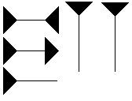
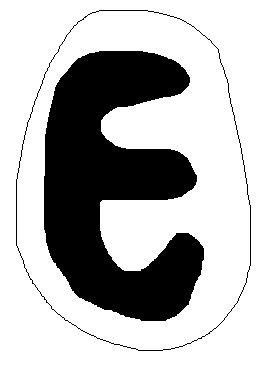
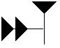

# Leçon 06 | 20 Décembre 1961

<!-- source-url: http://staferla.free.fr/S9/S9 L'IDENTIFICATION.docx -->
<!-- seminar: s9 -->
<!-- lesson: 06 -->

<!-- id: s9-06-0001 -->

La dernière fois, je vous ai laissés sur cette remarque faite pour vous donner le sentiment que mon discours ne perd pas ses amarres. À savoir que l’impor­tance pour nous, de cette recherche cette année tient en ceci : que le paradoxe de l’automatisme de répétition, c’est que vous voyez surgir *un cycle de comporte­ment*, inscriptible comme tel dans les termes d’une résolution de tension du couple donc « besoin-satisfaction », et que néanmoins, quelle que soit la fonction intéressée dans ce cycle - si charnelle que vous la supposiez - il n’en reste pas moins que ce qu’elle veut dire en tant qu’automatisme de répétition, c’est qu’*elle est là pour faire surgir, pour rappeler, pour faire insister, quelque chose qui n’est rien d’autre* en son essence *qu’un signifiant*, désignable par sa fonction, et spé­cialement sous cette face, qu’elle introduit dans *le cycle de ses répétitions* - toujours les mêmes en leur essence, et donc concernant quelque chose qui est toujours la même chose – qu’elle y introduit *la différence, la distinction, l’unicité*.

<!-- id: s9-06-0002 -->

Que c’est parce que *quelque chose* à l’origine *s’est passé*, qui est tout le mystère du *trauma*, à savoir : qu’une fois il s’est produit *quelque chose* qui a pris dès lors la forme A, que dans la répétition le comportement - si complexe, engagé, que vous le supposiez dans l’individualité animale - n’est là que pour faire ressurgir ce signe A. Disons que *le comportement*, dès lors, est exprimable comme *le comportement numéro tant*. C’est - *ce comportement numéro tant,* disons le - l’*accès* *hystérique*, par exemple.

<!-- id: s9-06-0003 -->

Une des formes chez un sujet déterminé, ce sont ses *accès* *hystériques,* c’est cela qui sort comme comportement *numéro tant*. Seul le numéro est perdu pour le sujet. C’est justement en tant que le numéro est perdu qu’il sort, ce comportement, masqué dans cette fonction de faire resurgir le numéro, derrière ce qu’on appellera la psychologie de son accès, derrière les motivations apparentes. Et vous savez que sur ce point personne ne sera difficile pour lui trouver l’air d’une raison : c’est le propre de la psychologie de faire toujours apparaître une ombre de motivation. C’est donc dans cet accolement structural, de quelque chose d’inséré radicalement dans cette individualité vitale avec cette fonction signifiante, que nous sommes, dans l’expérience analytique.

<!-- id: s9-06-0004 -->

*Vorstellungsrepräsentanz*, c’est là ce qui est refoulé : *c’est le numéro perdu du comportement tant*. Où est le sujet là-dedans ?

<!-- id: s9-06-0005 -->

- Est-il dans l’individualité radicale, réelle ?

<!-- id: s9-06-0006 -->

- Dans le patient pur de cette capture ?

<!-- id: s9-06-0007 -->

- Dans l’organisme dès lors aspiré par *les effets du « ça parle* », par le fait qu’un vivant entre les autres a été appelé à devenir ce que M. HEIDEGGER[^46] appelle « *le berger de l’être* », ayant été pris dans *les mécanismes du signifiant ?*

<!-- id: s9-06-0008 -->

- Est-il, à l’autre extrême, identifiable au jeu même du signifiant ?

<!-- id: s9-06-0009 -->

Et *le sujet n’est-il que le sujet du discours*, en quelque sorte arraché à son imma­nence vitale, condamné à la survoler, à vivre dans cette sorte de mirage qui découle de ce redoublement qui fait que tout ce qu’il vit, non seulement il le parle, mais que, le vivant, il le vit en le parlant, et que déjà ce qu’il vit s’inscrit en un ἔπος \[epos : discours\], une saga tissée tout au long de son acte même ?

<!-- id: s9-06-0010 -->

Notre effort cette année, s’il a un sens, justement c’est de montrer *comment s’articule la fonction du sujet*, ailleurs que dans l’un ou dans l’autre de ces pôles, jouant entre les deux. C’est après tout - moi je l’imagine - ce que votre cogitation, du moins j’aime à le penser après ces quelques années de séminaires, peut vous donner, ne serait-ce qu’implicitement, à tout instant comme repère. Est-ce que ça suffit, de savoir que la fonction du sujet est dans l’entre-deux, entre :

<!-- id: s9-06-0011 -->

- *les effets idéalisants de la fonction signifiante*,

<!-- id: s9-06-0012 -->

- et cette immanence vitale que vous confondriez - je pense, encore, malgré mes avertissements - volontiers avec la fonction de la pulsion ?

<!-- id: s9-06-0013 -->

C’est justement ce dans quoi nous sommes engagés, et ce que nous essayons de pousser plus loin, et ce pourquoi aussi j’ai cru devoir commencer par le *cogito* cartésien, pour rendre sensible le champ qui est celui dans lequel nous allons essayer de donner des articulations plus précises concernant l’iden­tification.

<!-- id: s9-06-0014 -->

Je vous ai parlé, *il y a quelques années*, du petit Hans[^47]. Il y a, dans l’histoire du petit Hans - je pense que vous en avez gardé le souvenir quelque part - l’his­toire du rêve que l’on peut épingler avec le titre de « *la girafe chiffonnée* » : *zerwut­zelte Giraffe*. Ce verbe, *zerwutzeln*, qu’on a traduit par « *chiffonner* », n’est pas un verbe tout à fait courant du lexique germanique commun. Si *wutzeln* s’y trouve, le *zerwutzeln* n’y est pas. *Zerwutzeln* veut dire *faire une boule*. Il est indiqué dans le texte du rêve de *la girafe chiffonnée* que c’est une girafe qui est là, à côté de la grande girafe vivante, une girafe en papier, et que comme telle on peut mettre en boule.

<!-- id: s9-06-0015 -->

Vous savez tout le symbolisme qui se déroule, tout au long de cette observation, du rapport entre la girafe et *la petite girafe*, girafe chiffonnée sous une de ses faces, concevable sous l’autre

<!-- id: s9-06-0016 -->

- comme la girafe réduite,

<!-- id: s9-06-0017 -->

- comme la girafe seconde,

<!-- id: s9-06-0018 -->

- comme la girafe qui peut symboliser bien des choses.

<!-- id: s9-06-0019 -->

Si la grande girafe symbolise *la mère*, l’autre girafe symbolise *la fille*, et le rapport du petit Hans à la girafe, au point où l’on en est à ce moment-là de son analyse, tendra assez volontiers à s’incarner dans le jeu vivant des rivalités familiales. Je me sou­viens de l’étonnement - il ne serait plus de mise aujourd’hui - que j’ai pro­voqué alors en désignant à ce moment-là dans l’observation du petit Hans, et comme telle, la dimension du *symbolique* mise en acte dans les productions psy­chiques du jeune sujet à propos de cette girafe chiffonnée.

<!-- id: s9-06-0020 -->

Qu’est-ce qu’il pou­vait y avoir de plus indicatif de la différence radicale du *symbolique* comme tel, sinon de voir apparaître dans la production - certes sur ce point non suggérée, car il n’est pas trace à ce moment d’une articulation semblable concernant la fonction indirecte du symbole - que de voir dans l’observation quelque chose qui vraiment *incarne* pour nous, et *image* l’apparition du *symbolique* comme tel dans la dialectique psychique.

<!-- id: s9-06-0021 -->

« *Vraiment, où avez-vous pu trouver ça ?* » me disait l’un d’entre vous gentiment après cette séance. La chose *surprenante*, ce n’est pas que je l’y aie vu, parce que ça peut difficilement être indiqué plus crû­ment dans le matériel lui-même, c’est qu’à cet endroit on peut dire que FREUD lui-même ne s’y arrête pas, je veux dire ne met pas tout le soulignage qu’il convient sur ce phénomène, sur ce qu’il *matérialise* si l’on peut dire, à nos yeux.

<!-- id: s9-06-0022 -->

C’est bien ce qui prouve le caractère essentiel de ces délinéations structurales, c’est que : *à ne pas les faire, à ne pas* *les pointer, à ne pas les articuler* avec toute l’énergie dont nous sommes capables, c’est une certaine face, une certaine dimension des phénomènes eux-mêmes que nous nous condamnons en quelque sorte à méconnaître.

<!-- id: s9-06-0023 -->

Je ne vais pas vous refaire à cette occasion l’articulation de ce dont il s’agit, de l’enjeu dans le cas du petit Hans, les choses ont été assez publiées, et assez bien pour que vous puissiez vous y référer. Mais *la fonction* \[signifiante\] comme telle, à ce moment critique - celui déterminé par sa suspension radicale au désir de sa mère d’une façon, si l’on peut dire, qui est sans compensation, sans recours, sans issue - est la fonction d’artifice que je vous ai montrée être celle de *la phobie*, en tant qu’elle introduit un ressort : *signifiant-clé* qui permet au sujet de préserver ce dont il s’agit pour lui, à savoir ce minimum d’ancrage, de centrage de son être, qui lui permette de ne pas se sentir un être complètement à la dérive du caprice maternel. C’est de cela qu’il s’agit.

<!-- id: s9-06-0024 -->

Mais ce que je veux pointer à ce niveau c’est ceci, c’est que dans une production éminemment peu sujette à caution dans l’occasion - je le dis d’autant plus que tout ce vers quoi on a orienté précé­demment le petit Hans, car Dieu sait qu’on l’oriente, comme je vous l’ai mon­tré, rien de tout cela n’est de nature à le mettre sur un champ de ce type d’élaboration - le petit Hans nous montre ici - sous une figure fermée - certes - mais exemplaire - le saut, le passage, la tension entre ce que j’ai défini tout d’abord comme les deux extrêmes du sujet :

<!-- id: s9-06-0025 -->

- le sujet animal qui représente la mère, mais aussi avec son grand cou, personne n’en doute, la mère en tant qu’elle est cet immense *phallus* du désir, terminé encore par le bec broutant de cet ani­mal vorace,

<!-- id: s9-06-0026 -->

- et puis de l’autre, *quelque chose* sur une surface de papier - nous reviendrons sur cette dimension de *la surface -* quelque chose qui n’est pas dépourvu de tout accent subjectif.

<!-- id: s9-06-0027 -->

Car on voit bien tout l’enjeu de ce dont il s’agit : la grande girafe, comme elle le voit jouer avec la petite chiffonnée, crie très fort jusqu’à ce qu’enfin elle se lasse, elle épuise ses cris. Et le petit Hans, sanc­tionnant en quelque sorte *la prise de possession*, la *Besitzung* de ce dont il s’agit, de l’enjeu mystérieux de l’affaire, en s’asseyant dessus, *draufgesetzt*. Cette belle mécanique doit nous faire sentir ce dont il s’agit, si c’est bien de son *identification* fondamentale, de la défense de lui-même contre cette capture originelle dans le monde de la mère, comme personne bien sûr n’en doute au point où nous en sommes de l’élucidation de la phobie.

<!-- id: s9-06-0028 -->

Ici déjà nous voyons exemplifiée *cette fonction du signifiant*. C’est bien là que je veux encore m’arrêter aujourd’hui, concernant le point de départ de ce que nous avons à dire sur l’identification. *La fonction du signifiant*, en tant qu’elle est *le point d’amarre* de quelque chose d’où le sujet se constitue, voilà ce qui va me faire m’arrêter un instant aujourd’hui sur quelque chose qui, me semble-t-il, doit venir tout naturellement à l’esprit, non seulement pour des raisons de logique générale, mais aussi pour quelque chose que vous devez tou­cher dans votre expérience, je veux dire *la fonction du nom*. Non pas « *noun* », le *nom* défini grammaticalement, ce que nous appelons « *le substantif* » dans nos écoles, mais le *name*, comme en anglais - et en allemand aussi bien, d’ailleurs - les deux fonctions se distinguent. Je voudrais en dire un peu plus ici, mais vous comprenez bien la différence : le *name*, c’est le nom propre.

<!-- id: s9-06-0029 -->

Vous savez, comme analystes, l’importance qu’a dans toute analyse le nom propre du sujet. Vous devez toujours faire attention à comment s’appelle votre patient. Ce n’est *jamais* indifférent. Et si vous demandez les noms dans l’analyse, c’est bien quelque chose de beaucoup plus important que l’excuse que vous pouvez en donner au patient, à savoir que *toutes sortes de choses peuvent se cacher der­rière cette sorte de dissimulation ou d’effacement qu’il y aurait du nom*, concer­nant les relations qu’il a à mettre en jeu avec tel *autre sujet*.

<!-- id: s9-06-0030 -->

Cela va beaucoup plus loin que cela. Vous devez le pressentir, sinon le savoir.

<!-- id: s9-06-0031 -->

Qu’est-ce que c’est qu’un *nom propre* ? Ici, nous devrions avoir beaucoup à dire. Le fait est qu’en effet, nous pouvons apporter beaucoup de matériel au nom.

<!-- id: s9-06-0032 -->

Ce matériel, nous analystes, dans les « *contrôles »* même, mille fois nous aurons à en illustrer l’importance. Je ne crois pas que nous puissions, ici juste­ment, lui donner toute sa portée sans - c’est là une occasion de plus d’en tou­cher du doigt la nécessité méthodologique - nous référer à ce que, à cet endroit, *a à dire le linguiste*. Non pas pour nous y soumettre forcément, mais parce que concernant la fonction, la définition de ce signifiant qui a son originalité, nous devons au moins y trouver un contrôle, sinon un complément de ce que nous pouvons dire.

<!-- id: s9-06-0033 -->

En fait, c’est bien ce qui va se produire. En 1954 \[?\] est paru *un petit factum* de Sir Alan H. GARDINER[^48]. Il y a de lui toutes sortes de travaux, et particulièrement une très bonne *grammaire égyptienne*, je veux dire de l’*Égypte antique*, c’est donc un égyptologue, mais c’est aussi et avant tout un linguiste.

<!-- id: s9-06-0034 -->

GARDINER a fait - c’est à cette époque que j’en ai fait l’acquisition, au cours d’un voyage à Londres - un tout petit livre qui s’appelle *La théorie des noms propres*. Il l’a fait d’une façon un peu contingente. Il appelle cela lui-même un *controversial essay* : un essai controversiel, on peut même dire - ça c’est une litote - un essai polémique. Il l’a fait à la suite de la vive exaspération où l’avait porté un certain nombre d’énonciations d’un philosophe que je ne vous signale pas pour la première fois : Bertrand RUSSELL, dont vous savez l’énorme rôle dans l’élabo­ration de ce qu’on pourrait appeler de nos jours la logique mathématisée, ou la mathématique logifiée. Autour des *Principia mathematica*, avec WITHEHEAD, il nous a donné un symbolisme général des opérations logiques et mathématiques dont on ne peut pas ne pas tenir compte dès qu’on entre dans ce champ.

<!-- id: s9-06-0035 -->

Donc RUSSELL[^49], dans l’un de ses ouvrages, donne une certaine définition tout à fait para­doxale - le paradoxe d’ailleurs est une dimension dans laquelle il est loin de répugner à se déplacer, bien au contraire, il s’en sert plus souvent qu’à son tour - M. RUSSELL a donc amené, concernant *le nom propre*, certaines remarques qui ont littéralement mis M. GARDINER hors de lui. La querelle est en elle-même assez significative pour que je croie devoir aujourd’hui vous y introduire, et à ce pro­pos accrocher des remarques qui me paraissent importantes. Par quel bout allons-nous commencer ? Par GARDINER ou par RUSSELL ? Commençons par RUSSELL.

<!-- id: s9-06-0036 -->

RUSSELL se trouve dans la position du logicien. Le logicien a une position qui ne date pas d’hier, il fait fonctionner un certain appareil auquel il donne divers titres : raisonnement, pensée. Il y découvre un certain nombre de lois implicites. Dans un premier temps, ces lois, il les dégage : ce sont celles sans lesquelles il n’y aurait rien, qui soit de l’ordre de la raison, qui serait *possible*.

<!-- id: s9-06-0037 -->

C’est au cours de cette recherche tout à fait originelle de cette pensée qui nous gouverne, par la réflexion grecque, que nous saisissons, par exemple, l’importance du *principe de contradiction*. Ce *principe de contradiction* découvert, c’est autour du *prin­cipe de contradiction* que quelque chose se déploie et s’ordonne, qui montre assurément que si la contradiction et son principe n’étaient que quelque chose de si tautologique, la tautologie serait singulièrement féconde, car ça n’est pas sim­plement en quelques pages que se développe la logique artistotélicienne.

<!-- id: s9-06-0038 -->

Avec le temps pourtant, le fait historique est que loin que le développement de la logique se dirige vers une ontologie, une référence radicale à l’être qui serait censé être visé dans ces lois les plus générales du mode d’appréhension nécessaire de la vérité, il s’oriente vers *un formalisme*, à savoir que ce à quoi se consacre *le lea­der d’une école de pensée* aussi importante, aussi décisive dans l’orientation qu’elle a donnée à tout un mode de pensée à notre époque, qu’est Bertrand RUSSELL, soit d’arriver à mettre tout ce qui concerne la critique des opérations mises en jeu dans le champ de la logique et de la mathématique, dans *une formalisation générale* aussi stricte, aussi économique qu’il est possible.

<!-- id: s9-06-0039 -->

Bref, la cor­rélation de l’effort de RUSSELL, l’insertion de l’effort de RUSSELL dans cette même direction, en mathématiques aboutit à la formation de ce qu’on appelle « *la théo­rie des ensembles* », dont on peut caractériser *la portée générale* en ce qu’on s’y *efforce* de *réduire tout le champ de l’expérience mathématique* accumulée par *des siècles de développement*, et je crois qu’on ne peut pas en donner de meilleure définition que : c’est *le réduire à un jeu de lettres*. Ceci donc, nous devons en tenir compte comme d’une donnée du progrès de la pensée, disons à notre époque : cette époque étant définie comme un certain moment du discours de la science.

<!-- id: s9-06-0040 -->

Qu’est-ce que Bertrand RUSSELL se trouve amené à donner dans ces conditions, le jour où il s’y intéresse, comme définition d’un *nom propre* ? C’est quelque chose qui en soi-même *vaut qu’on s’y arrête*, parce que c’est ce qui va nous permettre de saisir - on pourrait le saisir ailleurs, et vous verrez que je vous montrerai qu’on le saisit ailleurs - disons, cette part de *méconnaissance* impliquée dans une certaine position, qui se trouve être effectivement le coin où est poussé tout l’effort d’élaboration séculaire de la logique.

<!-- id: s9-06-0041 -->

Cette *méconnais­sance* est à proprement parler ceci, que sans aucun doute je vous donne en quelque sorte d’emblée dans ce que j’ai là posé forcément par une nécessité de l’exposé, cette *méconnaissance*, c’est exactement *le rapport le plus radical du sujet pensant, à la lettre*. Bertrand RUSSELL voit tout sauf ceci : la fonction de *la lettre*. C’est ce que j’espère pouvoir vous faire sentir et vous montrer. Ayez confiance et suivez-moi. Vous allez voir maintenant comment nous allons nous avancer.

<!-- id: s9-06-0042 -->

Qu’est-ce qu’il donne comme définition du *nom propre* ? Un *nom propre* c’est, dit-il : « *a word for particular* », un mot pour désigner *les choses parti­culières* comme telles, *hors de toute description*.

<!-- id: s9-06-0043 -->

Il y a deux manières d’aborder *les choses* :

<!-- id: s9-06-0044 -->

- *les décrire* par leurs *qualités*, leurs *repérages*, leurs *coordonnées* au point de vue du mathématicien, si je veux les désigner comme telles. *Ce point* par exemple, mettons qu’ici *je puisse vous dire* : il est à droite du tableau, à peu près à telle hauteur, il est blanc, et ceci cela… Ça, c’est une description, nous dit M. RUSSELL,

<!-- id: s9-06-0045 -->

- *et les manières qu’il y a de les désigner, hors de toute description, comme particulier*, *c’est ça que je vais appe­ler «* *nom propre* ».

<!-- id: s9-06-0046 -->

Le premier « *nom propre* » pour M. RUSSELL - j’y ai déjà fait allusion, à mes séminaires précédents - c’est le « *this* », celui-ci : « *<u>this</u> is the question* ».Voilà le démonstratif passé au rang de *nom propre*. Ce n’est pas moins *paradoxal* que M. RUSSELL envisage froidement la possibilité d’appeler *ce même point :* *John* . Il faut reconnaître que nous avons tout de même là le signe que peut-être il y a quelque chose qui dépasse l’expérience, car le fait est qu’il est rare qu’on appelle *John* un point géométrique...

<!-- id: s9-06-0047 -->

Néanmoins, RUSSELL n’a jamais reculé devant les expressions les plus extrêmes de sa pensée. C’est tout de même ici que le linguiste s’alarme. S’alarme d’autant plus qu’entre ces deux extrémités de la définition russellienne « *word for particular* », il y a cette conséquence tout à fait paradoxale que - logique avec lui-même - RUSSELL nous dit que SOCRATE n’a aucun droit à être considéré par nous comme *un nom propre*, étant donné que depuis longtemps SOCRATE n’est plus *un particulier*.

<!-- id: s9-06-0048 -->

Je vous abrège ce que dit RUSSELL. J’y ajoute même une note d’humour, mais c’est bien l’esprit de ce qu’il veut nous dire, à savoir que SOCRATE c’était pour nous « *le maître de* PLATON », « *l’homme qui a bu la ciguë* », etc.  C’est une description abrégée. Ça n’est donc plus comme tel ce qu’il appelle : « *un mot pour désigner le parti­culier dans sa particularité* ».

<!-- id: s9-06-0049 -->

Il est bien certain qu’ici nous voyons que *nous perdons* tout à fait *la corde* de ce que nous donne la conscience linguistique, à savoir que s’il faut que nous éliminions tout ce qui, des noms propres, s’insère dans une communauté de la notion, nous arrivons à une sorte d’impasse, qui est bien ce contre quoi GARDINER essaie de contreposer les perspectives proprement *linguistiques* comme telles.

<!-- id: s9-06-0050 -->

Ce qui est remarquable, c’est que le linguiste… non sans mérite, et non sans pratique, et non sans habitude, par une expérience d’autant plus profonde du signifiant que ce n’est pas pour rien que je vous ai signalé que c’est quelqu’un dont une partie du labeur se déploie dans un angle particulièrement suggestif et riche de l’expérience qui est celui de l’hiéroglyphe, puisqu’il est égyptologue …va - lui - être amené à *contre-formuler* pour nous ce qui lui parait caractéristique de *la fonction du nom propre*.

<!-- id: s9-06-0051 -->

Cette caractéristique de *la fonction du nom propre*, il va, pour l’élaborer, prendre *référence* à John Stuart MILL[^50] et à un grammairien grec du IIème siècle avant JÉSUS CHRIST qui s’appelle Dionysius THRAX[^51]. Singulièrement, il va rencontrer chez eux *quelque chose* qui, sans aboutir au même *paradoxe* que Bertrand RUSSELL, rend compte des formules qui, au premier aspect, pourront apparaître comme *homonymiques* si l’on peut dire.

<!-- id: s9-06-0052 -->

Le *nom propre*, ἴδιον ὄνομα \[idion onoma\], d’ailleurs n’est que la traduction de ce qu’ont apporté là-dessus les Grecs, et nommément ce Dionysius THRAX : ἴδιον \[idion\] opposé à Χοινόν \[koinon\]. Est–ce que ἴδιον \[idion\] ici se confond avec *le particulier* au sens russellien du terme ? *Certainement pas*, puisque aussi bien ce ne serait pas là-dessus que prendrait appui M. GARDINER, si c’était pour y trouver un accord avec son adversaire. Malheureusement, il ne parvient pas à spécifier la différence ici du terme de *pro­priété* comme appliquée à ce que distingue le point de vue grec originel avec les conséquences paradoxales auxquelles arrive un certain formalisme.

<!-- id: s9-06-0053 -->

Mais, à l’abri du progrès que lui permet la référence aux Grecs - tout à fait dans le fond - puis à MILL, plus proche de lui, il met en valeur ceci dont il s’agit, c’est-à-dire ce qui fonctionne dans le *nom propre*, qui nous le fait tout de suite distinguer, repérer comme tel, comme un *nom propre*. Avec une pertinence certaine dans l’approche du problème, MILL met l’accent sur ceci : c’est que *ce en quoi un nom propre se distingue du nom commun*, *c’est* du côté de quelque chose qui est *au niveau du sens*. Le nom *nom commun* parait concerner l’objet, en tant qu’avec lui il amène un sens.

<!-- id: s9-06-0054 -->

Si quelque chose est un *nom propre*, c’est pour autant que ça n’est pas *le sens de l’objet* qu’il amène avec lui, mais quelque chose qui est de l’ordre d’une marque appliquée en quelque sorte sur l’objet, superposée à lui, et qui de ce fait sera d’autant plus étroitement solidaire qu’il sera moins ouvert - du fait de l’absence de sens - à toute participation avec une dimension par où cet objet se dépasse, communique avec les autres objets.

<!-- id: s9-06-0055 -->

MILL ici fait d’ailleurs inter­venir, jouer une sorte de petit *apologue* lié à un conte : l’entrée en jeu d’une image de *la fantaisie*. C’est l’histoire du rôle de la fée MORGIANA qui veut préserver quelques-uns de ses protégés de je ne sais quel *fléau* auquel ils sont promis, par le fait qu’on a mis dans la ville une marque de craie sur leur porte. MORGIANA leur évite de tomber sous le coup du fléau exterminateur en faisant la même marque sur toutes les autres maisons de la même ville.

<!-- id: s9-06-0056 -->

Ici, Sir GARDINER n’a pas de peine à démontrer *la méconnaissance* qu’implique cet apologue lui-même : c’est que, si MILL avait eu une notion plus complète de ce dont il s’agit dans l’incidence du *nom propre*, ça n’est pas seulement du caractère d’*identification* de la marque qu’il aurait dû faire - dans sa propre forgerie - état, c’est aussi du caractère *distinctif*. Et comme tel l’apologue serait plus convenable si l’on disait que la fée MORGIANA avait dû, les autres maisons, les marquer aussi d’un signe de craie, mais *différemment du premier*, de façon à ce que celui qui, s’introduisant dans la ville pour remplir *sa mission*, cherche la maison où il doit faire porter son incidence fatale, ne sache plus trouver de quel signe il s’agit, faute d’avoir su à l’avance jus­tement, quel signe il fallait chercher entre autres.

<!-- id: s9-06-0057 -->

Ceci mène GARDINER à *une arti­culation* qui est celle-ci : c’est qu’en référence manifeste à cette distinction du signifiant et du signifié, qui est fondamentale pour tout linguiste, même s’il ne la promeut pas comme telle dans son discours, GARDINER, non sans fondement, remarque que ça n’est pas tellement d’*absence de sens* dont il s’agit dans l’usage du *nom propre*, car aussi bien, tout dit le contraire.

<!-- id: s9-06-0058 -->

Très souvent les noms propres ont un sens. Même M. DURAND, ça a un sens. M. SMITH veut dire forge­ron, et il est bien clair que ce n’est pas parce que M. FORGERON serait forgeron par hasard que son nom serait moins un nom propre. Ce qui fait l’usage de *nom propre*, nous dit M. GARDINER, c’est que l’accent, dans son emploi, est mis, non pas sur *le sens*, mais sur *le son* en tant que *distinctif*. Il y a là manifestement un très grand progrès des dimensions, ce qui dans la plupart des cas permettra pra­tiquement de nous apercevoir que quelque chose fonctionne plus spécialement comme un *nom propre*.

<!-- id: s9-06-0059 -->

Néanmoins, il est quand même assez paradoxal justement de voir un lin­guiste - dont la première définition qu’il aura à donner de son matériel, *les pho­nèmes*, c’est que ce sont justement *des sons qui se distinguent les uns des autres -* donner comme un trait particulier à la fonction du *nom propre* que ce soit jus­tement du fait que le *nom propre* est composé de sons distinctifs que nous pouvons le caractériser comme *nom propre*. Car bien sûr, sous un certain angle il est manifeste que tout usage du langage est justement fondé sur ceci, c’est qu’un langage est fait avec un matériel qui est celui de sons distinctifs.

<!-- id: s9-06-0060 -->

Bien sûr, cette objection n’est pas sans apparaître à l’auteur lui–même de cette élaboration. C’est ici qu’il introduit la notion subjective, au sens psychologique du terme, de l’attention accordée à la dimension signifiante comme - ici - matériel sonore.

<!-- id: s9-06-0061 -->

Observez bien ce que je pointe ici, c’est que le lin­guiste qui d’après un principe de méthode doit s’efforcer d’écarter, je ne dis pas d’éliminer totalement, de son champ - tout autant que le mathématicien - tout ce qui est référence proprement psychologique, est tout de même amené ici comme tel à faire état d’une dimension *psychologique* comme telle, je veux dire du fait que le sujet, dit-il, investisse, fasse attention spécialement à ce qui est le corps de son intérêt quand il s’agit du *nom propre*, c’est en tant qu’il véhi­cule une certaine *différence sonore* qu’il est pris comme *nom propre,* faisant remarquer qu’à l’inverse dans le discours commun, ce que je suis en train de vous communiquer par exemple pour l’instant, je ne fais absolument pas attention au *matériel sonore de ce que je vous raconte*. Si j’y faisais trop attention, je serais bien­tôt amené à voir s’amortir et se tarir mon discours.

<!-- id: s9-06-0062 -->

J’essaie d’abord de vous com­muniquer quelque chose. C’est parce que je crois savoir parler français que le matériel, effectivement distinctif dans son fonds, me vient. Il est là comme un véhi­cule auquel je ne fais pas attention : je pense au but où je vais, qui est de faire pas­ser pour vous certaines qualités de pensées que je vous communique.

<!-- id: s9-06-0063 -->

Est-ce qu’il est si vrai que cela que chaque fois que nous prononçons un *nom propre* nous soyons psychologiquement avertis de cet accent mis sur *le matériel sonore* comme tel ? Ce n’est absolument pas vrai. Je ne pense pas plus au maté­riel sonore : « *Sir Alan Gardiner* », quand je vous en parle qu’au moment où je parle de *zerwutzeln* ou n’importe quoi d’autre. D’abord, mes exemples ici seraient mal choisis, parce que c’est déjà des mots que - les écrivant au tableau – je mets en évidence comme mots.

<!-- id: s9-06-0064 -->

Il est certain que, quelle que soit la valeur de la revendi­cation ici du linguiste, elle échoue très spécifiquement pour autant qu’elle ne croit avoir d’autre référence à faire valoir que du *psychologique*. Et elle échoue sur quoi ? Précisément à articuler quelque chose qui est peut-être bien la fonc­tion du sujet, mais du sujet défini tout autrement que par quoi que ce soit de l’ordre du psychologique concret, du sujet pour autant que nous *pourrions*, que nous *devons*, que nous *ferons,* de le définir à proprement parler dans sa référence au *signifiant*.

<!-- id: s9-06-0065 -->

Il y a un sujet qui ne se confond pas avec le *signifiant* comme tel, mais qui se déploie dans cette référence au *signifiant*, avec des traits, des caractères parfaitement articulables et formalisables, et qui doivent nous permettre de saisir, de discerner comme tel le caractère idiotique - si je prends la référence grecque, c’est parce que je suis loin de la confondre avec l’emploi du mot « *parti­cular* » dans *la définition russellienne -* le caractère idiotique comme tel du *nom propre*.

<!-- id: s9-06-0066 -->

Essayons maintenant d’indiquer dans quel sens j’entends vous le faire saisir : dans ce sens où depuis longtemps je fais intervenir au niveau de la définition de l’inconscient *la fonction de la lettre*. Cette *fonction de la lettre*, je vous l’ai fait intervenir pour vous de façon, d’abord en quelque sorte, *poétique*. Le séminaire sur *La lettre volée* [^52], dans nos toutes premières années d’élaboration, était là pour vous indiquer que bel et bien *quelque chose* - à prendre au sens littéral du terme de *lettre* puisqu’il s’agissait d’une missive - qu’il était *quelque chose* que nous pou­vions considérer comme *déterminant*, jusque dans *la structure psychique* du sujet. Fable, sans doute, mais qui ne faisait que rejoindre *la plus profonde vérité dans sa structure de fiction*.

<!-- id: s9-06-0067 -->

Quand j’ai parlé de *L’instance de la lettre dans l’inconscient* [^53] quelques années plus tard, j’y ai mis - à travers métaphore et méto­nymie - un accent beaucoup plus précis. Nous arrivons maintenant, avec ce départ que nous avons pris dans *la fonc­tion du trait unaire*, à quelque chose qui va nous permettre d’aller plus loin.

<!-- id: s9-06-0068 -->

Je pose qu’il ne peut y avoir de définition du *nom propre* que dans la mesure où nous nous apercevons *du rapport de l’émission nommante avec quelque chose qui,* dans sa nature radicale, *est de l’ordre de la lettre*. Vous allez me dire : voilà donc une bien grande difficulté, car il y a des tas de gens qui *ne savent pas lire* et qui se servent des *noms propres*, et puis les *noms propres* ont existé, avec l’iden­tification qu’ils déterminent, avant l’apparition de l’écriture.

<!-- id: s9-06-0069 -->

C’est sous ce terme, sous ce registre, *L’homme avant l’écriture*, qu’est paru un fort bon livre[^54] qui nous donne le dernier point de ce qui est actuellement connu de l’évolution humaine avant l’histoire. Et puis comment définirons-nous l’ethnographie, dont certains ont cru plausible d’avancer qu’il s’agit à proprement parler de tout ce qui, de l’ordre de la culture et de la tradition, se déploie en dehors de toute possibilité de documentation par l’outil de l’écriture ? Est-ce si vrai que cela ?

<!-- id: s9-06-0070 -->

Il est un livre auquel je peux demander à tous ceux que cela intéresse, et déjà certains ont devancé mon indication, de se référer, c’est le livre de James FÉVRIER[^55] sur l’*Histoire de l’écriture*. Si vous en avez le temps pendant les vacances, je vous prie de vous y reporter. Vous y verrez s’étaler avec évidence quelque chose, dont je vous indique le ressort général parce qu’il n’est en quelque sorte pas dégagé et qu’il est partout présent, c’est que, *préhistoriquement* parlant si je peux m’exprimer ainsi...

<!-- id: s9-06-0071 -->

> je veux dire dans toute la mesure où les étages stratigraphiques de ce que nous trouvons
>
> attestent une évolution technique et matérielle des accessoires humains

<!-- id: s9-06-0072 -->

...*préhistoriquement*, tout ce que nous pouvons voir de ce qui se passe dans l’avènement de l’écriture, et donc dans le rapport de l’écriture au langage, tout se passe de la façon suivante, dont voici très précisément le résultat posé, articulé devant vous, tout se passe de la façon suivante :

<!-- id: s9-06-0073 -->

- sans aucun doute nous pouvons admettre que *l’homme, depuis qu’il est homme, a une émis­sion vocale comme parlant*.

<!-- id: s9-06-0074 -->

- D’autre part, il y a quelque chose qui est de l’ordre de ces traits, dont je vous ai dit l’émotion admirative que j’avais eue, à les retrou­ver marqués en petites rangées sur quelque côte d’antilope, il y a dans le maté­riel préhistorique une infinité de manifestations, de tracés qui n’ont pas d’autre caractère que d’être, comme ce trait, des signifiants et rien de plus.

<!-- id: s9-06-0075 -->

On parle *d’idéogramme* ou *d’idéographisme*, qu’est-ce à dire ? Ce que nous voyons tou­jours, chaque fois qu’on peut faire intervenir cette étiquette *d’idéogramme*, c’est quelque chose qui se présente comme en effet très proche d’une image, mais qui devient *idéogramme* à mesure de ce qu’elle perd, de ce qu’elle efface de plus en plus de ce caractère d’image. Telle est la naissance de l’*écriture cunéiforme*, c’est par exemple un bras ou une tête de bouquetin, pour autant qu’à partir d’un cer­tain moment cela prend un aspect, par exemple comme cela pour le bras :

<!-- id: s9-06-0076 -->

<!-- id: s9-06-0077 -->

C’est-à-dire que plus rien de l’origine n’est reconnaissable. Que les transitions exis­tent là, n’a d’autre poids que de nous conforter dans notre position, à savoir que *ce qui se crée* c’est, à quelque niveau que nous voyions surgir *l’écri­ture :* un bagage, une batterie de quelque chose qu’on n’a pas le droit d’appeler abstrait, au sens où nous l’employons de nos jours quand nous parlons de peinture abstraite, car ce sont en effet des traits, qui sortent de quelque chose qui dans son essence est figuratif, et c’est pour ça qu’on croit que c’est un *idéogramme*, mais c’est *un figuratif effacé*, poussons le mot qui nous vient ici forcé­ment à l’esprit : *refoulé*, voire *rejeté*. Ce qui reste, c’est quelque chose de l’ordre de ce *trait unaire* en tant qu’il fonctionne comme *distinctif*, qu’il peut à l’occa­sion jouer le rôle de *marque*.

<!-- id: s9-06-0078 -->

Vous n’ignorez pas - ou vous ignorez, peu importe ! - qu’au Mas d’Azil, autre endroit fouillé par PIETTE dont je parlais l’autre jour, on a trouvé des cailloux, des galets sur lesquels vous voyez des choses par exemple comme ceci :

<!-- id: s9-06-0079 -->

<!-- id: s9-06-0080 -->

Ce sera en rouge par exemple, sur des galets de type assez jolis, verdâtre passé. Sur un autre vous y verrez même carrément ceci :

<!-- id: s9-06-0081 -->

<!-- id: s9-06-0082 -->

qui est d’autant plus joli que ce signe, c’est ce qui sert dans *la théorie des ensembles* à désigner *l’appartenance d’un élément*.

<!-- id: s9-06-0083 -->

Et il y en a un autre : quand vous le regardez de loin, c’est un dé, on voit cinq points. De l’autre vous voyez deux points. Quand vous regardez de l’autre côté, c’est encore deux points. Ça n’est pas un dé comme les nôtres, et si vous vous ren­seignez auprès du conservateur, que vous vous faites ouvrir la vitrine, vous voyez que de l’autre côté du cinq il y a une barre, un 1. C’est donc pas tout à fait un dé, mais cela a un aspect impressionnant au premier abord, que vous ayez pu croire que c’est un dé.

<!-- id: s9-06-0084 -->

Et en fin de compte vous n’aurez pas tort, car il est clair qu’une collection de caractères mobiles, pour les appeler par leur nom, de cette espèce, c’est quelque chose qui de toutes façons a une fonction signifiante. Vous ne saurez jamais à quoi ça servait, si c’était à tirer des sorts, si c’était des objets *d’échange*, des *tessères* à proprement parler, objets de *reconnaissance*, ou si ça servait à n’importe quoi que vous pouvez élucubrer sur des thèmes mystiques. Ça ne change rien à ce fait que vous avez là des signifiants.

<!-- id: s9-06-0085 -->

Que le nommé PIETTE ait entraîné à la suite de cela Salomon REINACH à délirer un tant soit peu sur le caractère archaïque et primordial de la civilisation occidentale parce que soi-disant ça aurait été déjà un alphabet, c’est une autre affaire, mais ceci est à interpréter comme symptôme, mais aussi à critiquer dans sa portée réelle. Que rien ne nous permette bien sûr de parler d’écriture *archi-archaïque* au sens où ceci aurait servi - ces caractères mobiles - à faire une sorte d’imprimerie des cavernes, c’est pas de cela qu’il s’agit. Ce dont il s’agit est ceci, pour autant que tel idéogramme veut dire quelque chose, pour prendre le petit caractère cunéi­forme que je vous ai fait tout à l’heure, ceci :

<!-- id: s9-06-0086 -->

<!-- id: s9-06-0087 -->

au niveau d’une étape tout à fait primitive de l’écriture akkadienne…désigne *le ciel*, il en résulte que *c’est articulé* « *an* ». Le sujet qui regarde cet idéogramme le nomme « *an* » en tant qu’il représente le ciel. Mais ce qui va en résulter, c’est que la position se retourne, qu’à servir, dans une écriture du type syllabique, à supporter la syllabe « *an* » qui n’aura plus aucun rapport à ce moment-là avec le ciel. Toutes les écritures *idéographiques* sans exception, ou dites *idéographiques*, por­tent la trace de la simultanéité de cet emploi qu’on appelle *idéographique* avec l’usage qu’on appelle *phonétique* du même matériel.

<!-- id: s9-06-0088 -->

Mais *ce qu’on n’articule pas, ce qu’on ne met pas en évidence*, ce devant quoi il me semble que personne ne se soit arrêté jusqu’à présent, c’est ceci : *c’est que tout se passe comme si les signifiants de l’écriture ayant d’abord été produits comme marques distinctives*, et ceci nous en avons des attestations historiques, car quelqu’un qui s’appelle [Sir Flinders PETRIE](http://en.wikipedia.org/wiki/William_Matthew_Flinders_Petrie)[^56] a montré que, bien avant la naissance des caractères hiéroglyphes sur les poteries qui nous restent de l’industrie dite prédynastique, nous trouvons, comme marques sur les poteries, à peu près toutes les formes qui se sont trouvées utilisées par la suite, c’est-à-dire, après une longue évolution historique, dans l’alphabet *grec*, *étrusque*, *latin*, *phénicien*, tout ce qui nous intéresse au plus haut chef comme caractéristiques de l’écriture.

<!-- id: s9-06-0089 -->

Vous voyez où je veux en venir. Bien qu’au dernier terme ce que *les Phéniciens* d’abord, puis *les Grecs* ont fait d’admirable, à savoir ce quelque chose qui per­met *une notation* aussi stricte que possible des fonctions *du phonème* à l’aide de l’écriture, *c’est dans une perspective toute contraire* que nous devons voir ce dont il s’agit *l’écriture comme matériel, comme bagage, attendait là*...

<!-- id: s9-06-0090 -->

> à la suite d’un certain processus sur lequel je reviendrai, celui de *la formation*,
>
> nous dirons, *de la marque* qui aujourd’hui incarne ce signifiant dont je vous parle

<!-- id: s9-06-0091 -->

*...l’écriture attendait d’être phonétisée*, et c’est dans la mesure où elle est vocalisée, phonéti­sée comme d’autres objets, qu’elle apprend - l’écriture - si je puis dire, à fonction­ner comme écriture.

<!-- id: s9-06-0092 -->

Si vous lisez cet ouvrage sur *l’histoire de l’écriture*, vous trouverez à tout instant la confirmation de ce que je vous donne là comme schéma. Car chaque fois qu’il y a un progrès de l’écriture, c’est pour autant qu’une population a tenté de *symboliser* son propre langage, sa propre articula­tion phonétique, à l’aide d’un matériel d’écriture emprunté à une autre popula­tion, et qui n’était qu’en apparence bien adapté à un autre langage, car elle n’était pas mieux adaptée...

<!-- id: s9-06-0093 -->

> elle n’est jamais bien adaptée bien sûr, car quel rapport y a-t-il entre l’écriture
>
> et cette chose modulée et complexe qu’est une articulation parlée ?

<!-- id: s9-06-0094 -->

…mais qui était adaptée par le fait même de l’interaction qu’il y a entre un certain matériel et l’usage qu’on lui donne dans une autre forme de langage, de phonétique, de syntaxe, tout ce que vous voudrez, c’est-à-dire que c’était l’instrument en appa­rence le moins approprié au départ à ce qu’on avait à en faire.

<!-- id: s9-06-0095 -->

Ainsi se passe la transmission de ce qui est d’abord forgé par les Sumériens, c’est-à-dire avant que ça en arrive au point où nous sommes là, et quand c’est recueilli par les Akkadiens, toutes les difficultés viennent de ce que ce matériel colle très mal avec le phonématisme où il lui faut entrer, mais par contre une fois qu’il y entre, il l’*influence* selon toute apparence, et j’aurai là-dessus à revenir.

<!-- id: s9-06-0096 -->

En d’autres termes, ce que représente l’avènement de l’écriture est ceci : que quelque chose qui est déjà écriture \- si nous considérons que la caractéristique est l’isole­ment du trait signifiant - étant nommé, vient à pouvoir servir, à supporter ce fameux « *son* » sur lequel M. GARDINER met tout l’accent concernant les noms propres.

<!-- id: s9-06-0097 -->

Qu’est-ce qui en résulte ?

<!-- id: s9-06-0098 -->

Il en résulte que nous devons trouver, si mon hypo­thèse est juste, quelque chose qui signe sa valabilité.

<!-- id: s9-06-0099 -->

Il y en a plus d’une, une fois qu’on y a pensé elles fourmillent, mais la plus accessible, la plus apparente, c’est celle que je vais tout de suite vous donner, à savoir qu’une des caractéristiques du nom propre - j’aurai bien sûr à revenir là-dessus et sous *mille formes*, vous en verrez *mille démonstrations -* c’est que *la caractéristique du nom propre est toujours plus ou moins liée* à ce trait de sa liaison, non pas au son, mais *à l’écri­ture*.

<!-- id: s9-06-0100 -->

Et une des preuves, celle qu’aujourd’hui je veux mettre au premier plan, en avant, est ceci : c’est que quand nous avons des écritures indéchiffrées, parce que nous ne connaissons pas le langage qu’elles incarnent, nous sommes bien embar­rassés, car il nous faut attendre d’avoir *une inscription bilingue*, et cela ne va encore pas loin si nous ne savons rien du tout sur la nature de son langage, c’est-à-dire sur son phonétisme.

<!-- id: s9-06-0101 -->

Qu’est-ce que nous attendons, quand nous sommes cryptographistes et linguistes ? C’est de discerner dans ce texte indéchiffré quelque chose qui pourrait bien être un nom propre, parce qu’il y a cette dimen­sion à laquelle on s’étonne que M. GARDINER ne fasse pas recours, lui qui a tout de même comme chef de file le leader inaugural de sa science : CHAMPOLLION, et qu’il ne se souvienne pas que c’est à propos de CLÉOPATRA et de PTOLÉMÉE que tout le déchiffrage de l’hiéroglyphe égyptien a commencé, parce que dans toutes les langues CLÉOPATRA c’est CLÉOPATRA, PTOLÉMÉE c’est PTOLÉMÉE.

<!-- id: s9-06-0102 -->

Ce qui distingue un nom propre, malgré de petites apparences d’amodiations - on appelle Köln, Cologne - c’est que d’une langue à l’autre ça se conserve dans sa structure. Sa *structure sonore* sans doute, mais cette *structure sonore* se distingue par le fait que justement celle-là, parmi toutes les autres, nous devions la respecter, et ce en raison de l’affinité, justement du nom propre à la marque, à l’accolement direct du *signifiant* à un *certain objet*.

<!-- id: s9-06-0103 -->

Et nous voilà en apparence retombant, de la façon même la plus brutale, sur le *word for particular*. Est-ce à dire que pour autant je donne ici raison à M. Bertrand RUSSELL ? Vous le savez : certainement pas ! Car dans l’intervalle est toute la question justement de *la naissance du signi­fiant* à partir de ce dont il est *le signe*.

<!-- id: s9-06-0104 -->

Qu’est-ce qu’elle veut dire ?

<!-- id: s9-06-0105 -->

C’est ici que s’insère comme telle une fonction qui est celle du sujet, non pas du sujet au sens psychologique, mais du sujet au sens structural.

<!-- id: s9-06-0106 -->

Comment pouvons-nous, sous quels algorithmes pouvons-nous - puisque de formalisation il s’agit - placer ce sujet ?

<!-- id: s9-06-0107 -->

Est-ce dans l’ordre du signifiant que nous avons un moyen de représenter ce qui concerne la genèse, la naissance, l’émer­gence du signifiant lui-même ?

<!-- id: s9-06-0108 -->

C’est là-dessus que se dirige mon discours et que je reprendrai l’année prochaine.

## Notes

[^46]: Martin Heidegger : Lettre sur l'humanisme, Paris, Aubier, Montaigne, 1992.

[^47]: S. Freud : Le petit Hans, Cinq psychanalyses, PUF, 1970. Cf. séminaire1956-57 : La relation d'objet, Paris, Seuil, 1994, séances du 13-3 au 26-6-1957.

[^48]: Alan H. Gardiner : *The Theory of proper names, a controversial essay*, Oxford University Press, 1940. *La théorie des noms propres*, éd. EPEL, 2010.

    *Egyptian grammar*, London, Brill Academic Publishers, 1997.

[^49]: Bertrand Russell : *Écrits de logique philosophique*, op. cit.

[^50]: J.S. Mill, [Système de logique déductive et inductive](http://classiques.uqac.ca/classiques/Mill_john_stuart/systeme_logique/livre_1/systeme_de_logique_1.pdf), Mardaga, Coll. Philosophie et langage, 1995.

[^51]: Dionysius Thrax, Denys le grammairien, a vécu de -170 à -90. Originaire de Thrace, il est né à Alexandrie et fut le disciple d'Aristarque. Il enseigna

    les belles lettres à Rome du temps de Pompée. On lui doit une *Grammaire grecque*, longtemps classique, qui a été publiée par Fabricius dans le tome VII

    de sa Bibliothèque grecque, et par Bekker, Anecdota graeca, Berlin, 1816.

[^52]: Cf. séminaire 1954-55 : *Le moi*…, Seuil, 1978, séance du 25-04 et séminaire 1956-57 : *La relation d'objet*, séance du 20-03. *Écrits* p.11

[^53]: J. Lacan : *L'instance de la lettre dans l'inconscient ou la raison depuis Freud*, Écrits p.493 ou t.2 p.490, cf. aussi séance du 09-05-57.

[^54]: André Varagnac : *L'homme avant l'écriture*, Paris, Armand Colin, 1968.

[^55]: James G. Février : *Histoire de l'écriture*, Paris, Payot, 1984.

[^56]: W.M. Flinders Petrie : The Formation of the Alphabet, Brit. Sch. Arch. Egypt, Studies Series, vol. III, p. 17, 1912 .
