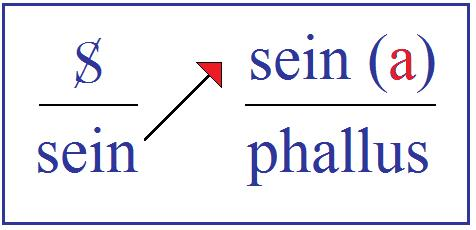

# Leçon 09 | 24 Janvier 1962

<!-- source-url: http://staferla.free.fr/S9/S9 L'IDENTIFICATION.docx -->
<!-- seminar: s9 -->
<!-- lesson: 09 -->

<!-- id: s9-09-0001 -->

J’éprouve une certaine difficulté à reprendre avec vous ce que je mène, ces traces subtiles, légères, du fait qu’hier soir[^74] j’ai dû dire des choses plus appuyées. L’important pour ce qui nous concerne, pour la suite de notre séminaire, c’est que ce que j’ai dit hier soir concerne évidemment la fonction de l’*objet*, du *petit(a)*, dans l’identification du sujet, c’est-à-dire quelque chose qui n’est pas immédiatement à la portée de notre main, qui ne va pas être résolu tout de suite, sur lequel hier soir j’ai donné, si je puis dire, une indication anticipée en me servant du thème des trois coffrets.

<!-- id: s9-09-0002 -->

Cela éclaire beaucoup, ce thème des trois coffrets, mon enseignement, parce que si vous ouvrez ce qu’on appelle bizarrement les *Essais de Psychanalyse appliquée*[^75], et que vous lisez l’article sur les trois coffrets, vous vous apercevez que *vous restez un petit peu sur votre faim*, en fin de compte vous ne savez pas très bien où il veut en venir, notre *père* FREUD.

<!-- id: s9-09-0003 -->

Je crois qu’avec ce que je vous ai dit hier soir, qui identifie les trois coffrets à la demande, thème auquel je pense vous êtes dès longtemps rompus, qui dit que dans chacun des trois coffrets - sans cela il n’y aurait pas de devinette, il n’y aurait pas de problème - il y a le*(a)*, *l’objet* qui est, en tant qu’il nous intéresse, nous analystes, mais pas du tout forcément l’objet qui correspond à la demande. Pas du tout forcément non plus le contraire, parce que sans cela il n’y aurait pas de difficulté.

<!-- id: s9-09-0004 -->

Cet objet, c’est l’objet du désir. Et le désir, où est-il ? Il est au-dehors, et là où il est vraiment, le point décisif : c’est vous l’analyste, pour autant que votre désir ne doit pas se tromper sur l’objet du désir du sujet. Si les choses n’étaient pas comme cela, il n’y aurait pas de mérite à être analyste.

<!-- id: s9-09-0005 -->

Il y a une chose, que je vous dis aussi en passant, c’est que j’ai quand même mis l’accent, devant un auditoire supposé non savoir, sur quelque chose dans lequel je n’ai peut-être pas mis ici assez mes lourds et gros sabots, c’est-à-dire que le système de l’inconscient, le système Ψ est un système partiel.

<!-- id: s9-09-0006 -->

Une fois de plus j’ai répu­dié - avec évidemment plus d’énergie que de motifs, vu que je devais aller vite - la référence à la totalité, ce qui n’exclut pas qu’on parle de partiel. J’ai insisté, dans ce système, sur son caractère *extra-plat*, sur son caractère de *surface* sur lequel FREUD insiste à tours de bras tout le temps. On ne peut qu’être étonné que cela ait engendré la métaphore de « *la psychologie des profondeurs* ». C’est tout à fait par hasard que, tout à l’heure avant de venir, je retrouvais une note que j’avais prise du « *Moi et du Ça* » :

<!-- id: s9-09-0007 -->

« *Le moi est avant tout une entité corporelle, non seule­ment une entité toute en surface,*

<!-- id: s9-09-0008 -->

*mais une entité correspondant à la projection d’une surface* ».[^76]

<!-- id: s9-09-0009 -->

C’est un rien ! Quand on lit FREUD, on le lit toujours d’une cer­taine façon que j’appellerai la façon sourde.

<!-- id: s9-09-0010 -->

Reprenons maintenant notre bâton de pérégrin, reprenons où nous en sommes, où je vous ai laissés la dernière fois. À savoir sur l’idée que *la négation*, si elle est bien quelque part au cœur de notre problème qui est celui *du sujet*, c’est pas déjà tout de suite - rien qu’à la prendre dans sa phénoménologie - la chose la plus simple à manier. Elle est en bien des endroits, et puis il arrive tout le temps qu’elle nous glisse entre les doigts. Vous en avez vu un exemple la dernière fois : pendant un instant - à propos du *non nullus non mendax -* vous m’avez vu mettre ce « *non* », le retirer et le remettre. Cela se voit tous les jours.

<!-- id: s9-09-0011 -->

On m’a signalé dans l’intervalle que dans les discours de celui que quelqu’un dans un billet - *mon pauvre cher ami* MERLEAU-PONTY - appelait « *le grand homme qui nous gouverne* », dans un discours que ledit « *grand homme* » a prononcé, on entend : « *On ne peut pas ne pas croire que les choses se passeront sans mal* ». Là-dessus : exégèse... Qu’est-ce qu’il veut dire ? L’intéressant c’est pas tellement ce qu’il veut *dire*, c’est que : manifestement nous entendons très bien, justement ce qu’il veut dire, et que si nous l’analysons logiquement nous voyons qu’il dit le contraire. C’est une très jolie formule dans laquelle on glisse sans cesse pour dire à quelqu’un : « *vous n’êtes pas sans ignorer*... ».

<!-- id: s9-09-0012 -->

Ce n’est pas vous qui avez tort, c’est le rapport du sujet au signifiant qui de temps en temps émerge. Ce n’est pas simplement des menus paradoxes, des *lapsus* que j’épingle au passage : nous les retrouverons, ces formules, au bon détour, et je pense vous donner la clef de ce pourquoi « *vous n’êtes pas sans ignorer*... » veut dire ce que vous voulez dire. Pour que vous vous y reconnaissiez, je peux vous dire que c’est bien à le sonder que nous trouverons le juste poids, la juste inclination de cette balance où je place devant vous le rap­port du névrosé à *l’objet phallique* quand je vous dis :

<!-- id: s9-09-0013 -->

« *pour l’attraper ce rapport, il faut dire : il n’est pas sans l’avoir* ».

<!-- id: s9-09-0014 -->

Cela ne veut évidemment pas dire qu’il l’a. S’il l’avait, il n’y aurait pas de question.

<!-- id: s9-09-0015 -->

Pour en arriver là, repartons d’un petit rappel de la phénoménologie de notre névrosé concernant le point où nous en sommes, son rapport au *signifiant*. Depuis quelques fois, je commence à vous faire saisir ce qu’il y a d’*écriture* dans l’affaire du *signifiant*, d’*écriture originelle*.

<!-- id: s9-09-0016 -->

Il a bien dû quand même vous venir à l’esprit que c’est essentiellement à ça que l’obsédé a affaire tout le temps : *ungeschehen machen*, *faire que ça soit non-advenu*. Qu’est-ce que ça veut dire ? Qu’est-ce que ça concerne ? Manifestement, ça se voit dans son com­portement, ce qu’il veut éteindre, c’est ce que l’*annaliste* écrit tout au long de son histoire, l’*annaliste* avec deux « *n* » qu’il a en lui : c’est les *annales* de l’affaire qu’il voudrait bien effacer, gratter, éteindre.

<!-- id: s9-09-0017 -->

Par quel biais nous atteint le discours de Lady MACBETH quand elle dit que toute l’eau de la mer n’effacerait pas cette petite tache, si ce n’est point par quelque écho qui nous guide au cœur de notre sujet ? Seulement voilà, en effaçant le signifiant - comme il est clair que c’est de cela qu’il s’agit, à sa façon de faire, à sa façon d’effacer, à sa façon de gratter ce qui est ins­crit - ce qui est beaucoup moins clair pour nous, parce que nous en savons un petit bout de plus que les autres, c’est ce qu’il veut obtenir par là.

<!-- id: s9-09-0018 -->

C’est en cela qu’il est instructif de continuer sur cette route où nous sommes, où je vous mène, en ce qui concerne *comment ça vient un signifiant comme tel* ? Si ça a un tel rapport avec le fondement du sujet, s’il n’y a pas d’autre sujet pen­sable que ce quelque chose X de naturel en tant qu’il est *marqué du signifiant*, il doit tout de même bien y avoir à ça un ressort.

<!-- id: s9-09-0019 -->

Nous n’allons pas nous conten­ter de cette sorte de vérité aux yeux bandés. *Le sujet*, il est bien clair qu’il faut que nous le trouvions *à l’origine du signifiant* lui-même. « *Pour sortir un lapin d’un chapeau* »...

<!-- id: s9-09-0020 -->

> c’est comme cela que j’ai commencé à semer le scandale dans mes propos proprement analytiques.
>
> Le pauvre cher homme défunt, et bien tou­chant en sa fragilité, était littéralement exaspéré
>
> par ce rappel que je faisais avec beaucoup d’insistance, parce qu’à ce moment c’est des formules utiles

<!-- id: s9-09-0021 -->

...que « *Pour faire sortir un lapin d’un chapeau* », il fallait l’y avoir préalablement mis.

<!-- id: s9-09-0022 -->

Il doit en être de même concernant le *signifiant*, et c’est ce qui justifie cette définition du *signifiant* que je vous donne, cette distinction d’avec *le signe,* c’est que :

<!-- id: s9-09-0023 -->

- si *le signe représente quelque chose pour quelqu’un*,

<!-- id: s9-09-0024 -->

- *le signifiant* est autrement articulé : *il représente le sujet pour un autre signifiant*.

<!-- id: s9-09-0025 -->

Ceci, vous le verrez assez confirmé à tous les pas pour que vous n’en quittiez pas la rampe solide. Et s’il représente ainsi le sujet, c’est comment ?

<!-- id: s9-09-0026 -->

Revenons à notre point de départ, à notre signe, au point électif où nous pou­vons le saisir comme représentant quelque chose pour quelqu’un : dans *la trace*. Repartons de la trace, pour suivre notre petite affaire à la trace. Un pas, une trace, le pas de VENDREDI dans l’île de ROBINSON, émotion, *le cœur battant* devant cette *trace.* Tout ceci ne nous apprend rien, même si de ce *cœur* *battant* il résulte tout un piétinement autour de *la trace*. Cela peut arriver à n’importe quel croisement de traces animales.

<!-- id: s9-09-0027 -->

Mais si, survenant, je trouve la trace de ceci : qu’on s’est efforcé *d’effacer la trace*, ou si même je n’en trouve plus trace, de cet effort, si je suis revenu parce que je sais - je n’en suis pas plus fier pour ça - que j’ai laissé la trace, que je trouve que - sans aucun corrélatif qui permette de rattacher cet effacement à un effacement général des traits de la configuration - on a bel et bien effacé la trace comme telle, là je suis sûr que j’ai affaire à un sujet réel. Observez que, dans cette disparition de la trace, ce que le sujet cherche à faire disparaître, c’est son passage de sujet à lui. La disparition est redoublée de la disparition visée qui est celle de l’acte lui-même de *faire disparaître*.

<!-- id: s9-09-0028 -->

Ceci n’est pas un mauvais trait pour que nous y reconnaissions le passage du sujet quand il s’agit de *son rapport au signifiant*, dans la mesure où vous savez déjà que tout ce que je vous enseigne de la structure du sujet, tel que nous essayons de l’articuler à partir de *ce rapport au signifiant*, converge vers l’émergence de ces moments de *fading* proprement liés à *ce battement en éclipse de ce qui n’apparaît que pour dispa­raître*, et reparaît pour de nouveau disparaître, ce qui est la marque du sujet comme tel.

<!-- id: s9-09-0029 -->

Ceci dit, si la trace effacée, le sujet en entoure la place d’un cerne - quelque chose qui dès lors le concerne lui, le repère de l’endroit où il a trouvé la trace - eh bien, vous avez là la naissance du signifiant. Ceci implique - tout ce proces­sus comportant *le retour du dernier temps sur le premier* - qu’il ne saurait y avoir d’articulation d’un signifiant sans ces *trois temps*. Une fois le signifiant consti­tué, il y en a forcément deux autres avant :

<!-- id: s9-09-0030 -->

- *Un signifiant*, c’est *une marque*, *une trace*, *une écriture*, mais on ne peut pas le lire seul.

<!-- id: s9-09-0031 -->

- *Deux signifiants*, c’est un *pataquès*, un *coq à l’âne*.

<!-- id: s9-09-0032 -->

- *Trois signifiants*, c’est le retour de ce dont il s’agit, c’est-­à-dire du premier.

<!-- id: s9-09-0033 -->

C’est quand « *le pas* », marqué dans la trace est transformé - dans la vocalise de qui le lit - en « *pas* », que ce « *pas* » \- à condition qu’on oublie qu’il veut dire « *le pas *» - peut servir d’abord, dans ce qu’on appelle le phonétisme de l’écriture, à représenter « *pas* », et du même coup à transformer « *la trace de pas »* éventuellement en le « *pas de trace »*.

<!-- id: s9-09-0034 -->

Je pense que vous entendez au passage *la même ambiguïté* dont je me suis servi quand je vous ai parlé, *à propos du mot d’esprit*, du « *pas de sens* », jouant sur l’ambiguïté du mot « *sens* », avec ce saut, ce franchissement qui nous prend là où naît la rigolade quand nous ne savons pas pourquoi un mot nous fait rire, cette transformation subtile, cette pierre rejetée qui, d’être reprise, devient la pierre d’angle... et je ferai volontiers le jeu de mots avec le « π.r » de la formule du cercle, parce qu’aussi bien c’est en elle, je vous l’ai annoncé l’autre jour en introduisant la √-1, que nous verrons que se mesure si je puis dire, l’angle vectoriel du sujet par rapport au fil de *la chaîne signifiante* ...c’est là que nous sommes suspendus, et c’est là que nous devons un peu nous habituer à nous déplacer : sur *une sub­stitution par où ce qui a un sens se transforme en équivoque et retrouve son sens*.

<!-- id: s9-09-0035 -->

Cette articulation sans cesse tournante *du jeu du langage*, c’est dans ses syncopes mêmes que nous avons à repérer, dans ses diverses fonctions, le sujet. Les illustrations ne sont jamais mauvaises pour adopter un *œil mental* où *l’imaginaire* joue un grand rôle. C’est pour ça que - même si c’est un détour - je ne trouve pas mauvais de vous, rapidement, tracer une petite remarque, simplement parce que je la trouve à ce niveau dans mes notes. Je vous ai parlé à plus d’une reprise, à propos du signifiant, du caractère chinois, et je tiens beaucoup à désen­voûter pour vous l’idée que son origine est une figure imitative. Il y en a un exemple, que je n’ai pris que parce que c’est lui qui me servait le mieux : j’ai pris le premier de celui qui est articulé dans ces exemples, ces formes archaïques, dans l’ouvrage de KARLGREN[^77] qui s’appelle *Grammata serica*, ce qui veut dire exacte­ment : les signifiants chinois.

<!-- id: s9-09-0036 -->

Le premier dont il se sert sous sa forme moderne est celui-ci, c’est le caractère « *kè* » : 可 qui veut dire *pouvoir* \[capacité, permettre\] dans le *Shuowén* 说文, qui est un ouvrage d’érudit, à la fois précieux pour nous pour son caractère relativement ancien, mais qui est déjà très érudit, c’est-à-dire tramé d’interprétations, sur les­quelles nous pouvons avoir à reprendre. Il semble que ce ne soit pas sans raison que nous puissions nous fier à la racine qu’en donne le commentateur, et qui est bien jolie. C’est à savoir qu’il s’agit d’une schématisation du heurt de la colonne d’air telle qu’elle vient à pousser, dans l’occlusive gutturale, contre l’obstacle que lui oppose l’arrière de la langue contre le palais. Ceci est d’autant plus séduisant que, si vous ouvrez un ouvrage de phonétique, vous trouverez une image qui est à peu près celle-là :

<!-- id: s9-09-0037 -->

丁

<!-- id: s9-09-0038 -->

pour vous traduire le fonctionnement de l’occlusive. Et avouez que ce n’est pas mal que ce soit ça :

<!-- id: s9-09-0039 -->

可

<!-- id: s9-09-0040 -->

qui soit choisi pour figurer le mot « *pouvoir* », la possibilité, la fonction axiale introduite dans le monde par l’avène­ment du sujet au beau milieu du *réel*. L’ambiguïté est totale, car un très grand nombre de mots s’articulent *kě* en chi­nois, dans lesquels ceci :

<!-- id: s9-09-0041 -->

丁

<!-- id: s9-09-0042 -->

nous servira de phonétique. À ceci près :

<!-- id: s9-09-0043 -->

口

<!-- id: s9-09-0044 -->

\[*kou*\], qui les complète, comme présentifiant le sujet à l’armature signifiante, et qui - sans ambiguïté et dans tous les caractères - est la représentation de la bouche. Mettez ce signe au-dessus :

<!-- id: s9-09-0045 -->

大

<!-- id: s9-09-0046 -->

c’est le signe *dà* qui veut dire grand. Il a manifestement quelque rapport avec *la petite forme hu­maine en général dépourvue de bras* :

<!-- id: s9-09-0047 -->

人

<!-- id: s9-09-0048 -->

Ici, comme c’est d’un grand qu’il s’agit, il a des bras. Ceci :

<!-- id: s9-09-0049 -->

可

<!-- id: s9-09-0050 -->

n’a rien à faire avec ce qui se passe quand vous avez ajouté ce signe au signifiant précédent :

<!-- id: s9-09-0051 -->

大

<!-- id: s9-09-0052 -->

Cela se lit désor­mais « *Jī* » :

<!-- id: s9-09-0053 -->

奇

<!-- id: s9-09-0054 -->

Mais ceci conserve la trace d’une prononciation ancienne dont nous avons des attestations grâce à l’usage de ce terme à la rime dans les anciennes poésies, nommément celles de 詩經 [*Shì jīng*](http://etext.virginia.edu/chinese/shijing/AnoShih.html)[^78] qui est un des exemples les plus fabu­leux des *mésaventures littéraires*, puisqu’il a eu le sort de devenir le support de toutes sortes d’élucubrations moralisantes, d’être la base de tout un enseigne­ment très *entortillé* des mandarins sur les devoirs des souverains, du peuple et du *tutti quanti*, alors qu’il s’agit manifestement de chansons d’amour d’origine paysanne.

<!-- id: s9-09-0055 -->

Un peu de pratique de la littérature chinoise - je ne cherche pas à vous faire croire que j’en ai une grande, je ne me prends pas pour WIEGER qui, lorsqu’il fait allusion à son expérience de la Chine - il s’agit d’un para­graphe que vous pouvez retrouver dans les livres, *à la portée de tous*, du Père [WIEGER](http://classiques.uqac.ca/classiques/wieger_leon/wieger_leon.html)[^79]. Quoi qu’il en soit, d’autres que lui ont éclairé ce chemin, nommément [Marcel GRANET](http://classiques.uqac.ca/classiques/granet_marcel/granet_marcel.html)[^80], dont après tout vous ne perdriez rien à ouvrir les beaux livres sur les *Danses et légendes* et sur les *Fêtes anciennes de la Chine*.

<!-- id: s9-09-0056 -->

Avec un peu d’efforts vous pourrez vous familiariser avec cette dimension vraiment fabu­leuse, qui apparaît de ce qu’on peut faire avec quelque chose qui repose sur les formes les plus élémentaires de l’articulation signifiante. Par chance, *dans cette langue les mots sont monosyllabiques*. Ils sont superbes, invariables, cubiques, vous ne pouvez pas vous y tromper. Ils s’*identifient* au signifiant, c’est le cas de le dire. Vous avez des groupes de quatre vers, chacun composé de quatre syl­labes. La situation est simple.

<!-- id: s9-09-0057 -->

Si vous les voyez, et pensez que de ça on peut faire tout sortir, même une doctrine métaphysique qui n’a aucun rapport avec la signification originelle, cela commencera, pour ceux qui n’y seraient pas encore, à vous ouvrir l’esprit. C’est pourtant comme cela, pendant des siècles on a fait l’enseignement de la morale et de la politique sur des ritournelles qui signifiaient dans l’ensemble « *Je voudrais bien baiser avec toi* ». Je n’exagère rien, allez-y voir. Ceci  veut dire « *jī* » :

<!-- id: s9-09-0058 -->

奇

<!-- id: s9-09-0059 -->

qu’on commente : « *grand pouvoir, énorme »*. Cela n’a bien entendu absolument aucun rapport avec cette conjonction \[*i.e* la conjonction de 可 et de 大 \]. *Jī*, ne veut pas tellement plus dire grand pouvoir que ce petit mot pour lequel en français il n’y a pas vraiment quelque chose qui nous satisfasse : je suis forcé de le traduire par l’« *impair* », au sens que le mot « *impair* » peut prendre : *de glissement, de faute, de faille, de chose qui ne va pas, qui boîte*, en anglais si gentiment illustré par le mot « *odd* ». Et comme je vous le disais tout à l’heure, c’est ce qui m’a lancé sur le *Shìjīng* 詩經. À cause du *Shìjīng*, nous savons que c’était très proche du « *kě* » :

<!-- id: s9-09-0060 -->

可

<!-- id: s9-09-0061 -->

au moins en ceci, c’est qu’il y avait une gutturale dans la langue ancienne qui donne l’autre implantation de l’usage de ce signifiant :

<!-- id: s9-09-0062 -->

奇

<!-- id: s9-09-0063 -->

pour désigner le phonème « *qí* ». Si vous ajoutez cela devant,

<!-- id: s9-09-0064 -->

木

<!-- id: s9-09-0065 -->

qui est *un déterminatif*, celui de l’arbre, et qui désigne tout ce qui est de bois, vous aurez, une fois que les choses en sont là, un signe qui désigne la chaise :

<!-- id: s9-09-0066 -->

椅

<!-- id: s9-09-0067 -->

Cela se dit « *yǐ* », et ainsi de suite. Ça conti­nue comme cela, cela n’a pas de raison de s’arrêter. Si vous mettez ici, à la place du signe de l’arbre, le signe du cheval \[*mà*\]

<!-- id: s9-09-0068 -->

马

<!-- id: s9-09-0069 -->

cela veut dire s’installer à cali­fourchon.

<!-- id: s9-09-0070 -->

骑

<!-- id: s9-09-0071 -->

Ce petit détour - je le considère - a son utilité, pour vous faire voir que le rap­port de la lettre au langage n’est pas quelque chose qui soit à considérer dans une ligne évolutive.

<!-- id: s9-09-0072 -->

On ne part pas d’une origine épaisse, sensible, pour dégager de là une forme abstraite. Il n’y a rien qui ressemble à quoi que ce soit qui puisse être conçu comme parallèle au processus dit du concept, même seulement de la généralisation. On a une suite d’alternances où le signifiant revient battre l’eau, si je puis dire, du flux par les battoirs de son moulin, sa roue remontant chaque fois quelque chose qui ruisselle, pour de nouveau retomber, s’enrichir, se com­pliquer, sans que nous puissions jamais à aucun moment saisir ce qui domine, du départ concret ou de l’équivoque.

<!-- id: s9-09-0073 -->

Voilà qui va nous mener au point où aujourd’hui le pas que j’ai à vous faire faire : *une grande part des illusions* qui nous arrêtent net, *des adhérences imagi­naires* - dont peu importe que tout le monde y reste plus ou moins les pattes prises comme des mouches, mais pas les analystes *- sont très précisément liées à ce que j’appellerai « les illusions de la logique formelle* ». *La logique formelle* est une science fort utile, comme j’ai essayé la dernière fois de vous en pointer l’idée, à condition que vous vous aperceviez qu’elle vous pervertit en ceci : que puisqu’elle est *la logique « formelle »*, elle devrait vous interdire à tout instant de lui donner le moindre sens.

<!-- id: s9-09-0074 -->

*C’est* bien entendu ce à quoi avec le temps on en est venu. Mais les grands sérieux, les braves, les honnêtes de la logique symbolique connue depuis une cinquantaine d’années, ça leur donne, *je vous assure*, un sacré mal, parce que c’est pas facile de construire une logique telle qu’elle doit être - si elle répond vraiment à son titre de « *logique formelle » -* en ne s’appuyant strictement *que sur le signifiant*, en s’interdisant tout rapport, et donc tout appui intuitif sur ce qui peut s’insurger du *signifié* dans le cas où nous faisons des fautes.

<!-- id: s9-09-0075 -->

En général c’est là-dessus qu’on se repère : je raisonne mal, parce que dans ce cas il en résulterait n’importe quoi : ma grand-mère la tête à l’envers. Qu’est-ce que cela peut nous faire ? Ce n’est pas en général avec ça qu’on nous guide, parce que nous sommes très intuitifs. Si on fait de la logique formelle, on ne peut que l’être.

<!-- id: s9-09-0076 -->

Or l’amusant est que le livre de base de *la logique symbolique*, les *Principia Mathematica* de Bertrand RUSSELL et WITHEHEAD[^81], arrive à ce quelque chose qui est tout près d’être le but, la sanction d’une logique symbolique digne de ce nom : enserrer tous les besoins de la création mathématique. Mais les auteurs eux-mêmes tout près s’arrêtent, considérant comme une contradiction de nature à mettre en cause *toute la logique mathématique* ce « *paradoxe* » dit « *de Bertrand Russell* ». Il s’agit de quelque chose dont le biais frappe la valeur de *la théorie* dite *des ensembles*.

<!-- id: s9-09-0077 -->

En quoi se distingue un *ensemble* d’une définition de *classe*, la chose est laissée dans une relative ambiguïté puisque ce que je vais vous dire - et qui est le plus généra­lement admis par n’importe quel mathématicien - à savoir que ce qui dis­tingue *un ensemble* de cette forme de la définition de ce qui s’appelle *une classe*, ce n’est rien d’autre que l’ensemble sera défini par des formules qu’on appelle *axiomes*, qui seront posées sur le tableau noir en des *symboles* qui seront réduits à des *lettres* auxquelles s’adjoignent quelques *signifiants* supplémentaires indi­quant des relations. Il n’y a absolument aucune autre spécification de cette *logique* dite *symbolique* par rapport à la logique traditionnelle, sinon cette réduction à des *lettres*. Je vous le garantis, vous pouvez m’en croire sans que j’aie plus à m’engager dans des exemples.

<!-- id: s9-09-0078 -->

Quelle est donc la vertu - forcément qui est bien quelque part - pour que ce soit en raison de cette *seule différence* qu’ait pu être développé un monceau de conséquences, dont je vous assure que *l’incidence dans le développement* de quelque chose qu’on appelle les *mathématiques,* n’est pas mince, par rapport à l’appareil dont on a disposé pendant des siècles, et dont *le compliment qu’on lui a fait* - qu’il n’a pas bougé entre ARISTOTE et KANT - *se retourne* ?

<!-- id: s9-09-0079 -->

C’est bien - si tout de même les choses se sont mises à cavaler comme elles l’ont fait, car *Principia Mathematica* fait deux très très gros volumes, et ils n’ont qu’un inté­rêt fort mince, mais enfin *si le compliment se retourne* - c’est bien que l’appa­reil auparavant, pour quelque raison, se trouvait singulièrement stagnant. Alors à partir de là, comment les auteurs viennent-ils à s’étonner de ce qu’on appelle « *le paradoxe de Russell »* ?

<!-- id: s9-09-0080 -->

*Le paradoxe de RUSSELL* est celui-ci, on parle de « *L’ensemble de tous les ensembles qui ne se comprennent pas eux-mêmes* ». Il faut que j’éclaire un peu cette histoire qui peut vous sembler au premier abord plutôt sèche. Je vous l’indique tout de suite : si je vous y intéresse - du moins je l’espère - c’est avec cette visée qu’il y a le plus étroit rapport - et pas seulement homonymique, juste­ment parce qu’il s’agit de signifiant et qu’il s’agit par conséquent de « *ne pas* *com­prendre *» - avec la position du sujet analytique, en tant que lui aussi, dans un autre sens du mot « *com­prendre* » - et si je vous dis de « *ne pas* *com­prendre *», *c’est pour que vous puissiez comprendre* de toutes les façons *que lui aussi* « *ne se com­prend pas lui-même *». Passer par là n’est pas inutile, vous allez le voir, car nous allons sur cette route pouvoir critiquer *la fonction de notre objet*.

<!-- id: s9-09-0081 -->

Mais arrêtons-­nous un instant sur ces ensembles qui ne se comprennent pas eux-mêmes. Il faut évidemment, pour concevoir ce dont il s’agit, partir - puisque nous ne pouvons quand même pas, dans la communication, ne pas nous faire des conces­sions de références intuitives, parce que les références intuitives, vous les avez déjà, il faut donc les bousculer pour en mettre d’autres.

<!-- id: s9-09-0082 -->

Comme vous avez l’idée qu’il y a « *une classe* », et qu’il y a « *une classe mammifère* », il faut tout de même que j’essaie de vous indiquer qu’il faut se référer à autre chose. Quand on entre dans la catégorie des *ensembles*, il faut se référer au classement bibliographique cher à certains, classement composé de décimales ou autre, mais quand on a quelque chose d’écrit, il faut que ça se range quelque part, il faut savoir comment auto­matiquement le retrouver.

<!-- id: s9-09-0083 -->

Alors, prenons « *un ensemble qui se comprend lui-même* ». Prenons par exemple l’étude des humanités dans un classement bibliographique. Il est clair qu’il faudra mettre à l’intérieur les travaux des humanistes sur les humanités. L’ensemble de l’étude des humanités doit comprendre tous les travaux concernant l’étude des humanités en tant que telles.

<!-- id: s9-09-0084 -->

Mais consi­dérons maintenant « *les ensembles qui ne se comprennent pas eux-mêmes* », cela n’est pas moins concevable, c’est même le cas le plus ordinaire. Et puisque nous sommes théoriciens des ensembles, et qu’il y a déjà *une classe* de « *l’ensemble des ensembles qui se comprennent eux-mêmes* », il n’y a vraiment nulle objection à ce que nous fassions *la classe* opposée - j’emploie « *classe* » ici parce que c’est bien là que l’ambiguïté va résider - *la classe* « *des ensembles qui ne se comprennent pas eux-mêmes* » : « *l’ensemble de tous les ensembles qui ne se comprennent pas eux-mêmes* ».

<!-- id: s9-09-0085 -->

Et c’est là que les logiciens commencent à se casser la tête, à savoir qu’ils se disent : cet « *ensemble de tous les ensembles qui ne se comprennent pas eux-mêmes* » : est-ce qu’il se comprend lui-même, ou est-ce qu’il ne se comprend pas ? Dans un cas comme dans l’autre il va choir dans la contradiction :

<!-- id: s9-09-0086 -->

- car si, comme selon l’apparence, il se comprend lui-même, nous voici en *contradiction* avec le départ qui nous disait qu’il s’agissait d’ensembles qui ne se comprennent pas eux-mêmes.

<!-- id: s9-09-0087 -->

- D’autre part, s’il ne se comprend pas, comment l’excepter jus­tement de ce que nous donne cette définition, à savoir qu’il ne se comprend pas lui–même ?

<!-- id: s9-09-0088 -->

Cela peut vous sembler assez « *bébé* », mais le fait que ça frappe au point de les *arrêter*, les logiciens...

<!-- id: s9-09-0089 -->

> qui ne sont pas précisément des gens de nature à s’arrêter à une vaine difficulté, et s’ils y sentent quelque chose qu’ils peuvent appeler une contradiction mettant en cause tout leur édifice ...c’est bien parce qu’il y a quelque chose qui doit être résolu et qui concerne - si vous voulez bien m’écouter - rien d’autre que ceci, qui concerne la seule chose que les logiciens en question n’ont pas exactement vue, à savoir *que la lettre dont ils se servent, c’est quelque chose qui a en soi-même des pouvoirs, un ressort auquel ils ne semblent point tout à fait accoutumés*.

<!-- id: s9-09-0090 -->

Car - si nous illustrons ceci en application de ce que nous avons dit qu’il ne s’agit de rien d’autre que de l’usage systématique d’une *lettre -* de réduire, de réserver à *la lettre* sa fonction signifiante pour faire sur elle, et sur elle seulement, reposer tout l’édifice logique, nous arrivons à ce quelque chose de très simple, que c’est tout à fait et tout simplement, que cela revient à ce qui se passe quand nous chargeons *la lettre (a)* par exemple - si nous nous mettons à spéculer sur l’alphabet - *de représenter comme lettre (a) toutes les autres lettres de l’alphabet*.

<!-- id: s9-09-0091 -->

De deux choses l’une : ou les autres lettres de l’alphabet, nous les énumérons de *b* à *z* en quoi *la lettre (a)* les représentera sans ambiguïté sans pour autant se comprendre elle-même, mais il est clair d’autre part que, représentant ces lettres de l’alphabet en tant que lettre, elle vient tout naturellement, je ne dirai même point enrichir, mais compléter à la place dont nous l’avons tirée, exclue, la série des lettres, et simplement en ceci que, si nous partons de ce que *a* - c’est là notre point de départ concernant l’identification - foncièrement n’est point *a*, il n’y a là aucune difficulté : la lettre *a*, à l’intérieur de la parenthèse où sont orientées toutes les lettres qu’elle vient symboliquement subsumer, n’est pas le même *a* et est en même temps le même.

<!-- id: s9-09-0092 -->

Il n’y a là aucune espèce de difficulté. Il ne devrait y en avoir d’autant moins que ceux qui en voient une sont juste­ment ceux-là qui ont inventé la notion d’« *ensemble* » pour faire face aux déficiences de la notion de « *classe* », et *par conséquent* soupçonnant qu’il doit y avoir autre chose dans la fonction de *l’ensemble* que dans la fonction de *la classe*. Mais ceci nous intéresse, car qu’est-ce que cela veut dire ? Comme je vous l’ai indiqué hier soir, *l’objet métonymique du désir*, ce qui, dans tous les objets, représente ce *petit(a)* électif où le sujet se perd, quand cet objet vient au jour, métaphorique, quand nous venons à le substituer au sujet, qui dans la demande est venu à se syncoper, à s’évanouir - *pas de trace *: S – nous le révélons, le signifiant de ce sujet, nous lui donnons son nom : *le bon objet, le sein de la mère, la mamme*.

<!-- id: s9-09-0093 -->

Voilà la métaphore dans laquelle, disons-nous, sont prises toutes les identifications articulées de la demande du sujet. Sa demande est orale, c’est le sein de la mère qui les prend dans sa parenthèse. C’est le *a* qui donne leur valeur à toutes ces unités qui vont s’additionner dans la chaîne signifiante : *a* (1+1+1...).

<!-- id: s9-09-0094 -->

La question que nous avons à poser c’est établir la *différence* qu’il y a de cet usage que nous faisons de la mamme, avec la fonction qu’il prend dans la définition, par exemple, de la classe « mammifères ». Le mammifère se reconnaît à ceci qu’il a des mammes.

<!-- id: s9-09-0095 -->

Il est, entre nous, assez étrange que nous soyons aussi peu renseignés sur ce qu’on en fait effectivement dans chaque espèce. *L’étholo­gie des mammifères* est encore rudement à la traîne puisque nous en sommes sur ce sujet - comme pour *la logique formelle* - à peu près pas plus loin que le niveau d’ARISTOTE - excellent ouvrage : l’[*Histoire des Animaux*](http://remacle.org/bloodwolf/philosophes/Aristote/tableanimaux.htm) !

<!-- id: s9-09-0096 -->

Mais nous, est­-ce que c’est cela que veut pour nous dire le signifiant « *mamme* », pour autant qu’il est l’objet autour de quoi nous substantifions le sujet dans un certain type de relation dite « prégénitale » ?

<!-- id: s9-09-0097 -->

Il est bien clair que nous en faisons un tout autre usage, beaucoup plus proche de la manipulation de la lettre « *E* » dans notre *paradoxe des ensembles*, et pour vous le montrer, je vais vous faire voir ceci : *a* (1+1+1...), c’est que, parmi ces « 1 » de la demande dont nous avons révélé la signifiance concrète, est-ce qu’il y a ou non le sein lui-même ?

<!-- id: s9-09-0098 -->

En d’autres termes, quand nous parlons de fixation orale, le sein latent, l’actuel - celui après lequel votre sujet fait « *ah ! ah ! ah !* » - est-il *mammaire* ? Il est bien évident qu’il ne l’est pas, parce que vos *oraux* qui ado­rent les seins, ils adorent les seins parce que ces seins sont un *phallus*. Et c’est même pour ça - parce qu’il est possible que le sein soit aussi *phallus -* que Mélanie KLEIN le fait apparaître tout de suite aussi vite comme le sein, dès le départ, en nous disant qu’après tout c’est un petit sein plus commode, plus portatif, plus gentil.

<!-- id: s9-09-0099 -->

Vous voyez bien que poser ces distinctions structurales peut nous mener quelque part, dans la mesure où le sein refoulé réémerge, ressort dans le symp­tôme, ou même simplement dans un coup que nous n’avons pas autrement qua­lifié : la fonction sur *l’échelle perverse* - à produire - de ce quelque chose d’autre qui est l’évocation de l’objet *phallus*. La chose s’inscrit ainsi :

<!-- id: s9-09-0100 -->

<!-- id: s9-09-0101 -->

Qu’est-ce que l’*(a)* ? Mettons à sa place la petite balle de ping-pong, c’est-à-dire rien, n’importe quoi, n’importe quel support du jeu d’alternance du sujet dans le *fort-da*. Là vous voyez qu’il ne s’agit strictement de rien d’autre que du pas­sage du *phallus* de *a+* à *a –* et que par là nous soyons dans *le rapport d’identification*, puisque nous savons que dans ce que le sujet *assimile*, c’est lui dans sa frustration, nous savons que le rapport de l’S à ce 1/*a* - lui « 1 », en tant qu’assumant la signification de l’Autre comme tel - a le plus grand rapport avec la réalisation de l’alternance (*a*).(–*a*)}, ce *produit* de *a* par –*a* qui *formellement* fait un –*a*2.

<!-- id: s9-09-0102 -->

Nous serrerons pourquoi *une négation est irréductible*. Quand il y a *affir­mation* et *négation* : *l’affirmation de la négation fait* *une négation, la négation de l’affirmation aussi.* Nous voyons là pointer dans cette formule même du –*a*2, nous retrouvons la nécessité de la mise en jeu, à la racine de ce produit, du √–1.

<!-- id: s9-09-0103 -->

Ce dont il s’agit, ce n’est pas simplement de la présence, ni de l’absence du *petit(a)*, mais de la conjonction des deux, de la coupure. C’est de la disjonction du *a* et du –*a* qu’il s’agit, et c’est là que le sujet vient à se loger comme tel, que l’identi­fication a à se faire avec ce quelque chose qui est l’objet du désir.

<!-- id: s9-09-0104 -->

C’est pour ça que le point où - vous le verrez - je vous ai amenés aujourd’hui est une articula­tion qui vous servira dans la suite.

## Notes

[^74]: Jacques Lacan : Conférence du 23-01-1962, «  *De ce que j'enseigne* ».

[^75]: S. Freud, 1913 : « *Le thème des trois coffrets* » in *Essais de psychanalyse appliquée*, Paris, Gallimard, 1976, p. 87.

[^76]: Cf. séminaire 1952-53 : *Les écrits techniques*…(05-05-1953).

[^77]:
    #  Bernhard Karlgren : Grammata Serica recensa, Script and Phonetics in Chinese and Sino-Japanese, Museum of Far Eastern Antiquities Stockholm 1957.

[^78]: Le Classique des vers, ou Livre des Odes (詩經, Cheu King, Shi Jing ou Shi) est un recueil d'environ trois cents chansons chinoises antiques dont la

    date de composition pourrait s’étaler des Zhou occidentaux au milieu des Printemps et des Automnes. Il contient les plus anciens exemples de poésie

    chinoise. C’est depuis les Han un des Cinq classiques au programme de la formation des futurs fonctionnaires.

[^79]: Leon Wieger (1856–1933) Missionaire jésuite, sinologue qui passa la plus grande partie de sa vie adulte en Chine, où il mourut. Il est l’auteur de

    nombreux ouvrages de compilation et de vulgarisation sur la Chine, , destinés d’abord à améliorer la connaissance des missionnaires en Chine sur leur

    pays de mission : Histoire des croyances religieuses et des opinions philosophiques en Chine, La Chine à travers les âges, Les pères du système taoiste,

    Textes historiques, Textes philosophiques, Caractères chinois, Folklore chinois moderne...

[^80]: Marcel Granet (1884–1940), sinologue et sociologue français majeur. Il fut professeur à l'École des Hautes Études et à l'École des Langues Orientales.

    Il est notamment l'auteur de : La religion des Chinois, 1922 , La civilisation chinoise. La vie publique et la vie privée, 1929 , La pensée chinoise, 1934.

[^81]: Bertrand Russell, Alfred North Whitehead : *Principia mathematica,* Cambridge University press, 1997.
