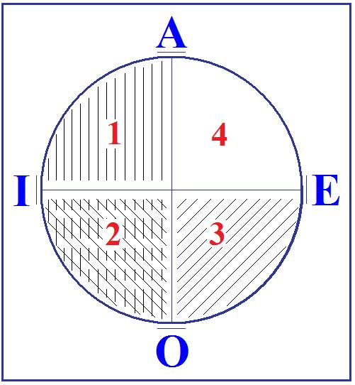
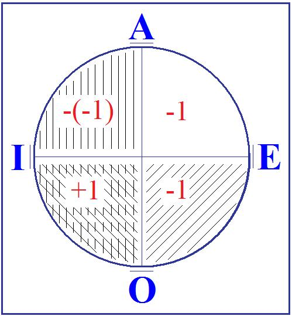
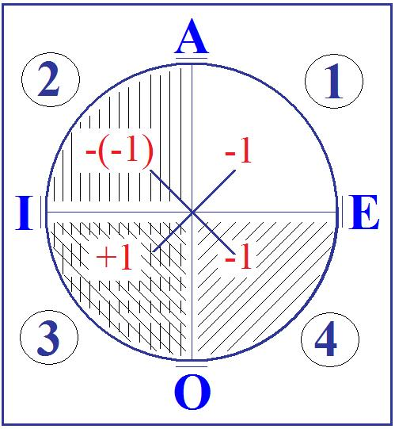
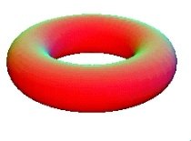
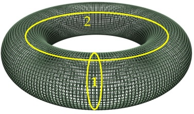
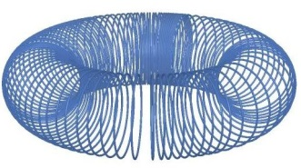
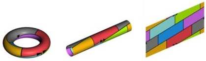
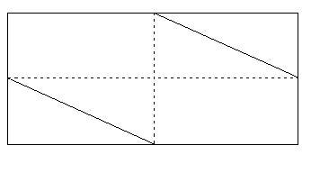

# Leçon 12 | 7 Mars 1962

<!-- source-url: http://staferla.free.fr/S9/S9 L'IDENTIFICATION.docx -->
<!-- seminar: s9 -->
<!-- lesson: 12 -->

<!-- id: s9-12-0001 -->

(*mort de* [*René* LAFORGUE](http://fr.wikipedia.org/wiki/Ren%C3%A9_Laforgue)*, cette nuit*)...

<!-- id: s9-12-0002 -->

En regroupant les pensées difficiles auxquelles nous sommes amenés, sur les­quelles je vous ai laissés la dernière fois, en commençant d’aborder par la priva­tion ce qui concerne le point le plus central de la structure de *l’identification du sujet,* en regroupant ces pensées je me prenais à repartir de quelque remarque introductive - il n’est pas de ma coutume de reprendre absolument *ex abrupto* sur le fil interrompu - cette remarque faisait écho à quelques-uns de ces étranges per­sonnages dont je vous parlais la dernière fois, que l’on appelait « *les philosophes* », grands ou petits.

<!-- id: s9-12-0003 -->

Cette remarque était à peu près celle-ci : en ce qui nous concerne, que le sujet se trompe, c’est assurément là, pour nous tous, analystes autant que philosophes, l’expérience inaugurale. Mais qu’elle nous intéresse, nous, c’est *manifestement* et je dirai *exclusivement* en ceci : qu’il peut *se dire*. Et *se dire* se démontre infiniment fécond, et plus spécialement fécond dans l’analyse qu’ailleurs, du moins on aime à le supposer.

<!-- id: s9-12-0004 -->

Or n’oublions pas que la remarque a été faite par d’éminents penseurs que si ce dont il s’agit en l’affaire, c’est du *réel*, la voie dite de *la rectification des moyens du savoir* pourrait bien - c’est le moins qu’on puisse dire - nous éloigner indéfiniment de ce qu’il s’agit d’atteindre, c’est-à-dire de *l’[absolu](http://www.cnrtl.fr/lexicographie/absolu?)*.

<!-- id: s9-12-0005 -->

Car s’il s’agit du *réel tout court*, il s’agit de cela : il s’agit d’atteindre ce qui est visé comme indépendant de toutes nos amarres \- dans la recherche de ce qui est visé, c’est ce que l’on appelle *absolu -* larguez tout à la fin, toute surcharge donc. C’est toujours une façon plus surchargée que tendent à établir les critères de la science, *dans la perspective philosophique j’entends...*

<!-- id: s9-12-0006 -->

> je ne parle pas de ces savants qui, eux, bien loin de ce que l’on croit, ne doutent guère.
>
> C’est dans cette mesure que nous sommes les plus sûrs de ce qu’ils *approchent* au moins le *réel*

<!-- id: s9-12-0007 -->

...dans la perspective philosophique de la critique de la science, nous devons - nous - faire quelques remarques, et nommément le terme dont nous devons le plus nous méfier, pour nous avancer dans cette critique, c’est du terme d’*appa­rence*, car l’apparence est bien loin d’être notre ennemie, tout au moins quand il s’agit du *réel*.

<!-- id: s9-12-0008 -->

Ce n’est pas moi qui ai fait incarner ce que je vous dis dans cette simple petite image :

<!-- id: s9-12-0009 -->

<!-- id: s9-12-0010 -->

c’est bien dans l’apparence de cette figure que m’est donnée la réalité du cube[^103], qu’elle me saute aux yeux comme réalité. À réduire cette image à la fonction d’illusion d’optique, je me détourne tout simplement du cube, c’est-à-dire de la réalité que cet artifice est fait pour vous montrer.

<!-- id: s9-12-0011 -->

Il en est de même pour la relation *à une femme*, par exemple. Tout approfondisse­ment *scientifique* de cette relation ira en fin de compte à celle des formules, comme celle célèbre que vous connaissez sûrement, du colonel BRAMBLE[^104], qui réduit l’objet dont il s’agit, la femme en question, à ce qu’il en est juste du point de vue scientifique : un agglomérat d’albuminoïdes, ce qui évidemment n’est pas très accordé au monde de sentiments qui sont attachés au dit objet.

<!-- id: s9-12-0012 -->

Il est tout de même tout à fait clair que ce que j’appellerai, si vous le permet­tez, « *le vertige d’objet dans le désir* » : cette espèce d’idole, d’adoration qui peut nous prosterner, ou au moins nous infléchir, devant une main comme telle. Disons même, pour mieux nous faire entendre sur le sujet que l’expérience nous livre, que ce n’est pas parce que c’est sa main, puisqu’en un lieu même moins ter­minal, un peu plus haut, quelque duvet sur l’avant-bras peut prendre pour nous soudain ce goût unique qui nous fait en quelque sorte trembler devant cette appréhension pure de son existence.

<!-- id: s9-12-0013 -->

Il est bien évident que ceci a plus de rap­port avec *la réalité de la femme* que n’importe quelle élucidation de ce que l’on appelle *l’attrait sexuel*, pour autant bien sûr que d’élucider *l’attrait sexuel* pose en principe qu’il s’agit de mettre en question son *leurre*, alors que *ce leurre c’est sa réalité même*. Donc, si le sujet se trompe, il peut avoir bien raison du point de vue de l’absolu, il reste quand même - et même pour nous qui nous occupons du désir - que le mot d’*erreur* garde son sens.

<!-- id: s9-12-0014 -->

Ici permettez-moi de donner ce en quoi je conclus quant à moi, à savoir de vous donner comme achevé le fruit là-dessus d’une réflexion dont la suite est précisément ce que je vais avancer aujourd’hui. Je vais tenter de vous en montrer le bien fondé : c’est qu’il n’est possible de don­ner un sens à ce terme d’« *erreur* »... en tout domaine et pas seulement dans le nôtre, c’est une affirmation osée, mais cela suppose que je considère que \- pour employer une expression sur laquelle j’aurai à revenir dans le cours de ma leçon d’aujourd’hui – j’ai bien fait le tour de cette question ...il ne peut s’agir, si ce mot d’*erreur* a un sens pour le sujet, que d’une *erreur* dans son compte.

<!-- id: s9-12-0015 -->

Autrement dit, pour tout sujet qui ne compte pas, il ne saurait y avoir d’erreur. Ce n’est pas une évidence : il faut avoir tâté dans un certain nombre de directions pour s’aper­cevoir qu’on croit - c’est là que j’en suis, et je vous prie de me suivre - qu’il n’y a que cela qui ouvre les impasses, les diverticules dans lesquels on s’est engagé autour de cette question. Ceci bien sûr veut dire que cette activité de compter, pour le sujet, cela commence tôt.

<!-- id: s9-12-0016 -->

J’ai fait une ample relecture de *quelqu’un* dont chacun sait que je n’ai pas pour lui des penchants affines, malgré la grande estime et le respect que mérite son œuvre, et en plus le charme incontestable que répand sa personne, j’ai nommé monsieur PIAGET, ce n’est pas pour déconseiller à qui­conque de le lire ! J’ai donc fait la relecture de *La genèse du nombre chez l’enfant* [^105].

<!-- id: s9-12-0017 -->

C’est confondant qu’on puisse croire pouvoir détecter le moment où apparaît chez un sujet la fonction du nombre en lui posant des questions qui, en quelque sorte, impliquent leur réponse, même si ces questions sont posées *par l’inter­médiaire* d’un matériel dont on s’imagine peut-être qu’il exclut le caractère orienté de la question.

<!-- id: s9-12-0018 -->

On peut dire une seule chose, qu’en fin de compte c’est bien plutôt d’un leurre qu’il s’agit dans cette façon de procéder. Ce que l’enfant paraît méconnaître, il n’est pas du tout sûr que cela ne tienne pas du tout *aux conditions mêmes de l’expérience*. Mais la force de ce terrain est telle qu’on ne peut dire qu’il n’y ait pas beaucoup à instruire, non pas tellement dans le peu qui est enfin recueilli des prétendus *stades de l’acquisition du nombre chez l’enfant*, que des réflexions foncières de M. PIAGET, qui est certainement bien meilleur logicien que psychologue, concernant les rapports de la psychologie et de la logique.

<!-- id: s9-12-0019 -->

Et nommément c’est ce qui rend un ouvrage, malheureusement introuvable, paru chez VRIN en 1942, qui s’appelle *Classe, relation et nombres* [^106], un ouvrage très instructif, parce que là on y met en valeur *les relations structurales*, logiques, *entre classe, relation et nombres*, à savoir tout ce qu’on prétend par la suite ou auparavant retrouver chez l’enfant qui manifestement est déjà construit *a priori*, et à très juste titre l’expérience ne nous montre là que ce que *l’on a organisé* pour le trouver tout d’abord.

<!-- id: s9-12-0020 -->

C’est une parenthèse confirmant ceci : c’est que le sujet *compte*, bien avant que d’appliquer ses talents à une *collection* quelconque, encore que, bien entendu, ce soit une de ses premières activités concrètes, psychologiques, que de constituer des collections. Mais il est impliqué comme *sujet* dans la relation dite du *comput* de façon bien plus radicalement constituante qu’on ne veut l’imagi­ner, à partir du fonctionnement de son *sensorium* et de sa motricité.

<!-- id: s9-12-0021 -->

Une fois de plus ici, le génie de FREUD dépasse la surdité, si je puis dire, de ceux à qui il s’adresse, de toute l’ampleur exactement des avertissements qu’il leur donne, et qui entrent par une oreille et qui sortent par l’autre. Ceci justifiant sans doute l’appel à la troisième oreille mystique de monsieur Theodor REIK [^107], qui n’a pas été ce jour-là le mieux inspiré, car à quoi bon une troisième oreille, si on n’entend rien avec les deux qu’on a déjà !

<!-- id: s9-12-0022 -->

Le sensorium en question, pour ce que FREUD nous apprend, à quoi sert-il ? Est-ce que cela ne veut pas nous dire qu’il ne sert qu’à cela, qu’à nous montrer que ce qui est déjà là dans le calcul du sujet est bien réel, existe bien ? En tout cas, c’est ce que FREUD[^108] dit, c’est avec lui que commence le jugement d’existence, cela sert à vérifier les comptes, ce qui est tout de même une drôle de position pour quelqu’un qu’on rattache au droit fil du positivisme du XIXème siècle.

<!-- id: s9-12-0023 -->

Alors, reprenons les choses où nous les laissions, puisqu’il s’agit de calcul, et de la base, et du fondement du calcul pour le sujet : *le trait unaire*. Car bien sûr, si commence si tôt *la fonction du compte*, n’allons pas trop vite quant à ce que le sujet peut savoir d’un nombre plus élevé.

<!-- id: s9-12-0024 -->

Il paraît peu pensable que 2 et 3 ne viennent assez vite, mais quand on nous dit que certaines tribus, dites « *primitives »*, du côté de l’embouchure de l’Amazone, n’ont pu découvrir que récemment la vertu du nombre 4 et lui ont dressé des autels, ce n’est pas le côté pittoresque de cette histoire de sauvages qui me frappe, ça me paraît même aller de soi, car si *le trait unaire* est ce que je vous dis, à savoir *la différence*, et *la différence* non seu­lement qui supporte, mais qui suppose la subsistance à côté de lui de 1 + 1 + 1, le + n’est en fait là que pour bien marquer la sub­sistance radicale de cette différence, là où commence le problème, c’est juste­ment qu’on puisse les additionner, autrement dit, que 2, que 3 aient un sens. Pris par ce bout, cela donne beaucoup de mal, mais il ne faut pas s’en étonner.

<!-- id: s9-12-0025 -->

Si vous prenez les choses en sens contraire, à savoir que vous partiez de 3, comme le fait John Stuart MILL[^109], vous n’arriverez plus jamais à retrouver 1, la difficulté est la même. Pour nous ici - je vous le signale en passant, avec notre façon d’interroger les faits du langage en termes d’effet de signifiant, en tant que, cet effet de signi­fiant, nous sommes habitués à le reconnaître au niveau de la métonymie - il nous sera plus simple qu’à un mathématicien de prier notre élève de reconnaître dans toute signification de nombre un effet de métonymie virtuellement surgi de rien de plus, et comme de son point électif, que de la succession d’un nombre égal de signifiants.

<!-- id: s9-12-0026 -->

C’est pour autant que quelque chose se passe qui fait sens de la seule succession d’étendue X d’un certain nombre de *traits unaires*, que le nombre 3 par exemple, peut faire sens. À savoir que cela fait sens, que cela en ait ou pas.

<!-- id: s9-12-0027 -->

Que d’écrire le mot *and* en anglais, c’est peut-être, là encore, la meilleure façon que nous ayons de montrer le surgissement du nombre 3, parce qu’il y a trois lettres.

<!-- id: s9-12-0028 -->

Notre *trait unaire* nous n’avons pas besoin, quant à nous, de lui en demander tant, car nous savons qu’au niveau de la succession freudienne, si vous me permettez cette formule, le *trait unaire* désigne quelque chose qui est radical pour cette expérience originaire, c’est *l’unicité* comme telle *du tour dans la répétition*.

<!-- id: s9-12-0029 -->

Je pense avoir suffisamment marqué pour vous que la notion de *la fonction de la répétition* dans l’inconscient se distingue absolument de tout cycle naturel en ce sens que ce qui est accentué ça n’est pas son retour, c’est que ce qui est recherché par le sujet, c’est son unicité signifiante. Et *en tant qu’un des tours de la répétition*, si l’on peut dire, *a marqué le sujet* qui se met à répéter ce qu’il ne saurait bien sûr que *répéter*, puisque cela ne sera jamais qu’une répétition, mais dans le but, mais au dessein, de faire ressurgir l’*unaire primitif* d’un de ses tours.

<!-- id: s9-12-0030 -->

Avec ce que je viens de vous dire, je n’ai pas besoin de mettre l’accent sur ceci, c’est que déjà cela joue avant que le sujet sache bien compter. En tout cas, rien n’implique qu’il ait besoin de compter très loin les tours de ce qu’il répète, puisqu’il répète sans le savoir. Il n’est pas moins vrai que le fait de *la répétition* est enraciné sur cet unaire originel, que comme tel cet unaire est étroitement accolé et coextensif à la structure même du sujet en tant qu’il est pensé comme répétant au sens freudien.

<!-- id: s9-12-0031 -->

Ce que je vais vous montrer aujourd’hui - par un exemple et *avec un modèle que je vais introduire* - ce que je vais vous montrer aujourd’hui c’est *ceci* : c’est qu’il n’y a aucun besoin qu’il sache compter pour qu’on puisse dire et démon­trer avec quelle nécessité constituante de sa fonction de sujet il va faire *une erreur de compte*. Aucun besoin qu’il sache, ni même qu’il cherche à compter, pour que cette *erreur* de compte soit constituante de lui, sujet. En tant que telle, elle est l’*erreur*.

<!-- id: s9-12-0032 -->

Si les choses sont comme je vous le dis, vous devez vous dire que cette *erreur* peut durer longtemps, sur de telles bases, et c’est bien vrai. C’est telle­ment vrai que ce n’est pas seulement chez l’individu que cela porte en son effet, cela porte ses effets dans les caractères les plus radicaux de ce qu’on appelle « *la pensée* ».

<!-- id: s9-12-0033 -->

Prenons pour un instant le thème de la pensée, sur lequel il y a lieu tout de même d’user de quelque prudence \- vous savez que là-dessus je n’en manque pas - c’est pas tellement sûr qu’on puisse valablement s’y référer d’une façon qui soit considérée comme une dimension à proprement parler générique. Prenons-­la pourtant comme telle : « *la pensée de l’espèce humaine* ».

<!-- id: s9-12-0034 -->

Il est bien clair que ce n’est pas pour rien que plus d’une fois je me suis avancé, d’une façon inévitable, à mettre en cause ici, depuis le début de mon discours de cette année, *la fonction de la classe* et son rapport avec *l’universel*, au point même que c’est en quelque sorte *l’envers* et *l’opposé* de tout ce discours que j’essaie de mener à bien devant vous.

<!-- id: s9-12-0035 -->

À cet endroit, rappelez-vous seulement ce que j’essayais de vous montrer à propos du petit cadran exemplaire sur lequel j’ai essayé de réarticuler devant vous *le rapport de l’universel au particulier et des propositions, respectivement affirmatives et négatives.*

<!-- id: s9-12-0036 -->

 

<!-- id: s9-12-0037 -->

*Unité* et *totalité* apparaissent ici dans la tradition comme solidaires, et ce n’est pas par hasard que j’y reviens toujours pour en faire éclater la catégorie fonda­mentale. *Unité* et *totalité* à la fois solidaires, liées l’une à l’autre dans ce rapport que l’on peut appeler *rapport d’inclusion*, la totalité étant totalité par rapport aux unités, mais *l’unité* étant \[aussi\] ce qui fonde *la totalité* comme telle en tirant l’unité vers cet autre sens, opposé à celui que j’en distingue, d’être *l’unité d’un tout*.

<!-- id: s9-12-0038 -->

C’est autour de cela que se poursuit ce malentendu dans la logique dite des *classes* : ce malentendu séculaire de *l’extension* et de *la compréhension* dont il semble que la tradition effectivement fasse toujours plus état, s’il est vrai \- à prendre les choses dans la perspective par exemple du milieu du XIXème siècle, sous la plume d’un HAMILTON \[1805-1865\] - s’il est vrai qu’on ne l’a *bien* franchement *articulé* qu’à partir de DESCARTES et que la *Logique de Port-Royal* [^110], vous le savez, est calquée sur l’enseignement de DESCARTES. En plus, cela n’est même pas vrai ! Car elle est là depuis bien longtemps, et depuis ARISTOTE[^111] lui-même, cette opposition de *l’extension* et de *la compréhension*.

<!-- id: s9-12-0039 -->

Ce que l’on peut dire, c’est qu’elle nous fait, concernant le maniement des classes, des difficultés toujours plus irrésolues, d’où tous les efforts qu’a fait la logique pour aller porter le nerf du problème ailleurs, dans la *quantification propositionnelle*, par exemple. Mais pourquoi ne pas voir que dans la structure de *la classe* elle-même, comme telle, un nouveau départ nous est offert, si au *rapport d’inclusion* nous substituons un *rapport d’exclusion*, comme le rapport radical ?

<!-- id: s9-12-0040 -->

Autrement dit, si nous considérons comme logiquement originel quant au sujet ceci - que je ne découvre pas, qui est à la portée d’un *logicien de classe moyenne -* c’est que le vrai fondement de la classe n’est ni son extension, ni sa compréhension: *que la classe suppose toujours <u>le classement</u>*. Autrement dit, les mammifères par exemple, pour éclairer tout de suite ma lanterne, c’est ce qu’on exclut des vertébrés par *le trait unaire* *mamme.* Qu’est-ce que cela veut dire ?

<!-- id: s9-12-0041 -->

Cela veut dire que *le fait primitif est que le trait unaire peut manquer*, qu’il y a d’abord *absence de mamme*, et qu’on dit : *là il ne peut se faire que la mamme manque. Voilà ce qui constitue la classe « mammifères ».*

<!-- id: s9-12-0042 -->

Regardez bien les choses au pied du mur, c’est-à-dire rouvrez les traités pour en faire le tour de ces mille petites apories que vous offre *la logique formelle*, pour vous apercevoir que c’est la seule définition possible d’une classe, si vous vou­lez lui assurer vraiment son statut universel en tant qu’il constitue à la fois, d’un côté la possibilité de son inexistence, son inexistence possible avec cette classe, car vous pouvez tout aussi valablement, manquant à l’universel, définir la classe qui ne comporte nul individu, cela n’en sera pas moins une classe constituée uni­versellement, avec la conciliation, dis-je, de cette possibilité extrême avec la valeur normative de tout jugement universel, en tant qu’il ne peut que trans­cender tout inférence inductive, à savoir issue de l’expérience. C’est là le sens du petit cadran que je vous avais représenté à propos de la classe à constituer entre les autres, à savoir le trait vertical.

<!-- id: s9-12-0043 -->

<!-- id: s9-12-0044 -->

Le sujet, d’abord constitue l’absence de tel trait. Comme tel, il est lui-même le quart *en haut à droite*. *Le zoologiste*, si vous me per­mettez d’aller aussi loin, ne taille pas la classe des mammifères dans la totalité assumée de la *mamme* maternelle, c’est parce qu’il se détache de la *mamme* qu’il peut identifier l’absence de *mamme*.

<!-- id: s9-12-0045 -->

Le sujet comme tel en l’occasion est -1. C’est à partir de là, du *trait unaire* en tant qu’exclu, qu’il décrète qu’il y a une classe où *universellement* il ne peut y avoir absence de mamme : –(–1). C’est à partir de cela que tout s’ordonne, nommément dans les cas particuliers, dans le tout venant, il y en a \[+1\] ou il n’y en a pas \[quadrant 4 : –1\].

<!-- id: s9-12-0046 -->

<!-- id: s9-12-0047 -->

Une opposition contradictoire s’établit *en diagonale*, et c’est *la seule vraie contradiction* qui sub­siste au niveau de l’établissement de la dialectique *universelle-particulière*, *néga­tive-affirmative* : par *le trait unaire*. Tout s’ordonne donc dans le tout venant au niveau inférieur : il y en a ou il n’y en a pas, et ceci ne peut exister que pour autant qu’est constitué, par l’exclusion du trait, l’étage du *tout valant* ou du *valant comme tout* à l’étage supérieur.

<!-- id: s9-12-0048 -->

*C’est donc le sujet* - comme il fallait s’y attendre - *qui introduit la privation*, et *par l’acte d’énonciation* qui se formule essentielle­ment ainsi :

<!-- id: s9-12-0049 -->

« *Se pourrait-il qu’il <u>n</u>’y ait mamme ?*… »

<!-- id: s9-12-0050 -->

*<u>ne</u>* qui n’est pas négatif, *<u>ne</u>* qui est strictement de la même nature que ce que l’on appelle *explétif* dans la gram­maire française.

<!-- id: s9-12-0051 -->

« *Se pourrait-il qu’il <u>n</u>’y ait mamme ? Pas possible*... *rien, peut-être* »,

<!-- id: s9-12-0052 -->

C’est là le commencement de toute énonciation du sujet concernant le *réel*.

<!-- id: s9-12-0053 -->

Dans le premier cadran \[1\], il s’agit de préserver les droits du « *rien* » en haut, parce que c’est lui qui crée en bas le « *peut-être* », c’est-à-dire *la possibilité*. Loin qu’on puisse dire comme un axiome - et c’est là l’erreur stupéfiante de toute la déduction abstraite du transcendantal - loin qu’on puisse dire que tout *réel* est *possible*, *ce n’est qu’à partir du « pas possible »* *que le réel prend place.*

<!-- id: s9-12-0054 -->

Ce que le sujet cherche, c’est ce *réel* en tant que justement « *pas possible* », c’est l’exception. Et ce *réel* existe bien sûr. Ce que l’on peut dire, c’est qu’il n’y a justement que du « *pas possible* » à l’origine de toute *énonciation*, mais ceci se voit de ce que c’est de l’énoncé du « *rien* » qu’elle part. Ceci, pour tout dire, est déjà rassuré, éclairé, dans mon énumération triple, *privation-frustration-castration*, telle que j’ai annoncé que nous la développerions l’autre jour.

<!-- id: s9-12-0055 -->

Et certains s’inquiètent que je ne fasse pas sa place à la *Verwerfung.* Elle est là avant, mais il est impossible d’en partir d’une façon déductible. Dire que le sujet se constitue d’abord comme –1, c’est bien quelque chose où vous pouvez voir qu’effectivement, comme on peut s’y attendre, c’est comme *verworfen* que nous allons le retrouver, mais pour s’apercevoir que ceci est vrai, il va falloir faire un sacré tour.

<!-- id: s9-12-0056 -->

C’est ce que je vais essayer d’amorcer maintenant. Pour le faire, il faut que je dévoile la batterie annoncée, ce qui n’est pas tou­jours sans *tremblement*, imaginez-le bien, et que je vous sorte un de mes tours, sans doute longuement préparé. Je veux dire que si vous recherchez dans le *Rap­port de Rome* [^112], vous en trouverez déjà la place pointée quelque part, je parle de la structure du sujet comme de celle d’un *anneau*.

<!-- id: s9-12-0057 -->

Plus tard - je veux dire l’année dernière, et à propos de PLATON[^113], et vous le voyez : toujours non sans rapport avec ce que j’agite pour l’instant, à savoir la classe inclusive - vous avez vu toutes les réserves que j’ai cru devoir introduire à propos des différents mythes du *Banquet,* si intimement liés à la pensée platonicienne concernant *la fonction de la sphère*.

<!-- id: s9-12-0058 -->

*La sphère, cet objet obtus* si je puis dire, *il n’y a qu’à la regarder pour le voir,* c’est peut-être une *bonne forme*, mais ce *qu’elle est bête* ! Elle est cos­mologique, c’est entendu. La nature est censée nous en montrer beaucoup - pas tellement que cela, quand on y regarde de près - et celles qu’elle nous montre, nous y tenons. Exemple : la lune, qui pourtant serait d’un usage bien meilleur si nous la prenions comme exemple d’un objet unaire, mais laissons cela de côté.

<!-- id: s9-12-0059 -->

Cette nostalgie de *la sphère* qui nous fait, avec un Von UEXKÜLL[^114], trimballer dans la biologie elle-même cette métaphore du *Welt* \[monde\]*, innen* \[à l’intérieur\] et *um* \[autour\], voilà ce qui consti­tuerait l’organisme. Est-ce qu’il est tout à fait satisfaisant de penser que dans l’organisme, pour le définir, nous ayons à nous satisfaire de la correspondance, de la coaptation de cet *innen* \[à l’intérieur\] et de cet *um* \[autour\] ? Sans doute il y a là une vue profonde, car c’est bien là en effet *le problème* \- et déjà seulement au niveau où nous sommes qui n’est pas celui du biologique mais de l’analyste - *du sujet*. Qu’est-ce que fait le *Welt* \[monde\] là-dedans ? C’est ce que je demande.

<!-- id: s9-12-0060 -->

En tous les cas, puisqu’il faut bien qu’ici passant, nous nous acquittions de je ne sais quel hommage aux biologistes, je demanderai pourquoi, s’il est vrai que *l’image sphérique* soit à considérer ici comme radicale, qu’on demande alors pourquoi cette *blastula* [^115] n’a de cesse qu’elle ne se *gastrule*, et que s’étant *gastrulée*, elle ne soit contente que quand elle ait *redoublé* *son orifice stomatique* d’un autre, à savoir *d’un trou du cul* ? Et pourquoi aussi, à un certain stade du système nerveux, il se présente comme une trompette ouverte aux deux bouts à l’extérieur ? Sans doute, cela se ferme, même c’est fort bien fermé, mais ceci, vous allez le voir, n’est pas du tout pour nous décourager, car je quitterai dès maintenant cette voie dite de la *Naturwissenschaft.*

<!-- id: s9-12-0061 -->

Ce n’est pas cela qui m’intéresse maintenant, et je suis bien décidé à porter la question *ailleurs*, même si je dois pour cela vous paraître me mettre - c’est le cas de le dire - dans mon *tore*. Car *c’est du tore* que je vais vous parler aujourd’hui. À partir d’aujourd’hui, vous le voyez, j’ouvre délibérément « *l’ère des pres­sentiments* ». Pendant un certain temps, je voudrais envisager les choses sous le double aspect de l’« *à tort et à raison »*, et bien d’autres encore qui vous sont offertes. Essayons maintenant d’éclairer ce que je vais vous dire.

<!-- id: s9-12-0062 -->

Un *tore*, je pense que vous savez ce que c’est. Je vais en faire une figure grossière. C’est quelque chose avec quoi on joue quand c’est en caoutchouc. C’est commode, ça se déforme, un *tore*, c’est rond, c’est plein. Pour le géomètre, c’est *une figure de révolution* engendrée par la révolution d’une circonférence autour d’un axe situé dans son plan. Cela tourne, la circonférence, à la fin vous êtes entouré par le [*tore*](http://www.youtube.com/watch?v=0H5_h-RB0T8&NR=1). Je crois même que cela s’est appelé le *hula-hoop*.

<!-- id: s9-12-0063 -->

<!-- id: s9-12-0064 -->

Ce que je voudrais souligner c’est qu’ici, ce [*tore*](http://www.youtube.com/watch?v=nLcr-DWVEto&mode=related&search=), j’en parle au sens géométrique strict du terme, c’est-à-dire que selon la définition géométrique, c’est une surface de révolution, c’est la surface de révolution de ce cercle autour d’un axe, et ce qui est engendré c’est une surface fermée. Ceci est important parce que cela rejoint quelque chose que je vous ai annoncé, dans une conférence - hors série par rapport à ce que je vous dis ici mais à laquelle je me suis référé depuis - à savoir sur l’accent que j’entends mettre sur *la surface dans la fonction du sujet*. \[J. Lacan : De ce que j’enseigne, conférence du 23-01- 1962\]

<!-- id: s9-12-0065 -->

Dans notre temps, il est de mode d’envisager des tas d’espaces à des foultitudes de dimensions. Je dois vous dire que, du point de vue de la réflexion mathématique, ceci demande qu’on n’y croie pas sans réserve. Les philosophes, les bons, ceux qui traînent après eux une bonne odeur de craie comme monsieur ALAIN, vous diront que déjà *la troisième dimension*, eh bien, il est tout à fait clair que du point de vue que j’avançais tout à l’heure - du réel - c’est tout à fait suspect. En tout cas pour le sujet *deux suffisent*, croyez-moi. Ceci vous explique mes réserves sur le terme « *psychologie des profondeurs »* et ne nous empêchera pas de donner un sens à ce terme.

<!-- id: s9-12-0066 -->

En tout cas, pour le sujet tel que je vais le définir, dites-vous bien que *cet être infiniment plat* - qui faisait, je pense, la joie de vos classes de mathématiques quand vous étiez en philosophie - « *le sujet infiniment plat* » [^116] disait le professeur... Comme la classe était chahuteuse - et que je l’étais moi-même - on n’entendait pas tout.

<!-- id: s9-12-0067 -->

C’est ici... Eh bien c’est ici que nous allons nous avancer dans « *le sujet infiniment plat* » tel que nous pouvons le concevoir si nous voulons donner sa valeur véritable au fait de l’identification tel que FREUD nous le promeut. Et cela aura encore beaucoup d’avantages, vous allez le voir, car enfin, si c’est expressément à *la surface* que je vous prie ici de vous référer, c’est pour les propriétés topolo­giques qu’elle va être en mesure de vous démontrer.

<!-- id: s9-12-0068 -->

C’est une bonne surface, vous le voyez, puisqu’elle préserve, je dirai nécessairement… elle ne pourrait pas être la surface qu’elle est s’il n’y avait pas *un intérieur*. Par conséquent rassurez­-vous, je ne vous soustrais pas au volume, ni au solide, ni à ce complément d’*espace* dont vous avez sûrement besoin pour respirer.

<!-- id: s9-12-0069 -->

Simplement, je vous prie de remarquer que si vous ne vous interdisez pas d’entrer dans cet intérieur, si vous ne considérez pas que mon modèle est fait pour servir au niveau seulement des propriétés de la surface, vous allez si je puis dire, en perdre tout le sel, car l’avantage de cette surface tient tout entier dans ce que je vais vous montrer de sa *topologie*, de ce qu’elle apporte d’original *topologiquement* par rapport, par exemple, à la sphère ou au plan.

<!-- id: s9-12-0070 -->

Et si vous vous mettez à tresser des choses à l’intérieur, d’avoir à mener des lignes d’un côté à l’autre de cette surface - je veux dire pour autant qu’elle a l’air de s’opposer à elle-même - vous allez perdre toutes *ses propriétés topologiques*. De ces propriétés topologiques vous allez avoir le nerf, le piquant et le sel.

<!-- id: s9-12-0071 -->

Elles consistent essentiellement dans *un mot-support* que je me suis permis d’introduire *sous forme de devinette* à la conférence dont je parlais tout à l’heure, et ce mot, qui ne pouvait vous apparaître à ce moment­ là dans son véritable sens, c’est *[le lacs](http://francois.gannaz.free.fr/Littre/xmlittre.php?requete=lacs).* Vous voyez qu’à mesure qu’on avance, je règne sur mes mots, pendant un certain temps je vous ai tympanisés avec la *lacune,* maintenant *lacune* se réduit à *lacs.*

<!-- id: s9-12-0072 -->

Le *tore* a cet avantage considérable, sur une surface pourtant bien bonne à déguster qui s’appelle *la sphère*, ou tout simplement *le plan*, de n’être pas du tout homogène quant aux *lacs*, quels qu’ils soient - *lacs,* c’est *lacis -* que vous pouvez tra­cer à sa surface. Autrement dit vous pouvez, sur un tore comme sur n’importe quelle autre surface, faire un petit rond, et puis, comme on dit, par ratatinements progressifs vous *le réduisez à rien, à un point*. Observez que, *quel que soit le lacs que vous situez ainsi dans un plan ou à la surface d’une sphère, ce sera toujours possible de le réduire à un point.*

<!-- id: s9-12-0073 -->

Et si tant est - comme nous le dit KANT - qu’il y ait une esthétique transcendantale. J’y crois, simplement je crois que la sienne n’est pas la bonne, parce que justement c’est *une esthétique transcendantale* d’un espace qui n’en est pas *Un* d’abord, et *secundo* où tout repose sur la possibilité de la réduction de quoi que ce soit qui soit tracé à la surface, qui caractérise cette esthétique, de façon à pouvoir *se réduire à un point*, de façon que la totalité de l’inclusion que définit un cercle puisse se réduire à l’unité évanouissante d’un point quelconque autour duquel il se ramasse.

<!-- id: s9-12-0074 -->

D’un monde dont l’esthétique est telle, que tout pouvant se replier sur tout, on croit toujours qu’on peut avoir le tout dans le creux de la main. Autrement dit : *que quoi que ce soit qu’on y des­sine, on est en mesure d’y produire cette sorte de collapse qui, quand il s’agira de signifiants, s’appellera la tautologie.*

<!-- id: s9-12-0075 -->

Tout rentrant dans tout, conséquem­ment le problème se pose : comment il peut bien se faire qu’avec *des construc­tions purement analytiques* on puisse arriver à développer un édifice qui fasse aussi bien concurrence au *réel* que les mathématiques ?

<!-- id: s9-12-0076 -->

Je propose qu’on admette que - d’une façon sans doute qui comporte un recel, quelque chose de caché qu’il va falloir reporter, retrouver partout - on pose qu’il y a une structure topologique dont il va s’agir de démontrer en quoi elle est nécessairement celle du sujet, laquelle comporte qu’il y ait certains de ses *lacs* qui ne puissent pas être réduits.

<!-- id: s9-12-0077 -->

<!-- id: s9-12-0078 -->

C’est tout l’intérêt du modèle de mon tore c’est que, comme vous le voyez, rien qu’à le regarder, il y a sur ce tore un certain nombre de cercles traçables, celui-là \[1\], en tant qu’il se bouclerait, je l’appellerai simplement, question de dénomination, *cercle plein.* Aucune hypothèse sur ce qui est de son intérieur : c’est une simple étiquette que je crois, mon Dieu, pas plus mauvaise qu’une autre, tout étant bien considéré. J’ai longuement balancé en en parlant avec mon fils : pourquoi ne pas le nommer... on pourrait appeler cela *le cercle engendrant,* mais Dieu sait où cela nous mènerait !

<!-- id: s9-12-0079 -->

Mais supposons donc que toute *énonciation*, de celles que l’on appelle *synthétiques...*

<!-- id: s9-12-0080 -->

> parce qu’on s’étonne spécialement de ceci : quoiqu’on puisse les énoncer *a priori*, elles ont l’air,
>
> on ne sait pas où, on ne sait pas quoi, de contenir quelque chose, et c’est ce que l’on appelle intuition,
>
> dont on cherche le fondement dans *l’esthétique transcen­dantale* …supposons donc que toute *énonciation synthétique* - il y en a un cer­tain nombre au principe du sujet, et pour le constituer - eh bien, se déroule selon un de ces cercles, dit *cercle plein,* et que c’est cela qui nous image le mieux ce qui, dans la boucle de cette *énonciation*, est serré d’irréductible.

<!-- id: s9-12-0081 -->

Je ne vais pas me limi­ter à ce simple petit badinage, parce que j’aurais pu me contenter de prendre un *cylindre infini*, et puis parce que si cela s’en tenait là, cela n’irait pas très loin. Métaphore intuitive, géométrique, mettons. Chacun sait l’importance qu’a toute la bataille entre mathématiciens, elle ne fait rage qu’autour d’éléments de cette espèce.

<!-- id: s9-12-0082 -->

POINCARÉ et d’autres, maintiennent qu’il y a un élément intuitif irréduc­tible, et toute l’école des axiomaticiens prétend que nous pouvons entièrement formaliser à partir d’axiomes, de définitions et d’éléments, tout le développe­ment des mathématiques, c’est-à-dire l’arracher à toute *intuition topologique*. Heureusement que monsieur POINCARÉ s’aperçoit très bien que, dans la topologie, c’est bien là qu’on y trouve le suc de l’élément intuitif, et qu’on ne peut pas le résoudre. Et que je dirai même plus : en-dehors de l’intuition on ne peut pas faire cette science qui s’appelle « *topologie* », on ne peut pas commencer à l’articuler, parce que c’est une grande science.

<!-- id: s9-12-0083 -->

Il y a de grosses vérités premières qui sont attachées autour de cette construc­tion du *tore* et je vais vous faire toucher du doigt quelque chose : sur *une sphère* ou sur *un plan*, vous savez qu’on peut dessiner n’importe quelle carte, si compli­quée soit-elle, qu’on appelle géographique, et qu’il suffit, pour colorier ses domaines d’une façon qui ne permette de confondre aucun avec son voisin, de *quatre couleurs*.

<!-- id: s9-12-0084 -->

Si vous trouvez *une très bonne démonstration* de cette vérité vraiment première, vous pourrez l’apporter à qui de droit parce qu’on vous décernera un prix, *la démonstration* n’étant pas encore à ce jour trouvée. Sur le *tore* - ce n’est pas expérimentalement que vous le verrez, mais cela se démontre - pour résoudre le même problème il faut *sept couleurs*. Autrement dit, sur le *tore* vous pouvez, avec la pointe d’un crayon définir jusqu’à - mais pas un de plus - sept domaines, ces domaines étant définis chacun, comme ayant une frontière com­mune avec les autres. C’est vous dire que si vous avez un peu d’imagination pour les voir tout à fait clairement, vous dessinerez ces domaines hexagonaux.

<!-- id: s9-12-0085 -->

Il est très facile de *montrer* que vous pouvez *sur le tore*, dessiner *sept hexagones* et pas un de plus, chacun ayant avec tous les autres une frontière commune...

<!-- id: s9-12-0086 -->

> Ceci - je m’en excuse - pour donner un peu de consistance à mon objet. Ce n’est pas une bulle,
>
> ce n’est pas un souffle, ce tore, vous voyez comme on peut en parler, encore qu’entièrement, comme
>
> on dit dans la philosophie classique, comme construc­tion de l’esprit, il a toute la consistance d’un réel

<!-- id: s9-12-0087 -->

...*sept domaines*.

<!-- id: s9-12-0088 -->

Pour la plupart d’entre vous, pas possible. Tant que je ne vous l’aurai pas montré, vous êtes en droit de m’opposer ce pas possible : pourquoi pas six, pourquoi pas huit ? Maintenant continuons. Il n’y a pas que cette boucle là qui nous inté­resse comme irréductible, il y en a d’autres que vous pouvez dessiner à la surface du tore et dont le plus petit est ce qui est ce que nous pouvons appeler le plus interne de ces cercles que nous appellerons les cercles vides \[2\]. Ils font le tour de ce trou. On peut en faire beaucoup de choses. Ce qu’il y a de certain, c’est qu’il est *essentiel* apparemment. Maintenant qu’il est là, vous pouvez le dégonfler votre tore, comme une baudruche et le mettre dans votre poche, car il ne tient pas à la nature de ce tore qu’il soit toujours bien rond, bien égal. Ce qui est important, c’est cette structure trouée. Vous pourrez le regonfler chaque fois que vous en aurez besoin, mais il peut - comme la petite girafe du petit Hans qui faisait un nœud de son cou - se tordre.

<!-- id: s9-12-0089 -->

Il y a quelque chose que je veux vous montrer tout de suite. S’il est vrai que *l’énonciation syn­thétique* en tant qu’elle se maintient dans l’*un* des tours, dans la répétition de cet *un,* est-ce qu’il ne vous semble pas que cela va être facile à figurer ? Je n’ai qu’à continuer ce que je vous avais d’abord dessiné en plein, puis en pointillés, cela va faire une bobine.

<!-- id: s9-12-0090 -->

 

<!-- id: s9-12-0091 -->

Voilà donc la série des tours qui font dans la répétition unaire que, ce qui revient est ce qui caractérise le sujet primaire dans son rapport signifiant d’automatisme de répétition. Pourquoi ne pas pous­ser le bobinage jusqu’au bout, jusqu’à ce que ce petit serpent de bobine se morde la queue ?

<!-- id: s9-12-0092 -->

Ce n’est pas une image à étudier comme analyste, qui existe sous la plume de monsieur JONES. Qu’est-ce qui se passe au bout de ce cir­cuit ? Cela se ferme. Nous trouvons là, d’ailleurs, la possibilité de concilier ce qu’il y a de supposé, d’impliqué et d’*éternel retour*, au sens de la *Naturwissenschaft,* avec ce que je souligne concernant la fonction nécessaire­ment *unaire* du tour.

<!-- id: s9-12-0093 -->

Ça ne vous apparaît pas ici, tel que je vous le représente, mais déjà là au début, et pour autant que le sujet parcourt la succession des tours de sa demande, il s’est nécessaire­ment trompé de 1 dans son compte, et nous voyons ici reparaître le –1 incons­cient dans sa fonction constitutive. Ceci pour la simple raison que le tour qu’il ne peut pas compter, c’est celui qu’il a fait en faisant le tour du tore, et je vais vous l’illustrer d’une façon importante par ce qui est de nature à vous introduire à la fonction que nous allons donner aux deux types de lacs irréductibles, ceux qui sont *cercles pleins* et ceux qui sont *cercles vides*, dont vous devinez que le second doit avoir quelque rapport avec la fonction du désir.

<!-- id: s9-12-0094 -->

Car, par rapport à ces tours qui se succèdent - succession des *cercles pleins -* vous devez vous aper­cevoir que les *cercles vides*, qui sont en quelque sorte pris dans les anneaux de ces boucles et qui unissent entre eux tous les cercles de la demande, il doit bien y avoir quelque chose qui a rapport avec le *petit(a),* objet de la métonymie, en tant qu’il est cet objet.

<!-- id: s9-12-0095 -->

*Je n’ai pas dit que c’est le désir qui est symbolisé par ces cercles, mais l’objet comme tel qui se propose au désir*. Ceci pour vous montrer la direction dans laquelle nous avancerons par la suite. Ce n’est qu’un tout petit commencement. Le point sur lequel je veux conclure, pour bien que vous sentiez qu’il n’y a point d’arti­fice dans cette espèce de *tour sauté* que j’ai l’air de vous faire passer comme par un esca­motage, je veux vous le montrer avant de vous quitter. Je veux vous le montrer avant de vous quitter à propos d’un seul tour sur le cercle plein. Je pourrai vous le montrer en fai­sant un dessin au tableau. Je peux tracer un cercle qui soit de telle sorte, prêt à faire le tour du plein du tore. Il va se promener à l’exté­rieur du trou central, puis revient de l’autre côté. Une façon meilleure de vous le faire sentir, vous prenez le tore et une paire de ciseaux, vous le coupez selon un des cercles pleins, le voilà déployé comme un boudin ouvert aux deux bouts. Vous reprenez les ciseaux et vous coupez en long, il peut s’ouvrir complètement et s’étaler :

<!-- id: s9-12-0096 -->

<!-- id: s9-12-0097 -->

C’est une surface qui est équiva­lente à celle du tore, il suffit pour cela que nous la définissions ainsi, que *chacun des points* *de ses bords opposés* ait une équivalence impliquant la continuité *avec un des points du bord opposé*. Ce que je viens de vous dessiner sur le tore déplié se projette ainsi :

<!-- id: s9-12-0098 -->

<!-- id: s9-12-0099 -->

Voilà comment quelque chose qui n’est rien *qu’un seul lacs va se présenter sur le tore* convenablement coupé par ces *deux coups de ciseaux.* Et ce trait oblique définit ce que nous pouvons appeler une tierce espèce de cercle, mais qui est justement le cercle qui nous intéresse, concernant cette sorte de propriété possible que j’essaie d’articuler comme *structurale du sujet* : qu’encore qu’il n’ait fait qu’un seul tour, il en a néanmoins bel et bien fait deux, à savoir le tour du cercle plein du tore, et en même temps le tour du cercle vide, et que comme tel, ce tour qui manque au compte, c’est justement ce que le sujet inclut dans les nécessités de sa propre surface d’être infiniment plat que la subjectivité ne sau­rait saisir, sinon par un détour, le détour de l’Autre.

<!-- id: s9-12-0100 -->

C’est pour vous montrer comment on peut l’imaginer d’une façon particulièrement exemplaire grâce à cet *artifice topologique*, auquel, n’en doutez pas, j’accorde un peu plus de poids que seulement d’*un artifice*, de même, et pour la même raison, car c’est la même chose que, répondant à une question qu’on m’a posée concernant la √–1 telle que je l’ai introduite dans la fonction du sujet :

<!-- id: s9-12-0101 -->

- « *Est-ce qu’en articulant la chose ainsi -* me demandait-on *- vous entendez manifester autre chose qu’une pure et simple symbolisation remplaçable par n’importe quoi d’autre, ou quelque chose qui tienne plus radicalement à l’essence même du sujet ?* »

<!-- id: s9-12-0102 -->

- « *Oui -* ai-je dit *- c’est dans ce sens qu’il faut entendre ce que j’ai développé devant vous* »

<!-- id: s9-12-0103 -->

Et c’est ce que je me propose de continuer à développer avec la forme du *tore*.

## Notes

[^103]: Cf. Wittgenstein : *Tractatus logico philosophicus*, Gallimard, 1993.

[^104]: André Maurois : *Les silences du colonel Bramble*, Grasset, 2003.

[^105]: Jean Piaget : *La genèse du nombre chez l'enfant*, Delachaux et Niestlé, 1991.

[^106]: Jean Piaget : *Classes, relations et nombres*, Paris, Vrin, 1942.

[^107]: Theodor Reik : *Listening with the third ear*, Farrar Straus Giroux, 1983.

[^108]: S. Freud : *Esquisse d'une psychologie scientifique*, op. cit. et [*La dénégation*](http://www.khristophoros.net/verneinung.html), *Résultats, idées, problèmes* II, Paris, PUF, 1998.

[^109]: [J.S. Mill : System of Logic](http://classiques.uqac.ca/classiques/Mill_john_stuart/systeme_logique/livre_2/systeme_de_logique_2.pdf), éd. Mardaga, 1995.

[^110]: A. Arnauld, P. Nicole : la Logique ou l'art de penser, Paris, Vrin, 2002.

[^111]: Aristote : *Organon* I, op. cit.

[^112]: J. Lacan : *Fonction et champ de la parole et du langage dans la psychanalyse*, *Écrits*, p237 ou t.1 p.235.

[^113]: Séminaire1960-61 : *Le transfert*… séances des 21.12. et 11.01. (Pour la sphère chez Platon : cf. *Timée*).

[^114]: Jacob Johann Von Uexküll (1864 -1944) est un biologiste et philosophe allemand, l'un des pionniers de l'éthologie avant Konrad Lorenz.

[^115]: Blastula (embryologie) : stade embryonnaire caractérisé par la disposition, en une couche unique, de grosses cellules appelées blastomères

[^116]: Cf. [H. Poincaré : *La science et l'hy­pothèse*](http://gallica.bnf.fr/ark:/12148/bpt6k26745q.capture) : « *Imagi­nons un monde uniquement peu­plé d'êtres dénués d'épaisseur ; et supposons que ces animaux « infi­niment plats »*

    *soient tous dans un même plan et n'en puissent sor­tir.* »
