# Leçon 26 | 27 Juin 1962

<!-- source-url: http://staferla.free.fr/S9/S9 L'IDENTIFICATION.docx -->
<!-- seminar: s9 -->
<!-- lesson: 26 -->

<!-- id: s9-26-0001 -->

Aujourd’hui, dans le cadre de l’enseignement théorique que nous aurons réussi cette année à parcourir ensemble, je vous indique qu’il me faut choisir mon axe si je puis dire, et que je mettrai l’accent sur la formule support \[S◊*a*\] de *la troisième espèce d’identification* que je vous ai notée dès longtemps, dès le temps du graphe, sous la forme de S◊*a,* que vous savez lire maintenant comme *S barré cou­pure de petit(a)*.

<!-- id: s9-26-0002 -->

Non pas sur ce qui y est implicite, nodal, à savoir le ϕ, le point grâce auquel l’éversion peut se faire de l’un dans l’autre, grâce auquel les deux termes se présentent comme identiques, à la façon de l’envers et de l’endroit, mais non pas de n’importe quel envers et de n’importe quel endroit, sans cela je n’aurais pas eu besoin de vous montrer en son lieu ce qu’il est quand il repré­sente la double coupure sur cette surface particulière dont j’ai essayé de vous montrer la topologie dans le *cross-cap,* ce point ici désigné est le point ϕ grâce auquel le cercle dessiné par cette coupure peut être pour nous le schéma mental d’une identification originale.

<!-- id: s9-26-0003 -->

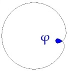

<!-- id: s9-26-0004 -->

Ce point - je crois avoir assez accentué dans mes derniers discours sa fonction struc­turale - peut, jusqu’à un certain point, receler pour vous trop de propriétés satisfaisantes : ce *phallus*, le voilà avec cette fonction magique qui est bien celle que tout notre dis­cours lui implique depuis longtemps. Ce serait un peu trop facile que de trouver là notre point de chute. C’est pourquoi aujourd’hui je veux mettre l’accent sur ce point, c’est-à-dire sur la fonction de *(a)*, le *petit(a),* en tant qu’il est à la fois à proprement parler, ce qui peut nous permettre de concevoir *la fonction de l’objet* dans la théorie analytique, à savoir cet *objet* qui dans *la dynamique psychique*, est ce qui struc­ture pour nous tout *le procès* *progressif-régressif*, ce à quoi nous avons affaire dans les rapports du sujet à sa réalité psychique, mais qui est aussi notre objet : l’objet de la science analytique.

<!-- id: s9-26-0005 -->

Et ce que je veux mettre en avant, dans ce que je vais vous en dire aujourd’hui, c’est que si nous voulons qualifier cet objet dans une perspective proprement logique - et j’accentue : logicisante - nous n’avons rien de mieux à en dire sinon ceci : qu’il est *l’objet de la castration*. J’entends par là, je spécifie : par rapport aux autres fonctions qui ont été définies jusqu’ici de l’objet, car si on peut dire que l’objet dans le monde, pour autant qu’il s’y discerne, est l’objet d’une *privation*, on peut dire également que l’objet est l’objet de la *frustration*. Et je vais essayer de vous montrer justement en quoi, cet objet qui est le nôtre, s’en distingue.

<!-- id: s9-26-0006 -->

Il est bien clair que si cet objet est un objet de la logique, il ne saurait avoir été jusqu’ici complètement absent, indécelable dans toutes les tentatives faites pour articuler comme telle ce qu’on appelle la logique. *La logique* n’a pas existé *de tout temps* sous la même forme, celle qui nous a parfaitement satisfaits, nous a comblés jusqu’à KANT qui s’y complaisait encore, *cette logique formelle, née un jour sous la plume* d’ARISTOTE, a exercé cette *captivation*, cette *fascination* jusqu’à ce qu’on s’attache, au siècle dernier, à ce qui pouvait y être repris dans le détail. On s’est aperçu par exemple qu’il y manquait beaucoup de choses du côté de *la quantification*. Ce n’est certainement pas ce qu’on y a ajouté qui est inté­ressant, mais c’est ce par quoi elle nous retenait, et bien des choses qu’on a cru devoir y ajouter ne vont que dans un sens singulièrement stérile.

<!-- id: s9-26-0007 -->

En fait, c’est sur la réflexion que l’analyse nous impose, concernant ces pouvoirs si longtemps insistants de la logique aristotélicienne, que peut se présenter pour nous l’inté­rêt de la logique. Le regard de celui qui dépouille de tous ses détails si fascinants *la logique formelle aristotélicienne* doit - je vous le répète - s’abstraire de ce qu’elle a apporté de décisif, de coupure dans le monde mental, pour comprendre même vraiment ce qui l’a précédée, par exemple la possibilité de toute *la dialectique platonicienne*, qu’on lit toujours comme si la logique formelle était déjà là, ce qui la fausse complètement pour notre lecture. Mais laissons.

<!-- id: s9-26-0008 -->

L’objet aristotélicien - car c’est bien ainsi qu’il faut l’appeler - a justement, si je puis dire, pour propriété de pouvoir avoir des propriétés qui lui appartiennent en propre : *des attributs*. Et ce sont ceux-ci qui définissent *les classes*. Or ceci est une construction qu’il ne doit qu’à confondre ce que j’appellerai - faute de mieux - les catégories de *l’être* et de l’*avoir*. Ceci mériterait de longs développements, et pour vous faire franchir ce pas je suis obligé de recourir à un exemple qui me servira de support. Déjà, cette fonction décisive de l’attribut, je vous l’ai mon­trée dans le quadrant :

<!-- id: s9-26-0009 -->

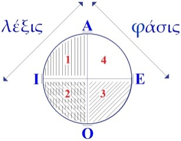

<!-- id: s9-26-0010 -->

C’est l’introduction du trait unaire qui distingue la partie phasique, où il sera dit par exemple que « *tout trait est vertical* », ce qui n’implique en soi l’existence d’aucun trait, de la partie lexique[^192], *où il peut y avoir des traits verticaux, mais où il peut* *n’y en pas avoir*. Dire que « *tout trait est vertical* » doit être la structure originelle, la fonction d*’universalité*, d’*universalisation* propre à une logique fondée sur *le trait de la privation*.

<!-- id: s9-26-0011 -->

Πᾶς \[pass\][^193] c’est le « *tout* »*...*

<!-- id: s9-26-0012 -->

il évoque je ne sais quel écho du dieu PAN. C’est bien là une des coalescences mentales dont je vous prie de faire l’effort de la rayer de vos papiers. Le nom du dieu PAN[^194] n’a absolument rien à faire avec le « *tout* », et les effets paniques auxquels il se joue le soir auprès des esprits simples de la campagne n’ont rien à voir avec quelque effusion mystique ou non. Le raptus alcoolique, dit par les vieux auteurs « *panto­phobique* », est bien nommé en ce sens que, lui aussi Πανικός \[panikos\] quelque chose le traque, le perturbe, et qu’il passe par la fenêtre. Il n’y a rien de plus à mettre là-dedans, c’est une erreur des esprits trop hellénistes d’y apporter cette retouche sur laquelle un de mes maîtres anciens, pourtant bien-aimé de moi, nous apportait cette rectification, on doit dire le raptus « *panto­phobique* ». Absolument pas.

<!-- id: s9-26-0013 -->

...Πᾶς \[pass\], c’est bien en effet le « *tout* », et si cela se rapporte à quelque chose, c’est à πάσασθαι\[passastaï\], à *la possession*. Et peut-être trouverai-je à me faire reprendre si je rapproche ce πᾶς du pos de *possidere* et de *possum*[^195], mais je n’hésite point à le faire. La pos­session ou non du *trait unaire*, du trait caractéristique, voilà autour de quoi tourne l’instauration d’une *nouvelle logique classificatoire* explicite des sources de l’objet aristotélicien.

<!-- id: s9-26-0014 -->

Ce terme « *classificatoire* », je l’emploie intentionnellement, puisque c’est grâce à Claude LÉVI-STRAUSS si vous avez désormais le corpus, l’articulation dogma­tique de la fonction classificatoire à ce qu’il appelle lui-même, je lui en laisse la responsabilité humoristique, « *l’état sauvage* », bien plus proche de la dialectique platonicienne que de l’aristotélicisme : la division progressive du monde en une série de moitiés, couples de termes antipodiques qu’il enserre dans des types dont \- sur ce sujet lisez « *La pensée sauvage »*[^196] - vous verrez que l’essentiel tient en ceci : ce qui n’est pas « *hérisson* » mais ce que vous voudrez, « *musaraigne* » ou « *mar­motte* », est autre chose. Ce qui caractérise la structure de *l’objet aristotélicien*, c’est que ce qui n’est pas *hérisson* est non- *hérisson*. C’est pourquoi je dis que c’est la logique de l’objet de la privation.

<!-- id: s9-26-0015 -->

Ceci peut nous mener beaucoup plus loin : jusqu’à cette sorte d’élusion par quoi le problème se pose, toujours aigu dans cette logique, de la fonction du *tiers exclu* dont vous savez qu’elle fait pro­blème jusqu’au cœur de la logique la plus élaborée, de la logique mathématique.

<!-- id: s9-26-0016 -->

Mais nous avons affaire à un début, à un noyau plus simple, que je veux, pour vous, imaginifier comme je vous l’ai dit par un exemple. Et je n’irai pas le cher­cher bien loin, mais dans un proverbe qui présente dans la langue française une particularité qui cependant ne saute pas aux yeux, tout au moins des franco­phones.

<!-- id: s9-26-0017 -->

Le proverbe est celui–ci : « *Tout ce qui brille n’est pas or* ». Dans la col­loquialité[^197] allemande par exemple, ne croyez pas qu’on puisse se contenter de la transcrire tout cru : « *Alles was glänzt ist kein Gold* ». Ce ne serait pas une bonne traduction. Je vois Melle UBERFREIT \[?\] opiner du bonnet à m’entendre. Elle m’approuve en ceci. « *Nicht alles was glänzt ist Gold* » cela peut donner plus de satisfaction quant au sens apparemment, mettant l’accent sur le « *alles* », grâce à une anticipation du « *nicht* » qui n’est nullement habituelle, qui force le génie de la langue et qui, si vous y réfléchissez, manque le sens, car ce n’est pas de cette distinction qu’il s’agit.

<!-- id: s9-26-0018 -->

Je pourrais employer les cercles d’EULER, les mêmes dont nous nous sommes servis l’autre jour à propos du rapport du sujet à un cas quelconque : « *tous les hommes sont menteurs* ».

<!-- id: s9-26-0019 -->

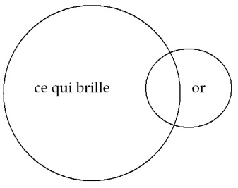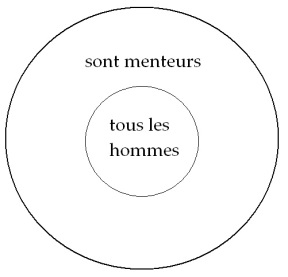

<!-- id: s9-26-0020 -->

Est-ce simplement ce que cela signifie ? Est-ce que, pour le refaire ici : une partie de ce qui brille est dans le cercle de l’or, et une autre n’y est pas, est-ce là le sens ?

<!-- id: s9-26-0021 -->

Ne croyez pas que je sois le premier parmi les logiciens à m’être arrêté à cette structure. Et à la vérité, plus d’un auteur qui s’est occupé de la négation s’est arrêté en effet à ce problème, non point tant du point de vue de la logique formelle qui, vous le voyez, ne s’y arrête guère sinon pour le méconnaître, mais du point de vue de *la forme grammaticale*, insistant sur ceci que le « *tout* » s’ordonne de telle façon que soit justement mise en ques­tion « *l’orité* » si je puis m’exprimer ainsi, *la qualité d’or de ce qui brille*, va dans le sens de lui *dénier l’authentique de l’or*, va donc dans le sens d’une *mise en question radicale*.

<!-- id: s9-26-0022 -->

L’or est ici symbolique de ce qui fait briller et, si je puis dire pour me faire entendre, j’accentue : ce qui donne à l’objet *la couleur fascinatoire du désir*. Ce qui est important dans une telle formule, si je puis m’exprimer ainsi, pardonnez-moi *le jeu de mots*, c’est « *le point d’orage* » autour de quoi tourne la question de savoir ce qui fait briller, et pour dire le mot, la question de ce qu’il y a de *vrai* dans cette brillance. Et à par­tir de là bien sûr, nul or ne sera assez véritable pour assurer ce point autour duquel subsiste la fonction du *désir*.

<!-- id: s9-26-0023 -->

Telle est la caractéristique radicale de cette sorte d’*objet* que j’appelle *(a)* : c’est *l’objet mis en question*, en tant qu’on peut dire que c’est ce qui nous *inté­resse*, nous autres analystes, comme ce qui *intéresse* l’auditeur de tout enseigne­ment. Ce n’est pas pour rien que j’ai vu surgir la nostalgie sur la bouche de tel ou tel qui voulait dire :

<!-- id: s9-26-0024 -->

« *Pourquoi ne dit-il pas -* comme s’est exprimé quelqu’un *- le vrai sur le vrai ?* ».

<!-- id: s9-26-0025 -->

C’est vraiment un grand honneur qu’on peut faire à un discours qui se tient tous les huit jours dans cette position insensée d’être là derrière une table devant vous, à articuler cette sorte d’exposé dont jus­tement on se contente fort bien d’ordinaire qu’il élude toujours une telle ques­tion. S’il ne s’agissait que de l’objet analytique, à savoir de *l’objet du désir*, jamais une telle question n’aurait pu même songer à surgir, sauf de la bouche d’un « *huron* » qui s’imaginerait que lorsqu’on vient à l’Université, c’est pour savoir « *le vrai sur le vrai* ».

<!-- id: s9-26-0026 -->

Or c’est de cela qu’il s’agit dans l’analyse. On pourrait dire que c’est ce dont nous sommes embarrassés de faire - souvent malgré nous - briller le mirage dans l’esprit de ceux auxquels nous nous adressons. Nous nous trou­vons - je l’ai dit - bien embarrassés, tels *le poisson, de la pro­verbiale pomme*, et pourtant c’est bien elle qui est là, c’est à elle que nous avons affaire, c’est sur elle - en tant qu’elle est au cœur de la structure - c’est sur elle que porte ce que nous appelons *la castration*.

<!-- id: s9-26-0027 -->

C’est justement en tant qu’il y a une structure subjective qui tourne autour d’un type de cou­pure, celui que je vous ai représenté ainsi :

<!-- id: s9-26-0028 -->

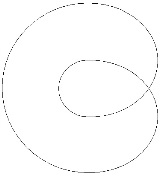

<!-- id: s9-26-0029 -->

…qu’il y a au cœur de l’identification fantasmatique cet objet organisateur, cet objet inducteur. Et il ne saurait en être autrement de tout le monde de l’angoisse auquel nous avons affaire, qui est l’objet comme défini *objet de la castration*.

<!-- id: s9-26-0030 -->

Ici je veux vous rappeler à quelle surface est empruntée cette partie que je vous ai appelée la dernière fois « *énucléée* », qui donne l’image même du cercle selon laquelle cet objet peut se définir. Je veux vous imager quelle est la propriété de ce cercle au double tour. Agrandissez progressivement les deux lobes de cette coupure, de façon qu’ils passent tous les deux, si je puis dire, derrière la surface antérieure :

<!-- id: s9-26-0031 -->

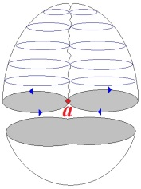 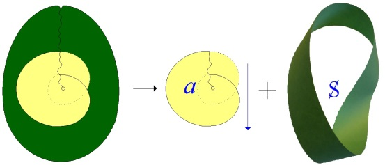

<!-- id: s9-26-0032 -->

Ceci n’est rien de nouveau, c’est la façon dont je vous ai déjà démon­tré à déplacer cette coupure. Il n’y a en effet qu’à la déplacer, et on fait apparaître très facilement que la partie complémentaire de la surface, par rapport à ce qui est isolé autour de ce qu’on peut appeler les deux feuilles centrales, ou les deux pétales, pour les faire se rejoindre avec la métaphore inaugurale de la couverture du livre de Claude LÉVI-STRAUSS \[« *La pensée est une fleur triste* »\], avec cette image même. Ce qui reste, c’est *une surface de Mœbius* apparente. C’est la même figure que vous retrouvez là :

<!-- id: s9-26-0033 -->

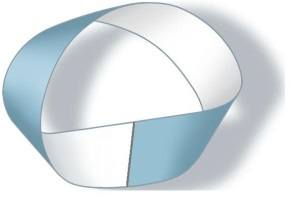

<!-- id: s9-26-0034 -->

Ce qui se trouve en effet, entre les deux bords ainsi déplacés des deux boucles de la coupure, au moment où ses deux bords se rapprochent, c’est une *surface de Mœbius*. Mais ce que je veux vous montrer ici, c’est que pour que cette double coupure se rejoigne, se ferme sur elle-même - ce qui est impliqué dans sa structure même - vous devez étendre peu à peu la boucle interne du huit intérieur. C’est bien cela que vous en espérez, c’est qu’il se satisfasse de son propre recouvrement par lui-même :

<!-- id: s9-26-0035 -->

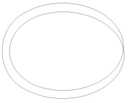

<!-- id: s9-26-0036 -->

qu’il rentre dans la norme, qu’on sache à quoi on a affaire : ce qui est dehors, et ce qui est dedans. Ce que vous montre cet état de la figure, car vous voyez bien comment il faut la voir :

<!-- id: s9-26-0037 -->

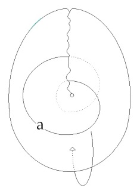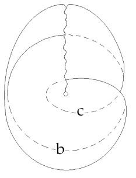

<!-- id: s9-26-0038 -->

Ce lobe \[a\] s’est prolongé de l’autre côté, il a gagné sur l’autre face \[b\], il nous montre visiblement que la boucle externe va, dans cette surface, rejoindre la boucle interne \[c\] à condition de passer par l’extérieur. La surface dite *plan projectif* se *complète*, se *ferme*, s’*achève*. L’objet défini comme notre objet, l’objet for­mateur du monde du désir, ne rejoint son intimité que par une voie centrifuge. Qu’est-ce à dire ? Que retrou­vons-nous là ?

<!-- id: s9-26-0039 -->

Je reprends de plus haut : la fonction de cet objet est liée au rapport par où le sujet se constitue dans la relation au lieu de l’Autre, grand A, qui est le lieu où s’ordonne *la réalité du signifiant*.

<!-- id: s9-26-0040 -->

*C’est au point où toute signifiance fait défaut, s’abolit, au point nodal dit « le désir de l’Autre », au point dit phallique, pour autant qu’il* *signifie l’abolition comme telle de toute signifiance* \[S1: *signifiant a-sémantique*\]*, que l’objet petit(a), objet de la castration, vient prendre sa place.* *Il a donc un rapport au signifiant*.

<!-- id: s9-26-0041 -->

Et c’est pour cela qu’ici encore je dois vous rappeler la définition dont je suis parti cette année, concernant le signifiant : *le signifiant n’est pas le signe* - et l’ambiguïté de l’attribut aristotélicien, c’est justement de vouloir le naturaliser, en faire le signe naturel : « *tout chat tricolore est femelle* » - *le signifiant*, vous ai-je dit - contrairement au signe qui représente quelque chose pour quelqu’un - *c’est ce qui représente le sujet pour un autre signifiant*.

<!-- id: s9-26-0042 -->

Et il n’y a pas de meilleur exemple que *le sceau*. Qu’est-ce qu’un *sceau* ? Le lendemain du jour où je vous livrai cette formule, le hasard fit qu’un antiquaire de mes amis me remit entre les mains *un petit sceau égyptien* qui, d’une façon non habituelle, mais non rare non plus, avait la forme d’une semelle avec, sur le dessus, les doigts du pied et les os dessinés. *Le sceau*, comme vous l’avez compris, je l’ai trouvé dans les textes, c’est bien cela : *une trace* si l’on peut dire.

<!-- id: s9-26-0043 -->

Et il est vrai que la nature en abonde, mais ça ne peut devenir un signifiant que si, cette trace, avec une paire de ciseaux, vous en faites le tour et vous la découpez. Si vous extrayez la trace après, cela peut devenir un sceau. Et je pense que l’exemple vous éclaire déjà suf­fisamment, un sceau représente le sujet, l’envoyeur, pas forcément pour le des­tinataire. Une lettre peut toujours rester scellée, mais *le sceau est là pour la lettre, il est un signifiant.* Eh bien, l’*objet(a),* *l’objet de la castration* participe de la nature ainsi exem­plifiée de ce signifiant. C’est un objet structuré comme cela. En fait, vous vous apercevrez de ce qu’au terme de tout ce que les siècles ont pu rêver de *la fonction de la connaissance*, il ne nous reste en main que cela.

<!-- id: s9-26-0044 -->

Dans la nature, il y a de *la chose*, si je puis m’exprimer ainsi, qui se présente avec *du bord*. Tout ce que nous pouvons y conquérir qui simule *une connaissance, ça n’est jamais que détacher ce bord* - et non pas s’en servir mais l’oublier - *pour voir le reste* qui, chose curieuse, de cette extraction se trouve complètement transformé, exactement comme le *cross cap* vous l’image. Á savoir, ne l’oubliez pas : qu’est-ce que c’est que ce *cross-cap* ? C’est une sphère, je vous l’ai déjà dit, il la faut, on ne peut pas s’en passer du cul de cette sphère.

<!-- id: s9-26-0045 -->

C’est *une sphère avec un trou* que vous organisez d’une cer­taine façon, et vous pouvez très bien imaginer que c’est en tirant sur un de ses bords que vous faites apparaître, plus ou moins en le retenant, ce quelque chose qui va venir boucher le trou, à condition de réaliser ceci que chacun de ses points s’unisse au point opposé, ce qui crée des difficultés intuitives naturellement considérables, et même qui nous ont obligé à toute la construction que j’ai détaillée devant vous, sous la forme du *cross-cap* imagé dans l’espace.

<!-- id: s9-26-0046 -->

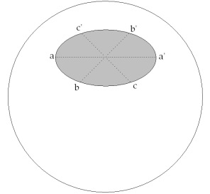 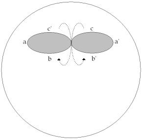 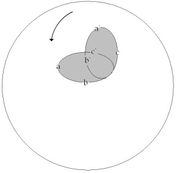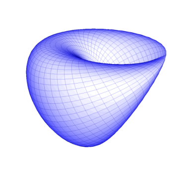

<!-- id: s9-26-0047 -->

Mais quoi ? Quel est l’important ? C’est que, par cette opération qui se produit au niveau du trou, le reste de la sphère est transformé en *surface de Mœbius*. Par *l’énucléation de l’objet de la castration*, Le monde entier s’ordonne d’une certaine façon qui nous donne si je puis dire, *l’illusion d’être un monde*.

<!-- id: s9-26-0048 -->

Et je dirai même que, d’une certaine façon, pour faire un intermédiaire entre cet *objet aristotélicien*, où cette réalité est en quelque sorte masquée, et notre *objet* que j’essaie ici pour vous de promouvoir, j’intro­duirai dans le milieu cet objet qui nous inspire à la fois la plus grande méfiance, en raison des *préjugés* hérités d’une *éducation épistémologique*, mais qui est ce dans quoi l’on choit toujours bien sûr, qui est notre grande tentation... nous autres, dans l’analyse, si nous n’avions pas eu l’existence de JUNG pour l’exorci­ser,

<!-- id: s9-26-0049 -->

nous ne nous serions peut-être même pas aperçus à quel point nous y croyons toujours ...c’est *l’objet de la Naturwissenschaft,* c’est *l’objet gœthéen,* si je puis dire, *l’objet* qui, dans la nature, lit sans cesse comme à livre ouvert *toutes les figures* d’une intention qu’il faudrait bien appeler *quasi divine,* si le terme de Dieu n’avait pas été d’un autre côté *si bien préservé*.

<!-- id: s9-26-0050 -->

Cette - disons-le - *démonique »,* plutôt que *divine, intuition gœthéenne*, qui lui fait aussi bien lire dans le crâne trouvé sur le Lido la forme de WERTHER complètement imaginaire, ou forger la théorie des couleurs, bref, laisser pour nous les traces d’une activité dont le moins qu’on puisse dire c’est qu’elle est *cosmogène*, engendreuse des plus vieilles illu­sions de l’analogie micro-macrocosmique, et pourtant captivante encore dans un esprit si proche de nous. À quoi cela tient-il ? À quoi le drame personnel de GŒTHE doit-il la fascination exceptionnelle qu’il exerce sur nous, sinon à l’affleurement comme central, du drame chez lui, du désir. « *Warum Gœthe ließ Friederike* [^198] ? » a écrit, vous le savez, un des survivants de la première génération dans un article : Theodor REIK.

<!-- id: s9-26-0051 -->

La spécificité et le caractère fascinant de la per­sonnalité de GŒTHE, c’est que nous y lisons dans toute sa présence *l’identifica­tion de l’objet du désir à ce à quoi il faut renoncer pour que nous soit livré le monde comme monde*.

<!-- id: s9-26-0052 -->

J’ai très suffisamment rappelé la structure de ce cas - en en montrant l’analogie avec celle développée par FREUD dans l’histoire de *L’homme aux rats* - dans *Le mythe individuel du névrosé,* ou plutôt *l’a-t-on fait paraître sans mon consentement* *quelque part* [^199], puisque ce texte, je ne l’ai ni revu ni corrigé, ce qui le rend quasi illisible, néanmoins il traîne par-ci, par-là, et on peut en retrouver les grandes lignes.

<!-- id: s9-26-0053 -->

Ce rapport *complémentaire* de *(a)*, *l’objet d’une castration constitutive* où se situe notre objet comme tel, avec *ce reste*, et où nous pouvons tout lire, et spé­cialement notre figure *i(a)*, c’est ceci que j’ai tenté d’illustrer cette année à la pointe, pour vous, de mon discours. Dans *l’illusion spéculaire*, dans *la mécon­naissance fondamentale* à laquelle nous avons toujours affaire, S prend *fonction d’image spéculaire* sous la forme de *i(a) alors qu’il n’a*, si je puis dire, *avec elle rien à faire de semblable*.

<!-- id: s9-26-0054 -->

Il ne saurait d’aucune façon y lire son image pour la bonne raison que s’il est quelque chose, ce S, ce n’est pas le complément de *petit i facteur de petit(a)* \[*i(a)*\], ça pourrait en être assez bien la cause dirons-nous, et j’emploie ce terme intentionnellement, car depuis quelque temps, justement depuis que les catégories de la logique flageolent un peu, la *cause*, bonne ou mauvaise, n’a en tout cas pas bonne presse, et l’on préfère éviter d’en parler.

<!-- id: s9-26-0055 -->

Et en effet, il n’y a guère que nous qui puissions nous y retrouver, dans cette *fonc­tion* dont en somme on ne peut approcher *l’ombre ancienne*, après tout le pro­grès mental parcouru, qu’à y voir en quelque sorte l’identique de tout ce qui se manifeste comme effets, mais quand ils sont encore voilés.

<!-- id: s9-26-0056 -->

Et bien entendu ceci n’a rien de satisfaisant, sauf peut-être si justement ça n’est pas d’être à la place de quelque chose, de couper tous les effets, que la cause soutient son drame. S’il y a d’ailleurs aussi bien une cause qui soit digne que nous nous y attachions, au moins par notre attention, ça n’est pas toujours et d’avance une cause perdue.

<!-- id: s9-26-0057 -->

Donc nous pouvons articuler que s’il est quelque chose sur quoi nous devons mettre l’accent, loin de l’éluder, c’est que la fonction de *l’objet partiel* ne saurait pour nous d’aucune façon être réduite, si ce que nous appelons *l’objet partiel* c’est ce qui désigne le point de refoulement du fait de sa perte.

<!-- id: s9-26-0058 -->

Et c’est à partir de là que s’enracine l’illusion de la cosmicité du monde. Ce point *acosmique* du désir en tant qu’il est désigné par *l’objet de la castration*, c’est ce que nous devons préserver comme *le point pivot*, le centre de toute l’élaboration de ce que nous avons accumulé comme faits concernant la constitution du monde comme objectal.

<!-- id: s9-26-0059 -->

Mais cet *objet(a)* que nous voyons surgir au point de défaillance de l’Autre, au point de perte du signifiant, parce que cette perte c’est la perte de cet objet même, du membre jamais retrouvé d’HORUS[^200] démembré, cet *objet*, comment ne pas lui donner ce que j’appellerai parodiquement sa *propriété réflexive* si je puis dire, puisqu’il la fonde, que c’est de lui qu’elle part, que c’est pour autant que *le sujet est d’abord* et uniquement essentiellement *coupure de cet objet* que quelque chose peut naître qui est cet intervalle entre cuir et chair, entre *Wahrnehmung* et *Bewusstsein,* entre perception et conscience, qui est la *Selbstbewusstsein.*

<!-- id: s9-26-0060 -->

C’est ici qu’il vaut de dire sa place dans une ontologie fondée sur notre expérience. Vous verrez qu’elle rejoint ici une formule longuement commentée par HEIDEGGER[^201], dans son origine présocratique. *Le rapport de cet objet à l’image du monde* qu’il ordonne constitue ce que PLATON a appelé à proprement parler « *la dyade* », à condition que nous nous aper­cevions que dans cette dyade le sujet S et le *(a)* sont du même côté. Τὸ γὰρ αὐτὸ νοεῖν ἐστίν τε καὶ εἶναι [^202], cette formule qui a longtemps servi à confondre - ce qui n’est pas soutenable - l’être et la connaissance, ne veut pas dire autre chose que cela.

<!-- id: s9-26-0061 -->

Par rapport au corrélat de *petit(a),* à ce qui reste, *quand l’objet constitutif du fantasme s’est séparé, être et pensée sont du même côté*, du côté de ce *(a). Petit(a), c’est l’être en tant qu’il est essentiellement manquant au texte du monde*, et c’est pourquoi autour de *petit(a)* peut se glisser tout ce qui s’appelle *retour du refoulé,* c’est-à-dire qu’y suinte et s’y trahit la vraie *vérité* qui, nous, nous inté­resse, et qui est toujours *l’objet du désir* en tant que toute humanité, tout huma­nisme est construit pour nous la faire manquer.

<!-- id: s9-26-0062 -->

Nous savons par notre expérience qu’il n’y a rien qui pèse dans le monde véritablement que ce qui fait allusion à cet objet dont l’Autre, grand A, prend la place pour lui donner un sens. Toute métaphore, y compris celle du symptôme, cherche à faire sortir cet objet dans la signification, mais toute la pullulation des sens qu’elle peut engendrer n’arrive pas à étancher ce dont il s’agit dans ce trou d’une perte centrale.

<!-- id: s9-26-0063 -->

Voilà ce qui règle *les rapports du sujet avec l’Autre*, grand A, ce qui règle secrè­tement, mais d’une façon dont il est sûr qu’elle n’est pas moins efficace que ce rapport de *(a)* à *la réflexion imaginaire* qui le couvre et le surmonte. Qu’en d’autres termes dans la route - la seule qui nous soit offerte pour retrouver l’inci­dence de ce *petit(a) -* nous rencontrons d’abord la marque de l’occultation de l’Autre, sous le même désir. Telle est en effet la voie : *(a)* peut être abordé par cette voie qui est ce que l’Autre (avec un grand A) désire dans le sujet défaillant, dans le *fantasme*, le S.

<!-- id: s9-26-0064 -->

C’est pourquoi je vous ai enseigné que la crainte du désir est vécue comme équivalente à *l’angoisse*, *que l’angoisse c’est la crainte* *de ce que l’Autre désire en soi du sujet, cet en soi fondé justement sur l’ignorance de ce qui est désiré au niveau de l’Autre*. C’est du côté de l’Autre que le *(a)* vient au jour, non pas comme manque tellement que comme *à être.* C’est pourquoi nous arri­vons ici à poser la question de son rapport avec *la Chose*, non pas « *Sache »,* mais ce que je vous ai appelé « *das Ding ».*

<!-- id: s9-26-0065 -->

Vous savez qu’en vous menant sur cette limite je n’ai rien fait que de vous indiquer qu’ici, la perspective s’inversant, *c’est i(a) qui enveloppe cet accès à l’objet de la castration*.

<!-- id: s9-26-0066 -->

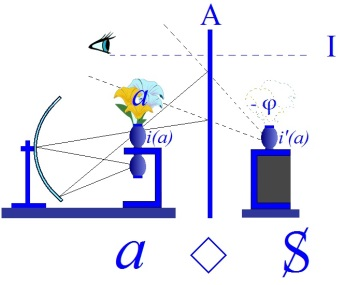

<!-- id: s9-26-0067 -->

C’est ici *l’image même* qui fait obstacle dans le miroir, ou plutôt que, à la façon de ce qui se passe dans ces *miroirs obscurs*, il faut toujours penser à *cette obscurité* chaque fois que dans les auteurs anciens, vous voyez intervenir la référence au miroir, quelque chose peut apparaître au-delà de l’image que donne le miroir clair. L’*image* du miroir clair, c’est à elle que s’accroche cette barrière que j’ai appelée en son temps celle de la beauté. C’est qu’aussi bien *la révélation de petit(a) au-delà de cette image*, même apparue sous la forme la plus horrible, en gardera toujours le reflet.

<!-- id: s9-26-0068 -->

Et c’est ici que je voudrais vous faire part du bonheur que j’ai pu avoir à ren­contrer ces pensées sous la plume de quelqu’un que je considère tout simple­ment comme le chantre de nos Lettres, qui a été incontestablement plus loin que quiconque, présent ou passé, dans la voie de la réalisation du fantasme : j’ai nommé Maurice BLANCHOT[^203], dont dès longtemps *L’arrêt de mort* était pour moi la sûre confirmation de ce que j’ai dit toute l’année, au séminaire sur *L’Éthique,* concernant « *la seconde mort* ».

<!-- id: s9-26-0069 -->

Je n’avais pas lu la seconde version de son œuvre première, « *Thomas l’Obscur ».* Je pense qu’un aussi petit volume, nul d’entre vous, après ce que je vais vous en lire, ne manquera de s’y éprouver. Quelque chose s’y rencontre qui incarne *l’image de cet objet(a),* à propos duquel j’ai parlé d’*horreur*, c’est le terme qu’emploie FREUD quand il s’agit de *L’Homme au rat*.

<!-- id: s9-26-0070 -->

Ici, c’est du rat qu’il s’agit. Georges BATAILLE[^204] a écrit un long essai qui vire autour du *fantasme central* bien connu de Marcel PROUST, lequel concernait aussi un rat : *Histoire de rats.* Mais ai-je besoin de vous dire que si APOLLON crible l’armée grecque des flèches de la peste, c’est parce que, comme s’en est très bien aperçu monsieur GRÉGOIRE : si ESCULAPE - comme je vous l’ai enseigné il y a longtemps, est une taupe, il n’y a pas si longtemps que je retrouvai le plan de la taupinière dans une [θόλος](http://fr.wikipedia.org/wiki/Tholos) \[tholos\], une de plus, que j’ai visitée récemment - si donc ESCULAPE est une taupe, APOLLON est un rat.

<!-- id: s9-26-0071 -->

Voici. J’anticipe, ou plus exactement je prends un peu avant *Thomas l’Obscur* – ce n’est pas par hasard qu’il s’appelle ainsi :

<!-- id: s9-26-0072 -->

« *Et dans sa chambre* \[...\] *ceux qui entraient, voyant son livre toujours ouvert aux mêmes pages, pensaient qu’il fei­gnait de lire. Il lisait.* *Il lisait avec une minutie et une attention insurpassables. Il était, auprès de chaque signe, dans la situation où se trouve le mâle quand* *la mante religieuse va le dévorer. L’un et l’autre se regardaient. Les mots, issus d’un livre qui prenait une puissance mortelle, exerçaient sur le regard qui les touchait un attrait doux et paisible. Chacun d’eux, comme un œil à demi-fermé, laissait entrer le regard trop vif* *qu’en d’autres circonstances il n’eût pas souffert. Thomas se glissa donc vers ces couloirs dont il s’approcha sans défense jusqu’à l’instant où il fut aperçu par l’intime du mot.* *Ce n’était pas encore effrayant, c’était au contraire un moment presque agréable qu’il aurait voulu prolonger. Le lecteur considérait joyeusement cette petite étincelle de vie qu’il ne doutait pas d’avoir éveillée. Il se voyait avec plaisir dans cet œil qui le voyait.* *Son plaisir même devint très grand. Il devint si grand, si impitoyable qu’il le subit avec une sorte d’effroi et que, s’étant dressé,* *moment insupportable, sans recevoir de son interlocuteur un signe complice, il aperçut toute l’étrangeté qu’il y avait à être observé* *par un mot comme par un être vivant, et non seulement par un mot, mais par tous les mots qui se trouvaient dans ce mot,* *par tous ceux qui l’accompa­gnaient et qui à leur tour contenaient en eux-mêmes d’autres mots, comme une suite d’anges* *s’ouvrant à l’infini jusqu’à l’œil de l’absolu* ».

<!-- id: s9-26-0073 -->

Je vous passe ces franchissements qui passent par ce

<!-- id: s9-26-0074 -->

« *tandis que, juchés sur ses épaules, le mot « Il » et le mot « je » commençaient leur carnage*... »

<!-- id: s9-26-0075 -->

jusqu’à la confrontation à laquelle je visais en vous évoquant ce passage :

<!-- id: s9-26-0076 -->

« *Ses mains cher­chèrent à toucher un corps impalpable et irréel. C’était un effort si pénible que cette chose qui s’éloignait de lui et,* *en s’éloignant, tentait de l’attirer, lui parut la même que celle qui indiciblement se rapprochait. Il tomba à terre. Il avait le sentiment d’être couvert d’impuretés. Chaque partie de son corps subissait une agonie. Sa tête était contrainte de toucher le mal, ses poumons de* *le respirer. Il était là sur le parquet, se tordant, puis rentrant en lui-même, puis sortant. Il ram­pait lourdement, à peine différent du serpent qu’il eût voulu devenir pour croire au venin qu’il sentait dans sa bouche* \[...\].

<!-- id: s9-26-0077 -->

*C’est dans cet état qu’il se sentit mordu ou frappé, il ne pouvait le savoir, par ce qui lui sembla être un mot, mais qui ressemblait* *plutôt à un rat gigantesque, aux yeux perçants, aux dents pures, et qui était une bête toute puissante. En la voyant à quelques pouces* *de son visage, il ne put échapper au désir de la dévorer, de l’amener à l’intimité la plus profonde avec soi. Il se jeta sur elle et,* *lui enfonçant les ongles dans les entrailles, chercha à la faire sienne. La fin de la nuit vint. La lumière qui brillait à travers les volets s’éteignit. Mais la lutte avec l’affreuse bête qui s’était enfin révélée d’une dignité, d’une magnificence incomparables, dura un temps* *qu’on ne put mesurer. Cette lutte était horrible pour l’être couché par terre qui grinçait des dents, se labourait le visage,* *s’arrachait les yeux pour y faire entrer la bête et qui eût ressemblé à un dément s’il avait ressemblé à un homme.*

<!-- id: s9-26-0078 -->

*Elle était presque belle pour cette sorte d’ange noir, couvert de poils roux, dont les yeux étin­celaient.* *Tantôt l’un croyait avoir triomphé et il voyait descendre en lui avec une nausée incoercible le mot innocence qui le souillait.* *Tantôt l’autre le dévo­rait à son tour, l’entraînait par le trou d’où il était venu, puis le rejetait comme un corps dur et vide.* *Á chaque fois, Thomas était repoussé jusqu’au fond de son être par les mots mêmes qui l’avaient hanté et qu’il poursuivait comme* *son cauchemar et comme l’explication de son cauchemar. Il se retrouvait toujours plus vide et plus lourd, il ne remuait plus qu’avec* *une fatigue infinie. Son corps, après tant de luttes, devint entièrement opaque et, à ceux qui le regardaient, il donnait l’impression reposante du sommeil, bien qu’il n’eût cessé d’être éveillé* ».

<!-- id: s9-26-0079 -->

Vous lirez la suite. Et le chemin ne s’arrête pas là, de ce que Maurice BLANCHOT nous découvre. Si j’ai pris ici le soin de vous indiquer ce passage, c’est qu’au moment de vous quitter cette année, je veux vous dire que souvent j’ai conscience de ne rien faire d’autre ici que de vous permettre de vous porter avec moi au point où, autour de nous, multiples, parviennent déjà les meilleurs. D’autres ont pu remarquer le parallélisme qu’il y a entre telle ou telle des recherches qui se poursuivent à pré­sent et celles qu’ensemble nous élaborons. Je n’aurai aucune peine à vous rap­peler que sur d’autres chemins, les œuvres, puis les *réflexions sur les œuvres* par lui-même d’un Pierre KLOSSOWSKI[^205], convergent avec ce chemin de la recherche du *fantasme* tel que nous l’avons élaboré cette année.

<!-- id: s9-26-0080 -->

*Petit i de petit(a)* \[*i(a)*\], leur *différence*, leur *complémentarité* et le masque que l’un constitue pour l’autre, voilà le point où je vous aurai menés cette année. *Petit i de petit(a)* \[*i(a)*\], *son image* n’est donc pas *son image* : elle ne le représente pas, cet *objet de la castration*, elle n’est d’aucune façon ce représentant de la pulsion sur quoi porte électivement le refoulement, et pour une double raison, c’est qu’elle n’en est, cette image, ni la*Vorstellung* puisqu’elle est elle-même *un objet*, une *image réelle* \- reportez-vous à ce que j’ai écrit sur ce sujet dans mes *Remarques sur le rapport de Daniel Lagache* [^206] *- un objet* qui n’est pas le même que *petit(a),* qui n’est pas son représentant non plus.

<!-- id: s9-26-0081 -->

Le *désir*, ne l’oubliez pas, dans le graphe où se situe­-t-il ?

<!-- id: s9-26-0082 -->

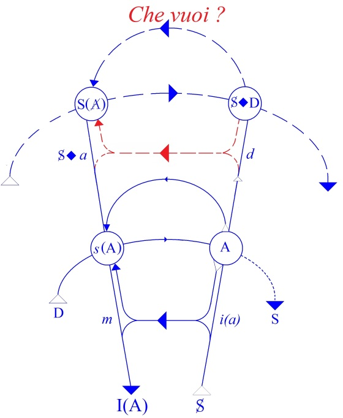

<!-- id: s9-26-0083 -->

Il vise S◊*a,* le fantasme, sous un mode analogue à celui du *m* où le *moi* se réfère à *l’image spéculaire*. Qu’est-ce à dire, sinon qu’il y a quelque rapport de ce fantasme au désirant lui-même. Mais pouvons-nous, de ce désirant, faire purement et simplement l’agent du désir ? N’oublions pas qu’au deuxième étage du graphe, *d, le désir*, est un « *qui *» qui répond à une question, qui ne vise pas un « *qui *» mais un « *che voi ? *».

<!-- id: s9-26-0084 -->

À la question « *che voi ? *» le désirant est la réponse, la réponse qui ne désigne pas le « *qui *» de « *qui veut ?* », mais la réponse de l’objet. Ce que je veux dans le fantasme détermine l’objet d’où le désirant qu’il contient doit s’avouer comme désirant.

<!-- id: s9-26-0085 -->

Cherchez-le toujours, ce désirant, au sein de quelque *objet* que ce soit *du désir*, et n’allez pas objecter *la perversion nécrophilique*, puisque justement c’est là l’exemple où il se prouve en deçà de « *la seconde mort* », la mort physique laisse encore à désirer, et que le corps se laisse là apercevoir comme entièrement pris dans une fonction de *signifiant*, séparé de lui-même et témoignage de ce qu’étreint le nécrophile : une insaisissable vérité.

<!-- id: s9-26-0086 -->

Ce rapport de l’objet au signifiant, avant de vous quitter, revenons-en au point où ces réflexions s’assoient, c’est-à-dire à ce que FREUD lui-même a marqué de l’identification du désir - chez l’*hystérique* entre parenthèses - au désir de l’Autre. L’*hystérique* nous montre, en effet, bien quelle est la distance de cet objet au signifiant, cette distance que j’ai définie par la carence du signifiant, mais impli­quant sa relation au signifiant, en effet, à quoi s’identifie l’*hystérique* quand - nous dit FREUD - c’est le désir de l’Autre où elle s’oriente, et qui l’a mise en chasse.

<!-- id: s9-26-0087 -->

Et c’est sur quoi les affects, nous dit-il, *les émotions* - considérées ici, sous sa plume, comme *embrouillées* , si je puis m’exprimer ainsi, *dans le signifiant*, et reprises comme telles - c’est à ce propos qu’il nous dit que toutes les émotions entérinées, les formes, si je puis dire, conventionnelles de l’émotion, ne sont rien d’autre que des *inscriptions ontogéniques* de ce qu’il compare, de ce qu’il révèle comme expressément équivalent à des accès hystériques, ce qui est retomber sur la relation au signifiant. Les émotions sont en quelque sorte des « *caduques »* du comportement, des *parties chues* reprises comme *signifiant*.

<!-- id: s9-26-0088 -->

Et ce qui est le plus sensible, tout ce que nous pouvons en voir, se trouve dans les formes antiques de la lutte. Que ceux qui ont vu le film *Rashomon*[^207] se souviennent de ces étranges intermèdes qui soudain suspendent les combattants, qui vont chacun séparé­ment faire sur eux-mêmes trois petits tours, faire â je ne sais quel point inconnu de l’espace une paradoxale révérence. Ceci fait partie de la lutte, de même que dans la parade sexuelle.

<!-- id: s9-26-0089 -->

FREUD nous apprend à reconnaître cette espèce de para­doxe interruptif d’incompréhensible scansion. Les émotions, si quelque chose nous en est montré chez l’hystérique, c’est justement quand elle est sur la trace du désir, c’est ce caractère nettement mimé, comme on dit hors de saison, à quoi on se trompe et d’où se tire l’impression de fausseté.

<!-- id: s9-26-0090 -->

Qu’est-ce à dire, si ce n’est que l’hystérique bien sûr ne peut pas faire autre chose que de chercher le désir de l’Autre là où il est, où il laisse sa trace chez l’Autre, dans l’*utopie*, pour ne pas dire l’*atopie*, la détresse, voire la fiction, bref, que c’est par la voie de la manifestation comme on peut s’y attendre, que se montrent tous les *aspects symptomatiques*. Et si ces *symptômes* trouvent cette voie frayée, c’est en liaison avec ce rapport, que FREUD désigne, au désir de l’Autre.

<!-- id: s9-26-0091 -->

J’avais autre chose à vous indiquer, concernant la frustration. Bien sûr, ce que je vous en ai apporté cette année, concernant le rapport au corps, ce qui est seu­lement ébauché dans la façon dont j’ai entendu, dans un corps mathématique, vous donner l’amorce de toutes sortes de paradoxes, concernant l’idée que nous pouvons nous faire du corps, trouve ses applications assurément bien faites pour modifier profondément l’idée que nous pouvons avoir de la frustration comme d’une carence concernant une gratification se référant à ce qui serait une soi-disant totalité primitive, telle qu’on voudrait la voir désignée dans les rapports de la mère et de l’enfant.

<!-- id: s9-26-0092 -->

Il est étrange que la pensée analytique n’ait jamais ren­contré sur ce chemin, sauf dans les coins, comme toujours, des observations de FREUD, et ici je désigne dans *L’Homme aux loups* le mot « *Schleier* », ce *voile* dont l’enfant *naît coiffé*, et qui traîne dans la littérature analytique sans qu’on ait même jamais songé que c’était là l’amorce d’une voie très féconde : les stigmates.

<!-- id: s9-26-0093 -->

S’il y a quelque chose qui permette de concevoir comme comportant une tota­lité de je ne sais quel narcissisme primaire \- et ici je ne peux que regretter que se soit absenté quelqu’un qui m’a posé la question - c’est bien assurément la référence du sujet, non pas tant au corps de la mère parasité, mais à ces enve­loppes perdues où se lit si bien *cette continuité* *de l’intérieur avec l’extérieur*, qui est celle à quoi vous a introduit mon modèle de cette année, sur lequel nous aurons à revenir.

<!-- id: s9-26-0094 -->

Simplement je veux vous indiquer, parce que nous le retrouve­rons dans la suite, que s’il y a *quelque chose* où doit s’accentuer le rapport au corps, à l’*incorporation*, à l’*Einverleibung,* c’est du côté du père - laissé entière­ment de côté - qu’il faut regarder. Je l’ai laissé entièrement de côté parce qu’il aurait fallu que je vous introduise - *mais quand le ferais-je ?* - à toute une *tradition* qu’on peut appeler *mystique* et qui assurément, par sa présence dans la *tradition* *sémitique*, domine toute l’aventure personnelle de FREUD.

<!-- id: s9-26-0095 -->

Mais s’il y a quelque chose qu’on demande à la mère, ne vous paraît-il pas frappant que ce soit la seule chose qu’elle n’ait pas, à savoir *le phallus* ? Toute la dialectique de ces dernières années, jusques et y com­pris la dialectique kleinienne, qui pourtant s’en approche le plus, reste faussée parce que l’accent n’est pas mis sur cette divergence essentielle.

<!-- id: s9-26-0096 -->

C’est aussi bien qu’il est impossible de *la corriger*, impossible aussi de rien comprendre à ce qui fait l’impasse de la relation analytique, et tout spécialement dans la transmission de *la vérité* analytique telle que se fait l’analyse didac­tique, c’est qu’il est impossible d’y introduire la relation au père : qu’on n’est pas le père de son analysé. J’en ai assez dit et assez fait pour que personne n’ose plus - au moins dans un entourage voisin du mien - risquer d’avancer qu’on peut en être la mère.

<!-- id: s9-26-0097 -->

C’est pourtant de cela qu’il s’agit. La fonction de l’analyse telle qu’elle s’insère là où FREUD nous en a laissé la suite ouverte, la trace béante, se situe là où sa plume est tombée, à propos de l’article sur le *splitting* de l’*ego*, au *point d’ambiguïté* où l’amène ceci : *l’objet de la castration* est ce terme assez ambigu pour qu’au moment même où le sujet s’est employé à le refouler, *il l’instaure plus ferme que jamais en un Autre*.

<!-- id: s9-26-0098 -->

Tant que nous n’aurons pas reconnu que cet *objet de la castration*, c’est l’objet même par quoi nous nous situons dans le champ de la science - je veux dire que c’est l’objet de notre science, comme le nombre ou la grandeur peuvent être l’objet de la mathématique - la dialectique de l’analyse, non seulement sa dialec­tique, mais sa pratique, son apport même, et jusqu’à la structure de sa commu­nauté, resteront en suspens.

<!-- id: s9-26-0099 -->

L’année prochaine je traiterai pour vous, comme poursuivant strictement le point où je vous ai laissés aujourd’hui, *l’angoisse*.

<!-- id: s9-26-0100 -->

\[Fin du séminaire « *L’identification*\]

<!-- id: s9-26-0101 -->

[[[Table des séances](#Tabledesseances)](#table)](#table)

## Notes

[^192]: Lapsus de Jacques Lacan, qui inverse phasis et lexis.

[^193]: Πᾶς(masculin), πᾶσα(féminin), πᾶν(neutre).

[^194]: Πάν qui a dérivé en Πᾶνες : les faunes, et en Πανικός : panique.

[^195]: Possideo : posséder, possum : avoir du pouvoir.

[^196]: Claude Lévi-Strauss : *La Pensée sauvage*, op. cit., Ch. II : « *La logique des classifications totémiques* », p. 48.

[^197]: Colloquium : conversation, entrevue.

[^198]: Theodor Reik : « *Warum verließ Gœthe Friederike ?* », « *Pourquoi Goethe quitta-t-il Frédérique ?* », in *Imago,* 1929.

[^199]: Cf. [*Le mythe individuel du névrosé*](http://www.ecole-lacanienne.net/documents/1953-00-00.doc), conférence de 1953, publiée en 1956 par le Centre de Documentation Universitaire.

[^200]: Lapsus de Jacques Lacan : il s’agit d’Osiris.

[^201]: Martin Heidegger : *Être et temps* , op. cit , Ch VI ,§ 44 : « *Dasein , ouverture et vérité* ».

[^202]: [Parménide : *De la nature*, 5 ](http://remacle.org/bloodwolf/philosophes/parmenide/natura.htm): Τὸ γὰρ αὐτὸ νοεῖν ἐστίν τε καὶ εἶναι, « *Car la pensée est la même chose que l’être* ».

[^203]: Maurice Blanchot  - *L'arrêt de mort,* Paris, Gallimard, Coll. L’ Imaginaire, 1977.

    \- *Thomas l’obscur* , Paris, Gallimard, Coll. L’ Imaginaire, 1992

[^204]: Georges Bataille : « *Histoire de rats »* in *L’impossible*, Éd. de Minuit, 1962.

[^205]: P. Klossowski : *Sade mon prochain*, Paris, Point Seuil, 2002 ; *Un si funeste désir*, Gallimard ; *Le bain de Diane*, Paris, Gallimard, 1980.

[^206]: Cf. « *Remarque*... », in *Écrits* p. 647 ou t. 2 p.124.

[^207]: *Rashomon* : film d’Akira Kurosawa, 1950.

    .
