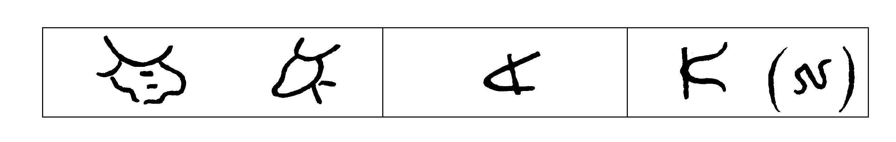
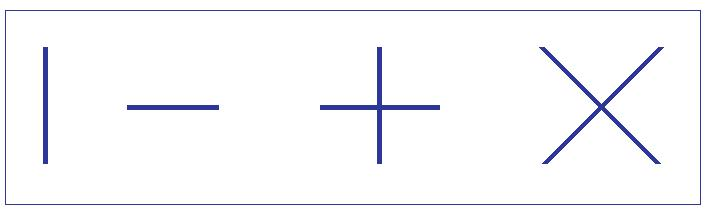
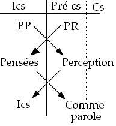
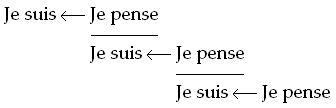
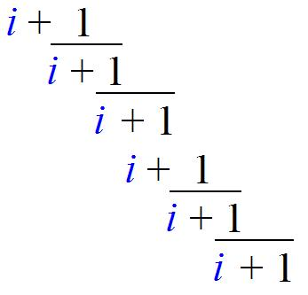
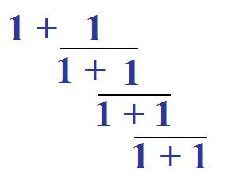
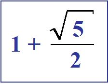
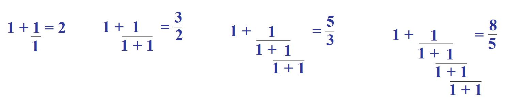
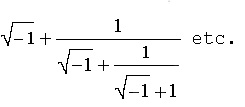
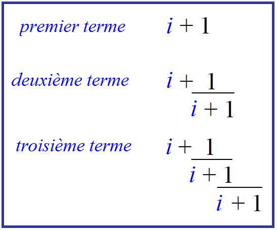

# Leçon 07 | 10 Janvier 1962

<!-- source-url: http://staferla.free.fr/S9/S9 L'IDENTIFICATION.docx -->
<!-- seminar: s9 -->
<!-- lesson: 07 -->

<!-- id: s9-07-0001 -->

Jamais je n’ai eu moins envie de faire mon *séminaire*. Je n’ai pas le temps d’approfondir pour *quelles causes*. Pourtant, beaucoup de choses à dire... Il y a des moments de tassement, de lassitude.

<!-- id: s9-07-0002 -->

Réévoquons ce que j’ai dit la dernière fois. Je vous ai parlé du *nom propre*, pour autant que nous l’avons rencontré sur notre chemin de *l’identification du sujet* - second type d’identification, régres­sive - *au trait unaire de l’Autre*. À propos de ce *nom propre*, nous avons rencon­tré l’*attention* qu’il a sollicitée de quelques *linguistes* et *mathématiciens* en fonction de philosopher. Qu’est-ce que le *nom propre* ?

<!-- id: s9-07-0003 -->

Il semble que la chose ne se livre pas au premier abord mais, essayant de résoudre cette question, nous avons eu la surprise de retrouver la fonction du signifiant, sans doute à l’état pur. C’était bien dans cette voie que *le linguiste* lui-même nous dirigeait quand il nous disait : un *nom propre*, c’est quelque chose qui vaut par la fonction distinctive de son matériel sonore.

<!-- id: s9-07-0004 -->

Ce en quoi bien sûr il ne faisait que redoubler ce qui est prémisses mêmes de l’analyse saussurienne du langage, à savoir : que c’est *le trait distinctif*, c’est *le phonème*, comme couplé d’un ensemble, d’une certaine batterie, pour autant uniquement qu’*il n’est pas ce que sont les autres*.

<!-- id: s9-07-0005 -->

Cette prémisse, nous trouvions ici devoir désigner ce qui était le trait spécial, l’usage d’une fonction du sujet dans le langage : celle de nommer par son *nom propre*. Il est certain que nous ne pouvions pas *nous contenter* de cette définition comme telle, mais que nous étions pour autant mis sur la voie de quelque chose, et ce quelque chose nous avons pu au moins l’approcher, le cerner, en désignant ceci : que c’est - si l’on peut dire, sous une forme « *latente* » au langage lui-même - *la fonction de l’écriture*, *la fonction du signe,* en tant que lui-même il se lit comme un objet.

<!-- id: s9-07-0006 -->

Il est un fait que les lettres ont des noms. Nous avons trop tendance à les confondre pour les noms simplifiés qu’elles ont dans notre alphabet, qui ont l’air de se confondre avec l’émission phonématique à laquelle la lettre a été réduite. Un « *a* » a l’air de vouloir dire l’émission « *a* »*.* Un « *b* » n’est pas à proprement parler un « *bé* », il n’est un « *bé* » que pour autant que pour que la consonne « *b* » se fasse entendre, il faut qu’elle s’appuie sur une émission voca­lique.

<!-- id: s9-07-0007 -->

Regardons les choses de plus près. Nous verrons par exemple qu’en *grec* α, β, γ, et la suite, sont bel et bien des noms, et chose surprenante : *des noms qui n’ont aucun sens dans la langue grecque où ils se formulent*. Pour les comprendre, il faut s’apercevoir qu’ils reproduisent les noms correspondant aux lettres de *l’alphabet phénicien*, d’un *alphabet protosémitique*, alphabet tel que nous pouvons le reconstituer d’un certain nombre d’étages, de strates des inscriptions.

<!-- id: s9-07-0008 -->

Nous en retrouvons les formes signifiantes : ces noms ont un sens dans la langue, soit phénicienne textuelle, soit telle que nous pouvons la recons­truire, cette langue protosémitique d’où serait dérivé un certain nombre - je n’insiste pas sur leur détail - des langages à l’évolution desquels est étroitement liée la première apparition de l’écriture.

<!-- id: s9-07-0009 -->

Ici, il est un fait qu’il est important au moins que vienne au premier plan que le nom même de l’*alef **א*** \[alf\] ait un rapport avec *le bœuf*, dont soi-disant la première forme de l’*alef* reproduirait d’une façon schématisée dans diverses positions la tête. Il en reste encore quelque chose nous pouvons voir encore dans notre A majuscule la forme d’un crâne de bœuf renversé avec les cornes qui le prolongent[^57]

<!-- id: s9-07-0010 -->

<!-- id: s9-07-0011 -->

Protosinaïtique Proto-phénicien Phénicien archaïque

<!-- id: s9-07-0012 -->

De même chacun sait que le ב \[bet\] est *le nom* de *la maison*. Bien sûr la discussion se complique, voire s’assombrit, quand on tente de faire un recensement, un catalogue de ce que désigne le nom de la suite des autres lettres. Quand nous arrivons au ג \[gimel\] nous ne sommes que trop tentés d’y retrouver le nom arabe du chameau, mais malheureusement il y a un obstacle de temps : c’est au *second millénaire*, à peu près, avant notre ère que ces *alphabets protosémitiques* pouvaient être en état de connoter ce nom de *la troisième lettre de l’alphabet*. Le chameau, malheureusement pour notre bien aise, n’avait pas encore fait son apparition dans l’usage culturel du portage, dans ces régions du *Proche-Orient*. On va donc entrer dans une série de discussions dans ce que peut bien représenter ce nom, ג \[gimel\]*.*

<!-- id: s9-07-0013 -->

Ici développe­ment sur *la tertiarité consonantique* des langues sémitiques et sur la permanence de cette forme à la base de toute forme verbale dans l’hébreu.

<!-- id: s9-07-0014 -->

C’est une des traces par où nous pouvons voir que ce dont il s’agit, concernant une des racines de la structure où se constitue le langage, est ce quelque chose qui s’appelle d’abord « *lecture des signes* », pour autant que déjà ils apparaissent *avant tout usage d’écriture* - je vous l’ai signalé en terminant *la dernière fois* - d’une façon *surprenante*, d’une façon qui semble *anticiper,* si la chose doit être admise, d’environ un millénaire l’usage des mêmes signes dans les alphabets qui sont les alphabets les plus courants, qui sont les ancêtres directs du nôtre, *alphabets latin, étrusque*, etc., lesquels se trouvent, par la plus extraordinaire *mimicry* \[imitation\] de l’his­toire, sous une forme identique dans des marques sur des poteries prédynas­tiques de l’antique Égypte. *Ce sont les mêmes signes*, encore qu’il soit hors de cause qu’ils n’aient pu à ce moment, d’aucune façon, être employés à des usages alphabétiques, l’écriture alphabétique étant à ce moment loin d’être née.

<!-- id: s9-07-0015 -->

Vous savez que, plus haut encore, j’ai fait allusion à ces fameux cailloux du Mas d’Azil qui ne sont pas pour peu dans les trouvailles faites à cet endroit...

<!-- id: s9-07-0016 -->

> au point qu’à la fin du paléolithique un stade est désigné du terme d’« *azilien* », du fait qu’il se rap­porte
>
> à ce que nous pouvons en définir le point d’évolution technique, à la fin de ce paléolithique, dans la période non pas à proprement parler transitionnelle, mais pré-transitionnelle du paléo au néolithique ...sur ces cailloux du Mas d’Azil nous retrouvons des *signes* analogues dont l’étrangeté frappante, à ressembler de si près aux *signes* de notre alphabet, a pu égarer - vous le savez - des esprits qui n’étaient pas spécialement médiocres, à toutes sortes de spéculations qui ne pou­vaient conduire qu’à la confusion, voire au ridicule. Il reste néanmoins que la présence de ces éléments est là pour nous faire tou­cher du doigt quelque chose qui se propose comme radical dans ce que nous pouvons appeler l’attache du langage au réel.

<!-- id: s9-07-0017 -->

Bien sûr, problème qui ne se pose que pour autant que nous avons pu d’abord voir la nécessité, pour comprendre le langage, de l’ordonner par ce que nous pouvons appeler « *une référence à lui-même *», à sa propre structure comme telle, qui d’abord pour nous a posé ce que nous pouvons presque appeler « *son système* » comme quelque chose qui d’aucune façon ne se suffit d’une genèse purement utilitaire, instrumentale, pratique, d’une genèse psychologique, qui nous montre le langage comme un ordre, un registre, une fonction dont c’est toute notre problématique qu’il nous faut la voir comme capable de fonctionner hors de toute conscience de la part du sujet, et dont nous sommes amenés comme tel à définir le champ comme étant carac­térisé par des valeurs structurales qui lui sont propres.

<!-- id: s9-07-0018 -->

Dès lors il faut bien, pour nous, établir la jonction de son fonctionnement avec ce *quelque chose* qui en porte, dans *le réel*, la marque. D’où vient la marque ? Est-elle centrifuge ou centripète ? C’est là, autour de ce problème, que nous sommes pour l’instant, non pas arrêtés, mais en arrêt. C’est donc en tant que le sujet - à propos de quelque chose qui est *marque*, qui est *signe* - lit déjà avant qu’il s’agisse des signes de l’écriture, qu’il s’aperçoit que des signes peuvent porter à l’occasion des morceaux diversement *réduits*, *découpés* de sa modulation parlante et que, renversant sa fonction, il peut être admis à en être ensuite comme tel le « *support phonétique* » comme on dit.

<!-- id: s9-07-0019 -->

Et vous savez que c’est ainsi qu’en fait naît l’écriture phonétique : qu’il n’y a aucune écriture à sa connaissance... plus exactement que tout ce qui est d’ordre à proprement parler de l’écriture - et non pas simplement d’un dessin - est quelque chose qui commence toujours avec l’usage combiné de *ces dessins simplifiés*, de *ces dessins abrégés*, de *ces* *dessins effacés* qu’on appelle diversement, improprement, *idéogrammes* en particulier.

<!-- id: s9-07-0020 -->

La combinaison de ces dessins avec un *usage phonétique* des mêmes signes qui ont l’air de représenter quelque chose, la combinaison des deux appa­raît par exemple évidente dans *les hiéroglyphes* égyptiens. D’ailleurs nous pour­rions, rien qu’à regarder une inscription *hiéroglyphe*, croire que les Égyptiens n’avaient pas d’autres objets d’intérêt que le bagage, somme toute limité :

<!-- id: s9-07-0021 -->

- d’un certain nombre d’animaux, *d’un très grand nombre, d’un nombre d’oiseaux à vrai dire surprenant* pour l’incidence sous laquelle effectivement peuvent intervenir *les oiseaux dans des inscriptions qui ont besoin d’être commémorées*,

<!-- id: s9-07-0022 -->

- d’un nombre sans doute abondant de formes instrumentales agraires et autres,

<!-- id: s9-07-0023 -->

- de quelques signes aussi qui de tous temps ont été sans doute utiles sous leur forme simplifiée *le trait unaire* d’abord, *la barre*, *la croix* de la multiplication, qui ne désignent pas d’ailleurs les opérations qui ont été attachées par la suite à ces signes.

<!-- id: s9-07-0024 -->

<!-- id: s9-07-0025 -->

Mais enfin, dans l’ensemble il est tout à fait évident au premier regard que le bagage de dessins dont il s’agit n’a pas de proportion, de congruence avec la diversité effective des objets qui pourraient être valablement évoqués dans des inscriptions durables. Aussi bien ce que vous voyez, ce que j’essaie de vous dési­gner, et qu’il est important de désigner au passage pour dissiper *des confusions* pour ceux qui n’ont pas le temps d’aller regarder les choses *de plus près*, c’est que, par exemple, la figure d’*un grand duc*, d’*un hibou*, pour prendre *une forme d’oiseau de nuit* particulièrement bien dessinée, repérable dans les inscriptions classiques sur pierre, nous la verrons revenir extrêmement souvent, et pourquoi ? Ce n’est certes pas qu’il s’agisse jamais de cet animal, c’est que le nom commun de cet animal dans le langage égyptien antique peut être l’occasion d’un support à l’émission labiale « *m* » et que chaque fois que vous voyez cette figure animale, il s’agit d’un « *m* » et de rien d’autre, lequel « *m* » d’ailleurs, loin d’être représenté sous sa valeur seulement lit­térale chaque fois que vous rencontrez cette figure dudit grand duc, est susceptible de quelque chose qui se fait à peu près comme cela :  

<!-- id: s9-07-0026 -->

M

<!-- id: s9-07-0027 -->

Le « *m* » signifiera plus d’une chose, et en particulier ce que nous ne pouvons, pas plus dans cette langue que dans la langue hébraïque, quand nous n’avons pas l’adjonction des points voyelles, que nous ne sommes pas très fixés sur les supports vocaliques, nous ne saurons pas comment exactement se com­plète ce « *m* ». Mais nous en savons en tout cas largement assez, d’après ce que nous pouvons reconstruire de *la syntaxe*, pour savoir que ce « *m* » peut aussi bien représenter une certaine fonction, qui est à peu près : une fonction introductrice du type : « *voyez...* »*,* une fonction de *fixation attentionnelle*, si on peut dire, un « *voici* ».

<!-- id: s9-07-0028 -->

Ou encore, dans d’autres cas où très probablement il devait se distinguer par son appui voca­lique, représenter une des formes, non pas de la négation, mais de quelque chose qu’il faut préciser, avec plus d’accent, du verbe négatif, de quelque chose qui isole la négation sous une forme verbale, sous une forme conjugable, sous une forme, non pas simplement « *ne* »*,* mais de quelque chose comme « *il est dit que non* »*.* Bref, que c’est un temps particulier d’un verbe que nous connaissons, qui est certes négatif, ou même plus exactement une forme particulière dans deux verbes néga­tifs, le verbe « *imi* » d’une part, qui semble vouloir dire « *ne pas être* »*,* et le verbe « *tm* » d’autre part, qui indiquerait plus spécialement la non-existence effective.

<!-- id: s9-07-0029 -->

C’est vous dire à ce propos, et en introduisant à ce propos d’une façon anti­cipante la fonction, que *ce n’est pas par hasard* que ce devant quoi nous nous trouvons en nous avançant dans cette voie, c’est le rapport qui ici s’incarne, se manifeste tout de suite de la coalescence la plus primitive du signifiant avec quelque chose qui tout de suite pose la question de ce que c’est que *la négation*, de quoi elle est le plus près.

<!-- id: s9-07-0030 -->

Est-ce que *la négation* est simplement une connotation, qui donc pourtant se propose comme de la question du moment où, par rapport à *l’existence*, à *l’exer­cice*, à *la constitution d’une chaîne signifiante*, s’y introduit une sorte d’indice, de sigle surajouté, de *mot outil* comme on s’exprime, qui devrait donc être toujours conçu comme une sorte d’invention seconde, tenue par les nécessités de l’utilisa­tion de quelque chose qui se situe à divers niveaux ?

<!-- id: s9-07-0031 -->

Est-ce que c’est au niveau de la réponse - ce qui est mis en question par l’interrogation signifiante « *cela n’y est pas ?* » - est-ce que c’est au niveau de la réponse que ce « *n’est-ce ?* » semble bien se manifester dans le lan­gage comme la possibilité de l’émission pure de la négation « *non* » *?*

<!-- id: s9-07-0032 -->

Est-ce que c’est, d’autre part, dans la marque des rapports que *la négation* s’impose, est suggérée, par la nécessité de la disjonction : *telle chose n’est pas, si telle autre est, ou ne sau­rait être avec telle autre,* bref, l’instrument de *la négation* ?

<!-- id: s9-07-0033 -->

Nous le savons, certes, pas moins que d’autres, mais si, pour ce qui est donc de la genèse du langage, on en est réduit à faire du signifiant quelque chose qui doit peu à peu s’élaborer à par­tir du signe émotionnel, le problème de la négation est quelque chose qui se pose comme celui, à proprement parler d’un saut, voire d’une impasse.

<!-- id: s9-07-0034 -->

Si, faisant du *signifiant* quelque chose de tout autre...

<!-- id: s9-07-0035 -->

> quelque chose dont la genèse est problématique, nous porte au niveau *d’une interrogation sur*
>
> *un cer­tain rapport existentiel*, celle qui comme telle déjà se situe dans une référence à *la négativité*

<!-- id: s9-07-0036 -->

...le mode sous lequel *la négation* apparaît, sous lequel le signifiant d’une *négativité* effective et vécue peut surgir, est quelque chose qui prend un *intérêt tout autre*, et qui n’est pas dès lors par hasard sans être de nature à nous éclairer, quand nous voyons que, dès les premières problématiques, *la structuration* *du langage s’identifie*, si l’on peut dire, au repérage de *la première conjugaison d’une émission* *vocale avec le signe* comme tel, c’est-à-dire avec quelque chose qui déjà se réfère à *une première* *manipulation de l’objet*.

<!-- id: s9-07-0037 -->

Nous l’avons appelée simplifi­catrice quand il s’est agi de définir la genèse du trait. Qu’est-ce qu’il y a de plus détruit, de plus effacé qu’un *objet* ? *Si c’est de l’objet que le trait surgit, c’est quelque chose de l’objet que le trait retient : justement son unicité*. L’effacement, la destruction absolue : de toutes ses autres émergences, de tous ses autres pro­longements, de tous ses autres appendices, de tout ce qu’il peut y avoir *de rami­fié, de palpitant.*

<!-- id: s9-07-0038 -->

Eh bien, ce rapport de l’objet à la naissance de quelque chose qui s’appelle ici *le signe*, pour autant qu’il nous intéresse dans *la naissance du signi­fiant*, c’est bien là autour de quoi nous sommes arrêtés, et autour de quoi il n’est pas sans promesse que nous ayons fait, si l’on peut dire, une découverte, car je crois que c’en est une : cette indication qu’il y a, disons dans un temps, un temps repérable, historiquement défini, un moment où quelque chose est là pour être lu, *lu avec du langage*, quand il n’y a pas d’écriture encore. Et c’est par le renversement de ce rapport, et de ce rapport de lecture du signe, que peut naître ensuite l’écriture pour autant qu’elle peut servir à *connoter* la phonématisation.

<!-- id: s9-07-0039 -->

Mais s’il apparaît *à ce niveau* que justement *le nom propre*, en tant qu’il spé­cifie comme tel l’enracinement du sujet, est plus spécialement lié qu’un autre, non pas à la phonétisation comme telle, à la structure du langage, mais à ce qui déjà dans le langage est prêt, si l’on peut dire, à recevoir *cette information du trait*. Si *le nom propre* en porte encore - jusque pour nous et dans notre usage - la trace sous cette forme que d’un langage à l’autre il ne se traduit pas, puisqu’il se transpose simplement, il se transfère. Et c’est bien là sa caractéristique : je m’appelle LACAN dans toutes les langues, et vous aussi de même, chacun par votre nom. Ce n’est pas là un fait contingent, un fait de limitation, d’impuissance, un fait de *non-sens* puisqu’au contraire c’est ici que gît, que réside la propriété toute particulière du nom, du *nom propre* dans la signification.

<!-- id: s9-07-0040 -->

Est-ce que ceci n’est pas fait pour nous faire nous interroger sur ce qu’il en est en ce point radical, archaïque, qu’il nous faut de toute nécessité supposer à l’origine de l’incons­cient.

<!-- id: s9-07-0041 -->

C’est-à-dire de ce quelque chose par quoi, en tant que le sujet parle, il ne peut faire que de s’avancer toujours plus avant dans la chaîne, dans le déroule­ment des énoncés, mais que, se dirigeant vers les énoncés, de ce fait même, *dans l’énonciation il élide quelque chose* qui est à proprement parler ce qu’il ne peut savoir, à savoir : *le nom de ce qu’il est* *en tant que sujet de l’énonciation*. Dans *l’acte de l’énonciation* il y a cette nomination latente qui est concevable comme étant le premier noyau, comme *signifiant*, de ce qui ensuite va s’organiser comme chaîne tournante telle que je vous l’ai représentée depuis toujours[^58], de ce centre, ce cœur parlant du sujet que nous appelons l’inconscient.

<!-- id: s9-07-0042 -->

Ici, avant que nous nous avancions plus loin, je crois devoir indiquer quelque chose qui n’est que la convergence, la pointe d’une thématique que nous avons abordée déjà à plusieurs reprises dans ce séminaire, à plusieurs reprises en la reprenant aux divers niveaux auxquels FREUD a été amené à l’aborder, à la repré­senter, à représenter le système, premier système psychique tel qu’il lui a fallu le représenter de quelque façon pour faire sentir ce dont il s’agit, système qui s’arti­cule comme « *Inconscient-Préconscient-Conscient* ».

<!-- id: s9-07-0043 -->

Maintes fois j’ai eu à décrire sur *ce tableau*, sous des formes diversement élaborées, les paradoxes auxquels les formulations de FREUD, au niveau de l’*Entwurf* [^59] par exemple, nous confron­tent. Aujourd’hui je m’en tiendrai à une *topologisation* aussi simple que celle qu’il donne *à la fin de la* *Traumdeutung* [^60], à savoir celle des couches à travers les­quelles peuvent se passer des franchissements, des seuils, des irruptions d’un niveau dans un autre, tel ce qui nous intéresse au plus haut chef, le passage de l’inconscient dans le préconscient par exemple, qui est en effet un problème, qui est un problème…d’ailleurs, je le note avec satisfaction en passant, ça n’est certes pas le moindre effet que je puisse attendre de l’effort de rigueur où je vous entraîne, que je m’impose à moi-même pour vous ici, et que ceux qui m’écou­tent, qui m’entendent, portent eux-mêmes à un degré susceptible même à l’occa­sion d’aller plus avant, eh bien, dans leur très remarquable texte publié dans *Les Temps modernes* [^61] sur le sujet de *L’Inconscient,* LAPLANCHE et LECLAIRE - je ne dis­tingue pas pour l’instant leur part à chacun dans ce travail - s’interrogent sur quelle ambiguïté reste dans l’énonciation freudienne, concernant ce qui se passe quand nous pouvons parler du passage de quelque chose qui était dans l’incons­cient et qui va dans le préconscient. Est-ce à dire qu’il ne s’agit que d’un *chan­gement d’investissement*, comme ils posent très justement la question, ou bien est-ce qu’il y a *double inscription* ? Les auteurs ne dissimulent pas leur préfé­rence pour la *double inscription*, ils nous l’indiquent dans leur texte, c’est là pourtant un problème que le texte laisse ouvert, et somme toute, ce à quoi nous avons affaire nous permettra cette année d’y apporter peut-être quelque *réponse*, ou à tout le moins quelque *précision*.

<!-- id: s9-07-0044 -->

Je voudrais, de façon introductive, vous suggérer ceci, c’est que si nous devons considérer que l’inconscient c’est ce lieu du sujet où ça parle, nous en venons maintenant à approcher ce point où nous pouvons dire que quelque chose, à l’insu du sujet, est profondément remanié par les effets de rétroaction du signifiant impliqué dans la parole. C’est pour autant - et pour la moindre de ses paroles - que le sujet parle, qu’il ne peut faire que de toujours une fois de plus se nommer sans le savoir, et sans savoir de quel nom.

<!-- id: s9-07-0045 -->

Est-ce que nous ne pou­vons pas voir que, pour situer dans leurs rapports l’*Inconscient* et le *Précons­cient*, la limite pour nous n’est pas à situer d’abord quelque part à l’intérieur, comme on dit, d’un sujet qui ne serait simplement que l’équivalent de ce qu’on appelle au sens large « *le psychique* » ? Le sujet dont il s’agit pour nous - et surtout si nous essayons de l’articuler comme *le sujet inconscient -* comporte une autre constitution de la frontière : ce qu’il en est du préconscient, pour autant que ce qui nous intéresse dans le préconscient c’est le langage, le langage tel qu’effecti­vement, non seulement nous le voyons, l’entendons parler, mais tel qu’il scande, qu’il articule nos pensées.

<!-- id: s9-07-0046 -->

Chacun sait que *les pensées* dont il s’agit au niveau de l’inconscient, même si je dis qu’elles sont « *structurées comme un langage* », bien sûr c’est pour autant *qu’elles sont structurées* au dernier terme et à un certain niveau « *comme un langage* » qu’elles nous intéressent, mais la première chose à constater, celles dont nous parlons, c’est qu’il n’est pas facile de les faire s’expri­mer dans le langage commun. Ce dont il s’agit, c’est de voir que *le langage arti­culé du discours commun*, par rapport au sujet de l’inconscient en tant qu’il nous intéresse, *il est au-dehors*.

<!-- id: s9-07-0047 -->

Un « *au-dehors »* qui conjointe en lui ce que nous appelons nos pensées intimes, et ce *langage* qui court *au-dehors*, non pas d’une façon *immatérielle*, puisque nous savons bien - parce que toutes sortes de choses sont là pour nous le représenter - nous savons ce que ne savaient peut-être pas les cultures où tout se passe dans le souffle de la parole, nous qui avons devant nous *des kilos de langage*, et qui savons par-dessus le marché *inscrire la parole* la plus fugitive sur des disques, nous savons bien que *ce qui est parlé*, le *discours effec­tif*, le discours préconscient, est entièrement homogénéisable comme quelque chose *qui se tient au-dehors*. Le langage, en substance, court les rues, et là, il y a effectivement une inscription, sur une bande magnétique au besoin. Le pro­blème de ce qui se passe quand l’inconscient vient à s’y faire entendre est le pro­blème de la limite entre cet inconscient et ce préconscient. Cette limite, comment nous faut-il la voir ?

<!-- id: s9-07-0048 -->

C’est le problème que, pour l’ins­tant, je vais laisser ouvert. Mais ce que nous pouvons à cette occasion indiquer, c’est qu’à passer de l’inconscient dans le préconscient, ce qui s’est constitué dans l’inconscient rencontre un discours déjà existant, si l’on peut dire, un jeu de signes en liberté, non seulement interférant avec les choses du réel, mais on peut dire *étroitement*, tel un mycelium tissé dans leur intervalle.

<!-- id: s9-07-0049 -->

Aussi bien, n’est-ce pas là la véritable raison de ce qu’on peut appeler la fascination, l’empêtrement idéaliste dans l’expérience philosophique. Si l’homme s’aperçoit, ou croit s’apercevoir qu’il n’a jamais que des *idées des choses*, c’est-à-dire que, des choses, il ne connaît enfin que les idées, c’est justement parce que déjà dans le monde des choses cet empaquetage dans un univers du discours est quelque chose qui n’est absolument pas dépétrable.

<!-- id: s9-07-0050 -->

Le préconscient, pour tout dire, est d’ores et déjà dans le réel, et le statut de l’inconscient, lui, s’il pose un pro­blème, c’est pour autant qu’il s’est constitué à un tout autre niveau, à un niveau plus radical de l’émergence de l’acte d’énonciation. Il n’y a pas en principe, d’objection au passage de quelque chose de l’inconscient dans le préconscient, ce qui tend à se manifester, dont LAPLANCHE et LECLAIRE notent si bien le caractère contradictoire.

<!-- id: s9-07-0051 -->

L’*inconscient* a comme tel son statut comme quelque chose qui, de position et de structure, ne saurait pénétrer au niveau où il est susceptible d’une verbalisation préconsciente. Et pourtant, nous dit-on, cet *inconscient* à tout instant fait effort, pousse dans le sens de se faire reconnaître. Assurément, et pour cause, c’est qu’il est chez lui, si on peut dire, dans un univers *structuré par le discours*. Ici, le passage de l’inconscient vers le préconscient n’est, on peut dire, qu’une sorte d’effet d’irradiation normale de ce qui tourne dans la constitution de l’inconscient comme tel, de ce qui, dans l’inconscient, maintient présent le fonctionnement *premier* et *radical* de l’articulation du sujet en tant que sujet parlant.

<!-- id: s9-07-0052 -->

Ce qu’il faut voir, c’est que l’ordre qui serait celui de *l’incons­cient* au *préconscient* puis arriverait à *la conscience*, n’est pas à accepter sans être révisé, et l’on peut dire que d’une certaine façon, pour autant que nous devons admettre ce qui est préconscient comme défini, comme étant dans la circulation du monde, dans la circulation réelle, nous devons concevoir que ce qui se passe au niveau du préconscient est quelque chose que nous avons à lire de la même façon, sous la même structure, qui est celle que j’essayais de vous faire sentir à ce point de racine où quelque chose vient apporter au langage ce qu’on pourrait appeler sa dernière sanction : cette lecture du signe.

<!-- id: s9-07-0053 -->

Au niveau actuel de la vie du sujet constitué, d’un sujet élaboré par une longue histoire de culture, ce qui se passe c’est, pour le sujet, une lecture au-dehors de ce qui est ambiant, *du fait de la présence du langage dans le réel*, et au niveau de la conscience, ce niveau qui, pour FREUD, a toujours semblé faire problème : il n’a jamais cessé d’indiquer qu’il était certainement l’objet futur à précision, à arti­culation plus précise quant à sa fonction économique, au niveau où il nous le décrit au début, au moment où se dégage sa pensée, souvenons-nous comment il nous décrit *cette couche protectrice* qu’il désigne du terme ϕ : c’est avant tout quelque chose qui, pour lui, est à comparer avec *la pellicule de surface des organes sensoriels*, c’est-à-dire essentiellement avec quelque chose qui filtre, qui ferme, qui trie, qui ne retient que cet indice de qualité dont nous pouvons montrer que la fonction est homologue avec cet indice de réalité qui nous permet juste de goûter l’état où nous sommes, assez pour être sûrs que nous ne rêvons pas, s’il s’agit de quelque chose d’analogue. C’est vrai­ment du visible que nous voyons.

<!-- id: s9-07-0054 -->

De même *la conscience*, par rapport à ce qui constitue *le pré­conscient* et nous fait ce monde étroitement tissé par *nos pensées,* la conscience est *la surface* par où la perception de ce quelque chose qui est au cœur du sujet *reçoit*, si l’on peut dire, *du dehors ses propres pensées*, son propre discours. La conscience est là pour que l’inconscient, si l’on peut dire, bien plutôt refuse ce qui lui vient du préconscient, ou y choisisse de la façon la plus étroite ce dont il a besoin pour ses offices.

<!-- id: s9-07-0055 -->

Et qu’est-ce que c’est ?

<!-- id: s9-07-0056 -->

C’est bien là que nous rencontrons ce paradoxe qui est ce que j’ai appelé *l’entrecroisement des fonctions systémiques *:

<!-- id: s9-07-0057 -->

<!-- id: s9-07-0058 -->

À ce premier niveau, si essentiel à reconnaître, de l’articulation freudienne, l’inconscient vous est représenté par lui comme un flux, comme un monde, comme une chaîne de pensées. Sans doute, la conscience aussi est faite de la cohérence des perceptions le test de réalité, c’est l’articulation des perceptions entre elles dans un monde organisé. Inversement, ce que nous trouvons dans *l’inconscient*, c’est cette répétition significative qui nous mène de quelque chose qu’on appelle les pensées, *Gedanken,* fort bien formées, dit FREUD, à une concaténation de pensées qui nous échappe à nous-mêmes.

<!-- id: s9-07-0059 -->

Or, qu’est-ce que FREUD lui-même va nous dire ? *Qu’est-ce que cherche le sujet au niveau de l’un et l’autre des deux systèmes* ?

<!-- id: s9-07-0060 -->

Qu’au niveau du préconscient ce que nous cherchons ce soit à proprement parler l’identité des pensées, c’est ce qui a été élaboré par tout ce chapitre de l’épistémologie depuis PLATON : l’effort de notre organisation du monde, l’effort logique, c’est à proprement parler *réduire le divers à l’identique*. C’est identifier pensée à pensée, proposition à proposition dans des relations diverse­ment articulées qui forment la trame même de ce que l’on appelle la logique for­melle.

<!-- id: s9-07-0061 -->

Ce qui pose, pour celui qui considère d’une façon extrêmement idéale l’édifice de la science comme pouvant ou devant, même virtuellement, être déjà achevé, ce qui pose le problème de savoir si effectivement toute science, tout savoir, toute saisie du monde d’une façon ordonnée et articulée, ne doit pas aboutir à une *tautologie*. Ce n’est pas pour rien que vous m’avez entendu à plu­sieurs reprises évoquer le problème de la *tautologie*, et nous ne saurions d’aucune façon terminer cette année notre discours sans y apporter un jugement définitif.

<!-- id: s9-07-0062 -->

Le monde donc, ce monde dont la fonction de réalité est liée à la fonction per­ceptive, est tout de même ce autour de quoi nous ne progressons dans notre savoir que par la voie de l’identité des pensées. Ceci n’est point pour nous un paradoxe, mais ce qui est paradoxal, c’est de lire dans le texte de FREUD que ce que cherche l’inconscient, ce qu’il veut, si l’on peut dire, que ce qui est la racine de son fonctionnement, de sa mise en jeu, c’est l’identité des perceptions, c’est-à-dire que ceci n’aurait littéralement aucun sens si ce dont il s’agit ce n’était pas que ceci : que le rapport de l’inconscient à ce qu’il cherche dans son mode propre de retour, c’est justement ce qui dans *l’une fois perçu* est l’identiquement iden­tique si l’on peut dire, c’est le perçu de *cette fois–là,* c’est cette bague qu’il s’est passée au doigt cette fois-là, avec le poinçon de cette *fois-là*.

<!-- id: s9-07-0063 -->

Et c’est justement cela qui man­quera toujours, c’est qu’à toute espèce d’autre réapparition de ce qui répond au signifiant originel, point où est la marque que le sujet a reçue de ce, quoi que ce soit, qui est à l’origine de l’*Urverdrängt*, il manquera toujours, à quoi que ce soit qui vienne le représenter, cette marque qui est la marque unique du surgissement originel d’un signifiant originel qui s’est présenté une fois au moment où le point, le quelque chose de l’*Urverdrängt* en question est passé à l’existence inconsciente, à l’insistance dans cet ordre interne qu’est l’inconscient, entre, d’une part ce qu’il reçoit du monde extérieur et où il a des choses à lier, et du fait que de les lier sous une forme signifiante, il ne peut les recevoir que dans leur différence. Et c’est bien pour ça qu’il ne peut d’aucune façon être satisfait par cette recherche comme telle de l’identité perceptive, si c’est ça même qui le spécifie comme inconscient.

<!-- id: s9-07-0064 -->

Ceci nous donne la triade *conscient-inconscient- pré­conscient* dans un ordre légèrement modifié, et d’une certaine façon qui justifie la formule que j’ai déjà une fois essayé[^62] de vous donner de l’inconscient en vous disant qu’il était entre perception et conscience, comme on dit entre cuir et chair.

<!-- id: s9-07-0065 -->

C’est bien là quelque chose qui, une fois que nous l’avons posé, nous indique de nous reporter à ce point dont je suis parti en formulant les choses à partir de *l’expérience philosophique de la recherche du sujet* telle qu’elle existe dans DESCARTES, en tant qu’il est strictement différent de tout ce qui a pu se faire à aucun autre moment de la réflexion philosophique, pour autant que c’est bien le sujet qui lui-même est interrogé, qui cherche à l’être comme tel : le sujet en tant qu’il y va de toute la vérité à son propos, que ce qui y est interrogé c’est non pas le réel et l’apparence, le rapport de ce qui existe et de ce qui n’existe pas, de ce qui demeure et de ce qui fuit*,* mais de savoir *si on peut se fier à l’Autre*, si comme tel ce que le sujet reçoit de l’extérieur est un signe fiable.

<!-- id: s9-07-0066 -->

Le « *Je pense, donc je suis* » je l’ai trituré suffisamment devant vous pour que vous puissiez voir maintenant à peu près comment s’en pose le problème. Ce « *Je pense* » dont nous avons dit à proprement parler qu’il était un non-sens \- *et c’est ce qui fait son prix -* il n’a, bien sûr, pas plus de *sens* que le « *je mens* » mais il ne peut faire, à partir de son articulation, que de s’apercevoir lui-même que « ...*donc je suis* » ça n’est pas la conséquence qu’il en tire, mais c’est qu’il ne peut faire que de penser, à partir du moment où vraiment il commence à penser.

<!-- id: s9-07-0067 -->

C’est-à-dire que c’est en tant que ce « *Je pense* » impossible passe à quelque chose qui est de l’ordre du préconscient, qu’il implique comme *signifié* - et non pas comme conséquence, comme détermination ontologique - qu’il implique comme *signifié* que ce « *Je pense* » renvoie à un « ...*je suis* » qui désormais n’est plus que le « X » de ce sujet que nous cherchons, à savoir de ce qu’il y a au départ pour que puisse se produire l’identification de ce « *Je pense* ».

<!-- id: s9-07-0068 -->

Remarquez que ceci continue, et ainsi de suite : si « *je pense que je pense que je suis* »*,* je ne suis plus à ironiser si je pense que je ne peux faire qu’être un *pensêtre ou* un *êtrepensant,* le « *Je pense* » qui est ici au dénominateur voit très facilement se reproduire la même *duplicité*, à savoir que je ne peux faire que de m’*apercevoir* que, pensant que je pense, ce « *Je pense* »*,* qui est au bout de ma pensée sur ma pensée, est lui–même un « *Je pense* » qui repro­duit le « *Je pense, donc je suis* ».

<!-- id: s9-07-0069 -->

<!-- id: s9-07-0070 -->

Est-ce *ad infinitum* ? Sûrement pas !

<!-- id: s9-07-0071 -->

C’est aussi un des modes les plus courants des exercices philosophiques, quand on a commencé d’établir une telle formule, que d’appliquer que ce qu’on a pu y retenir d’expérience effective est en quelque sorte indéfini­ment multipliable comme dans un jeu de miroirs. Il y a un petit exercice qui est celui auquel je me suis livré dans un temps, mon petit *sophisme personnel*, celui de *L’assertion de certitude anticipée* [^63] à propos *du jeu des disques*, où c’est du repé­rage de ce que font les deux autres qu’un sujet doit déduire *la marque* « *pair* » *ou* « *impair* » dont lui-même est affecté dans son propre dos, c’est-à-dire quelque chose de fort voisin de ce dont il s’agit ici \[Cf. séminaire 1954-55 : Le moi..., 30-03\].

<!-- id: s9-07-0072 -->

Il est facile de voir dans l’articulation de ce jeu, que loin que l’hésitation, qui est en effet tout à fait possible à voir se produire, car si je vois les autres décider trop vite, de la même décision que je veux prendre, à savoir que *je suis comme eux marqué d’un disque de la même couleur*, si je les vois tirer trop vite *leur conclusion*, j’en tirerai justement *la conclusion,* je peux à l’occasion voir surgir pour moi quelque hésitation, à savoir que s’ils ont vu si vite qui ils étaient, c’est que moi-même je suis assez distinct d’eux pour me repé­rer, car en toute logique ils doivent se faire la même réflexion.

<!-- id: s9-07-0073 -->

Nous les verrons aussi osciller et se dire : « *Regardons-y à deux fois* ». C’est-à-dire que *les trois sujets dont il s’agit auront la même hésitation ensemble*, et on démontre facile­ment que c’est effectivement au bout de trois oscillations hésitantes que seule­ment ils pourront vraiment avoir, et auront certainement et en quelque sorte en plein, figurées par la scansion de leurs hésitations, les limitations de toutes les possibilités contradictoires.

<!-- id: s9-07-0074 -->

Il y a quelque chose d’analogue ici. Ce n’est pas indéfiniment qu’on peut inclure tous les « *Je pense, donc je suis* » dans un « *Je pense* ». Où est la limite ? C’est ce que nous ne pouvons pas tout de suite ici si facilement dire et savoir. Mais la question que je pose, ou plus exactement celle que je vais vous demander de suivre, parce que bien sûr vous allez, peut-être, être surpris, mais c’est de la suite, que vous verrez venir ici s’adjoindre ce qui peut modifier, je veux dire rendre opérant ultérieurement ce qui ne m’a semblé au premier abord qu’une sorte de jeu, voire, comme on dit, de récréation mathématique :

<!-- id: s9-07-0075 -->

- Si nous voyons que quelque chose dans l’appréhension cartésienne, qui se termine sûrement dans son énonciation à des niveaux différents, puisque aussi bien il y a quelque chose qui ne peut pas aller plus loin que ce qui est inscrit ici, et il faut bien qu’il fasse intervenir quelque chose qui vient, non pas de la pure élaboration, sur quoi puis­-je me fonder, *qu’est-ce qui est fiable* ? Il va bien être amené comme tout le monde à essayer de se débrouiller avec ce qui se vit à l’extérieur, mais dans *l’identification* qui est celle *qui se fait au trait unaire*, est-ce qu’il n’y en a pas assez pour supporter *ce point impensable et impossible du* « *Je pense* » au moins sous sa forme de différence radicale ?

<!-- id: s9-07-0076 -->

- Si c’est par « 1 » que nous le figurons ce « *Je pense* », je vous le répète : en tant qu’il ne nous intéresse que pour autant qu’il a rapport avec ce qui se passe à l’origine de la nomination, en tant que c’est ce qui intéresse la naissance du sujet : *le sujet est ce qui se nomme*.

<!-- id: s9-07-0077 -->

- Si nommer c’est d’abord quelque chose qui a affaire avec une lecture du trait « 1 » désignant la dif­férence absolue, nous pouvons nous demander comment chiffrer la sorte de « *je suis* » qui ici se constitue, en quelque sorte rétroactivement, simplement de la re-projection de ce qui se constitue comme signifié du « *Je pense* »,

<!-- id: s9-07-0078 -->

> à savoir la même chose, l’inconnu \[*i*\] de ce qui est à l’origine sous la forme du sujet.

<!-- id: s9-07-0079 -->

<!-- id: s9-07-0080 -->

- Si le *i*, qu’ici j’indique sous la forme définitive que je vais lui laisser, est quelque chose qui ici se suppose dans une problématique totale, à savoir qu’il est aussi bien vrai qu’il « *n’est pas* »*,* puisque ici il « *n’est* » qu’à « *penser à penser* »*,* est pour­tant *corrélatif*, *indispensable* - et c’est bien ce qui fait la force de l’argument cartésien - de toute appréhension *d’une pensée* dès lors qu’elle s’enchaîne, cette voie lui est ouverte vers un *cogitatum* de quelque chose qui s’articule : *cogito ergo sum*.

<!-- id: s9-07-0081 -->

Je vous en saute pour aujourd’hui les intermédiaires parce que vous verrez dans la suite *d’où ils viennent*, et qu’après tout, au point où j’en suis, il a bien fallu que j’en passe par là. Il y a quelque chose dont je dirai que c’est à la fois paradoxal et pourquoi ne pas dire *amusant*, mais je vous le répète, si cela a un intérêt c’est pour ce que cela peut avoir d’opérant. Une telle formule, en mathé­matiques, c’est ce qu’on appelle une série. Je vous passe ce qui aussitôt peut, pour toute personne qui a une pratique des mathématiques, se poser comme question :­ si c’est une série, *est-ce une série convergente* ? Cela veut dire quoi ? Cela veut dire que si au lieu d’avoir petit ***i*** vous aviez des **1** partout :

<!-- id: s9-07-0082 -->

<!-- id: s9-07-0083 -->

Un effort de mise en forme vous permettrait tout de suite de voir que cette série est *convergente*, c’est-à-dire que, si mon souvenir est bon, elle est égale à quelque chose comme :

<!-- id: s9-07-0084 -->

<!-- id: s9-07-0085 -->

L’important, c’est que ceci veut dire que si vous effectuez les opé­rations dont il s’agit, vous avez donc les valeurs qui, si vous les reportez, prendront à peu près cette forme-là :

<!-- id: s9-07-0086 -->

<!-- id: s9-07-0087 -->

...jusqu’à venir converger sur une valeur parfaitement constante qu’on appelle *une limite*.

<!-- id: s9-07-0088 -->

Trouver une formule convergente dans la formule précédente nous intéresse­rait d’autant moins que cela voudrait dire que le sujet est une fonction qui tend à une parfaite stabilité. Mais ce qui est intéressant, et c’est là que je fais un saut, parce que pour éclairer ma lanterne je ne vois pas d’autre façon que de com­mencer à projeter la tache et de revenir après la lanterne : prenez « ***i*** », en me fai­sant confiance, pour la valeur qu’il a exactement dans la théorie des nombres où on l’appelle « *imaginaire* », ça n’est pas une homonymie qui, à elle toute seule, me parait ici justifier cette *extrapolation méthodique*, ce petit moment de saut et de confiance que je vous demande de faire, cette valeur imaginaire est celle­-ci : √-1.

<!-- id: s9-07-0089 -->

Vous savez quand même assez d’arithmétique élémentaire pour savoir que √-1 *n’est aucun nombre réel*. Il n’y a aucun nombre négatif, -1 par exemple, qui puisse d’aucune façon remplir la fonction d’être la racine d’un nombre quelconque dont √-1 serait le facteur. Pourquoi ? Parce que pour être la racine carrée d’un nombre négatif, cela veut dire qu’élevé au carré, ça donne un nombre négatif, or aucun nombre élevé au carré ne peut donner un nombre négatif, puisque tout nombre négatif élevé au carré devient positif.

<!-- id: s9-07-0090 -->

C’est pour­quoi √-1 n’est rien qu’un algorithme, mais c’est un algorithme qui sert. Si vous définissez comme nombre complexe tout nombre composé d’un nombre réel « *a* » auquel est adjoint un nombre imaginaire \[*a + ib*\], c’est-à-dire un nombre qui ne peut aucunement s’additionner à lui, puisqu’il n’est pas un nombre réel fait du produit de √-1 avec « *b* », si vous définissez ceci « *nombre complexe* », vous pourrez faire avec ce *nombre complexe*, et avec le même *succès*, *toutes les opé­rations que vous pouvez faire avec des nombres réels*.

<!-- id: s9-07-0091 -->

Et quand vous vous serez lancés dans cette voie, vous n’aurez pas eu seulement la satisfaction de vous aper­cevoir que ça marche, mais que ça vous permettra de faire des découvertes, c’est-à-dire de vous apercevoir que les nombres ainsi constitués ont une valeur qui vous permet notamment d’opérer de façon purement numérique avec ce qu’on appelle des « *vec­teurs* », c’est-à-dire avec des grandeurs qui, elles, seront non seulement pourvues d’une valeur diversement représentable par une longueur, mais en plus que, grâce aux *nombres complexes*, vous pourrez impliquer dans votre connotation, non seulement ladite grandeur*, mais sa direction, et surtout l’angle qu’elle fait avec telle autre grandeur*.

<!-- id: s9-07-0092 -->

De sorte que √-1, qui n’est pas un *nombre réel*, s’avère, du point de vue opératoire, avoir une puissance singulièrement plus *époustouflante*, si je puis dire, que tout ce dont vous avez disposé jusque-là en vous limitant *à la série des* *nombres* *réels*. Ceci pour vous introduire ce que c’est que ce *petit i.*

<!-- id: s9-07-0093 -->

Et alors, si l’on suppose que ce que nous cherchons ici à connoter d’une façon numérique, c’est quelque chose sur quoi nous pouvons opérer en lui donnant *cette valeur conventionnelle* √-1. Cela veut dire quoi « *conventionnelle* » ? Que :

<!-- id: s9-07-0094 -->

- de même que nous nous sommes appliqués à élaborer *la fonction de l’unité comme fonction de la différence radicale* dans la détermination de ce centre idéal du sujet qui s’appelle *« idéal du moi »,*

<!-- id: s9-07-0095 -->

- de même dans la suite - et pour une bonne raison : c’est que nous l’identifierons à ce que nous avons jusqu’ici introduit *dans notre connotation à nous personnelle comme* ϕ*,* c’est-à-dire *la fonction imaginaire du phallus - nous allons nous employer à extraire de cette connotation* √-1 *tout ce en quoi il peut nous servir d’une façon opératoire*.

<!-- id: s9-07-0096 -->

Mais en attendant, l’utilité de son introduc­tion à ce niveau s’illustre en ceci : c’est que si vous recherchez ce qu’elle fait cette fonction, en d’autres termes, c’est √-1 qui est là partout où vous avez vu *petit i :*

<!-- id: s9-07-0097 -->

<!-- id: s9-07-0098 -->

…vous voyez apparaître une fonction qui n’est point une fonc­tion convergente, qui est une fonction périodique, qui est facilement calculable : c’est une valeur qui se renouvelle, si l’on peut dire, tous les trois temps dans la série.

<!-- id: s9-07-0099 -->

La série se définit ainsi :

<!-- id: s9-07-0100 -->

<!-- id: s9-07-0101 -->

Vous retrouverez périodiquement, c’est-à-dire *toutes les trois fois* dans la série, cette même valeur, ces mêmes trois valeurs que je vais vous donner :

<!-- id: s9-07-0102 -->

- *La première valeur* c’est *i* + 1, c’est-à-dire le point d’énigme où nous sommes pour nous demander *quelle valeur nous pourrons bien donner à « i » pour connoter le sujet en tant que le sujet d’avant toute nomination*. Problème qui nous intéresse.

<!-- id: s9-07-0103 -->

- *La deuxième valeur* que vous trouverez, à savoir : *i*+(1/1+*i*) est strictement égale à (1+*i*)/2 et ceci est assez intéressant, car la première chose que nous rencontrerons c’est ceci : c’est que le rapport essentiel de ce *quelque chose* que nous cherchons comme étant *le sujet avant qu’il se nomme* à l’usage qu’il peut faire de *son nom* tout simplement pour être le signifiant de ce qu’il y a à signifier, c’est-à-dire de la question du *signifié* justement *de cette addition de lui-même à son propre nom* c’est immédiatement de *splitter,* de diviser en deux, de faire qu’il ne reste qu’une moitié de - littéralement (1+*i*)/2 - de ce qu’il y avait en présence. Comme vous pouvez le voir, mes mots ne sont pas préparés, mais ils sont quand même bien calculés, et ces choses sont tout de même le fruit d’une élaboration que j’ai refaite par trente six portes d’entrée en m’assurant d’un certain nombre de contrôles, ayant à la suite un certain nombre d’aiguillages dans les voies qui vont suivre.

<!-- id: s9-07-0104 -->

- *La troisième valeur*, c’est-à-dire quand vous arrêterez là le terme de la série, ce sera « 1 », tout simplement, ce qui par bien des côtés peut avoir pour nous la valeur d’une sorte de confirmation de boucle. Je veux dire que c’est

<!-- id: s9-07-0105 -->

> à savoir que si c’est au troisième temps - chose curieuse, temps vers lequel aucune méditation philosophique ne nous a poussés à spécialement nous arrê­ter, c’est-à-dire au temps du « *je pense* », en tant qu’il est lui–même objet de pen­sée et qu’il se prend comme objet - si c’est à ce moment-là que nous semblons arriver à atteindre cette fameuse *unité*, dont le caractère satisfaisant pour définir quoi que ce soit n’est assurément pas douteux, mais dont nous pouvons nous demander si c’est bien de la même unité qu’il s’agit que de celle dont il s’agissait au départ, à savoir dans *l’identification primordiale* et déclenchante.

<!-- id: s9-07-0106 -->

À tout le moins, il faut que je laisse pour aujourd’hui ouverte cette question.

## Notes

[^57]: James G. Février : Histoire de l’écriture, op.cit. Tableau comparatif p.196.

[^58]: Cf. séminaires : *Les écrits techniques*..., séances des 07-04 et 05-05, et *Le moi*... séance du 19-01.

[^59]: S. Freud : *Esquisse d'une psychologie scientifique* in *La naissance de la psychanalyse*, Paris, PUF, 1996.

    Cf. séminaires : *Le moi*... séances des 26-01, 02-02, 09-02, 02-03, et *L'éthique*... séances des 25-11 , 2-12 , 9-12.

[^60]: S. Freud : L'interprétation des rêves, PUF 2003, chap. VII : *Psychologie des processus du rêve*.

[^61]:
    #  J. Laplanche et S. Leclaire : L'inconscient : une étude psychanalytique, Les Temps Modernes, n°183, juillet 1961. 

    #  Cf. aussi leur rapport au 6ème congrès de Bonneval, in Henry Hey, L’inconscient : 6ème Colloque de Bonneval 1960.

[^62]: Cf. séminaire 1959-60 : *L’éthique*… séance du 09-12.

[^63]: J. Lacan : *Le temps logique et l'assertion de certitude anticipée* : Séminaire *Le moi*..., Seuil, 1978, séance du 16-06, et Écrits, p.197 ou t.1 p.195 .
