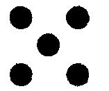
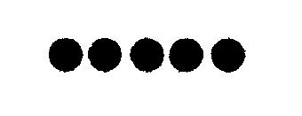
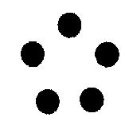

# Leçon 11 | 28 Février 1962

<!-- source-url: http://staferla.free.fr/S9/S9 L'IDENTIFICATION.docx -->
<!-- seminar: s9 -->
<!-- lesson: 11 -->

<!-- id: s9-11-0001 -->

On peut trouver que je m’occupe ici un peu beaucoup de ce qu’on appelle - Dieu damne cette dénomination - des grands philosophes.

<!-- id: s9-11-0002 -->

C’est que peut-être, pas eux seuls, mais *eux éminemment*, articulent ce qu’on peut bien appeler une recherche, pathétique de ce qu’elle revienne toujours - si on sait la considérer à travers tous ses détours, ses objets plus ou moins sublimes - à ce nœud radical que j’essaie pour vous de desserrer, à savoir : le désir.

<!-- id: s9-11-0003 -->

C’est ce que j’espère : à la recherche, si vous voulez bien me suivre, rendre décisivement à sa propriété de *point indépassable*, *indépassable* au sens même que j’entends quand je vous dis que chacun de ceux qu’on peut appeler de ce nom de « *grand philosophe »* ne saurait être sur un certain point, dépassé.

<!-- id: s9-11-0004 -->

Je me crois en droit de m’affronter, avec votre *assistance,* à une telle tâche pour autant que le désir, c’est notre affaire comme psychanalystes. Je me crois aussi requis de m’y attacher, et de vous requérir de le faire avec moi, parce que ce n’est qu’à rectifier notre visée sur le désir que nous pouvons maintenir la technique analytique dans sa fonction pre­mière : le mot « *première* » devant être entendu au sens de *d’abord apparue dans l’histoire*. Il n’était pas douteux au départ : *une fonction de vérité*.

<!-- id: s9-11-0005 -->

Bien sûr, c’est ce qui nous sollicite à *l’interroger*, cette fonction, à un niveau plus radical. C’est celui que j’essaie de vous montrer en articulant pour vous ceci, qui est au fond de l’expérience analytique : que nous sommes asservis, comme hommes, je veux dire : comme êtres désirants, que nous le sachions ou pas, que nous croyions ou non le vouloir, à cette fonction de vérité.

<!-- id: s9-11-0006 -->

Car, faut-il le rappeler, les conflits, les *impasses*, qui sont la matière de notre praxis, ne peuvent être objectivés *qu’à faire intervenir dans leur jeu, la place du sujet* comme tel, en tant que lié, comme sujet, *dans la structure de l’expérience.* C’est là le sens de *l’identification*, en tant que telle elle est définie par FREUD.

<!-- id: s9-11-0007 -->

Rien n’est plus exact, rien n’est plus exigeant que le calcul de la conjoncture subjective quand on en a trouvé ce que je peux appeler, au sens propre du terme, sens où il est employé dans KANT, *la raison pratique*. J’aime mieux l’appeler ainsi que de dire le biais « *opératoire* », pour la raison de ce qu’implique ce terme d’« *opé­ratoire* » depuis quelque temps : une sorte d’évitement du fonds.

<!-- id: s9-11-0008 -->

Rappelez-vous là-dessus ce que je vous ai enseigné il y a deux ans de cette *raison pratique*, en tant qu’elle intéresse le désir : SADE en est plus près que KANT[^91], encore que SADE - presque fou, si on peut dire, de sa vision - ne se comprenne qu’à être, à cette occa­sion, rapporté à la mesure de KANT, comme j’ai tenté de le faire. Rappelez-vous ce que je vous en ai dit de l’analogie frappante entre : l’exigence totale de *la liberté de la jouissance* qui est dans SADE, avec *la règle universelle de la conduite* kantienne.

<!-- id: s9-11-0009 -->

La fonction où se fonde le désir, pour notre expérience rend manifeste qu’elle n’a rien à faire avec ce que KANT[^92] *distingue* comme le *Wohl* en l’opposant au *Gut* et au bien, disons avec *le bien-être*, avec *l’utile*. Cela nous mène à nous apercevoir que *cela va plus loin *: que cette fonction du désir, elle n’a rien à faire dirai-je, en général avec ce que KANT appelle - pour le reléguer au second rang dans les règles de la conduite *-* le *pathologique* [^93]*.*

<!-- id: s9-11-0010 -->

Donc, pour ceux qui ne se sou­viennent pas bien dans quel sens KANT emploie ce terme, pour qui cela pourrait faire contre-sens, j’essaierai de le traduire en disant, *le protopathique,* ou encore plus largement, ce qu’il y a dans l’expérience d’*humain trop humain*, de limites liées au commode, au confort, à la concession alimentaire, cela va plus loin, cela va jusqu’à impliquer la soif tissulaire elle-même.

<!-- id: s9-11-0011 -->

N’oublions pas le rôle, la fonc­tion que je donne à l’anorexie mentale, comme à celui dont les premiers effets où nous puissions sentir cette *fonction du désir*, et le rôle que je lui ai donnée à titre d’exemple pour illustrer la distinction du désir et du besoin. Donc si loin d’elle : « *commodité, confort, concession » *? N’irez-vous pas me dire que, sans doute, pas « *compromis »*, puisque tout le temps nous en parlons.

<!-- id: s9-11-0012 -->

Mais les compromis qu’elle a à passer, cette *fonction du désir*, sont d’un autre ordre que ceux liés, par exemple, à l’existence d’une communauté fondée sur l’association vitale, puisque c’est sous cette forme que le plus communément nous avons à évoquer, à constater, à expliquer la fonction du compromis.

<!-- id: s9-11-0013 -->

Vous savez bien qu’au point où nous en sommes, si nous suivons jusqu’au bout la pensée freudienne, ces compromis intéressent le rapport d’*un instinct de mort* avec *un instinct de vie*, lesquels tous deux ne sont pas moins étranges à considérer dans leurs rapports dialectiques que dans leur définition.

<!-- id: s9-11-0014 -->

Pour repartir, comme je le fais toujours, à quelque point de chaque discours que je vous adresse *hebdomadairement*, je vous rappelle que *cet instinct de mort* n’est pas un ver rongeur, un parasite, une blessure, même pas un principe de contrariété, quelque chose comme une sorte de *yin* opposé au *yang,* d’élément d’alternance.

<!-- id: s9-11-0015 -->

C’est pour FREUD nettement articulé : un principe qui enveloppe tout le détour de la vie, laquelle vie, lequel détour, ne trouvent leur sens qu’à le rejoindre. Pour dire le mot, ce n’est pas sans motif de *scandale* que certains s’en éloignent, car nous voilà bien sans doute retournés, revenus - malgré tous les principes *positivistes* c’est vrai - à la plus absurde extrapolation à proprement parler métaphysique, et au mépris de toutes les règles acquises de la prudence. L’*instinct de mort* dans FREUD nous est présenté comme ce qui, pour nous je pense, en sa place, se situe de s’égaler à ce que nous appellerons ici *le signifiant de la vie* \[ϕ\], puisque ce que FREUD nous en dit c’est que l’essentiel de la vie, réinscrite dans ce cadre de *l’instinct de mort*, n’est rien d’autre que le dessein, néces­sité par la loi du plaisir, de réaliser, de répéter le même détour toujours pour revenir à l’inanimé.

<!-- id: s9-11-0016 -->

La définition de *l’instinct de vie* dans FREUD - il n’est pas vain d’y revenir, de le ré-accentuer - n’est pas moins *atopique*, pas moins étrange, de ceci qu’il convient toujours de re-souligner : qu’il est réduit à l’*éros*, à la *libido*. Observez bien ce que ça signifie, j’accentuerai par une comparaison tout à l’heure, avec *la position kantienne*. Mais d’ores et déjà, vous voyez ici à quel point de contact nous sommes réduits, concernant la relation au corps : c’est d’un choix qu’il s’agit.

<!-- id: s9-11-0017 -->

Et tellement évident que ceci, dans la théorie, vient à se matérialiser en ces figures dont il ne faut point oublier qu’à la fois elles sont nouvelles, et quelles *difficultés*, quelles *apories*, voire quelles *impasses* elles nous opposent à les justifier, voire à les situer, à les définir exactement. Je pense que la fonction du *phallus*, d’être ce autour de quoi vient s’articuler cet *éros,* cette *libido*, désigne suffisamment ce qu’ici j’entends pointer.

<!-- id: s9-11-0018 -->

Dans l’ensemble, toutes ces *figures*, pour reprendre le terme que je viens d’employer, que nous avons à manier concernant cet *éros,* qu’est-ce qu’elles ont à faire, qu’est-ce qu’elles ont de commun, par exemple - pour en faire sentir la distance - avec les préoccupations d’un embryologiste dont on ne peut tout de même pas dire qu’il n’a rien à faire, lui, avec l’instinct de vie quand il s’interroge sur ce que c’est qu’un organisateur dans la croissance, dans le mécanisme de la division cellulaire, la segmentation des feuillets, la différen­ciation morphologique?

<!-- id: s9-11-0019 -->

On s’étonne de trouver quelque part sous la plume de FREUD[^94] *que l’analyse ait mené à une quelconque découverte biologique* ! Cela se trouve quelquefois - autant que je me souvienne - dans l’*Abriß.* Quelle mouche l’a piqué à cet instant ? Je me demande quelle découverte biologique a été faite à la lumière de l’analyse ?

<!-- id: s9-11-0020 -->

Mais aussi bien, puisqu’il s’agit de pointer là la limitation, le point électif de notre contact avec le corps, en tant bien sûr qu’il est *le support*, la présence de cette vie, est-ce qu’il n’est pas frappant que pour réintégrer dans nos calculs la fonction de conservation de ce corps, il faille que nous passions par l’ambiguïté de la notion du narcissisme, suffisamment désignée, je pense, pour ne point avoir à articuler autrement *la structure même du concept narcissique* et l’équivalence qui y est mise à la liaison de l’objet, suffisamment désignée dis-je par l’accent mis, dès l’*Introduction au narcissisme,* sur la fonction de la douleur, et dès le premier article, en tant - relisez cet article excellemment traduit - que la douleur n’y est pas signal de dommage mais phénomène d’auto-érotisme, comme il n’y a pas longtemps je rappelais, dans une conversation familière, et à propos d’une expérience personnelle, à quelqu’un qui m’écoute : l’expérience qu’une douleur en efface une autre. Je veux dire qu’au présent on souffre mal de deux douleurs à la fois : une prend le dessus, fait oublier l’autre, comme si l’investissement libidinal, même sur le propre corps, se montrait là soumis à la même loi que j’appellerai de partialité qui motive la relation au monde des objets du désir.

<!-- id: s9-11-0021 -->

*La douleur n’est pas simplement* - comme disent les techniciens de sa nature - *exquise*, elle est privilégiée, *elle peut être fétiche*. Ceci pour nous mener à ce point que j’ai déjà, *lors d’une récente conférence,* *non ici* \[*De ce que j’enseigne*, 23-01-1962\], articulé : qu’il est actuel dans notre propos de mettre en cause ce que veut dire l’organisation sub­jective que désigne *le processus primaire*, ce qu’il veut dire pour ce qui est et ce qui n’est pas de son rapport au corps. C’est là que, si je puis dire, *la référence*, *l’analogie* avec l’investigation kantienne va nous servir.

<!-- id: s9-11-0022 -->

Je m’excuse avec toute l’humilité qu’on voudra auprès de ceux qui, des textes kantiens, ont une expérience qui leur donne droit à quelque observation margi­nale, quand je vais un peu vite dans ma référence à l’essentiel de ce que l’exploration kantienne nous apporte. Nous ne pouvons ici nous attarder à ces méandres, peut-être par certains points : *aux dépens de la rigueur *? Mais n’est-ce pas aussi qu’à trop les suivre, nous perdrions quelque chose de ce qu’ont de massif sur certains points ses reliefs ? Je parle de la *Critique* kantienne, et nommément de celle dite *de la Raison pure.*

<!-- id: s9-11-0023 -->

Dès lors, n’ai-je pas le droit de m’en tenir pour un instant à ceci, qui pour quiconque simplement aura lu une ou deux fois avec une attention éclairée ladite *Critique de la Raison pure*[^95]*,* ceci, d’ailleurs qui n’est contesté par aucun *commentateur*, que les catégories dite *de la Raison pure* exi­gent assurément pour fonctionner comme telles le fondement de ce qui s’appelle intuition pure, laquelle se présente comme la forme normative, je vais plus loin : obligatoire, de toutes les appréhensions sensibles : je dis de toutes, quelles qu’elles soient.

<!-- id: s9-11-0024 -->

C’est en cela que cette intuition, qui s’ordonne en *catégories* de l’espace et du temps, se trouve désignée par KANT comme *exclue* de ce qu’on peut appeler l’*originalité* de l’expérience sensible, de la *Sinnlichkeit,* d’où seulement peut sortir, peut surgir quelque affirmation que ce soit de réalité palpable. Ces affirmations de réalité n’en restant pas moins, dans leur articula­tion, soumises aux *catégories de ladite raison pure* sans lesquelles elles ne sau­raient, non pas seulement être *énoncées*, mais même pas être *aperçues*.

<!-- id: s9-11-0025 -->

Dès lors, tout se trouve suspendu au principe de cette fonction dite *synthétique* - ce qui ne veut dire rien d’autre qu’*unifiante -* qui est, si l’on peut dire aussi, le *terme com­mun de toutes les fonctions catégorielles*, terme commun qui s’ordonne et se décompose dans le tableau fort suggestivement articulé qu’en donne KANT : ou plutôt dans les deux tableaux qu’il en donne : *les formes des catégories* et *les formes du jugement,* qui saisit qu’en droit - en tant qu’elle marque dans le rapport à la réalité la spontanéité d’un sujet - cette intuition pure est absolument exigible.

<!-- id: s9-11-0026 -->

Le schème kantien, on peut arriver à le réduire à la *Beharrlichkeit* [^96]*,* à la permanence, à la tenue dirai-je, vide, mais *la tenue possible de quoi que ce soit dans le temps*. Cette intuition pure en droit est absolument exigée dans KANT pour le fonc­tionnement catégoriel, mais après tout, l’existence d’un corps, en tant qu’il est le fondement de la *Sinnlichkeit,* de la *sensorialité*, n’est pas exigible du tout. Sans doute, pour ce qu’on peut appeler valablement d’un rapport à la réalité, ça ne nous mènera pas loin puisque, comme le souligne KANT, l’usage de ces catégo­ries de l’entendement ne concernera que ce qu’il appellera des *concepts vides*.

<!-- id: s9-11-0027 -->

Mais quand nous disons que *ça ne nous mènera pas loin*, c’est parce que nous sommes philosophes, et même kantiens. Mais dès que nous ne le sommes plus, ce qui est le cas commun, chacun sait justement au contraire que *ça mène très loin*, puisque tout l’effort de la philosophie consiste à contrer *toute une série d’illusions*, de *Schwärmerein,* comme on s’exprime dans le langage philoso­phique, et particulièrement kantien, de *mauvais rêves…* à la même époque, GOYA nous dit : « *Le sommeil de la raison engendre les monstres* » …dont les effets théologisants nous montrent bien tout le contraire, à savoir que ça mène très loin, puisque par l’intermédiaire de mille fanatismes cela mène tout simple­ment aux violences sanglantes, qui continuent d’ailleurs fort tranquillement, malgré la présence des philosophes, à constituer, il faut bien le dire, une partie importante de la trame de l’histoire humaine.

<!-- id: s9-11-0028 -->

C’est pour cela qu’il n’est point indifférent de montrer où passe effectivement la frontière de ce qui est efficace dans l’expérience, malgré toutes *les purifica­tions théoriques* et *les rectifications* *morales*. Il est tout à fait clair en tout cas qu’il n’y a pas lieu d’admettre pour tenable *l’esthétique transcendantale* de KANT, malgré ce que j’ai appelé *le caractère indépassable* du service qu’il nous rend dans sa critique, et j’espère le faire sentir justement, de ce que je vais montrer qu’il convient de lui substituer.

<!-- id: s9-11-0029 -->

Parce que justement, s’il convient de lui substituer quelque chose et que ça fonctionne en conservant quelque chose de la structure qu’il a articulé, c’est cela qui prouve qu’il a au moins entrevu, qu’il a profondé­ment entrevu ladite chose. C’est ainsi que l’esthétique kantienne n’est absolument pas tenable, pour la simple raison qu’elle est, pour lui, fondamentalement appuyée d’une argumentation mathématique qui tient à ce qu’on peut appeler « *l’époque géométrisante de la mathématique* ». C’est pour autant que *la géométrie euclidienne est incontestée* au moment où KANT poursuit sa méditation qu’il est *soutenable* pour lui qu’il y ait dans l’ordre spatio-temporel certaines évidences intuitives. Il n’est que de se baisser, que d’ouvrir son texte, pour cueillir les exemples de ce qui peut paraître maintenant, à un élève moyennement avancé dans l’initiation mathématique, d’immédiatement *réfutable*.

<!-- id: s9-11-0030 -->

Quand il nous donne, comme exemple d’une *évidence* qui n’a même pas besoin d’être démon­trée que « *Par deux points il ne saurait passer qu’une droite* », chacun sait, pour autant que l’esprit s’est en somme assez facilement ployé à l’imagination, à l’intuition pure d’un espace courbe par la métaphore de la sphère, que par deux points il peut passer beaucoup plus d’une droite, et même *une infinité de droites*.

<!-- id: s9-11-0031 -->

Quand il nous donne, dans *ce tableau des Nichts,* des « *riens* »*,* comme exemple du « leerer *Gegenstand ohne Begriff* »*,* de *l’objet vide sans concept, l’exemple* suivant qui est assez énorme : *l’illustration d’une figure rectiligne qui n’aurait que deux côtés*. Voilà quelque chose qui peut sembler, peut-être à KANT, et sans doute pas à tout le monde à son époque, *comme l’exemple même de l’objet inexistant, et par dessus le marché impensable*. Mais le moindre usage, je dirai même d’une expérience de géomètre tout à fait élémentaire, la recherche d’un tracé que décrit un point lié à une roulante, ce qu’on appelle *une cycloïde de Pascal,* vous mon­trera qu’une figure rectiligne, pour autant qu’elle met proprement en cause la permanence du contact de deux lignes ou de deux côtés, est quelque chose qui est véritablement primordial, essentiel à toute espèce de compréhension géomé­trique, qu’il y a bel et bien là articulation conceptuelle, et même objet tout à fait définissable.

<!-- id: s9-11-0032 -->

Aussi bien, même avec cette affirmation que rien n’est fécond sinon le *jugement synthétique*, peut-il encore, après tout l’effort de logicisation de la mathématique, être considéré comme sujet à révision. La prétendue infécondité du « *jugement analytique a priori* », à savoir de ce que nous appellerons tout sim­plement « *l’usage purement combinatoire* » d’éléments extraits de la position pre­mière d’un certain nombre de *définitions*, que cet *usage combinatoire* ait en soi *une fécondité propre*, c’est ce que la critique la plus récente, la plus poussée des *fondements de l’arithmétique* \[Frege\] par exemple, peut assurément démontrer.

<!-- id: s9-11-0033 -->

Qu’il y ait au dernier terme, dans le champ de la création mathématique, *un résidu* obli­gatoirement *indémontrable*, c’est ce à quoi sans doute la même exploration logi­cisante semble nous avoir conduits, *le théorème de Gödel*, avec une rigueur jusqu’ici irréfutée, mais il n’en reste pas moins que c’est par la voie de la démons­tration formelle que cette certitude peut être acquise. Et quand je dis *formelle*, j’entends par *les procédés* les plus expressément *formalistes de la combinatoire logicisante*. Qu’est-ce à dire ?

<!-- id: s9-11-0034 -->

Est-ce pour autant que cette intuition pure, telle que KANT, aux termes d’un progrès critique concernant les formes exigibles de la science, que cette intuition pure ne nous enseigne rien ? Elle nous enseigne assurément de discerner *sa cohérence*, et aussi *sa disjonction* possible de *l’exercice dit* *synthétique*, de la fonction unifiante du terme de *l’unité* en tant que constituante dans toute *formation catégorielle*, et - les ambiguïtés étant une fois montrées de cette fonction de l’unité - de nous montrer à quel choix, à quel renversement nous sommes conduits sous la sollicitation de diverses expériences.

<!-- id: s9-11-0035 -->

La nôtre ici, évidemment seule nous importe. Mais n’est-il pas plus significatif que d’anecdotes, d’accidents, voire d’exploits, au point précis où on peut faire remarquer la minceur du point de conjonction entre le fonctionnement catégoriel et l’expérience sensible dans KANT - *le point d’étranglement* si je puis dire - où peut être soulevée la question : si l’existence d’un corps - bien sûr tout à fait exi­gible en fait - ne pourrait pas être mise en cause dans la perspective kantienne, quant au fait qu’elle soit exigée en droit ?

<!-- id: s9-11-0036 -->

Est-ce que quelque chose n’est point fait pour vous présentifier cette question, dans la situation de cet *enfant perdu* qu’est *le cosmonaute* de notre époque *dans sa capsule*, au moment où il est *en état d’apesanteur* ? Je ne m’appesantirai pas sur cette remarque : que la tolérance - qui semble-t-il, sans doute n’a jamais été encore mise très longtemps à l’épreuve, mais tout de même - la tolérance surprenante de l’organisme à l’état d’apesanteur est tout de même faite pour nous faire poser une question.

<!-- id: s9-11-0037 -->

Puisque après tout des rêveurs s’interrogent sur l’origine de la vie, et parmi eux il y a ceux qui disent que ça s’est mis tout d’un coup à fructifier sur notre globe, mais d’autres que ça a dû venir par un germe venu des espaces astraux \- je ne saurais vous dire à quel point cette sorte de spéculation m’indiffère - tout de même, à partir du moment où un organisme, qu’il soit humain, que ce soit celui d’un chat ou du moindre seigneur du règne vivant, semble si bien dans l’état d’apesanteur, est-ce qu’il n’est pas justement essentiel à la vie, disons simplement qu’elle soit en quelque sorte en position d’équipollence par rapport à tout effet possible du champ gravitationnel ?

<!-- id: s9-11-0038 -->

Bien entendu, il est toujours dans les effets de gravita­tion, le cosmonaute, seulement c’est une gravitation qui ne lui pèse pas. Eh bien, là où il est dans son état d’apesanteur, enfermé comme vous le savez dans sa capsule, et plus encore soutenu, molletonné de partout par les replis de l’icelle capsule, que transporte-t-il avec lui d’une intuition, pure ou pas, mais *phéno­ménologiquement* définissable, de l’espace et du temps ?

<!-- id: s9-11-0039 -->

La question est d’autant plus intéressante que vous savez que depuis KANT nous sommes tout de même revenus là-dessus. Je veux dire que l’exploration, justement qualifiée de phénoménologique, nous a tout de même ramené l’atten­tion sur le fait que ce qu’on peut appeler les dimensions naïves de l’intuition, spatiale nommément, ne sont pas \- même à une intuition si purifiée qu’on la pense - si facilement réductibles, et que le haut, le bas, voire la gauche conservent non seulement toute leur importance en fait, mais même en droit pour la pensée la plus critique.

<!-- id: s9-11-0040 -->

Qu’est-ce qui lui en est advenu au GAGARINE[^97], ou au TITOV, ou au GLENN, de son *intuition de l’espace et du temps*, dans des moments où sûrement il avait, comme on dit, d’autres idées en tête ? Cela ne serait peut-être pas tout à fait *inintéressant*, pendant qu’il est là–haut, d’avoir avec lui un petit dialogue phénoménologique. Dans ces expériences, naturellement on a considéré que ce n’était pas le plus urgent. On a, au reste, le temps d’y revenir.

<!-- id: s9-11-0041 -->

Ce que je constate c’est que, quoi qu’il en soit de ces points sur lesquels nous, quand même, nous pouvons être assez pressés d’avoir des réponses de l’*Erfahrung,* de l’*expérience*, lui en tout cas, cela ne l’a pas empêché d’être tout à fait capable de ce que j’appel­lerai toucher des boutons, car il est clair, au moins pour le dernier \[Glenn\], que l’affaire a été commandée à tel moment, et même décidée de l’intérieur. Il restait donc en pleine possession des moyens d’une combinatoire efficace.

<!-- id: s9-11-0042 -->

Sans doute sa *raison pure* était puissamment appareillée de tout un montage complexe qui faisait assurément l’efficacité dernière de l’expérience. Il n’en reste pas moins, que pour tout ce que nous pouvons supposer... et aussi loin que nous pouvons supposer l’effet de la construction combinatoire dans l’appareil, et même dans les appren­tissages, dans les consignes ressassées, dans la formation épuisante imposée au pilote lui–même, si loin que nous le supposions intégré à ce qu’on peut appeler *l’automatisme* déjà construit de la machine ...il suffit qu’il ait à *pousser un bouton* dans le bon sens et en sachant pourquoi, pour qu’il devienne extraordi­nairement significatif qu’un pareil exercice de la raison combinante soit possible : dans les conditions dont peut-être c’est loin d’être encore l’extrême atteint de ce que nous pouvons supposer de contrainte et de paradoxe imposé aux conditions de la motricité naturelle.

<!-- id: s9-11-0043 -->

Mais que déjà nous pouvons voir que les choses sont poussées fort loin de ce double effet, caractérisé d’une part par la libération de ladite motricité des effets de la pesanteur, sur lesquels on peut dire que dans les conditions naturelles, ce n’est pas trop dire qu’elle s’appuie sur cette motricité, et que corrélativement les choses ne fonctionnent que pour autant que ledit *sujet moteur* est littéralement emprisonné, pris dans la carapace qui seule assure la contention, au moins à tel moment du vol, de l’organisation dans ce qu’on peut appeler sa solidarité élémentaire.

<!-- id: s9-11-0044 -->

Voici donc ce corps devenu, si je puis dire, une sorte de mollusque, mais arra­ché à son implantation végétative. Cette carapace devient une garantie si domi­nante du maintien de cette solidarité, de cette *unité*, qu’on n’est pas loin de saisir que c’est en elle en fin de compte qu’elle consiste, qu’on voit là, en une sorte de relation extériorisée de la fonction de cette unité, comme véritable contenant de ce qu’on peut appeler *la pulpe vivante*.

<!-- id: s9-11-0045 -->

Le contraste de cette position corporelle avec cette pure fonction de machine à raisonner, cette *raison pure* qui reste tout ce qu’il y a d’efficace et tout ce dont nous attendons une efficacité quelconque à l’intérieur, est bien là quelque chose d’exemplaire, qui donne toute son impor­tance à la question que j’ai posée tout à l’heure : de la conservation ou non de l’intuition spatio-temporelle, au sens où je l’ai suffisamment appuyée de ce que j’appellerai « *la* *fausse géométrie du temps de Kant* » : est-ce qu’elle est, cette intui­tion, toujours là ?

<!-- id: s9-11-0046 -->

J’ai une grande tendance à penser qu’elle est toujours là. Elle est toujours là, cette «  *fausse géométrie* », aussi bête et aussi idiote, parce qu’elle est effectivement produite comme une sorte de « *reflet de l’activité combinante* », mais reflet qui n’est pas moins réfutable, car - *comme l’expérience de la méditation des mathématiciens l’a prouvé* - sur ce sol nous ne sommes pas moins arrachés à la pesanteur que dans l’endroit là-haut où nous suivons notre cosmonaute.

<!-- id: s9-11-0047 -->

En d’autres termes, que cette « *intuition* » prétendue « *pure* » est sortie de l’illusion de *leurres* attachés à la fonction combinatoire elle-même, tout à fait possibles à dis­siper, même si elle s’avère plus ou moins tenace. *Elle n’est*, si je puis dire, *que l’ombre du nombre*.

<!-- id: s9-11-0048 -->

Mais bien sûr, pour pouvoir affirmer cela, il faut avoir fondé *le nombre* lui-même ailleurs que dans cette intuition. Au reste, à supposer que notre cosmo­naute ne la conserve pas cette « *intuition euclidienne de l’espace* » - et celle beaucoup plus discutable encore du temps qui lui est appendue dans KANT, à savoir quelque chose qui peut se projeter sur une ligne - qu’est-ce que ça prou­vera ? Ça prouvera simplement qu’il est tout de même capable d’appuyer cor­rectement sur les boutons sans recourir à leur schématisme.

<!-- id: s9-11-0049 -->

Ça prouvera simplement que ce qui est d’ores et déjà réfutable ici est réfuté là-haut dans l’intuition elle-même ! Ce qui, vous me le direz, réduit peut-être un peu la por­tée de la question que nous avons à lui poser.

<!-- id: s9-11-0050 -->

Et c’est bien pour cela qu’il y a d’autres questions plus importantes à lui poser, qui sont justement les nôtres, et particulièrement celle-ci, ce que devient dans l’état d’apesanteur une pulsion sexuelle qui a l’habitude de se manifester en ayant l’air d’aller contre. Et si le fait qu’il soit entièrement collé à l’intérieur d’une machine - j’entends, au sens matériel du mot - qui incarne, manifeste, d’une façon si évidente le fantasme phallique, ne l’aliène pas, particulièrement à son rapport avec les fonctions d’apesanteur naturelles au désir mâle ? Voilà *une autre question* dans laquelle je crois que nous avons tout à fait légitimement notre nez à mettre.

<!-- id: s9-11-0051 -->

Pour revenir sur le *nombre*, dont il peut vous étonner que j’en fasse un élé­ment si évidemment détaché de l’intuition pure, de l’expérience sensible, je ne vais pas ici vous faire un séminaire sur les *Foundations of arithmetic* [^98] - titre anglais de FREGE, auquel je vous prie de vous reporter parce que c’est un livre aussi fascinant que les *Chroniques Martiennes* [^99], où vous verrez qu’il est en tout cas évident qu’il n’y a aucune déduction empirique possible de la fonction du nombre - mais que, comme je n’ai pas l’intention de vous faire un cours sur ce sujet, je me contenterai, parce que c’est dans notre propos, de vous faire remarquer que par exemple les cinq points ainsi disposés que vous pouvez voir sur

<!-- id: s9-11-0052 -->

la face d’un dé , c’est bien une figure qui peut symboliser le nombre cinq, mais que vous auriez tout à fait tort de croire que d’aucune façon le nombre cinq soit donné par cette figure.

<!-- id: s9-11-0053 -->

Comme je ne désire pas vous fatiguer à vous faire des détours infinis, je pense que le plus court est de vous faire imaginer une expérience de conditionnement que vous seriez en train de poursuivre sur un animal - c’est assez fréquent - pour voir cette faculté de discernement - à cet animal - dans telle situation constituée de buts à atteindre, supposez que vous lui don­niez des formes diverses.

<!-- id: s9-11-0054 -->

À côté de cette disposition  chose qui constitue *une figure*, vous n’attendrez en aucun cas et d’aucun animal qu’il réagisse de la même façon à *la figure suivante* qui est pourtant aussi un cinq, ou à celle-ci  qui ne l’est pas moins, à savoir la forme du pentagone. Si jamais un animal réagissait de la même façon à ces trois figures, eh bien vous seriez stupéfaits, et très précisément pour la raison que *vous seriez alors absolument convaincus que l’animal sait compter*. *Or vous savez* qu’il ne sait pas compter. Cela n’est pas une preuve, certes, de l’origine non empirique de la fonction du nombre.

<!-- id: s9-11-0055 -->

Je vous le répète, ceci mérite *une discussion détaillée*, dont après tout la seule raison vraie, sensée, sérieuse que j’ai de vous conseiller vivement de vous y intéresser, est qu’il est surprenant de voir à quel point peu de mathématiciens \- encore que ce ne soient bien entendu que des mathématiciens qui les aient bien traités - s’y intéressent vraiment. Ce sera donc de votre part, si vous vous y intéressez, une œuvre de miséricorde : visiter les malades, s’intéresser aux questions peu intéressantes, est-ce que ce n’est pas aussi par quelque côté notre fonction ?

<!-- id: s9-11-0056 -->

Vous y verrez qu’en tout cas *l’unité* et *le zéro*, si importants pour toute constitution rationnelle du nombre, sont ce qu’il y a de plus résistant, bien sûr, à toute tentative d’une genèse expérimentale du nombre, et tout spécialement si l’on entend donner une définition homogène du nombre comme tel, réduisant à néant toutes les genèses qu’on peut tenter de donner du nombre à partir d’*une collection* et de l’abstraction de la différence à partir de la diversité.

<!-- id: s9-11-0057 -->

Ici prend sa valeur le fait que j’ai été amené, par le droit fil de la progression freudienne, à articuler d’une façon qui m’a parue nécessaire la fonction du *trait unaire*, en tant qu’elle fait apparaître la genèse de la différence dans une opération qu’on peut dire se situer dans la ligne d’une simplification toujours accrue : que c’est dans une visée qui est celle qui aboutit à la ligne de bâtons, c’est-à-dire à la répétition de l’apparemment identique, qu’est créé, dégagé ce que j’appelle, non pas *le symbole*, mais *l’entrée dans le réel comme signifiant inscrit* - et c’est là ce que veut dire le terme de primauté de l’écriture : *l’entrée dans le réel*, c’est la forme de ce trait répété par le chasseur primitif - *de la différence absolue* en tant qu’elle est là.

<!-- id: s9-11-0058 -->

Aussi bien, vous n’aurez pas de peine - vous les trouverez à la lecture de FREGE\[1848-1925\], encore que FREGE ne s’engage pas dans cette voie, faute d’une théorie suffisante du signifiant - à trouver dans le texte de FREGE que les meilleurs analystes de la fonction de l’unité, nommément JEVONS \[1835-1882\] et SCHRÖDER \[1841-1902\], ont mis exactement l’accent, de la même façon que je le fais, sur la fonction du *trait unaire*.

<!-- id: s9-11-0059 -->

Voilà ce qui me fait dire que ce que nous avons ici à articuler, c’est qu’à renverser si je puis dire, la polarité de cette fonction de *l’unité*, à abandonner *l’unité unifiante*, l’*Einheit*, pour *l’unité distinctive*, l’*Einzigkeit*, je vous mène au point de poser la question de définir, d’articuler *pas à pas* la solidarité du statut du sujet en tant que lié à ce *trait unaire*, avec le fait que ce sujet est constitué dans sa structure où la pulsion sexuelle, entre toutes les afférentes du corps, a sa fonction privilégiée.

<!-- id: s9-11-0060 -->

Sur le premier fait : *la liaison du sujet à ce trait unaire,* je vais mettre aujourd’hui le point final, considérant la voie suffisamment articulée, en vous rappelant que ce fait si important dans notre expérience, mis en avant par FREUD, de ce qu’il appelle *narcissisme des petites différences*, c’est la même chose que ce que j’appelle *la fonction du trait unaire*, car ce n’est rien d’autre que le fait que c’est à partir d’une *petite différence* - et dire « *petite différence* », cela ne veut rien dire d’autre que *cette différence absolue* dont je vous parle, *cette différence détachée de toute comparaison possible -* c’est à partir de cette *petite différence*, en tant qu’elle est la même chose que le grand I, l’*idéal du moi,* que peut s’accommoder toute la visée narcissique : le sujet constitué ou non comme porteur de ce *trait unaire*.

<!-- id: s9-11-0061 -->

C’est ce qui nous permet de faire aujourd’hui notre premier pas dans ce qui constituera l’objet de notre leçon suivante, à savoir la reprise des fonctions :*privation, frustration, castration*. C’est à les reprendre d’abord, que nous pourrons entrevoir où et comment, se pose la question du rapport du *monde du signifiant* avec ce que nous appelons *la pulsion sexuelle*, privilège, prévalence de la fonction érotique du corps dans la constitution du sujet.

<!-- id: s9-11-0062 -->

Abordons-la un petit peu, mordillons-la, cette question, en partant de *la pri­vation*, parce que c’est le plus simple. *Il y a du* *moins a* \[*- a*\] dans le monde, *il y a un objet qui manque à sa place*, ce qui est bien *la conception la plus absurde du monde*, si l’on donne son sens au mot *réel*. Qu’est-ce qui peut bien manquer dans le *réel* ?

<!-- id: s9-11-0063 -->

Aussi bien est-ce en raison de la difficulté de cette question que vous voyez encore, dans KANT[^100], traîner, si je puis dire, bien au-delà donc de l’intuition pure, tous ces vieux restes qui l’entravent de théologie, et sous le nom de conception cosmologique…

<!-- id: s9-11-0064 -->

- « *In mundo non est casus* », nous rappelle-t-il : *rien de casuel*, d’*occasionnel*.

<!-- id: s9-11-0065 -->

- « *In mundo non est fatum* » : *rien n’est d’une fatalité* qui serait au-delà d’une nécessité rationnelle.

<!-- id: s9-11-0066 -->

- « *In mundo non est saltus* » : il n’y a *point de saut*.

<!-- id: s9-11-0067 -->

- « *In mundo non est* *[hiatus](#HIATUS)* »

<!-- id: s9-11-0068 -->

…et le grand réfutateur des *imprudences métaphy­siques* prend à son compte ces quatre dénégations dont je vous demande si, dans la perspective qui est la nôtre, elles peuvent apparaître autre chose que le statut même, inversé, de ce à quoi nous avons toujours affaire :

<!-- id: s9-11-0069 -->

- à des *cas,* au sens propre du terme,

<!-- id: s9-11-0070 -->

- à un *fatum* à proprement parler, puisque notre inconscient est oracle,

<!-- id: s9-11-0071 -->

- à autant de *hiatus* qu’il y a de *signifiants distincts*,

<!-- id: s9-11-0072 -->

- à autant de *sauts* qu’il se pro­duit de *métonymies*.

<!-- id: s9-11-0073 -->

C’est parce qu’il y a un sujet qui se marque lui-même, ou non, du *trait unaire*, qui est 1 ou –1, qu’il peut y avoir un (*–a*), que le sujet peut s’identifier à *la petite balle* du petit-fils de FREUD, et spécialement dans la conno­tation de *son manque* : « *il n’y a pas », ens privativum.*

<!-- id: s9-11-0074 -->

Bien sûr il y a un vide, et c’est de là que va partir le sujet : *leerer Gegenstand ohne Begriff*. Des quatre défini­tions du *rien* que donne KANT, et que nous reprendrons la prochaine fois, c’est la seule qui se tient avec rigueur, il y a là un *rien*. Observez que dans le tableau que je vous ai donné des trois termes *castration-frustration-privation* [^101]*,* la contre-par­tie, l’agent possible, le sujet à proprement parler *imaginaire* d’où peut découler la privation, l’énonciation de la privation, c’est le sujet de la toute-puissance ima­ginaire, c’est-à-dire de l’image inversée de l’impuissance.

<!-- id: s9-11-0075 -->

*Ens rationis, leerer Begriff ohne Gegenstand, concept vide sans objet*, pur concept de la possibilité, voici le cadre où se situe et apparaît [*l’ens privativum*](http://www.itereva.pf/disciplines/philo/Enseignement%20de%20la%20philosophie/Bulletins/Bulletin3/rien.htm) [^102]*.* KANT, sans doute, ne manque pas d’ironiser sur l’usage purement formel de la formule qui semble aller de soi : tout réel est possible. Qui dira le contraire ? Forcément !

<!-- id: s9-11-0076 -->

Et il fait le pas plus loin en *nous faisant remarquer* que donc quelque *réel* est *possible*, mais que ça peut vouloir dire aussi que quelque *pos­sible* n’est pas *réel*, qu’il y a du *possible* qui n’est pas *réel*. Non moins sans doute que l’abus philosophique qui peut en être fait, est ici par KANT dénoncé, ce qui nous importe c’est de nous apercevoir que *le possible* dont il s’agit, ce n’est que *le pos­sible du sujet*. *Seul le sujet peut être ce réel négativé d’un possible qui n’est pas réel*.

<!-- id: s9-11-0077 -->

Le –1 constitutif de l’*ens privativum,* nous le voyons ainsi lié à la structure la plus primitive de notre expérience de l’inconscient, pour autant qu’elle est celle, non pas de l’interdit, ni du « *dit que non* »*,* mais du « *non-dit* »*,* du point où le sujet n’est plus là pour dire s’il n’est plus maître de cette identification au 1, ou de cette absence soudaine du 1 qui pourrait le marquer.

<!-- id: s9-11-0078 -->

Ici se trouve sa force et sa racine.

<!-- id: s9-11-0079 -->

La possibilité du *hiatus,* du *saltus, casus, fatum,* c’est justement ce en quoi j’espère, dès la prochaine séance, vous montrer quelle autre forme d’intui­tion pure, et même spatiale, est spécialement intéressée à la fonction de la sur­face pour autant que je la crois capitale, primordiale, essentielle à toute articulation du sujet que nous pourrons formuler.

<!-- id: s9-11-0080 -->

[HIATUS](#RetourHIATUS) IRRATIONALIS

<!-- id: s9-11-0081 -->

*Choses, que coule en vous la sueur ou la sève,* *Formes, que vous naissiez de la forge ou du sang,* *Votre torrent n’est pas plus dense que mon rêve ;* *Et, si je ne vous bats d’un désir incessant,*

<!-- id: s9-11-0082 -->

*Je traverse votre eau, je tombe vers la grève* *Où m’attire le poids de mon démon pensant.*

<!-- id: s9-11-0083 -->

*Seul, il heurte au sol dur sur quoi l’être s’élève,* *Au mal aveugle et sourd, au dieu privé de sens.*

<!-- id: s9-11-0084 -->

*Mais, sitôt que tout verbe a péri dans ma gorge,* *Choses, que vous naissiez du sang ou de la forge,* *Nature,* – *je me perds au flux d’un élément :*

<!-- id: s9-11-0085 -->

*Celui qui couve en moi, le même vous soulève,* *Formes, que coule en vous la sueur ou la sève,* *C’est le feu qui me fait votre immortel amant.*

<!-- id: s9-11-0086 -->

H.P., Août 29 Jacques Lacan.

## Notes

[^91]: Cf. séminaire 1959-60 : *L’éthique*, séances des 23-03 et 30-03.

[^92]: E. Kant : *Critique de la raison pratique*, Paris, PUF, 2003, l ère partie, livre 1er, chap. II.

[^93]: Cf. séminaire 1959-60 : *L’éthique*, séance du 23-12

[^94]: S. Freud : *[Abriß der psychoanalyse](http://www.textlog.de/freud-psychoanalyse-kurzer-abriss.html),* Abrégé de psychanalyse, Paris, PUF, 2001.

[^95]: E. Kant : *Critique de la Raison pure*, Paris, PUF, 2004.

[^96]: Kant distingue trois modes du temps : permanence (*Beharrlichkeit*) , succession (*Aufeinanderfolgen*), simultanéité (*Zugleichsein*).

[^97]: Gagarine, Le 12 avril 1961, devient le premier homme à voyager dans l'espace, il effectue une révolution d'1 h 48 min autour de la Terre, à une

    moyenne de 250 kilomètres d'altitude. Titov réalisa un unique vol à bord de Vostok 2, le 6 août 1961, il battit le record de la durée de vol en la portant

    à plus d'une journée et fit 17 fois le tour de la terre. Glenn pilota la première mission orbitale des États-Unis à bord de « Friendship 7 » le 20 février

    1962\. Après avoir complété 3 orbites, il amerrit au bout de 4 heures, 55 minutes et 23 secondes de vol.

[^98]: G. Frege : *Les fondements de l'arithmétique*, Paris, Seuil, 1970.

[^99]: Ray Bradbury : *Chroniques Martiennes*, Denoël, 2007.

[^100]: E. Kant : *Critique de la raison pure*, op. cit.

[^101]: Cf. séminaires : *La relation d’objet*… Paris, Seuil, 1994. *Les formations*… Paris, Seuil, 1998 : 15-01 et 18-06. *Le désir*… : 29-04.

[^102]: Kant, au *nihil negativum* et au *nihil privativum*, ajoute un troisième niveau de signification : ce qu'il appelle l' « *ens rationis *». L'*ens rationis* est « un concept

    vide sans objet » : le concept n'est pas contradictoire, il est cohérent et pensable, mais il ne lui correspond aucun objet d'expérience, aucune intuition.

    Cet être de raison n'a qu'une existence conceptuelle et n'est lié à rien de sensible. Kant donne comme exemple les noumènes, mais sa définition de

    l'*ens rationis* s'appliquerait finalement assez bien à ce qu'il appelle les idées.
