# Leçon 13 | 14 Mars 1962

<!-- source-url: http://staferla.free.fr/S9/S9 L'IDENTIFICATION.docx -->
<!-- seminar: s9 -->
<!-- lesson: 13 -->

<!-- id: s9-13-0001 -->

Dans le dialogue que je poursuis avec vous, il y a forcément *des hiatus, des saltus, des casus*, des occasions, pour ne pas parler du *fatum*[^117]. Autrement dit, il est coupé par diverses choses. Par exemple hier soir, nous avons entendu l’inté­ressante, l’importante *communication* de LAGACHE, à la séance scientifique de la Société[^118], sur la sublimation. Ce matin j’avais envie d’en repartir, mais d’un autre côté dimanche j’étais parti d’ailleurs, je veux dire d’une sorte de remarque sur le caractère de ce qui se poursuit ici comme recherche. C’est évidemment une recherche conditionnée. Par quoi ? Pour l’instant, par une certaine *visée* que j’appellerai « *visée d’une érotique* ».

<!-- id: s9-13-0002 -->

Je considère ceci comme légitime, non pas que nous soyons - de nature - essentiellement destinés à la faire quand nous sommes sur la route où elle est exigée. Je veux dire que nous sommes sur cette route un peu comme, au cours des siècles, ceux qui ont médité sur les conditions de la science ont été sur la route de ce à quoi la science réussit effectivement - d’où ma référence au cosmonaute qui a bien son sens - pour autant que ce à quoi elle réus­sissait, n’était certainement pas forcément ce à quoi elle s’attendait jusqu’à un certain point, bien que les phases de sa recherche soient abolies, réfutées par sa réussite.

<!-- id: s9-13-0003 -->

Il est certain qu’il y a chez les gens... nous employons ce terme au sens le plus large, à moins que nous ne l’employions dans un sens légèrement réduit, celui des [*gentils*](http://www.cnrtl.fr/lexicographie/gentils), ce qui évidemment laisserait ouverte la curieuse question des *gentils* définis par rapport à x - vous savez d’où cette définition des *gentils* part[^119] - ce qui laisserait ouverte la curieuse question de savoir comment il se trouve que les *gentils* représentent, si je puis dire, une classe secondaire - au sens où je l’en­tendais la dernière fois - de quelque chose de fondé sur une certaine acception antérieure.

<!-- id: s9-13-0004 -->

Malgré tout, cela ne serait pas mal, car dans cette perspective, les *gentils*, c’est la chrétienté, *et chacun sait que la chrétienté comme telle est* *dans un rapport notoire avec les difficultés de l’érotique*, à savoir que les démêlés du chrétien avec VÉNUS sont tout de même quelque chose qu’il est assez difficile de méconnaître, encore qu’on feigne de prendre la chose, si je puis dire, par-dessus la jambe.

<!-- id: s9-13-0005 -->

En fait, si le fond du christianisme se trouve dans la *Révélation paulinienne*, à savoir dans un certain pas essentiel fait dans les rapports au Père, si le rapport de *l’amour au Père* en est ce pas essentiel, s’il représente vraiment le franchisse­ment de tout ce que la tradition sémite a inauguré de grand... de ce fondamental rapport au père, de cette *baraka* originaire, à laquelle il est tout de même diffi­cile de méconnaître que la pensée de FREUD se rattache, fût-ce d’une façon contradictoire, malédictoire, nous ne pouvons pas en douter, car si la référence à l’Œdipe peut laisser la question ouverte, le fait qu’il ait terminé son discours sur MOÏSE comme il l’a fait, ne laisse pas douteux *que le fondement de la Révélation chrétienne est donc bien dans ce rapport de la grâce que* PAUL *fait suc­céder à la Loi* [^120] ...la difficulté est ceci, c’est que le chrétien ne se tient pas, et pour cause, à la hauteur de la Révélation, et que pourtant il vit dans une société telle qu’on peut dire que, même réduits à la forme la plus laïque, ses principes de droit sont tout de même issus directement d’un catéchisme qui n’est pas sans rapport avec cette révélation paulinienne.

<!-- id: s9-13-0006 -->

Seulement, comme *la méditation du Corps mystique* n’est pas à la portée de chacun, une béance reste ouverte qui fait que pratiquement le chrétien se trouve réduit à ceci, qui n’est pas tellement normal, fondamental, de n’avoir plus réellement d’autre accès à la jouissance comme telle que de *faire l’amour*. C’est ce que j’appelle ses démêlés avec VÉNUS.

<!-- id: s9-13-0007 -->

Car, bien entendu, avec ce à quoi il est placé dans cet ordre, ça s’arrange somme toute, dans l’ensemble, assez mal. C’est très sensible ce que je dis, par exemple dès qu’on sort des limites de la chrétienté, dès qu’on va dans les zones dominées par l’acculturation chrétienne, je veux dire non pas les zones qui ont été converties au christianisme, mais qui ont *subi les effets* de la société chrétienne.

<!-- id: s9-13-0008 -->

Je me souviendrai longtemps d’une longue conversation poursuivie une nuit de 1947 avec quelqu’un qui était mon guide pour une virée faite en Égypte. C’était ce qu’on appelle un arabe. Il était, bien entendu, par ses fonctions et aussi par la zone où il vivait, tout ce qu’il y a de plus sous le coup de notre catégorie. C’était très net dans son discours, cette sorte d’effet de promotion de la question érotique.

<!-- id: s9-13-0009 -->

Il était certes préparé par toutes sortes de résonances très antiques de sa sphère à mettre au premier plan de la question de la justification de l’existence sa jouissance, mais la façon dont il l’*incarnait* dans la femme, avait tous les caractères en impasse de ce qu’on peut imaginer de plus dénué dans notre propre société, l’exigence en particulier d’un renouvellement, d’une succession infinie, due au caractère de sa nature essen­tiellement non satisfaisante de l’objet, était bien ce qui faisait l’essentiel, non pas seulement de son discours, mais de sa vie pratique.

<!-- id: s9-13-0010 -->

Personnage, aurait-on dit dans un autre vocabulaire, essentiellement arraché aux normes de sa tradition. Quand il s’agit de l’érotique, que devons-nous penser de ces normes ? Autrement dit, sommes-nous chargés de donner par exemple justification à la subsistance pratique du mariage[^121] comme institution à travers même nos trans­formations les plus révolutionnaires ?

<!-- id: s9-13-0011 -->

Je crois qu’il n’y a nul besoin de tout l’effort d’un WESTERMARCK[^122] pour justifier à travers toutes sortes d’arguments, de nature ou de tradition, l’institution du mariage, car simplement elle se justifie de sa persistance que nous avons vue sous nos yeux, et sous la forme la plus nette­ment marquée de traits petit-bourgeois, à travers une société qui au départ croyait pouvoir aller plus loin dans la mise en question des rapports fondamen­taux, je veux dire dans la société communiste.

<!-- id: s9-13-0012 -->

Il semble très certain que la néces­sité du mariage n’a même pas été effleurée par les effets de cette révolution. Est-ce que c’est à proprement parler le domaine qui est celui où nous sommes amenés à porter la lumière ? Je ne le crois absolument pas !

<!-- id: s9-13-0013 -->

Les nécessités du mariage s’avèrent pour nous, être un trait proprement *social* de notre condi­tionnement : elles laissent complètement ouvert le problème des insatisfactions qui en résultent, à savoir du conflit permanent où se trouve le sujet humain - pour cela seul qu’il est humain - avec les effets, les retentissements de cette loi du mariage.

<!-- id: s9-13-0014 -->

Qu’est-ce qui en est pour nous le témoignage ? Tout simplement l’exis­tence de ce que nous constatons, pour autant que nous nous occupons du désir, je veux dire qu’il existe dans les sociétés - qu’elles soient bien organisées ou non, qu’on y fasse en plus ou moins grande abondance les constructions nécessaires à l’habitat des individus - nous constatons l’existence de la névrose. Et ça n’est pas là où les conditions de vie les plus satisfaisantes sont assurées, ni où la tradition est la plus assurée, que la névrose est la plus rare. Bien loin de là.

<!-- id: s9-13-0015 -->

- Qu’est-ce que veut dire la névrose ?

<!-- id: s9-13-0016 -->

- Quelle est pour nous l’autorité, si je puis dire, de la névrose ?

<!-- id: s9-13-0017 -->

Ça n’est pas tout simplement lié à sa pure et simple exis­tence. La position est trop facile de ceux qui dans ce cas rejettent ses effets à une sorte de déplacement de l’humaine faiblesse. Je veux dire que ce qui s’avère effec­tivement de faible dans l’organisation sociale comme telle, est reporté sur le névrosé dont on dit que c’est *un inadapté*. Quelle preuve !

<!-- id: s9-13-0018 -->

Il me semble que le droit, l’autorité qui découle de ce que nous avons à apprendre du névrosé, c’est la structure qu’il nous révèle. Et dans son fond, ce qu’il nous révèle, à partir du moment où nous comprenons que son désir c’est bien le même que le nôtre, et pour cause, ce qu’il vient peu à peu révéler à notre étude, ce qui fait la dignité du névrosé, c’est qu’il veut savoir.

<!-- id: s9-13-0019 -->

Et en quelque sorte c’est lui qui introduit la psy­chanalyse. *L’inventeur de la psychanalyse* c’est non pas FREUD, mais Anna O. comme chacun sait, et bien entendu, derrière elle bien d’autres, nous tous.

<!-- id: s9-13-0020 -->

*Le névrosé veut savoir quoi ?*.. ici je ralentis mon débit pour que vous enten­diez bien, car chaque mot a son importance -

<!-- id: s9-13-0021 -->

*il veut savoir ce qu’il y a de réel dans ce dont il est la passion, à savoir, ce qu’il y a de réel dans l’effet du signi­fiant*.

<!-- id: s9-13-0022 -->

Bien entendu ceci supposant que nous en sommes arrivés assez loin pour savoir que ce qui s’appelle « *désir* » dans l’être humain, est impensable sinon dans *ce rapport au signifiant,* et les effets qui s’y inscrivent. Ce signifiant, qu’il est lui­-même par sa position, à savoir en tant que névrose vivante, c’est - si vous vous rapportez à ma définition du signifiant, c’est d’ailleurs inversement ce qui la jus­tifie, c’est qu’elle est applicable - ce par quoi *ce cryptogramme qu’est une névrose*, ce qui le fait comme tel, *le névrosé,* *un signifiant et rien de plus*.

<!-- id: s9-13-0023 -->

Car le sujet qu’il sert justement est ailleurs, c’est ce que nous appelons son inconscient. *Et c’est pour ça qu’il est*... selon la définition que je vous en donne ...*en tant que névrose, un signifiant : c’est qu’il représente un sujet caché* - mais pour quoi ? - pour rien d’autre que pour un autre signifiant.

<!-- id: s9-13-0024 -->

Que ce qui justifie le névrosé comme tel, le névrosé pour autant que l’analyse - je laisse passer ce terme emprunté au discours de mon ami LAGACHE hier \[séance *scientifique* de la SFP\] - le « *valo­rise* », c’est pour autant que sa névrose vient contribuer à l’avènement de ce dis­cours exigé d’une *érotique* enfin constituée. Lui, bien entendu, *n’en sait rien* et ne le cherche pas.

<!-- id: s9-13-0025 -->

Et nous aussi bien, nous n’avons à le chercher que pour autant que vous êtes ici, c’est-à-dire que je vous éclaire sur *la signification* *de la psy­chanalyse* par rapport à cet avènement exigé d’une *érotique*. Entendez de ce par quoi il est pensable que l’être humain fasse aussi dans ce domaine, et pourquoi pas, la même trouée, et qui d’ailleurs aboutit à cet instant bizarre du cosmonaute dans sa carapace. Ce qui vous laisse à penser que je ne cherche même pas à entre­voir ce que pourra donner une érotique future.

<!-- id: s9-13-0026 -->

Ce qu’il y a de certain, c’est que les seuls qui y aient convenablement rêvé, à savoir les poètes, ont toujours abouti à d’assez étranges constructions. Et si quelque préfiguration peut s’en trouver dans ce sur quoi je me suis arrêté avec quelque longueur - les ébauches qui peuvent en être données justement dans certains points paradoxaux de la tradi­tion chrétienne, *l’amour courtois* par exemple - ça a été pour vous souligner les singularités tout à fait bizarres - que ceux qui en étaient les auditeurs s’en sou­viennent *-* de certain sonnet d’[Arnaut DANIEL](http://www.trobar.org/troubadours/arnaut_daniel/arnaut_daniel_07.php)[^123] par exemple, qui nous ouvrent des perspectives bien curieuses sur ce que représenteraient effectivement les rela­tions entre l’amoureux et sa dame.

<!-- id: s9-13-0027 -->

\[Pus Raimons e Truc Malecx  
chapten n’Enan e sos decx,  
e ieu serai vielhs e senecx  
ans que m’acort in aital precx  
don puesca venir tan grans pecx:  
al cornar l’agra mestiers becx  
ab que traisses del corn lo grecx;  
e pueis pogra leu venir secx  
que’l fums es fortz qu’ieis d’inz des plecx.

<!-- id: s9-13-0028 -->

Puisque Seigneur Raimon - uni à seigneur Truc Malec - défend Dame Ena et ses ordres, je serai d’abord vieux et blanchi avant de consentir à des requêtes pa­reilles, d’où il pourrait résulter une si grande inconvenance. Car, pour « emboucher cette trompette », il lui serait besoin d’un bec avec lequel il tirerait du « tuyau » les grains. Et puis, il pourrait bien sortir de là aveugle, car la fumée est forte qui se dégage de ses replis. *  *

<!-- id: s9-13-0029 -->

Ben l’agr’ops que fos becutz  
e’l becx fos loncx e agutz,  
que’l corns es fers, laitz e pelutz  
e prions dinz en la palutz,  
e anc nul jorn no estai essutz,  
per que rellent en sus lo glutz  
c’ades per si cor ne redutz:  
e no taing que mais sia drutz  
cel que sa boc’al corn condutz.

<!-- id: s9-13-0030 -->

Il lui serait bien besoin d’avoir un bec et que ce bec fût long et aigu, car la trompette est rugueuse, laide et poilue, et nul jour elle ne se trouve sèche, et le marécage est profond au dedans : c’est pourquoi fermente en haut la poix qui sans cesse d’elle même s’en échappe, dégorgée. Et il ne convient pas qu’il soit jamais un favori celui qui met sa bouche au tuyau.

<!-- id: s9-13-0031 -->

*  *
Pro’i agra d’azaus assais,  
de plus bels que valgron mais;  
e si en Bernatz s’en estrais,  
per Crist, anc no’i fes que savais,  
car l’en pres paors et esglais:  
que si’l vengues d’amon lo rais,  
si l’escaldera’l col e’l cais;  
e no’s cove que dona bais  
aquel que cornes corn putnais.

<!-- id: s9-13-0032 -->

Il y aura bien assez d’autres épreuves, de plus belles et qui vau­dront d’avantage, et si seigneur Bernart s’est soustrait à celle–là, par le Christ, il n’a pas un instant agi en lâche pour avoir été pris de peur et d’effroi. Car si le filet d’eau était venu d’en haut sur lui. il lui aurait échaudé entièrement le cou et la joue, et il ne convient pas ensuite qu’une dame baise celui qui aurait corné dans une trompette puante.

<!-- id: s9-13-0033 -->

Bernatz, ges eu no m’acort  
al dig Raimon de Durfort  
qe vos anc mais n’aguessetz tort,  
que si cornavatz per deport  
ben si trobavatz fort contrafort,  
e la pudors agra’us tot mort,  
que peitz ol no fa fems en ort:  
e vos, qui que’us en desconort,  
lauzatz en Dieu que’us n’a estort !

<!-- id: s9-13-0034 -->

*  *
Bernart, je ne suis pas d’accord avec Raimon de Durfort que vous ayez eu tort : si vous aviez trompeté par plaisir, vous auriez trouvé rude empêchement, et la puanteur vous aurait tôt occis laquelle sent pis que ne fait fumier dans un jardin. Pour vous, qui que ce soit qui cherche à vous en dis­suader, louez à ce sujet Dieu qui vous en a fait réchapper Ben es estortz de perilh  
que retrag for’a son filh  
e a totz aicels de Cornilh;  
mielz li vengra fos en eisilh  
que la cornes el enfonilh  
entre l’esquin e’l pencenilh  
per on se legon li rovilh;  
ja no saubra tant de gandilh  
no’l compisses lo groing e’l cilh.

<!-- id: s9-13-0035 -->

Oui, il est bien échappé à un grand péril, qui eût été reproché ensuite à son fils et à tous ceux de Cornil. Mieux lui vaudrait qu’il fût allé en exil que de l’avoir « cornée » dans l’entonnoir entre l’échine et le pénil, par où se suivent les matières couleur de rouille. Il n’aurait jamais su tant se garantir, qu’elle ne lui compissât le museau et le sourcil. Bernatz de Cornes no s’estrilh  
al corn cornar ses gran dozilh  
ab que’l trauc tap el penchenilh:  
pueis poira cornar ses perilh.

<!-- id: s9-13-0036 -->

Que Bernart ne se dispose point du tout à corner de la trompette sans un grand dousil, avec lequel il fermera le trou du pénil, et alors il pourra corner sans péril\]

<!-- id: s9-13-0037 -->

Cela n’est pas du tout indigne de la compa­raison avec ce que j’essaie de situer comme point extrême sur les aspects du cosmonaute. Bien sûr, la tentative peut nous apparaître participer quelque peu de la mystification, et au reste elle a tourné court. Mais elle est tout à fait éclai­rante pour nous situer, par exemple, ce qu’il faut entendre par la sublimation.

<!-- id: s9-13-0038 -->

J’ai rappelé hier soir :

<!-- id: s9-13-0039 -->

- que *la sublimation*, dans le discours de FREUD, est insépa­rable d’une *contradiction*, c’est à savoir que *la jouissance*, la visée de *la jouissance*, subsiste et est en un certain sens réalisée dans toute activité de *sublimation*.

<!-- id: s9-13-0040 -->

- Qu’il n’y a pas de refoulement, qu’il n’y a pas effacement, qu’il n’y a même pas compromis avec la jouissance,

<!-- id: s9-13-0041 -->

- qu’il y a *paradoxe*, qu’il y a *détour*, que c’est par les voies en apparence contraires à la jouissance que la jouissance est obtenue.

<!-- id: s9-13-0042 -->

Ceci n’est proprement pensable que, justement, pour autant que dans la jouissance le médium qui intervient, médium par où il est donné accès à son fond qui ne peut être - je vous l’ai montré - que *la Chose,* que ce médium ne peut être aussi qu’un signifiant.

<!-- id: s9-13-0043 -->

D’où cet étrange aspect que prend à nos yeux *La Dame* dans l’amour courtois. Nous ne pouvons pas arriver à y croire, parce que nous ne pouvons plus identifier à ce point un sujet vivant à un signifiant, une personne qui s’appelle BÉATRICE avec la sagesse et avec ce qu’était pour DANTE l’ensemble, la totalité du savoir. Il n’est pas du tout exclu par la nature des choses que DANTE ait effectivement couché avec BÉATRICE. Cela ne change absolument rien au problème. On croit savoir que pas. Cela n’est pas fondamental dans la relation.

<!-- id: s9-13-0044 -->

Ces marques étant posées, *qu’est-ce qui définit* *le névrosé* ? Le névrosé se livre à une curieuse re-transformation de ce dont il subit l’effet. Le névrosé, somme toute, est un innocent : il veut savoir. Pour savoir, il s’en va dans la direction la plus naturelle, et c’est naturellement du même coup par là qu’il est leurré.

<!-- id: s9-13-0045 -->

*Le névrosé veut retransformer le signifiant en ce dont il est le signe.* Le névrosé ne sait pas, et pour cause :

<!-- id: s9-13-0046 -->

- *que c’est en tant que sujet qu’il a fomenté ceci : l’avènement du signifiant en tant que le signifiant est l’effaçon principal de la chose,*

<!-- id: s9-13-0047 -->

- *que c’est lui, le sujet, qui en effaçant tous les traits de la chose, fait le signi­fiant.*

<!-- id: s9-13-0048 -->

*Le névrosé veut effacer cet effacement, il veut faire que ça ne soit pas arrivé.* C’est là le sens le plus profond du comportement sommaire, exemplaire, de l’obsessionnel. *Ce sur quoi il revient toujours* - sans jamais bien entendu pouvoir en abolir l’effet, car chacun de ses efforts pour l’abolir ne fait que le renforcer - *c’est de faire que cet avènement à la fonction de signifiant ne se soit pas produit, qu’on retrouve ce qu’il y a* *de réel à l’origine, à savoir, de quoi tout ça est le signe***.** Ceci, je le laisse là indiqué, amorcé, pour y revenir d’une façon généralisée et en même temps plus diversifiée, à savoir selon les trois espèces de névroses : *pho­bie, hystérie et obsession*, après que j’aurai fait le tour auquel *ce préambule* est destiné : à me ramener dans mon discours.

<!-- id: s9-13-0049 -->

Ce détour donc est bien fait pour situer et justifier du même coup la double visée de notre recherche, en tant qu’elle est celle que nous poursuivons cette année sur le terrain de l’identification :

<!-- id: s9-13-0050 -->

- impossible - si extrêmement *métapsychologique* que notre recherche puisse paraître à certains - de ne pas le poursuivre exactement sur l’arête où nous la poursuivons, pour autant que l’analyse ne se conçoit que dans cette visée des plus eschatologiques, si je puis m’exprimer ainsi, d’une érotique,

<!-- id: s9-13-0051 -->

- mais impossible aussi sans maintenir, au moins à un certain niveau, la conscience du sens de cette visée, de faire avec convenance dans la pratique ce que vous avez à faire, c’est-à-dire bien sûr non pas à prêcher une érotique, mais à vous débrouiller avec ce fait que même chez les gens les plus normaux et à l’intérieur de l’application pleine et entière, et de bonne volonté, des normes, eh bien ça ne marche pas.

<!-- id: s9-13-0052 -->

Que non seulement, comme M. de La ROCHEFOUCAULD l’a dit : « *Il y a des bons mariages, mais il n’y en a pas de délicieux* », nous pouvons ajouter que depuis ça s’est détérioré un peu plus, puisqu’il n’y en a même pas de bons non plus, je veux dire, dans la perspective du désir.

<!-- id: s9-13-0053 -->

Il serait tout de même un peu invraisemblable que de tels propos ne puissent pas être mis au premier plan dans une assemblée d’analystes. Ceci ne vous fait pas pour autant les propagandistes d’une érotique nouvelle, ceci vous situe ce que vous avez à faire dans chaque cas particulier : vous avez à faire exactement ce que chacun a à faire pour soi et pour lequel il a plus ou moins besoin de votre aide, à savoir, en attendant le cosmo­naute de l’érotique future, des solutions artisanales.

<!-- id: s9-13-0054 -->

Reprenons les choses où nous les avons laissées la dernière fois, à savoir au niveau de *la privation*. J’espère que je me suis fait entendre, concernant ce sujet, en tant que je l’ai symbolisé par ce –1, le tour, forcément pas compté, compté en moins dans la meilleure hypothèse, à savoir quand il a fait le tour du tour, le tour du tore.

<!-- id: s9-13-0055 -->

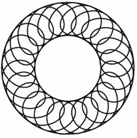 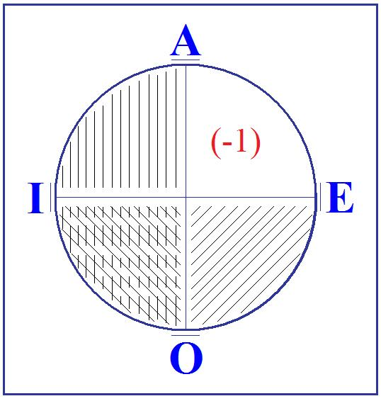

<!-- id: s9-13-0056 -->

Le fait que j’ai tout de suite tendu le fil qui rapporte la fonction de ce –1 au fondement logique de toute possibilité d’une *affirmation universelle*, à savoir de la possibilité de fonder l’exception - et c’est ça d’ailleurs qui exige la règle, *l’exception ne confirme pas la règle*, comme on le dit gentiment, *elle l’exige, c’est elle qui en est le véritable* *principe -* bref, qu’en vous traçant mon petit cadran, à savoir en vous montrant que la seule véritable assurance de l’affir­mation universelle est l’exclusion d’un trait négatif : « *il <u>n</u>’y a <u>pas</u> d’homme qui <u>ne</u> soit mortel* »

<!-- id: s9-13-0057 -->

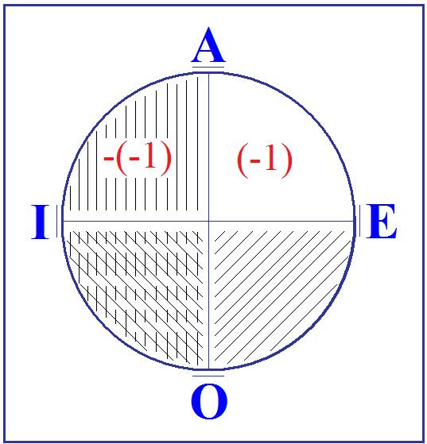

<!-- id: s9-13-0058 -->

j’ai pu prêter à une confusion que j’entends maintenant rectifier pour que vous sachiez sur quel terrain de principe je vous fais vous avancer. Je vous donnais cette référence, mais il est clair qu’il ne faut pas la prendre pour *une déduction* du processus tout entier à partir du symbolique. La part vide où il n’y a rien, dans mon cadran, il faut à ce niveau là encore la considérer comme déta­chée.

<!-- id: s9-13-0059 -->

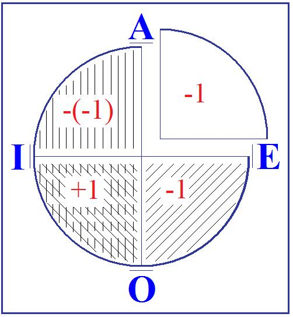

<!-- id: s9-13-0060 -->

Le –1 qu’est le sujet à ce niveau, en lui-même n’est nullement subjectivé, il n’est nullement encore question ni de *savoir* ni de *non-savoir*. Pour que quelque chose arrive de l’ordre de cet avènement, il faut que tout un cycle soit bouclé dont *la privation* n’est donc que le premier pas. *La privation* dont il s’agit est *pri­vation réelle* pour laquelle, avec le support d’intuition dont vous me concéderez qu’on peut bien m’en accorder le droit, je ne fais là que suivre les traces mêmes de la tradition, et la plus pure.

<!-- id: s9-13-0061 -->

On accorde à KANT l’essentiel de son procédé, et ce fondement du schématisme, j’en cherche un meilleur pour essayer de vous le rendre sensible, intuitif. Le ressort de cette *privation réelle*, je l’ai forgé. Ce n’est donc qu’après un long détour que peut advenir pour le sujet *ce savoir* de son rejet originel. Mais d’ici là, je vous le dis tout de suite, il se sera passé assez de choses pour que quand il viendra au jour le sujet sache, non pas seulement que ce savoir le rejette, mais que ce savoir est lui-même à rejeter en tant qu’il s’avèrera être tou­jours soit *au–delà*, soit *en–deçà* de ce qu’il faut atteindre pour la réalisation du désir.

<!-- id: s9-13-0062 -->

Autrement dit, que si jamais le sujet - ce qui est son but depuis le temps de PARMÉNIDE - arrive à l’identification, à l’affirmation que c’est τὸ αὐτό \[to auto\] « *le même, que de penser et être* » νοεῖν καὶ εἶναι[^124] \[nœin kai einai\], à ce moment-là il se trouvera lui-même *irrémédiablement* divisé entre son désir et son idéal. \[Τὸ γὰρ αὐτὸ νοεῖν ἐστίν τε καὶ εἶναι\]

<!-- id: s9-13-0063 -->

Ceci, si je puis dire, est des­tiné à démontrer ce que je pourrais appeler « *la structure objective* » du *tore* en ques­tion. Mais pourquoi me refuserait-on cet usage du mot « *objectif* », puisqu’il est classique, concernant le domaine des idées, et encore employé jusqu’à DESCARTES[^125] ?

<!-- id: s9-13-0064 -->

Au point donc où nous en sommes, et pour n’y plus revenir, *ce dont il s’agit de réel* est parfaitement touchable, et il ne s’agit que de cela. Ce qui nous a menés à la construction du *tore* au point où nous en sommes, c’est la nécessité de défi­nir chacun des tours comme un « 1 » *irréductiblement différent*. Pour que ceci soit *réel*, à savoir que cette vérité *symbolique* - puisqu’elle suppose le *comput*, le comptage - soit fondée, s’introduise dans le monde, il faut et il suffit que quelque chose soit apparu dans ce *réel*, qui est *le trait unaire*.

<!-- id: s9-13-0065 -->

On comprendra que devant ce « 1 », qui est ce qui donne toute sa réalité à l’idéal : *l’idéal c’est tout ce qu’il y a de réel dans le symbolique,* et ça suffit. *On comprend qu’aux origines de la pen­sée* - comme on dit - au temps de PLATON et chez PLATON, pour ne pas remonter plus loin, *ceci ait entraîné l’adoration, la prosternation, le* « 1 » *était le bien, le beau, le vrai, l’être suprême.*

<!-- id: s9-13-0066 -->

Ce en quoi consiste le renversement à quoi nous sommes sollicités de faire face à cette occasion, c’est de nous apercevoir que, si légitime que puisse être cette adoration du point de vue d’une élation[^126] affective, il n’en reste pas moins que ce 1 n’est rien d’autre que la réalité d’un assez stupide bâton. C’est tout !

<!-- id: s9-13-0067 -->

Le premier chasseur - je vous l’ai dit - qui sur une côte d’anti­lope a fait une coche pour se souvenir simplement qu’il avait chassé 10 fois, 12 ou 13 fois, il ne savait pas compter, remarquez. Et c’est même pour ça qu’il était nécessaire de les mettre, ces traits, pour que le 10, 12 ou 13, toutes les fois ne se confondent pas, comme elles le méritaient pourtant, les unes dans les autres.

<!-- id: s9-13-0068 -->

Donc au niveau de *la privation* dont il s’agit, en tant que le sujet est d’abord objectivement cette privation dans la chose \- cette privation qu’il ne sait pas qu’il est - du tour non compté. C’est de là que nous repartons pour comprendre ce qui se passe \- nous avons d’autres éléments d’information - pour que de là il vienne se constituer comme désir, et qu’il sache le rapport qu’il y a de cette constitution à cette origine, en tant qu’elle peut nous permettre de commencer d’articuler quelques *rapports symboliques* plus adéquats que ceux jusqu’ici promus concernant ce qu’est sa structure de désir, au sujet.

<!-- id: s9-13-0069 -->

Ceci ne nous fait pas pour autant présumer de ce qui se maintiendra de la notion de la fonction du sujet quand nous l’aurons mis en équation de désir. C’est ce que nous sommes bien forcés de parcourir avec lui, selon une méthode qui n’est que celle en somme de l’expérience - c’est le sous-titre de la *Phénoménologie* de HEGEL : *Wissenschaft der Erfahrung, science de l’expérience -* nous suivons un chemin analogue avec les données différentes qui sont celles qui nous sont offertes.

<!-- id: s9-13-0070 -->

Le pas suivant est centré - je pourrais aussi bien ici ne pas marquer d’un *titre de chapitre*, je le fais à des fins didactiques - c’est celui de *la frustration*. C’est au niveau de *la frustration* que s’introduit avec l’Autre, la possibilité pour le sujet, d’un nouveau pas essentiel.

<!-- id: s9-13-0071 -->

*Le* 1 *du tour unique, le *1 *qui distingue chaque répétition dans sa différence absolue*, ne vient pas au sujet - même si son support n’est rien d’autre que celui du *bâton réel* - ne vient pas d’aucun ciel, il vient d’une expérience constituée, pour le sujet auquel nous avons affaire :

<!-- id: s9-13-0072 -->

- par l’existence, avant qu’il ne soit né, de l’univers du discours,

<!-- id: s9-13-0073 -->

- par la nécessité que cette expérience suppose, du lieu de l’Autre avec le grand A, tel que je l’ai anté­rieurement défini.

<!-- id: s9-13-0074 -->

C’est ici que le sujet va conquérir l’essentiel, ce que j’ai appelé cette *seconde dimension*, en tant qu’elle est fonction radicale de son propre repé­rage dans sa structure, si tant est que métaphoriquement, mais non sans pré­tendre atteindre dans cette métaphore la structure même de la chose, *nous appelons structure de tore cette seconde dimension* en tant qu’elle constitue parmi tous les autres, *l’existence de lacs irréductibles à un point, de lacs non éva­nouissants*.

<!-- id: s9-13-0075 -->

C’est dans l’Autre que vient nécessairement à s’incarner *cette irré­ductibilité des deux dimensions* pour autant que, si elle est quelque part sensible, ce ne peut être - puisque jusqu’à présent *le sujet n’est* pour nous *que le sujet en tant qu’il parle* - que dans *le domaine du symbolique*. C’est dans l’expérience du *symbolique* que le sujet doit rencontrer la limitation de ses déplacements qui lui fait entrer d’abord dans l’expérience, la pointe, si je puis dire, l’angle irréductible de cette *duplicité* des deux dimensions.

<!-- id: s9-13-0076 -->

C’est à cela que va au maximum me ser­vir *le schématisme du tore*, vous allez le voir, et à partir de l’expérience majorée par la psychanalyse et l’observation qu’elle éveille. L’*objet de son désir*, le sujet peut entreprendre de le dire. Il ne fait même que cela. C’est plus qu’un acte d’énonciation, c’est un acte d’imagination. Ceci sus­cite en lui une manœuvre de la fonction *imaginaire*, et d’une façon nécessaire cette fonction se révèle présente dès qu’apparaît *la frustration*.

<!-- id: s9-13-0077 -->

Vous savez l’importance, l’accent, que j’ai mis, après d’autres - après saint AUGUSTIN nommé­ment[^127] - sur le moment d’éveil de la passion jalouse dans la constitution de ce type d’objet, qui est celui même que nous avons construit comme sous-jacent à cha­cune de nos satisfactions, le petit enfant en proie à la passion jalouse devant son frère qui, pour lui, en image, fait surgir la possession de cet objet, le sein nom­mément...

<!-- id: s9-13-0078 -->

> qui jusqu’alors n’a été que l’objet sous-jacent, élidé, masqué pour lui derrière ce retour d’une présence liée à chacune
>
> de ses satisfactions, qui n’a été - dans ce rythme où s’est inscrite, où se sent la nécessité de sa première *dépen­dance* –
>
> que l’*objet métonymique* de chacun de ces retours ...le voici soudain pour lui produit dans l’éclairage - aux effets pour nous signalés par *sa pâleur mortelle* - l’éclairage de ce *quelque chose* de nouveau qui est *le désir*.

<!-- id: s9-13-0079 -->

*Le désir de l’objet* comme tel, en tant qu’il retentit jusqu’au fondement même du sujet, qu’il l’ébranle bien au-delà de sa constitution :

<!-- id: s9-13-0080 -->

- comme satisfait ou non,

<!-- id: s9-13-0081 -->

- comme sou­dain menacé au plus intime de son être,

<!-- id: s9-13-0082 -->

- comme révélant son manque fondamen­tal, et ceci dans la forme de l’Autre,

<!-- id: s9-13-0083 -->

- comme mettant au jour à la fois la métonymie et la perte qu’elle conditionne.

<!-- id: s9-13-0084 -->

Cette dimension de *perte*, essentielle à la métonymie, *perte de la chose dans l’objet*, c’est là le vrai sens de cette thé­matique de *l’objet* en tant que *perdu* et jamais retrouvé, le même qui est au fond du discours freudien, et sans cesse répétée.

<!-- id: s9-13-0085 -->

Un pas de plus : si nous poussons la métonymie plus loin, vous le savez, *c’est la perte de quelque chose d’essentiel dans l’image*, dans cette métonymie qui s’appelle le *moi*, à ce point de naissance du désir, à ce point de pâleur où AUGUSTIN s’arrête devant le nourrisson, comme fait FREUD devant son petit-fils dix-huit siècles plus tard.

<!-- id: s9-13-0086 -->

C’est faussement qu’on peut dire que l’être dont je suis jaloux, le frère, est mon semblable, il est mon image, au sens où l’image dont il s’agit est image fondatrice de mon désir. Là est *la révélation imaginaire*, et c’est le sens et la fonction de *la frustration*. Tout ceci est déjà connu, je ne fais que le rappeler comme la seconde source de l’expérience : après *la privation réelle*, *la frustration imaginaire*. Mais comme pour *la privation réelle,* j’ai aujourd’hui bien essayé de vous situer à quoi elle sert, au terme qui nous intéresse, c’est-à-dire dans la fon­dation du *symbolique,* de même nous avons ici à voir comment cette *image fon­datrice*, révélatrice du désir, va se placer dans *le symbolique*.

<!-- id: s9-13-0087 -->

Ce placement est difficile. Il serait bien entendu tout à fait impossible si le *symbolique* n’était si - comme je l’ai rappelé, martelé, depuis toujours et assez longtemps pour que ça vous entre dans la tête *-* si l’Autre et le discours où le sujet a à se placer ne l’attendaient depuis toujours, dès avant sa naissance, et que par l’intermédiaire au moins de sa mère, de sa nourrice, on lui parle.

<!-- id: s9-13-0088 -->

Le ressort dont il s’agit, celui qui est à la fois le *b-a ba*, l’enfance de notre expérience, mais au­-delà de quoi depuis quelques temps on ne sait plus aller faute justement de savoir le formaliser comme *b-a ba,* est ceci, à savoir *le croisement*, l’échange naïf qui se produit, de par la dimension de l’Autre, entre *le désir* et *la demande*. S’il y a, vous le savez, quelque chose à quoi on peut dire qu’au départ le névrosé s’est laissé prendre, c’est à ce piège, et *il essaiera de faire passer dans la demande ce qui est l’objet de son désir*, d’obtenir de l’Autre, non pas la satisfaction de son besoin - pour quoi la demande est faite - mais la satisfaction de son désir, à savoir d’en avoir l’objet, c’est-à-dire précisément ce qui ne peut se demander.

<!-- id: s9-13-0089 -->

Et c’est à l’ori­gine de ce qu’on appelle *dépendance* dans les rapports du sujet à l’autre. De même qu’il essaiera, plus paradoxalement encore, *de satisfaire, par la conforma­tion de son désir, à la demande de l’Autre. Et il n’y a pas d’autre sens* - de *sens correctement articulé* j’entends – à ce qui est la découverte de l’*analyse* et de FREUD : *à l’existence du surmoi* comme tel. Il n’y a pas d’autre définition correcte, j’entends : pas d’autre qui permette d’échapper à des glissements confusionnels.

<!-- id: s9-13-0090 -->

Je pense, sans aller plus loin, que les résonances pratiques, concrètes de tous les jours, à savoir l’impasse du névrosé, c’est d’abord \- et *avant le problème des impasses de son désir - cette impasse* sensible à chaque instant, grossièrement sen­sible, et à quoi vous le voyez toujours se buter. C’est ce que j’exprimerai sommai­rement en disant que pour son *désir*, il lui faut la sanction d’une *demande*. Qu’est-ce que vous lui refusez, sinon *cela qu’il attend de vous : que vous lui demandiez de désirer* congrûment. Sans parler de *ce qu’il attend de sa conjointe*, de *ses parents*, de *sa lignée* et de tous les conformismes qui l’entourent. Qu’est-ce que ça nous permet *de construire* et *d’apercevoir* ?

<!-- id: s9-13-0091 -->

Si tant est que la demande se renouvelle selon les tours parcourus, selon les cercles pleins, tout autour, et les successifs retours que nécessite la revenue, mais insérée par le *lacs* de la demande, du besoin. Si tant est que - comme je vous l’ai laissé entendre à tra­vers chacun de ces retours - ce qui nous permet de dire que le cercle élidé, le cercle que j’ai appelé simplement, pour que vous voyez ce que je veux dire par rapport au *tore,* le cercle vide, vient ici matérialiser l’objet métonymique sous toutes ces demandes.

<!-- id: s9-13-0092 -->

 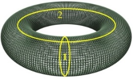 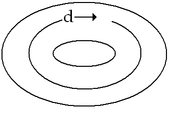

<!-- id: s9-13-0093 -->

Une construc­tion topologique est imaginable d’un autre tore qui a pour propriété de nous permettre d’imaginer l’application de *l’objet* *du désir*, *cercle interne vide* \[2\] du premier tore, sur le *cercle* *plein* \[1\] du second qui constitue une boucle, un de ces lacs irréductibles

<!-- id: s9-13-0094 -->

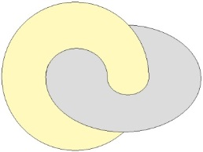

<!-- id: s9-13-0095 -->

Inversement, le cercle sur le premier tore, d’une demande vient ici se superposer dans l’autre tore - le tore ici support de l’autre, de l’autre imaginaire de la frustration - vient ici se superposer au cercle vide de ce tore. C’est-­à-dire remplir la fonction de montrer cette interversion - *désir chez l’un, demande chez l’autre, demande de l’un, désir de l’autre* - qui est le nœud où se coince toute la dialectique de *la frustration*.

<!-- id: s9-13-0096 -->

Cette dépendance possible des deux topologies, celle d’un tore à celle de l’autre, n’exprime en somme rien d’autre que ce qui est le but de notre schème en tant que nous le faisons supporter par le *tore*. C’est que si l’espace de l’intuition kantienne, je dirais doit, grâce au nouveau schème que nous introduisons, être mis entre parenthèses, *annulé*, *aufgehoben,* comme illusoire parce que l’extension topologique du tore nous le permet, à ne considérer que les propriétés de la surface, nous sommes sûrs du maintien, de la solidité si je puis dire, du volume du système sans avoir à recourir à l’intuition de « *la profondeur* ». Ce que vous voyez, et ce que ceci image :

<!-- id: s9-13-0097 -->

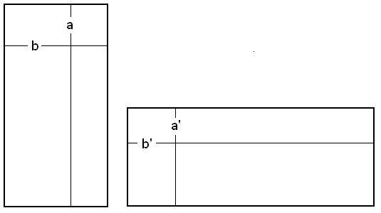

<!-- id: s9-13-0098 -->

C’est qu’à nous maintenir, dans toute la mesure où nos habitudes intuitives nous le permettent, dans ces limites, il en résulte que... puisqu’il ne s’agit entre les deux surfaces que d’une substitution par application biunivoque, encore qu’elle soit inversée, à savoir qu’une fois décou­pée ce sera dans ce sens sur l’une des surfaces et dans cet autre sur l’autre ...il n’en reste pas moins que ce que ceci rend sensible, c’est que du point de vue de *l’espace* exigé, ces deux espaces, l’intérieur et l’extérieur, à partir du moment où nous nous refusons à leur donner substance autre que *topologique*, sont les mêmes.

<!-- id: s9-13-0099 -->

Ce que vous verrez exprimé dans *la phrase clé* indique - déjà dans le *Rapport de Rome -* l’usage que je comp­tais pour vous en faire, à savoir que la propriété de l’anneau, en tant qu’il sym­bolise la fonction du sujet dans ses rapports à l’Autre, tient en ceci que *l’espace de son intérieur et l’espace extérieur sont les mêmes*. Le sujet à partir de là construit *son espace extérieur* sur le modèle d’irréductibilité de *son espace inté­rieur*.

<!-- id: s9-13-0100 -->

Mais ce que montre ce schéma, c’est avec évidence *la carence* de l’harmo­nie idéale qui pourrait être exigée de *l’objet* à *la demande*, de *la demande* à *l’objet*. *Illusion* qui est suffisamment démontrée par l’expérience, je pense, pour que nous ayons éprouvé le besoin de construire ce modèle nécessaire de leur nécessaire discordance. Nous en savons le ressort et, bien entendu, si j’ai l’air de n’avancer qu’à pas de lenteur, croyez–moi, aucune stagnation n’est de trop si nous voulons nous assurer des pas suivants.

<!-- id: s9-13-0101 -->

Ce que nous savons déjà et ce qu’il y a ici de représenté intuitivement, c’est que l’objet lui­-même comme tel, en tant qu’*objet du désir*, est l’effet de *l’impossibilité de l’Autre de répondre à la demande*. C’est ce qui se voit ici manifestement dans ce sens qu’à ladite *demande*, quel que soit son *désir*, l’Autre ne saurait y suffire, qu’il laisse forcément à découvert la plus grande part de la structure. Autrement dit, que *le sujet n’est pas enveloppé*, comme on le croit, *dans le tout*, *qu’au niveau du moins du sujet qui parle, l’Umwelt n’enveloppe pas son Innenwelt.*

<!-- id: s9-13-0102 -->

Que s’il y avait quelque chose à faire pour imaginer le sujet par rapport à la sphère idéale, depuis toujours le modèle intuitif et mental de la structure d’un cos­mos, ce serait plutôt que le sujet serait...

<!-- id: s9-13-0103 -->

> si je puis me permettre pour vous de pousser, d’exploiter
>
> \- mais vous verrez qu’il y a plus d’une façon de le faire - son image intuitive

<!-- id: s9-13-0104 -->

...cela serait de représen­ter le sujet par l’existence d’un *trou* dans ladite *sphère*, et son supplément par deux sutures.

<!-- id: s9-13-0105 -->

Supposons le sujet à constituer, sur *une sphère cosmique*. La surface d’une sphère infinie, c’est un plan, le plan du tableau noir indéfiniment pro­longé. Voilà le sujet \[A\], un trou quadrangulaire, comme la configuration générale de ma peau de tout à l’heure, mais cette fois-ci en négatif.

<!-- id: s9-13-0106 -->

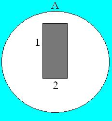

<!-- id: s9-13-0107 -->

Je couds un bord avec l’autre \[B1\], mais avec cette condi­tion que ce sont *des bords opposés*, que je laisse libres les deux autres bords \[2\]. Il en résulte la figure suivante, à savoir, avec le vide comblé ici, deux trous qui restent dans la sphère de surface infinie.

<!-- id: s9-13-0108 -->

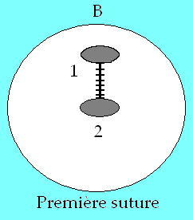

<!-- id: s9-13-0109 -->

Il ne reste plus qu’à tirer sur chacun des bords de ces deux trous \[C\] pour constituer le sujet à la surface infinie, comme constitué en somme par ce qui est toujours *un tore*, même s’il a une besace de rayon infini, à savoir *une poignée* émergeant à la surface d’un plan \[D\].

<!-- id: s9-13-0110 -->

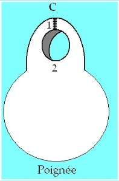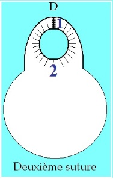

<!-- id: s9-13-0111 -->

Voilà ce que cela veut dire au maximum, la relation du sujet avec « *le grand Tout* ». Nous verrons les applications que nous pouvons en faire.

<!-- id: s9-13-0112 -->

Ce qui est important ici à saisir, c’est que pour ce recouvrement de l’objet à la demande, si l’autre imaginaire ainsi constitué, dans l’inversion des fonc­tions du cercle du désir avec celui de la demande, l’Autre, pour la satisfaction du désir du sujet doit être défini comme *sans pouvoir*. J’insiste sur ce « *sans* », car avec lui émerge une nouvelle forme de la négation où s’indiquent à proprement par­ler les effets de *la frustration*. « *Sans* » est une négation mais pas n’importe laquelle, c’est une négation-liaison que matérialise bien, dans la langue anglaise, l’homo­logie conformiste des deux rapports des deux signifiants *within* et *without.*

<!-- id: s9-13-0113 -->

C’est une exclusion liée qui déjà en soi seule indique son renversement.

<!-- id: s9-13-0114 -->

Un pas de plus, faisons-le, c’est celui du « *pas sans* ». L’autre, sans doute, s’introduit dans la perspective naïve du désir comme *sans pouvoir*, mais, essentiellement, ce qui le lie à la structure du désir, c’est le « *pas sans* » : *il n’est pas non plus sans pouvoir.* C’est pourquoi cet *Autre*, que nous avons introduit en tant qu’en somme *métaphore du trait unaire,* c’est-à-dire de ce que nous trouvons à son niveau et qu’il rem­place, dans une régression infinie, puisqu’il est le lieu où se succèdent ces 1 *tous différents* les uns des autres *dont le sujet n’est que la métonymie,* cet *Autre* comme 1 - et le jeu de mots fait partie de la formule que j’emploie ici pour défi­nir le mode sous lequel je l’ai introduit *-* se retrouve, une fois bouclée la néces­sité des effets de *la frustration imaginaire*, comme ayant cette valeur unique, car *lui seul n’est pas « sans pouvoir »*, *il est à l’origine possible du désir posé comme condition*, même si cette condition reste en suspens.

<!-- id: s9-13-0115 -->

Pour cela, il est « *comme pas* 1 » : il donne au –1 du sujet une autre fonction qui s’incarne d’abord *dans cette dimension*, que ce « *comme* » vous situe assez comme étant celle *de la métaphore*. C’est à son niveau - au niveau du « *comme pas* 1 » et de tout ce qui va lui rester dans la suite suspendu, comme ce que j’ai appelé la conditionnalité absolue du désir - que nous aurons affaire la prochaine fois, c’est-à-dire, au niveau du troisième terme, de l’introduction de l’acte de désir comme tel, de ses rapports au sujet d’une part, à la racine de ce pouvoir, à *la réarticulation des temps* de ce pouvoir, pour autant que - vous le voyez - il va me falloir revenir *en arrière* sur *le pas possible* pour marquer le chemin qui a été accompli dans l’introduction des termes « *pouvoir* » et « *sans pouvoir* ».

<!-- id: s9-13-0116 -->

C’est dans la mesure où nous aurons à poursuivre cette dialectique la prochaine fois que je m’arrête ici aujourd’hui.

## Notes

[^117]: Cf. supra : 28-02-1962, fin de séance.

[^118]: Séances « scientifiques » de la SFP

[^119]: Cf. Thomas D’Aquin : *Summæ con­tra gentiles, Somme contre les gentils*, éd. Du Cerf, 1998.

[^120]: Cf. Séminaire 1957-58 : *Les formations*..., séance du 02-07.

[^121]: Cf. Séminaire1954-55 : *Le moi*..., 08-06.

[^122]: Edward Westermarck (1862-1939) est un anthropologue finlandais connu notamment pour ses théories sur le mariage, sur l'exogamie et sur l'inceste.

    Entre autres ouvrages : *Histoire du mariage*, Paris, Mercure de France, *Études de sociologie sexuelle* , 1935 ; *Les cérémonies du mariage au Maroc*, éd. Jasmin , 2003.

[^123]: Cf. Séminaire 1959-60 : *L’éthique*..., Seuil, 1986, séance du 09-03, p. 192, poème d’Arnaut Daniel.

[^124]: Parménide, op. Cit..

[^125]: Cf. supra, séance du 06-12 , note 28.

[^126]: élation : Orgueil naïf, noblesse exaltée du sentiment.

[^127]: Cf. [St. Augustin : *Les confessions*](http://www.abbaye-saint-benoit.ch/saints/augustin/confessions/livre1.htm#_Toc509572069) (Livre I, ch. 7, 11) : « *Un enfant que j’ai vu et observé était jaloux. Il ne parlait pas encore, et regardait, pâle et farouche, son frère de lait.* »
