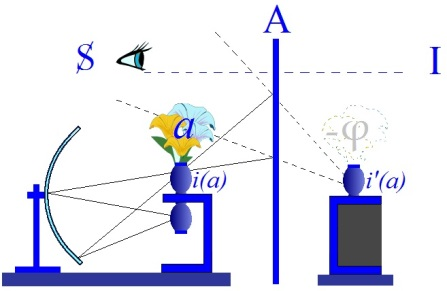

# Leçon 18 | 02 mai 1962

<!-- source-url: http://staferla.free.fr/S9/S9 L'IDENTIFICATION.docx -->
<!-- seminar: s9 -->
<!-- lesson: 18 -->

<!-- id: s9-18-0001 -->

[Piera AULAGNIER](#aulagniermai02) [LACAN](#lacanmai02)

<!-- id: s9-18-0002 -->

LACAN

<!-- id: s9-18-0003 -->

Ce n’est pas forcément dans l’idée de vous ménager - ni vous ni personne - que j’ai pensé aujourd’hui, pour cette séance de reprise, à un moment qui est une course de deux mois que nous avons devant nous pour finir de traiter ce sujet dif­ficile, que j’ai pensé à faire pour cette reprise une sorte de relais.

<!-- id: s9-18-0004 -->

Je veux dire qu’il y a longtemps que j’avais envie, non seulement de donner la parole à quelqu’un d’entre vous, mais même précisément de la donner à Mme AULAGNIER. Il y a très longtemps que j’y pense, puisque c’est au lendemain d’une communication qu’elle a faite à une de nos séances scientifiques[^157].

<!-- id: s9-18-0005 -->

Cette communication, je ne sais pourquoi, certains d’entre vous, qui ne sont pas là malheureusement...

<!-- id: s9-18-0006 -->

> en raison d’une espèce de myopie caractéristique de certaines positions
>
> que j’appelle par ailleurs « *mandarinales* », puisque ce terme a fait fortune

<!-- id: s9-18-0007 -->

...ont cru voir *je ne sais quel retour à la lettre de* FREUD, alors qu’à mon oreille il m’avait semblé que Mme AULAGNIER, avec une particulière pertinence et acuité, maniait la distinction, longuement mûrie déjà à ce moment-là, de *la demande* et du *désir*.

<!-- id: s9-18-0008 -->

Il y a tout de même quelque chance qu’on reconnaisse mieux soi-même sa propre postérité que ne le font les autres. Aussi bien il y avait une personne qui était d’accord avec moi là-dessus, c’était Mme AULAGNIER elle-même. Je regrette donc d’avoir mis si longtemps à lui donner la parole, peut-être le sentiment - excessif d’ailleurs - de quelque chose qui toujours nous presse et nous talonne pour avancer.

<!-- id: s9-18-0009 -->

Justement, aujourd’hui nous allons un instant faire cette sorte de « *boucle* » qui consiste à passer par ce qui, dans l’esprit de quelqu’un d’entre vous, peut répondre, fructifier, concernant le chemin que nous avons parcouru ensemble - il est grand déjà, depuis ce moment que j’évoque - et c’est très spécialement à ce recoupement, ce carrefour, constitué dans l’esprit de Mme AULAGNIER, sur ce que j’ai dit récemment sur l’angoisse, qu’il se trouve qu’elle m’a offert depuis quelques séances d’intervenir ici.

<!-- id: s9-18-0010 -->

C’est donc en raison d’une opportunité qui vaut ce qu’aurait valu une autre : le sentiment d’avoir quelque chose à vous com­muniquer, et tout à fait à point, sur l’angoisse du psychotique - et ceci dans le rapport le plus étroit de ce qu’elle a entendu, comme vous, de ce que je professe cette année de l’iden­tification - qu’elle va vous apporter quelque chose qu’elle a préparé assez soi­gneusement pour nous avoir comblés d’un texte.

<!-- id: s9-18-0011 -->

Ce texte, elle a eu la bonté de m’en faire part, je veux dire que je l’ai regardé avec elle hier, et que je n’ai cru, je dois dire, que devoir l’encourager à vous le présenter. Je suis sûr qu’il représente un excellent *medium* - et j’entends par là quelque chose qui n’est pas une moyenne - de ce que, je crois, *les oreilles les plus sensibles*, les meilleures d’entre vous, peu­vent entendre, et de la façon dont les choses peuvent être reprises, en raison de cette écoute.

<!-- id: s9-18-0012 -->

Je dirai donc, après qu’elle ait conçu ce texte, quel usage j’entends donner à cette étape que doit constituer ce qu’elle nous apporte, quel usage j’entends lui donner dans la suite.

<!-- id: s9-18-0013 -->

[Piera AULAGNIER](#mai02) : Angoisse et identification

<!-- id: s9-18-0014 -->

Lors des dernières « *Journées Provinciales* », un certain nombre d’interventions ont porté sur la question de savoir si on pouvait définir différents *types d’angoisse*. C’est ainsi qu’on s’est demandé si l’on devait donner, par exemple, un statut particulier à l’angoisse psychotique.

<!-- id: s9-18-0015 -->

Je dirai tout de suite que je suis d’un avis un peu différent : l’angoisse, qu’elle apparaisse chez le sujet dit *normal*, chez le *névrosé* ou chez le *psychotique*, me paraît répondre à une situation spécifique et identique du *moi*, et c’est même là ce qui me paraît être un de ses traits caractéristiques.

<!-- id: s9-18-0016 -->

Quant à ce qu’on pourrait appeler « *la position du sujet vis-à-vis de l’angoisse* »*,* dans la psychose par exemple, on a pu voir que si on n’essaye pas de mieux définir les rapports existants entre *affect* et *verbalisation*, on peut arriver à une sorte de paradoxe qui s’exprimerait ainsi :

<!-- id: s9-18-0017 -->

- *d’une part* le psychotique serait quelqu’un de particulièrement sujet à *l’angoisse*, c’est même dans la réponse en miroir qu’il susciterait chez l’ana­lyste, que serait à chercher une des difficultés majeures de la cure,

<!-- id: s9-18-0018 -->

- *d’autre part* on nous a dit qu’il serait incapable de *reconnaître son angoisse*, qu’il la tiendrait à distance, s’en aliénerait.

<!-- id: s9-18-0019 -->

On énonce par là une position insoutenable si on n’essaye pas d’aller un peu plus loin. En effet, que pourrait bien *signifier* « *recon­naître l’angoisse »* ? Elle n’attend pas, et n’a pas besoin d’être nommée pour sub­merger le *moi*, et je ne comprends pas ce qu’on pourrait vouloir dire en disant que le sujet est angoissé sans le savoir.

<!-- id: s9-18-0020 -->

On peut se demander si le propre de *l’angoisse* n’est pas justement de ne pas se nommer. Le diagnostic, l’appellation, ne peut venir que du côté de *l’Autre*, de celui face à qui elle apparaît. Lui, le sujet, *il est l’affect « angoisse* », il la vit totalement, et c’est bien cette *imprégnation*, cette capture de son *moi* qui s’y dissout, qui lui empêche la médiation de la parole : pensez à l’*inhibition* et à l’*acting-out*.

<!-- id: s9-18-0021 -->

On peut à ce niveau faire un premier parallèle entre deux états qui, pour dif­férents qu’ils soient, me paraissent représenter deux positions extrêmes du *moi*, aussi opposées que complémentaires : je veux parler de l’orgasme. Il y a dans ce deuxième cas la même incompatibilité profonde entre la possibilité de le vivre et celle de prendre la distance nécessaire pour le *reconnaître* et le définir dans l’*hic* *et nunc* de la situation le déclenchant.

<!-- id: s9-18-0022 -->

*Dire* qu’on est angoissé indique en soi d’avoir déjà pu prendre une certaine distance par rapport au vécu affectif, cela montre que le *moi* a déjà acquis une certaine maîtrise et objectivité vis-à-vis d’un affect dont, à partir de ce moment, on peut douter qu’il mérite encore le nom d’angoisse. Je n’ai pas besoin *ici* de rappeler le rôle *métaphorique*, médiateur, de la parole, ni l’écart existant entre un vécu affectif et sa traduction verbale.

<!-- id: s9-18-0023 -->

À partir du moment où l’homme *met en mots* ses affects, il en fait justement autre chose, il en fait, par la parole, un moyen de communication, il les fait entrer dans le domaine de la relation et de l’inten­tionnalité, il transforme en *communicable* ce qui a été vécu au niveau du corps et qui, comme tel, en dernière analyse, reste quelque chose de l’ordre du non verbal. Nous savons tous que dire qu’*on aime* quelqu’un n’a que de très loin­tains rapports avec ce qui est, en fonction de ce même amour, ressenti *au niveau corporel*. Dire à quelqu’un qu’on le désire, nous rappelait Monsieur LACAN, c’est l’inclure dans notre fantasme fondamental. C’est aussi sans doute en faire le témoignage, le témoin de notre propre signifiant.

<!-- id: s9-18-0024 -->

Quoi que nous puissions dire à ce sujet, tout est fait pour nous montrer l’écart existant entre l’affect en tant qu’émotion corporelle, intériorisée, en tant que quelque chose qui tire sa source la plus profonde de ce qui par définition ne peut s’exprimer en mots - je veux parler du fantasme - et la parole qui nous apparaît ainsi dans toute sa fonction de métaphore.

<!-- id: s9-18-0025 -->

Si la parole est la clef magique indispensable qui seule peut nous permettre d’entrer dans le monde de la symbolisation, eh bien, je pense que justement l’angoisse répond à ce moment :

<!-- id: s9-18-0026 -->

- où cette clef n’ouvre plus aucune porte,

<!-- id: s9-18-0027 -->

- où le *moi* a à affronter ce qui est derrière ou avant toute symbo­lisation,

<!-- id: s9-18-0028 -->

- où ce qui apparaît est *ce qui n’a pas de nom, cette figure mystérieuse, ce lieu d’où surgit un désir que l’on ne peut plus appréhender*,

<!-- id: s9-18-0029 -->

- où se produit pour le sujet un télescopage entre fantasme et réalité : le *symbolique* s’évanouit pour laisser la place au fantasme en tant que tel, le *moi* s’y dissout, et c’est cette dissolution que nous appelons « *l’angoisse* ».

<!-- id: s9-18-0030 -->

Il est certain que le psychotique n’attend pas l’analyse pour connaître l’angoisse. Il est certain aussi que pour tout sujet, la relation analytique est, dans ce domaine, un terrain privilégié.

<!-- id: s9-18-0031 -->

Cela n’est pas pour nous étonner, si l’on admet que l’angoisse a les rapports les plus étroits avec l’identification. Or, si dans l’identification il s’agit de quelque chose qui se passe au niveau du désir, désir du sujet par rapport au désir de l’Autre, il devient évident que la source majeure de l’angoisse en analyse va se trouver dans ce qui en est l’essence même : le fait que *l’Autre* est dans ce cas quelqu’un dont le désir le plus fondamental est de ne pas désirer, quelqu’un qui par cela même, s’il permet toutes les projections possibles, les dévoile aussi dans leur subjectivité fantasmatique et oblige le sujet à se poser périodiquement la question de ce qui est le désir de l’analyste, désir toujours présumé, jamais défini, et par là même pouvant à tout instant devenir ce lieu de l’Autre d’où surgit pour l’analysé, *l’angoisse*.

<!-- id: s9-18-0032 -->

Mais avant d’essayer de définir les paramètres de la situation anxiogène - para­mètres qui ne peuvent se dessiner qu’à partir des problèmes propres à l’identi­fication - on peut se poser une première question d’ordre plus descriptif qui est celle-ci : qu’entendons–nous quand nous parlons d’angoisse *orale, de castration, de mort ?*

<!-- id: s9-18-0033 -->

Essayer de différencier ces différents termes au niveau d’une sorte d’étalonnage quantitatif est impossible, il n’y a pas d’«* angoissomètre *». On n’est pas peu ou très angoissé, on l’est ou on ne l’est pas. La seule voie permettant une réponse à ce niveau est celle de nous placer à *la place qui nous revient*, celle de celui qui seul peut définir l’angoisse du sujet à partir de ce que cette angoisse lui signale.

<!-- id: s9-18-0034 -->

S’il est vrai, comme l’a fait remarquer Monsieur LACAN, qu’il est fort difficile de parler de l’angoisse en tant que signal au niveau du sujet, il me paraît certain que son apparition désigne, signale, l’Autre en tant que source, en tant que lieu d’où elle a surgi, et il n’est peut-être pas inutile de rappeler à ce propos qu’il n’existe pas d’affect que nous suppor­tions plus mal chez l’autre que l’angoisse, qu’il n’y a pas d’affect auquel nous ne risquions plus de répondre de façon parallèle.

<!-- id: s9-18-0035 -->

*Le sadisme, l’agressivité* peut par exemple susciter chez le partenaire une réaction inverse, masochique ou passive. *L’angoisse* ne peut provoquer que la fuite ou l’angoisse. Il y a ici une réciprocité de réponse qui n’est pas sans poser une question. Monsieur LACAN s’est insurgé contre cette tentative faite par plusieurs, qui serait la recherche d’un contenu de l’angoisse.

<!-- id: s9-18-0036 -->

Cela me rappelle ce qu’il avait dit à propos de tout autre chose, *que pour sortir un lapin d’un chapeau, encore fallait-il l’y avoir mis*.

<!-- id: s9-18-0037 -->

Eh bien, je me demande si l’angoisse n’apparaît pas justement, non seulement quand le lapin est sorti, mais quand il s’en est allé brouter l’herbe, quand le chapeau ne représente que quelque chose qui rappelle *le tore*, mais qui entoure *un lieu noir* dont tout contenu *nommable* s’est évaporé, face auquel le *moi* n’a plus aucun point de repère, car la première chose que l’on puisse dire de l’angoisse, c’est que son apparition est signe de l’écroulement momentané de tout *repère identificatoire* possible.

<!-- id: s9-18-0038 -->

C’est seulement en partant de là qu’on peut répondre peut-être à la question que je posais quant aux différentes dénominations que nous pouvons donner à l’angoisse, et non pas au niveau de la définition d’un contenu, le propre du sujet angoissé étant, pourrait-on dire, d’avoir perdu son contenu. Il ne me semble pas, en d’autres termes, que l’on puisse traiter de *l’angoisse* en tant que telle. Pour prendre un exemple, je dirai que faire cela me paraîtrait aussi faux que vouloir définir un symptôme obsessionnel en restant au niveau du mouvement automatique qui peut le représenter.

<!-- id: s9-18-0039 -->

L’angoisse ne peut nous apprendre quelque chose sur elle-même que si nous la considérons comme *la conséquence*, *le résul­tat* d’une impasse où se trouve le *moi*, signe pour nous d’un obstacle surgi entre ces deux lignes parallèles et fondamentales dont les rapports forment la clef de voûte de toute la structure humaine, soit : l’identification et la castration.

<!-- id: s9-18-0040 -->

C’est les rapports entre ces deux pivots structurants chez les différents sujets que je vais essayer d’esquisser pour tenter une définition de ce qu’est l’angoisse, de ce dont, selon les cas, elle nous donne le témoignage. Monsieur LACAN, dans le séminaire du 4 Avril auquel je me réfère tout au long de cet exposé, nous a dit que la castration pouvait se concevoir comme un pas­sage transitionnel entre ce qui est dans le sujet en tant que support naturel du désir, et cette habilitation par la loi grâce à quoi il va devenir le gage par où il va se désigner à la place où il a à se manifester comme désir.

<!-- id: s9-18-0041 -->

Ce passage transition­nel est ce qui doit permettre d’atteindre l’équivalence pénis-phallus, c’est-à-dire que ce qui était, en tant qu’*émoi corporel*, doit devenir, céder la place à un signi­fiant, car ce n’est qu’à partir du sujet, et jamais à partir d’un objet partiel, pénis ou autre, que peut prendre un sens quelconque le mot désir.

<!-- id: s9-18-0042 -->

« *Le sujet demande et le phallus désire* » disait monsieur LACAN - *le phallus, mais jamais le pénis. Le pénis, lui, n’est qu’un instrument* *au service du signifiant phallus* et s’il peut être un instrument fort indocile, c’est justement parce que, en tant que *phallus*, c’est *le sujet* qu’il désigne, et pour que ça marche, il faut que l’Autre justement le *reconnaisse, le choisisse,* non pas en fonction de ce support naturel, mais pour autant qu’il est, en tant que *sujet*, *le signifiant que l’Autre reconnaît, de sa propre place de signifiant*.

<!-- id: s9-18-0043 -->

Ce qui différencie, sur le plan de *la jouissance*, l’acte masturbatoire du coït, différence évidente mais impossible à expliquer physiologiquement, c’est bien que le coït - pour autant que les deux partenaires aient pu dans leur histoire assu­mer leur castration - fait qu’au moment de l’orgasme le sujet va retrouver, non pas comme certains l’ont dit *une sorte de fusion primitive*, car après tout on ne voit pas pourquoi *la jouissance* la plus profonde que l’homme puisse éprou­ver devrait forcément être liée à une régression tout aussi totale, mais au contraire ce moment privilégié où pour un instant il atteint cette *identification* toujours cherchée et toujours fuyante, où il est, lui sujet, reconnu par l’autre comme l’objet de son désir le plus profond, mais où en même temps, grâce à la jouissance de l’autre, il peut le reconnaître comme celui qui le constitue en tant que signifiant phallique.

<!-- id: s9-18-0044 -->

Dans cet instant unique *demande* et *désir* peuvent pen­dant un instant fugitif coïncider, et c’est cela qui donne au *moi* cet *épanouisse­ment identificatoire* dont tire sa source la jouissance. Ce qu’il ne faut pas oublier c’est que si dans cet instant *demande* et *désir* coïncident, la jouissance porte tou­tefois en elle la source de l’*insatisfaction* la plus profonde, car si le désir est avant tout *désir de continuité*, la *jouissance* est par définition quelque chose d’*instan­tané*. C’est cela qui fait que tout de suite se rétablit l’écart entre désir et demande, et l’insatisfaction qui est aussi gage de la pérennité de la demande.

<!-- id: s9-18-0045 -->

Mais s’il y a des simulacres de l’angoisse, il y a encore bien plus de simulacres de jouissance, car pour que cette situation identificatoire, source de *la vraie jouis­sance*, soit possible, encore faut-il que les deux partenaires aient évité l’obstacle majeur qui les guette, et qui est que pour l’un des deux, ou pour les deux, l’enjeu soit resté fixé sur *l’objet partiel*, enjeu d’une relation duelle où eux, en tant que sujets, n’ont pas de place. Car ce que nous montre tout ce qui est lié à *la castra­tion* c’est bien que, loin d’exprimer la crainte qu’on le lui coupe, même si c’est ainsi que le sujet peut le verbaliser, ce dont il s’agit c’est de la crainte qu’on le lui laisse et qu’on lui coupe tout le reste, c’est-à-dire qu’on en veuille à son pénis ou à l’objet partiel, support et source du plaisir, et *qu’on le nie, qu’on le méconnaisse en tant que sujet*.

<!-- id: s9-18-0046 -->

C’est pour cela que l’angoisse a non seulement des rapports étroits avec la jouissance, mais qu’une des situations les plus facilement anxio­gènes, est bien celle où le sujet et l’Autre ont à s’affronter à son niveau. Nous allons alors essayer de voir quels sont les obstacles que le sujet peut ren­contrer sur ce plan. Ils ne représentent pas autre chose que les sources mêmes de toute angoisse.

<!-- id: s9-18-0047 -->

Pour cela, nous aurons à nous reporter à ce que nous appelons « *les relations d’objet prégénitales* », à cette époque, entre toutes déterminante pour le destin du sujet, où la médiation entre le sujet et l’Autre, entre demande et désir, s’est faite autour de cet objet dont la place et la définition restaient fort ambiguës, et qui est dit *l’objet partiel*.

<!-- id: s9-18-0048 -->

La relation entre le sujet et cet objet par­tiel n’est pas autre chose que la relation du sujet à son propre corps et c’est à par­tir de cette relation, qui reste pour tout humain fondamentale, que prend son point de départ et se moule toute la gamme de ce qui est inclus dans le terme de « relation d’objet ».

<!-- id: s9-18-0049 -->

Que l’on s’arrête à la phase orale, anale ou phallique, on y ren­contre les mêmes coordonnées. Si je choisis la phase orale c’est simplement parce que pour le psychotique dont nous parlerons tout à l’heure, elle me paraît être *le moment fécond* de ce que j’ai appelé ailleurs « *l’ouverture de la psychose* ».

<!-- id: s9-18-0050 -->

Par quoi pouvons-nous la définir ? Par une *demande* qui, dès le début, nous dit-­on, est demande d’autre chose. Par une *réponse* aussi, qui est non seulement, et d’une façon évidente, *réponse* à autre chose, mais est - et c’est un point qui me paraît fort important - ce qui constitue ce qui est un cri, un appel peut–être, comme demande et comme désir.

<!-- id: s9-18-0051 -->

Quand la mère répond aux cris de l’enfant, elle les reconnaît en les constituant comme demande, mais ce qui est plus grave, c’est qu’elle les interprète sur le plan du désir, désir de l’enfant de l’avoir auprès de lui, désir de lui prendre quelque chose, désir de l’agresser, peu importe… ce qui est certain, c’est que par sa réponse, l’Autre va donner la dimension *désir* au cri du besoin, et que ce désir dont l’enfant est investi est toujours au début le résul­tat d’une interprétation projective, fonction du seul désir maternel, de son propre fantasme. C’est par le biais de l’inconscient de l’Autre que le sujet fait son entrée dans le monde du désir.

<!-- id: s9-18-0052 -->

Son propre désir à lui, il aura avant tout à le constituer en tant que réponse, en tant qu’acceptation ou refus de prendre la place que l’inconscient de l’Autre lui désigne. Il me semble que le premier temps du mécanisme clé de la relation orale, qui est l’identification projective, part de la mère : il y a une première projection sur le plan du désir, qui vient d’elle. L’enfant aura à s’y identifier ou à combattre, à nier une identification qu’il pourra sentir comme déstructurante.

<!-- id: s9-18-0053 -->

Et à ce premier stade de l’évolution humaine, c’est aussi la réponse qu’il pourra faire au sujet qui lui permet la découverte de ce que cache sa demande. Dès ce moment la jouissance, qui n’attend pas l’organisation phallique pour entrer en jeu, prendra ce côté révélation qu’elle gardera toujours. Car si *la frustration* est ce qui signifie au sujet l’écart existant entre besoin et désir, la jouissance, par la marche inverse, lui dévoile, en répondant à ce qui n’était pas formulé, ce qui est au-delà de la demande, c’est-à-dire le désir.

<!-- id: s9-18-0054 -->

Or que voyons-nous dans ce qu’est « *la relation orale* » ? Avant tout : que demande et réponse se signifient pour les deux partenaires autour de la relation partielle bouche-sein. Ce niveau, nous pourrons l’appeler celui du *signifié* : la réponse va provoquer au niveau de la cavité orale une activité d’absorption, source de plaisir, un objet externe, le lait, va devenir substance propre, corpo­relle. *L’absorption*, c’est de là qu’elle tire son importance et sa signification. À partir de cette première réponse, c’est la recherche de cette activité d’absorption, source de plaisir, qui va devenir le but de la demande.

<!-- id: s9-18-0055 -->

Quant au désir, c’est ailleurs qu’il va falloir le chercher, bien que ce soit à partir de cette même réponse, de cette même expérience d’assouvissement du besoin qu’il va se constituer. En effet, si la relation bouche-sein et l’activité absorption-nourriture sont les numérateurs de l’équation représentant la relation orale, il y a aussi un dénominateur : celui qui met en cause la relation enfant-mère, et c’est là que peut se situer le désir.

<!-- id: s9-18-0056 -->

Si, comme je le pense, l’activité d’allaitement - en fonction de l’investissement dont elle est de part et d’autre l’objet, à cause du contact et *des expériences corporelles* au niveau du corps pris au sens large, qu’elle permet à l’enfant - représente, par sa scansion répétitive même, la phase fondamentale essentielle du stade oral, il faut bien rappeler que jamais autant qu’ici, ne semble éclatant de vérité le proverbe qui dit : « *La façon de donner vaut mieux que ce qu’on donne.* »

<!-- id: s9-18-0057 -->

Grâce, ou à cause de cette façon de donner, en fonction de ce que cela lui révélera du désir maternel, l’enfant va appréhender la différence entre don de nourriture et don d’amour.

<!-- id: s9-18-0058 -->

Parallèlement à l’absorption de nourriture, nous verrons alors se dessiner, au dénominateur de notre équation, l’absorption, ou mieux l’*introjection* d’un signifiant relationnel, c’est-à-dire que parallèlement à l’absorption de nourri­ture, il y aura introjection d’une relation fantasmatique où lui et l’autre seront représentés par leurs désirs inconscients.

<!-- id: s9-18-0059 -->

Or, si *le numérateur* peut facilement être investi du signe **+**, *le dénominateur* peut au même moment être investi du signe **–**. C’est cette différence de signe qui donne au sein sa place de signifiant, car c’est bien de cet écart entre demande et désir, à partir de ce lieu d’où surgit la frustration, que trouve sa genèse, que se dégage tout signifiant. À partir de cette équation qui *mutatis mutandis* se pourrait reconstituer pour les différentes phases de l’évolution du sujet, quatre éventualités sont possibles, elles aboutissent à ce qu’on appelle : *la normalisation, la névrose, la perversion, la psychose*.

<!-- id: s9-18-0060 -->

J’essayerai de les schématiser, en les simplifiant bien sûr d’une façon un peu caricaturale, et de voir les rapports existant dans chaque cas entre iden­tification et angoisse. La première de ces voies est sans doute la plus utopique. C’est celle où nous aurons à imaginer que l’enfant puisse trouver dans le don de nourriture le don d’amour désiré.

<!-- id: s9-18-0061 -->

Le sein et la réponse maternelle pourront alors devenir sym­boles d’autre chose. L’enfant entrera dans *le monde symbolique *:

<!-- id: s9-18-0062 -->

- il pourra accep­ter le défilé de la chaîne signifiante,

<!-- id: s9-18-0063 -->

- la relation orale, en tant qu’activité d’absorption, pourra être abandonnée,

<!-- id: s9-18-0064 -->

- et le sujet évoluera vers ce qu’on appelle une solution normative.

<!-- id: s9-18-0065 -->

Mais, pour que l’enfant puisse assumer cette *castration*, qu’il puisse renoncer au plaisir que lui offre le sein en fonction de ce petit *billet*, de cette *traite* aléatoire sur le futur, il est nécessaire que la mère ait elle-même pu assumer sa propre castration. *Il faut dès ce moment que*, dès cette relation dite duelle, *le troisième terme, le père, soit présent en tant que référence maternelle*. Seulement dans ce cas, ce qu’elle cherchera chez l’enfant ne sera pas une satis­faction au niveau d’une érogénéité corporelle qui en fait un équivalent phallique, mais une relation qui, en la constituant comme mère, la reconnaît tout autant comme femme du père.

<!-- id: s9-18-0066 -->

Le don de nourriture sera alors pour elle le pur symbole d’un *don d’amour*, et parce que ce *don d’amour* ne sera pas justement *le don phallique* que le sujet désire, l’enfant pourra maintenir son rapport à la demande. *Le phallus*, il aura à le chercher ailleurs, il entrera dans *le complexe de castration* qui seul peut lui permettre de s’identifier à autre chose qu’à un sujet barré.

<!-- id: s9-18-0067 -->

La deuxième éventualité, c’est que pour la mère elle-même la castration soit res­tée quelque chose de mal assumé. Alors tout objet capable d’être pour l’autre la source d’un plaisir et le but d’une demande risque de devenir pour elle l’équiva­lent phallique qu’elle désire. Mais, pour autant que le sein n’a pas d’existence pri­vilégiée sinon en fonction de celui à qui il est indispensable - soit l’enfant - nous voyons se faire cette équivalence *enfant* = *phallus* qui est au centre de la genèse de la plupart des structures névrotiques.

<!-- id: s9-18-0068 -->

Le sujet alors, au cours de son évolution, aura toujours à affronter *le dilemme de l’être ou de l’avoir*, quel que soit l’objet corporel - sein, fèces, pénis - qui devient le support phallique :

<!-- id: s9-18-0069 -->

- ou bien il aura à s’identifier à celui qui l’a, mais faute d’avoir pu dépasser le stade du support natu­rel, faute d’avoir pu accéder au symbolique, l’avoir signifiera toujours pour lui un « *avoir châtré l’Autre* »,

<!-- id: s9-18-0070 -->

- ou bien il renoncera à l’avoir : il s’identifiera alors au *phallus* en tant qu’objet du désir de l’autre, mais devra alors renoncer à être, lui, le sujet du désir.

<!-- id: s9-18-0071 -->

Ce conflit identificatoire, entre être l’agent de la castration ou devenir le sujet qui la subit, est ce qui définit cette alternance continuelle, cette question toujours pré­sente au niveau de *l’identification* qui cliniquement s’appelle *une névrose*.

<!-- id: s9-18-0072 -->

La troisième éventualité est celle que nous rencontrons dans la perversion. Si cette dernière a été définie comme *le négatif* *de la névrose*, cette opposition structurale, nous la retrouvons au niveau de l’identification. Le pervers est celui qui a détourné le conflit identificatoire. Sur le plan que nous avons choisi, l’oral, nous dirons que dans la perversion le sujet se constitue comme si l’activité d’absorption n’avait d’autre but que de faire de lui l’objet permettant à l’Autre une jouissance phallique.

<!-- id: s9-18-0073 -->

*Le pervers n’a pas et n’est pas le* *phallus*, il est cet objet ambigu qui sert un désir qui n’est pas le sien, il ne peut tirer sa *jouissance* que dans cette situation étrange où la seule *identification* qui lui soit possible est celle qui le fait s’identifier, non pas à l’Autre ni au *phallus*, mais à cet objet dont l’acti­vité procure la jouissance à un *phallus* dont en définitive il ignore l’appartenance. On pourrait dire que le désir du pervers est de répondre à *la demande phal­lique*. Pour prendre un exemple banal, je dirai que la jouissance du sadique a besoin, pour apparaître, d’un Autre pour qui - en se faisant fouet - surgisse le plai­sir.

<!-- id: s9-18-0074 -->

Si j’ai parlé de *demande phal­lique* - ce qui est un jeu de mots - c’est que *pour le pervers l’autre n’a pas d’existence*, sinon en tant que support presque ano­nyme d’un *phallus* pour lequel le pervers accomplit ses rites sacrificiels. La réponse perverse porte toujours en elle une négation de l’autre en tant que sujet. L’identification perverse se fait toujours en fonction de l’objet source de jouis­sance, pour un *phallus* aussi puissant que fantasmatique.

<!-- id: s9-18-0075 -->

Il y a encore un mot que je voudrais dire sur *la perversion en général*. Je ne pense pas qu’il soit possible de la définir si on reste sur le plan que nous pour­rions, entre guillemets, appeler « *sexuel* », bien que ce soit à ça que semblent nous mener les vues classiques en cette matière. La perversion est - *et en cela il me semble rester très proche des vues freudiennes -* une perversion au niveau de la jouissance : peu importe la partie corporelle mise en jeu pour l’obtenir. Si je par­tage la méfiance de Monsieur LACAN sur ce qu’on appelle la génitalité, c’est qu’il est fort dangereux de faire de l’analyse anatomique.

<!-- id: s9-18-0076 -->

Le coït le plus anatomique­ment normal peut être aussi *névrotique* ou aussi *pervers* que ce qu’on appelle une *pulsion prégénitale*. Ce qui signe *la normalité*, *la névrose* ou *la perver­sion*, ce n’est qu’au niveau du rapport entre le *moi* et son identification, permet­tant ou non *la jouissance,* que vous pouvez le voir. Si on voulait réserver *le diagnostic de perversion* aux seules *perversions sexuelles*, non seulement on n’aboutirait à rien, car un diagnostic purement symptomatique n’a jamais rien voulu dire, mais encore nous serions obligés de reconnaître qu’il y a *bien peu de névrosés alors qui y échappent*.

<!-- id: s9-18-0077 -->

Et ce n’est pas non plus au niveau d’une culpa­bilité dont le pervers serait exempt que vous trouverez la solution : il n’y a pas, tout au moins à ma connaissance, d’être humain assez heureux pour ignorer ce qu’est la culpabilité. La seule façon d’approcher la perversion, c’est celle d’essayer de la définir là où elle est, soit au niveau d’un comportement relation­nel. Le sadisme est loin d’être toujours méconnu ou toujours tenu en brèche chez *l’obsessionnel*.

<!-- id: s9-18-0078 -->

Ce qu’il signifie chez lui, c’est bien la persistance de ce qu’on appelle « *une relation anale* » : soit une relation où il s’agit de *posséder ou d’être possédé*, une relation où l’amour que l’on éprouve, ou dont on est l’objet, ne peut être signifié au sujet qu’en fonction de cette possession qui peut juste­ment aller jusqu’à la destruction de l’objet. *L’obsessionnel*, pourrait-on dire, est vraiment celui qui châtie bien parce qu’il aime bien : il est celui *pour qui la fes­sée du père est restée la marque privilégiée* *de son amour et qui recherche tou­jours quelqu’un à qui la donner, ou de qui la recevoir*.

<!-- id: s9-18-0079 -->

Mais, l’ayant reçue ou donnée, s’étant assuré qu’on l’aime, la jouissance, c’est dans un autre type de rapport au même objet qu’il la cherchera, et que ce rapport se fasse *oralement, analement* ou *vaginalement,* il ne sera pas pervers dans le sens où je l’entends, et qui me paraît le seul qui puisse éviter de mettre l’étiquette pervers sur un grand nombre de névrosés ou sur un grand nombre de nos semblables.

<!-- id: s9-18-0080 -->

Le *sadisme* devient une perversion quand la fessée n’est plus recherchée ou donnée comme *signe d’amour*, mais quand elle est, en tant que telle, assimilée par le sujet à la seule possibilité existant de faire jouir *un phallus*, et la vue de cette jouissance devient la seule voie offerte au pervers pour sa propre jouissance. On a beaucoup parlé de *l’agressivité* dont *l’exhibitionnisme* tirerait sa source. On « *le* » montre pour *agresser l’autre*, sans doute, mais ce qu’il ne faut pas oublier c’est que *l’exhibitionniste* est convaincu que cette agression est une source de jouissance pour l’autre.

<!-- id: s9-18-0081 -->

*L’obsessionnel*, lorsqu’il vit une tendance exhibition­niste, essaye, pourrait–on dire, de leurrer l’autre : il montre ce qu’il pense que l’autre n’a pas et convoite, il montre ce qui a pour lui, en effet, les rapports les plus étroits avec l’agressivité. Pensez à ce qui se passe chez *L’homme aux rats* : *la jouissance* du père mort est le dernier de ses soucis. Montrer au père mort ce que celui-ci - *L’homme aux rats* - pense que le père mort aurait désiré lui arracher fan­tasmatiquement, voilà bien quelque chose qui s’appelle agressivité, et de cette agressivité l’obsessionnel tire sa jouissance.

<!-- id: s9-18-0082 -->

Le pervers, lui, ce n’est jamais qu’à travers *une jouissance étrangère* qu’il cherche la sienne. La perversion, c’est jus­tement ça, ce cheminement en *zigzag*, ce détour qui fait que son *moi* est tou­jours, quoi qu’il fasse, au service d’une puissance phallique anonyme. Peu lui importe qui est l’objet, il lui suffira qu’il soit capable de jouir, qu’il puisse en faire le support de ce *phallus* face à qui il s’identifiera toujours, et seulement comme à l’objet présumé capable de lui procurer la jouissance. C’est pour cela que, contrairement à ce qu’on voit dans la névrose, l’identification perverse, comme son type de relation d’objet, est quelque chose dont ce qui frappe c’est *la stabilité, l’unité*.

<!-- id: s9-18-0083 -->

Et nous arrivons maintenant à *la quatrième éventualité*, la plus difficile à sai­sir, c’est la psychose. Le psychotique est un sujet dont la demande n’a jamais été symbolisée par l’Autre, pour qui *réel* et *symbolique*, fantasme et réalité, n’ont jamais pu être délimités, faute d’avoir pu accéder à cette troisième dimension qui seule permet cette différenciation indispensable entre ces deux niveaux, soit, *l’imaginaire*.

<!-- id: s9-18-0084 -->

Mais ici, même en essayant de simplifier au maximum les choses, nous sommes obligés de nous situer au début même de l’histoire du sujet, avant la relation orale, c’est-à-dire au moment de la conception. La première amputa­tion que subit le psychotique se passe avant sa naissance, il est pour sa mère l’objet de son propre métabolisme, la participation paternelle est par elle niée, inacceptable. *Il est* dès ce moment, et pendant toute la grossesse, *l’objet partiel* venant combler un manque fantasmatique au niveau de son corps. Et dès sa nais­sance, le rôle qui lui sera par elle assigné sera celui d’être le *témoin de la néga­tion de sa castration*.

<!-- id: s9-18-0085 -->

*L’enfant* - contrairement à ce qu’on a souvent dit - *n’est pas le phallus de la mère, il est le témoin que le sein est le phallus,* ce qui n’est pas la même chose*.* Et pour que le sein soit *le phallus*, et un *phallus* tout puissant, il faut que la réponse qu’il apporte soit parfaite et totale. La demande de l’enfant ne pourra être reconnue pour rien d’autre qui ne soit demande de nourriture. La dimension *désir* au niveau du sujet doit être niée, et ce qui caractérise la mère du psychotique c’est l’interdiction totale faite à l’enfant d’être le sujet d’aucun désir.

<!-- id: s9-18-0086 -->

On voit alors dès ce moment comment va se constituer pour le psychotique sa relation particulière à la parole, comment dès le début il lui sera impossible de maintenir sa relation à la demande. En effet, si la réponse ne s’adresse jamais à lui qu’en tant que bouche à nourrir, qu’en tant qu’objet partiel, on comprend que *pour lui toute demande*, au moment même de sa formulation, *porte en elle la mort du désir*.

<!-- id: s9-18-0087 -->

Faute d’avoir été symbolisée par l’Autre, il sera, lui, amené à faire coïncider dans la réponse *symbolique* et *réel*. Puisque, quoi qu’il demande, c’est de la nourriture qu’on lui donne, ce sera la nourriture en tant que telle qui deviendra pour lui *le signifiant clé*. Le *symbolique* dès ce moment fera irrup­tion dans le *réel*.

<!-- id: s9-18-0088 -->

Au lieu que le don de nourriture trouve son équivalent sym­bolisé dans le don d’amour, pour lui tout don d’amour ne pourra se signifier que par une absorption orale. Aimer l’autre ou en être aimé se traduira pour lui en termes d’oralité, l’absorber ou en être absorbé. Il y aura pour lui toujours une contradiction fondamentale entre demande et désir, car :

<!-- id: s9-18-0089 -->

- ou bien il maintient sa demande, et sa demande le détruit en tant que sujet d’un désir, il doit s’aliéner en tant que sujet pour se faire bouche, objet à nourrir,

<!-- id: s9-18-0090 -->

- ou bien il cherchera à se constituer en tant que sujet, tant bien que mal, et il sera obligé d’aliéner *la par­tie corporelle de lui-même source de plaisir* et lieu d’une réponse incompatible pour lui avec toute tentative d’autonomie.

<!-- id: s9-18-0091 -->

*Le psychotique* est toujours obligé *d’aliéner son corps* en tant que support de son *moi*, ou *d’aliéner une partie cor­porelle* en tant que support d’une possibilité de jouissance. Si je n’emploie pas ici le terme d’*identification*, c’est que justement je crois que dans la psychose il n’est pas applicable. L’*identification*, dans mon optique, implique la possibilité d’une relation d’objet où le désir du sujet et le désir de l’Autre sont en situation conflictuelle, mais existent en tant que deux pôles constitutifs de la relation. Dans la psychose, l’Autre et son désir, c’est au niveau de la relation *fantasma­tique* du sujet à son propre corps qu’il faudrait les définir. Je ne le ferai pas ici, cela nous éloignerait de notre sujet qui est l’angoisse.

<!-- id: s9-18-0092 -->

Contrairement à ce qu’on pourrait croire, c’est bien d’elle que j’ai parlé tout au long de cet exposé. Comme je l’ai dit au début, ce n’est qu’à partir des paramètres de l’identification qu’il me semblait possible de l’atteindre. Or qu’avons-nous vu ?

<!-- id: s9-18-0093 -->

Que ce soit chez *le sujet dit normal*, chez *le névrosé* ou chez *le pervers*, toute tentative d’identification ne peut se faire qu’à partir de ce qu’il imagine, vrai ou faux peu importe, du *désir de l’Autre*. Que vous pre­niez *le sujet dit normal, le névrosé ou le pervers*, vous avez vu qu’il s’agit tou­jours de s’identifier en fonction ou contre ce qu’il pense être le désir de l’autre. Tant que ce désir peut être imaginé, fantasmé, le sujet va y trouver les repères nécessaires à le définir, lui, en tant qu’*objet du désir de l’autre* ou en tant qu’objet refusant de l’être. Dans les deux cas il est, lui, quelqu’un qui peut se définir, se retrouver.

<!-- id: s9-18-0094 -->

Mais à partir du moment où *le désir de l’Autre* devient quelque chose de *mystérieux*, d’*indéfinissable*, ce qui se dévoile là au sujet c’est que c’était justement *ce désir de l’Autre* qui le constituait en tant que sujet.

<!-- id: s9-18-0095 -->

Ce qu’il retrouvera, ce qui se démasquera à ce moment face à ce néant, c’est son fan­tasme fondamental, c’est qu’être l’objet du désir de l’Autre n’est une situation soutenable que pour autant que ce désir, nous puissions le nommer, le façonner, en fonction de notre propre désir. Mais devenir l’objet d’un désir auquel nous ne pouvons plus donner de nom, c’est devenir nous-même un objet dont les enseignes n’ont plus de sens, puisqu’elles sont pour l’Autre, indéchiffrables. Ce moment précis, où le *moi* se réfère dans un miroir qui lui renvoie une image qui n’a plus de signification identifiable, c’est cela l’angoisse. En l’appelant *orale, anale* ou *phallique*, nous ne faisons qu’essayer de définir quelles étaient *les enseignes* dont le *moi* se parait pour se faire reconnaître.

<!-- id: s9-18-0096 -->

Si ce n’est que nous - en tant que ce qui apparaît dans le miroir - qui pouvons le faire, c’est que nous sommes les seuls à pouvoir voir *de quel type sont ces enseignes* qu’on nous accuse de ne plus reconnaître. Car si, comme je le disais au début, *l’angoisse* est l’affect qui, le plus facilement, risque de provoquer *une réponse réciproque*, c’est bien qu’à partir de ce moment nous devenons pour l’autre celui dont les enseignes sont tout aussi mystérieuses, tout aussi inhumaines.

<!-- id: s9-18-0097 -->

Dans l’angoisse, ce n’est pas seulement le *moi* qui est dissout, c’est aussi l’Autre en tant que sup­port identificatoire. Dans ce même sens, je me placerai en disant que *la jouis­sance et l’angoisse sont les deux positions extrêmes où peut se situer le moi :*

<!-- id: s9-18-0098 -->

- dans la première, le *moi* et l’*Autre* pour un instant échangent leurs enseignes, se reconnaissent comme deux signifiants dont la jouissance partagée assure pen­dant un instant l’identité des désirs.

<!-- id: s9-18-0099 -->

- Dans l’angoisse, le *moi* et l’*Autre* se dissol­vent, sont annulés dans une situation où le désir se perd, faute de pouvoir être nommé.

<!-- id: s9-18-0100 -->

Si maintenant, pour conclure, nous passons à la psychose, nous verrons que les choses sont un peu différentes. Bien sûr, ici aussi l’angoisse n’est pas autre chose que le signe de la perte pour le *moi* de tout repère possible. Mais la source d’où naît l’angoisse est ici *endogène*, c’est le lieu d’où peut surgir le désir du sujet, c’est son désir qui, pour le psychotique, est la source privilégiée de toute angoisse.

<!-- id: s9-18-0101 -->

S’il est vrai :

<!-- id: s9-18-0102 -->

- que c’est l’Autre qui nous constitue en nous reconnaissant comme objet de désir,

<!-- id: s9-18-0103 -->

- que sa réponse est ce qui nous fait prendre conscience de *l’écart existant entre demande et désir*,

<!-- id: s9-18-0104 -->

- et que c’est par cette brèche que nous entrons dans le monde des signifiants, …eh bien, pour le psychotique, cet *Autre* est celui qui ne lui a jamais signifié autre chose qu’un trou, qu’un vide au centre même de son être.

<!-- id: s9-18-0105 -->

*L’interdiction* qui lui a été faite quant au *désir* fait que la réponse lui a fait appréhender, non pas un écart, mais une antinomie fondamentale entre demande et désir, et de cet écart, qui n’est pas une brèche mais un gouffre, ce qui s’est fait jour ce n’est pas le signifiant mais le fantasme, soit ce qui provoque le télescopage entre symbolique et réel, que nous appelons psychose.

<!-- id: s9-18-0106 -->

Pour *le psy­chotique* - et je m’excuse de m’en tenir à de simples formules *-* l’autre est intro­jecté au niveau de son propre corps, au niveau de tout ce qui entoure cette béance première qui, seule, est ce qui le désigne en tant que sujet. L’angoisse est pour lui liée à ces moments spécifiques où, à partir de cette béance, apparaît quelque chose qui pourrait se nommer désir, car pour qu’il puisse l’assumer, il faudrait que le sujet accepte de se situer à la seule place d’où il puisse dire « *je »*, soit : *qu’il s’identifie à cette béance* qui, en fonction de l’interdiction de l’autre, est la seule place où il soit reconnu comme sujet.

<!-- id: s9-18-0107 -->

Tout le désir ne peut le renvoyer qu’à une négation de lui-même ou à une négation de l’autre. Mais, pour autant que l’autre est introjecté au niveau de son propre corps, que cette introjection est la seule chose qui lui permette de vivre \- j’ai dit ailleurs que, pour le psycho­tique, la seule possibilité de s’identifier à un corps imaginaire unifié serait celle de s’identifier à l’ombre que projetterait devant lui un corps qui ne serait pas le sien - toute disparition de l’autre serait pour lui l’équivalent d’une automutila­tion qui ne ferait que le renvoyer à son propre drame fondamental.

<!-- id: s9-18-0108 -->

Si chez le névrosé c’est à partir de notre silence que nous pouvons trouver les sources déclenchant son angoisse, chez le psychotique, c’est à partir de notre parole, de notre présence. Tout ce qui peut lui faire prendre conscience que nous existons en tant que différents de lui, en tant que sujets autonomes et qui par là même pouvons le reconnaître, lui, comme sujet, devient ce qui peut déclencher son angoisse.

<!-- id: s9-18-0109 -->

Tant qu’il parle, il ne fait que répéter un monologue qui nous situe au niveau de cet Autre introjecté qui le constitue. Mais qu’il vienne à nous par­ler, alors, pour autant que nous pouvons, en tant qu’objet, devenir le lieu où il a à reconnaître son désir, nous verrons se déclencher son angoisse, car désirer c’est avoir à se constituer comme sujet, et pour lui la seule place d’où il puisse le faire est celle qui le renvoie à son gouffre.

<!-- id: s9-18-0110 -->

Mais ici - encore en conclusion - vous le voyez, on peut dire que *l’angoisse* apparaît au moment où *le désir* fait du sujet quelque chose qui est *un manque à être, un manque à se nommer*.

<!-- id: s9-18-0111 -->

Il y a un point que je n’ai pas traité et que je laisserai de côté - je le regrette, car il est pour moi *fondamental* et j’aurais voulu pouvoir le faire, *malheureuse­ment* il aurait fallu, pour que je puisse l’inclure, que j’aie plus de maîtrise vis-à-vis du sujet que j’ai essayé de traiter - je veux parler du fantasme.

<!-- id: s9-18-0112 -->

Lui aussi est intimement lié à *l’identification* et à *l’angoisse*, à tel point que j’aurais pu dire que l’angoisse apparaît au moment où l’objet réel ne peut plus être appréhendé que dans sa signification fantasmatique, que *c’est dès ce moment* *que toute identification possible du moi se dissout et qu’apparaît l’angoisse*.

<!-- id: s9-18-0113 -->

Mais si c’est la même histoire, ce n’est pas le même discours, et pour aujourd’hui je m’arrê­terai ici. Mais avant de conclure ce discours, je voudrais vous apporter un exemple clinique très court sur les sources d’angoisse chez le psychotique. Je ne vous dirai rien d’autre de l’histoire sinon qu’il s’agit d’un grand schizo­phrène, délirant, interné à différentes reprises.

<!-- id: s9-18-0114 -->

Les premières séances sont un exposé de son délire, délire assez classique, c’est ce qu’il appelle « *le problème de l’homme robot* », et puis dans une séance où comme par hasard il est question du problème du contact et de la parole, où il m’explique que ce qu’il ne peut supporter c’est *la forme de la demande*, que :

<!-- id: s9-18-0115 -->

« *la poignée de main est un progrès sur les civilisations saluantes verbales, où la parole ça fausse les choses,* *ça empêche de comprendre, où la parole c’est comme une roue qui tourne où chacun verrait une partie de la roue* *à des moments différents, et alors quand on essaye de communiquer c’est forcément faux, il y a toujours un déca­lage* ».

<!-- id: s9-18-0116 -->

Dans cette même séance, au moment où il aborde le problème de la parole de la femme, il me dit tout à coup :

<!-- id: s9-18-0117 -->

« *Ce qui m’inquiète, c’est ce qu’on m’a dit sur les amputés, qu’ils sentiraient des choses par le membre qu’ils n’ont plus* ».

<!-- id: s9-18-0118 -->

Et à ce moment, cet homme dont le discours garde dans sa forme déli­rante une dimension de précision d’une exactitude mathématique, commence à chercher ses mots, à s’embrouiller, me dit ne plus pouvoir suivre ses pensées, et finalement il prononce cette phrase que je trouve vraiment intéressante quant à ce qu’est pour le psychotique son image du corps :

<!-- id: s9-18-0119 -->

« *Un fantôme, ce serait un homme sans membres et sans corps qui, par son intelligence seule,* *percevrait des sensations fausses d’un corps qu’il n’a pas. Ça, ça m’inquiète énormément.* »

<!-- id: s9-18-0120 -->

« *Percevrait des sensations fausses d’un corps qu’il n’a pas.* », cette phrase va trouver son sens à la séance d’après, quand il viendra me voir pour me dire qu’il veut interrompre les séances, que ce n’est plus supportable, que *c’est malsain et dangereux*, et ce qui est *malsain et dangereux*, ce qui suscite une angoisse qui pendant toute cette séance se fera lourdement sentir, c’est que :

<!-- id: s9-18-0121 -->

« *Je me suis rendu compte que vous voulez me séduire et que vous pourriez y arriver* ».

<!-- id: s9-18-0122 -->

Ce dont il s’est rendu compte, c’est qu’à partir de ces « *sensations fausses d’un corps qu’il n’a pas* » pourrait surgir son désir, et alors il aurait à reconnaître, à assumer *ce manque qui est son corps*, il aurait à regarder ce qui, faute d’avoir pu être sym­bolisé, n’est pas supportable à l’homme, la castration en tant que telle. Toujours dans cette même séance il dira lui-même, mieux que je ne pourrais le faire, où est pour lui la source de l’angoisse :

<!-- id: s9-18-0123 -->

« *Vous avez peur de vous regarder dans un miroir, car le miroir ça change selon les yeux qui le regardent,* *on ne sait pas trop ce qu’on va y voir. Si vous achetez un miroir doré c’est mieux…* »

<!-- id: s9-18-0124 -->

On a l’impres­sion que ce dont il veut s’assurer, c’est que les changements sont du côté du miroir. Vous voyez, l’angoisse apparaît au moment où il craint que je puisse deve­nir un objet de désir, car à partir de ce moment-là, le surgissement de son désir impliquerait pour lui la nécessité d’assumer ce que j’ai appelé « *le manque fon­damental qui le constitue* ». À partir de ce moment l’angoisse surgit, car sa posi­tion de fantôme, de robot, n’est plus soutenable, il risque de ne plus pouvoir nier ses sensations fausses d’un corps qu’il ne peut reconnaître. Ce qui provoque son angoisse, c’est bien le moment précis où, face à l’irruption de son désir, il se demande quelle image de lui-même va lui renvoyer le miroir, et cette image il sait qu’elle risque d’être celle du *manque*, du vide, de ce qui n’a pas de nom, de ce qui rend impossible toute reconnaissance réciproque et que nous, spectateurs et auteurs involontaires du drame, appelons angoisse.

<!-- id: s9-18-0125 -->

LACAN

<!-- id: s9-18-0126 -->

J’aimerais bien, avant d’essayer de pointer la place de ce discours, que certaines des personnes que j’ai vues avec des mimiques diverses, interroga­tives, d’attente - mimiques qui se sont précisées à tel ou tel tournant du discours de Mme AULAGNIER - veuillent bien, simplement, indiquer *les suggestions*, *les pen­sées* produites chez eux à tel ou tel détour de ce discours, à titre de signe que ce discours a été entendu – je ne regrette qu’une chose : il a été lu. Cela me four­nira à moi-même les appuis sur lesquels j’accentuerai plus précisément les com­mentaires.

<!-- id: s9-18-0127 -->

Xavier AUDOUARD

<!-- id: s9-18-0128 -->

Ce qui m’a frappé associativement, c’est véritablement l’exemple clinique que vous avez apporté à la fin de l’exposé, c’est cette phrase du malade sur la parole qu’il compare à une roue dont diverses personnes ne voient jamais la même partie. Cela m’a paru éclairer tout ce que vous avez dit, et ouvrir, je ne sais pas pourquoi d’ailleurs, toute une amplification des thèmes que vous avez présentés. Je crois avoir à peu près compris le sens de l’exposé. Je n’ai pas l’habitude des *schizophrènes,* mais en ce qui concerne *les névrosés* et *les pervers*, l’angoisse, en tant qu’elle ne peut pas être objet de symbolisation : parce qu’elle est justement la marque que *la symbolisation* n’a pas pu se faire et se sym­boliser, c’est vraiment disparaître dans une sorte de non-symbolisation d’où part à chaque instant l’appel de l’angoisse.

<!-- id: s9-18-0129 -->

C’est évidemment quelque chose d’extrê­mement riche, mais qui peut-être, sur un certain plan logique, demanderait quelques éclaircissements. Comment, en effet, est-il possible que cette expé­rience fondamentale, qui est en quelque sorte *le négatif de la parole*, vienne se symboliser, et qu’est-ce qui se passe donc pour que, de ce trou central, jaillisse quelque chose que nous ayons à comprendre ? Enfin, comment naît la parole ? Quelle est l’origine du *signifiant* dans ce cas précis ? Comment passe-t-on de *l’angoisse* en tant qu’elle ne peut pas se dire, à *l’angoisse* en tant qu’elle se dit ? Il y a peut-être là un mouvement qui n’est pas sans rapport avec cette roue qui tourne, qui aurait peut-être besoin d’être un peu éclairé et précisé.

<!-- id: s9-18-0130 -->

Antoine VERGOTTE

<!-- id: s9-18-0131 -->

Je me suis demandé s’il n’y a pas *deux sortes d’angoisses*. Mme AULAGNIER a dit l’angoisse-castration. Le sujet a peur qu’on le lui enlève et qu’on l’oublie comme sujet, c’est là la disparition du sujet comme tel. Mais je me demande s’il n’y a pas une angoisse où le sujet refuse d’être sujet, si par exemple dans certains fantasmes il veut au contraire cacher le trou ou le manque.

<!-- id: s9-18-0132 -->

Dans l’exemple clinique de Mme AULAGNIER, le sujet refuse son corps parce que le corps lui rappelle son désir et son manque. Dans l’exemple de l’angoisse-cas­tration, vous avez plutôt dit : le sujet a peur qu’on le méconnaisse comme sujet. Une angoisse a donc les deux sens possibles, ou bien il refuse d’être sujet… il y a aussi l’autre angoisse où il a, par exemple dans *la claustrophobie*, l’impression que là il n’est plus sujet, ou au contraire il est enfermé, qu’il est dans un monde clos où le désir n’existe pas. Il peut être angoissé devant son désir et aussi devant l’absence de désir.

<!-- id: s9-18-0133 -->

Piera AULAGNIER

<!-- id: s9-18-0134 -->

Vous ne croyez pas que quand on refuse d’être sujet, c’est jus­tement parce qu’on a l’impression que pour l’Autre on ne peut être sujet qu’en le payant de sa castration ? Je ne crois pas que le refus d’être sujet soit d’être vrai­ment un sujet.

<!-- id: s9-18-0135 -->

<!-- id: s9-18-0136 -->

[LACAN](#mai02)

<!-- id: s9-18-0137 -->

Nous sommes bien au cœur du problème. Vous voyez bien tout de suite là le point sur lequel on s’embrouille. Je trouve que ce discours est excel­lent, en tant que le maniement de certaines des notions que nous trouvons ici a permis à Mme AULAGNIER de mettre en valeur, d’une façon qui ne lui eût pas été autrement possible, plusieurs dimensions de son expérience. Je vais reprendre ce qui m’a paru remarquable dans ce qu’elle a produit. Je dis tout de suite que ce discours me parait rester à mi-chemin.

<!-- id: s9-18-0138 -->

C’est une sorte de conversion, vous n’en doutez pas - c’est bien ce que j’essaie d’obtenir de vous par mon enseignement, ce qui n’est pas, mon Dieu, après tout une prétention si unique dans l’histoire qu’elle ait pu être tenue pour exorbitante - mais il est cer­tain que toute une part du discours de Mme AULAGNIER, et très précisément le pas­sage où, dans un souci d’intelligibilité, aussi bien le sien que celui de ceux auxquels elle s’adresse, à qui elle croit s’adresser, retourne à *des formules* qui sont celles contre lesquelles je vous avertis, je vous adresse, je vous mets en garde, et non point simplement parce que c’est chez moi une forme de tic ou d’aversion, mais parce que leur cohérence avec quelque chose qu’il s’agit d’aban­donner radicalement, se montre toujours chaque fois qu’on les emploie, fût-ce à bon escient.

<!-- id: s9-18-0139 -->

L’idée d’une *antinomie*, par exemple, quelconque, quelle qu’elle soit, de *la parole* avec *l’affect*, encore qu’elle soit d’expérience empiriquement vérifiée, n’est néanmoins pas quelque chose sur lequel nous puissions articuler une dialectique, si tant est que ce que j’essaie de faire devant vous ait une valeur, c’est-à-dire vous permettre de développer aussi loin qu’il est possible toutes les conséquences de l’effet que l’homme soit un animal condamné à habiter le lan­gage.

<!-- id: s9-18-0140 -->

Moyennant quoi, nous ne saurions d’aucune façon tenir l’affect pour quoi que ce soit sans donner dans une primarité quelconque. Aucun effet significatif, aucun de ceux auxquels nous avons affaire, de *l’angoisse* à la colère et à tous les autres, ne peut même commencer d’être compris, sinon dans une référence où le rapport de x au signifiant est premier.

<!-- id: s9-18-0141 -->

Avant de marquer les distorsions qu’en a subi le discours de Mme AULAGNIER - je veux dire par rapport à certains franchissements qui seraient l’étape ultérieure - je veux, bien entendu, marquer le positif de ce que déjà lui a permis ce seul usage de ces termes, au premier plan desquels sont ceux dont elle s’est servi avec justesse et adresse : *le désir et la demande.*

<!-- id: s9-18-0142 -->

Il ne suffit pas d’avoir entendu parler de ceci qui, si on s’en sert d’une certaine façon, mais ce ne sont pas tout de même des mots tellement ésoté­riques que chacun ne puisse se croire en droit de s’en servir, il ne suffit pas d’employer ces termes, *désir* et *demande*, pour en faire une application exacte.

<!-- id: s9-18-0143 -->

Certains s’y sont risqués récemment, et je ne sache pas que le résultat en ait été d’aucune façon ni brillant, ce qui après tout n’aurait qu’une importance secon­daire, ni même ayant le moindre rapport avec la fonction que nous donnons à ces termes. Ce n’est pas le cas de Mme AULAGNIER, mais c’est ce qui lui a permis d’atteindre, à certains moments, une tonalité qui manifeste quelle sorte de conquête - ne serait-ce que sous la forme de *questions posées* - le maniement des termes nous permet.

<!-- id: s9-18-0144 -->

Pour désigner la première, très impressionnante ouverture qu’elle nous a donnée, je vous signalerai ce qu’elle a dit de l’orgasme, ou plus exactement de la jouissance amoureuse. S’il m’est permis de m’adresser à elle comme SOCRATE pou­vait s’adresser à quelque DIOTIME, je lui dirai qu’*elle fait là la preuve qu’elle sait de quoi elle parle*. Qu’elle le fasse en tant que femme, c’est ce qui semble tradi­tionnellement aller de soi. J’en suis moins sûr !

<!-- id: s9-18-0145 -->

*Les femmes*, dirai-je, *sont rares*, sinon à savoir, du moins *à pouvoir parler, en sachant ce qu’elles disent, des choses de l’amour*. SOCRATE disait qu’assurément, cela, il pouvait en témoigner lui-même, qu’il savait. Les femmes sont donc rares, mais entendez bien ce que je veux dire par là : les hommes le sont encore plus !

<!-- id: s9-18-0146 -->

Comme nous l’a dit Mme AULAGNIER, à propos de ce que c’est que *la jouissance de l’amour*, en repous­sant une fois pour toutes *cette fameuse référence à la fusion* dont justement, nous qui avons donné un sens tout à fait archaïque à *ce terme de fusion*, cela devrait nous mettre en éveil : on ne peut pas à la fois exiger que ce soit au bout d’un processus qu’on arrive à un moment qualifié et unique, et en même temps supposer que ce soit par un retour à je ne sais quelle *indifférenciation primitive*.

<!-- id: s9-18-0147 -->

Bref, je ne relirai pas son texte, parce que le temps me manque, mais dans l’ensemble il ne me paraîtrait pas inutile que ce texte - auquel certes je suis loin de donner la note 20/20, je veux dire le considérer comme un discours parfait - soit considéré plutôt comme un discours définissant un échelon à partir duquel nous pourrons situer les progrès, auquel nous pourrons nous référer, à quelque chose qui a été touché, ou en tout cas parfaitement saisi, attrapé, cerné, compris par Mme AULAGNIER.

<!-- id: s9-18-0148 -->

Bien sûr je ne dis pas qu’elle nous donne là son der­nier mot, je dirai même plus, à plusieurs reprises elle indique les points où il lui semblerait nécessaire de s’avancer pour compléter ce qu’elle a dit, et sans doute une grande part de ma satisfaction vient des points qu’elle désigne.

<!-- id: s9-18-0149 -->

Ce sont jus­tement ceux-là mêmes qui pourraient être tournés, si je puis dire. Ces deux points, elle les a désignés :

<!-- id: s9-18-0150 -->

- à propos du rapport du *psychotique* à son propre corps d’une part : elle a dit qu’elle avait beaucoup de choses à dire, elle nous en a indiqué un petit peu,

<!-- id: s9-18-0151 -->

- et d’autre part à propos du *fantasme* dont l’obscu­rité dans laquelle elle l’a laissé me paraîtrait suffisamment indicative du fait que cette *ombre* est, dans les groupes, *un peu générale* ! C’est un point.

<!-- id: s9-18-0152 -->

*Second point*, que je trouve très remarquable dans ce qu’elle nous a apporté, c’est ce qu’elle a apporté quand elle nous a parlé de la relation perverse. Non certes que je souscrive en tous points à ce qu’elle a dit sur ce sujet, qui est vrai­ment d’une audace incroyable, c’est pour la féliciter hautement d’avoir été en état, même si c’est un pas à rectifier, de l’avoir fait tout de même.

<!-- id: s9-18-0153 -->

Pour ne point le qualifier autrement - ce pas - je dirai que c’est la première fois, non pas seulement dans mon entourage \- et en cela je me félicite d’avoir été ici précédé - que vient en avant quelque chose, une certaine façon, un certain ton pour parler de la rela­tion perverse, qui nous suggère l’idée qui est proprement ce qui m’a empêché d’en parler jusqu’ici, parce que je ne veux pas passer pour être celui qui dit : « *Tout ce qu’on a fait jusqu’à présent ne vaut pas tripette.* »

<!-- id: s9-18-0154 -->

Mais Mme AULAGNIER, qui n’a pas les mêmes raisons de pudeur que nous, et d’ailleurs qui le dit en toute inno­cence, je veux dire qui a vu *des pervers* et qui s’y est intéressée d’une façon vrai­ment analytique, commence à articuler quelque chose qui, du seul fait de pouvoir se présenter sous cette forme générale - je vous le répète, incroyablement auda­cieuse - que le pervers est celui qui se fait *objet* pour la jouissance d’un *phallus* dont il ne soupçonne pas l’appartenance \- il est l’instrument de la jouissance d’un dieu - ça veut dire, en fin de compte, que ceci mérite quelque appointement, quelque rectification de manœuvre directive et, pour tout dire, que cela pose la question de réintégrer ce que nous appelons le *phallus*, que cela pose l’urgence de la définition du *phallus*.

<!-- id: s9-18-0155 -->

Cela n’est pas douteux, puisque ça a sûrement comme effet de nous dire que si ça doit, pour nous analystes, avoir un sens, un diagnos­tic de structure perverse, cela veut dire qu’il faut que nous commencions par jeter par la fenêtre tout ce qui s’est écrit, de KRAFT-EBING à HAVELOCK-ELLIS, et tout ce qui s’est écrit d’un catalogue quelconque, prétendu clinique, des perversions.

<!-- id: s9-18-0156 -->

Bref il y a, sur le plan des perversions, à surmonter cette sorte de distance prise, sous le terme de *clinique*, qui n’est en réalité qu’une façon de méconnaître ce qu’il y a dans cette structure d’absolument radical, d’absolument ouvert à quiconque aura su franchir ce pas, qui est justement celui que j’exige de vous, ce pas de conver­sion qui nous permette d’être, au point de vue de la perception, où nous sachions ce que structure perverse veut dire d’absolument universel.

<!-- id: s9-18-0157 -->

Si j’ai évoqué les dieux ce n’est point pour rien, car aussi bien eussé-je pu évoquer le thème des métamorphoses et tout le rapport *mystique*, certain rapport *païen* au monde qui est celui dans lequel la dimension perverse a sa valeur, je dirai classique. C’est la première fois que j’entends parler d’un certain ton qui est vraiment décisif, qui est l’ouverture dans ce champ où justement le moment où je vais vous expliquer ce que c’est que *le phallus*, nous en avons besoin.

<!-- id: s9-18-0158 -->

La troisième chose, c’est ce qu’elle nous a dit à propos de son expérience des psychotiques.

<!-- id: s9-18-0159 -->

Je n’ai pas besoin de souligner l’effet que ça peut faire, je veux dire qu’AUDOUARD en a assurément témoigné. Là encore, ce qui m’apparaît éminent, c’est justement ce par quoi ça nous ouvre aussi cette structure psychotique comme étant quelque chose où nous devons nous sentir chez nous.

<!-- id: s9-18-0160 -->

Si nous ne sommes pas capables de nous apercevoir qu’il y a un certain degré - non pas archaïque, à mettre quelque part du côté de la naissance, mais structural - au niveau duquel les désirs sont à proprement parler fous. Si pour nous le sujet n’inclut pas dans sa définition, dans son articulation première, la possibilité de la structure psychotique, nous ne serons jamais que des aliénistes.

<!-- id: s9-18-0161 -->

Or comment ne pas sentir vivant - comme il arrive tout le temps à ceux qui viennent écouter ce qui se dit ici à ce séminaire *-* comment ne pas nous apercevoir que tout ce que j’ai commencé d’articuler cette année, à propos de la structure de surface du sys­tème Ψ et de l’énigme concernant la façon dont le sujet peut accéder à son propre corps, est que ça ne va pas tout seul.

<!-- id: s9-18-0162 -->

Ce dont tout le monde, depuis tout le temps, est parfaitement averti, puisque cette fameuse et éternelle distinction de désu­nion - ou union - de l’âme et du corps est toujours, après tout, le point d’*aporie* sur lequel toutes les articulations philosophiques sont venues se briser.

<!-- id: s9-18-0163 -->

Et pour­quoi est-ce que, à nous analystes, justement, il ne serait pas possible de trouver le passage ? Seulement cela nécessite une certaine discipline, et au premier rang de quoi, savoir comment faire pour parler du sujet.

<!-- id: s9-18-0164 -->

Ce qui fait la difficulté de parler du sujet est ceci, que vous ne vous mettrez jamais assez dans la tête sous la forme brutale où je vais l’énoncer, c’est que le sujet n’est rien d’autre que ceci, que la conséquence de ceci qu’il y a du signifiant, et que la naissance du sujet tient en ceci : qu’il ne peut se penser que comme exclu du signi­fiant qui le détermine.

<!-- id: s9-18-0165 -->

C’est là la valeur du petit cycle que je vous ai introduit la dernière fois et dont nous n’avons pas fini d’entendre parler, car à la vérité il fau­dra quand même que je le déplie plus d’une fois devant vous avant que vous puissiez voir bien exactement où il nous mène.

<!-- id: s9-18-0166 -->

<!-- id: s9-18-0167 -->

Si le sujet n’est que cela, cette part exclue d’un champ entièrement défini par le signifiant, si ce n’est qu’à partir de cela que tout peut *naître*, il faut toujours savoir à quel niveau on le fait intervenir, ce terme « *sujet* ». Et malgré elle...

<!-- id: s9-18-0168 -->

> parce que c’est à nous qu’elle parle, et parce que c’est à elle, et parce qu’il y a encore quelque chose
>
> qui n’est pas encore acquis, assumé, malgré tout, quand elle parle de ce choix par exemple
>
> qu’il y a à être sujet ou objet à propos, dans la relation du désir ...eh bien, malgré elle, Mme AULAGNIER se laisse glisser à réintroduire dans le sujet « *la per­sonne* », avec toute la dignité subséquente que vous savez que nous lui donnons dans nos temps éclairés : *personnologie, personnalisme, personnalité* et tout ce qui s’ensuit, aspect qui convient, dont chacun sait que nous vivons au milieu de cela.

<!-- id: s9-18-0169 -->

Jamais on n’en a autant parlé, de la personne. Mais enfin, comme notre travail n’est pas un travail qui doive beaucoup s’intéresser à ce qui se passe sur la place publique, nous avons à nous intéresser autrement au sujet.

<!-- id: s9-18-0170 -->

Alors là, Mme AULAGNIER a appelé à son secours le terme de « paramètre de l’angoisse ». Eh bien là quand même, à propos de « *personne* » et de « *personnologie* », vous voyez un travail *assez considérable* qui m’a pris quelques mois, un travail de remarques sur le discours de notre ami Daniel LAGACHE \[*Écrits* p. 647\].

<!-- id: s9-18-0171 -->

<!-- id: s9-18-0172 -->

*Je vous prie de vous y reporter* pour voir l’importance qu’aurait eu, dans l’articulation qu’elle nous a donnée de la fonction de l’angoisse et de cette espèce de sifflet coupé qu’elle constituerait *au niveau de la parole*, l’importance que devait normalement prendre dans son exposé la fonction *i(a)*, autrement dit *l’image spéculaire*, qui n’est certes pas *absente* du tout dans son exposé, puisqu’en fin de compte c’est devant son miroir qu’elle a fini par nous traîner son *psychotique*, et c’est pourquoi, c’est parce qu’il y était venu tout seul ce psychotique, c’est donc là qu’elle lui avait à juste titre donné rendez-vous.

<!-- id: s9-18-0173 -->

Et pour mettre un peu de sourire j’inscrirai, en marge des remarques qui ont fait son admiration dans ce qu’elle a cité, ces quatre petits vers inscrits au fond d’une assiette que j’ai chez moi :

<!-- id: s9-18-0174 -->

« *À Mina son miroir fidèle*

<!-- id: s9-18-0175 -->

*Montre, hélas, des traits allongés.*

<!-- id: s9-18-0176 -->

*Ah ciel ! Oh Dieu ! S’écrie-t-elle,*

<!-- id: s9-18-0177 -->

*Comme les miroirs sont changés !  *»

<!-- id: s9-18-0178 -->

C’est effectivement ce que vous dit votre *psychotique*, montrant l’impor­tance ici de *la fonction*, *non pas de l’idéal du moi,* *mais* *du moi idéal* comme place, non seulement où viennent se former *les identifications* proprement *moïques*, mais aussi comme place où *l’angoisse* se produit, l’angoisse que je vous ai qualifiée de « *sensation du désir de l’Autre* ».

<!-- id: s9-18-0179 -->

La ramener, cette « *sensation du désir de l’Autre* », à la dialectique du désir propre du sujet en face du désir de l’Autre, voilà toute la distance qu’il y a entre ce que j’avais amorcé et le niveau déjà très efficace où s’est soutenu tout le développement de Mme AULAGNIER.

<!-- id: s9-18-0180 -->

Mais ce niveau en quelque sorte, comme elle l’a dit, conflictuel, qui est de référence de deux désirs déjà - dans le sujet - constitués, ce n’est pas là ce qui d’aucune façon peut nous suffire pour situer la différence, la distinction qu’il y a dans les rapports du désir, par exemple au niveau des quatre espèces ou genres qu’elle a pour nous définis sous les termes de *normal, pervers, névrosés, psy­chotique*.

<!-- id: s9-18-0181 -->

Que la parole en effet fasse défaut en quelque chose à propos de l’angoisse, c’est en ceci que nous ne pouvons méconnaître comme un des *para­mètres* absolument essentiels qu’elle ne peut désigner qui parle, qu’elle ne peut référer à ce point *i(a)* le « *Je* » *shifter* du discours lui-même, le « *Je* » qui, dans le discours, se désigne comme celui-là qui actuellement parle, et l’associe à cette image de maî­trise qui se trouve à ce moment vacillante.

<!-- id: s9-18-0182 -->

Et ceci a pu lui être rappelé par ce que j’ai noté dans ce qu’elle a bien voulu prendre comme point de départ, à propos du séminaire du 4 avril. Rappelez-­vous l’image vacillante que j’ai essayé de dresser devant vous de *ma confronta­tion obscure avec* *la mante religieuse*, et de ceci que si j’ai d’abord parlé de l’image qui se reflétait dans son œil, c’était pour dire que *l’angoisse commence, à partir de ce moment* essentiel *où cette image est manquante*.

<!-- id: s9-18-0183 -->

Sans doute le *petit(a)* que je suis pour le fantasme de l’Autre est essentiel, mais où il manque ceci - Mme AULAGNIER ne le méconnaît pas, car elle l’a rétabli à d’autres passages de son discours - la médiation de l’imaginaire, c’est ça qu’elle veut dire, mais ce n’est point encore suffisamment articulé : c’est le *i(a)* qui manque, et qui est là en fonction.

<!-- id: s9-18-0184 -->

Je ne veux pas pousser plus loin, parce que vous vous rendez bien compte qu’il ne s’agit de rien moins que de la reprise du discours du séminaire, mais c’est là que vous devez sentir l’importance de ce que nous introduisons. Il s’agit de ce qui va faire la liaison, dans l’économie signifiante, de la constitution du sujet à la place de son désir.

<!-- id: s9-18-0185 -->

Et vous devez ici entrevoir, supporter, vous résigner à ceci, qui exige de nous quelque chose qui paraît aussi loin de vos préoccupations ordi­naires, enfin d’une chose qu’on peut décemment demander à d’honorables spé­cialistes comme vous, qui ne venez tout de même pas ici pour faire de la géométrie élémentaire.

<!-- id: s9-18-0186 -->

Rassurez-vous, ce n’est pas de la géométrie, puisque ce n’est pas de la métrique, c’est quelque chose dont les géomètres n’ont eu jusqu’à présent aucune espèce d’idée : *les dimensions de l’espace*. J’irai jusqu’à vous dire que monsieur DESCARTES n’avait aucune espèce d’idée *des dimensions de l’espace*.

<!-- id: s9-18-0187 -->

*Les dimensions de l’espace*, c’est quelque chose, d’un autre côté, qui a été dévalorisé par un certain nombre de plaisanteries faites autour de ce terme comme « *la quatrième dimension* », ou « *la cinquième dimension* » et autres choses qui ont un sens tout à fait précis en mathématiques, mais dont il est toujours assez marrant d’entendre parler par les incompétents, de sorte que quand on parle de ça, on a toujours le sentiment qu’on fait ce qu’on appelle de la « *science-fiction* », et ça a malgré tout quand même assez mauvaise réputation.

<!-- id: s9-18-0188 -->

Mais après tout, vous verrez que nous avons notre mot à dire là-dessus. J’ai commencé à l’articuler en ce sens que, psychiquement, je vous ai dit que *nous n’avons accès qu’à deux dimensions.* Pour le reste, il n’y a qu’une *ébauche*, qu’un au-delà. Pour ce qui est de l’expérience, en tout cas pour une hypothèse de recherche qui peut nous servir à quelque chose, de bien vouloir admettre qu’il n’y a rien de bien établi au-delà - et c’est déjà bien suffisamment riche et compliqué *–* de l’expérience de la surface.

<!-- id: s9-18-0189 -->

Mais ça ne veut pas dire que nous ne pouvons pas trouver, dans l’expérience de la surface à elle toute seule, le témoignage qu’elle - la surface - est plongée dans un espace qui n’est pas du tout celui que vous imaginez, avec votre expérience visuelle de l’image spéculaire.

<!-- id: s9-18-0190 -->

Et pour tout dire, ce petit objet, qui n’est rien que le nœud le plus élémen­taire, non pas celui que je n’ai fait que faute d’avoir pu me faire tresser une cor­delette qui se fermerait sur elle-même, mais simplement ceci :

<!-- id: s9-18-0191 -->

<!-- id: s9-18-0192 -->

le nœud le plus élémentaire, celui qui se trace comme ça, suffit à porter en lui-même un certain nombre de ques­tions que j’introduis en vous disant que *la troisième dimension* ne suffit absolument pas à rendre compte de la possibilité de cela.

<!-- id: s9-18-0193 -->

Pourtant un nœud, quand même, c’est quelque chose qui est à la portée de tout le monde. Ce n’est pas à la portée de tout le monde de savoir ce qu’ils faisaient en faisant un nœud, mais enfin, cela a pris une valeur métaphorique : les nœuds du mariage, les nœuds de l’amour, les nœuds, sacrés ou pas*,* pourquoi est-ce qu’on en parle ?

<!-- id: s9-18-0194 -->

Ce sont des modes tout à fait simples, élémentaires, de mettre à votre portée le caractère usuel, si vous voulez bien vous y mettre, et une fois devenu usuel, support possible d’une conversion qui, si elle se réalise, montrera bien tout de même *après coup* que, peut-être, ces termes doivent avoir quelque chose à faire avec ces références de *structure* dont nous avons besoin pour distinguer ce qui se passe, par exemple, à ces échelons que Mme AULAGNIER a divisés en allant du normal au psychotique.

<!-- id: s9-18-0195 -->

Est-ce qu’à ce point de jonction où, pour le sujet, se constitue : l’image du nœud, l’image fondamentale, l’image qui permet la médiation entre le sujet et son désir, est-ce que nous ne pouvons pas introduire des distinctions fort simples, et vous le verrez : tout à fait utilisables en pratique, qui nous permettent de nous représenter d’une façon plus simple, et moins source d’antinomie, d’apo­rie, d’embrouillis, de labyrinthe finalement, que ce que nous avions jusqu’ici *à notre disposition*, à savoir cette notion sommaire par exemple d’un *intérieur* et d’un *extérieur*, qui a en effet bien l’air d’aller de soi à partir de l’image spéculaire, et qui n’est pas du tout forcément celle qui nous est donnée dans l’expérience ?

## Notes

[^157]: Communication de Piera Aulagnier aux «  Journées Provinciales » de mars 1962 sur le thème de l’angoisse.
