# Leçon 20 | 16 Mai 1962

<!-- source-url: http://staferla.free.fr/S9/S9 L'IDENTIFICATION.docx -->
<!-- seminar: s9 -->
<!-- lesson: 20 -->

<!-- id: s9-20-0001 -->

Cette élucubration de *la surface*, j’en justifie la nécessité, il est évident que ce que je vous en donne est le résultat d’une réflexion. Vous n’avez pas oublié que la notion de *surface* en topologie ne va pas de soi et n’est pas donnée comme une intuition. La *surface* est quelque chose qui ne va pas de soi. Comment l’abor­der ?

<!-- id: s9-20-0002 -->

À partir de ce qui dans le *réel* l’introduit, c’est-à-dire ce qui montrerait que l’espace n’est pas cette étendue ouverte et méprisable comme le pensait BERGSON. L’espace n’est pas si vide qu’il croyait, il recèle bien des mystères. Posons au départ certains termes. Il est certain qu’une première chose essen­tielle dans la notion de *surface* est celle de face : il y aurait deux faces ou deux côtés. Cela va de soi si cette surface, nous la plongeons dans l’espace.

<!-- id: s9-20-0003 -->

Mais pour nous approprier ce que peut pour nous prendre *la notion* de *surface*, il faut que nous sachions ce qu’elle nous livre de ses seules *dimensions*. Voir ce qu’elle peut nous livrer en tant que surface divisant l’espace de ses seules dimensions, nous suggère une amorce qui va nous permettre de reconstruire l’espace autrement que nous croyions en avoir l’intuition.

<!-- id: s9-20-0004 -->

En d’autres termes, je vous propose de considérer comme *plus évident* du fait de la capture imaginaire, *plus simple*, *plus certain* car lié à l’action, *plus* *structural*, de partir de la surface pour défi­nir l’espace - dont je tiens que nous sommes peu assurés - disons plutôt définir le lieu, que de partir du lieu - que nous ne connaissons pas - pour définir la surface. Vous pouvez d’ailleurs vous référer à ce que la philosophie a pu dire du lieu. *Le lieu de l’Autre* a déjà sa place dans notre séminaire.

<!-- id: s9-20-0005 -->

Pour définir *la face d’une surface*, il ne suffit pas de dire ce que c’est d’un côté et de l’autre, d’autant plus que ça n’a rien de satisfaisant, et si quelque chose nous donne le *vertige pascalien*, c’est bien ces deux régions dont le plan infini divise­rait tout l’espace. Comment définir cette notion de face ? C’est le champ où peut s’étendre *une ligne*, *un chemin*, sans avoir à rencontrer un bord. Mais il y a des surfaces sans bord : *le plan* à l’infini, *la sphère*, *le tore,* et plusieurs autres qui, comme surfaces sans bord, se réduisent pratiquement à une seule, *le cross-cap* ou *mitre* ou *bonnet,* figuré ici :

<!-- id: s9-20-0006 -->

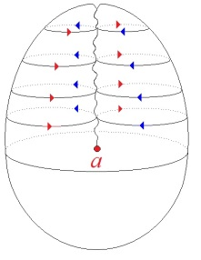

<!-- id: s9-20-0007 -->

*fig.1*

<!-- id: s9-20-0008 -->

Le *cross-cap* dans les livres savants, c’est ça, coupé pour pouvoir s’insérer sur une autre surface :

<!-- id: s9-20-0009 -->

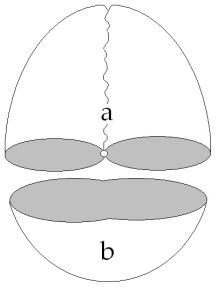

<!-- id: s9-20-0010 -->

*fig.2*

<!-- id: s9-20-0011 -->

Ces trois surfaces, *sphère, tore, cross-cap* sont des *surfaces closes élémentaires* à la composition desquelles toutes les autres sur­faces closes peuvent se réduire. J’appellerai néanmoins *cross-cap* *la figure* 1. Son vrai nom est *le plan projectif* de *la théorie des surfaces* de RIEMANN, dont ce plan est la base. Il fait intervenir au moins la quatrième dimension. Déjà la troisième dimension, pour nous « *psychologues des profondeurs* », fait assez problème pour que nous la considérions comme peu assurée. Néanmoins dans cette simple figure, le *cross-cap*, la quatrième est déjà impliquée nécessairement. Le nœud élémentaire, fait l’autre jour avec une ficelle, présentifie déjà la quatrième dimen­sion.

<!-- id: s9-20-0012 -->

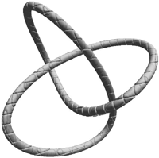

<!-- id: s9-20-0013 -->

Il n’y a pas de théorie topologique valable sans que nous fassions interve­nir quelque chose qui nous mènera à la quatrième dimension. Si ce nœud, vous voulez essayer de le reproduire en usant du *tore*, en suivant les tours et les détours que vous pouvez faire à la surface d’un *tore*, vous pour­riez après plusieurs tours revenir sur une ligne qui se boucle comme le nœud ci-dessus. Vous ne pouvez le faire sans que la ligne se coupe elle-même.

<!-- id: s9-20-0014 -->

Comme sur la surface du *tore* vous ne pourrez pas marquer que la ligne passe au-dessus ou au-dessous, il n’y a pas moyen de faire ce nœud sur le *tore*. Il est par contre parfaitement *faisable* sur *le cross-cap*. Si cette surface implique la présence de la quatrième dimension, c’est un commencement de preuve que *le plus simple nœud implique la quatrième dimension*. Cette surface, *le cross-cap*, je vais vous dire comment vous pouvez l’imagi­ner. Ça n’imposera pas sa nécessité, par là-même, pour nous, menée. Elle n’est pas sans rapport avec le *tore*, elle a même avec le *tore* le rapport le plus profond.

<!-- id: s9-20-0015 -->

La façon la plus simple de vous donner ce *rapport* est de vous rappeler comment *le tore* est construit quand on le décompose sous une forme *polyédrique*, c’est-à-dire en le ramenant à son *polygone fondamen­tal*. Ici, ce *polygone fondamen­tal*, c’est un *quadrilatère*. Si ce quadrilatère, vous le repliez sur lui–même, ce qui est *a* ici se joint à *a’*, vous aurez un tube en joi­gnant les bords :

<!-- id: s9-20-0016 -->

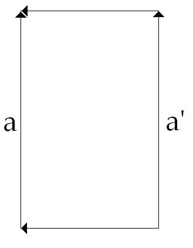→ 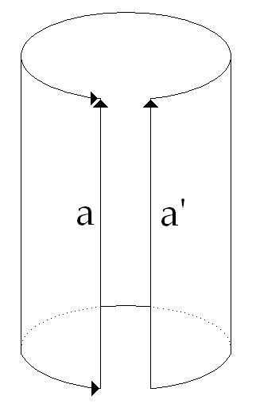

<!-- id: s9-20-0017 -->

Si on *vectorise* ces bords en convenant que ne peuvent être accolés l’un à l’autre que les vecteurs qui vont dans le même sens, le début d’un vecteur s’appliquant au point où se termine l’autre vecteur, dès lors on a toutes les coordonnées pour définir la structure du *tore*. Si vous faites une surface dont le *polygone fondamen­tal* est ainsi défini par des vecteurs allant tous dans le même sens sur le quadrilatère de base :

<!-- id: s9-20-0018 -->

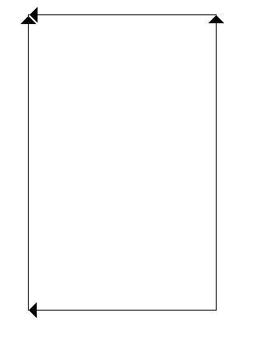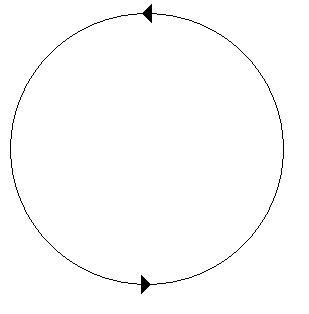

<!-- id: s9-20-0019 -->

Si vous partez d’un polygone ainsi défini, ça ferait seulement deux bords, ou même un seul, vous obtenez ce que je vous matérialise comme *la mitre* \[fig.1\] Je reviendrai sur sa fonc­tion de symbolisation de quelque chose et ça sera plus clair quand ce nom servira de support. En coupe avec sa gueule de mâchoire ça n’est pas ce que vous croyez.

<!-- id: s9-20-0020 -->

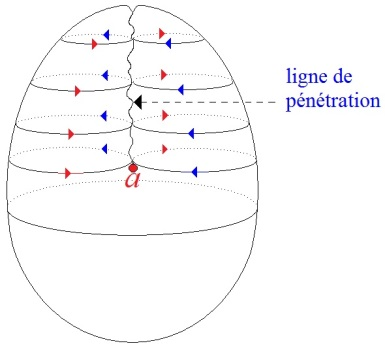

<!-- id: s9-20-0021 -->

Ceci :est une *ligne de pénétration* grâce à quoi ce qui est en avant, au-dessous est *une demi-sphère*, en haut la paroi passe par pénétration dans la paroi opposée et revient en avant. Pourquoi cette forme-là plutôt qu’une autre ? Son *polygone fondamental* est distinct de celui du *tore* :

<!-- id: s9-20-0022 -->

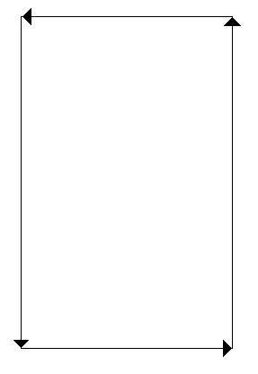

<!-- id: s9-20-0023 -->

*tore* *cross-cap*

<!-- id: s9-20-0024 -->

Un polygone dont les bords sont marqués par *des vecteurs de même direction*, et distinct de celui du *tore*, qui part d’un point pour aller au point opposé, qu’est–ce que ça fait comme surface ?

<!-- id: s9-20-0025 -->

Dès maintenant se déga­gent des points probléma­tiques de ces surfaces. Je vous ai introduit les surfaces sans bord à propos de la face. S’il n’y a pas de bord, com­ment définir la face ? Et si nous interdisons autant que possible de plonger trop vite notre modèle dans la troisième dimension, là où il n’y a pas de bord, nous serons assurés qu’il y a *un intérieur* et *un extérieur*. C’est ce que suggère cette surface sans bord par excellence qu’est la sphère.

<!-- id: s9-20-0026 -->

Je veux vous détacher de cette intuition indécise : il y a ce qui est au-dedans et ce qui est au dehors. Pourtant *pour les autres surfaces* que j’ai énumérées, cette notion d’intérieur et d’extérieur se dérobe. Pour le plan infini, elle ne suffirait pas. Pour *le tore*, l’intuition colle en apparence suffisamment parce qu’il y a l’intérieur d’une chambre à air et l’exté­rieur. Néanmoins, ce qui se passe dans le champ par où cet espace extérieur tra­verse le tore, c’est-à-dire l’espace du trou central, là est le nerf topologique de ce qui a fait l’intérêt du tore et où le rapport de l’intérieur et de l’extérieur s’illustre de quelque chose qui peut nous toucher.

<!-- id: s9-20-0027 -->

Remarquez que jusqu’à FREUD, *l’anato­mie traditionnelle* un tant soit peu *Naturwissenschaft,* avec PARACELSE et ARISTOTE, a toujours fait état, parmi les *orifices* du corps, *des organes des sens* comme d’authentiques *orifices*. La théorie psychanalytique, en tant que structurée par la fonction de la libido, a fait un choix bien étroit parmi les *orifices* et ne nous parle pas des *orifices* sensoriels comme orifices, sinon à les ramener au *signifiant des ori­fices* d’abord choisis. Quand on a fait de la *scoptophilie* une *scoptophagie*, on dit que l’identification scoptophile est une identification orale, comme le fait FENICHEL.

<!-- id: s9-20-0028 -->

Le privilège des orifices oraux, anaux et génitaux nous retient en ceci que ce ne sont pas vraiment les orifices qui donnent sur l’intérieur du corps. Le tube digestif n’est qu’une traversée, il est ouvert sur l’extérieur. Le vrai intérieur est l’intérieur mésodermique et les orifices qui y introduisent existent bel et bien sous la forme des yeux ou de l’oreille dont jamais la théorie psychanalytique ne fait mention comme tels, sauf sur la couverture de la revue *La Psychanalyse.*

<!-- id: s9-20-0029 -->

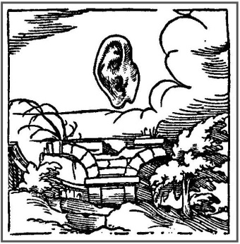

<!-- id: s9-20-0030 -->

C’est la vraie portée donnée au *trou central* du *tore*, encore que ce ne soit pas un véritable intérieur, mais que ça nous suggère quelque chose de l’ordre d’un passage de l’inté­rieur à l’extérieur. Ceci nous donne l’idée, qui vient à l’inspection de cette surface close : le *cross-cap*. Supposez quelque chose d’infiniment plat qui se déplace sur cette surface :

<!-- id: s9-20-0031 -->

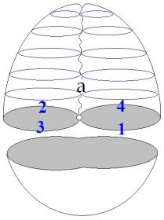

<!-- id: s9-20-0032 -->

passant de *l’extérieur* \[1\] de la surface close à *l’intérieur* \[2\] pour suivre plus loin à *l’intérieur* \[3\] jusqu’à ce qu’il arrive à la *ligne de pénétration* où il ressurgira à *l’extérieur* \[4\] de dos. Ceci montre la difficulté de la définition de la distinction *intérieur-extérieur*, même lorsqu’il s’agit d’une surface close, d’une surface sans bord.

<!-- id: s9-20-0033 -->

Je n’ai fait qu’ouvrir la question, ce n’est pas pour vous proposer un paradoxe, c’est pour vous rappeler que l’important dans cette figure de *la mitre* c’est que cette ligne de pénétration doit être tenue par vous pour nulle et non avenue. On ne peut le matérialiser au tableau sans faire intervenir cette ligne de pénétration, car l’intuition spatiale ordinaire exige qu’on la montre, mais la spéculation n’en tient aucun compte.

<!-- id: s9-20-0034 -->

On peut la faire glisser indéfiniment, cette ligne de pénétration. Il n’y a pas de réflexion d’une surface sur l’autre, rien de l’ordre d’une couture, il n’y a pas de passage possible. À cause de cela, le problème de l’intérieur et de l’extérieur est soulevé dans toute sa confusion. Il y a deux ordres de considérations quant à la surface : métrique et topologique.

<!-- id: s9-20-0035 -->

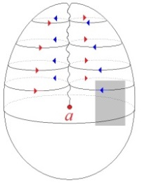

<!-- id: s9-20-0036 -->

Il faut renoncer à toute considération métrique - en effet à partir de ce carré je pourrais donner toute la surface - du point de vue topologique cela n’a aucun sens. Topo­logiquement la nature des rapports structuraux qui constituent la surface est présente en chaque point : la face interne se confond avec la face extérieure, la définition de la surface déterminant tous ses points et ses propriétés.

<!-- id: s9-20-0037 -->

Pour marquer l’intérêt de ceci, nous allons évoquer une question encore jamais posée qui concerne le signifiant : *un signifiant n’a-t-il pas toujours pour lieu une surface ?*

<!-- id: s9-20-0038 -->

Ça peut paraître une question bizarre, mais elle a au moins l’intérêt, si elle est posée, de suggérer une dimension. Au premier abord *le gra­phique* comme tel exige une *surface*. Si tant est que l’objection peut s’élever qu’une pierre levée, une colonne grecque c’est un signifiant et que ça a un volume. Eh bien, n’en soyez pas si sûrs, si sûrs de pouvoir introduire la notion de volume avant d’être bien assurés de ce qui concerne la notion de surface.

<!-- id: s9-20-0039 -->

Surtout si, mettant les choses à l’épreuve, vous vous apercevez que la notion de volume n’est pas saisissable autrement qu’à partir de celle de l’enveloppe. Nulle pierre levée ne nous a intéressés par autre chose, je ne dirai pas, que son enveloppe, ce qui serait aller à *un sophisme*, mais par ce qu’elle enveloppe. Avant d’être des volumes, l’architecture s’est faite à mobiliser, à arranger des surfaces autour d’un vide.

<!-- id: s9-20-0040 -->

À quoi ça sert des pierres levées ? À faire des alignements ou des tables, à faire quelque chose qui sert par le trou qu’il y a autour. Car c’est cela le reste à quoi nous avons affaire.

<!-- id: s9-20-0041 -->

Si, attrapant la nature de *la face*, je suis parti de *la surface avec bords* pour vous faire remarquer que le cri­tère nous défaillait aux surfaces sans bord, s’il est possible de vous montrer *une surface sans bord* fondamentale, où la définition de la face n’est pas forcée, puisque la surface sans bord n’est pas faite pour résoudre le problème de l’inté­rieur et de l’extérieur, nous devons tenir compte de la distinction d’une surface « *sans* » et d’une surface « *avec* » : elle a le rapport le plus étroit avec ce qui nous inté­resse, à savoir *le trou* qui est à faire entrer positivement comme tel dans la théo­rie des surfaces.

<!-- id: s9-20-0042 -->

Ce n’est pas un artifice verbal. Dans la *théorie combinatoire de la topologie générale*, toute surface triangulable, c’est-à-dire composable de petits morceaux triangulaires que vous collez les uns aux autres, *tore* ou *cross-cap*, peut se réduire par le moyen du *polygone fondamental* à une composition de la *sphèr*e à laquelle seraient adjoints plus ou moins d’éléments *toriques*, d’élé­ments de *cross–cap*, et des éléments *purs trous* indispensables représentés par ce vecteur bouclé sur lui–même.

<!-- id: s9-20-0043 -->

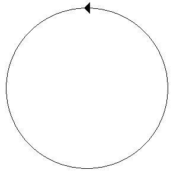

<!-- id: s9-20-0044 -->

*Cross-cap* *pur trou*

<!-- id: s9-20-0045 -->

Est-ce qu’un signifiant, dans son essence la plus radicale, ne peut être envisagé que comme *coupure :* \>\<, dans une surface ? Ces deux signes : *plus* *grand* : \>, et *plus* *petit* : \<*,* ne s’imposant que de leur *structure de cou­pure* inscrite sur quelque chose où toujours est marquée, non seulement *la conti­nuité d’un plan* sur lequel la suite s’inscrira, mais aussi *la direction* *vectorielle* où ceci se retrouvera toujours.

<!-- id: s9-20-0046 -->

Pourquoi *le signifiant dans son incarnation corporelle*, c’est-à-dire *vocale*, s’est toujours présenté à nous comme *d’essence discontinue* ? Nous n’avions donc pas besoin de la surface : *la discontinuité le constitue, l’interruption dans le successif fait partie de sa structure.* Cette *dimension temporelle* du fonctionnement de *la chaîne signifiante* que j’ai d’abord articulée pour vous *comme succession*, a pour suite que la scansion introduit un élément de plus que la division de l’interruption modulatoire, elle introduit *la hâte* que j’ai insérée en tant que hâte logique. C’est un vieux travail : *Le temps logique.* \[*Écrits* p. 197\]

<!-- id: s9-20-0047 -->

Le pas que j’essaye de vous faire franchir a déjà commencé d’être *tracé *: c’est celui où se noue *la discontinuité* avec ce qui est *l’essence du* *signifiant*, à savoir *la différence*. Si ce sur quoi nous avons fait pivoter, nous avons ramené sans cesse cette fonction du signifiant, c’est à attirer votre atten­tion sur ceci que : *même à répéter le même, le même d’être répété s’inscrit comme distinct.*

<!-- id: s9-20-0048 -->

Où est l’interpolation d’une différence ?

<!-- id: s9-20-0049 -->

- Réside-t-elle seule­ment dans la coupure, c’est ici que l’introduction de la dimension topologique au-delà de la scansion temporelle nous intéresse,

<!-- id: s9-20-0050 -->

- ou dans ce quelque chose d’autre que nous appellerons « *la simple possibilité d’être différent* », l’existence de *la batterie différentielle qui constitue le signifiant* et par laquelle nous ne pou­vons pas confondre *synchronie* avec *simultanéité*, à la racine du phénomène.

<!-- id: s9-20-0051 -->

*Syn­chronie qui fait que, réapparaissant le même, c’est comme distinct de ce qu’il répète que le signifiant réapparaît*, et ce qui peut être considéré comme distin­guable, c’est l’interpolation de la différence, pour autant que nous ne pouvons poser comme fondement de la fonction signifiante l’identité du « A *est* A » à savoir que la différence est dans *la coupure*, ou dans la possibilité synchronique qui constitue *la différence* *signifiante*.

<!-- id: s9-20-0052 -->

*En tout cas, ce qui se répète comme <u>signifiant</u> n’est différent que de pouvoir être inscrit***.** Il n’en reste pas moins que la fonction de *la coupure* nous importe au premier chef dans *ce qui* *peut être écrit*. Et c’est ici que la notion de surface topologique doit être introduite dans notre fonctionnement mental parce que c’est là seule­ment que prend son intérêt la fonction de la coupure.

<!-- id: s9-20-0053 -->

L’inscription nous rame­nant à la mémoire est une objection à réfuter. La mémoire qui nous intéresse, nous analystes, est à distinguer d’une mémoire organique, celle - si je puis dire - qui, à la même « *succion* » du réel répondrait par la même façon pour l’organisme de s’en défendre : *celle qui maintient l’homéostasie*, car l’organisme ne reconnaît pas *le même* qui se renouvelle en tant que différent. La mémoire organique « *même-orise* »*.* Notre mémoire est autre chose : elle intervient en fonction du *trait unaire*, marquant la fois unique, et a pour support l’inscription. Entre le stimulus et la réponse, l’ins­cription, le *printing,* doit être rappelée en termes d’imprimerie gutenbergienne.

<!-- id: s9-20-0054 -->

Le premier jet de la théorie psycho-physique contre lequel nous nous révoltons est toujours atomistique, c’est toujours à l’impression dans des schémas de sur­face que cette psycho-physique prend sa première base. Il ne suffit pas de dire que c’est insuffisant, avant qu’on n’ait trouvé autre chose.

<!-- id: s9-20-0055 -->

Car s’il est d’un grand intérêt de voir que la première théorie de la vie relationnelle s’inscrivait en des termes intéressants qui traduisaient - seulement sans le savoir - la structure même du signi­fiant sous les formes masquées des effets distincts de *contiguïté* et de *continuité*, associationnisme psychologique, s’il est bon de montrer que ce qui était reconnu et méconnu comme dimension signifiante, c’étaient *les effets de signifiant* dans la structure de monde idéaliste dont cette psycho-physique ne s’est jamais détachée, inversement ce qu’on a traduit par la *Gestalt* est insuffisant à rendre compte de ce qui se passe au niveau des phénomènes vitaux, en raison d’une ignorance fondamentale qui se traduit par la rapidité avec laquelle on tient pour certaines des évidences que tout contredit. La prétendue *bonne forme* de la circonférence que l’organisme s’obstinerait sur tous les plans, subjectifs ou objectifs, à cher­cher à reproduire est contraire à toute observation des formes organiques. Je dirai aux Gestaltistes qu’une oreille d’âne ressemble à un *cornet,* à un *arum,* à une *surface de Mœbius.*

<!-- id: s9-20-0056 -->

Une *surface de Mœbius* est l’illustration la plus simple du *cross-cap* : ça se fabrique avec une bande de papier dont on colle les deux extrémités après l’avoir tordue, de sorte que l’être infiniment plat qui s’y pro­mène peut le suivre sans jamais franchir un bord. Ça montre l’ambiguïté de la notion de face. Car il ne suffit pas de dire que c’est une surface *unilatère*, à une seule face, comme certains mathématiciens le formulent : autre chose est une définition formelle.

<!-- id: s9-20-0057 -->

Il n’en reste pas moins qu’il y a *coalescence pour chaque point de deux faces* et c’est ça qui nous intéresse. Pour nous qui ne nous conten­tons pas de la dire *unilatère* sous prétexte que les deux faces sont partout pré­sentes, il n’en reste pas moins que nous pouvons manifester en chaque point le scandale pour notre intuition de ce rap­port à deux faces. En effet dans un plan, si nous traçons un cercle qui tourne dans le sens des aiguilles d’une montre, de l’autre côté, par transparence, la même flèche tourne dans le sens contraire.

<!-- id: s9-20-0058 -->

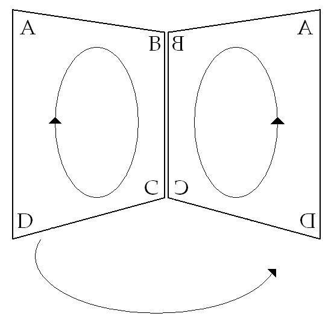

<!-- id: s9-20-0059 -->

L’être infiniment plat, le petit personnage sur *la bande de Mœbius*, s’il véhicule avec lui un cercle tournant autour de lui dans le sens des aiguilles d’une montre, ce cercle tournera toujours dans le même sens, si bien que de l’autre côté de son point de départ, ce qui s’inscrira tournera dans le sens horaire - c’est-à-dire en sens opposé à ce qui se passerait sur une bande normale, sur le plan, où sur l’autre face ça tourne en sens contraire - ça n’est pas inversé. C’est pour ça qu’on définit ces surfaces comme *non-orientables* et pourtant ça n’en est pas moins *orienté*.

<!-- id: s9-20-0060 -->

Le *désir*, de n’être pas *articulable*, nous ne pou­vons dire pour autant qu’il ne soit pas *articulé*. Car ces *petites oreilles* dans *la bande de Mœbius*, toutes *non-orientables* qu’elles soient, sont plus *orientées* qu’une bande normale. Faites-vous une ceinture conique, retournez-la : ce qui était ouvert *en bas* l’est *en haut*.

<!-- id: s9-20-0061 -->

Mais *la bande de Mœbius*, retournez-la : ça aura toujours la même forme. Même quand vous retournez l’objet, il y aura toujours la bosse rentrée sur la gauche, la bosse renflée sur la droite. Une sur­face non-orientable est donc beaucoup plus orientée qu’une surface orientable.

<!-- id: s9-20-0062 -->

Quelque chose va encore plus loin et surprend les mathématiciens qui ren­voient avec un sourire le lecteur à l’expérience, c’est que si dans cette *surface de Mœbius*, à l’aide de ciseaux, vous tracez une coupure à égale distance des points les plus accessibles des bords - *elle n’a qu’un seul bord*... - si vous faites un cercle, la coupure se ferme, vous réalisez un cycle, un *lacs,* une *courbe fermée de Jordan.* Or *cette coupure*, non seulement laisse la surface entière, mais *transforme votre surface non-orientable* en *surface orientable*, c’est-à-dire en une bande dont, si vous colorez l’un des côtés, tout un côté restera blanc, contrairement à ce qui se serait passé tout à l’heure sur la *surface de Mœbius* entière, *tout aurait été coloré sans que le pinceau change de face*.

<!-- id: s9-20-0063 -->

La simple intervention de la coupure a changé la structure omniprésente de tous les points de la surface, vous disais-je. Et si je vous demande de me dire la différence entre l’objet d’avant la coupure et celui-ci, il n’y a pas moyen de le faire. Ceci pour introduire l’intérêt de *la fonc­tion de la coupure*.

<!-- id: s9-20-0064 -->

Le *polygone quadrilatère* est originaire du *tore* et du *bonnet*. Si je n’ai jamais introduit la véritable verbalisation de cette forme : **◊**, *poinçon, désir* unissant le S au *(a)* dans S**◊***a*, ce petit quadrilatère doit se lire : *le sujet* en tant que marqué par *le signifiant* *est* proprement, *dans le fantasme,* *coupure de a.*

<!-- id: s9-20-0065 -->

La prochaine fois, vous verrez comment ceci nous donnera un support fonctionnant pour articu­ler la question, comment ce que nous pouvons définir, isoler à partir de la demande comme *champ du désir*, dans son côté insaisissable, peut-il par quelque torsion se nouer avec ce qui, pris d’un autre côté, se définit comme le *champ de l’objet(a).*

<!-- id: s9-20-0066 -->

Comment *le* *désir peut-il s’égaler à (a) ?*

<!-- id: s9-20-0067 -->

C’est ce que j’ai intro­duit, et qui vous donnera un modèle utile jusque dans votre pratique.
