# Leçon 21 | 23 Mai 1962

<!-- source-url: http://staferla.free.fr/S9/S9 L'IDENTIFICATION.docx -->
<!-- seminar: s9 -->
<!-- lesson: 21 -->

<!-- id: s9-21-0001 -->

Pourquoi un *signifiant* est-il « *saisie de »* la moindre chose, peut-il *saisir* la moindre chose ? Voilà la question.

<!-- id: s9-21-0002 -->

Une question dont peut-être il n’est pas exces­sif de dire qu’on ne l’a point encore posée en raison de la forme qu’a prise clas­siquement la logique. En effet, le principe de la prédication, qui est la proposition universelle, n’implique qu’une chose, c’est que ce que l’on saisit, ce sont des êtres nullifiables, *dictum de omni* et *nullo* [^162].

<!-- id: s9-21-0003 -->

Pour ceux dont ces termes ne sont pas familiers et qui par conséquent ne comprennent pas très bien, je rap­pelle ce qu’est ce que je suis en train de vous expliquer depuis plusieurs fois, à savoir de prendre le support du cercle d’EULER - d’autant plus légitimement que ce qu’il s’agissait de substituer est autre chose - le cercle d’EULER, comme tout cercle si je puis dire « *naïf* », cercle à propos duquel la question ne se pose pas de savoir s’il cerne un morceau, un lambeau, le propre du cercle - détache-t-il un lambeau de cette surface hypothétique impliquée ? - c’est qu’il peut se réduire progressivement à rien. La possibilité de l’universel, c’est la nullité.

<!-- id: s9-21-0004 -->

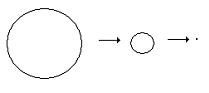

<!-- id: s9-21-0005 -->

*Tous les professeurs* - vous ai-je dit un jour, parce que j’ai choisi cet exemple pour ne pas retomber toujours dans les mêmes problèmes - *tous les professeurs sont lettrés*. Eh bien, *si par hasard* quelque part *aucun professeur ne mérite d’être qualifié de lettré*, qu’à ceci ne tienne, nous aurons des professeurs nuls. Observez bien que *ceci n’est pas équivalent à dire qu’il n’y a pas de professeur*. La preuve c’est que, les professeurs nuls, eh bien, nous les avons à l’occasion ! Quand je dis « avoir », prenez cet « *avoir* » au sens fort, au sens dont il s’agit quand nous parlons de « *l’être et de l’avoir* ». Ce n’est pas comme cela un mot glissant destiné à laisser échapper la savonnette.

<!-- id: s9-21-0006 -->

Quand je dis « *nous les avons* » cela veut dire que nous sommes habitués à *les avoir*, de même que nous avons des tas de choses comme cela, nous avons la République… Comme disait un paysan avec qui je conversais il n’y a pas très longtemps : « *cette année nous avons eu la grêle, et puis après, les boy-scouts* ». Quelle que soit la précarité définitionnelle pour le paysan de ces météores, le verbe « *avoir* » a donc bien ici son sens.

<!-- id: s9-21-0007 -->

Nous avons par exemple aussi les psychanalystes... Et c’est évidemment bien plus compliqué, parce que les psychanalystes commencent à nous faire entrer dans l’ordre de la définition existentielle. On y entre par la voie de la condition. On dit par exemple : « *Il n’y a pas... Nul ne pourra se dire psychanalyste s’il n’a été psychanalysé.* ».

<!-- id: s9-21-0008 -->

Eh bien, il y a un grand danger à croire que ce rapport soit homogène avec ce que nous avons évoqué précédemment, dans ce sens où, pour nous servir des cercles d’EULER, il y aurait : *le cercle des psychanalysés*, mais comme cha­cun sait, les psychanalystes devant être psy­chanalysés, *le cercle des psychanalystes* pourrait donc être tracé inclus au *cercle des psychanalysés.*

<!-- id: s9-21-0009 -->

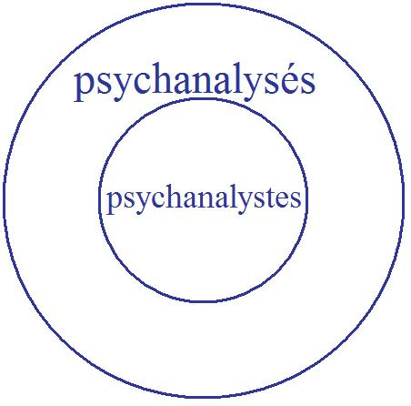

<!-- id: s9-21-0010 -->

Je n’ai pas besoin de vous dire que si notre expérience avec *les psychana­lystes* nous fait tant de difficultés, c’est pro­bablement que les choses ne sont pas si simples, à savoir qu’après tout, si ce n’est pas évident, au niveau du *professeur*, que le fait même de fonctionner comme professeur puisse aspirer au sein du professeur, à la manière d’un siphon, quelque chose qui le vide de tout contact avec les effets de la lettre, il est au contraire tout à fait évident pour le psychanalyste que tout est là.

<!-- id: s9-21-0011 -->

Il ne suffit pas de renvoyer la question à : « *Qu’est-ce que c’est que d’être psychanalysé ?* » Car bien entendu ce qu’on croit faire là, et bien sûr : naturelle­ment, ne serait que de détourner personne de mettre au premier plan la question de ce que c’est qu’être psychanalysé. Mais dans le rapport au psychanalyste, ce n’est pas cela qu’il s’agit de saisir si nous voulons attraper la conception du psy­chanalyste, c’est de savoir : qu’est-ce que ça lui fait, au psychanalyste, d’être psy­chanalysé, ceci en tant que psychanalyste, et non pas en tant que partie des psychanalysés.

<!-- id: s9-21-0012 -->

Je ne sais pas si je me fais bien entendre, mais je vais vous ramener une fois de plus au *b-a, ba*, à l’élémentaire.

<!-- id: s9-21-0013 -->

Si tout de même, à entendre le plus vieil exemple de la logique, le premier pas que l’on fait pour pousser SOCRATE dans le trou, à savoir : « *Tous les hommes sont mortels*... ». Depuis le temps qu’on nous tympanise avec cette formule ! Je sais bien que vous avez eu le temps de vous endurcir, mais pour tout être un peu frais, le fait même de la promotion de cet exemple au cœur de la logique ne peut pas ne pas être la source *de quelque malaise, de quelque sentiment de l’escroquerie*. Car en quoi nous intéresse une telle formule, si c’est l’homme qu’il s’agit de sai­sir ?

<!-- id: s9-21-0014 -->

À moins que ce dont il s’agit - et c’est justement ce que les cercles concen­triques de l’inclusion eulérienne escamotent - ce n’est pas de savoir qu’il y a *un cercle des mortels et à l’intérieur le cercle de l’homme*, ce qui n’a strictement aucun intérêt, c’est de savoir : qu’est-ce que ça lui fait, à l’homme, d’être mortel, d’attraper le tourbillon qui se produit au centre, quelque part, de la notion d’homme, du fait de sa conjonction au prédicat « *mortel* », et que c’est bien pour ça que nous courons après quelque chose. Quand nous parlons de l’homme, c’est justement à ce tourbillon, à ce trou qui se fait là, dans le milieu quelque part, que nous touchons.

<!-- id: s9-21-0015 -->

J’ouvrais récemment un excellent livre, d’un auteur américain[^163] dont on peut dire que l’œuvre accroît le patrimoine de la pensée et de l’élucidation logique. Je ne vous dirai pas son nom, parce que vous allez chercher qui c’est. Et pourquoi est-ce que je ne le fais pas ? Parce que, moi, j’ai eu la surprise de trouver dans les pages où il travaille si bien, un tel sens si vif de l’actualité du progrès de la logique, où justement mon *huit intérieur* intervient. Il n’en fait pas du tout le même usage que moi, néanmoins je me suis amené à la pensée que quelque man­darin parmi mes auditeurs viendrait me dire un jour que c’est là que je l’ai pêché.

<!-- id: s9-21-0016 -->

Sur l’originalité du passage de M. JAKOBSON, je compte en effet la plus forte réfé­rence. Il faut dire que dans ce cas - je crois avoir commencé à pousser en avant la métaphore et la métonymie dans notre théorie quelque part du côté du *Dis­cours de Rome*, qui est paru - c’est en parlant avec JAKOBSON qu’il m’a dit:

<!-- id: s9-21-0017 -->

« *Bien sûr, cette histoire de la métaphore et de la métonymie, nous avons tordu cela ensemble, souvenez-vous, le* 14 *Juillet* 1950*.* »

<!-- id: s9-21-0018 -->

Pour le logicien en question, il y a longtemps qu’il est mort, et son petit *huit intérieur* précède incontestable­ment sa promotion ici. Mais quand il entre d’un bon pas dans son examen de *l’universel affirmatif*, il use d’un exemple qui a le mérite de ne pas traîner par­tout. Il dit :

<!-- id: s9-21-0019 -->

« *Tous les saints sont des hommes, tous les hommes sont passion­nés, donc tous les saints sont passionnés* ».

<!-- id: s9-21-0020 -->

Il ramasse cela parce que vous devez bien sentir, dans un tel exemple, que *le problème est bien de savoir où est cette passion prédicative*, la plus extérieure de *ce syllogisme universel*, de savoir quelle sorte de passion revient au cœur pour faire la sainteté.

<!-- id: s9-21-0021 -->

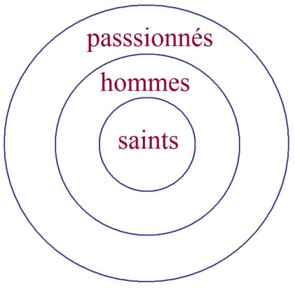

<!-- id: s9-21-0022 -->

Tout cela, j’y ai pensé ce matin, je veux dire à vous le dire comme cela, pour vous faire sentir ce dont il s’agit concernant ce que j’ai appelé « *Un certain mou­vement de tourbillon* ».

<!-- id: s9-21-0023 -->

Qu’est-ce que nous essayons de serrer, avec notre appa­reil concernant les *surfaces*, les surfaces au sens que nous entendons leur donner d’un usage qui ici - pour rassurer mes auditeurs inquiets de mes excursions - est peut-être peu classique, mais est tout de même quelque chose qui n’est rien d’autre que de renouveler, de réinterroger *la fonction kantienne du schème*.

<!-- id: s9-21-0024 -->

Je pense que le radical illogisme - à l’expérience - de « *l’appartenance »*, de « *l’inclu­sion »*, le rapport de « *l’extension »* à *« la compréhension »*, aux « *cercles d’Euler »*, toute cette direction où s’est engagée avec le temps la logique, est-ce que dans son fourvoiement même elle n’est pas le rappel de ce qui fut, à son départ, oublié ? Ce qui fut, à son départ oublié, c’est que *l’objet dont il s’agit*, fût-il le plus pur, *c’est, ça a été, ce sera* - quoi qu’on y fasse - *l’objet du désir*,

<!-- id: s9-21-0025 -->

- et que s’il s’agit de le cerner pour l’attraper *logiquement*, c’est-à-dire *avec le langage*,

<!-- id: s9-21-0026 -->

- c’est que d’abord il s’agit de le *saisir* comme *objet de notre désir*,

<!-- id: s9-21-0027 -->

- l’ayant *saisi*, de le garder, ce qui veut dire l’enclore,

<!-- id: s9-21-0028 -->

- et que ce retour de l’inclusion au premier plan de la formalisation logique y trouve sa racine dans ce besoin de posséder, où se fonde notre rapport à *l’objet* en tant que tel *du désir*.

<!-- id: s9-21-0029 -->

Le *Begriff* évoque la *saisie*, parce que c’est de courir après la *saisie* d’un objet de notre désir que nous avons forgé le *Begriff.* Et chacun sait que tout ce que nous voulons posséder qui soit objet de désir, ce que nous voulons posséder pour le désir, et non pour la satis­faction d’un besoin, nous fuit et se dérobe.

<!-- id: s9-21-0030 -->

Qui ne l’évoque dans le prêche mora­liste :

<!-- id: s9-21-0031 -->

- « *Nous ne possédons rien enfin, il faudra quitter tout cela* » dit le célèbre cardinal[^164], comme c’est triste !

<!-- id: s9-21-0032 -->

- « *Nous ne possédons rien*, dit le prêche moraliste, *parce qu’il y a la mort* ».

<!-- id: s9-21-0033 -->

*Autre escamotage* : ce qu’on nous promeut ici, au niveau du fait de *la mort réelle*, n’est pas ce qui est en question. Ce n’est pas pour rien qu’une longue année[^165] je vous fis promener dans cet espace que mes auditeurs ont qualifié « *d’entre-deux-morts* ». La suppression de *la mort réelle* n’arrangerait rien à cette affaire du dérobement de l’objet du désir, parce que ce dont il s’agit, c’est de l’autre mort, celle qui fait que même si nous n’étions pas *mortels*, si nous avions promesse de *vie éternelle*, la question reste toujours ouverte *si cette vie éternelle* - je veux dire dont serait écartée toute promesse de la fin - *n’est pas concevable* *comme une forme de mourir éternellement*. *Elle l’est assurément, puisque c’est notre condition quotidienne*, et nous devons en tenir compte dans notre logique d’analystes parce que c’est ainsi - si la psychanalyse a un sens, et si FREUD n’était pas fou - *car c’est cela que désigne ce point dit de l’instinct de mort.*

<!-- id: s9-21-0034 -->

Déjà *le physiologiste*, le plus génial - on peut dire - de tous ceux qui ont le sens de ce biais de *l’approche biologique :* BICHAT[^166] : « *La vie - dit-il - est l’ensemble des forces qui résistent à la mort* ». Si quelque chose de notre expérience peut se réfléchir, peut un jour prendre sens ancré sur ce plan si difficile, c’est cette précession produite par FREUD de cette forme de « *tourbillon de la mort* » sur les flans de laquelle la vie se cramponne pour ne pas y passer.

<!-- id: s9-21-0035 -->

Car la seule chose à ajouter, pour rendre à quiconque cette fonction tout à fait claire, est qu’il suffit de ne pas confondre *le mort avec l’inanimé*, quand dans la nature inanimée il suffit que, nous baissant, nous ramassions la trace de ce que c’est qu’une *forme morte, le fossile*, pour que nous saisissions que la présence du mort dans la nature, c’est autre chose que *l’inanimé*. Est-il bien sûr que c’est là, *coquilles* et *déchets*[^167], une fonction de la vie ? C’est résoudre un peu aisément le problème quand il s’agit de savoir pourquoi la vie ça se tortille comme ça !

<!-- id: s9-21-0036 -->

Au moment de reprendre la question du *signifiant* déjà abordée par la voie de *la trace*, il m’est venu l’idée ironique, soudain, sortant des *dialogues platoniciens*, de penser que cette empreinte un tant soit peu scandaleuse, dont PLATON fait état, pensant à la marque laissée dans le sable du stade par les culs nus des bien-aimés, expressions vers lesquelles sans doute se précipitait l’adoration des amants et dont la bienséance consistait à l’effacer, ils auraient mieux fait de la laisser en place.

<!-- id: s9-21-0037 -->

Si les amants avaient été moins obnubilés par *l’objet de leur désir*, ils auraient été capables d’en tirer parti et d’y voir l’ébauche de cette *curieuse ligne* que je vous propose aujourd’hui. Telle est l’image de l’aveuglement que porte avec lui trop vif tout désir. Repartons donc de notre ligne, qu’il faut bien prendre sous la forme où elle nous est donnée, close et nullifiable, la ligne du zéro originel de l’histoire effec­tive de la logique. Si nous y apprenons, y revenant d’ores et déjà, que « *nul...*»*,* c’est la racine du « *tous*...» au moins l’expérience n’aura pas été faite en vain. Cette ligne, pour nous, nous l’appelons *la coupure,* une ligne - c’est notre départ - qu’il nous faut tenir *a priori* pour fermée.

<!-- id: s9-21-0038 -->

C’est là *l’essence de sa nature signifiante* : rien ne pourra jamais nous prouver - puisqu’il est de la nature de *chacun de ces tours* de se fonder comme différent - rien dans l’expérience ne peut nous permettre de le fonder comme étant la même ligne. C’est justement cela qui nous permet d’appréhender le *réel* : c’est en ceci que son retour étant structuralement diffé­rent, toujours *une autre fois,* si cela se ressemble, alors il y a suggestion, proba­bilité, que la ressemblance vienne du *réel*.

<!-- id: s9-21-0039 -->

Aucun autre moyen d’introduire d’une façon correcte la fonction du *semblable*. Mais ce n’est là qu’une indication que je vous donne, à pousser plus loin. Il me semble que je l’ai maintes fois répétée, si ce n’est - pour n’avoir point à y revenir - que tout de même, la rappelant, je vous renvoie à cette œuvre d’un génie précoce, et comme tous les génies précoces, trop précocement disparu : Jean NICOD\[1893-1924\], *La géométrie du monde sensible* [^168]*,* où le pas­sage concernant *la ligne axiomatique*, au centre de l’ouvrage - Peut-être quelques-uns d’entre vous qui s’intéressent authentiquement à notre progrès peuvent s’y reporter - montre bien comment l’escamotage de la fonction du cercle signifiant, dans cette analyse de l’expérience sensible, est chimérique et mène l’auteur, malgré l’incontestable intérêt de ce qu’il promeut, au paralogisme que vous ne manquerez pas d’y trouver.

<!-- id: s9-21-0040 -->

Nous prenons au départ *cette ligne fer­mée* dont l’existence de la fonction des *surfaces topologiquement définies* a servi d’abord à renverser pour vous l’évidence trompeuse que *l’intérieur de la ligne* fût quelque chose d’univoque, puisqu’il suffit que ladite ligne se dessine sur une surface définie d’une certaine façon - le *tore* par exemple - pour qu’il soit apparent que, tout en y restant dans sa fonction de *coupure*, elle ne saurait d’aucune façon y remplir la même fonction que sur la surface que vous me per­mettrez sans plus d’appeler ici « *fondamentale* », celle de *la sphère*, à savoir de défi­nir un lambeau nullifiable par exemple.

<!-- id: s9-21-0041 -->

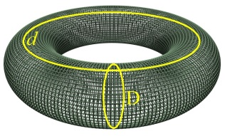

<!-- id: s9-21-0042 -->

Pour ceux qui viennent ici pour la première fois, ceci veut dire une ligne fermée, ici dessinée \[*d*\] ou encore celle-ci \[D\], qui ne sauraient en aucune façon se réduire à zéro, c’est à savoir que la fonc­tion de *la coupure* qu’elles introduisent dans la sur­face est quelque chose qui *à chaque fois fait problème*.

<!-- id: s9-21-0043 -->

Je pense que ce dont il s’agit, concernant *le signifiant*, c’est de cette liaison réciproque qui fait que :

<!-- id: s9-21-0044 -->

si d’une part, comme je vous l’ai rendu sensible la dernière fois à propos de *la surface de Mœbius* - cette jolie petite oreille contournée dont je vous ai donné quelques exemplaires - la coupure médiane par rapport à son champ la transforme en une surface autre, qui n’est plus cette *surface de Mœbius* - si tant est que *la surface de Mœbius*, et là-dessus je fais plus d’une réserve, peut être dite n’avoir qu’une face - assurément celle qui résultait de la coupure en avait, sans ambigüité, deux, de faces.

<!-- id: s9-21-0045 -->

Ce dont il s’agit pour nous, prenant ce biais d’interroger les effets du désir par l’abord du signifiant, c’est de nous apercevoir comment *le champ de la cou­pure, la béance de la coupure*, c’est en s’organisant *en surface* qu’elle fait surgir pour nous les différentes formes où peuvent s’ordonner les temps de notre expé­rience du désir. Il y a le *tore*…

<!-- id: s9-21-0046 -->

Quand je vous dis que c’est à partir de la coupure que s’organi­sent les formes de la surface dont il s’agit, pour nous, dans notre expérience, d’être capables de faire venir au monde l’effet du signifiant, je l’illustre - je ne l’illustre pas pour la première fois :

<!-- id: s9-21-0047 -->

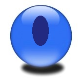

<!-- id: s9-21-0048 -->

Voici la sphère, voici notre coupure centrale, prise par le biais inverse du cercle d’EULER. Ce qui nous intéresse, ce n’est pas le morceau qui est nécessairement, par *la ligne fermée* sur la sphère détaché, c’est la coupure ainsi produite et si vous voulez, d’ores et déjà *le trou*. Il est bien clair que tout doit être donné de ce que nous trouverons à la fin, en d’autres termes *qu’un trou* cela a déjà là tout son sens, sens rendu *particulièrement évident* du fait de notre recours à la sphère.

<!-- id: s9-21-0049 -->

*Un trou* fait ici communiquer l’un avec l’autre *l’intérieur* avec *l’extérieur*. Il n’y a qu’un malheur, c’est que dès que *le trou* est fait, il n’y a plus ni intérieur, ni extérieur, comme est trop évident ceci : c’est que cette sphère trouée se retourne le plus aisément du monde. Il s’agit de la créature universelle, primordiale, celle du potier éternel. Il n’y a rien de plus facile à retourner qu’un bol, c’est-à-dire une calotte.

<!-- id: s9-21-0050 -->

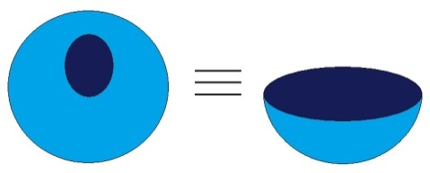

<!-- id: s9-21-0051 -->

Le trou n’aurait donc pas grand sens pour nous s’il n’y avait pas autre chose pour supporter cette intuition fondamentale \- je pense que cela vous est familier aujourd’hui - c’est à savoir qu’un trou, une coupure, il lui arrive des avatars, et le premier possible est que deux points du bord s’accolent : une des premières possibilités concernant le trou, c’est de devenir deux trous.

<!-- id: s9-21-0052 -->

→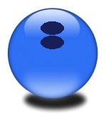

<!-- id: s9-21-0053 -->

Certains m’ont dit « *Que ne référez-vous à l’embryologie vos images ?* ». Croyez bien qu’elles n’en sont jamais bien loin. C’est ce que devant vous j’explique, mais ce ne serait qu’un *alibi*, parce qu’ici me référer à l’embryologie c’est m’en remettre au pouvoir mystérieux de la vie, dont on ne sait pas, bien sûr, pour­quoi elle croit devoir ne s’introduire dans le monde que par le biais, l’intermédiaire de cette globule, de cette sphère qui se multiplie, se déprime, s’invagine, s’avale elle-même, puis singulièrement - du moins jusqu’au niveau du batracien - le *blastopore*, à savoir ce quelque chose qui n’est pas un trou dans la sphère mais un morceau de la sphère qui s’est rentré dans l’autre.

<!-- id: s9-21-0054 -->

Il y a assez de médecins ici qui ont fait un tout petit peu d’embryologie élémentaire pour se rappeler ce quelque chose qui se met à se diviser en deux pour amorcer ce curieux organe que l’on appelle « *canal neurentérique* », complètement injustifiable par aucune fonction manifeste dans l’organisme, cette communication de l’intérieur du tube neural avec le tube digestif étant plutôt à considérer comme une singularité baroque de l’évolution, d’ailleurs promptement résorbée : dans l’évolution ultérieure on n’en parle plus.

<!-- id: s9-21-0055 -->

Mais peut-être les choses prendraient-elles un tour nouveau à être prises comme *un métabolisme*, *une méta­morphose* guidée par des éléments de structure dont la présence et l’homogénéité avec le plan dans lequel nous nous déplaçons, dans la tenue du signifiant sont le terme d’un isolement en quelque sorte pré- vital de la trace de quelque chose qui pourrait peut-être nous mener à des formalisations qui, même sur le plan de l’organisation de l’expérience biologique, pourraient s’avérer fécondes.

<!-- id: s9-21-0056 -->

Quoiqu’il en soit, ces deux trous isolés à la surface de la sphère, ce sont eux qui, rejoints l’un à l’autre, étirés, prolongés, puis conjoints, nous ont donné le tore.

<!-- id: s9-21-0057 -->

→ 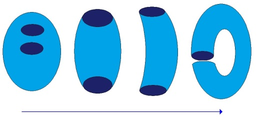

<!-- id: s9-21-0058 -->

Cela n’est pas nouveau, simplement, je voudrais bien articuler pour vous le résultat. Le résultat d’abord, c’est que s’il y a quelque chose qui, pour nous, supporte l’intuition du tore, c’est ça : un *macaroni* qui se rejoint, qui se mord la queue. C’est ce qu’il y a de plus exemplaire dans la fonction du trou, il y en a un *au milieu* du *macaroni* et il y en a un « *courant d’air* », ce qui fait qu’en passant à travers du cerceau qu’il forme…

<!-- id: s9-21-0059 -->

Il y a un trou qui fait communiquer l’intérieur avec l’intérieur, et puis il y en a un autre, plus formidable encore, qui met un *trou* au cœur de la surface, qui est là *trou*, tout en étant en plein exté­rieur. L’image du forage est introduite, car ce que nous appelons *trou*, c’est cela, c’est ce couloir qui s’enfoncerait dans une épaisseur \[a\], image fonda­mentale qui, quant à la géométrie du monde sensible, n’a jamais été suffisamment distinguée, et puis l’autre *trou* \[b\], qui est le trou central de la surface, à savoir le trou que j’appellerai « *le trou courant d’air* ».

<!-- id: s9-21-0060 -->

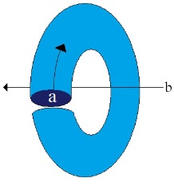

<!-- id: s9-21-0061 -->

Ce que je prétends avancer pour poser nos problèmes, c’est que ce « *trou courant d’air* » irréductible, si nous le cernons d’une coupure, c’est proprement là que se tient, dans les effets de la fonction signifiante, *(a)* l’objet en tant que tel. Ce qui veut dire que l’objet est raté, puisqu’il ne saurait en aucun cas y avoir là que le contour de l’objet, dans tous les sens que vous pouvez donner au mot « *contour* ». Une autre possibilité s’ouvre encore, qui pour nous vivifie, donne son intérêt à la comparaison structurante et structurale de ces surfaces, c’est que la coupure peut, *en surface*, s’articuler autrement.

<!-- id: s9-21-0062 -->

Sur le trou ici dessiné à la surface de la sphère, nous pouvons énoncer, formuler, souhaiter, que chaque point soit conjoint à son point antipodique, que sans nulle division de la béance, la béance s’organise en surface de cette façon qui l’épuise complètement sans le *medium* de cette divi­sion intermédiaire.

<!-- id: s9-21-0063 -->

 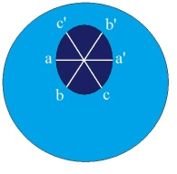

<!-- id: s9-21-0064 -->

Je vous l’ai montré la dernière fois, et je vous le remontrerai : ceci nous donne la surface quali­fiée de *bonnet ou* de *cross-cap.*

<!-- id: s9-21-0065 -->

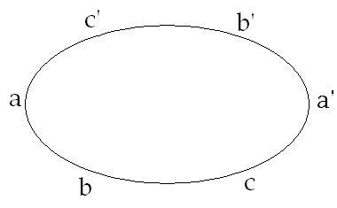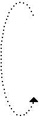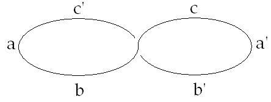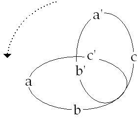

<!-- id: s9-21-0066 -->

> \(1\) (2) (3)

<!-- id: s9-21-0067 -->

À savoir quelque chose dont il convient que vous n’oubliiez pas que l’image que je vous ai donnée n’est qu’une image à proprement parler tordue, puisque ce qui semble à tout un chacun qui pour la première fois a à y réfléchir, ce qui y fait obstacle, c’est la question de cette fameuse ligne d’appa­rente pénétration de la surface à travers elle-même, qui est nécessaire pour la représenter dans notre espace. Ceci, que je désigne ici d’une façon tremblée \[ligne de pénétration\] est fait pour indiquer qu’il faut la considérer comme vacillante, non pas fixée.

<!-- id: s9-21-0068 -->

En d’autres termes, nous n’avons jamais à tenir compte de tout ce qui se promène ici d’un côté, à l’extérieur de la surface, qui ne saurait passer à l’extérieur de ce qui est de l’autre côté - *puisqu’il n’y a pas de réelle rencontre des faces -* mais au contraire ne saurait passer que de l’autre côté, *à l’intérieur* donc de l’autre face, je dis l’autre, *par rapport à l’observateur ici placé* \[*flèche bleue*\].

<!-- id: s9-21-0069 -->

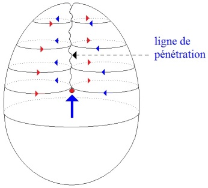

<!-- id: s9-21-0070 -->

Donc, de représenter les choses ainsi, concernant cette forme de surface, ne tient qu’à une certaine incapacité des formes intuitives de l’espace à 3 dimen­sions pour permettre le support d’une image qui rende réellement compte de la continuité obtenue sous le nom de cette nouvelle surface dite *cross-cap,* le bon­net en question.

<!-- id: s9-21-0071 -->

En d’autres termes qu’est-ce que *cette surface* soutient ? Nous l’appellerons - puisque ce sont là *les thèses* que j’avance d’abord, et qui nous permettrons ensuite de donner son sens à l’usage que je vous proposerai de faire de ces diverses formes - nous l’appellerons, cette surface, non pas *le trou* - car comme vous le voyez *il y en a au moins un qu’elle escamote, qui disparaît* *com­plètement dans sa forme -* mais « *la place du trou* »*.*

<!-- id: s9-21-0072 -->

Cette surface ainsi structurée est particulièrement propice à faire fonctionner devant nous cet élément le plus insaisissable qui s’appelle *le désir* en tant que tel, autrement dit *le manque*. Il reste pourtant que pour cette *surface* qui comble *la béance*, malgré l’apparence qui fait de tous ces points - que nous appellerons si vous le voulez *antipodiques* - des points équivalents, ils ne peuvent néanmoins fonction­ner dans cette équivalence antipodique que s’il y a deux points privilégiés. Ceux-ci sont ici représentés :

<!-- id: s9-21-0073 -->

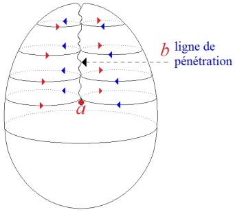

<!-- id: s9-21-0074 -->

par ce tout petit rond \[a\] sur lequel m’a déjà interrogé la pers­picacité d’un de mes auditeurs :

<!-- id: s9-21-0075 -->

« *Qu’est-ce que vous voulez en effet représenter ainsi par ce tout petit rond ?* »

<!-- id: s9-21-0076 -->

Bien sûr, ce n’est d’aucune façon quelque chose d’équi­valent au trou central du tore, puisque tout ce qui, à quelque niveau que vous vous placiez de ce point même privilégié, tout ce qui s’échange d’un côté à l’autre de la figure, ici passera par cette fausse décussation[^169] \[b\], ce *chiasma* ou croisement, qui en fait la structure.

<!-- id: s9-21-0077 -->

Néan­moins, ce qui est ainsi indiqué par cette forme ainsi encerclée n’est pas autre chose que la pos­sibilité au-dessous, si l’on peut s’exprimer ainsi, de ce point, de passer d’une surface extérieure à l’autre. C’est aussi la nécessité d’indiquer qu’un cercle non privilégié sur cette surface \[a\] :

<!-- id: s9-21-0078 -->

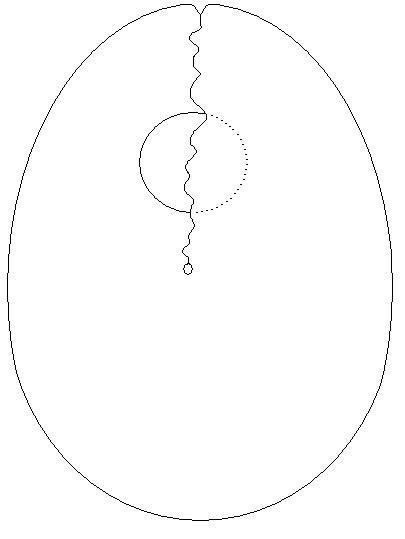 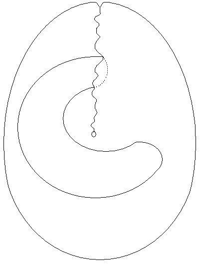 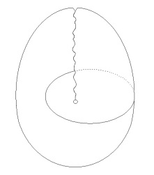

<!-- id: s9-21-0079 -->

> \[a\] \[b\] \[c\]

<!-- id: s9-21-0080 -->

un cercle réductible, si vous le faites glisser, si vous l’extrayez de son apparence de mi-occultation, au-delà de la ligne apparemment, ici, de recroisement et de pénétration, pour l’amener à s’étendre, à se développer ainsi vers la moitié infé­rieure de la figure \[b\] et donc à s’isoler ici en une forme à l’extérieur de la figure, devra toujours ici contourner quelque chose qui ne lui permet pas, en aucune façon, de se transformer en ce qui serait son autre forme, la forme privilégiée d’un cercle en tant qu’il fait le tour du point privilégié et qu’il doit se figurer ainsi \[c\] sur la surface en question.

<!-- id: s9-21-0081 -->

Celle-ci, en effet, d’aucune façon ne saurait lui être équivalente, puisque cette forme est quelque chose qui passe autour du point privilégié, du point struc­tural autour duquel est supportée toute la structure de la surface ainsi définie. Ce point double et point simple à la fois, autour duquel est supportée la possibilité même de *la structure entrecroisée du bonnet* *ou du cross-cap*, ce point, c’est par lui que nous symbolisons ce qui peut introduire *un objet(a) quel­conque à la place du trou*.

<!-- id: s9-21-0082 -->

Ce point privilégié, nous en connaissons *les fonctions et la nature* : c’est le *phallus*, le *phallus* pour autant que c’est par lui, comme opé­rateur, qu’un *objet(a)* peut être mis à la place même où nous ne saisissons dans une autre structure \[*le tore*\] que son contour. C’est là la valeur exem­plaire de la structure du cross-cap que j’essaie d’articuler devant vous : la place du trou, c’est au principe ce point d’une structure spéciale, en tant qu’il s’agit de le distinguer des autres formes de points, celui-ci par exemple, défini par le recoupement d’une *coupure sur elle-même*, première forme possible à donner à mon *huit intérieur*.

<!-- id: s9-21-0083 -->

<!-- id: s9-21-0084 -->

Nous coupons quelque chose dans un papier, par exemple, et un point sera défini par le fait que la coupure repasse sur l’endroit déjà coupé. Nous savons bien que ceci n’est nullement nécessaire pour que la coupure ait sur la surface une action complètement définissable et y introduise ce *change­ment* dont il s’agit que nous prenions le support pour imager certains effets du signifiant. Si nous prenons un tore et le coupons ainsi :

<!-- id: s9-21-0085 -->

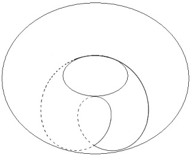 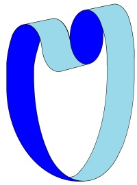

<!-- id: s9-21-0086 -->

ça fait cette forme que nous avons ici dessinée. Passant de l’autre côté du tore, vous voyez bien qu’à aucun moment cette *coupure* ne se rejoint *elle-même*. Faites-en l’expérience sur quelque vieille chambre à air, vous verrez ce que cela donnera : cela donnera une surface conti­nue, organisée de telle sorte qu’elle se retourne deux fois sur elle-même avant de se rejoindre. Si elle ne s’était retournée qu’une fois, ce serait une *surface de Mœbius*. Comme elle se retourne deux fois, cela fait une surface à deux faces, qui n’est pas identique à celle que je vous ai montrée l’autre jour après section de la *surface de Mœbius*, puisque celle-là se retourne trois fois et une fois différemment encore.

<!-- id: s9-21-0087 -->

Mais l’intérêt, c’est de voir qu’est-ce qu’est exactement ce point privilégié en tant que, comme tel, il intervient, il spécifie le lambeau de surface sur lequel il demeure, où il reste irré­ductiblement, lui donnant l’accent particulier qui lui permet, pour nous, à la fois de désigner la fonction selon laquelle un objet là depuis tou­jours est, avant même l’introduction des reflets, des apparences que nous en avons eues sous la forme d’images, l’objet du désir. Cet objet, il n’est à prendre que dans *les effets* pour nous *de la fonction du signifiant*, et cependant on ne fait que retrouver en lui sa destination de toujours.

<!-- id: s9-21-0088 -->

Comme objet, c’est le seul objet absolument autonome, primordial par rapport au sujet, décisif par rapport à lui, au point que ma relation à cet objet est en quelque sorte à inverser :

<!-- id: s9-21-0089 -->

- que, si, dans *le fantasme*, le sujet - par un mirage en tous points parallèle à celui de *l’imagination du stade du miroir*, quoique d’un autre ordre - s’imagine, de par *l’effet* de ce qui le constitue comme sujet, c’est-à-dire *l’effet du signifiant,* supporter l’objet qui vient pour lui combler le manque, le trou de l’Autre - et c’est cela le fantasme,

<!-- id: s9-21-0090 -->

- inversement, peut-on dire que toute *la coupure du sujet*, ce qui dans le monde le constitue comme séparé, comme rejeté, lui est imposée par une détermination non plus subjective, allant du sujet vers l’objet, mais objective, de l’objet vers le sujet, lui est imposée par *l’objet(a)*, mais en tant qu’au cœur de cet *objet(a)* il y a *ce point central* - ce *point tourbillon* par où l’objet sort d’un au-delà du nœud imaginaire, idéaliste, sujet-objet qui a fait jusqu’ici depuis toujours l’impasse de la pensée - *ce point central* qui, de cet au­-delà, promeut l’objet comme objet du désir.

<!-- id: s9-21-0091 -->

C’est ce que nous poursuivrons la prochaine fois.

## Notes

[^162]: Le *dictum de omni et nullo* est un principe logique qui gouverne les deux formes de la déduction. Il est fondé sur le principe d’identité ou sur le principe

    de non contradiction. L<u>e *dictum de omni*</u> : ce qui est dit d’un sujet pris universellement et distributivement (tous ses inférieurs) doit être dit également de tous

    ses inférieurs (tout ce qui se trouve compris sous ce sujet). L<u>e *dictum de nullo*</u> : ce qui est nié d’un sujet pris universellement et distributivement (avec tous ses

    inférieurs) doit être nié également de tous ses inférieurs. Cf. J.S. Mill : [*Système de logique déductive et inductive*](http://classiques.uqac.ca/classiques/Mill_john_stuart/systeme_logique/livre_2/systeme_de_logique_2.pdf), livre II, Ch.2, §2.

[^163]: Charles Sanders Peirce : *Œuvres*, éd. Cerf, 2003.

[^164]: Bossuet : *Sermons sur la mort*, Garnier Flammarion, 1970.

[^165]: Séminaire1959-60 : *L’éthique*...

[^166]: Xavier Bichat : [*Recherches physiologiques sur la vie et la mort*](http://gallica.bnf.fr/ark:/12148/bpt6k87608q), Garnier Flammarion, 1994.

[^167]: Cf. Kjökkenmödding : Amas coquiller résultant de la consommation de mollusques par des populations néolithiques…

[^168]: Jean Nicod** :** *La géométrie dans le monde sensible*, PUF, 1962.

[^169]: Terme didactique. Croisement en manière d'x. La décussation des nerfs optiques. Point de décussation, s'est dit dans l'optique, pour foyer.
